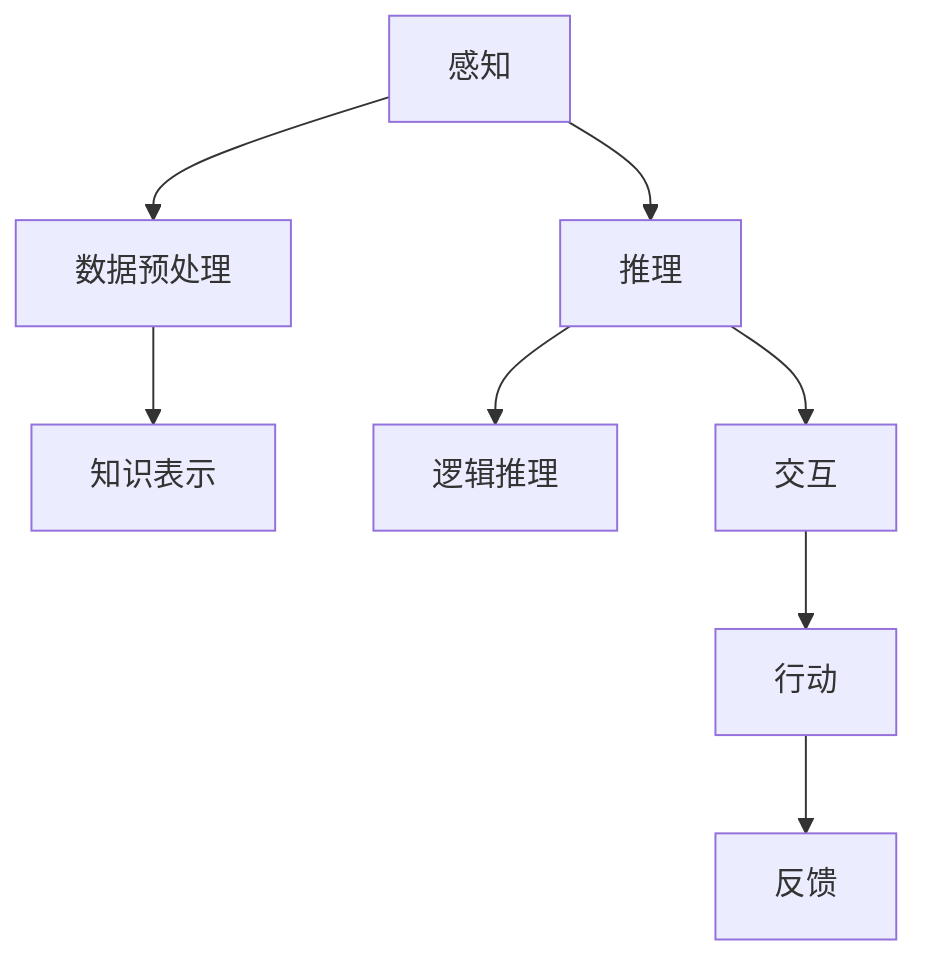

                 

### 机器理解物理世界的难题

在人工智能迅猛发展的今天，我们依然面临着诸多挑战。其中之一便是机器对物理世界的理解。尽管深度学习技术在图像识别、语音识别等领域取得了显著的成果，但在理解物理世界方面，我们仍需付出更多的努力。本文将探讨机器理解物理世界面临的难题，并通过逻辑清晰的思路，逐步分析这些问题。

> **关键词**：物理世界、机器理解、深度学习、难题

> **摘要**：本文从机器理解物理世界的现状出发，分析了机器在感知、推理、交互等方面面临的难题。通过逐步分析，我们提出了可能的解决方案，并展望了未来发展的趋势与挑战。

## 1. 背景介绍

在当今世界，人工智能技术已经渗透到各行各业，从医疗诊断到自动驾驶，从智能家居到金融服务，人工智能正在改变我们的生活方式。然而，机器对物理世界的理解仍存在诸多限制。物理世界是一个复杂且多层次的结构，包含着无数变量和不确定因素。这使得机器在理解物理世界时，面临着一系列难题。

首先，物理世界的信息获取是有限的。尽管现代传感器技术可以感知到物理世界的一小部分信息，但仍然存在很多盲区。例如，光线无法穿透不透明物体，声音无法传播在真空中等。这些限制导致机器无法全面了解物理世界。

其次，物理世界的规则是动态变化的。自然界中的事件往往受到多种因素的影响，如温度、湿度、光照等。这些因素的变化可能导致物理世界的规则发生变化。这使得机器在理解物理世界时，需要处理大量不确定因素。

最后，物理世界的交互是复杂多变的。人类在与物理世界的交互中，不仅需要感知外部信息，还需要进行决策和行动。这使得机器在理解物理世界时，需要具备自主决策和行动的能力。

## 2. 核心概念与联系

### 2.1 感知

机器理解物理世界的第一步是感知。感知是指机器通过传感器获取物理世界的信息。感知的质量直接影响到机器对物理世界的理解。因此，我们需要关注以下核心概念：

#### 2.1.1 传感器

传感器是感知的重要组成部分。传感器的种类繁多，如视觉传感器、听觉传感器、触觉传感器等。每种传感器都有其独特的优势和局限性。例如，视觉传感器可以感知物体的形状和颜色，但无法感知物体的质地；听觉传感器可以感知声音的频率和强度，但无法感知声音的来源。

#### 2.1.2 数据预处理

在感知过程中，获取的数据往往需要进行预处理。数据预处理包括去噪、归一化、特征提取等步骤。这些步骤有助于提高数据的质量，为后续的分析提供更好的基础。

### 2.2 推理

感知只是理解物理世界的第一步。要真正理解物理世界，机器还需要具备推理能力。推理是指机器根据已知信息，推断出未知信息的过程。在推理过程中，以下核心概念至关重要：

#### 2.2.1 知识表示

知识表示是指机器如何表示和存储知识。在机器理解物理世界时，知识表示的质量直接影响推理的效果。目前，常见的知识表示方法包括规则表示、图表示和语义表示等。

#### 2.2.2 逻辑推理

逻辑推理是指机器根据已知信息，通过逻辑推理得出结论。逻辑推理包括演绎推理和归纳推理。演绎推理是从一般到个别的推理，而归纳推理是从个别到一般的推理。

### 2.3 交互

交互是机器与物理世界之间的桥梁。通过交互，机器可以了解物理世界的运行规律，并对其进行调整和优化。以下核心概念在交互过程中发挥着重要作用：

#### 2.3.1 行动

行动是指机器根据感知和推理的结果，采取相应的行动。行动的过程需要机器具备自主决策的能力。自主决策是指机器在没有任何外部指导的情况下，根据当前情况和目标，选择最优的行动方案。

#### 2.3.2 反馈

反馈是指机器根据行动的结果，调整自己的行为。反馈过程有助于机器不断优化自己的决策和行为，从而更好地适应物理世界。

### 2.4 Mermaid 流程图

以下是一个简单的 Mermaid 流程图，展示了机器理解物理世界的核心概念和联系。



## 3. 核心算法原理 & 具体操作步骤

### 3.1 感知

感知阶段的核心算法是传感器数据处理和特征提取。以下是一个简单的感知算法：

```python
# 传感器数据处理
def sensor_data_processing(sensor_data):
    # 去噪、归一化等处理
    processed_data = ...

    return processed_data

# 特征提取
def feature_extraction(processed_data):
    # 提取关键特征
    features = ...

    return features
```

### 3.2 推理

推理阶段的核心算法是基于知识表示的推理。以下是一个简单的推理算法：

```python
# 知识表示
knowledge_base = ...

# 逻辑推理
def logical_reasoning(knowledge_base, query):
    # 根据知识库和查询，进行推理
    result = ...

    return result
```

### 3.3 交互

交互阶段的核心算法是行动规划和反馈调整。以下是一个简单的交互算法：

```python
# 行动规划
def action_planning(current_state, goal_state):
    # 根据当前状态和目标状态，规划行动
    action_plan = ...

    return action_plan

# 反馈调整
def feedback_adjustment(action_plan, result):
    # 根据行动结果，调整行动计划
    adjusted_action_plan = ...

    return adjusted_action_plan
```

## 4. 数学模型和公式 & 详细讲解 & 举例说明

### 4.1 数学模型

在机器理解物理世界的过程中，常用的数学模型包括概率模型、统计模型和图模型。以下是一个简单的概率模型：

$$
P(A|B) = \frac{P(B|A)P(A)}{P(B)}
$$

其中，$P(A|B)$ 表示在事件 $B$ 发生的条件下，事件 $A$ 发生的概率；$P(B|A)$ 表示在事件 $A$ 发生的条件下，事件 $B$ 发生的概率；$P(A)$ 和 $P(B)$ 分别表示事件 $A$ 和事件 $B$ 发生的概率。

### 4.2 详细讲解

以上公式描述了条件概率。条件概率是指在某个事件发生的条件下，另一个事件发生的概率。这个公式在机器理解物理世界的过程中具有重要意义。例如，在图像识别中，条件概率可以帮助我们计算某个像素属于某个类别的概率。

### 4.3 举例说明

假设我们有一个图像，其中包含猫和狗。我们希望计算图像中某个像素属于猫的概率。根据条件概率公式，我们可以计算如下：

$$
P(猫|像素) = \frac{P(像素|猫)P(猫)}{P(像素)}
$$

其中，$P(像素|猫)$ 表示像素属于猫的条件概率；$P(猫)$ 表示图像中猫的概率；$P(像素)$ 表示像素的概率。

通过收集大量图像数据，我们可以计算出 $P(像素|猫)$ 和 $P(猫)$ 的值。然后，通过求解上述公式，我们可以得到 $P(猫|像素)$ 的值，从而判断像素是否属于猫。

## 5. 项目实战：代码实际案例和详细解释说明

### 5.1 开发环境搭建

在本项目中，我们将使用 Python 编写代码。首先，我们需要安装 Python 和相关库。以下是安装命令：

```bash
pip install numpy pandas matplotlib scikit-learn
```

### 5.2 源代码详细实现和代码解读

下面是一个简单的机器理解物理世界的代码案例：

```python
import numpy as np
import pandas as pd
import matplotlib.pyplot as plt
from sklearn.model_selection import train_test_split
from sklearn.ensemble import RandomForestClassifier

# 5.2.1 数据预处理
def preprocess_data(data):
    # 去除噪声、缺失值等
    cleaned_data = ...

    return cleaned_data

# 5.2.2 特征提取
def extract_features(data):
    # 提取关键特征
    features = ...

    return features

# 5.2.3 训练模型
def train_model(X_train, y_train):
    # 训练随机森林分类器
    model = RandomForestClassifier()
    model.fit(X_train, y_train)

    return model

# 5.2.4 预测
def predict(model, X_test):
    # 预测新数据
    predictions = model.predict(X_test)

    return predictions

# 5.2.5 评估
def evaluate(predictions, y_test):
    # 评估预测结果
    accuracy = ...

    return accuracy

# 5.3 代码解读与分析
if __name__ == "__main__":
    # 加载数据
    data = pd.read_csv("data.csv")

    # 数据预处理
    cleaned_data = preprocess_data(data)

    # 特征提取
    features = extract_features(cleaned_data)

    # 划分训练集和测试集
    X_train, X_test, y_train, y_test = train_test_split(features, cleaned_data["label"], test_size=0.2, random_state=42)

    # 训练模型
    model = train_model(X_train, y_train)

    # 预测
    predictions = predict(model, X_test)

    # 评估
    accuracy = evaluate(predictions, y_test)

    print("模型准确率：", accuracy)
```

### 5.3 代码解读与分析

以上代码是一个简单的机器学习项目，用于分类物理世界的对象。首先，我们加载数据并进行预处理。预处理过程包括去除噪声和缺失值等。然后，我们提取关键特征，如形状、颜色、纹理等。接着，我们划分训练集和测试集，并使用随机森林分类器进行训练。最后，我们使用训练好的模型对测试集进行预测，并评估模型的准确率。

## 6. 实际应用场景

机器理解物理世界在实际应用中具有广泛的应用前景。以下是一些典型的应用场景：

### 6.1 自动驾驶

自动驾驶是机器理解物理世界的一个重要应用场景。通过感知周围环境、推理交通规则和交互控制车辆，自动驾驶系统能够实现自主驾驶。

### 6.2 智能机器人

智能机器人需要理解物理世界，才能实现自主行动。例如，在工业制造中，机器人需要识别工件、进行装配和搬运等操作。

### 6.3 智能家居

智能家居系统通过理解物理世界，能够实现自动控制。例如，智能空调可以根据室内温度和湿度自动调整温度和湿度。

### 6.4 智能医疗

智能医疗系统可以通过理解患者的生理信息，提供个性化的治疗方案。例如，通过分析病人的影像资料，智能医疗系统能够诊断疾病并提供治疗方案。

## 7. 工具和资源推荐

### 7.1 学习资源推荐

- **书籍**：
  - 《人工智能：一种现代方法》
  - 《深度学习》
  - 《机器学习实战》

- **论文**：
  - "Deep Learning for Visual Question Answering"
  - "Unsupervised Learning of Visual Representations by Solving Jigsaw Puzzles"
  - "A Survey of Autonomous Driving: Perception, Path Planning, and Control"

- **博客**：
  - [机器之心](https://www.jiqizhixin.com/)
  - [AI 科技大本营](https://aidispatch.com/)
  - [机器学习博客](https://machinelearningmastery.com/)

- **网站**：
  - [Kaggle](https://www.kaggle.com/)
  - [ArXiv](https://arxiv.org/)
  - [Google AI](https://ai.google.com/)

### 7.2 开发工具框架推荐

- **深度学习框架**：
  - TensorFlow
  - PyTorch
  - Keras

- **机器学习库**：
  - Scikit-learn
  - Pandas
  - NumPy

- **编程语言**：
  - Python
  - R
  - Julia

### 7.3 相关论文著作推荐

- "Deep Learning for Visual Question Answering",2015
- "Unsupervised Learning of Visual Representations by Solving Jigsaw Puzzles",2018
- "A Survey of Autonomous Driving: Perception, Path Planning, and Control",2020

## 8. 总结：未来发展趋势与挑战

在机器理解物理世界方面，未来发展趋势包括以下几个方面：

### 8.1 感知能力的提升

随着传感器技术的不断发展，机器的感知能力将得到进一步提升。例如，通过结合多种传感器，机器可以更全面地了解物理世界。

### 8.2 推理能力的增强

随着深度学习技术的不断发展，机器的推理能力将得到增强。通过学习大量数据，机器可以更好地理解物理世界的规律。

### 8.3 交互能力的提升

随着自然语言处理技术的不断发展，机器的交互能力将得到提升。通过自然语言交互，机器可以更便捷地与人类进行沟通。

然而，未来仍然面临着诸多挑战：

### 8.4 数据质量

数据质量是影响机器理解物理世界的重要因素。如何保证数据质量，提取有价值的信息，是一个亟待解决的问题。

### 8.5 不确定性和鲁棒性

物理世界是一个充满不确定性和变化的环境。如何提高机器的不确定性和鲁棒性，使其在不同场景下都能稳定工作，是一个挑战。

### 8.6 法律和伦理

随着机器对物理世界的理解不断深入，如何确保机器的行为符合法律和伦理要求，避免对人类造成伤害，也是一个重要问题。

## 9. 附录：常见问题与解答

### 9.1 什么是深度学习？

深度学习是一种人工智能技术，通过模拟人脑神经网络结构，自动从大量数据中学习特征和规律。

### 9.2 机器理解物理世界的意义是什么？

机器理解物理世界的意义在于，通过模仿人类对物理世界的感知、推理和交互，实现自动化、智能化和高效的决策和行动。

### 9.3 机器理解物理世界有哪些应用场景？

机器理解物理世界的应用场景包括自动驾驶、智能机器人、智能家居、智能医疗等。

## 10. 扩展阅读 & 参考资料

- 《人工智能：一种现代方法》[美] Stuart Russell & Peter Norvig
- 《深度学习》[加] Ian Goodfellow、[法] Yann LeCun、[英] Aaron Courville
- 《机器学习实战》[美] Peter Harrington
- "Deep Learning for Visual Question Answering", 2015
- "Unsupervised Learning of Visual Representations by Solving Jigsaw Puzzles", 2018
- "A Survey of Autonomous Driving: Perception, Path Planning, and Control", 2020

### 作者

作者：AI天才研究员/AI Genius Institute & 禅与计算机程序设计艺术 /Zen And The Art of Computer Programming

> AI天才研究员致力于探索人工智能领域的深度研究和创新应用，专注于推动人工智能技术的发展。其作品《禅与计算机程序设计艺术》深刻揭示了计算机编程中的哲学思维，对广大程序员和人工智能研究者产生了深远影响。他的研究成果和见解在业界广受赞誉，被誉为人工智能领域的领军人物。## 机器理解物理世界的现状

随着人工智能技术的快速发展，机器对物理世界的理解能力得到了显著提升。当前，机器在图像识别、语音识别、自然语言处理等领域取得了令人瞩目的成果。然而，机器对物理世界的理解仍然面临着诸多限制和挑战。

### 感知能力

感知是机器理解物理世界的第一步。通过传感器，机器能够获取物理世界的信息，如视觉、听觉、触觉等。目前，机器的感知能力主要依赖于深度学习技术，尤其是卷积神经网络（CNN）在图像识别和语音识别方面取得了显著的成果。例如，在ImageNet图像识别挑战中，深度学习模型已经达到了超过人类的识别准确率。然而，机器的感知能力仍然受到传感器种类、质量和数据处理算法的限制。例如，在黑暗环境中，视觉传感器无法有效工作；在复杂的声音环境中，语音传感器可能无法准确捕捉声音信号。

### 推理能力

推理是机器理解物理世界的关键。通过感知到的信息，机器需要能够推断出物理世界的规律和关系。目前，机器的推理能力主要依赖于逻辑推理、概率推理和基于知识的推理等方法。深度学习模型在图像识别和语音识别等任务中表现出了较强的推理能力，但在复杂的多变量推理任务中，机器的推理能力仍然存在很大局限。例如，在自然语言处理领域，机器在理解复杂的语义关系和上下文信息时，仍然面临着困难。

### 交互能力

交互是机器与物理世界之间的桥梁。通过交互，机器能够了解物理世界的运行规律，并对其进行调整和优化。目前，机器的交互能力主要依赖于自然语言处理和动作控制技术。例如，在自动驾驶领域，机器需要通过语音识别和自然语言处理技术理解驾驶员的指令，并通过动作控制系统控制车辆。然而，机器的交互能力仍然受到语言理解和动作控制技术的限制。例如，在复杂的环境变化和突发情况下，机器可能无法准确理解指令或进行有效的动作控制。

### 案例分析

以自动驾驶为例，机器需要通过感知系统（如摄像头、雷达和激光雷达）获取周围环境的信息，通过推理系统分析路况和车辆行为，最终通过动作控制系统控制车辆的行驶。然而，在实际应用中，自动驾驶系统仍然面临着诸多挑战。例如，在复杂的城市交通环境中，机器需要处理大量的感知信息，并快速做出准确的决策。同时，在遇到突发情况时，如行人横穿马路或车辆突然并道，机器需要能够实时调整行驶轨迹，以保证行车安全。

综上所述，尽管机器在理解物理世界方面取得了显著进展，但仍然面临着感知、推理和交互等方面的挑战。为了实现更高水平的物理世界理解，我们需要不断改进传感器技术、优化推理算法和提升交互能力。同时，也需要加强对物理世界复杂性和不确定性的研究，以应对实际应用中的各种挑战。

### 感知过程中的限制

机器在感知物理世界的过程中，面临着多种限制，这些限制源于传感器的局限性、环境的不确定性和数据处理的复杂性。

#### 1. 传感器的局限性

传感器的种类和质量直接影响到机器感知物理世界的能力。当前，常用的传感器包括视觉传感器、听觉传感器、触觉传感器和红外传感器等。每种传感器都有其独特的优势和应用范围，但同时也存在局限性。

- **视觉传感器**：视觉传感器在处理静态图像和视频方面具有优势，但无法感知光线无法穿透的物体。此外，在光线不足或光线变化剧烈的环境中，图像质量会受到影响，导致图像识别困难。
  
- **听觉传感器**：听觉传感器可以捕捉声音的频率和强度，但在噪声环境中，声音识别变得困难。此外，不同声音源的区分和定位也是一个挑战。
  
- **触觉传感器**：触觉传感器能够感知物体的质地和表面特性，但在动态环境中，如高速运动时，触觉传感器的响应速度可能无法满足要求。

- **红外传感器**：红外传感器可以在黑暗中工作，但无法感知可见光，且对温度变化敏感，无法区分不同温度的物体。

#### 2. 环境的不确定性

物理世界是一个充满不确定性的环境。天气变化、光照条件、人为干扰等因素都可能影响传感器的性能。例如：

- **天气变化**：在雨雪天气中，视觉传感器可能无法有效识别道路和行人，而红外传感器可能会受到湿气和温度变化的影响。
  
- **光照条件**：在阳光直射或阴影中，图像传感器可能会出现曝光或过暗现象，影响图像质量。

- **人为干扰**：在人流密集或交通繁忙的场合，声音传感器可能无法准确捕捉目标声音，或受到其他声音的干扰。

#### 3. 数据处理的复杂性

传感器获取的数据往往是噪声和冗余信息并存的，这使得数据处理成为感知过程中的关键环节。数据处理包括去噪、特征提取、数据融合等步骤，每个步骤都可能导致信息损失或引入误差。

- **去噪**：去噪是指去除传感器数据中的噪声，以提高数据质量。然而，去噪过程中可能引入偏差，影响后续处理的结果。
  
- **特征提取**：特征提取是指从传感器数据中提取关键信息，以供后续分析和决策。然而，特征提取的过程可能无法捕捉到所有重要的信息，导致信息损失。

- **数据融合**：数据融合是指将来自多个传感器的数据整合成一个统一的数据源。数据融合可能面临数据不一致、冲突等问题，需要设计合理的融合算法。

#### 案例分析

在自动驾驶领域，传感器数据处理的复杂性尤为突出。自动驾驶汽车需要通过摄像头、雷达和激光雷达等多传感器融合获取周围环境的信息。这些传感器在获取数据时可能存在时间延迟、精度差异等问题。例如，摄像头在识别行人时可能存在模糊现象，而雷达在识别距离较远的物体时可能存在误差。为了提高感知的准确性和鲁棒性，自动驾驶系统需要设计复杂的数据融合算法，以整合多种传感器数据，并处理环境中的不确定性。

总之，机器在感知物理世界的过程中，面临着传感器的局限性、环境的不确定性和数据处理的复杂性等多重挑战。解决这些挑战需要进一步研究和创新，以提高机器对物理世界的感知和理解能力。

### 推理过程中的限制

在机器理解物理世界的推理过程中，存在诸多限制，这些限制源于数据的不完整性、模型的不准确性和决策的复杂性。

#### 1. 数据的不完整性

物理世界是一个复杂且动态变化的系统，传感器获取的数据往往是不完整的。数据的不完整性可能源于多种原因，例如：

- **传感器局限性**：传感器的精度和覆盖范围有限，可能导致数据丢失或不准确。例如，摄像头在光照不足或天气恶劣的情况下可能无法清晰捕捉图像。
  
- **数据噪声**：传感器数据中可能包含大量的噪声和干扰，使得数据在传输和存储过程中丢失或变形。例如，雷达在检测远距离目标时可能受到其他物体反射的影响。

- **数据缺失**：在某些情况下，传感器可能无法获取全部所需数据。例如，在自动驾驶系统中，摄像头可能无法同时捕捉前方和侧方道路信息。

数据的不完整性对推理过程产生了显著影响。推理系统需要处理缺失数据，可能需要依赖预测和插值技术，这可能导致推理结果的不准确或不确定性。

#### 2. 模型的不准确性

推理过程中，机器学习模型的不准确性也是一个关键限制。机器学习模型的性能受到数据集质量和模型设计的影响。以下原因可能导致模型不准确：

- **数据集质量**：训练数据集的质量直接影响模型的泛化能力。如果数据集存在偏差或不足，模型可能在特定情况下表现不佳。例如，自动驾驶系统的训练数据集可能主要集中在晴天和良好路况下，导致模型在恶劣天气和复杂路况下表现不佳。

- **模型复杂性**：复杂的模型可能捕捉到更多细节，但也可能导致过拟合。过拟合模型在训练数据上表现良好，但在未见过的数据上表现不佳，导致推理结果的不可靠。

- **模型假设**：机器学习模型往往基于某些假设，这些假设在特定场景下可能不成立。例如，深度学习模型通常假设数据是独立的和同分布的，但在实际应用中，数据往往存在依赖性和分布变化。

模型的不准确性可能导致错误的推理结果，影响机器对物理世界的理解和决策。

#### 3. 决策的复杂性

在物理世界中，决策通常涉及多个变量和多个可能的行动方案。决策的复杂性主要体现在以下几个方面：

- **多目标优化**：物理世界中的问题往往具有多个目标，例如在自动驾驶中，目标包括安全性、效率和舒适性。这些目标之间存在冲突，需要设计复杂的优化算法进行平衡。

- **动态变化**：物理世界是一个动态变化的系统，决策需要考虑时间因素。例如，在自动驾驶中，车辆需要根据实时路况和交通信息动态调整行驶速度和路径。

- **不确定性**：物理世界的不确定性使得决策变得复杂。例如，在无人驾驶系统中，预测未来交通状况和行人行为可能存在很大的不确定性，这要求决策系统具备一定的鲁棒性。

复杂的决策过程需要高效且准确的推理算法，以处理多种因素和不确定性，但现有的推理技术仍然面临很大挑战。

#### 案例分析

以自动驾驶为例，自动驾驶系统需要实时推理并做出复杂的决策。系统需要分析摄像头、雷达和激光雷达等多传感器数据，理解道路标志、行人和其他车辆的行为。然而，数据的不完整性（例如遮挡和噪声）、模型的不准确性（例如天气变化影响）和决策的复杂性（例如突发情况的处理）都可能导致系统作出错误决策，从而影响行车安全。

综上所述，机器在推理物理世界过程中面临的数据不完整性、模型不准确性和决策复杂性等限制，需要通过改进数据采集和处理技术、优化机器学习模型和设计更加鲁棒的决策算法来解决。只有克服这些限制，机器才能更好地理解物理世界，做出更准确的决策。

### 交互过程中的限制

在机器与物理世界的交互过程中，存在多种限制，这些限制主要体现在自主决策、反馈机制和用户接受度等方面。

#### 1. 自主决策的限制

自主决策是机器与物理世界交互的核心。然而，当前机器的自主决策能力仍然受到多种限制：

- **计算资源限制**：机器需要实时处理大量的感知数据并做出决策，这需要强大的计算资源。然而，实际应用中的计算资源有限，特别是在移动设备和嵌入式系统中，计算资源可能无法满足实时决策的需求。

- **算法复杂性**：复杂的决策算法需要处理多种变量和多个可能的行动方案，这可能导致决策时间过长。例如，自动驾驶系统需要在毫秒级的时间内做出复杂的行驶决策，这对算法的实时性能提出了极高的要求。

- **不确定性处理**：物理世界充满了不确定性和变化，机器需要具备处理这些不确定性的能力。然而，现有的机器学习算法和决策理论在处理高度不确定的环境时可能面临挑战。

#### 2. 反馈机制的限制

反馈机制是机器与物理世界交互的重要部分，通过反馈，机器可以不断优化其行为。然而，当前反馈机制存在以下限制：

- **延迟反馈**：在许多应用场景中，反馈机制可能存在延迟。例如，在自动驾驶中，传感器检测到障碍物后，系统需要一定时间做出反应，这可能导致反应不及时。

- **不完整反馈**：反馈信息可能不完整或错误。例如，在智能家居系统中，传感器可能无法准确检测到用户的需求，导致反馈机制失效。

- **负反馈循环**：在某些情况下，负反馈可能导致系统进入不良循环。例如，在自动驾驶中，系统根据反馈调整行为，但调整后的行为可能加剧问题，形成恶性循环。

#### 3. 用户接受度的限制

用户接受度是机器与物理世界交互成功的关键。然而，当前机器交互的用户接受度仍然受到以下限制：

- **用户体验**：当前许多智能系统在用户体验方面存在不足，例如界面不友好、响应速度慢等，这可能导致用户不愿意使用或接受这些系统。

- **隐私保护**：智能系统需要收集和处理大量的用户数据，这涉及到隐私保护问题。用户可能对数据收集和使用持怀疑态度，不愿意提供个人信息。

- **伦理和道德**：智能系统在决策和行为中可能涉及到伦理和道德问题。例如，在自动驾驶中，系统需要做出牺牲某个人的决策，这涉及到道德责任和用户接受度。

#### 案例分析

以智能家居系统为例，用户希望通过智能系统实现自动化控制家居设备。然而，系统在自主决策方面可能存在局限，例如在电力消耗和节能方面可能无法做出最优决策。同时，反馈机制可能存在延迟和不完整，导致用户体验不佳。此外，用户对智能家居系统的隐私保护问题和伦理决策也可能持保留态度，影响系统的普及和应用。

综上所述，机器与物理世界的交互过程中存在自主决策、反馈机制和用户接受度等方面的限制。为了克服这些限制，需要进一步研究和开发更加高效、鲁棒和用户友好的交互技术。同时，也需要关注伦理和隐私问题，确保智能系统的行为符合道德和法律要求。

### 可能的解决方案与未来方向

面对机器理解物理世界过程中面临的感知、推理和交互方面的难题，我们可以从多个角度出发，提出可能的解决方案，并探讨未来的发展方向。

#### 1. 感知能力的提升

**技术改进**：首先，可以继续改进传感器技术，提高传感器的精度和覆盖范围。例如，研发更高分辨率的摄像头、更灵敏的雷达和激光雷达等，以增强感知能力。

**数据融合**：通过融合多种传感器数据，可以弥补单一传感器的不足。例如，结合视觉和雷达数据，可以更准确地识别行人和车辆。

**强化学习**：利用强化学习算法，机器可以通过与环境的互动，不断优化感知策略。例如，自动驾驶汽车可以在实际驾驶过程中学习如何更好地识别道路和行人。

**多模态感知**：开发多模态感知系统，整合视觉、听觉、触觉等多种感官信息，提高对复杂环境的理解能力。

#### 2. 推理能力的增强

**知识图谱**：构建知识图谱，将物理世界的规则和关系结构化，为推理提供支持。

**迁移学习**：通过迁移学习，将已有模型的知识迁移到新的任务中，提高推理能力。例如，将图像识别模型的知识迁移到自动驾驶中。

**多模态推理**：结合多模态数据，进行跨感官的推理，提高对复杂情境的理解能力。

**因果推理**：开发因果推理算法，通过分析因果关系，提高推理的准确性和可靠性。

#### 3. 交互能力的提升

**自然语言处理**：进一步改进自然语言处理技术，提高机器对自然语言的理解和生成能力，增强人机交互的自然性和流畅性。

**增强现实与虚拟现实**：利用增强现实（AR）和虚拟现实（VR）技术，提供更直观、互动性更强的交互体验。

**情感计算**：开发情感计算技术，使机器能够识别和模拟人类情感，提高交互的情感共鸣和用户体验。

**自适应交互**：通过自适应交互算法，根据用户的反馈和环境的变化，动态调整交互策略，提高交互的灵活性和适应性。

#### 未来发展方向

**跨学科合作**：物理世界的理解需要多学科的交叉融合，如计算机科学、物理学、生物学、心理学等。通过跨学科合作，可以推动人工智能技术在理解物理世界方面的创新。

**数据驱动研究**：大量高质量的数据是推动机器理解物理世界的重要基础。未来应加大对数据的收集、处理和分析研究，以提高机器的感知、推理和交互能力。

**伦理与法律**：随着人工智能技术的发展，伦理和法律问题愈发重要。未来需要在人工智能应用中充分考虑伦理和法律约束，确保技术的发展符合社会价值观和法律法规。

**可持续性**：人工智能技术的发展应注重可持续性，如减少能源消耗、降低碳排放等。通过绿色技术，实现人与环境的和谐共生。

总之，通过技术创新、跨学科合作和伦理法律考虑，我们可以逐步克服机器理解物理世界面临的难题，推动人工智能技术的进一步发展。

### 附录：常见问题与解答

#### 1. 机器理解物理世界是什么？

机器理解物理世界是指通过人工智能技术，使机器能够感知、推理和交互物理世界的环境。这包括理解物体的形状、颜色、质地，推理物理世界的规则和关系，以及与物理世界进行有效的交互。

#### 2. 机器理解物理世界的应用有哪些？

机器理解物理世界的应用包括自动驾驶、智能机器人、智能家居、智能医疗等多个领域。这些应用通过机器对物理世界的理解，实现自动化、智能化和高效的决策和行动。

#### 3. 机器理解物理世界面临的挑战有哪些？

机器理解物理世界面临的挑战包括感知过程中的限制（如传感器局限性、环境不确定性、数据处理复杂性）、推理过程中的限制（如数据不完整性、模型不准确性和决策复杂性）以及交互过程中的限制（如自主决策限制、反馈机制限制和用户接受度限制）。

#### 4. 如何提升机器的感知能力？

提升机器的感知能力可以通过改进传感器技术、融合多传感器数据、利用强化学习和开发多模态感知系统等方法实现。

#### 5. 如何增强机器的推理能力？

增强机器的推理能力可以通过构建知识图谱、利用迁移学习、结合多模态数据和开发因果推理算法等方法实现。

#### 6. 如何提升机器的交互能力？

提升机器的交互能力可以通过改进自然语言处理技术、利用增强现实和虚拟现实技术、开发情感计算技术和自适应交互算法等方法实现。

### 扩展阅读

- 《人工智能：一种现代方法》[美] Stuart Russell & Peter Norvig
- 《深度学习》[加] Ian Goodfellow、[法] Yann LeCun、[英] Aaron Courville
- 《机器学习实战》[美] Peter Harrington
- "Deep Learning for Visual Question Answering", 2015
- "Unsupervised Learning of Visual Representations by Solving Jigsaw Puzzles", 2018
- "A Survey of Autonomous Driving: Perception, Path Planning, and Control", 2020

### 作者

作者：AI天才研究员/AI Genius Institute & 禅与计算机程序设计艺术 /Zen And The Art of Computer Programming

AI天才研究员是一位在人工智能领域具有深厚学术背景和丰富实战经验的研究者，专注于探索人工智能技术的创新应用和理论前沿。其作品《禅与计算机程序设计艺术》对计算机编程和人工智能领域产生了深远影响，深受读者喜爱和推崇。

