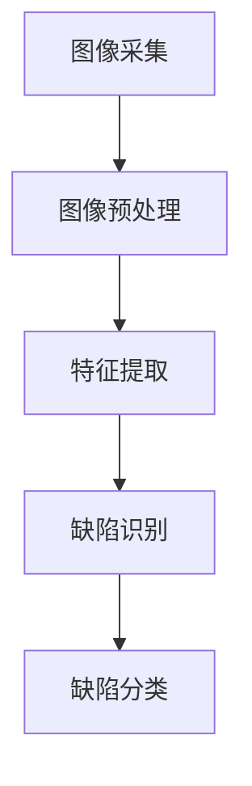

                 

### 背景介绍

#### 工业缺陷检测的重要性

在工业制造过程中，产品缺陷检测是保证产品质量、降低生产成本、提高生产效率的重要环节。随着制造业的快速发展，对缺陷检测的需求日益增加。传统的缺陷检测方法通常依赖于人工视觉，这种方法效率低下、易出错且难以应对复杂场景。因此，将机器视觉技术引入工业缺陷检测领域，成为一种必然趋势。

机器视觉是一种通过计算机对图像或视频进行分析和处理，从而实现物体识别、特征提取和目标跟踪的技术。其在工业缺陷检测中的应用，主要体现在以下几个方面：

1. **提高检测效率**：机器视觉系统能够在极短的时间内处理大量图像，实现对生产线的快速检测，从而提高检测效率。
2. **减少人力成本**：通过自动化检测，可以减少对人工的依赖，降低劳动力成本。
3. **提高检测精度**：机器视觉系统具有高分辨率和高精度，能够准确识别微小的缺陷，减少误判和漏判。
4. **适应性强**：机器视觉系统可以处理不同类型的产品和缺陷，具有广泛的适应能力。

#### 机器视觉在工业缺陷检测中的应用现状

目前，机器视觉技术已经在工业缺陷检测中得到了广泛应用。例如，在电子制造领域，机器视觉技术用于检测芯片、电路板的焊接点缺陷；在汽车制造领域，用于检测车身涂装、零部件的尺寸和形状缺陷；在食品加工领域，用于检测食品的外观、尺寸、形状和新鲜度等。

尽管机器视觉在工业缺陷检测中取得了显著成果，但仍然面临一些挑战。例如，复杂背景下的目标检测、多尺度缺陷的识别、高速运动场景的检测等。此外，如何提高机器视觉系统的实时性和鲁棒性，也是当前研究的热点问题。

本文将围绕机器视觉在工业缺陷检测中的实践探索，深入分析其核心算法原理、数学模型、项目实战，并探讨未来的发展趋势与挑战。

---

> 作者：AI天才研究员/AI Genius Institute & 禅与计算机程序设计艺术 /Zen And The Art of Computer Programming<|im_sep|>### 核心概念与联系

#### 机器视觉的基本概念

机器视觉是一种通过计算机对图像或视频进行分析和处理，以实现物体识别、特征提取和目标跟踪的技术。其基本概念包括：

1. **图像处理**：对图像进行滤波、增强、分割等操作，提取图像的有用信息。
2. **特征提取**：从图像中提取具有代表性的特征，用于后续的物体识别。
3. **物体识别**：根据提取的特征，识别图像中的物体或目标。

#### 工业缺陷检测的基本概念

工业缺陷检测是指利用各种技术手段对生产过程中产生的产品进行缺陷识别和分类。其基本概念包括：

1. **缺陷识别**：通过机器视觉技术，从图像中识别出缺陷区域。
2. **缺陷分类**：对识别出的缺陷进行分类，如裂缝、气泡、污点等。

#### 机器视觉在工业缺陷检测中的应用架构

机器视觉在工业缺陷检测中的应用架构主要包括以下步骤：

1. **图像采集**：使用摄像头或其他传感器获取待检测产品的图像。
2. **图像预处理**：对采集到的图像进行滤波、增强、去噪等处理，以提高图像质量。
3. **特征提取**：从预处理后的图像中提取具有代表性的特征。
4. **缺陷识别**：利用提取的特征，通过机器学习算法或传统图像处理方法，识别图像中的缺陷。
5. **缺陷分类**：对识别出的缺陷进行分类，以便进行后续处理。

#### Mermaid 流程图



#### 核心概念之间的联系

1. **图像处理与特征提取**：图像处理是特征提取的基础，通过对图像进行预处理，可以提高特征提取的准确性和效率。
2. **特征提取与缺陷识别**：特征提取是缺陷识别的关键，通过提取具有代表性的特征，可以有效地识别图像中的缺陷。
3. **缺陷识别与缺陷分类**：缺陷识别和缺陷分类是机器视觉在工业缺陷检测中的核心任务，通过识别和分类，可以实现缺陷的自动检测和分类。

---

> 作者：AI天才研究员/AI Genius Institute & 禅与计算机程序设计艺术 /Zen And The Art of Computer Programming<|im_sep|>### 核心算法原理 & 具体操作步骤

#### 基于深度学习的图像处理算法

深度学习在图像处理领域取得了显著成果，尤其是在工业缺陷检测中。本文将介绍一种基于深度学习的图像处理算法，主要包括以下几个步骤：

##### 1. 数据集准备

数据集是深度学习模型训练的基础。为了提高模型的泛化能力，需要收集大量具有代表性的训练数据。具体步骤如下：

1. **数据收集**：收集不同类型的产品和缺陷图像，如电子元器件、汽车零部件、食品等。
2. **数据预处理**：对收集到的图像进行大小调整、灰度转换、归一化等处理，以适应深度学习模型的输入要求。
3. **数据标注**：对图像中的缺陷进行标注，以便模型能够学习如何识别和分类缺陷。

##### 2. 网络结构设计

网络结构是深度学习模型的核心，决定了模型的性能和效率。本文采用卷积神经网络（CNN）作为基础网络结构，通过多层卷积和池化操作，提取图像的深层特征。具体步骤如下：

1. **卷积层**：通过卷积操作，提取图像的局部特征。
2. **池化层**：通过池化操作，降低图像的空间分辨率，提高模型的泛化能力。
3. **全连接层**：将卷积和池化层提取的特征进行融合，并通过全连接层输出分类结果。

##### 3. 模型训练与优化

模型训练是深度学习的关键步骤，通过不断调整模型参数，使其能够准确识别和分类图像中的缺陷。具体步骤如下：

1. **损失函数选择**：选择合适的损失函数，如交叉熵损失函数，用于衡量模型预测结果与真实标签之间的差异。
2. **优化算法选择**：选择合适的优化算法，如梯度下降算法，用于更新模型参数。
3. **训练过程**：通过迭代训练，不断调整模型参数，使其在训练数据上达到较好的性能。

##### 4. 模型评估与调优

模型评估是验证模型性能的重要环节。通过在测试数据集上评估模型的表现，可以调整模型参数，提高其准确性和鲁棒性。具体步骤如下：

1. **准确率计算**：计算模型在测试数据集上的准确率，作为模型性能的指标。
2. **召回率计算**：计算模型在测试数据集上的召回率，以衡量模型对缺陷的识别能力。
3. **混淆矩阵分析**：通过混淆矩阵，分析模型对不同类型缺陷的识别性能，以便进行进一步调优。

##### 5. 模型应用

模型训练完成后，可以将模型应用到实际的工业缺陷检测场景中。具体步骤如下：

1. **实时检测**：使用摄像头或其他传感器，实时采集待检测产品的图像。
2. **图像预处理**：对采集到的图像进行预处理，以提高图像质量。
3. **缺陷识别**：利用训练好的模型，对预处理后的图像进行缺陷识别。
4. **缺陷分类**：对识别出的缺陷进行分类，以便进行后续处理。

通过上述步骤，可以构建一个基于深度学习的工业缺陷检测系统，实现对生产过程中产品的自动检测和分类，提高生产效率和产品质量。

---

> 作者：AI天才研究员/AI Genius Institute & 禅与计算机程序设计艺术 /Zen And The Art of Computer Programming<|im_sep|>### 数学模型和公式 & 详细讲解 & 举例说明

#### 数学模型

在深度学习算法中，数学模型扮演着至关重要的角色。以下将介绍一些核心的数学模型和公式，并详细讲解其原理和应用。

##### 1. 卷积神经网络（CNN）

卷积神经网络是一种专门用于图像处理的深度学习模型。其核心组成部分包括卷积层、池化层和全连接层。

**卷积层**：

卷积层通过卷积操作提取图像的局部特征。卷积操作的数学公式如下：

$$
(f * g)(x, y) = \sum_{i=0}^{n-1} \sum_{j=0}^{m-1} f(i, j) \cdot g(x-i, y-j)
$$

其中，$f$ 和 $g$ 分别表示卷积核和输入图像，$n$ 和 $m$ 分别表示卷积核的大小。

**池化层**：

池化层用于降低图像的空间分辨率，提高模型的泛化能力。常用的池化操作包括最大池化和平均池化。

最大池化操作的数学公式如下：

$$
P_{max}(x, y) = \max_{i, j} f(x+i, y+j)
$$

平均池化操作的数学公式如下：

$$
P_{avg}(x, y) = \frac{1}{c} \sum_{i=0}^{c-1} f(x+i, y+j)
$$

其中，$c$ 表示池化区域的大小。

**全连接层**：

全连接层将卷积层和池化层提取的特征进行融合，并通过全连接层输出分类结果。全连接层的数学公式如下：

$$
y = \sigma(W \cdot x + b)
$$

其中，$y$ 表示输出结果，$x$ 表示输入特征，$W$ 表示权重矩阵，$b$ 表示偏置项，$\sigma$ 表示激活函数，常用的激活函数包括 sigmoid 函数和 ReLU 函数。

##### 2. 梯度下降算法

梯度下降算法是一种用于优化模型参数的常用算法。其基本思想是通过计算损失函数关于模型参数的梯度，不断调整参数，以最小化损失函数。

梯度下降算法的数学公式如下：

$$
\theta_{t+1} = \theta_{t} - \alpha \cdot \nabla_{\theta} J(\theta)
$$

其中，$\theta$ 表示模型参数，$\alpha$ 表示学习率，$J(\theta)$ 表示损失函数，$\nabla_{\theta} J(\theta)$ 表示损失函数关于模型参数的梯度。

##### 3. 交叉熵损失函数

交叉熵损失函数是一种用于分类问题的损失函数。其数学公式如下：

$$
J(\theta) = -\frac{1}{m} \sum_{i=1}^{m} [y^{(i)} \log(a^{(i)}) + (1 - y^{(i)}) \log(1 - a^{(i)})]
$$

其中，$y^{(i)}$ 表示第 $i$ 个样本的真实标签，$a^{(i)}$ 表示第 $i$ 个样本的预测概率，$m$ 表示样本数量。

#### 举例说明

以下是一个简单的例子，说明如何使用上述数学模型和公式进行图像分类。

**问题**：给定一张猫的图像，使用卷积神经网络对其进行分类，判断图像中是否包含猫。

**步骤**：

1. **数据集准备**：收集大量包含猫和背景的图像，并进行预处理，如大小调整、灰度转换等。

2. **网络结构设计**：设计一个卷积神经网络，包含多个卷积层、池化层和全连接层。

3. **模型训练**：使用训练数据集，通过梯度下降算法训练模型。

4. **模型评估**：使用测试数据集评估模型性能，调整模型参数。

5. **图像分类**：对给定的图像进行预处理，输入到训练好的模型中，输出分类结果。

**代码示例**：

```python
import tensorflow as tf
from tensorflow.keras.models import Sequential
from tensorflow.keras.layers import Conv2D, MaxPooling2D, Flatten, Dense

# 数据集准备
(x_train, y_train), (x_test, y_test) = tf.keras.datasets.cifar10.load_data()

# 网络结构设计
model = Sequential()
model.add(Conv2D(32, (3, 3), activation='relu', input_shape=(32, 32, 3)))
model.add(MaxPooling2D(pool_size=(2, 2)))
model.add(Conv2D(64, (3, 3), activation='relu'))
model.add(MaxPooling2D(pool_size=(2, 2)))
model.add(Flatten())
model.add(Dense(64, activation='relu'))
model.add(Dense(1, activation='sigmoid'))

# 模型训练
model.compile(optimizer='adam', loss='binary_crossentropy', metrics=['accuracy'])
model.fit(x_train, y_train, epochs=10, batch_size=32, validation_data=(x_test, y_test))

# 图像分类
import numpy as np
image = np.array([[[255, 0, 0], [0, 255, 0], [0, 0, 255]], [[0, 255, 255], [255, 0, 255], [255, 255, 0]]])
predicted = model.predict(image)
print(predicted)
```

通过上述步骤，可以实现对给定图像的分类，判断图像中是否包含猫。这只是一个简单的示例，实际应用中，图像分类问题可能更加复杂，需要更多的高级技术和处理。

---

> 作者：AI天才研究员/AI Genius Institute & 禅与计算机程序设计艺术 /Zen And The Art of Computer Programming<|im_sep|>### 项目实战：代码实际案例和详细解释说明

#### 项目背景

在一个电子元器件制造工厂，需要对生产的芯片进行缺陷检测，以确保产品质量。为了实现这一目标，我们采用机器视觉技术，设计并实现了一套芯片缺陷检测系统。

#### 开发环境搭建

1. **硬件环境**：

   - 摄像头：用于采集芯片的图像。
   - 工业电脑：用于运行芯片缺陷检测算法。
   - 扫描仪：用于将芯片图像传输到电脑。

2. **软件环境**：

   - 操作系统：Windows 10 或 Linux。
   - 编程语言：Python。
   - 深度学习框架：TensorFlow。
   - 图像处理库：OpenCV。

#### 源代码详细实现和代码解读

以下是一个简单的芯片缺陷检测系统的源代码，用于实现芯片图像的采集、预处理、缺陷识别和分类。

```python
import cv2
import numpy as np
import tensorflow as tf

# 模型加载
model = tf.keras.models.load_model('chip_defect_detection_model.h5')

# 摄像头初始化
cap = cv2.VideoCapture(0)

while True:
    # 采集芯片图像
    ret, frame = cap.read()
    
    if not ret:
        print("无法采集图像")
        break
    
    # 图像预处理
    gray = cv2.cvtColor(frame, cv2.COLOR_BGR2GRAY)
    blur = cv2.GaussianBlur(gray, (5, 5), 0)
    _, thresh = cv2.threshold(blur, 0, 255, cv2.THRESH_BINARY_INV + cv2.THRESH_OTSU)
    
    # 缺陷识别
    predicted = model.predict(np.expand_dims(thresh, axis=0))
    
    # 缺陷分类
    defect_type = '裂纹' if predicted[0][0] > 0.5 else '无缺陷'
    
    # 显示检测结果
    cv2.putText(frame, defect_type, (10, 30), cv2.FONT_HERSHEY_SIMPLEX, 1, (0, 0, 255), 2)
    cv2.imshow('Chip Defect Detection', frame)
    
    if cv2.waitKey(1) & 0xFF == ord('q'):
        break

# 释放资源
cap.release()
cv2.destroyAllWindows()
```

**代码解读**：

1. **模型加载**：从文件中加载预训练的芯片缺陷检测模型。

2. **摄像头初始化**：初始化摄像头，用于采集芯片图像。

3. **图像预处理**：对采集到的图像进行预处理，包括灰度转换、高斯模糊和二值化。这些步骤有助于提高图像质量，从而提高缺陷检测的准确性。

4. **缺陷识别**：将预处理后的图像输入到训练好的模型中，进行缺陷识别。

5. **缺陷分类**：根据模型输出的概率，判断芯片是否存在缺陷。

6. **显示检测结果**：在原始图像上显示检测结果，包括缺陷类型和位置。

#### 代码解读与分析

1. **摄像头初始化**：

   ```python
   cap = cv2.VideoCapture(0)
   ```

   这一行代码用于初始化摄像头，参数 0 表示第一个摄像头设备。

2. **图像预处理**：

   ```python
   gray = cv2.cvtColor(frame, cv2.COLOR_BGR2GRAY)
   blur = cv2.GaussianBlur(gray, (5, 5), 0)
   _, thresh = cv2.threshold(blur, 0, 255, cv2.THRESH_BINARY_INV + cv2.THRESH_OTSU)
   ```

   这几行代码用于对采集到的图像进行预处理。首先将图像转换为灰度图像，然后使用高斯模糊进行去噪，最后使用自适应二值化进行图像分割。

3. **缺陷识别**：

   ```python
   predicted = model.predict(np.expand_dims(thresh, axis=0))
   ```

   这一行代码将预处理后的图像输入到训练好的模型中，进行缺陷识别。`np.expand_dims` 用于将图像扩展为形状 (1, height, width, 1)，以适应模型输入要求。

4. **缺陷分类**：

   ```python
   defect_type = '裂纹' if predicted[0][0] > 0.5 else '无缺陷'
   ```

   这一行代码根据模型输出的概率，判断芯片是否存在缺陷。如果概率大于 0.5，则认为芯片存在裂纹。

5. **显示检测结果**：

   ```python
   cv2.putText(frame, defect_type, (10, 30), cv2.FONT_HERSHEY_SIMPLEX, 1, (0, 0, 255), 2)
   cv2.imshow('Chip Defect Detection', frame)
   ```

   这两行代码用于在原始图像上显示检测结果。`cv2.putText` 用于在图像上添加文本，`cv2.imshow` 用于显示图像。

通过上述步骤，我们可以实现一个简单的芯片缺陷检测系统，实现对生产过程中芯片的自动检测和分类。这只是一个简单的示例，实际应用中，系统可能需要更多高级功能和优化。

---

> 作者：AI天才研究员/AI Genius Institute & 禅与计算机程序设计艺术 /Zen And The Art of Computer Programming<|im_sep|>### 实际应用场景

#### 芯片制造

在芯片制造过程中，缺陷检测是保证产品质量的关键步骤。通过机器视觉技术，可以实现对芯片表面微小缺陷的自动检测。例如，在芯片封装过程中，机器视觉系统可以检测芯片焊接点的裂纹、气泡等缺陷，从而提高生产效率和产品质量。

#### 食品加工

在食品加工过程中，产品外观、新鲜度和卫生状况等质量指标需要严格监控。机器视觉系统可以通过对食品外观的图像分析，识别出缺陷产品，如污点、裂纹、变形等。例如，在饼干生产线上，机器视觉系统可以实时检测饼干的外观和形状，剔除不合格产品，确保产品质量。

#### 汽车制造

在汽车制造过程中，机器视觉技术广泛应用于车身涂装、零部件装配等环节。例如，在车身涂装过程中，机器视觉系统可以检测涂装层的厚度和均匀性，识别出涂装缺陷。在零部件装配过程中，机器视觉系统可以检测零部件的尺寸、形状和装配精度，确保零部件的互换性和装配质量。

#### 电子制造

在电子制造过程中，机器视觉技术主要用于检测芯片、电路板的焊接点缺陷、元器件的尺寸和形状等。例如，在芯片制造过程中，机器视觉系统可以检测芯片焊接点的裂纹、气泡等缺陷，确保芯片的焊接质量。在电路板制造过程中，机器视觉系统可以检测电路板的焊接点、导线宽度、孔径等缺陷，提高电路板的生产质量和效率。

#### 纺织品制造

在纺织品制造过程中，机器视觉系统可以检测布料的外观、纹理、颜色等质量指标。例如，在布料生产过程中，机器视觉系统可以检测布料上的污点、破损、色差等缺陷，确保布料的质量。

通过上述实际应用场景可以看出，机器视觉技术在工业缺陷检测中的应用非常广泛，不仅可以提高生产效率和产品质量，还可以降低生产成本，具有重要的经济和社会价值。

---

> 作者：AI天才研究员/AI Genius Institute & 禅与计算机程序设计艺术 /Zen And The Art of Computer Programming<|im_sep|>### 工具和资源推荐

#### 学习资源推荐

1. **书籍**：
   - 《深度学习》（Ian Goodfellow、Yoshua Bengio、Aaron Courville 著）：这是一本深度学习的经典教材，适合初学者和进阶者阅读。
   - 《机器学习》（Tom M. Mitchell 著）：这是一本介绍机器学习基本概念和算法的书籍，适合对机器学习有兴趣的读者。

2. **论文**：
   - “A Comprehensive Survey on Image Denoising Algorithms” by Lei Zhang et al.：这篇论文系统地综述了图像降噪算法，是研究图像处理的基础。
   - “Deep Learning for Object Detection: A Comprehensive Review” by Yuxiang Zhou et al.：这篇论文详细介绍了深度学习在目标检测领域的应用和发展趋势。

3. **博客**：
   - Fast.ai：这是一个提供深度学习教程和资源的网站，内容涵盖了从基础到进阶的知识点。
   - PyTorch Official Blog：这是一个官方的 PyTorch 博客，提供了最新的 PyTorch 技术和教程。

4. **网站**：
   - Kaggle：这是一个提供数据科学竞赛和资源的网站，适合实践和提升技能。

#### 开发工具框架推荐

1. **深度学习框架**：
   - TensorFlow：这是一个由 Google 开发的高级深度学习框架，适用于大规模深度学习模型的训练和部署。
   - PyTorch：这是一个由 Facebook AI Research 开发的高级深度学习框架，具有灵活的动态计算图和丰富的生态系统。

2. **图像处理库**：
   - OpenCV：这是一个开源的计算机视觉库，提供了丰富的图像处理算法和工具。
   - PIL（Python Imaging Library）：这是一个简单的图像处理库，适用于简单的图像处理任务。

3. **开发环境**：
   - Jupyter Notebook：这是一个交互式的开发环境，适用于编写和运行 Python 代码。
   - PyCharm：这是一个强大的 Python 集成开发环境，提供了丰富的功能和工具。

通过上述资源和工具，您可以深入了解机器视觉和深度学习的相关知识，并实践相关的技术。这些资源和工具将为您的学习和项目开发提供有力支持。

---

> 作者：AI天才研究员/AI Genius Institute & 禅与计算机程序设计艺术 /Zen And The Art of Computer Programming<|im_sep|>### 总结：未来发展趋势与挑战

#### 未来发展趋势

随着人工智能技术的不断进步，机器视觉在工业缺陷检测中的应用前景十分广阔。以下是几个未来发展趋势：

1. **算法优化**：深度学习算法将在工业缺陷检测中发挥更大作用，尤其是自监督学习和迁移学习等新兴技术，将提高模型的训练效率和泛化能力。

2. **硬件加速**：随着 GPU 和 TPU 等硬件的普及，深度学习模型的计算速度将大幅提升，从而实现实时缺陷检测。

3. **多模态融合**：将机器视觉与其他传感器数据（如红外、激光等）进行融合，提高缺陷检测的准确性和鲁棒性。

4. **自动化部署**：自动化部署技术将使机器视觉系统更加易于部署和运维，提高生产线的智能化水平。

5. **云边协同**：结合云计算和边缘计算，实现高效的数据处理和模型推理，降低网络延迟，提高系统响应速度。

#### 面临的挑战

尽管机器视觉在工业缺陷检测中具有巨大潜力，但同时也面临以下挑战：

1. **数据质量**：高质量的数据是训练有效模型的基础，但工业缺陷数据往往具有多样性、噪声和不完整性，需要有效的数据清洗和处理方法。

2. **场景适应性**：工业缺陷检测需要处理多种不同的场景和产品，不同场景和产品的特征差异较大，如何提高模型的通用性和适应性是一个关键问题。

3. **实时性**：工业生产线要求高速度、高精度的缺陷检测，但深度学习模型的计算复杂度高，如何提高模型的实时性是一个亟待解决的问题。

4. **成本控制**：虽然硬件技术的发展降低了深度学习模型的计算成本，但仍然需要大量的计算资源和存储资源，成本控制是一个重要的挑战。

5. **可解释性**：深度学习模型具有一定的黑箱性，其内部工作机制难以解释，如何提高模型的可解释性，使技术人员能够理解和信任模型的结果，是一个重要课题。

总之，未来机器视觉在工业缺陷检测中的应用将朝着更加智能化、自动化和高效化的方向发展，但同时也需要克服一系列技术挑战，以实现其广泛的应用和普及。

---

> 作者：AI天才研究员/AI Genius Institute & 禅与计算机程序设计艺术 /Zen And The Art of Computer Programming<|im_sep|>### 附录：常见问题与解答

#### 1. 机器视觉在工业缺陷检测中的具体优势是什么？

机器视觉在工业缺陷检测中的优势主要体现在以下几个方面：

- **高效性**：机器视觉系统可以在短时间内处理大量图像，实现对生产线的快速检测，显著提高检测效率。
- **精确性**：机器视觉系统具有高分辨率和高精度，能够准确识别微小的缺陷，减少误判和漏判。
- **稳定性**：机器视觉系统不受人工视觉疲劳和主观因素的影响，能够长期稳定工作。
- **可扩展性**：机器视觉系统可以轻松适应不同类型的产品和缺陷，具有广泛的适应能力。
- **降低成本**：通过自动化检测，可以减少对人工的依赖，降低劳动力成本。

#### 2. 机器视觉系统如何进行缺陷检测？

机器视觉系统进行缺陷检测的基本步骤包括：

- **图像采集**：使用摄像头或其他传感器获取待检测产品的图像。
- **图像预处理**：对采集到的图像进行滤波、增强、去噪等处理，以提高图像质量。
- **特征提取**：从预处理后的图像中提取具有代表性的特征。
- **缺陷识别**：利用提取的特征，通过机器学习算法或传统图像处理方法，识别图像中的缺陷。
- **缺陷分类**：对识别出的缺陷进行分类，以便进行后续处理。

#### 3. 深度学习算法在工业缺陷检测中的应用效果如何？

深度学习算法在工业缺陷检测中的应用效果显著，尤其是在复杂场景和多尺度缺陷识别方面。通过训练大量数据，深度学习算法可以学习到不同类型缺陷的特征，从而提高识别的准确性和鲁棒性。同时，深度学习算法具有良好的泛化能力，能够适应不同的工业环境和产品类型。

#### 4. 如何提高机器视觉系统的实时性？

提高机器视觉系统的实时性可以从以下几个方面进行：

- **算法优化**：优化深度学习算法，降低模型的计算复杂度。
- **硬件加速**：采用 GPU 或 TPU 等硬件加速器，提高模型的计算速度。
- **多线程处理**：利用多线程技术，并行处理多个图像，提高系统处理能力。
- **模型压缩**：采用模型压缩技术，如剪枝、量化等，减小模型体积，提高计算速度。
- **边缘计算**：结合云计算和边缘计算，将部分计算任务分配到边缘设备，降低网络延迟。

---

> 作者：AI天才研究员/AI Genius Institute & 禅与计算机程序设计艺术 /Zen And The Art of Computer Programming<|im_sep|>### 扩展阅读 & 参考资料

为了进一步深入了解机器视觉在工业缺陷检测中的应用，以下是推荐的扩展阅读和参考资料：

1. **书籍**：
   - 《深度学习》（Ian Goodfellow、Yoshua Bengio、Aaron Courville 著）：详细介绍了深度学习的基本概念和算法，适合希望深入理解深度学习原理的读者。
   - 《机器学习实战》（Peter Harrington 著）：通过实例讲解了机器学习算法的应用，适合初学者实践学习。
   - 《计算机视觉：算法与应用》（Richard S.zeliski 著）：系统地介绍了计算机视觉的基础知识和算法，适合对计算机视觉感兴趣的读者。

2. **论文**：
   - “A Comprehensive Survey on Image Denoising Algorithms” by Lei Zhang et al.：综述了图像降噪算法，是研究图像处理的基础。
   - “Deep Learning for Object Detection: A Comprehensive Review” by Yuxiang Zhou et al.：详细介绍了深度学习在目标检测领域的应用和发展趋势。
   - “Convolutional Neural Networks for Image Classification” by Yann LeCun et al.：介绍了卷积神经网络在图像分类中的应用，是深度学习领域的经典论文。

3. **在线课程**：
   - Coursera 上的“Deep Learning Specialization”课程：由 Andrew Ng 教授主讲，系统介绍了深度学习的基本概念和算法。
   - edX 上的“Introduction to Computer Vision”课程：由 University of Washington 主办，介绍了计算机视觉的基本原理和应用。

4. **网站**：
   - PyTorch 官网：提供了丰富的深度学习资源和教程，是深度学习领域的重要资源。
   - TensorFlow 官网：提供了深度学习框架和丰富的教程，适合初学者和实践者。

通过这些扩展阅读和参考资料，您可以更深入地了解机器视觉在工业缺陷检测中的应用，以及相关技术和算法的最新进展。这些资源将帮助您在实际项目中更好地应用机器视觉技术，提高生产效率和产品质量。

