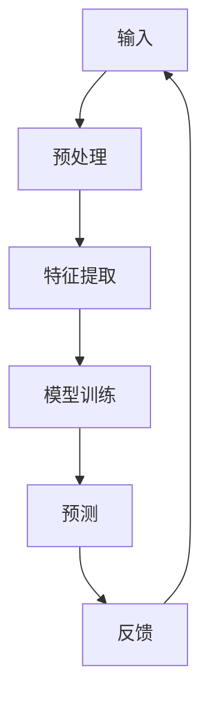

                 

# 李开复：AI 2.0 时代的产业

## 关键词：人工智能，产业转型，技术发展，创新应用，挑战与机遇

### 摘要

随着人工智能（AI）技术的飞速发展，我们正进入一个全新的AI 2.0时代。在这个时代，人工智能不仅仅是计算机科学的一个分支，它正在深刻地改变着各行各业，推动着产业的全面升级和转型。本文将探讨AI 2.0时代的核心概念、关键算法、应用场景、未来发展等各个方面，旨在为读者提供一个全面而深入的理解。

## 1. 背景介绍

### 1.1 人工智能的发展历程

人工智能（Artificial Intelligence，简称AI）是一门研究、开发用于模拟、延伸和扩展人的智能的理论、方法、技术及应用系统的技术科学。它起源于20世纪50年代，经历了几个重要的发展阶段。

- **初期阶段（1950-1969）**：以符号主义和逻辑推理为核心，典型的代表是艾伦·图灵提出的“图灵测试”。
- **繁荣期（1970-1989）**：专家系统的出现使得AI开始应用于实际领域。
- **低谷期（1990-2000）**：由于计算能力的限制和实际应用中的困难，AI研究进入低潮。
- **复兴期（2000-2010）**：随着计算能力的提升和数据量的爆发增长，机器学习和深度学习开始崭露头角。
- **AI 2.0时代（2010至今）**：以深度学习为代表的人工智能技术取得了突破性进展，推动了AI在各个领域的广泛应用。

### 1.2 AI 2.0时代的特征

AI 2.0时代具有以下几大特征：

- **数据驱动**：AI的发展依赖于大量的数据，尤其是结构化和半结构化数据。
- **算法创新**：以深度学习为代表的算法创新，使得AI在图像识别、语音识别、自然语言处理等方面取得了显著成果。
- **硬件升级**：高性能计算硬件，如GPU和TPU的普及，为AI算法的运行提供了强大的计算支持。
- **跨界融合**：AI与其他领域的深度融合，如AI+金融、AI+医疗、AI+教育等，推动了产业的全面升级。

## 2. 核心概念与联系

### 2.1 人工智能的核心概念

- **机器学习**：通过数据训练模型，使其能够从数据中学习并做出决策。
- **深度学习**：基于多层神经网络的一种机器学习方法，能够处理复杂的数据结构。
- **强化学习**：通过试错和奖励机制，使智能体在环境中学习最优策略。
- **自然语言处理**：使计算机能够理解、生成和处理人类语言的技术。

### 2.2 人工智能的架构

以下是一个简化的AI架构图：



### 2.3 人工智能的关键技术

- **算法**：包括机器学习、深度学习、强化学习等。
- **数据**：高质量的数据是AI算法有效性的基础。
- **计算能力**：高性能计算硬件支持AI算法的快速迭代和优化。
- **应用场景**：不同领域的应用需求，推动AI技术的发展。

## 3. 核心算法原理 & 具体操作步骤

### 3.1 深度学习算法原理

深度学习是一种基于多层神经网络的机器学习方法，其核心思想是通过层层提取数据中的特征，实现从低层次到高层次的理解。

- **神经网络**：一种模拟人脑神经元连接结构的计算模型。
- **前向传播**：将输入数据通过神经网络的前向传播，得到输出结果。
- **反向传播**：根据输出结果和实际标签，计算损失函数，并通过反向传播更新网络权重。

### 3.2 深度学习算法的具体操作步骤

1. **数据预处理**：包括数据的清洗、归一化、分割等操作，确保数据质量。
2. **模型选择**：根据任务需求选择合适的深度学习模型，如卷积神经网络（CNN）、循环神经网络（RNN）等。
3. **模型训练**：通过迭代训练，优化模型参数，使其能够准确预测。
4. **模型评估**：使用验证集或测试集评估模型性能，调整模型参数。
5. **模型部署**：将训练好的模型部署到实际应用场景中，如图像识别、语音识别等。

## 4. 数学模型和公式 & 详细讲解 & 举例说明

### 4.1 数学模型

深度学习中的数学模型主要包括：

- **损失函数**：用于衡量模型预测值与实际值之间的差距，常用的有均方误差（MSE）、交叉熵损失（Cross Entropy Loss）等。
- **优化算法**：用于优化模型参数，常用的有梯度下降（Gradient Descent）、Adam优化器等。

### 4.2 公式讲解

1. **均方误差（MSE）**：

   $$
   MSE = \frac{1}{m}\sum_{i=1}^{m}(y_i - \hat{y_i})^2
   $$

   其中，$y_i$为实际值，$\hat{y_i}$为预测值，$m$为样本数量。

2. **交叉熵损失（Cross Entropy Loss）**：

   $$
   Cross\ Entropy\ Loss = -\sum_{i=1}^{m} y_i \log(\hat{y_i})
   $$

   其中，$y_i$为实际标签，$\hat{y_i}$为模型预测的概率分布。

### 4.3 举例说明

假设有一个二元分类问题，实际标签为$y = [1, 0, 1, 0]$，模型预测的概率分布为$\hat{y} = [0.6, 0.4, 0.7, 0.3]$。

- **均方误差（MSE）**：

  $$
  MSE = \frac{1}{4}[(1-0.6)^2 + (0-0.4)^2 + (1-0.7)^2 + (0-0.3)^2] = 0.15
  $$

- **交叉熵损失（Cross Entropy Loss）**：

  $$
  Cross\ Entropy\ Loss = -[1 \cdot \log(0.6) + 0 \cdot \log(0.4) + 1 \cdot \log(0.7) + 0 \cdot \log(0.3)] \approx 0.405
  $$

## 5. 项目实战：代码实际案例和详细解释说明

### 5.1 开发环境搭建

- **Python**：作为主要的编程语言，需要安装Python 3.6及以上版本。
- **TensorFlow**：作为深度学习框架，需要安装TensorFlow 2.0及以上版本。
- **Numpy**：用于数学计算，需要安装Numpy 1.16及以上版本。

### 5.2 源代码详细实现和代码解读

以下是一个简单的深度学习项目，实现一个用于手写数字识别的卷积神经网络（CNN）。

```python
import tensorflow as tf
from tensorflow.keras import layers
import numpy as np

# 数据预处理
(x_train, y_train), (x_test, y_test) = tf.keras.datasets.mnist.load_data()
x_train = x_train / 255.0
x_test = x_test / 255.0

# 构建模型
model = tf.keras.Sequential([
    layers.Conv2D(32, (3, 3), activation='relu', input_shape=(28, 28, 1)),
    layers.MaxPooling2D((2, 2)),
    layers.Conv2D(64, (3, 3), activation='relu'),
    layers.MaxPooling2D((2, 2)),
    layers.Conv2D(64, (3, 3), activation='relu'),
    layers.Flatten(),
    layers.Dense(64, activation='relu'),
    layers.Dense(10, activation='softmax')
])

# 编译模型
model.compile(optimizer='adam',
              loss='sparse_categorical_crossentropy',
              metrics=['accuracy'])

# 训练模型
model.fit(x_train, y_train, epochs=5)

# 评估模型
model.evaluate(x_test, y_test)
```

### 5.3 代码解读与分析

- **数据预处理**：加载数据集，并将图像数据归一化到[0, 1]范围内，方便模型训练。
- **构建模型**：使用卷积神经网络（CNN）结构，包括卷积层、池化层和全连接层，最后输出类别概率。
- **编译模型**：设置优化器和损失函数，准备模型训练。
- **训练模型**：使用训练数据集训练模型，调整模型参数。
- **评估模型**：使用测试数据集评估模型性能，计算损失和准确率。

## 6. 实际应用场景

### 6.1 金融行业

- **风险管理**：使用AI技术进行风险评估、市场预测等。
- **智能投顾**：为投资者提供个性化的投资建议。
- **反欺诈系统**：通过异常检测技术，预防金融欺诈。

### 6.2 医疗健康

- **医学影像分析**：辅助医生进行病变检测和诊断。
- **个性化医疗**：根据患者基因信息和病情，提供个性化的治疗方案。
- **健康监测**：通过可穿戴设备收集数据，进行健康状态监测和预警。

### 6.3 教育领域

- **智能教学**：根据学生的学习情况和需求，提供个性化的学习资源和教学方法。
- **在线教育平台**：利用AI技术提升教育质量和学习体验。
- **教育评价**：通过数据分析，为教育工作者提供教学效果的评价。

### 6.4 交通运输

- **自动驾驶**：利用深度学习和强化学习技术，实现无人驾驶汽车。
- **交通流量预测**：通过数据分析和模型预测，优化交通流量和管理。
- **物流优化**：利用路径规划算法，提升物流效率和降低成本。

## 7. 工具和资源推荐

### 7.1 学习资源推荐

- **书籍**：
  - 《深度学习》（Ian Goodfellow、Yoshua Bengio、Aaron Courville 著）
  - 《Python机器学习》（Sebastian Raschka、Vahid Mirhoseini 著）
  - 《自然语言处理与深度学习》（Michael A. Evans、isbell Zhai 著）
- **论文**：
  - 《A Theoretical Framework for Backpropagation》（Rumelhart、Hinton、Williams 著）
  - 《Deep Learning without Feeds Forward Networks》（Yosinski、Clune、Bengio 著）
  - 《Generative Adversarial Nets》（Goodfellow、 Pouget-Abadie、 Mirza、 Xu、 Arjovsky、 Chintala 著）
- **博客**：
  - [TensorFlow官网博客](https://www.tensorflow.org/tutorials)
  - [Kaggle博客](https://www.kaggle.com/forums/home)
  - [机器学习周报](https://www_mlwater.cn/)
- **网站**：
  - [AI Wiki](https://www.aiwiki.net/)
  - [GitHub](https://github.com/)
  - [ArXiv](https://arxiv.org/)

### 7.2 开发工具框架推荐

- **TensorFlow**：最流行的开源深度学习框架之一，适用于各种规模的深度学习项目。
- **PyTorch**：由Facebook开发的开源深度学习框架，以其动态计算图和简洁的API受到广泛喜爱。
- **Keras**：一个基于TensorFlow和Theano的高级神经网络API，使得深度学习模型的构建更加简单和直观。

### 7.3 相关论文著作推荐

- **《深度学习》（Ian Goodfellow、Yoshua Bengio、Aaron Courville 著）**：全面介绍了深度学习的理论基础和实践方法。
- **《强化学习》（Richard S. Sutton、Andrew G. Barto 著）**：系统讲解了强化学习的原理和应用。
- **《自然语言处理综合教程》（Daniel Jurafsky、James H. Martin 著）**：详细介绍了自然语言处理的理论和实践。

## 8. 总结：未来发展趋势与挑战

### 8.1 发展趋势

- **技术突破**：随着计算能力的提升和算法的改进，AI技术将不断突破，实现更多复杂的任务。
- **应用普及**：AI技术将在更多领域得到应用，推动产业的全面升级和转型。
- **跨界融合**：AI与其他领域的深度融合，将催生出更多创新应用。

### 8.2 挑战

- **数据隐私**：如何在保障用户隐私的前提下，充分利用数据的价值，是一个重要挑战。
- **伦理道德**：随着AI技术的普及，如何确保AI系统的公正性和透明度，避免算法偏见，是一个亟待解决的问题。
- **安全风险**：AI系统的安全性问题，如攻击、漏洞等，需要引起足够的重视。

## 9. 附录：常见问题与解答

### 9.1 人工智能是什么？

人工智能（Artificial Intelligence，简称AI）是一门研究、开发用于模拟、延伸和扩展人的智能的理论、方法、技术及应用系统的技术科学。

### 9.2 深度学习与机器学习的区别是什么？

机器学习是一种人工智能的分支，而深度学习是机器学习的一个子领域。深度学习通过多层神经网络，从数据中自动学习特征表示。

### 9.3 如何入门人工智能？

建议从学习Python编程语言开始，掌握基础的数据结构和算法。然后可以学习机器学习和深度学习的基本概念，选择一个合适的深度学习框架进行实践。

## 10. 扩展阅读 & 参考资料

- **书籍**：
  - 《Python机器学习实践指南》（张亮 著）
  - 《深度学习实践指南》（Mohit Deshpande、Joshua Lospinoso 著）
  - 《强化学习实战》（Pierre-Luc Bacon 著）
- **论文**：
  - 《Deep Learning：Methods and Applications》（Yoshua Bengio、Ian J. Goodfellow、Aaron Courville 著）
  - 《Reinforcement Learning: An Introduction》（Richard S. Sutton、Andrew G. Barto 著）
- **网站**：
  - [Google AI](https://ai.google/)
  - [Microsoft AI](https://www.microsoft.com/en-us/research/)
  - [DeepLearning.AI](https://www.deeplearning.ai/)
- **博客**：
  - [机器学习博客](https://www机器学习博客.com/)
  - [机器学习杂货铺](https://www.mlzk.org/)
  - [深度学习](https://www.deeplearning.net/)

