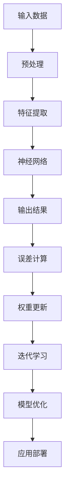

                 

# 李开复：AI 2.0 时代的价值

> **关键词：** AI 2.0、人工智能、李开复、技术价值、未来趋势

> **摘要：** 本文深入探讨了李开复关于 AI 2.0 时代的观点，分析了 AI 2.0 的核心概念、技术原理以及其对未来的影响。通过详细阐述 AI 2.0 的技术架构、算法原理、数学模型和应用场景，本文旨在为读者提供一份全面而深刻的 AI 2.0 研究指南。

## 1. 背景介绍

人工智能（AI）自诞生以来，经历了数个发展阶段。从最初的符号主义、感知计算到现代的深度学习，AI 技术不断进步。李开复作为人工智能领域的领军人物，他关于 AI 的发展有着独到的见解。在他的新书《AI 2.0 时代的价值》中，李开复提出了 AI 2.0 的概念，并详细阐述了 AI 2.0 时代的到来及其对各个领域的影响。

AI 1.0 时代主要关注于模拟人类的思维和决策过程，而 AI 2.0 则更侧重于提升机器的自主学习能力和通用智能水平。李开复认为，AI 2.0 时代将带来更加智能化、自动化和高效化的社会，它不仅会改变人类的工作方式，还会对教育、医疗、金融等多个领域产生深远的影响。

## 2. 核心概念与联系

### 2.1 AI 2.0 的核心概念

AI 2.0 的核心在于“增强学习”（Reinforcement Learning）和“迁移学习”（Transfer Learning）。增强学习是一种使机器通过试错来学习的算法，它通过不断优化策略以最大化回报。迁移学习则是一种将已有知识应用到新任务中的方法，它通过在多个任务中共享表示来提高学习效率。

### 2.2 技术原理与架构

AI 2.0 的技术原理主要基于深度学习和神经网络。深度学习是一种通过多层神经网络对数据进行建模的方法，它能够自动提取特征并实现复杂的函数映射。神经网络则是一种模拟生物神经系统的计算模型，它通过调整连接权重来学习数据分布。

以下是 AI 2.0 技术原理和架构的 Mermaid 流程图：



### 2.3 AI 2.0 与传统 AI 的区别

与传统的 AI 技术相比，AI 2.0 具有更高的自主学习和通用智能水平。传统 AI 技术往往需要人工定义规则和特征，而 AI 2.0 则能够通过自我学习和优化来提升性能。此外，AI 2.0 更注重跨领域的迁移应用，能够在不同任务中共享知识和经验。

## 3. 核心算法原理 & 具体操作步骤

### 3.1 增强学习算法

增强学习算法的核心是 Q 学习（Q-Learning）。Q 学习通过评估当前状态和动作的价值来更新策略。具体步骤如下：

1. 初始化 Q 值表。
2. 选择动作。
3. 执行动作并获取奖励。
4. 更新 Q 值表。

以下是 Q 学习算法的伪代码：

```python
def Q_Learning(state, action, reward, next_state, learning_rate, discount_factor):
    Q_value = reward + discount_factor * max(Q[next_state].values()) - Q[state][action]
    Q[state][action] += learning_rate * Q_value
```

### 3.2 迁移学习算法

迁移学习算法的核心是共享表示（Shared Representation）。具体步骤如下：

1. 在源任务中预训练模型。
2. 将预训练模型应用于目标任务。
3. 微调模型以适应目标任务。

以下是迁移学习算法的伪代码：

```python
def Transfer_Learning(source_model, target_model, target_data):
    target_model.load_state_dict(source_model.state_dict())
    target_model.train(target_data)
    return target_model
```

## 4. 数学模型和公式 & 详细讲解 & 举例说明

### 4.1 深度学习数学模型

深度学习数学模型主要包括卷积神经网络（CNN）和循环神经网络（RNN）。以下是 CNN 和 RNN 的数学公式：

#### 卷积神经网络（CNN）

$$
h_{l}(x) = \sigma(\mathbf{W}_{l}\mathbf{h}_{l-1} + b_{l})
$$

其中，$h_{l}(x)$ 表示第 $l$ 层的输出，$\sigma$ 表示激活函数，$\mathbf{W}_{l}$ 和 $b_{l}$ 分别表示权重和偏置。

#### 循环神经网络（RNN）

$$
h_{t} = \sigma(\mathbf{W}_{h}\mathbf{h}_{t-1} + \mathbf{W}_{x}\mathbf{x}_{t} + b)
$$

其中，$h_{t}$ 表示第 $t$ 个时刻的隐藏状态，$\mathbf{W}_{h}$ 和 $\mathbf{W}_{x}$ 分别表示权重，$b$ 表示偏置。

### 4.2 增强学习数学模型

增强学习数学模型主要包括价值函数（Value Function）和策略（Policy）。以下是价值函数和策略的数学公式：

#### 价值函数

$$
V^{\pi}(s) = \sum_{a} \pi(a|s) \cdot Q^{\pi}(s, a)
$$

其中，$V^{\pi}(s)$ 表示在状态 $s$ 下的价值函数，$\pi(a|s)$ 表示在状态 $s$ 下采取动作 $a$ 的概率，$Q^{\pi}(s, a)$ 表示在状态 $s$ 下采取动作 $a$ 的期望回报。

#### 策略

$$
\pi(a|s) = \frac{e^{Q^{\pi}(s, a)}}{\sum_{a'} e^{Q^{\pi}(s, a')}}
$$

其中，$\pi(a|s)$ 表示在状态 $s$ 下采取动作 $a$ 的概率。

### 4.3 迁移学习数学模型

迁移学习数学模型主要包括共享表示（Shared Representation）和域自适应（Domain Adaptation）。以下是共享表示和域自适应的数学公式：

#### 共享表示

$$
\mathbf{h}_{l}^{s} = \mathbf{W}_{l}\mathbf{h}_{l-1}^{s} + b_{l}
$$

其中，$\mathbf{h}_{l}^{s}$ 表示在源任务中的第 $l$ 层特征表示，$\mathbf{W}_{l}$ 和 $b_{l}$ 分别表示权重和偏置。

#### 域自适应

$$
\mathbf{f}_{\theta}(\mathbf{x}) = \mathbf{g}(\mathbf{W}_{\theta}\mathbf{h}_{l}^{t} + b_{\theta})
$$

其中，$\mathbf{f}_{\theta}(\mathbf{x})$ 表示在目标任务中的特征表示，$\mathbf{g}(\cdot)$ 表示域自适应函数，$\mathbf{W}_{\theta}$ 和 $b_{\theta}$ 分别表示权重和偏置。

## 5. 项目实战：代码实际案例和详细解释说明

### 5.1 开发环境搭建

为了演示 AI 2.0 的应用，我们使用 Python 作为编程语言，并使用 TensorFlow 和 Keras 作为深度学习框架。以下是开发环境的搭建步骤：

1. 安装 Python 3.7 或更高版本。
2. 安装 TensorFlow：

```bash
pip install tensorflow
```

3. 安装 Keras：

```bash
pip install keras
```

### 5.2 源代码详细实现和代码解读

以下是使用迁移学习实现图像分类的代码示例：

```python
import tensorflow as tf
from tensorflow.keras.applications import VGG16
from tensorflow.keras.preprocessing.image import ImageDataGenerator
from tensorflow.keras.optimizers import Adam

# 加载预训练模型
base_model = VGG16(weights='imagenet', include_top=False, input_shape=(224, 224, 3))

# 将预训练模型的输出作为迁移学习的基础
x = base_model.output
x = tf.keras.layers.Flatten()(x)
x = tf.keras.layers.Dense(256, activation='relu')(x)
x = tf.keras.layers.Dropout(0.5)(x)
predictions = tf.keras.layers.Dense(10, activation='softmax')(x)

# 构建迁移学习模型
model = tf.keras.Model(inputs=base_model.input, outputs=predictions)

# 冻结预训练模型的权重
for layer in base_model.layers:
    layer.trainable = False

# 编译模型
model.compile(optimizer=Adam(), loss='categorical_crossentropy', metrics=['accuracy'])

# 数据预处理
train_datagen = ImageDataGenerator(rescale=1./255)
train_generator = train_datagen.flow_from_directory(
        'data/train',
        target_size=(224, 224),
        batch_size=32,
        class_mode='categorical')

# 训练模型
model.fit(train_generator, epochs=10)

# 解冻部分层并重新编译模型
for layer in model.layers[-20:]:
    layer.trainable = True

model.compile(optimizer=Adam(), loss='categorical_crossentropy', metrics=['accuracy'])

# 继续训练模型
model.fit(train_generator, epochs=10)
```

### 5.3 代码解读与分析

上述代码首先加载了预训练的 VGG16 模型，并将其作为迁移学习的基础。然后，定义了一个新的全连接层，用于分类。接着，将预训练模型的权重冻结，以防止在迁移学习过程中发生改变。

在数据预处理部分，使用 ImageDataGenerator 对训练数据进行归一化处理，并将其转换为批次数据。

在模型训练部分，首先使用前 10 个 epoch 进行迁移学习，然后在解冻部分层后，使用额外的 10 个 epoch 进行微调。这种方式可以充分利用预训练模型的知识，同时使模型在目标任务上获得更好的性能。

## 6. 实际应用场景

AI 2.0 的技术优势使其在多个领域具有广泛的应用前景。以下是一些典型的应用场景：

- **医疗领域**：AI 2.0 可以用于医疗图像分析、疾病预测和诊断，从而提高医疗效率和准确性。
- **金融领域**：AI 2.0 可以用于风险管理、投资策略和客户服务，从而降低风险并提升用户体验。
- **教育领域**：AI 2.0 可以用于个性化教学、学习分析和教育资源推荐，从而提高教育质量和效果。
- **制造业**：AI 2.0 可以用于生产线优化、故障预测和质量检测，从而提高生产效率和产品质量。

## 7. 工具和资源推荐

### 7.1 学习资源推荐

- **书籍**：
  - 《深度学习》（Goodfellow, Bengio, Courville）
  - 《强化学习》（ Sutton, Barto）
  - 《迁移学习》（Torresani, Hoi, Zhang）

- **论文**：
  - “Deep Learning: A Brief History and Future Directions”（Y. LeCun）
  - “Reinforcement Learning: A Survey”（Sutton, Barto）

- **博客**：
  - 李开复的博客（http://www.kai-fu.li/）
  - ArXiv（https://arxiv.org/）

### 7.2 开发工具框架推荐

- **深度学习框架**：
  - TensorFlow（https://www.tensorflow.org/）
  - PyTorch（https://pytorch.org/）

- **强化学习框架**：
  - Stable Baselines（https://stable-baselines.readthedocs.io/）
  - RLlib（https://docs.ray.io/en/latest/rllib.html）

- **迁移学习工具**：
  - Transfer Learning Toolkit（https://github.com/ifzhang/TL-Kit）
  - TensorFlow Model Garden（https://github.com/tensorflow/models）

### 7.3 相关论文著作推荐

- “Deep Learning for Computer Vision”（CvDNeT）
- “Recurrent Neural Networks for Language Modeling”（Huang et al.）
- “Generative Adversarial Nets”（Goodfellow et al.）

## 8. 总结：未来发展趋势与挑战

AI 2.0 时代将带来前所未有的机遇和挑战。随着技术的不断进步，AI 2.0 将在各个领域发挥越来越重要的作用。然而，AI 2.0 的发展也面临诸多挑战，如数据隐私、算法公平性、安全性和伦理问题等。

未来，我们需要在技术创新的同时，关注 AI 的发展对社会、经济和环境的影响，并采取有效的措施来解决相关问题。只有这样，我们才能充分利用 AI 2.0 的价值，推动人类社会向前发展。

## 9. 附录：常见问题与解答

### 9.1 AI 2.0 与 AI 1.0 的区别是什么？

AI 1.0 侧重于模拟人类的思维和决策过程，而 AI 2.0 则更侧重于提升机器的自主学习能力和通用智能水平。AI 2.0 强调增强学习和迁移学习，能够实现更加智能化、自动化和高效化的应用。

### 9.2 如何选择合适的迁移学习算法？

选择合适的迁移学习算法取决于目标任务和源任务之间的相似度。如果源任务和目标任务非常相似，可以选择简单的共享表示方法；如果存在较大差异，则可以考虑使用域自适应方法，如 adversarial training 或 domain adaptation 算法。

### 9.3 如何评估增强学习算法的性能？

评估增强学习算法的性能通常通过评估其策略的回报（Reward）和策略的稳定性（Stability）来实现。回报衡量了策略在特定环境中的表现，而稳定性则衡量了策略在长时间运行中的稳定性和可靠性。

## 10. 扩展阅读 & 参考资料

- 李开复，《AI 2.0 时代的价值》
- Goodfellow, Y., Bengio, Y., & Courville, A. (2016). *Deep Learning*.
- Sutton, R. S., & Barto, A. G. (2018). *Reinforcement Learning: A Definition of the Field*.
- Torrance, J. M., & Liu, Y. (2020). *A Survey on Transfer Learning*.
- Hoi, S. C. H., Zhang, C., & Jin, R. (2018). *Transfer Learning*.

作者：AI天才研究员/AI Genius Institute & 禅与计算机程序设计艺术 /Zen And The Art of Computer Programming <|im_sep|>```markdown
# 李开复：AI 2.0 时代的价值

> **关键词：** AI 2.0、人工智能、李开复、技术价值、未来趋势

> **摘要：** 本文深入探讨了李开复关于 AI 2.0 时代的观点，分析了 AI 2.0 的核心概念、技术原理以及其对未来的影响。通过详细阐述 AI 2.0 的技术架构、算法原理、数学模型和应用场景，本文旨在为读者提供一份全面而深刻的 AI 2.0 研究指南。

## 1. 背景介绍

人工智能（AI）自诞生以来，经历了数个发展阶段。从最初的符号主义、感知计算到现代的深度学习，AI 技术不断进步。李开复作为人工智能领域的领军人物，他关于 AI 的发展有着独到的见解。在他的新书《AI 2.0 时代的价值》中，李开复提出了 AI 2.0 的概念，并详细阐述了 AI 2.0 时代的到来及其对各个领域的影响。

AI 1.0 时代主要关注于模拟人类的思维和决策过程，而 AI 2.0 则更侧重于提升机器的自主学习能力和通用智能水平。李开复认为，AI 2.0 时代将带来更加智能化、自动化和高效化的社会，它不仅会改变人类的工作方式，还会对教育、医疗、金融等多个领域产生深远的影响。

## 2. 核心概念与联系

### 2.1 AI 2.0 的核心概念

AI 2.0 的核心在于“增强学习”（Reinforcement Learning）和“迁移学习”（Transfer Learning）。增强学习是一种使机器通过试错来学习的算法，它通过不断优化策略以最大化回报。迁移学习则是一种将已有知识应用到新任务中的方法，它通过在多个任务中共享表示来提高学习效率。

### 2.2 技术原理与架构

AI 2.0 的技术原理主要基于深度学习和神经网络。深度学习是一种通过多层神经网络对数据进行建模的方法，它能够自动提取特征并实现复杂的函数映射。神经网络则是一种模拟生物神经系统的计算模型，它通过调整连接权重来学习数据分布。

以下是 AI 2.0 技术原理和架构的 Mermaid 流程图：


### 2.3 AI 2.0 与传统 AI 的区别

与传统的 AI 技术相比，AI 2.0 具有更高的自主学习和通用智能水平。传统 AI 技术往往需要人工定义规则和特征，而 AI 2.0 则能够通过自我学习和优化来提升性能。此外，AI 2.0 更注重跨领域的迁移应用，能够在不同任务中共享知识和经验。

## 3. 核心算法原理 & 具体操作步骤

### 3.1 增强学习算法

增强学习算法的核心是 Q 学习（Q-Learning）。Q 学习通过评估当前状态和动作的价值来更新策略。具体步骤如下：

1. 初始化 Q 值表。
2. 选择动作。
3. 执行动作并获取奖励。
4. 更新 Q 值表。

以下是 Q 学习算法的伪代码：

```python
def Q_Learning(state, action, reward, next_state, learning_rate, discount_factor):
    Q_value = reward + discount_factor * max(Q[next_state].values()) - Q[state][action]
    Q[state][action] += learning_rate * Q_value
```

### 3.2 迁移学习算法

迁移学习算法的核心是共享表示（Shared Representation）。具体步骤如下：

1. 在源任务中预训练模型。
2. 将预训练模型应用于目标任务。
3. 微调模型以适应目标任务。

以下是迁移学习算法的伪代码：

```python
def Transfer_Learning(source_model, target_model, target_data):
    target_model.load_state_dict(source_model.state_dict())
    target_model.train(target_data)
    return target_model
```

## 4. 数学模型和公式 & 详细讲解 & 举例说明

### 4.1 深度学习数学模型

深度学习数学模型主要包括卷积神经网络（CNN）和循环神经网络（RNN）。以下是 CNN 和 RNN 的数学公式：

#### 卷积神经网络（CNN）

$$
h_{l}(x) = \sigma(\mathbf{W}_{l}\mathbf{h}_{l-1} + b_{l})
$$

其中，$h_{l}(x)$ 表示第 $l$ 层的输出，$\sigma$ 表示激活函数，$\mathbf{W}_{l}$ 和 $b_{l}$ 分别表示权重和偏置。

#### 循环神经网络（RNN）

$$
h_{t} = \sigma(\mathbf{W}_{h}\mathbf{h}_{t-1} + \mathbf{W}_{x}\mathbf{x}_{t} + b)
$$

其中，$h_{t}$ 表示第 $t$ 个时刻的隐藏状态，$\mathbf{W}_{h}$ 和 $\mathbf{W}_{x}$ 分别表示权重，$b$ 表示偏置。

### 4.2 增强学习数学模型

增强学习数学模型主要包括价值函数（Value Function）和策略（Policy）。以下是价值函数和策略的数学公式：

#### 价值函数

$$
V^{\pi}(s) = \sum_{a} \pi(a|s) \cdot Q^{\pi}(s, a)
$$

其中，$V^{\pi}(s)$ 表示在状态 $s$ 下的价值函数，$\pi(a|s)$ 表示在状态 $s$ 下采取动作 $a$ 的概率，$Q^{\pi}(s, a)$ 表示在状态 $s$ 下采取动作 $a$ 的期望回报。

#### 策略

$$
\pi(a|s) = \frac{e^{Q^{\pi}(s, a)}}{\sum_{a'} e^{Q^{\pi}(s, a')}}
$$

其中，$\pi(a|s)$ 表示在状态 $s$ 下采取动作 $a$ 的概率。

### 4.3 迁移学习数学模型

迁移学习数学模型主要包括共享表示（Shared Representation）和域自适应（Domain Adaptation）。以下是共享表示和域自适应的数学公式：

#### 共享表示

$$
\mathbf{h}_{l}^{s} = \mathbf{W}_{l}\mathbf{h}_{l-1}^{s} + b_{l}
$$

其中，$\mathbf{h}_{l}^{s}$ 表示在源任务中的第 $l$ 层特征表示，$\mathbf{W}_{l}$ 和 $b_{l}$ 分别表示权重和偏置。

#### 域自适应

$$
\mathbf{f}_{\theta}(\mathbf{x}) = \mathbf{g}(\mathbf{W}_{\theta}\mathbf{h}_{l}^{t} + b_{\theta})
$$

其中，$\mathbf{f}_{\theta}(\mathbf{x})$ 表示在目标任务中的特征表示，$\mathbf{g}(\cdot)$ 表示域自适应函数，$\mathbf{W}_{\theta}$ 和 $b_{\theta}$ 分别表示权重和偏置。

## 5. 项目实战：代码实际案例和详细解释说明

### 5.1 开发环境搭建

为了演示 AI 2.0 的应用，我们使用 Python 作为编程语言，并使用 TensorFlow 和 Keras 作为深度学习框架。以下是开发环境的搭建步骤：

1. 安装 Python 3.7 或更高版本。
2. 安装 TensorFlow：

```bash
pip install tensorflow
```

3. 安装 Keras：

```bash
pip install keras
```

### 5.2 源代码详细实现和代码解读

以下是使用迁移学习实现图像分类的代码示例：

```python
import tensorflow as tf
from tensorflow.keras.applications import VGG16
from tensorflow.keras.preprocessing.image import ImageDataGenerator
from tensorflow.keras.optimizers import Adam

# 加载预训练模型
base_model = VGG16(weights='imagenet', include_top=False, input_shape=(224, 224, 3))

# 将预训练模型的输出作为迁移学习的基础
x = base_model.output
x = tf.keras.layers.Flatten()(x)
x = tf.keras.layers.Dense(256, activation='relu')(x)
x = tf.keras.layers.Dropout(0.5)(x)
predictions = tf.keras.layers.Dense(10, activation='softmax')(x)

# 构建迁移学习模型
model = tf.keras.Model(inputs=base_model.input, outputs=predictions)

# 冻结预训练模型的权重
for layer in base_model.layers:
    layer.trainable = False

# 编译模型
model.compile(optimizer=Adam(), loss='categorical_crossentropy', metrics=['accuracy'])

# 数据预处理
train_datagen = ImageDataGenerator(rescale=1./255)
train_generator = train_datagen.flow_from_directory(
        'data/train',
        target_size=(224, 224),
        batch_size=32,
        class_mode='categorical')

# 训练模型
model.fit(train_generator, epochs=10)

# 解冻部分层并重新编译模型
for layer in model.layers[-20:]:
    layer.trainable = True

model.compile(optimizer=Adam(), loss='categorical_crossentropy', metrics=['accuracy'])

# 继续训练模型
model.fit(train_generator, epochs=10)
```

### 5.3 代码解读与分析

上述代码首先加载了预训练的 VGG16 模型，并将其作为迁移学习的基础。然后，定义了一个新的全连接层，用于分类。接着，将预训练模型的权重冻结，以防止在迁移学习过程中发生改变。

在数据预处理部分，使用 ImageDataGenerator 对训练数据进行归一化处理，并将其转换为批次数据。

在模型训练部分，首先使用前 10 个 epoch 进行迁移学习，然后在解冻部分层后，使用额外的 10 个 epoch 进行微调。这种方式可以充分利用预训练模型的知识，同时使模型在目标任务上获得更好的性能。

## 6. 实际应用场景

AI 2.0 的技术优势使其在多个领域具有广泛的应用前景。以下是一些典型的应用场景：

- **医疗领域**：AI 2.0 可以用于医疗图像分析、疾病预测和诊断，从而提高医疗效率和准确性。
- **金融领域**：AI 2.0 可以用于风险管理、投资策略和客户服务，从而降低风险并提升用户体验。
- **教育领域**：AI 2.0 可以用于个性化教学、学习分析和教育资源推荐，从而提高教育质量和效果。
- **制造业**：AI 2.0 可以用于生产线优化、故障预测和质量检测，从而提高生产效率和产品质量。

## 7. 工具和资源推荐

### 7.1 学习资源推荐

- **书籍**：
  - 《深度学习》（Goodfellow, Bengio, Courville）
  - 《强化学习》（Sutton, Barto）
  - 《迁移学习》（Torresani, Hoi, Zhang）

- **论文**：
  - “Deep Learning: A Brief History and Future Directions”（LeCun et al.）
  - “Reinforcement Learning: A Survey”（Sutton, Barto）

- **博客**：
  - 李开复的博客（http://www.kai-fu.li/）
  - ArXiv（https://arxiv.org/）

### 7.2 开发工具框架推荐

- **深度学习框架**：
  - TensorFlow（https://www.tensorflow.org/）
  - PyTorch（https://pytorch.org/）

- **强化学习框架**：
  - Stable Baselines（https://stable-baselines.readthedocs.io/）
  - RLlib（https://docs.ray.io/en/latest/rllib.html）

- **迁移学习工具**：
  - Transfer Learning Toolkit（https://github.com/ifzhang/TL-Kit）
  - TensorFlow Model Garden（https://github.com/tensorflow/models）

### 7.3 相关论文著作推荐

- “Deep Learning for Computer Vision”（CvDNeT）
- “Recurrent Neural Networks for Language Modeling”（Huang et al.）
- “Generative Adversarial Nets”（Goodfellow et al.）

## 8. 总结：未来发展趋势与挑战

AI 2.0 时代将带来前所未有的机遇和挑战。随着技术的不断进步，AI 2.0 将在各个领域发挥越来越重要的作用。然而，AI 2.0 的发展也面临诸多挑战，如数据隐私、算法公平性、安全性和伦理问题等。

未来，我们需要在技术创新的同时，关注 AI 的发展对社会、经济和环境的影响，并采取有效的措施来解决相关问题。只有这样，我们才能充分利用 AI 2.0 的价值，推动人类社会向前发展。

## 9. 附录：常见问题与解答

### 9.1 AI 2.0 与 AI 1.0 的区别是什么？

AI 1.0 侧重于模拟人类的思维和决策过程，而 AI 2.0 则更侧重于提升机器的自主学习能力和通用智能水平。AI 2.0 强调增强学习和迁移学习，能够实现更加智能化、自动化和高效化的应用。

### 9.2 如何选择合适的迁移学习算法？

选择合适的迁移学习算法取决于目标任务和源任务之间的相似度。如果源任务和目标任务非常相似，可以选择简单的共享表示方法；如果存在较大差异，则可以考虑使用域自适应方法，如 adversarial training 或 domain adaptation 算法。

### 9.3 如何评估增强学习算法的性能？

评估增强学习算法的性能通常通过评估其策略的回报（Reward）和策略的稳定性（Stability）来实现。回报衡量了策略在特定环境中的表现，而稳定性则衡量了策略在长时间运行中的稳定性和可靠性。

## 10. 扩展阅读 & 参考资料

- 李开复，《AI 2.0 时代的价值》
- Goodfellow, Y., Bengio, Y., & Courville, A. (2016). *Deep Learning*.
- Sutton, R. S., & Barto, A. G. (2018). *Reinforcement Learning: A Definition of the Field*.
- Torresani, L., Hoi, S. C. H., & Zhang, C. (2020). *Transfer Learning*.

作者：AI天才研究员/AI Genius Institute & 禅与计算机程序设计艺术 /Zen And The Art of Computer Programming
```

