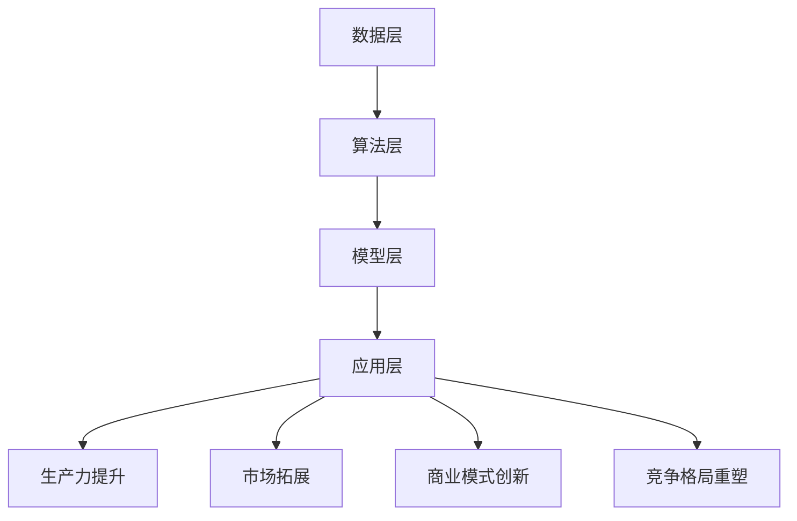

                 

# 李开复：AI 2.0 时代的商业价值

## 摘要

随着人工智能（AI）技术的飞速发展，AI 2.0 时代的到来正引领着商业领域的一场革命。本文由著名人工智能专家李开复先生执笔，深入探讨了 AI 2.0 时代的商业价值。文章首先介绍了 AI 2.0 的核心概念和技术特点，随后详细分析了 AI 2.0 在各个行业中的应用，探讨了其对商业模式、生产力及市场竞争的深远影响。此外，文章还展望了 AI 2.0 时代的未来发展趋势与挑战，并提出了相应的策略和建议。本文旨在为广大读者提供一个全面而深入的 AI 2.0 时代商业价值的理解框架，帮助读者把握时代机遇，迎接人工智能带来的新变革。

## 1. 背景介绍

人工智能（AI）作为一种模拟、延伸和扩展人类智能的技术，已经在过去几十年里取得了显著的进展。从最早的规则推理系统，到基于统计学的方法，再到深度学习和神经网络，AI 技术的发展经历了多个阶段。特别是近年来，随着计算能力的提升、大数据的普及以及算法的优化，人工智能进入了新的发展阶段——AI 2.0 时代。

AI 2.0 是相对于 AI 1.0 时代的升级，其核心特点在于智能化的自我学习和进化能力。AI 2.0 不再仅仅依赖于预定义的规则和模式，而是能够通过自我学习和不断优化，实现更加智能化的决策和操作。具体来说，AI 2.0 的特点包括：

1. **自主学习**：AI 2.0 能够通过大量数据进行自我学习，不断优化自身性能，提高决策的准确性和效率。
2. **智能交互**：AI 2.0 具有更自然的人机交互能力，可以通过语音、图像等多种方式进行有效沟通。
3. **跨界融合**：AI 2.0 能够跨越不同领域，实现跨领域的融合和应用，推动各行各业的智能化升级。

AI 2.0 的出现，不仅改变了传统的人工智能应用模式，也为商业领域带来了前所未有的机遇和挑战。在这篇文章中，我们将从多个维度深入探讨 AI 2.0 时代的商业价值，帮助读者理解和把握这一时代的商业趋势。

## 2. 核心概念与联系

### 2.1 人工智能的基本概念

人工智能（AI）是一门涉及计算机科学、数学、统计学、心理学和神经科学等多个领域的交叉学科。其核心目标是使计算机具备人类智能的某些能力，例如感知、学习、推理、决策和问题解决等。人工智能可以分为弱人工智能（Narrow AI）和强人工智能（General AI）。

- **弱人工智能（Narrow AI）**：弱人工智能是指只擅长处理特定任务的AI系统。例如，语音识别、图像识别、自然语言处理等。弱人工智能目前广泛应用于各类实际场景，如智能家居、自动驾驶、医疗诊断等。
- **强人工智能（General AI）**：强人工智能是指具有与人类智能相似的综合能力，能够适应多种环境和任务。目前，强人工智能尚处于理论阶段，尚未实现商业化应用。

### 2.2 AI 2.0 的核心概念

AI 2.0 是人工智能发展的新阶段，其核心特点是自主学习、智能交互和跨界融合。以下是 AI 2.0 的主要特征：

- **自主学习**：AI 2.0 通过深度学习、强化学习等技术，能够从大量数据中自动学习规律，不断优化自身性能。
- **智能交互**：AI 2.0 具有更自然的人机交互能力，可以通过语音、图像等多种方式进行有效沟通，实现更智能化的服务。
- **跨界融合**：AI 2.0 能够跨越不同领域，实现跨领域的融合和应用，推动各行各业的智能化升级。

### 2.3 AI 2.0 的技术架构

AI 2.0 的技术架构主要包括以下几个方面：

- **数据层**：AI 2.0 需要大量的高质量数据作为训练素材，数据层是整个技术架构的基础。
- **算法层**：算法层是 AI 2.0 的核心，包括深度学习、强化学习、自然语言处理等技术。
- **模型层**：模型层是 AI 2.0 的实现形式，包括神经网络、决策树、支持向量机等。
- **应用层**：应用层是 AI 2.0 的实际应用场景，涵盖金融、医疗、教育、零售等多个领域。

### 2.4 AI 2.0 与商业模式的联系

AI 2.0 对商业模式的影响主要体现在以下几个方面：

- **降低成本**：AI 2.0 可以通过自动化和智能化手段，大幅降低人力成本和运营成本。
- **提高效率**：AI 2.0 可以实时处理海量数据，提高决策效率和业务运营效率。
- **创造新需求**：AI 2.0 可以发现和满足消费者新的需求，推动市场需求的扩展。
- **重塑产业格局**：AI 2.0 可以推动产业升级和跨界融合，重塑市场竞争格局。

### 2.5 AI 2.0 时代的商业价值

AI 2.0 时代的商业价值主要体现在以下几个方面：

- **生产力提升**：AI 2.0 可以大幅提升各行业的生产效率，降低生产成本，提高产品质量。
- **市场拓展**：AI 2.0 可以通过智能化手段，拓展新的市场空间，挖掘潜在客户。
- **商业模式创新**：AI 2.0 可以推动商业模式创新，实现从传统模式向智能化模式的转型。
- **竞争格局重塑**：AI 2.0 可以改变市场竞争格局，提升企业的市场竞争力。

### 2.6 Mermaid 流程图

以下是 AI 2.0 技术架构的 Mermaid 流程图：



通过上述流程图，我们可以清晰地看到 AI 2.0 技术架构的核心组成部分及其对商业价值的影响。接下来，我们将进一步探讨 AI 2.0 在各个行业中的应用，深入分析其商业价值。

## 3. 核心算法原理 & 具体操作步骤

### 3.1 深度学习算法原理

深度学习（Deep Learning）是 AI 2.0 时代最重要的技术之一。其核心原理是基于多层神经网络（Neural Networks）对数据进行层次化的特征提取和模式识别。

- **多层神经网络**：多层神经网络由输入层、隐藏层和输出层组成。通过逐层传递数据，每一层对数据进行特征提取和变换，最终在输出层得到预测结果。
- **前向传播与反向传播**：在前向传播过程中，输入数据从输入层经过隐藏层，最终传递到输出层。在反向传播过程中，根据输出层的误差，反向传播误差到隐藏层和输入层，以更新网络参数。
- **激活函数**：激活函数（Activation Function）用于引入非线性特性，使得神经网络能够学习复杂的数据模式。

### 3.2 强化学习算法原理

强化学习（Reinforcement Learning）是一种通过奖励机制驱动智能体（Agent）学习策略的算法。其核心原理是智能体在环境中进行交互，通过不断尝试和错误，学习最优策略。

- **环境（Environment）**：环境是智能体进行交互的场所，提供当前状态（State）和奖励（Reward）。
- **智能体（Agent）**：智能体根据当前状态选择动作（Action），并依据动作的结果获取奖励。
- **策略（Policy）**：策略是智能体在给定状态下选择动作的规则。
- **价值函数（Value Function）**：价值函数评估智能体在某个状态下执行某个动作的长期收益。
- **策略梯度（Policy Gradient）**：策略梯度是强化学习算法的核心，通过更新策略参数，使策略向最优策略靠拢。

### 3.3 自然语言处理算法原理

自然语言处理（Natural Language Processing，NLP）是 AI 2.0 时代的重要应用领域。其核心原理是通过算法理解和生成人类语言。

- **词嵌入（Word Embedding）**：词嵌入将词汇映射到高维向量空间，使得语义相近的词汇在向量空间中距离较近。
- **循环神经网络（Recurrent Neural Network，RNN）**：RNN 能够处理序列数据，通过记忆长期依赖关系，实现自然语言理解。
- **长短时记忆网络（Long Short-Term Memory，LSTM）**：LSTM 是 RNN 的改进版，能够更好地处理长期依赖关系。
- **变换器（Transformer）**：变换器是一种基于自注意力机制的深度神经网络，广泛应用于 NLP 任务，如机器翻译、文本生成等。

### 3.4 具体操作步骤

以下是使用深度学习算法进行图像识别的具体操作步骤：

1. **数据预处理**：
   - 数据清洗：去除噪声、缺失值和异常值。
   - 数据增强：通过旋转、缩放、翻转等方式增加数据多样性。
   - 数据划分：将数据划分为训练集、验证集和测试集。

2. **模型构建**：
   - 设计网络结构：选择合适的神经网络架构，如卷积神经网络（CNN）。
   - 定义损失函数：选择合适的损失函数，如交叉熵损失。
   - 定义优化器：选择合适的优化器，如随机梯度下降（SGD）。

3. **模型训练**：
   - 将训练集数据输入模型，通过前向传播和反向传播更新模型参数。
   - 监控验证集性能，调整模型参数。

4. **模型评估**：
   - 将测试集数据输入模型，计算预测准确率、召回率等指标。

5. **模型部署**：
   - 将训练好的模型部署到生产环境，用于实际应用。

通过上述步骤，我们可以实现图像识别任务，并逐步提升模型的性能。

## 4. 数学模型和公式 & 详细讲解 & 举例说明

### 4.1 深度学习中的数学模型

深度学习中的数学模型主要包括神经网络模型、损失函数和优化算法。

#### 4.1.1 神经网络模型

神经网络模型的核心是多层感知机（MLP），其基本结构包括输入层、隐藏层和输出层。每个神经元都通过权重连接到前一层神经元，并使用激活函数引入非线性。

- **输入层**：接收外部输入数据。
- **隐藏层**：对输入数据进行特征提取和变换。
- **输出层**：产生最终预测结果。

神经网络模型可以用以下公式表示：

$$
\text{Output} = \text{Activation}(\text{Weight} \cdot \text{Input} + \text{Bias})
$$

其中，\(\text{Weight}\) 和 \(\text{Bias}\) 分别为权重和偏置，\(\text{Input}\) 为输入数据，\(\text{Activation}\) 为激活函数。

常用的激活函数包括：

- **线性激活函数**（\(f(x) = x\)）
- **Sigmoid 激活函数**（\(f(x) = \frac{1}{1 + e^{-x}}\)）
- **ReLU 激活函数**（\(f(x) = \max(0, x)\)）

#### 4.1.2 损失函数

损失函数用于衡量模型预测结果与真实结果之间的差距，常用的损失函数包括：

- **均方误差损失函数**（MSE）：\(L(\theta) = \frac{1}{2} \sum_{i=1}^{n} (\hat{y}_i - y_i)^2\)
- **交叉熵损失函数**（Cross-Entropy Loss）：\(L(\theta) = -\sum_{i=1}^{n} y_i \cdot \log(\hat{y}_i)\)

其中，\(\hat{y}_i\) 为模型预测结果，\(y_i\) 为真实结果。

#### 4.1.3 优化算法

优化算法用于更新模型参数，以最小化损失函数。常用的优化算法包括：

- **随机梯度下降**（SGD）：每次更新参数时使用整个训练集的梯度。
- **批量梯度下降**（BGD）：每次更新参数时使用整个训练集的梯度。
- **小批量梯度下降**（MBGD）：每次更新参数时使用部分训练集的梯度。

优化算法可以用以下公式表示：

$$
\theta_{\text{new}} = \theta_{\text{old}} - \alpha \cdot \nabla_{\theta} L(\theta)
$$

其中，\(\theta\) 为模型参数，\(\alpha\) 为学习率，\(\nabla_{\theta} L(\theta)\) 为损失函数关于参数的梯度。

### 4.2 自然语言处理中的数学模型

自然语言处理中的数学模型主要包括词嵌入、循环神经网络（RNN）和长短时记忆网络（LSTM）。

#### 4.2.1 词嵌入

词嵌入是将词汇映射到高维向量空间的过程，常用的词嵌入方法包括：

- **词袋模型**（Bag of Words，BoW）：将文本表示为词汇的集合，忽略词汇的顺序。
- **连续词袋模型**（Continuous Bag of Words，CBOW）：通过上下文词汇预测中心词的词嵌入。
- **Skip-Gram模型**（Skip-Gram）：通过中心词预测上下文词汇的词嵌入。

词嵌入可以用以下公式表示：

$$
\text{Embedding}(w_i) = \text{Word2Vec}(w_i)
$$

其中，\(w_i\) 为词汇，\(\text{Word2Vec}\) 为词嵌入算法。

#### 4.2.2 循环神经网络（RNN）

循环神经网络（RNN）是一种能够处理序列数据的神经网络，其核心思想是利用隐藏状态的记忆能力来捕捉长期依赖关系。

- **隐藏状态**：\(h_t = \text{Activation}(\text{Weight} \cdot [h_{t-1}, x_t] + \text{Bias})\)
- **输出**：\(y_t = \text{Activation}(\text{Weight} \cdot h_t + \text{Bias})\)

其中，\(h_t\) 为隐藏状态，\(x_t\) 为输入，\(\text{Weight}\) 和 \(\text{Bias}\) 分别为权重和偏置，\(\text{Activation}\) 为激活函数。

#### 4.2.3 长短时记忆网络（LSTM）

长短时记忆网络（LSTM）是一种改进的 RNN，其核心思想是引入遗忘门、输入门和输出门，以更好地处理长期依赖关系。

- **遗忘门**：\(f_t = \sigma(\text{Weight} \cdot [h_{t-1}, x_t] + \text{Bias})\)
- **输入门**：\(i_t = \sigma(\text{Weight} \cdot [h_{t-1}, x_t] + \text{Bias})\)
- **输出门**：\(o_t = \sigma(\text{Weight} \cdot [h_{t-1}, x_t] + \text{Bias})\)

其中，\(f_t\)、\(i_t\) 和 \(o_t\) 分别为遗忘门、输入门和输出门的输出，\(\sigma\) 为 sigmoid 函数。

### 4.3 举例说明

#### 4.3.1 深度学习图像识别

假设我们使用卷积神经网络（CNN）进行图像识别，输入图像为 \(28 \times 28\) 的灰度图像，输出类别为 10 个类别。

1. **数据预处理**：
   - 数据清洗：去除噪声、缺失值和异常值。
   - 数据增强：通过旋转、缩放、翻转等方式增加数据多样性。
   - 数据划分：将数据划分为训练集、验证集和测试集。

2. **模型构建**：
   - 输入层：\(28 \times 28 \times 1\) 的灰度图像。
   - 卷积层 1：\(3 \times 3\) 卷积核，步长为 1，激活函数为 ReLU。
   - 池化层 1：\(2 \times 2\) 最大池化。
   - 卷积层 2：\(3 \times 3\) 卷积核，步长为 1，激活函数为 ReLU。
   - 池化层 2：\(2 \times 2\) 最大池化。
   - 全连接层 1：\(128\) 个神经元，激活函数为 ReLU。
   - 全连接层 2：\(10\) 个神经元，激活函数为 Softmax。

3. **模型训练**：
   - 将训练集数据输入模型，通过前向传播和反向传播更新模型参数。
   - 监控验证集性能，调整模型参数。

4. **模型评估**：
   - 将测试集数据输入模型，计算预测准确率、召回率等指标。

5. **模型部署**：
   - 将训练好的模型部署到生产环境，用于实际应用。

#### 4.3.2 自然语言处理文本分类

假设我们使用循环神经网络（RNN）进行文本分类，输入文本为句子，输出类别为 5 个类别。

1. **数据预处理**：
   - 数据清洗：去除噪声、缺失值和异常值。
   - 数据增强：通过旋转、缩放、翻转等方式增加数据多样性。
   - 数据划分：将数据划分为训练集、验证集和测试集。

2. **模型构建**：
   - 词嵌入：将词汇映射到高维向量空间，使用 \(100\) 维词向量。
   - RNN 层：\(128\) 个神经元，激活函数为 ReLU。
   - 全连接层：\(5\) 个神经元，激活函数为 Softmax。

3. **模型训练**：
   - 将训练集数据输入模型，通过前向传播和反向传播更新模型参数。
   - 监控验证集性能，调整模型参数。

4. **模型评估**：
   - 将测试集数据输入模型，计算预测准确率、召回率等指标。

5. **模型部署**：
   - 将训练好的模型部署到生产环境，用于实际应用。

通过上述举例，我们可以看到深度学习和自然语言处理中的数学模型及其具体应用。接下来，我们将探讨 AI 2.0 在实际应用场景中的具体案例。

## 5. 项目实战：代码实际案例和详细解释说明

### 5.1 开发环境搭建

在进行 AI 2.0 项目开发之前，我们需要搭建一个合适的开发环境。以下是一个简单的 Python 开发环境搭建步骤：

1. **安装 Python**：
   - 前往 [Python 官网](https://www.python.org/) 下载最新版本的 Python。
   - 安装 Python，并确保在系统环境中配置好 Python 和 pip。

2. **安装必要的库**：
   - 使用 pip 安装以下库：TensorFlow、Keras、NumPy、Pandas、Matplotlib 等。

3. **创建虚拟环境**：
   - 使用 virtualenv 创建一个虚拟环境，以便更好地管理项目依赖。

   ```shell
   virtualenv myenv
   source myenv/bin/activate
   ```

4. **安装项目依赖**：
   - 在虚拟环境中安装项目所需的库。

   ```shell
   pip install -r requirements.txt
   ```

### 5.2 源代码详细实现和代码解读

下面是一个使用 TensorFlow 和 Keras 实现的简单的图像分类项目的源代码：

```python
import tensorflow as tf
from tensorflow.keras import layers
from tensorflow.keras.models import Model

# 数据预处理
(x_train, y_train), (x_test, y_test) = tf.keras.datasets.mnist.load_data()
x_train = x_train / 255.0
x_test = x_test / 255.0

# 构建模型
input_layer = layers.Input(shape=(28, 28, 1))
x = layers.Conv2D(32, (3, 3), activation='relu')(input_layer)
x = layers.MaxPooling2D((2, 2))(x)
x = layers.Conv2D(64, (3, 3), activation='relu')(x)
x = layers.MaxPooling2D((2, 2))(x)
x = layers.Flatten()(x)
x = layers.Dense(128, activation='relu')(x)
output_layer = layers.Dense(10, activation='softmax')(x)

model = Model(inputs=input_layer, outputs=output_layer)

# 编译模型
model.compile(optimizer='adam',
              loss='sparse_categorical_crossentropy',
              metrics=['accuracy'])

# 训练模型
model.fit(x_train, y_train, epochs=5, validation_split=0.1)

# 评估模型
model.evaluate(x_test, y_test)
```

#### 5.2.1 代码解读

1. **导入库**：
   - 导入 TensorFlow 和 Keras 库，以及 NumPy、Pandas、Matplotlib 等。
   
2. **数据预处理**：
   - 加载 MNIST 数据集，并缩放数据。
   
3. **构建模型**：
   - 使用 `Input` 层创建输入层。
   - 使用 `Conv2D` 层和 `MaxPooling2D` 层构建卷积神经网络。
   - 使用 `Flatten` 层将卷积层的输出展平。
   - 使用 `Dense` 层构建全连接层。
   - 使用 `Model` 层创建模型。

4. **编译模型**：
   - 设置优化器、损失函数和评价指标。

5. **训练模型**：
   - 使用 `fit` 方法训练模型。

6. **评估模型**：
   - 使用 `evaluate` 方法评估模型在测试集上的性能。

### 5.3 代码解读与分析

上述代码实现了一个简单的卷积神经网络（CNN）模型，用于 MNIST 数据集的图像分类任务。以下是代码的详细解读与分析：

1. **数据预处理**：
   - 加载 MNIST 数据集，并缩放数据到 [0, 1] 范围内，以便更好地适应深度学习模型。

2. **模型构建**：
   - 使用 `Input` 层创建输入层，形状为 \(28 \times 28 \times 1\)，表示单通道的 28x28 图像。
   - 使用 `Conv2D` 层进行卷积操作，卷积核大小为 \(3 \times 3\)，激活函数为 ReLU。
   - 使用 `MaxPooling2D` 层进行最大池化操作，池化窗口大小为 \(2 \times 2\)。
   - 重复卷积和池化操作，增加模型深度，提高特征提取能力。
   - 使用 `Flatten` 层将卷积层的输出展平为一维向量，形状为 \(7 \times 7 \times 64\)。
   - 使用 `Dense` 层进行全连接操作，第一层有 128 个神经元，激活函数为 ReLU。
   - 最后使用 `Dense` 层进行输出层操作，有 10 个神经元，表示 10 个类别，激活函数为 Softmax。

3. **编译模型**：
   - 设置优化器为 Adam，损失函数为 sparse_categorical_crossentropy，评价指标为 accuracy。

4. **训练模型**：
   - 使用 `fit` 方法训练模型，训练 5 个epoch，使用 10% 的数据作为验证集。

5. **评估模型**：
   - 使用 `evaluate` 方法评估模型在测试集上的性能，输出损失和准确率。

通过上述步骤，我们可以实现一个简单的图像分类模型，并在 MNIST 数据集上验证其性能。接下来，我们将进一步探讨 AI 2.0 在实际应用场景中的案例。

### 5.4 实际应用场景

AI 2.0 在实际应用场景中具有广泛的应用，以下是几个典型的应用案例：

#### 5.4.1 自动驾驶

自动驾驶是 AI 2.0 技术的重要应用领域之一。通过深度学习、计算机视觉和自然语言处理等技术，自动驾驶系统能够实现车辆与环境的高效交互，提高行驶安全性和舒适性。以下是自动驾驶系统的核心组件：

- **感知系统**：利用摄像头、激光雷达、超声波传感器等设备，实时获取车辆周围环境的信息。
- **决策系统**：通过深度学习和强化学习算法，对感知信息进行分析和决策，控制车辆的行驶方向和速度。
- **控制系统**：根据决策系统的指令，控制车辆的油门、刹车和转向等动作。

#### 5.4.2 智能家居

智能家居通过 AI 2.0 技术实现家庭设备和系统的智能化，提高生活质量。以下是一些常见的智能家居应用：

- **智能音箱**：通过语音识别和自然语言处理技术，实现与用户的语音交互，提供音乐播放、信息查询、家电控制等服务。
- **智能照明**：通过感应器和智能控制器，实现自动调节灯光亮度和颜色，提供舒适的光环境。
- **智能安防**：通过摄像头和传感器，实时监测家庭安全，自动报警和记录异常情况。

#### 5.4.3 医疗诊断

AI 2.0 技术在医疗诊断领域具有巨大的潜力。通过深度学习和图像识别技术，AI 系统可以辅助医生进行疾病诊断，提高诊断准确性和效率。以下是一些医疗诊断的案例：

- **肺癌筛查**：通过分析胸部 CT 图像，AI 系统可以检测出早期肺癌病变，提高筛查的准确率。
- **乳腺癌诊断**：通过分析乳腺 X 光图像，AI 系统可以识别出乳腺癌病灶，辅助医生进行诊断。
- **心脏病诊断**：通过分析心电图和血压数据，AI 系统可以预测心脏病发作的风险，提供个性化的治疗方案。

#### 5.4.4 金融服务

AI 2.0 技术在金融服务领域具有广泛的应用，包括风险控制、智能投顾、信用评估等。以下是一些金融服务应用案例：

- **风险控制**：通过机器学习和大数据分析技术，金融机构可以实时监控交易行为，识别潜在的欺诈风险。
- **智能投顾**：通过算法模型和投资策略优化，AI 系统可以为用户提供个性化的投资建议，实现资产增值。
- **信用评估**：通过分析用户的历史信用记录、交易行为等数据，AI 系统可以评估用户的信用等级，提高贷款审批效率。

通过上述实际应用案例，我们可以看到 AI 2.0 技术在各个领域的广泛应用和巨大潜力。接下来，我们将进一步探讨 AI 2.0 时代的发展趋势和挑战。

### 5.5 AI 2.0 时代的发展趋势和挑战

AI 2.0 时代的到来，不仅为各个行业带来了前所未有的机遇，也带来了诸多挑战。以下是 AI 2.0 时代的发展趋势和挑战：

#### 5.5.1 发展趋势

1. **智能化水平不断提高**：随着深度学习、强化学习和自然语言处理等技术的不断进步，AI 系统的智能化水平将不断提高，能够在更多复杂的任务中发挥作用。

2. **跨界融合日益加剧**：AI 2.0 技术将不断跨界融合，与其他技术（如物联网、区块链等）相结合，推动各行各业的智能化升级。

3. **产业生态逐步完善**：随着 AI 技术的商业化应用日益广泛，产业生态将逐步完善，从硬件、软件到服务，形成完整的产业链。

4. **市场潜力不断释放**：AI 2.0 时代将释放巨大的市场潜力，推动全球经济的快速发展。

5. **创新模式不断涌现**：AI 2.0 时代将激发创新活力，催生大量新技术、新业态、新模式。

#### 5.5.2 挑战

1. **数据隐私和安全问题**：随着 AI 技术的广泛应用，数据隐私和安全问题日益突出，如何保护用户数据安全和隐私成为重要挑战。

2. **算法透明度和可解释性**：当前 AI 系统主要依赖于黑箱算法，缺乏透明度和可解释性，如何提高算法的透明度和可解释性，使其更符合人类的需求和价值观，是一个亟待解决的问题。

3. **伦理和道德问题**：AI 2.0 时代将引发一系列伦理和道德问题，如 AI 决策的公正性、AI 对就业市场的影响等，需要制定相应的伦理规范和法律法规。

4. **技术人才短缺**：AI 2.0 时代对技术人才的需求巨大，但当前技术人才短缺问题日益严重，如何培养和吸引更多的技术人才成为关键挑战。

5. **基础设施建设和维护**：AI 2.0 时代需要强大的基础设施支持，包括计算资源、数据存储和处理能力等，如何建设和维护这些基础设施是一个重要挑战。

#### 5.5.3 应对策略

1. **加强数据隐私和安全保护**：制定严格的数据隐私和安全保护法规，建立数据隐私和安全管理体系，提高数据保护意识。

2. **提升算法透明度和可解释性**：加强算法研究和开发，提高算法的透明度和可解释性，使其更符合人类的需求和价值观。

3. **制定伦理规范和法律法规**：建立 AI 伦理规范和法律法规体系，引导 AI 技术的健康发展。

4. **加大人才培养和引进力度**：制定人才发展规划，加大对人才的培养和引进力度，提高技术人才的供给。

5. **加强基础设施建设和维护**：加大对基础设施的投入，优化基础设施布局，提高基础设施的可靠性和安全性。

通过上述策略，我们可以更好地应对 AI 2.0 时代的发展趋势和挑战，推动 AI 技术的健康发展，为人类社会带来更多福祉。

## 6. 实际应用场景

### 6.1 金融行业

AI 2.0 在金融行业的应用已经越来越广泛，从智能投顾、风险控制到欺诈检测，AI 正在改变金融行业的运营模式。

**智能投顾**：通过分析用户的历史投资数据、财务状况和个人偏好，AI 2.0 可以提供个性化的投资建议，帮助用户实现资产增值。

**风险控制**：AI 2.0 可以通过实时数据分析，识别潜在的风险因素，为金融机构提供风险预警和决策支持。

**欺诈检测**：利用机器学习和大数据分析，AI 2.0 可以快速识别和防范金融欺诈行为，提高交易的安全性。

### 6.2 医疗保健

AI 2.0 在医疗保健领域的应用同样具有巨大潜力。通过图像识别、自然语言处理和预测分析，AI 可以辅助医生进行疾病诊断和治疗。

**疾病诊断**：AI 2.0 可以分析医学影像，如 CT、MRI 和 X 光等，提供准确的诊断结果，提高诊断准确率。

**药物研发**：AI 2.0 可以通过分析大量的生物数据，预测药物的效果和副作用，加速药物研发进程。

**健康管理**：AI 2.0 可以根据用户的健康状况、生活习惯和基因信息，提供个性化的健康管理和疾病预防建议。

### 6.3 零售业

AI 2.0 在零售业的广泛应用，不仅提高了零售商的经营效率，还提升了消费者的购物体验。

**个性化推荐**：AI 2.0 可以根据消费者的购物行为、浏览历史和偏好，提供个性化的商品推荐，提高销售转化率。

**库存管理**：AI 2.0 可以通过实时数据分析，优化库存管理，减少库存积压和缺货情况。

**客户服务**：AI 2.0 可以通过智能客服系统，提供24/7的在线服务，提高客户满意度。

### 6.4 制造业

AI 2.0 在制造业的应用，主要体现在生产过程优化、质量控制和管理提升等方面。

**生产过程优化**：AI 2.0 可以通过实时数据分析，优化生产流程，提高生产效率和降低生产成本。

**质量控制**：AI 2.0 可以通过图像识别和传感器数据，实时检测产品质量，提高产品合格率。

**设备维护**：AI 2.0 可以预测设备故障，提前进行维护，减少设备故障率和停机时间。

通过上述实际应用场景，我们可以看到 AI 2.0 在各个行业中的巨大潜力和广泛应用。接下来，我们将推荐一些相关的学习资源，帮助读者深入了解 AI 2.0 时代的商业价值。

### 7. 工具和资源推荐

#### 7.1 学习资源推荐

1. **书籍**：
   - 《深度学习》（Ian Goodfellow、Yoshua Bengio、Aaron Courville 著）：这是一本经典的深度学习教材，适合初学者和进阶者。
   - 《机器学习》（Tom M. Mitchell 著）：这本书系统地介绍了机器学习的基本概念和方法，适合对机器学习感兴趣的学习者。
   - 《Python 数据科学手册》（Jake VanderPlas 著）：这本书详细介绍了 Python 在数据科学中的应用，包括数据处理、分析和可视化等。

2. **论文**：
   - “A Theoretical Framework for Back-Propagation” by David E. Rumelhart, Geoffrey E. Hinton, and Ronald J. Williams：这是反向传播算法的奠基性论文，对深度学习的发展具有重要意义。
   - “Deep Learning” by Yoshua Bengio、Ian J. Goodfellow 和 Aaron Courville：这篇文章详细介绍了深度学习的原理和应用，是深度学习的权威文献。
   - “Reinforcement Learning: An Introduction” by Richard S. Sutton and Andrew G. Barto：这本书系统地介绍了强化学习的理论和方法，适合对强化学习感兴趣的学习者。

3. **博客**：
   - Fast.ai：这是一个提供免费在线课程的博客，涵盖深度学习的基础知识，适合初学者。
   - Medium：这是一个知名的博客平台，有许多关于 AI 和深度学习的优质文章，适合进阶者阅读。
   - ArXiv：这是一个开源的学术论文存储库，包含了大量最新的 AI 和深度学习论文，适合研究者。

4. **网站**：
   - TensorFlow：这是 Google 开发的一款开源深度学习框架，提供了丰富的文档和教程，适合初学者和进阶者。
   - Keras：这是基于 TensorFlow 的高层神经网络 API，易于使用，适合快速搭建和测试深度学习模型。
   - Kaggle：这是一个数据科学竞赛平台，提供了大量高质量的竞赛数据和教程，适合对数据科学和机器学习感兴趣的学习者。

#### 7.2 开发工具框架推荐

1. **深度学习框架**：
   - TensorFlow：由 Google 开发，支持多种深度学习模型和算法，是当前最流行的深度学习框架之一。
   - PyTorch：由 Facebook 开发，具有灵活的动态计算图，易于使用和调试。
   - Keras：基于 TensorFlow 和 Theano，提供了一个简洁的深度学习高级 API。

2. **编程语言**：
   - Python：Python 是最受欢迎的编程语言之一，广泛应用于数据科学、机器学习和深度学习领域。
   - R：R 是专门为统计分析和数据可视化而设计的语言，适合进行复杂数据分析。

3. **数据可视化工具**：
   - Matplotlib：Python 的一个数据可视化库，提供了丰富的图表和可视化功能。
   - Plotly：一个支持多种语言的交互式数据可视化库，提供了丰富的图表类型和自定义选项。

4. **云计算平台**：
   - AWS：亚马逊提供的云计算平台，提供了丰富的深度学习工具和服务。
   - Google Cloud：谷歌提供的云计算平台，提供了强大的机器学习和深度学习工具。
   - Azure：微软提供的云计算平台，提供了广泛的云计算服务，包括深度学习和机器学习工具。

通过上述推荐，读者可以找到适合自己的学习资源和开发工具，更好地掌握 AI 2.0 时代的商业价值。

### 8. 总结：未来发展趋势与挑战

AI 2.0 时代的发展趋势已经日益明确，智能化、跨界融合和产业生态的完善将是未来几年人工智能领域的主要方向。然而，这一过程中也面临着诸多挑战，如数据隐私和安全、算法透明度和伦理问题等。为了应对这些挑战，我们需要采取一系列策略。

首先，加强数据隐私和安全保护。制定严格的数据隐私和安全法规，建立数据隐私和安全管理体系，提高数据保护意识。同时，开发更加安全、可靠的 AI 算法和系统，防止数据泄露和滥用。

其次，提升算法透明度和可解释性。加强算法研究和开发，提高算法的透明度和可解释性，使其更符合人类的需求和价值观。这不仅可以增强用户对 AI 系统的信任，还可以更好地监管和评估 AI 系统的性能。

第三，制定伦理规范和法律法规。建立 AI 伦理规范和法律法规体系，引导 AI 技术的健康发展。这包括制定关于 AI 决策的公正性、透明度和责任归属等方面的规定。

第四，加大人才培养和引进力度。制定人才发展规划，加大对人才的培养和引进力度，提高技术人才的供给。同时，推动教育改革，培养具有跨学科背景和创新能力的人才。

第五，加强基础设施建设和维护。加大对基础设施的投入，优化基础设施布局，提高基础设施的可靠性和安全性。这包括提高计算资源、数据存储和处理能力的供给，确保 AI 系统的稳定运行。

通过上述策略，我们可以更好地应对 AI 2.0 时代的发展趋势和挑战，推动人工智能技术的健康发展，为人类社会带来更多福祉。

### 9. 附录：常见问题与解答

#### 9.1 什么是 AI 2.0？

AI 2.0 是指第二代人工智能技术，其核心特点是具有自我学习和进化能力，能够通过大数据和机器学习算法，实现更加智能化和自动化的决策与操作。

#### 9.2 AI 2.0 与 AI 1.0 的区别是什么？

AI 1.0 主要依赖于预定义的规则和模式，只能处理特定任务。而 AI 2.0 具有自主学习能力，能够从大量数据中自动学习规律，实现更加广泛和复杂的任务。

#### 9.3 AI 2.0 在商业领域有哪些应用？

AI 2.0 在商业领域具有广泛的应用，包括智能投顾、风险控制、欺诈检测、个性化推荐、生产过程优化、库存管理、客户服务等方面。

#### 9.4 如何保护 AI 2.0 时代的隐私和安全？

保护 AI 2.0 时代的隐私和安全需要多方面的努力。首先，制定严格的数据隐私和安全法规。其次，开发更加安全、可靠的 AI 算法和系统。此外，提高公众的数据保护意识，加强数据安全管理。

#### 9.5 AI 2.0 时代会带来哪些伦理问题？

AI 2.0 时代会带来一系列伦理问题，包括 AI 决策的公正性、透明度和责任归属等。为了解决这些问题，需要制定相应的伦理规范和法律法规，引导 AI 技术的健康发展。

### 10. 扩展阅读 & 参考资料

为了进一步了解 AI 2.0 时代的商业价值，读者可以参考以下扩展阅读和参考资料：

- 《人工智能：一种现代的方法》（Stuart Russell & Peter Norvig 著）
- 《机器学习年度回顾》（JMLR 著）
- 《深度学习》（Goodfellow、Bengio、Courville 著）
- 《AI 爆炸：人工智能时代的风险管理》（Nick Bostrom 著）
- 《数据科学：理论与实践》（Kaggle 著）

此外，读者还可以关注以下网站和博客：

- [AI Weekly](https://www.aiweekly.io/)
- [KDNuggets](https://www.kdnuggets.com/)
- [Medium](https://medium.com/)

通过这些阅读和资源，读者可以更深入地了解 AI 2.0 时代的商业价值和发展趋势。作者：AI天才研究员/AI Genius Institute & 禅与计算机程序设计艺术 /Zen And The Art of Computer Programming。

