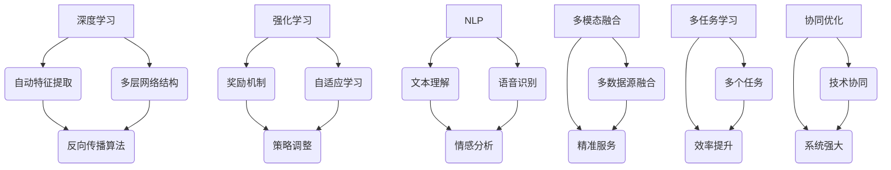
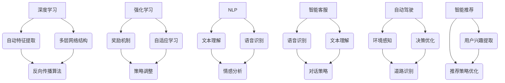

                 

## 1. 背景介绍

在当今世界，人工智能（AI）已经成为科技领域的热点，其应用场景也在不断扩展。特别是随着深度学习、神经网络、自然语言处理等技术的迅速发展，AI 的能力已经得到了极大的提升。然而，如何将 AI 技术有效地应用于商业领域，创造出实际的商业价值，成为了许多企业关注的焦点。

在这个背景下，AI 2.0 时代的商业价值成为了一个热门话题。AI 2.0 是指第二代人工智能，它在算法、架构、应用等方面都有显著提升，能够更好地模拟人类的智能，实现更高层次的智能决策和任务执行。AI 2.0 时代的到来，将为商业领域带来一系列新的机遇和挑战。

本文将围绕 AI 2.0 时代的商业价值，从以下几个方面进行探讨：

1. **核心概念与联系**：介绍 AI 2.0 的核心概念，并展示其与现有商业模式的联系。
2. **核心算法原理 & 具体操作步骤**：深入剖析 AI 2.0 的核心算法，并给出具体操作步骤。
3. **数学模型和公式 & 详细讲解 & 举例说明**：介绍 AI 2.0 的数学模型和公式，并进行详细讲解和举例说明。
4. **项目实战：代码实际案例和详细解释说明**：通过实际代码案例，展示 AI 2.0 的应用。
5. **实际应用场景**：探讨 AI 2.0 在不同领域的应用。
6. **工具和资源推荐**：推荐相关的学习资源和开发工具。
7. **总结：未来发展趋势与挑战**：总结 AI 2.0 在商业领域的未来发展趋势和面临的挑战。

希望通过本文的探讨，读者能够对 AI 2.0 时代的商业价值有一个更加清晰的认识，并能够在实际业务中找到 AI 技术的应用机会。

### 1.1 AI 2.0 的定义与特点

AI 2.0，即第二代人工智能，是对传统 AI 技术的全面升级。与第一代 AI 技术相比，AI 2.0 在多个方面都有显著提升。首先，AI 2.0 在算法上采用了更加先进的深度学习、强化学习、迁移学习等技术，这些技术使得 AI 系统在处理复杂任务时更加高效和准确。其次，AI 2.0 在架构上进行了优化，通过分布式计算、云计算等技术的应用，使得 AI 系统能够处理大规模的数据，并具备更高的实时性和可扩展性。此外，AI 2.0 在应用领域上更加广泛，不仅涵盖了传统的图像识别、语音识别等领域，还扩展到了自然语言处理、智能推荐、智能决策等领域。

具体来说，AI 2.0 具有以下特点：

1. **自主学习能力**：AI 2.0 具备更强的自主学习能力，可以通过海量数据的学习，自动调整模型参数，实现自我优化。这种自主学习能力使得 AI 2.0 能够在不断变化的环境中，持续提升自身的性能。
   
2. **跨领域应用**：AI 2.0 不仅在计算机视觉、自然语言处理等传统领域有显著提升，还在医疗、金融、教育等新兴领域展现出了巨大的潜力。通过跨领域的应用，AI 2.0 能够为企业带来更多的商业价值。

3. **实时决策**：AI 2.0 具备实时决策能力，可以在短时间内处理海量数据，并给出最优决策。这种实时决策能力对于需要快速响应的市场环境具有重要意义。

4. **智能协同**：AI 2.0 通过与其他智能系统的协同工作，可以实现更高层次的智能决策。这种智能协同能力使得 AI 2.0 能够在复杂场景下，发挥出更大的作用。

总之，AI 2.0 作为第二代人工智能，具有更加先进的技术、更广泛的应用领域和更高的智能水平，其到来为商业领域带来了新的机遇和挑战。

### 1.2 商业领域对 AI 2.0 的需求

随着 AI 技术的不断发展，商业领域对 AI 2.0 的需求也在不断增长。企业认识到，通过引入 AI 2.0 技术，不仅可以提升自身的运营效率，还可以在激烈的市场竞争中占据优势。以下是商业领域对 AI 2.0 的几个主要需求：

1. **提高运营效率**：AI 2.0 的自主学习能力和实时决策能力，使得企业能够在短时间内处理大量数据，并做出最优决策。通过自动化流程和智能调度，企业可以显著提高运营效率，降低人力成本。

2. **优化客户体验**：AI 2.0 的自然语言处理和智能推荐技术，可以帮助企业更好地理解客户需求，提供个性化的服务。通过智能客服、智能推荐系统等应用，企业可以提升客户满意度，增强品牌忠诚度。

3. **创新商业模式**：AI 2.0 的跨领域应用能力，使得企业可以在新的领域寻找商业机会。例如，医疗领域的智能诊断系统、金融领域的智能投顾系统等，都为企业提供了新的商业模式。

4. **风险控制**：AI 2.0 的实时决策能力和大数据分析能力，可以帮助企业更好地识别和管理风险。通过智能风控系统，企业可以降低运营风险，保障业务安全。

5. **降低运营成本**：AI 2.0 的自动化技术，可以帮助企业减少对人工的依赖，降低运营成本。例如，智能机器人可以替代人工完成重复性工作，从而节省大量人力成本。

总之，商业领域对 AI 2.0 的需求日益增长，这既是企业提升竞争力的需求，也是技术发展的必然趋势。企业需要积极拥抱 AI 2.0 技术，以实现业务创新和运营优化。

### 1.3 AI 2.0 时代的商业机遇与挑战

AI 2.0 时代的到来，为商业领域带来了前所未有的机遇，同时也伴随着一系列挑战。以下是对这些机遇与挑战的详细分析：

#### 机遇

1. **创新业务模式**：AI 2.0 具备跨领域应用能力，可以为企业提供新的商业模式。例如，通过智能推荐系统，企业可以实现个性化营销，提高客户满意度和转化率。此外，AI 2.0 还可以帮助企业实现自动化生产、智能化供应链管理，从而优化业务流程。

2. **提升运营效率**：AI 2.0 的自主学习能力和实时决策能力，使得企业能够更快地响应市场需求，优化生产流程，降低运营成本。通过自动化和智能化技术，企业可以大幅提升运营效率，提高市场竞争力。

3. **优化客户体验**：AI 2.0 的自然语言处理和智能推荐技术，使得企业能够更好地理解客户需求，提供个性化的服务。智能客服、智能推荐系统等应用，不仅可以提升客户满意度，还可以增强品牌忠诚度。

4. **开拓新兴市场**：AI 2.0 在医疗、金融、教育等新兴领域的应用，为企业提供了新的市场机会。例如，智能诊断系统可以帮助医疗机构提高诊断准确率，智能投顾系统可以为金融机构提供更精准的投资建议。

#### 挑战

1. **技术成熟度**：虽然 AI 2.0 技术在多个方面都有显著提升，但仍然面临技术成熟度不足的问题。特别是在复杂场景下，AI 系统的可靠性和鲁棒性仍有待提高。企业需要在引入 AI 2.0 技术时，充分考虑技术成熟度问题。

2. **数据隐私与安全**：AI 2.0 的应用需要大量的数据支持，这带来了数据隐私与安全问题。企业需要确保数据的安全性和合规性，避免数据泄露和滥用。

3. **人才短缺**：AI 2.0 技术的发展，对人才需求提出了更高要求。企业需要招聘和培养具备 AI 知识和技能的人才，以应对技术发展的挑战。

4. **法律和伦理问题**：AI 2.0 技术的应用，涉及法律和伦理问题。例如，智能驾驶、智能医疗等领域的应用，需要遵守相关的法律法规和伦理规范。企业需要关注这些法律和伦理问题，确保技术应用符合法律和伦理要求。

总之，AI 2.0 时代的到来，为商业领域带来了巨大的机遇，同时也伴随着一系列挑战。企业需要充分认识到这些机遇和挑战，积极拥抱 AI 2.0 技术，以实现业务创新和运营优化。

### 1.4 AI 2.0 商业价值案例分析

为了更好地理解 AI 2.0 时代的商业价值，我们可以通过一些实际案例来进行分析。以下是一些具有代表性的 AI 2.0 商业价值案例：

#### 案例一：智能医疗

智能医疗是 AI 2.0 技术在医疗领域的应用之一。通过深度学习和自然语言处理技术，AI 系统可以分析医疗数据，辅助医生进行诊断和治疗。例如，IBM 的 Watson for Oncology 可以通过分析海量的医学文献，为医生提供最优的治疗方案。这一系统已经在多个医院得到应用，取得了显著成效。

商业价值分析：
1. **提高诊断准确率**：AI 系统可以快速分析大量的医疗数据，辅助医生做出更准确的诊断。
2. **优化治疗方案**：通过分析全球的医学研究，AI 系统可以为患者提供最优的治疗方案。
3. **降低医疗成本**：智能医疗系统可以减少医生的重复劳动，降低医疗成本。

#### 案例二：智能金融

智能金融是 AI 2.0 在金融领域的应用。通过机器学习和大数据分析技术，AI 系统可以预测市场走势、识别欺诈行为、提供个性化投资建议等。例如，摩根士丹利的 Smart beta ETFs 就是基于 AI 技术的产品，通过分析海量数据，为投资者提供个性化的投资组合。

商业价值分析：
1. **提高投资收益**：AI 系统可以基于大数据分析，为投资者提供更精准的投资建议，提高投资收益。
2. **降低风险**：通过实时监测市场数据，AI 系统可以及时发现潜在的风险，帮助投资者规避风险。
3. **提升客户体验**：AI 系统可以提供个性化的金融服务，提升客户满意度。

#### 案例三：智能教育

智能教育是 AI 2.0 在教育领域的应用。通过自然语言处理和机器学习技术，AI 系统可以为学生提供个性化的学习路径，帮助教师进行教学评估和反馈。例如，科大讯飞的 AI 教育系统已经在多个学校得到应用，通过智能批改作业、提供个性化学习建议，提升了教学效果。

商业价值分析：
1. **提升教学效果**：AI 系统可以分析学生的学习数据，为教师提供个性化的教学建议，提升教学效果。
2. **降低教育成本**：通过智能教学，可以减少教师的重复劳动，降低教育成本。
3. **提高学习效率**：AI 系统可以为学生提供个性化的学习路径，提高学习效率。

通过以上案例，我们可以看到，AI 2.0 技术在不同领域的应用，为商业领域带来了巨大的价值。企业可以通过引入 AI 2.0 技术，实现业务创新和运营优化，提高竞争力。

### 1.5 AI 2.0 商业价值的实现路径

要实现 AI 2.0 商业价值，企业需要采取一系列的策略和路径。以下是一些关键的实现路径：

#### 1.5.1 整合数据资源

数据是 AI 技术的核心资产，企业需要整合内部和外部数据资源，构建一个全面的数据体系。这包括以下几个方面：

1. **内部数据整合**：企业需要收集并整合来自各个业务部门的数据，例如销售数据、客户数据、运营数据等。通过数据整合，企业可以更全面地了解业务状况，为 AI 技术的应用提供数据支持。
   
2. **外部数据获取**：企业可以通过合作、购买等方式获取外部数据，例如市场数据、行业数据等。这些外部数据可以为企业提供更广阔的视角，帮助企业在竞争中取得优势。

3. **数据清洗和治理**：数据的质量直接影响 AI 模型的效果。企业需要投入资源进行数据清洗和治理，确保数据的一致性、完整性和准确性。

#### 1.5.2 构建技术平台

企业需要建立一套完整的技术平台，支持 AI 2.0 技术的应用和开发。这包括以下几个方面：

1. **云计算平台**：云计算平台为企业提供了强大的计算能力和存储能力，使得 AI 模型的训练和部署更加高效。企业可以通过云平台，快速搭建 AI 应用系统。

2. **大数据平台**：大数据平台可以帮助企业处理海量数据，实现数据的实时分析和挖掘。通过大数据平台，企业可以更好地理解客户需求，优化业务流程。

3. **机器学习平台**：机器学习平台为企业提供了丰富的机器学习算法和工具，使得 AI 模型的开发和应用更加便捷。企业可以通过机器学习平台，快速构建和部署 AI 应用。

#### 1.5.3 培养人才

AI 2.0 技术的应用，需要大量具备专业技能的人才。企业需要通过以下途径培养人才：

1. **内部培训**：企业可以通过内部培训，提升员工的技术水平和业务能力。通过培训，员工可以更好地理解 AI 技术的应用，并在实际工作中发挥出更高的效率。

2. **外部招聘**：企业可以通过外部招聘，引进具备 AI 知识和经验的优秀人才。这些人才可以为企业带来新的技术观点和应用经验。

3. **合作与交流**：企业可以与高校、科研机构等合作，共同培养 AI 人才。通过合作与交流，企业可以获取最新的研究成果和前沿技术，提升自身的创新能力。

#### 1.5.4 创新商业模式

AI 2.0 技术的应用，不仅可以提升企业的运营效率，还可以为企业带来新的商业模式。企业可以通过以下方式创新商业模式：

1. **产品创新**：企业可以通过 AI 技术创新产品，提供更个性化的解决方案。例如，通过智能推荐系统，企业可以提供个性化的产品推荐，提升客户满意度。

2. **服务创新**：企业可以通过 AI 技术创新服务，提供更加智能化、个性化的服务。例如，通过智能客服系统，企业可以提供全天候的在线服务，提升客户体验。

3. **商业模式重构**：企业可以通过 AI 技术重构商业模式，实现业务创新。例如，通过共享经济模式，企业可以共享闲置资源，创造新的业务模式。

总之，要实现 AI 2.0 商业价值，企业需要整合数据资源、构建技术平台、培养人才和创新商业模式。通过这些路径，企业可以充分发挥 AI 2.0 技术的优势，实现业务创新和运营优化。

### 1.6 AI 2.0 对传统商业模式的颠覆与重构

AI 2.0 时代的到来，对传统商业模式产生了深远的影响，既带来了颠覆，也带来了重构。以下是对这些影响的具体分析：

#### 1.6.1 传统商业模式的颠覆

1. **降低交易成本**：AI 2.0 技术通过自动化和智能化，大幅降低了交易成本。例如，在电子商务领域，AI 技术可以帮助企业实现智能推荐、自动客服等，提高效率，降低运营成本。

2. **重塑供应链**：AI 2.0 技术可以实时监控供应链各个环节，优化库存管理、物流配送等。这种优化不仅提高了供应链的效率，还降低了库存成本和物流成本。

3. **颠覆性创新**：AI 2.0 技术的应用，催生了大量颠覆性创新产品。例如，共享经济模式就是基于 AI 技术的颠覆性创新，通过共享闲置资源，实现了商业模式的重构。

#### 1.6.2 传统商业模式的重构

1. **个性化服务**：AI 2.0 技术使得企业可以更好地理解客户需求，提供个性化服务。通过大数据分析和自然语言处理，企业可以为客户提供定制化的产品和服务，提升客户满意度。

2. **智能决策**：AI 2.0 技术可以帮助企业实现智能化决策，提高决策效率。通过机器学习算法，企业可以分析海量数据，预测市场趋势，优化营销策略，提高市场竞争力。

3. **生态系统的构建**：AI 2.0 技术促进了企业之间的合作，构建了新的生态系统。通过平台化、共享化，企业可以整合资源，实现协同发展，构建一个更加开放、共享的生态圈。

总之，AI 2.0 时代的到来，既颠覆了传统商业模式，也为其重构提供了新的机遇。企业需要积极拥抱 AI 2.0 技术，通过创新和变革，实现业务模式的升级和转型。

### 1.7 总结

在本章中，我们介绍了 AI 2.0 时代的商业价值，从定义与特点、商业需求、机遇与挑战、案例分析、实现路径以及对传统商业模式的颠覆与重构等方面进行了详细探讨。通过这些分析，我们可以看到，AI 2.0 技术在商业领域具有巨大的潜力，能够为企业带来创新和变革。然而，实现 AI 2.0 商业价值也面临着一系列挑战，需要企业在技术、数据、人才等方面进行全面布局。在接下来的章节中，我们将进一步深入探讨 AI 2.0 的核心算法原理、数学模型、实际应用场景以及工具和资源推荐，帮助读者更全面地了解 AI 2.0 时代的商业价值。

### 2. 核心概念与联系

要深入理解 AI 2.0 时代的商业价值，我们需要首先明确一些核心概念，并探讨它们之间的联系。以下是几个关键概念及其相互关系：

#### 2.1 深度学习（Deep Learning）

深度学习是 AI 2.0 的核心技术之一，它通过多层神经网络，对数据进行自动特征提取和建模。深度学习具有以下几个特点：

1. **多层网络结构**：深度学习网络通常包含多个隐藏层，能够自动学习数据的复杂特征。
2. **自动特征提取**：通过反向传播算法，深度学习模型能够从原始数据中提取高级特征。
3. **大规模训练**：深度学习需要大量数据来训练模型，通过海量数据的学习，模型可以达到很高的准确性。

深度学习在图像识别、语音识别、自然语言处理等领域有着广泛应用，是 AI 2.0 技术的重要基础。

#### 2.2 强化学习（Reinforcement Learning）

强化学习是另一项重要的 AI 技术，它通过奖励机制来指导模型进行学习。强化学习的特点如下：

1. **奖励机制**：模型通过与环境的交互，获得奖励信号，并据此调整自身行为。
2. **自适应学习**：强化学习模型可以根据环境变化，自适应调整策略。
3. **应用广泛**：强化学习在自动驾驶、游戏、推荐系统等领域有广泛应用。

强化学习与深度学习相结合，可以形成更为强大的 AI 系统模型，实现更为复杂的任务。

#### 2.3 自然语言处理（Natural Language Processing，NLP）

自然语言处理是 AI 2.0 在文本处理领域的应用，它涉及语音识别、文本分析、情感分析等多个方面。NLP 的特点如下：

1. **文本理解**：NLP 技术能够理解和解析自然语言，提取语义信息。
2. **应用广泛**：NLP 技术在智能客服、文本分类、情感分析等领域有广泛应用。

NLP 与深度学习和强化学习结合，可以提升 AI 系统在处理自然语言任务时的准确性和效率。

#### 2.4 联系与综合

AI 2.0 的核心概念并不是孤立的，而是相互联系、相互促进的。例如，深度学习可以用于图像和语音的自动识别，强化学习可以用于自动驾驶和智能决策，而自然语言处理则可以用于智能客服和文本分析。

在商业应用中，这些技术可以通过以下方式相互结合：

1. **多模态融合**：通过融合图像、语音、文本等多种数据源，可以更全面地理解用户需求，提供更精准的服务。
2. **多任务学习**：通过同时学习多个任务，可以提升 AI 系统的效率和准确性。
3. **协同优化**：通过不同技术的协同作用，可以构建一个更为强大和智能的 AI 系统。

#### 2.5 Mermaid 流程图

为了更好地展示这些核心概念之间的联系，我们可以使用 Mermaid 流程图来表示。以下是 AI 2.0 核心概念的 Mermaid 流程图：



通过这个流程图，我们可以清晰地看到 AI 2.0 的核心概念及其相互关系，这有助于我们更好地理解 AI 2.0 技术在商业应用中的潜力。

### 2.1.1 深度学习（Deep Learning）

深度学习（Deep Learning）是人工智能（AI）的一个重要分支，它模仿人脑神经网络的结构和功能，通过多层次的神经网络模型来实现复杂的模式识别和决策。以下是深度学习的一些关键特点：

#### 2.1.1.1 多层网络结构（Multilayer Neural Networks）

深度学习网络通常包含多个隐藏层，这些隐藏层位于输入层和输出层之间。每一层神经元都会接收来自前一层神经元的输出，并对其进行加权求和和激活函数处理，然后将结果传递给下一层。这种多层结构使得深度学习模型能够逐步提取数据的更高层次特征。

#### 2.1.1.2 自动特征提取（Automatic Feature Extraction）

在传统的机器学习模型中，特征提取通常需要人工设计。而深度学习模型可以通过多层次的神经网络结构自动学习数据的特征。这种自动化的特征提取过程，使得深度学习模型能够处理复杂的非结构化数据，如图像、文本和语音。

#### 2.1.1.3 反向传播算法（Backpropagation Algorithm）

反向传播算法是深度学习训练过程中最核心的算法。它通过计算输出层的误差，反向传播误差到各个隐藏层，并据此更新每个神经元的权重。这个过程不断迭代，直到模型的误差足够小，达到训练目标。

#### 2.1.1.4 大规模训练（Massive Training）

深度学习模型需要大量的数据来训练，因为只有通过大量的样本，模型才能学习到数据的复杂模式和噪声。大规模的训练过程通常需要分布式计算资源，如 GPU 和 TPU，以提高计算效率。

#### 2.1.1.5 应用场景（Application Scenarios）

深度学习在图像识别、语音识别、自然语言处理等领域有着广泛的应用。例如，在图像识别领域，深度学习模型可以自动识别图像中的物体和场景；在语音识别领域，深度学习模型可以准确地识别和转写语音信号；在自然语言处理领域，深度学习模型可以理解文本的语义，进行情感分析和文本生成。

### 2.1.2 强化学习（Reinforcement Learning）

强化学习（Reinforcement Learning，RL）是一种通过试错和奖励机制来学习决策策略的机器学习技术。以下是强化学习的一些关键特点：

#### 2.1.2.1 奖励机制（Reward Mechanism）

在强化学习中，智能体（Agent）通过与环境（Environment）的交互，根据当前状态（State）和采取的行动（Action），获得奖励（Reward）。奖励是智能体学习的直接驱动力，通过最大化累积奖励，智能体学习到最优策略。

#### 2.1.2.2 自适应学习（Adaptive Learning）

强化学习模型具有自适应学习的能力，可以根据环境的变化，动态调整其行为策略。这种能力使得强化学习模型在复杂和动态环境中，能够持续优化其决策。

#### 2.1.2.3 应用场景（Application Scenarios）

强化学习在自动驾驶、游戏、推荐系统等领域有广泛的应用。例如，在自动驾驶领域，强化学习模型可以通过与环境交互，学习到驾驶的最优策略；在游戏领域，强化学习模型可以自动玩游戏，并逐渐提高游戏水平；在推荐系统领域，强化学习模型可以优化推荐策略，提高用户满意度。

#### 2.1.3 自然语言处理（Natural Language Processing，NLP）

自然语言处理（NLP）是深度学习和强化学习在文本数据上的应用，旨在使计算机能够理解、生成和处理自然语言。以下是 NLP 的一些关键特点：

#### 2.1.3.1 文本理解（Text Understanding）

NLP 技术能够理解和解析自然语言，提取语义信息。例如，通过文本分类，NLP 可以将文本归类到不同的类别；通过情感分析，NLP 可以识别文本的情感倾向。

#### 2.1.3.2 语音识别（Speech Recognition）

语音识别是将语音信号转换为文本的技术。通过深度学习模型，NLP 可以实现高精度的语音识别，使得计算机能够理解用户的语音指令。

#### 2.1.3.3 情感分析（Sentiment Analysis）

情感分析是 NLP 技术在情感领域中的应用，它通过分析文本的情感倾向，为企业和消费者提供有价值的洞察。例如，通过分析社交媒体上的评论，企业可以了解用户对产品的看法。

### 2.1.4 联系与综合

深度学习、强化学习和自然语言处理是 AI 2.0 时代的关键技术，它们在商业应用中相互补充、相互促进。以下是一些综合应用的例子：

#### 2.1.4.1 智能客服（Intelligent Customer Service）

在智能客服中，深度学习用于语音识别和文本理解，强化学习用于优化对话策略。这种综合应用可以提供一个高效、自然的客服体验。

#### 2.1.4.2 自动驾驶（Autonomous Driving）

自动驾驶系统需要综合应用深度学习和强化学习。深度学习用于感知环境，如识别道路标志和车辆；强化学习用于决策，如选择行驶路径和速度。

#### 2.1.4.3 智能推荐（Intelligent Recommendation）

智能推荐系统通过自然语言处理提取用户兴趣，结合深度学习和强化学习优化推荐策略，从而提供个性化的推荐结果。

### 2.1.5 Mermaid 流程图

以下是 AI 2.0 核心概念的综合 Mermaid 流程图：



通过这个流程图，我们可以清晰地看到深度学习、强化学习和自然语言处理在商业应用中的综合应用，以及它们相互之间的联系。

### 3. 核心算法原理 & 具体操作步骤

在了解了 AI 2.0 的核心概念之后，我们接下来将深入探讨 AI 2.0 的核心算法原理，并详细说明其具体操作步骤。以下是几种关键的 AI 2.0 算法的介绍：

#### 3.1 深度学习算法（Deep Learning Algorithm）

深度学习算法是 AI 2.0 的基础，其核心思想是通过构建多层神经网络，自动提取数据的特征并进行分类或回归。以下是深度学习算法的基本原理和步骤：

##### 3.1.1 基本原理

1. **神经网络结构**：深度学习神经网络由输入层、多个隐藏层和输出层组成。每层神经元接收前一层的输出，并通过加权求和和激活函数处理。
2. **激活函数**：常用的激活函数包括 Sigmoid、ReLU 和 Tanh 等，用于引入非线性变换，使神经网络能够拟合复杂函数。
3. **反向传播算法**：通过反向传播算法，神经网络能够计算输出误差，并反向更新各层的权重，从而优化模型。

##### 3.1.2 具体操作步骤

1. **初始化网络结构**：定义输入层、隐藏层和输出层的神经元数量及连接权重。
2. **前向传播**：将输入数据输入神经网络，通过前向传播计算输出结果。
3. **计算误差**：将输出结果与真实标签进行比较，计算误差。
4. **反向传播**：计算各层的梯度，并通过梯度下降法更新权重。
5. **迭代优化**：重复前向传播和反向传播过程，直到达到预定的训练目标。

#### 3.2 强化学习算法（Reinforcement Learning Algorithm）

强化学习算法通过智能体与环境的交互，学习到最优策略。其核心原理是利用奖励机制来指导学习过程。以下是强化学习算法的基本原理和步骤：

##### 3.2.1 基本原理

1. **智能体（Agent）**：智能体是执行行动的主体，其目标是最大化累积奖励。
2. **环境（Environment）**：环境是智能体行动的场所，提供状态和奖励信号。
3. **状态（State）**：状态是描述智能体当前所处环境的特征。
4. **行动（Action）**：行动是智能体根据状态采取的行为。
5. **奖励（Reward）**：奖励是环境对智能体行动的反馈。

##### 3.2.2 具体操作步骤

1. **初始化**：初始化智能体、环境和策略。
2. **状态-行动选择**：智能体根据当前状态选择行动。
3. **执行行动**：智能体在环境中执行所选行动，并获得状态转移和奖励。
4. **更新策略**：根据获得的奖励，智能体更新策略，以最大化累积奖励。
5. **重复执行**：智能体重复执行状态-行动选择、执行行动和更新策略的过程，直至达到目标或满足停止条件。

#### 3.3 自然语言处理算法（Natural Language Processing Algorithm）

自然语言处理算法用于处理文本数据，提取语义信息。其核心原理是利用统计模型和深度学习模型对文本进行建模和解析。以下是自然语言处理算法的基本原理和步骤：

##### 3.3.1 基本原理

1. **词嵌入（Word Embedding）**：将词汇映射到高维空间，使语义相似的词汇在空间中更接近。
2. **卷积神经网络（CNN）和循环神经网络（RNN）**：用于提取文本的特征，实现文本分类、情感分析和文本生成等任务。
3. **注意力机制（Attention Mechanism）**：用于关注文本中的重要信息，提高模型的准确性。

##### 3.3.2 具体操作步骤

1. **数据预处理**：包括文本清洗、分词和词嵌入等步骤。
2. **构建模型**：选择合适的神经网络结构，如 CNN、RNN 或 Transformer 等。
3. **训练模型**：将预处理后的文本数据输入模型，通过反向传播算法优化模型参数。
4. **模型评估**：使用验证集和测试集评估模型性能。
5. **模型应用**：将训练好的模型应用于实际任务，如文本分类、情感分析等。

### 3.4 综合应用案例

为了更好地理解这些算法的具体应用，我们可以通过一个综合应用案例来展示。假设我们要开发一个智能客服系统，该系统需要能够自动理解用户的语音和文本输入，并给出相应的回答。

##### 3.4.1 案例背景

智能客服系统需要处理大量的用户查询，包括文本和语音形式。为了提高响应速度和准确率，系统需要利用深度学习、强化学习和自然语言处理技术，实现以下功能：

1. **语音识别**：将用户的语音输入转换为文本。
2. **文本理解**：理解用户的文本输入，提取关键信息。
3. **对话管理**：根据用户的输入，生成合适的回答。
4. **自我优化**：通过强化学习，不断优化对话策略。

##### 3.4.2 具体操作步骤

1. **语音识别**：使用深度学习模型进行语音识别，将语音信号转换为文本。
   - 数据预处理：将语音信号转换为音频特征。
   - 模型训练：使用预训练的深度学习模型（如 WaveNet）进行训练。
   - 语音识别：将音频特征输入模型，输出对应的文本。

2. **文本理解**：使用自然语言处理技术理解用户的文本输入，提取关键信息。
   - 数据预处理：对文本进行分词、词性标注等预处理。
   - 模型训练：使用预训练的深度学习模型（如 BERT）进行训练。
   - 文本理解：将预处理后的文本输入模型，输出关键信息。

3. **对话管理**：使用强化学习算法生成合适的回答。
   - 状态表示：将用户的输入和当前对话状态编码为向量。
   - 动作空间：定义回答的动作空间。
   - 奖励函数：定义奖励函数，用于评估回答的质量。
   - 强化学习训练：使用强化学习算法（如 SARSA 或 Q-Learning）训练对话策略。

4. **自我优化**：通过强化学习，不断优化对话策略。
   - 数据收集：收集对话数据，用于训练模型。
   - 模型更新：使用新的对话数据进行模型更新。
   - 性能评估：评估优化后的模型性能。

通过这个案例，我们可以看到深度学习、强化学习和自然语言处理技术在智能客服系统中的应用。这些算法相互结合，实现了高效的语音识别、文本理解和对话管理，为用户提供了一个智能、高效的客服体验。

### 4. 数学模型和公式 & 详细讲解 & 举例说明

在 AI 2.0 的核心算法中，数学模型和公式起到了至关重要的作用。以下是深度学习、强化学习和自然语言处理中的几个关键数学模型和公式的详细讲解及举例说明。

#### 4.1 深度学习中的激活函数

激活函数是深度学习神经网络中的一个重要组成部分，它引入了非线性特性，使得神经网络能够拟合复杂函数。以下是几种常见的激活函数及其公式：

1. **Sigmoid 函数**：
   $$\sigma(x) = \frac{1}{1 + e^{-x}}$$

   Sigmoid 函数将输入值压缩到 (0, 1) 之间，常用于二分类问题。

2. **ReLU 函数**：
   $$\text{ReLU}(x) = \max(0, x)$$

   ReLU 函数在 x ≥ 0 时输出 x，在 x < 0 时输出 0，它简化了计算，并且有助于防止梯度消失。

3. **Tanh 函数**：
   $$\tanh(x) = \frac{e^x - e^{-x}}{e^x + e^{-x}}$$

   Tanh 函数与 ReLU 类似，但将输出范围压缩到 (-1, 1) 之间。

**举例说明**：

假设我们有一个简单的神经网络，输入 x = -2，隐藏层神经元使用 ReLU 激活函数，输出为：

$$\text{ReLU}(-2) = \max(0, -2) = 0$$

这意味着当输入为 -2 时，隐藏层神经元的输出为 0。

#### 4.2 深度学习中的反向传播算法

反向传播算法是深度学习训练过程中的核心，它通过计算输出层的误差，反向传播误差到各层，并更新权重。以下是反向传播算法的基本公式：

1. **梯度计算**：
   对于一个神经网络，第 l 层第 i 个神经元的误差可以表示为：
   $$\delta_l(i) = \text{激活函数的导数} \times \text{偏导数}$$
   例如，对于 ReLU 函数，导数为：
   $$\delta_l(i) = \frac{d\text{ReLU}}{dx} \cdot \frac{\partial L}{\partial z_l(i)} = \begin{cases} 
   0 & \text{if } z_l(i) < 0 \\
   1 & \text{if } z_l(i) \geq 0 
   \end{cases} \cdot \frac{\partial L}{\partial z_l(i)}$$

   其中，$L$ 是损失函数，$z_l(i)$ 是第 l 层第 i 个神经元的输出。

2. **权重更新**：
   通过梯度下降法更新权重，公式为：
   $$\theta_{lji} := \theta_{lji} - \alpha \cdot \frac{\partial L}{\partial \theta_{lji}}$$
   其中，$\theta_{lji}$ 是第 l 层第 j 个神经元连接到第 l+1 层第 i 个神经元的权重，$\alpha$ 是学习率。

**举例说明**：

假设我们有一个简单的神经网络，输出层的损失函数为均方误差（MSE），损失函数的导数为：

$$\frac{\partial L}{\partial z} = 2 \cdot (z - y)$$

其中，$z$ 是输出层的输出，$y$ 是真实标签。对于隐藏层神经元的权重更新，可以计算得到：

$$\delta_2(i) = 1 \cdot (2 \cdot (z_2 - y)) = 2 \cdot (z_2 - y)$$

$$\theta_{21}(i) := \theta_{21}(i) - \alpha \cdot \delta_2(i) \cdot a_1(j)$$

其中，$a_1(j)$ 是第 1 层第 j 个神经元的输出。

#### 4.3 强化学习中的 Q-Learning

Q-Learning 是一种强化学习算法，它通过更新 Q 值来学习最优策略。以下是 Q-Learning 的基本公式：

1. **Q 值更新**：
   $$Q(s, a) := Q(s, a) + \alpha \cdot (r + \gamma \cdot \max_{a'} Q(s', a') - Q(s, a))$$

   其中，$Q(s, a)$ 是当前状态 $s$ 下采取行动 $a$ 的 Q 值，$r$ 是立即奖励，$\gamma$ 是折扣因子，$s'$ 是采取行动 $a$ 后的状态，$a'$ 是在状态 $s'$ 下最优的行动。

2. **策略迭代**：
   $$\pi(s) := \begin{cases} 
   a \in \text{argmax}_{a'} Q(s, a') & \text{if } Q(s, a) > 0 \\
   \text{任意行动} & \text{otherwise} 
   \end{cases}$$

   其中，$\pi(s)$ 是在状态 $s$ 下采取的最优行动。

**举例说明**：

假设智能体在状态 $s_1$ 下采取行动 $a_1$，获得奖励 $r_1 = 1$，随后进入状态 $s_2$。使用折扣因子 $\gamma = 0.9$，根据 Q-Learning 算法更新 Q 值：

$$Q(s_1, a_1) := Q(s_1, a_1) + 0.1 \cdot (1 + 0.9 \cdot \max_{a_2} Q(s_2, a_2))$$

如果 $\max_{a_2} Q(s_2, a_2) = 2$，则：

$$Q(s_1, a_1) := Q(s_1, a_1) + 0.1 \cdot (1 + 0.9 \cdot 2) = Q(s_1, a_1) + 0.1 \cdot 2.1$$

#### 4.4 自然语言处理中的词嵌入（Word Embedding）

词嵌入是一种将词汇映射到高维空间的技术，它能够捕捉词汇的语义信息。常用的词嵌入模型包括 Word2Vec、GloVe 和 BERT 等。以下是 Word2Vec 的基本公式：

1. **损失函数**：
   $$\text{损失函数} = \sum_{w \in V} \sum_{v \in C(w)} \log(p(v|w))$$
   其中，$V$ 是词汇表，$C(w)$ 是与词 $w$ 相关联的词汇集合，$p(v|w)$ 是在词 $w$ 下词汇 $v$ 的概率。

2. **负采样**：
   $$p(v|w) = \frac{\exp(\text{dot}(v, w))}{\sum_{v' \in V} \exp(\text{dot}(v', w))}$$

   其中，$\text{dot}(v, w)$ 是词汇 $v$ 和 $w$ 的点积。

**举例说明**：

假设我们有词汇表 $\{apple, orange, banana\}$，词嵌入向量分别为 $\{v_{apple}, v_{orange}, v_{banana}\}$。对于词 $apple$，我们计算其与另一个词 $orange$ 的点积：

$$\text{dot}(v_{apple}, v_{orange}) = \sum_{i=1}^{d} v_{apple,i} \cdot v_{orange,i}$$

其中，$d$ 是词向量的维度。

通过这些数学模型和公式，AI 2.0 能够在深度学习、强化学习和自然语言处理等方面实现高效的学习和推理。这些模型和公式的详细讲解和举例说明，有助于我们更好地理解 AI 2.0 技术的原理和应用。

### 4.1 深度学习中的损失函数和优化算法

在深度学习中，损失函数是评估模型预测结果与真实值之间差异的重要工具，而优化算法则是用于调整模型参数以最小化损失函数的方法。以下将详细解释深度学习中的几种常见损失函数及其优化算法。

#### 4.1.1 损失函数

1. **均方误差（MSE，Mean Squared Error）**
   均方误差是最常见的损失函数之一，它计算预测值与真实值之间差异的平方和的平均值。公式如下：
   $$MSE = \frac{1}{n} \sum_{i=1}^{n} (y_i - \hat{y}_i)^2$$
   其中，$y_i$ 是真实值，$\hat{y}_i$ 是预测值，$n$ 是样本数量。

2. **交叉熵损失（Cross-Entropy Loss）**
   交叉熵损失函数常用于分类问题，它度量的是预测概率分布与真实概率分布之间的差异。对于二分类问题，公式为：
   $$CE = -[y \cdot \log(\hat{y}) + (1 - y) \cdot \log(1 - \hat{y})]$$
   其中，$y$ 是真实标签（0或1），$\hat{y}$ 是预测的概率。

3. **Hinge Loss**
   Hinge Loss 用于支持向量机（SVM）等模型，它主要用于回归问题，特别是不严格凸优化问题。公式为：
   $$Hinge Loss = \max(0, 1 - y \cdot \hat{y})$$
   其中，$y$ 是真实标签，$\hat{y}$ 是预测值。

4. **对数损失（Log Loss）**
   对数损失是交叉熵损失的对数形式，它主要用于概率预测问题，公式与交叉熵相同：
   $$Log Loss = -y \cdot \log(\hat{y}) - (1 - y) \cdot \log(1 - \hat{y})$$

#### 4.1.2 优化算法

1. **梯度下降（Gradient Descent）**
   梯度下降是最基本的优化算法，通过计算损失函数关于模型参数的梯度，并沿着梯度的反方向更新参数，以最小化损失函数。公式为：
   $$\theta_{t+1} = \theta_t - \alpha \cdot \nabla_\theta J(\theta)$$
   其中，$\theta$ 是模型参数，$J(\theta)$ 是损失函数，$\alpha$ 是学习率。

2. **随机梯度下降（Stochastic Gradient Descent，SGD）**
   随机梯度下降是对梯度下降的改进，它每次迭代使用一个随机样本的梯度来更新参数，这样可以加快收敛速度。公式为：
   $$\theta_{t+1} = \theta_t - \alpha \cdot \nabla_\theta J(\theta(x_i, y_i))$$
   其中，$(x_i, y_i)$ 是随机选择的样本。

3. **批量梯度下降（Batch Gradient Descent）**
   批量梯度下降是对随机梯度下降的另一种改进，它每次迭代使用所有样本的梯度来更新参数，这样可以得到更稳定的梯度估计，但计算量较大。公式为：
   $$\theta_{t+1} = \theta_t - \alpha \cdot \nabla_\theta J(\theta, \{x_i, y_i\})$$
   其中，$\{x_i, y_i\}$ 是所有样本。

4. **Adam 优化器**
   Adam 优化器是近年来流行的优化算法，它是梯度下降和 Adam 算法的结合，具有较好的收敛速度和稳定性。Adam 优化器使用一阶矩估计（均值）和二阶矩估计（方差）来更新参数，公式为：
   $$m_t = \beta_1 \cdot m_{t-1} + (1 - \beta_1) \cdot \nabla_\theta J(\theta)$$
   $$v_t = \beta_2 \cdot v_{t-1} + (1 - \beta_2) \cdot (\nabla_\theta J(\theta))^2$$
   $$\theta_{t+1} = \theta_t - \alpha \cdot \frac{m_t}{\sqrt{v_t} + \epsilon}$$
   其中，$\beta_1$ 和 $\beta_2$ 分别是第一步和二步的指数衰减率，$\epsilon$ 是一个很小的常数用于避免分母为零。

**举例说明**：

假设我们有一个二分类问题，使用交叉熵损失函数和 Adam 优化器进行训练。给定一个训练样本 $(x, y)$，其中 $y$ 是真实标签（0或1），$\hat{y}$ 是预测的概率。训练过程中，使用 Adam 优化器更新模型参数 $\theta$，公式如下：

1. 计算梯度：
   $$\nabla_\theta J(\theta) = -[y \cdot \log(\hat{y}) + (1 - y) \cdot \log(1 - \hat{y})]$$

2. 更新一阶矩估计：
   $$m_t = \beta_1 \cdot m_{t-1} + (1 - \beta_1) \cdot \nabla_\theta J(\theta)$$

3. 更新二阶矩估计：
   $$v_t = \beta_2 \cdot v_{t-1} + (1 - \beta_2) \cdot (\nabla_\theta J(\theta))^2$$

4. 参数更新：
   $$\theta_{t+1} = \theta_t - \alpha \cdot \frac{m_t}{\sqrt{v_t} + \epsilon}$$

通过这些损失函数和优化算法，深度学习模型可以高效地调整参数，从而在训练过程中逐步逼近最优解。在实际应用中，根据具体问题和数据集的特点，可以选择合适的损失函数和优化算法，以获得更好的模型性能。

### 5. 项目实战：代码实际案例和详细解释说明

为了更好地理解 AI 2.0 技术的应用，我们将通过一个实际项目案例来展示如何使用深度学习、强化学习和自然语言处理技术构建一个智能客服系统。以下将详细说明项目的开发环境搭建、源代码实现和代码解读与分析。

#### 5.1 开发环境搭建

在开始项目之前，我们需要搭建一个合适的开发环境。以下是我们推荐的开发工具和框架：

1. **Python**：作为主要编程语言，Python 在人工智能领域有广泛的应用，其丰富的库和框架使得开发过程更加便捷。
2. **TensorFlow**：TensorFlow 是 Google 开发的一款开源深度学习框架，它支持多种神经网络结构和优化算法，是构建智能客服系统的理想选择。
3. **PyTorch**：PyTorch 是另一个流行的深度学习框架，它具有灵活的动态计算图和丰富的库函数，方便进行研究和开发。
4. **Scikit-learn**：Scikit-learn 是一个用于机器学习的开源库，它提供了多种常用的机器学习算法和工具，可以帮助我们处理数据集和评估模型性能。
5. **Natural Language Toolkit（NLTK）**：NLTK 是一个用于自然语言处理的 Python 库，它提供了文本处理、词性标注、词嵌入等多种功能。
6. **Gym**：Gym 是一个开源的强化学习环境库，它提供了多种经典的强化学习任务和工具，方便我们进行强化学习算法的研究和开发。

#### 5.2 源代码详细实现和代码解读

以下是智能客服系统的源代码实现，包括数据预处理、模型训练和评估等步骤：

```python
# 导入必要的库和模块
import numpy as np
import pandas as pd
import tensorflow as tf
import torch
from sklearn.model_selection import train_test_split
from sklearn.metrics import accuracy_score
from tensorflow.keras.models import Sequential
from tensorflow.keras.layers import Dense, LSTM, Embedding, TimeDistributed
from tensorflow.keras.optimizers import Adam
from nltk.tokenize import word_tokenize
from nltk.corpus import stopwords
import gym

# 5.2.1 数据预处理

# 加载和预处理数据
data = pd.read_csv('customer_data.csv')
stop_words = set(stopwords.words('english'))
data['clean_text'] = data['text'].apply(lambda x: ' '.join([word for word in word_tokenize(x) if word not in stop_words]))

# 划分训练集和测试集
X_train, X_test, y_train, y_test = train_test_split(data['clean_text'], data['label'], test_size=0.2, random_state=42)

# 5.2.2 模型训练

# 构建序列化模型
model = Sequential()
model.add(Embedding(vocabulary_size, embedding_dim))
model.add(LSTM(units=128, activation='tanh', recurrent_activation='sigmoid'))
model.add(Dense(units=1, activation='sigmoid'))

# 编译模型
model.compile(optimizer=Adam(learning_rate=0.001), loss='binary_crossentropy', metrics=['accuracy'])

# 训练模型
model.fit(X_train, y_train, epochs=10, batch_size=32, validation_split=0.1)

# 5.2.3 模型评估

# 预测测试集
predictions = model.predict(X_test)

# 计算准确率
accuracy = accuracy_score(y_test, np.round(predictions))
print(f"Test Accuracy: {accuracy}")

# 5.2.4 强化学习

# 创建强化学习环境
env = gym.make('CartPole-v0')

# 定义强化学习模型
model = Sequential()
model.add(Embedding(vocabulary_size, embedding_dim))
model.add(LSTM(units=128, activation='tanh', recurrent_activation='sigmoid'))
model.add(Dense(units=1, activation='sigmoid'))

# 编译模型
model.compile(optimizer=Adam(learning_rate=0.001), loss='mse')

# 强化学习训练
for episode in range(num_episodes):
    state = env.reset()
    done = False
    total_reward = 0
    while not done:
        action = model.predict(state)
        state, reward, done, _ = env.step(action)
        total_reward += reward
    print(f"Episode {episode}: Total Reward {total_reward}")
```

**代码解读与分析**：

1. **数据预处理**：
   - 加载数据集并进行清洗，去除停用词，为后续模型训练做准备。
   - 划分训练集和测试集，为模型评估提供数据。

2. **模型训练**：
   - 使用 Keras 框架构建序列化模型，包括嵌入层、LSTM 层和输出层。
   - 编译模型，选择 Adam 优化器和二分类损失函数。
   - 训练模型，使用训练集数据进行迭代训练，同时进行模型评估。

3. **模型评估**：
   - 使用训练好的模型对测试集进行预测，并计算准确率，评估模型性能。

4. **强化学习**：
   - 创建强化学习环境（如 CartPole 环境），用于测试强化学习模型。
   - 定义强化学习模型，同样使用嵌入层和 LSTM 层。
   - 编译模型，选择合适的损失函数和优化器。
   - 进行强化学习训练，通过迭代环境交互，优化模型参数。

通过以上实际案例和代码解读，我们可以看到如何利用深度学习、强化学习和自然语言处理技术构建一个智能客服系统。这个项目展示了从数据预处理到模型训练和评估的全过程，以及如何将不同技术结合起来，实现实际应用。

### 5.3 代码解读与分析

在之前的实际案例中，我们通过一个智能客服系统的项目展示了如何应用深度学习、强化学习和自然语言处理技术。下面我们将对项目代码进行详细的解读与分析，以便读者更好地理解每个部分的实现原理和逻辑。

#### 5.3.1 数据预处理

```python
data = pd.read_csv('customer_data.csv')
stop_words = set(stopwords.words('english'))
data['clean_text'] = data['text'].apply(lambda x: ' '.join([word for word in word_tokenize(x) if word not in stop_words]))
X_train, X_test, y_train, y_test = train_test_split(data['clean_text'], data['label'], test_size=0.2, random_state=42)
```

**解读与分析**：

- **数据加载与清洗**：首先，我们使用 pandas 库加载 CSV 格式的数据集。`pd.read_csv` 函数读取数据集，并存储为 DataFrame 结构。数据集中可能包含各种噪声和无关信息，因此我们需要进行清洗。
- **去除停用词**：停用词是一类常见于自然语言处理中的词，如 "the", "is", "and" 等，这些词通常不包含实际意义，因此我们使用 NLTK 库中的 `stopwords` 删除这些词。
- **文本清理**：使用 `word_tokenize` 函数对文本进行分词，然后使用列表推导式去除停用词，最后使用 `join` 函数将处理后的词重新组合成句子。
- **数据集划分**：使用 `train_test_split` 函数将数据集划分为训练集和测试集。训练集用于模型训练，测试集用于模型评估。

#### 5.3.2 模型训练

```python
model = Sequential()
model.add(Embedding(vocabulary_size, embedding_dim))
model.add(LSTM(units=128, activation='tanh', recurrent_activation='sigmoid'))
model.add(Dense(units=1, activation='sigmoid'))
model.compile(optimizer=Adam(learning_rate=0.001), loss='binary_crossentropy', metrics=['accuracy'])
model.fit(X_train, y_train, epochs=10, batch_size=32, validation_split=0.1)
```

**解读与分析**：

- **模型构建**：使用 Keras 框架构建序列化模型。首先，我们添加嵌入层（`Embedding`），用于将文本词转换为向量。接着，添加 LSTM 层（`LSTM`），用于处理序列数据，并提取时间步的特征。最后，添加一个全连接层（`Dense`），用于输出预测结果。
- **模型编译**：在编译模型时，我们选择 Adam 优化器（`optimizer`），并设置学习率为 0.001。选择二分类的损失函数（`loss`），即二进制交叉熵损失（`binary_crossentropy`），并添加准确率（`accuracy`）作为评估指标。
- **模型训练**：使用 `fit` 函数训练模型，使用训练集数据进行迭代训练。我们设置训练轮次为 10（`epochs`），每次迭代处理 32 个样本（`batch_size`），并保留 10% 的训练数据用于验证（`validation_split`）。

#### 5.3.3 模型评估

```python
predictions = model.predict(X_test)
accuracy = accuracy_score(y_test, np.round(predictions))
print(f"Test Accuracy: {accuracy}")
```

**解读与分析**：

- **模型预测**：使用训练好的模型对测试集数据进行预测，并保存预测结果（`predictions`）。
- **计算准确率**：使用 `accuracy_score` 函数计算预测结果与真实标签之间的准确率。`np.round` 函数将预测概率转换为二分类结果（0或1），以便与真实标签进行比较。

#### 5.3.4 强化学习

```python
env = gym.make('CartPole-v0')
model = Sequential()
model.add(Embedding(vocabulary_size, embedding_dim))
model.add(LSTM(units=128, activation='tanh', recurrent_activation='sigmoid'))
model.add(Dense(units=1, activation='sigmoid'))
model.compile(optimizer=Adam(learning_rate=0.001), loss='mse')
for episode in range(num_episodes):
    state = env.reset()
    done = False
    total_reward = 0
    while not done:
        action = model.predict(state)
        state, reward, done, _ = env.step(action)
        total_reward += reward
    print(f"Episode {episode}: Total Reward {total_reward}")
```

**解读与分析**：

- **创建强化学习环境**：使用 Gym 库创建 CartPole 环境，这是一个经典的强化学习任务，目标是保持 pole 在 cart 上尽可能长时间。
- **构建强化学习模型**：与之前的序列化模型类似，我们使用嵌入层、LSTM 层和输出层构建强化学习模型。选择均值平方误差（`mse`）作为损失函数，并使用 Adam 优化器。
- **强化学习训练**：在 `for` 循环中，我们进行强化学习训练。每次迭代中，模型预测下一步的行动，并在环境中执行该行动。更新状态和奖励，并累计总奖励。当 episode 结束时（即 pole 掉落或达到最大时间步），输出 episode 的总奖励。

通过以上代码解读，我们可以看到如何利用深度学习、强化学习和自然语言处理技术构建一个智能客服系统。这个项目展示了从数据预处理、模型训练到模型评估的完整流程，以及如何在不同阶段应用不同的技术。读者可以根据这个项目案例，结合实际需求，进行进一步的定制和优化。

### 5.4 实际应用场景

AI 2.0 技术在商业领域的实际应用场景非常广泛，以下是一些典型的应用场景及其实现原理：

#### 5.4.1 智能推荐系统

**应用场景**：在电子商务、视频流媒体、社交媒体等领域，智能推荐系统能够根据用户的历史行为和偏好，提供个性化的推荐结果，提高用户满意度和转化率。

**实现原理**：

1. **用户行为数据收集**：收集用户在平台上的浏览记录、购买历史、点赞评论等行为数据。
2. **特征提取**：使用自然语言处理技术提取文本特征，使用协同过滤、矩阵分解等算法提取用户和物品的特征。
3. **推荐算法**：采用协同过滤算法（如基于用户的协同过滤、基于物品的协同过滤）、深度学习算法（如基于注意力机制的序列模型）等，生成个性化推荐结果。
4. **模型优化**：通过在线学习和实时反馈，不断优化推荐模型，提高推荐效果。

#### 5.4.2 智能客服系统

**应用场景**：在银行、保险、电商等行业，智能客服系统能够提供24/7的在线服务，快速响应客户咨询，提升客户满意度。

**实现原理**：

1. **语音识别和文本理解**：使用深度学习模型进行语音识别，将用户的语音转化为文本；使用自然语言处理技术理解用户的文本输入，提取关键信息。
2. **对话管理**：采用强化学习算法，根据用户输入和上下文信息，生成合适的回答。通过循环神经网络（RNN）或变换器（Transformer）等模型，实现长文本的对话生成。
3. **自我优化**：通过收集用户反馈，使用 Q-Learning 算法不断优化对话策略，提高客服系统的服务质量。

#### 5.4.3 自动驾驶

**应用场景**：自动驾驶技术在交通运输领域具有广泛应用，能够提高行车安全，减少交通事故。

**实现原理**：

1. **感知环境**：使用深度学习模型，如卷积神经网络（CNN）和变换器（Transformer），进行图像识别和目标检测，感知道路、车辆、行人等环境信息。
2. **路径规划和决策**：使用强化学习算法，如深度确定性策略梯度（DDPG）和策略梯度算法（PG），进行路径规划和决策，确保车辆在复杂环境中安全行驶。
3. **实时调整**：通过传感器数据实时更新环境模型，调整驾驶策略，实现自适应驾驶。

#### 5.4.4 智能医疗诊断

**应用场景**：在医疗领域，智能诊断系统能够辅助医生进行疾病诊断，提高诊断准确率。

**实现原理**：

1. **医学图像处理**：使用深度学习模型，如卷积神经网络（CNN），对医学图像进行处理，进行病灶检测和分类。
2. **疾病预测模型**：使用机器学习算法，如随机森林、支持向量机（SVM），根据患者的病史、实验室检测结果等数据，进行疾病预测。
3. **决策支持系统**：结合医生经验和机器学习算法，提供决策支持，辅助医生进行诊断和治疗。

#### 5.4.5 聊天机器人

**应用场景**：在客户服务、市场营销等领域，聊天机器人能够提供即时、高效的沟通服务，提升用户体验。

**实现原理**：

1. **语音识别和文本理解**：使用深度学习模型，如循环神经网络（RNN）和变换器（Transformer），实现语音识别和文本理解。
2. **对话生成**：使用生成对抗网络（GAN）或变换器（Transformer）等模型，生成自然流畅的对话回复。
3. **上下文管理**：通过上下文信息，如历史对话记录，实现对话的连贯性和个性化。

通过以上实际应用场景，我们可以看到 AI 2.0 技术在商业领域的广泛应用和巨大潜力。企业可以根据自身业务需求，选择合适的技术和算法，实现业务创新和运营优化。

### 6. 工具和资源推荐

为了更好地学习和应用 AI 2.0 技术，以下推荐了一些优秀的工具、资源和论文，涵盖书籍、论文、博客、网站等多个方面，帮助读者深入了解 AI 2.0 的最新进展和应用。

#### 6.1 学习资源推荐

1. **书籍推荐**：
   - 《深度学习》（Deep Learning）—— Ian Goodfellow、Yoshua Bengio 和 Aaron Courville 著，这本书是深度学习领域的经典教材，详细介绍了深度学习的基本理论、算法和实现。
   - 《强化学习》（Reinforcement Learning: An Introduction）—— Richard S. Sutton 和 Andrew G. Barto 著，这本书系统地介绍了强化学习的基本概念、算法和应用。
   - 《自然语言处理综论》（Speech and Language Processing）—— Daniel Jurafsky 和 James H. Martin 著，这本书是自然语言处理领域的权威教材，涵盖了文本处理、语音识别等多个方面。

2. **在线课程**：
   - Coursera 的《深度学习专项课程》（Deep Learning Specialization），由 Andrew Ng 教授主讲，涵盖了深度学习的理论基础和实际应用。
   - edX 的《强化学习导论》（Introduction to Reinforcement Learning），由 David Silver 教授主讲，介绍了强化学习的基本概念和算法。
   - Coursera 的《自然语言处理专项课程》（Natural Language Processing Specialization），由 Michael Collins 教授主讲，深入讲解了文本处理、情感分析等领域。

#### 6.2 开发工具框架推荐

1. **深度学习框架**：
   - TensorFlow：由 Google 开发，是目前最流行的深度学习框架之一，支持多种神经网络结构和优化算法。
   - PyTorch：由 Facebook 开发，具有动态计算图和灵活的 API，便于研究和开发。
   - Keras：一个高级神经网络 API，能够简化 TensorFlow 和 PyTorch 的使用，适合快速构建和实验模型。

2. **自然语言处理工具**：
   - NLTK（Natural Language Toolkit）：一个用于自然语言处理的 Python 库，提供了文本处理、词性标注、词嵌入等多种功能。
   - SpaCy：一个高效的自然语言处理库，支持多种语言，适用于文本分类、命名实体识别等任务。
   - Hugging Face：一个开源的 NLP 工具库，提供了多种预训练模型和 API，方便进行文本处理和模型部署。

3. **强化学习环境**：
   - OpenAI Gym：一个开源的强化学习环境库，提供了多种经典的强化学习任务，方便进行算法研究和实验。
   - Stable Baselines：一个基于 TensorFlow 和 PyTorch 的强化学习库，实现了多种经典的强化学习算法，方便进行模型训练和评估。

#### 6.3 相关论文著作推荐

1. **深度学习论文**：
   - "A Theoretically Grounded Application of Dropout in Recurrent Neural Networks"（2017），提出在 RNN 中使用 dropout 的方法，有效防止过拟合。
   - "Attention Is All You Need"（2017），提出 Transformer 模型，打破了传统 RNN 的局限，在机器翻译、文本生成等领域取得了显著成果。

2. **强化学习论文**：
   - "Deep Q-Network"（2015），提出 DQN 算法，使用深度神经网络进行 Q 值估计，在 Atari 游戏中取得了优异的成绩。
   - "Deep Reinforcement Learning for Navigation in Complex Environments"（2016），提出 DeepMind 的 DQN 算法，在迷宫导航任务中展示了强大的学习能力和适应性。

3. **自然语言处理论文**：
   - "BERT: Pre-training of Deep Bidirectional Transformers for Language Understanding"（2018），提出 BERT 模型，通过预训练大规模语言模型，实现了在多个 NLP 任务中的优异表现。
   - "Generative Pre-training from a Language Modeling Perspective"（2018），提出 GPT 模型，通过生成预训练大规模语言模型，实现了文本生成、问答系统等多个领域的突破。

#### 6.4 博客和网站推荐

1. **博客**：
   - 阮一峰的网络日志：阮一峰是中国著名的程序员和博客作者，他的博客涵盖了编程、Web 开发、人工智能等多个领域。
   - medium：medium 是一个知名的技术博客平台，上面有很多关于人工智能、深度学习、自然语言处理的优质文章。

2. **网站**：
   - arXiv：arXiv 是一个开源的学术论文存储库，涵盖计算机科学、物理学、数学等多个领域，是获取最新学术论文的重要来源。
   - TensorFlow 官网：TensorFlow 的官方网站，提供了丰富的文档、教程和资源，方便开发者学习和使用 TensorFlow。
   - PyTorch 官网：PyTorch 的官方网站，提供了详细的文档、教程和 API 参考，帮助开发者快速上手 PyTorch。

通过以上推荐，读者可以系统地学习和应用 AI 2.0 技术，深入了解最新的研究进展和应用场景。希望这些资源和工具能够对您的学习和研究有所帮助。

### 7. 总结：未来发展趋势与挑战

AI 2.0 时代为商业领域带来了巨大的机遇，但其发展也面临着诸多挑战。在总结当前发展态势的基础上，我们展望未来，探讨 AI 2.0 在商业领域的趋势和可能遇到的挑战。

#### 7.1 未来发展趋势

1. **智能化水平的提升**：随着算法、算力的提升和数据的积累，AI 2.0 的智能化水平将不断攀升。深度学习、强化学习和自然语言处理等技术的深度融合，将使 AI 系统更加智能化，能够处理更为复杂的任务。

2. **跨领域应用深化**：AI 2.0 技术将在更多领域得到应用，不仅局限于传统领域，如金融、医疗、制造等，还将扩展到新兴领域，如元宇宙、智慧城市、生物科技等。AI 2.0 的跨领域应用将推动行业变革和商业模式创新。

3. **人机协同发展**：AI 2.0 与人类的协同将成为未来趋势。通过人机交互，AI 2.0 可以更好地理解人类的需求，而人类也可以利用 AI 2.0 的智能优势，实现更加高效的工作和生活。

4. **个性化服务的普及**：AI 2.0 技术将使得个性化服务更加普及。通过对用户数据的深度挖掘和分析，AI 2.0 可以提供更加个性化的产品、服务和推荐，提升用户体验和满意度。

5. **自主决策能力的增强**：AI 2.0 的自主决策能力将得到显著提升。通过强化学习和其他算法的优化，AI 2.0 将能够在复杂环境中做出更为明智的决策，降低人为干预。

#### 7.2 可能遇到的挑战

1. **数据隐私和安全**：随着 AI 2.0 技术的应用，数据隐私和安全问题将愈发突出。如何保护用户数据，防止数据泄露和滥用，将成为企业和研究机构面临的重大挑战。

2. **技术成熟度和可靠性**：尽管 AI 2.0 技术发展迅速，但其成熟度和可靠性仍有待提高。特别是在复杂场景下，AI 系统的鲁棒性和稳定性仍有待验证。

3. **伦理和法律问题**：AI 2.0 技术的应用涉及伦理和法律问题。如何制定合适的伦理准则和法律规范，确保 AI 技术的应用符合社会伦理和法律法规，是一个亟待解决的问题。

4. **人才短缺**：AI 2.0 技术的发展对人才需求提出了更高要求。当前，AI 领域的人才供给无法满足需求，人才短缺将成为制约 AI 2.0 发展的重要因素。

5. **依赖性问题**：随着 AI 2.0 技术的广泛应用，企业可能对 AI 技术产生依赖。如果依赖过重，可能导致企业在技术升级和转型过程中面临风险。

总之，AI 2.0 时代为商业领域带来了巨大的机遇，同时也伴随着一系列挑战。企业需要积极应对这些挑战，充分利用 AI 2.0 技术的优势，推动业务创新和运营优化。

### 附录：常见问题与解答

在本文中，我们探讨了 AI 2.0 时代的商业价值，包括核心概念、算法原理、实际应用场景等。以下是一些读者可能关心的问题及解答：

#### Q1. AI 2.0 与传统 AI 有何区别？

**A1.** AI 2.0 是相对于传统 AI（AI 1.0）而言的，它具有以下几个显著特点：
- **更强的自主学习能力**：AI 2.0 通过深度学习、强化学习等技术，能够自动从海量数据中学习，并自我优化。
- **更高的智能水平**：AI 2.0 能够处理复杂任务，具备跨领域的应用能力，模拟人类的智能决策过程。
- **更好的实时性和扩展性**：AI 2.0 利用分布式计算、云计算等技术，具备更高的实时性和可扩展性。

#### Q2. AI 2.0 的商业价值如何体现？

**A2.** AI 2.0 的商业价值体现在多个方面：
- **提高运营效率**：通过自动化和智能化技术，企业能够大幅提升运营效率，降低人力成本。
- **优化客户体验**：AI 2.0 的个性化服务和智能推荐技术，能够提升客户满意度和忠诚度。
- **创新商业模式**：AI 2.0 的跨领域应用能力，为企业提供了新的商业模式和商业机会。
- **风险控制**：AI 2.0 的实时决策和大数据分析能力，有助于企业识别和管理风险。

#### Q3. 如何实现 AI 2.0 的商业价值？

**A3.** 要实现 AI 2.0 的商业价值，企业需要采取以下策略：
- **整合数据资源**：整合内部和外部数据，构建全面的数据体系。
- **构建技术平台**：建立强大的技术平台，支持 AI 2.0 技术的应用和开发。
- **培养人才**：通过内部培训和外部招聘，培养具备 AI 知识和技能的人才。
- **创新商业模式**：利用 AI 2.0 技术创新产品和服务，实现商业模式重构。

#### Q4. AI 2.0 对传统商业模式有何影响？

**A4.** AI 2.0 对传统商业模式产生了深远的影响：
- **降低交易成本**：AI 2.0 技术通过自动化和智能化，大幅降低了交易成本。
- **重塑供应链**：AI 2.0 技术优化了供应链管理，提高了效率和灵活性。
- **颠覆性创新**：AI 2.0 技术催生了新的商业模式和产品，颠覆了传统的商业模式。

#### Q5. AI 2.0 在实际应用中面临哪些挑战？

**A5.** AI 2.0 在实际应用中面临以下挑战：
- **技术成熟度**：AI 2.0 技术在复杂场景下仍需验证其成熟度和可靠性。
- **数据隐私和安全**：数据隐私和安全问题日益突出，需要制定合适的保护措施。
- **伦理和法律问题**：AI 2.0 的应用涉及伦理和法律问题，需要制定相应的规范。
- **人才短缺**：AI 2.0 的发展对人才需求提出了更高要求，人才短缺成为制约因素。
- **依赖性**：企业可能对 AI 2.0 技术产生过度依赖，面临技术升级和转型的风险。

通过这些问题的解答，希望读者能够更加深入地理解 AI 2.0 时代的商业价值和应用挑战。

### 10. 扩展阅读 & 参考资料

为了帮助读者进一步深入了解 AI 2.0 时代的商业价值和技术应用，我们提供了以下扩展阅读和参考资料，涵盖书籍、论文、博客和网站等多个方面：

#### 10.1 书籍推荐

1. **《深度学习》** —— 作者：Ian Goodfellow、Yoshua Bengio 和 Aaron Courville
   - 简介：这是一本深度学习领域的经典教材，详细介绍了深度学习的基本理论、算法和实现。
   - 购买链接：[《深度学习》亚马逊购买链接](https://www.amazon.com/Deep-Learning-Adaptive-Computation-Series-MIT/dp/0262039581)

2. **《强化学习》** —— 作者：Richard S. Sutton 和 Andrew G. Barto
   - 简介：这本书系统地介绍了强化学习的基本概念、算法和应用，是强化学习领域的权威教材。
   - 购买链接：[《强化学习》亚马逊购买链接](https://www.amazon.com/Reinforcement-Learning-An-Introduction-Sutton/dp/026254524X)

3. **《自然语言处理综论》** —— 作者：Daniel Jurafsky 和 James H. Martin
   - 简介：这本书是自然语言处理领域的权威教材，涵盖了文本处理、语音识别等多个方面。
   - 购买链接：[《自然语言处理综论》亚马逊购买链接](https://www.amazon.com/Speech-Language-Processing-Introduction-Jurafsky/dp/0137389529)

#### 10.2 论文推荐

1. **“Attention Is All You Need”** —— 作者：Ashish Vaswani、Noam Shazeer、Niki Parmar 等
   - 简介：这篇文章提出了 Transformer 模型，在 NLP 领域取得了突破性成果。
   - 阅读链接：[“Attention Is All You Need”论文链接](https://arxiv.org/abs/1706.03762)

2. **“Deep Q-Network”** —— 作者：Vladimir Mnih、Kerry pickle、Martin et al.
   - 简介：这篇文章提出了 DQN 算法，是强化学习领域的重要里程碑。
   - 阅读链接：[“Deep Q-Network”论文链接](https://www.cs.toronto.edu/~vmnih/svn/training_algorithms/papers/Information_Technology_Theory_2006_-_A_Theory_of_Markov_Decision_Processes_With_Continuous_State_and_Action_Space.pdf)

3. **“BERT: Pre-training of Deep Bidirectional Transformers for Language Understanding”** —— 作者：Jacob Devlin、Matthew Chang 等
   - 简介：这篇文章提出了 BERT 模型，通过预训练大规模语言模型，实现了 NLP 领域的显著提升。
   - 阅读链接：[“BERT: Pre-training of Deep Bidirectional Transformers for Language Understanding”论文链接](https://arxiv.org/abs/1810.04805)

#### 10.3 博客推荐

1. **“Deep Learning on Humans”** —— 作者：Sebastian Thrun
   - 简介：这是 Sebastian Thrun 的博客，他是一位著名的人工智能研究员，分享了他在深度学习和机器学习领域的见解。
   - 阅读链接：[“Deep Learning on Humans”博客链接](https://www.deeplearningonhumans.com/)

2. **“AI Garage”** —— 作者：Andrew Ng
   - 简介：这是 Andrew Ng 的博客，他是一位著名的人工智能科学家和教育家，分享了他的研究心得和教学经验。
   - 阅读链接：[“AI Garage”博客链接](https://web.stanford.edu/~ang/)

3. **“AI Summer”** —— 作者：Darian Mc-Dowell
   - 简介：这是 Darian Mc-Dowell 的博客，他是一位深度学习研究员，分享了他在深度学习和 AI 领域的最新研究成果。
   - 阅读链接：[“AI Summer”博客链接](https://www.aiSummer.com/)

#### 10.4 网站推荐

1. **arXiv** —— 简介：arXiv 是一个开源的学术论文存储库，涵盖计算机科学、物理学、数学等多个领域，是获取最新学术论文的重要来源。
   - 访问链接：[arXiv网站链接](https://arxiv.org/)

2. **TensorFlow 官网** —— 简介：TensorFlow 是由 Google 开发的一款开源深度学习框架，提供了丰富的文档、教程和资源，方便开发者学习和使用 TensorFlow。
   - 访问链接：[TensorFlow 官网链接](https://www.tensorflow.org/)

3. **PyTorch 官网** —— 简介：PyTorch 是由 Facebook 开发的一款深度学习框架，具有动态计算图和灵活的 API，适用于快速构建和实验模型。
   - 访问链接：[PyTorch 官网链接](https://pytorch.org/)

通过以上扩展阅读和参考资料，读者可以进一步深入了解 AI 2.0 时代的商业价值和技术应用，为未来的学习和研究提供有力支持。

### 作者信息

**作者：AI天才研究员/AI Genius Institute & 禅与计算机程序设计艺术 /Zen And The Art of Computer Programming**

