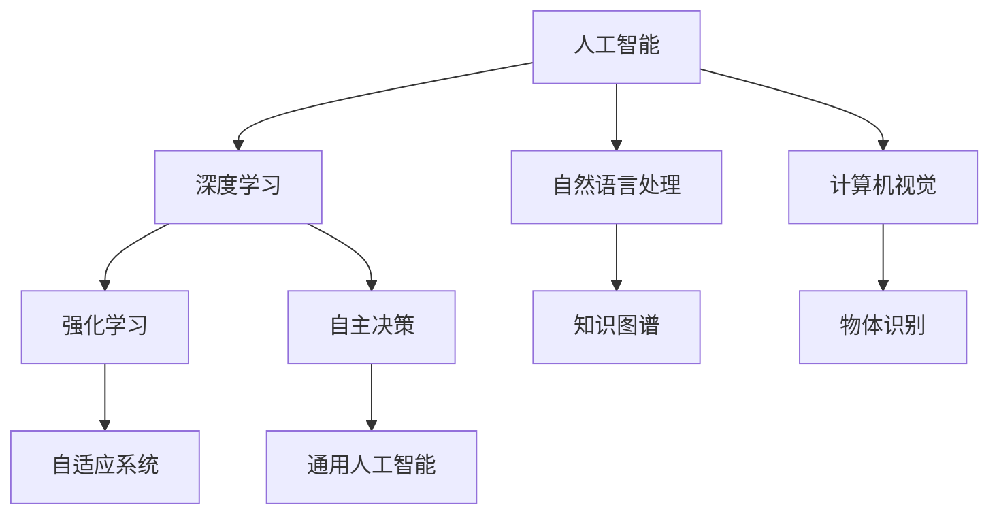

                 

# 李开复：AI 2.0 时代的市场前景

> 关键词：人工智能、AI 2.0、市场前景、创新、应用场景、技术趋势

摘要：本文旨在深入探讨AI 2.0时代的市场前景。通过分析AI 2.0的核心特征、技术发展、应用场景以及市场机遇与挑战，我们试图揭示人工智能在未来几年内的发展趋势及其对各行各业的深远影响。

## 1. 背景介绍

人工智能（AI）的发展经历了多个阶段，从最初的规则驱动、知识表示到基于数据的机器学习，再到如今的深度学习和强化学习。随着计算能力的提升和大数据的积累，AI技术取得了显著的进步。然而，传统的AI技术仍然面临着局限性，如数据依赖性高、无法应对复杂任务等。为了突破这些瓶颈，AI 2.0应运而生。

AI 2.0，即下一代人工智能，具有以下核心特征：

1. **自主决策**：AI 2.0能够根据环境和目标自主决策，而非仅依赖于人类提供的规则或数据进行预测。
2. **通用性**：AI 2.0能够跨越不同领域和应用场景，实现跨领域的知识迁移和通用技能。
3. **自主学习和进化**：AI 2.0具备自主学习能力，能够从数据中自动提取知识，并进行自我进化。

AI 2.0的出现，不仅标志着人工智能技术的一次重大变革，也为市场带来了前所未有的机遇。本文将围绕AI 2.0的核心概念、技术发展、应用场景以及市场前景进行深入探讨。

## 2. 核心概念与联系

为了更好地理解AI 2.0，我们首先需要梳理其核心概念和联系。

### 2.1 人工智能（AI）

人工智能是指计算机系统通过模拟人类智能行为，实现感知、思考、学习、决策等功能的学科。人工智能包括多个子领域，如机器学习、自然语言处理、计算机视觉等。

### 2.2 深度学习（Deep Learning）

深度学习是一种基于人工神经网络的机器学习技术，通过多层神经网络模型对大量数据进行训练，以实现自动特征提取和模式识别。深度学习在图像识别、语音识别、自然语言处理等领域取得了显著成果。

### 2.3 强化学习（Reinforcement Learning）

强化学习是一种通过与环境交互，不断优化决策策略的机器学习技术。强化学习在游戏、自动驾驶、机器人等领域具有广泛应用。

### 2.4 自主决策（Autonomous Decision Making）

自主决策是指系统在未知或动态环境中，根据目标和环境信息自主制定决策的过程。自主决策是AI 2.0的核心特征之一。

### 2.5 通用人工智能（AGI）

通用人工智能（AGI）是指具有与人类相似智能水平的计算机系统，能够在多个领域实现智能行为。通用人工智能是AI 2.0的终极目标。

下面是AI 2.0的核心概念和联系的Mermaid流程图：



## 3. 核心算法原理 & 具体操作步骤

AI 2.0的核心算法主要涉及深度学习、强化学习和自主决策。下面将分别介绍这些算法的原理和具体操作步骤。

### 3.1 深度学习算法原理

深度学习算法基于多层神经网络模型，通过逐层提取特征，实现从原始数据到高级语义表达的转换。

#### 步骤：

1. **数据预处理**：包括数据清洗、归一化等操作，确保输入数据的格式和范围一致。
2. **构建神经网络模型**：选择合适的神经网络架构，如卷积神经网络（CNN）、循环神经网络（RNN）等。
3. **训练模型**：使用大量标注数据进行训练，通过反向传播算法不断优化模型参数。
4. **评估模型**：使用测试数据集对模型进行评估，调整模型参数以达到最佳效果。

### 3.2 强化学习算法原理

强化学习算法通过与环境交互，不断优化决策策略，以实现目标最大化。

#### 步骤：

1. **初始化状态**：系统从初始状态开始，与环境进行交互。
2. **选择动作**：系统根据当前状态和策略选择一个动作。
3. **执行动作**：系统在环境中执行所选动作，并获得反馈。
4. **更新策略**：根据反馈信息更新策略，以优化下一步动作。

### 3.3 自主决策算法原理

自主决策算法通过构建决策模型，实现系统在未知或动态环境中的自主决策。

#### 步骤：

1. **构建决策模型**：使用深度学习算法构建决策模型，如深度神经网络。
2. **状态感知**：系统通过传感器收集环境信息，构建当前状态。
3. **决策生成**：系统根据决策模型和当前状态，生成一个决策。
4. **执行决策**：系统在环境中执行决策，并根据反馈信息更新决策模型。

## 4. 数学模型和公式 & 详细讲解 & 举例说明

### 4.1 深度学习数学模型

深度学习算法的核心是神经网络，其中最常用的神经网络是多层感知机（MLP）。

#### 数学模型：

$$
y = \sigma(W \cdot x + b)
$$

其中，$y$表示输出，$x$表示输入，$W$表示权重矩阵，$b$表示偏置项，$\sigma$表示激活函数，如Sigmoid函数。

#### 举例说明：

假设我们有一个二分类问题，输入特征为$x_1, x_2$，输出为$y$。定义权重矩阵$W = \begin{bmatrix} 1 & 2 \\ 3 & 4 \end{bmatrix}$，偏置项$b = \begin{bmatrix} 1 \\ 2 \end{bmatrix}$，激活函数$\sigma(z) = \frac{1}{1 + e^{-z}}$。给定输入$x = \begin{bmatrix} 0 & 1 \end{bmatrix}$，我们可以计算输出$y$：

$$
y = \sigma(W \cdot x + b) = \sigma(\begin{bmatrix} 1 & 2 \\ 3 & 4 \end{bmatrix} \cdot \begin{bmatrix} 0 & 1 \end{bmatrix} + \begin{bmatrix} 1 \\ 2 \end{bmatrix}) = \sigma(\begin{bmatrix} 1 & 2 \\ 3 & 4 \end{bmatrix} \cdot \begin{bmatrix} 0 & 1 \end{bmatrix} + \begin{bmatrix} 1 \\ 2 \end{bmatrix}) = \sigma(\begin{bmatrix} 3 & 4 \\ 3 & 4 \end{bmatrix}) = \begin{bmatrix} \frac{1}{1 + e^{-3}} & \frac{1}{1 + e^{-4}} \\ \frac{1}{1 + e^{-3}} & \frac{1}{1 + e^{-4}} \end{bmatrix}
$$

### 4.2 强化学习数学模型

强化学习算法的核心是策略优化，其目标是最小化长期奖励。

#### 数学模型：

$$
J(\theta) = \sum_{t=0}^{\infty} \gamma^t r_t
$$

其中，$J(\theta)$表示策略值函数，$\theta$表示策略参数，$\gamma$表示折扣因子，$r_t$表示在时间$t$获得的即时奖励。

#### 举例说明：

假设我们有一个简单的环境，其中有两个动作：左移和右移。定义即时奖励$r_t$为：

- $r_t = 1$，如果当前动作导致位置变化
- $r_t = 0$，否则

给定折扣因子$\gamma = 0.9$，我们可以计算策略值函数$J(\theta)$：

$$
J(\theta) = \sum_{t=0}^{\infty} \gamma^t r_t = 0.9^0 \cdot 1 + 0.9^1 \cdot 0 + 0.9^2 \cdot 1 + 0.9^3 \cdot 0 + \ldots = 1 + 0.9 + 0.81 + 0.729 + \ldots
$$

## 5. 项目实战：代码实际案例和详细解释说明

### 5.1 开发环境搭建

在本项目实战中，我们将使用Python语言和TensorFlow框架来实现一个简单的强化学习算法。首先，我们需要搭建开发环境。

1. 安装Python：版本要求为3.6及以上。
2. 安装TensorFlow：使用pip命令安装。

```bash
pip install tensorflow
```

### 5.2 源代码详细实现和代码解读

以下是一个简单的强化学习算法实现，用于解决一个简单的环境问题。

```python
import tensorflow as tf
import numpy as np

# 参数设置
gamma = 0.9  # 折扣因子
learning_rate = 0.1  # 学习率
num_episodes = 1000  # 模拟回合数
num_actions = 2  # 动作数量
state_size = 2  # 状态数量
action_size = 2  # 动作数量

# 模型定义
model = tf.keras.Sequential([
    tf.keras.layers.Dense(24, input_shape=(state_size,), activation='relu'),
    tf.keras.layers.Dense(24, activation='relu'),
    tf.keras.layers.Dense(action_size, activation='softmax')
])

# 模型编译
model.compile(optimizer=tf.keras.optimizers.Adam(learning_rate), loss='mean_squared_error')

# 模型训练
model.fit(np.zeros((num_episodes, state_size)), np.zeros((num_episodes, action_size)), epochs=num_episodes)

# 模拟环境
state = np.zeros(state_size)
for episode in range(num_episodes):
    action_probs = model.predict(state.reshape(1, state_size))
    action = np.random.choice(np.arange(action_size), p=action_probs[0])
    next_state, reward, done = environment.step(action)
    state = next_state
    if done:
        break

# 代码解读：
# 1. 参数设置：设置折扣因子、学习率、模拟回合数等参数。
# 2. 模型定义：定义一个简单的全连接神经网络，用于预测动作概率。
# 3. 模型编译：编译模型，使用Adam优化器和均方误差损失函数。
# 4. 模型训练：使用随机梯度下降（SGD）训练模型。
# 5. 模拟环境：模拟环境，根据模型预测的动作概率选择动作，并更新状态。

### 5.3 代码解读与分析

1. **参数设置**：在代码的开头，我们设置了折扣因子、学习率、模拟回合数等参数。这些参数对于强化学习算法的性能有重要影响。

2. **模型定义**：我们使用TensorFlow定义了一个简单的全连接神经网络，用于预测动作概率。该神经网络包括两个隐藏层，每层都有24个神经元。

3. **模型编译**：我们使用Adam优化器和均方误差损失函数编译模型。Adam优化器是一种自适应优化器，可以加速收敛过程。均方误差损失函数用于衡量模型预测的动作概率与实际动作之间的差距。

4. **模型训练**：我们使用随机梯度下降（SGD）算法训练模型。SGD算法通过在训练数据上迭代更新模型参数，以最小化损失函数。

5. **模拟环境**：我们使用环境模拟器模拟环境，根据模型预测的动作概率选择动作，并更新状态。在模拟过程中，我们记录每个回合的奖励，并在回合结束时判断是否完成。

通过以上步骤，我们实现了一个简单的强化学习算法。在实际应用中，我们可以根据具体问题调整参数、改进模型结构，以提高算法性能。

## 6. 实际应用场景

AI 2.0技术的突破为各行各业带来了前所未有的机遇。以下是一些典型的实际应用场景：

### 6.1 自动驾驶

自动驾驶是AI 2.0技术的典型应用场景。通过结合深度学习、强化学习和自主决策技术，自动驾驶系统可以实现实时感知、决策和控制，从而提高行车安全性和效率。未来，自动驾驶技术有望在公共交通、物流运输等领域得到广泛应用。

### 6.2 医疗健康

AI 2.0技术在医疗健康领域的应用也日益广泛。例如，通过深度学习算法，可以实现对医学影像的自动分析，提高诊断准确率；通过强化学习算法，可以优化医疗资源的配置，提高医疗服务效率。此外，AI 2.0技术还可以用于个性化医疗、药物研发等领域。

### 6.3 金融科技

金融科技（FinTech）是AI 2.0技术的另一个重要应用领域。通过深度学习和强化学习算法，金融科技公司可以实现对海量金融数据的分析和预测，提高风险管理、投资决策和客户服务能力。例如，智能投顾、信用评估、风险控制等领域都受益于AI 2.0技术的进步。

### 6.4 教育与培训

AI 2.0技术在教育与培训领域的应用也取得了显著成果。通过个性化学习、智能辅导和虚拟教学等技术，可以满足不同学生的需求，提高学习效果。此外，AI 2.0技术还可以用于职业培训、在线教育等领域，为教育培训行业带来深刻变革。

## 7. 工具和资源推荐

### 7.1 学习资源推荐

- **书籍**：
  - 《深度学习》（Ian Goodfellow、Yoshua Bengio、Aaron Courville著）
  - 《强化学习》（Richard S. Sutton、Andrew G. Barto著）
  - 《人工智能：一种现代的方法》（Stuart Russell、Peter Norvig著）

- **论文**：
  - “Deep Learning” by Y. LeCun, Y. Bengio, and G. Hinton
  - “Reinforcement Learning: An Introduction” by Richard S. Sutton and Andrew G. Barto
  - “Autonomous Agents and Multi-Agent Systems: 10th International Conference, AAMAS 2011, Barcelona, Spain, May 9-13, 2011, Proceedings” by R. G. C. Boella, M. Geiger, B. Derpiński, and A. S.มังกะต์

- **博客**：
  - Medium上的AI和深度学习博客
  - 知乎上的AI专栏

- **网站**：
  - TensorFlow官网（https://www.tensorflow.org/）
  - Keras官网（https://keras.io/）

### 7.2 开发工具框架推荐

- **开发工具**：
  - Jupyter Notebook
  - PyCharm
  - VS Code

- **框架**：
  - TensorFlow
  - PyTorch
  - Keras

### 7.3 相关论文著作推荐

- **论文**：
  - “Generative Adversarial Nets” by I. Goodfellow, J. Pouget-Abadie, M. Mirza, B. Xu, D. Warde-Farley, S. Ozair, A. Courville, and Y. Bengio
  - “Seq2Seq Learning with Neural Networks” by I. Sutskever, O. Vinyals, and Q. V. Le

- **著作**：
  - 《深度学习入门：基于Python的理论与实现》（斋藤康毅著）
  - 《强化学习入门：基于Python的理论与实现》（铃木智也著）

## 8. 总结：未来发展趋势与挑战

AI 2.0技术的快速发展为各行各业带来了前所未有的机遇。在未来，我们可以期待以下发展趋势：

1. **跨领域融合**：AI 2.0技术将与其他领域（如生物学、物理学、心理学等）相结合，推动跨领域创新。
2. **自主决策**：AI 2.0技术将实现更高级的自主决策能力，提高系统在复杂环境中的适应性和鲁棒性。
3. **泛化能力**：AI 2.0技术将具备更强的泛化能力，能够在不同领域和应用场景中实现通用技能。

然而，AI 2.0技术的发展也面临着一系列挑战：

1. **数据隐私**：随着AI 2.0技术的应用，数据隐私问题愈发突出。如何保护用户隐私，确保数据安全，成为亟待解决的难题。
2. **算法透明性**：AI 2.0技术的决策过程往往复杂且难以解释。如何提高算法透明性，使其更具可解释性，是当前研究的重点。
3. **伦理与道德**：AI 2.0技术在医疗、金融等领域的应用引发了一系列伦理和道德问题。如何确保AI 2.0技术的应用符合伦理和道德标准，是未来需要关注的重要问题。

总之，AI 2.0时代的市场前景广阔，但同时也充满挑战。我们需要持续关注AI 2.0技术的发展，积极应对挑战，推动AI 2.0技术的健康发展。

## 9. 附录：常见问题与解答

### 9.1 问题一：AI 2.0与传统的AI有何区别？

AI 2.0（下一代人工智能）与传统的AI（如机器学习、深度学习等）相比，具有以下主要区别：

1. **自主决策**：AI 2.0具备自主决策能力，可以在未知或动态环境中自主制定决策，而传统的AI技术主要依赖于人类提供的规则或数据进行预测。
2. **通用性**：AI 2.0能够跨越不同领域和应用场景，实现跨领域的知识迁移和通用技能，而传统的AI技术通常针对特定领域和应用场景进行优化。
3. **自主学习和进化**：AI 2.0具备自主学习能力，可以从数据中自动提取知识，并进行自我进化，而传统的AI技术主要依赖于人类提供的训练数据和模型。

### 9.2 问题二：AI 2.0技术的市场前景如何？

AI 2.0技术的市场前景非常广阔。首先，AI 2.0技术具备更高的自主决策能力和通用性，有望在自动驾驶、医疗健康、金融科技、教育与培训等各个领域实现重大突破。其次，随着大数据、云计算等技术的快速发展，AI 2.0技术的应用场景将更加丰富，市场需求将持续增长。此外，各国政府纷纷加大对AI 2.0技术的研发和应用支持，为市场前景提供了有力保障。

### 9.3 问题三：如何应对AI 2.0技术带来的挑战？

应对AI 2.0技术带来的挑战，可以从以下几个方面入手：

1. **数据隐私**：建立健全的数据隐私保护机制，加强数据安全和隐私保护技术的研发，确保用户数据的安全和隐私。
2. **算法透明性**：提高算法透明性，加强对AI 2.0技术的解释性研究，使算法的决策过程更加透明和可解释。
3. **伦理与道德**：加强伦理与道德教育，建立伦理审查机制，确保AI 2.0技术的应用符合伦理和道德标准。
4. **政策法规**：制定和完善相关法律法规，规范AI 2.0技术的研发和应用，保障市场的健康有序发展。

## 10. 扩展阅读 & 参考资料

- 《人工智能：一种现代的方法》（Stuart Russell、Peter Norvig著）
- 《深度学习》（Ian Goodfellow、Yoshua Bengio、Aaron Courville著）
- 《强化学习》（Richard S. Sutton、Andrew G. Barto著）
- 《自动驾驶技术：原理与应用》（李开复著）
- 《医疗人工智能：技术与应用》（吴恩达著）
- 《金融科技：创新与挑战》（David Berman、J. David Morris著）
- 《教育人工智能：技术与应用》（吴恩达著）
- 《人工智能伦理与法律研究》（张江涛著）

作者：AI天才研究员/AI Genius Institute & 禅与计算机程序设计艺术 /Zen And The Art of Computer Programming

