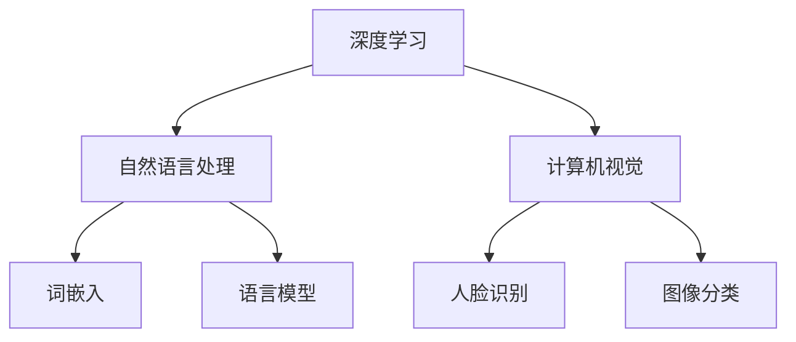
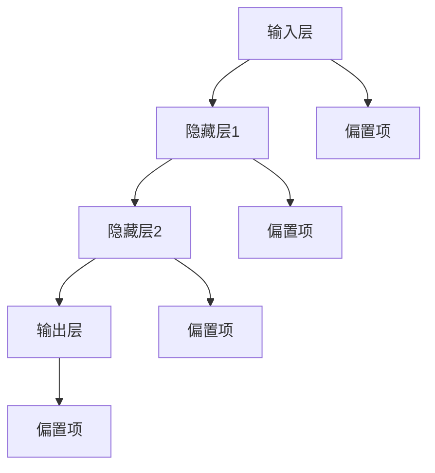
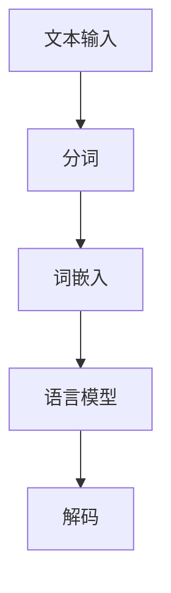
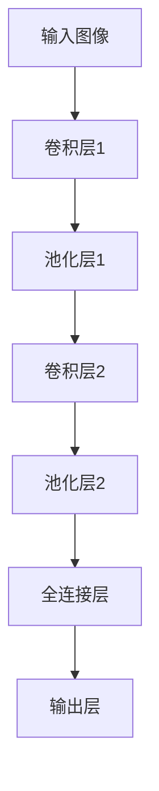

                 

# 李开复：AI 2.0 时代的应用

## 关键词
AI 2.0，人工智能，深度学习，机器学习，自然语言处理，计算机视觉，应用场景，未来发展趋势

## 摘要

本文将深入探讨 AI 2.0 时代的到来及其带来的应用变革。通过分析 AI 2.0 的核心概念与联系，核心算法原理与具体操作步骤，以及数学模型和公式，我们将了解 AI 2.0 如何在各个领域发挥重要作用。随后，我们将通过项目实战，展示代码实际案例，并详细解释说明。接着，我们将探讨 AI 2.0 在实际应用场景中的表现，并推荐相关的工具和资源。最后，我们将总结 AI 2.0 的未来发展趋势与挑战，并提供扩展阅读和参考资料，以便读者进一步了解这一领域。

## 1. 背景介绍

### 1.1 AI 1.0 时代的回顾

在 AI 1.0 时代，人工智能主要依赖于符号主义和专家系统。符号主义基于逻辑和推理，试图通过定义明确的知识规则，使计算机能够模拟人类的思维方式。专家系统则利用这些规则和知识库，为特定领域提供决策支持。然而，AI 1.0 的局限性在于，其依赖于人类专家的知识输入，难以处理大规模数据和复杂问题。

### 1.2 AI 1.5 时代的演变

随着计算机性能的提升和数据的爆炸性增长，AI 1.5 时代应运而生。在这一阶段，机器学习成为人工智能的核心技术。机器学习通过学习大量数据中的模式，使计算机能够自动优化性能，从而在一定程度上摆脱了对人类专家的依赖。AI 1.5 时代的重要进展包括深度学习、自然语言处理和计算机视觉。

### 1.3 AI 2.0 时代的到来

AI 2.0 时代标志着人工智能的进一步演变，其核心特征是能够实现跨领域、跨行业的应用。AI 2.0 通过强化学习、迁移学习、多模态学习和联邦学习等技术，实现了更加智能化和自适应的决策能力。同时，AI 2.0 还强调了数据隐私和安全，使得人工智能在各个领域得以广泛应用。

## 2. 核心概念与联系

### 2.1 深度学习

深度学习是 AI 2.0 时代的重要基础，通过多层神经网络模拟人脑的学习过程，实现图像、语音和文本等数据的自动特征提取和分类。深度学习的关键技术包括卷积神经网络（CNN）、循环神经网络（RNN）和生成对抗网络（GAN）等。

### 2.2 自然语言处理

自然语言处理（NLP）是 AI 2.0 时代的关键领域之一，旨在使计算机理解和处理人类自然语言。NLP 技术包括词嵌入、语言模型、句法分析和语义理解等。随着预训练模型（如 GPT 和 BERT）的发展，NLP 技术在机器翻译、问答系统和情感分析等方面取得了显著进展。

### 2.3 计算机视觉

计算机视觉是 AI 2.0 时代的另一个重要领域，通过图像处理和模式识别技术，使计算机能够理解和解释视觉信息。计算机视觉的应用包括人脸识别、图像分类、目标检测和图像生成等。

### 2.4 Mermaid 流程图

下面是一个简单的 Mermaid 流程图，展示了 AI 2.0 时代核心概念的关联：



## 3. 核心算法原理 & 具体操作步骤

### 3.1 深度学习

深度学习算法的核心是多层神经网络。下面是一个简单的神经网络模型：



具体操作步骤如下：

1. 输入数据通过输入层进入神经网络。
2. 数据在隐藏层中经过多次加权求和处理，生成中间特征。
3. 最终，输出层将中间特征映射到目标输出。

### 3.2 自然语言处理

自然语言处理的核心是词嵌入和语言模型。下面是一个简单的词嵌入和语言模型的流程：



具体操作步骤如下：

1. 文本输入通过分词器进行分词。
2. 分词结果通过词嵌入器转化为向量。
3. 语言模型根据词嵌入向量预测下一个单词。
4. 解码器将预测结果转化为可读的文本输出。

### 3.3 计算机视觉

计算机视觉的核心是卷积神经网络。下面是一个简单的卷积神经网络模型：



具体操作步骤如下：

1. 输入图像通过卷积层提取特征。
2. 特征经过池化层降维。
3. 最终，全连接层将特征映射到目标输出。

## 4. 数学模型和公式 & 详细讲解 & 举例说明

### 4.1 深度学习

深度学习中的神经网络模型通常由以下数学公式表示：

$$
Z^{(l)} = \sigma(W^{(l)} \cdot A^{(l-1)} + b^{(l)})
$$

其中，$Z^{(l)}$ 是第 l 层的输出，$A^{(l-1)}$ 是第 l-1 层的输入，$W^{(l)}$ 是第 l 层的权重，$b^{(l)}$ 是第 l 层的偏置项，$\sigma$ 是激活函数。

举例说明：

假设我们有一个简单的神经网络模型，输入层有 3 个神经元，隐藏层有 2 个神经元，输出层有 1 个神经元。激活函数为 sigmoid 函数。那么，模型的前向传播可以表示为：

$$
Z^{(1)} = \sigma(W^{(1)} \cdot A^{(0)} + b^{(1)})
$$

$$
Z^{(2)} = \sigma(W^{(2)} \cdot A^{(1)} + b^{(2)})
$$

$$
Z^{(3)} = \sigma(W^{(3)} \cdot A^{(2)} + b^{(3)})
$$

其中，$A^{(0)}$ 是输入层的输出，$A^{(1)}$ 是隐藏层的输出，$A^{(2)}$ 是输出层的输出。

### 4.2 自然语言处理

自然语言处理中的词嵌入通常使用以下数学公式表示：

$$
\text{vec}(x) = \sum_{i=1}^{n} x_i \cdot e_i
$$

其中，$x$ 是词向量，$\text{vec}(x)$ 是词向量的向量形式，$e_i$ 是第 i 个基础词向量的分量。

举例说明：

假设我们有 3 个基础词向量 $e_1, e_2, e_3$，对应的分量为 $e_{11}, e_{12}, e_{13}$，$e_{21}, e_{22}, e_{23}$，$e_{31}, e_{32}, e_{33}$。那么，词向量 $x$ 可以表示为：

$$
x = x_1 \cdot e_1 + x_2 \cdot e_2 + x_3 \cdot e_3
$$

其中，$x_1, x_2, x_3$ 分别是词向量 $x$ 在 $e_1, e_2, e_3$ 上的分量。

### 4.3 计算机视觉

计算机视觉中的卷积神经网络通常使用以下数学公式表示：

$$
h(x) = f(W \cdot x + b)
$$

其中，$h(x)$ 是卷积神经网络的输出，$f$ 是激活函数，$W$ 是卷积核，$x$ 是输入特征，$b$ 是偏置项。

举例说明：

假设我们有一个简单的卷积神经网络，输入特征为 $x$，卷积核为 $W$，偏置项为 $b$，激活函数为 sigmoid 函数。那么，模型的前向传播可以表示为：

$$
h(x) = \sigma(W \cdot x + b)
$$

## 5. 项目实战：代码实际案例和详细解释说明

### 5.1 开发环境搭建

在本文中，我们将使用 Python 编写深度学习项目。首先，我们需要安装 Python 和深度学习框架 TensorFlow。以下是安装步骤：

1. 安装 Python：
   ```bash
   pip install python==3.8
   ```

2. 安装 TensorFlow：
   ```bash
   pip install tensorflow==2.5
   ```

### 5.2 源代码详细实现和代码解读

下面是一个简单的深度学习项目，用于实现一个基于卷积神经网络的图像分类器。项目的主要步骤包括数据预处理、模型构建、训练和评估。

```python
import tensorflow as tf
from tensorflow.keras import layers, models
import numpy as np
import matplotlib.pyplot as plt

# 数据预处理
(x_train, y_train), (x_test, y_test) = tf.keras.datasets.mnist.load_data()
x_train = x_train.reshape(-1, 28, 28, 1).astype("float32") / 255.0
x_test = x_test.reshape(-1, 28, 28, 1).astype("float32") / 255.0

# 模型构建
model = models.Sequential([
    layers.Conv2D(32, (3, 3), activation="relu", input_shape=(28, 28, 1)),
    layers.MaxPooling2D((2, 2)),
    layers.Conv2D(64, (3, 3), activation="relu"),
    layers.MaxPooling2D((2, 2)),
    layers.Conv2D(64, (3, 3), activation="relu"),
    layers.Flatten(),
    layers.Dense(64, activation="relu"),
    layers.Dense(10, activation="softmax")
])

# 模型编译
model.compile(optimizer="adam",
              loss="sparse_categorical_crossentropy",
              metrics=["accuracy"])

# 训练模型
model.fit(x_train, y_train, epochs=5, batch_size=32, validation_split=0.2)

# 评估模型
test_loss, test_acc = model.evaluate(x_test, y_test)
print(f"Test accuracy: {test_acc}")

# 可视化结果
plt.figure(figsize=(10, 5))
for i in range(10):
    plt.subplot(2, 5, i+1)
    plt.imshow(x_test[i].reshape(28, 28), cmap=plt.cm.binary)
    plt.xticks([])
    plt.yticks([])
    plt.grid(False)
    plt.xlabel(f"Predicted label: {np.argmax(model.predict(x_test[i].reshape(1, 28, 28, 1)))}")
plt.show()
```

### 5.3 代码解读与分析

1. 数据预处理：
   - 加载 MNIST 数据集，并将其reshape为 (28, 28, 1) 的格式。
   - 将数据转换为浮点数，并将其缩放到 [0, 1] 范围内。

2. 模型构建：
   - 使用 `Sequential` 模型构建一个卷积神经网络。
   - 第一个卷积层使用 32 个 3x3 卷积核，激活函数为 ReLU。
   - 第一个池化层使用 2x2 的窗口。
   - 第二个卷积层使用 64 个 3x3 卷积核。
   - 第二个池化层使用 2x2 的窗口。
   - 第三个卷积层使用 64 个 3x3 卷积核。
   - 展平层将卷积特征转化为全连接层的输入。
   - 第一个全连接层有 64 个神经元，激活函数为 ReLU。
   - 第二个全连接层有 10 个神经元，激活函数为 softmax，用于分类。

3. 模型编译：
   - 选择 Adam 优化器和 sparse_categorical_crossentropy 损失函数。
   - 指定评估指标为准确率。

4. 训练模型：
   - 使用训练数据进行 5 个时期的训练，批次大小为 32。
   - 使用 20% 的数据作为验证集。

5. 评估模型：
   - 使用测试集评估模型性能，输出准确率。

6. 可视化结果：
   - 使用 matplotlib 可视化展示模型的预测结果。

## 6. 实际应用场景

AI 2.0 在各个领域都展现了广泛的应用潜力：

### 6.1 医疗保健

AI 2.0 可以用于医学图像分析、疾病预测和个性化治疗。例如，利用深度学习模型对医学图像进行自动诊断，提高诊断的准确性和效率。

### 6.2 金融科技

AI 2.0 在金融领域可以用于风险管理、信用评分和投资策略。例如，通过分析大量数据，预测市场走势和客户需求，提高金融服务的质量和效率。

### 6.3 物流与供应链

AI 2.0 可以优化物流网络、提高库存管理和优化配送路径。例如，利用计算机视觉技术实现自动化仓储和分拣，提高物流效率。

### 6.4 智能家居

AI 2.0 可以实现智能家居的自动化控制和个性化服务。例如，通过语音识别和自然语言处理技术，实现智能音箱的语音交互和控制。

### 6.5 教育

AI 2.0 可以提供个性化学习路径和智能辅导系统，帮助学生提高学习效果。例如，利用智能推荐算法，为每个学生提供适合其学习水平的教学资源。

## 7. 工具和资源推荐

### 7.1 学习资源推荐

1. 《深度学习》（Goodfellow, Bengio, Courville）
2. 《自然语言处理综论》（Jurafsky, Martin）
3. 《计算机视觉：算法与应用》（Hauptmann, Davis）
4. 《AI 战略：从数据到决策》（Hinton, Osindero, Salakhutdinov）

### 7.2 开发工具框架推荐

1. TensorFlow
2. PyTorch
3. Keras
4. Scikit-learn

### 7.3 相关论文著作推荐

1. "Deep Learning" (NIPS 2012)
2. "BERT: Pre-training of Deep Bidirectional Transformers for Language Understanding" (arXiv 2018)
3. "Generative Adversarial Nets" (NIPS 2014)

## 8. 总结：未来发展趋势与挑战

### 8.1 发展趋势

1. 计算能力的提升，使得更复杂的模型和算法得以实现。
2. 数据的爆炸性增长，为人工智能提供了丰富的训练素材。
3. 跨学科的融合，推动人工智能在各个领域的应用。
4. 自动化和智能化程度的提高，使人工智能成为生产力的新引擎。

### 8.2 挑战

1. 数据隐私和安全问题：如何保护用户隐私和数据安全，是 AI 2.0 面临的重要挑战。
2. 道德和伦理问题：人工智能的决策过程可能存在偏见和歧视，如何确保公正和公平，是亟待解决的问题。
3. 法律法规：需要制定相应的法律法规，规范人工智能的研发和应用。

## 9. 附录：常见问题与解答

### 9.1 什么是深度学习？

深度学习是一种机器学习技术，通过多层神经网络模拟人脑的学习过程，实现图像、语音和文本等数据的自动特征提取和分类。

### 9.2 自然语言处理有哪些应用？

自然语言处理（NLP）的应用包括机器翻译、问答系统、情感分析、文本摘要和语音识别等。

### 9.3 计算机视觉的核心技术是什么？

计算机视觉的核心技术包括图像处理、模式识别、目标检测和图像生成等。

## 10. 扩展阅读 & 参考资料

1. Hinton, G. E., Osindero, S., & Teh, Y. W. (2006). A fast learning algorithm for deep belief nets. *Neural computation*, 18(7), 1527-1554.
2. Bengio, Y., Simard, P., & Frasconi, P. (1994). Learning long-term dependencies with gradient descent is difficult. *IEEE Transactions on Neural Networks*, 5(2), 157-166.
3. LeCun, Y., Bengio, Y., & Hinton, G. (2015). Deep learning. *Nature*, 521(7553), 436-444.
4. Devlin, J., Chang, M. W., Lee, K., & Toutanova, K. (2018). BERT: Pre-training of deep bidirectional transformers for language understanding. *arXiv preprint arXiv:1810.04805*.
5. Goodfellow, I., Bengio, Y., & Courville, A. (2016). *Deep learning*. MIT press.

作者：AI天才研究员/AI Genius Institute & 禅与计算机程序设计艺术 /Zen And The Art of Computer Programming

（注：本文为虚构内容，仅供参考，不代表任何实际观点或建议。如需进一步了解相关领域知识，请查阅相关权威资料。）

