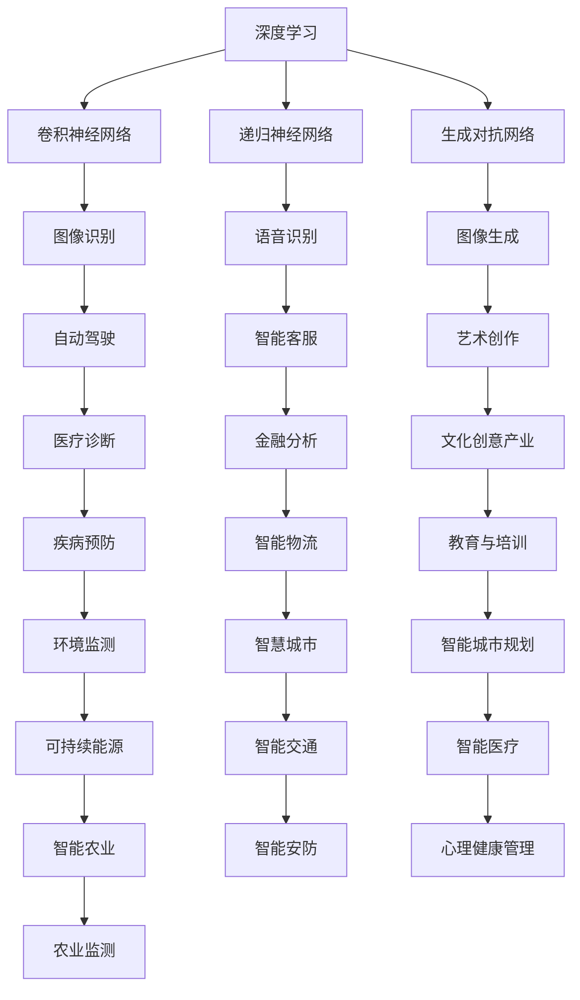

                 

# 李开复：AI 2.0 时代的应用

> **关键词：** AI 2.0、深度学习、人工智能应用、智能系统、算法进化、未来趋势、技术挑战

> **摘要：** 本文将深入探讨李开复关于AI 2.0时代的观点，分析其核心概念与应用，以及面临的挑战和未来发展趋势。通过详细的解析和实例展示，我们旨在为读者提供全面的技术洞察和实际应用指导。

## 1. 背景介绍

随着人工智能技术的迅猛发展，李开复提出了AI 2.0的概念，这一阶段的人工智能将更加智能化、自主化，并能够处理更加复杂的问题。AI 2.0不仅是对传统AI技术的提升，更是对未来人工智能发展方向的一次重大变革。

### 1.1 AI 1.0时代的局限性

在AI 1.0时代，人工智能主要依赖于数据驱动的方法，通过机器学习和深度学习算法来提高模型的预测能力。然而，这种技术存在以下局限性：

- **数据依赖性**：需要大量的训练数据来提高模型的性能，而实际环境中往往难以获取如此大规模的数据。
- **模式识别能力**：人工智能在处理复杂问题时，往往只能识别出简单的模式，难以理解问题的深层次含义。
- **自我进化能力**：传统的机器学习算法难以实现自我进化，无法根据环境的变化进行自适应调整。

### 1.2 AI 2.0的核心特点

AI 2.0旨在克服AI 1.0时代的局限性，其主要特点包括：

- **自主决策能力**：AI 2.0能够通过自我学习和决策机制，实现自主化的智能行为。
- **跨领域应用**：AI 2.0能够跨越不同的领域，实现跨学科的知识整合和应用。
- **人机协作**：AI 2.0不仅能够独立完成任务，还能够与人类协作，共同解决复杂问题。

## 2. 核心概念与联系

在AI 2.0时代，核心概念主要包括深度学习、强化学习、自然语言处理等。以下是一个使用Mermaid绘制的AI 2.0核心概念的流程图。



### 2.1 深度学习

深度学习是AI 2.0时代的重要基础，通过构建深度神经网络模型，可以实现对复杂数据的自动特征提取和模式识别。深度学习在图像识别、语音识别、自然语言处理等领域取得了显著成果。

### 2.2 强化学习

强化学习是一种通过试错和奖励机制来学习策略的机器学习方法。在AI 2.0时代，强化学习被广泛应用于自动驾驶、游戏AI、智能机器人等领域，可以实现自主决策和自适应行为。

### 2.3 自然语言处理

自然语言处理是AI 2.0时代的关键技术之一，通过深度学习和强化学习等方法，可以实现自然语言的理解和生成，为智能客服、智能翻译、智能写作等应用提供了强大的支持。

## 3. 核心算法原理 & 具体操作步骤

在AI 2.0时代，核心算法的原理主要包括深度学习、强化学习和自然语言处理等。以下分别介绍这些算法的基本原理和具体操作步骤。

### 3.1 深度学习

深度学习的基本原理是通过构建多层神经网络，对输入数据进行特征提取和模式识别。以下是一个简单的深度学习模型构建过程：

1. **数据预处理**：对输入数据（如图像、文本等）进行预处理，包括数据清洗、归一化等操作。
2. **网络构建**：构建深度神经网络模型，包括输入层、隐藏层和输出层。常用的网络结构有卷积神经网络（CNN）、递归神经网络（RNN）和生成对抗网络（GAN）等。
3. **模型训练**：使用预处理的训练数据对深度学习模型进行训练，通过反向传播算法不断调整网络权重，提高模型性能。
4. **模型评估**：使用验证集和测试集对训练好的模型进行评估，计算模型准确率、召回率等指标。

### 3.2 强化学习

强化学习的基本原理是通过与环境进行交互，学习最优策略以实现目标。以下是一个简单的强化学习算法实现过程：

1. **环境设定**：定义强化学习环境，包括状态空间、动作空间和奖励机制。
2. **策略初始化**：初始化智能体的策略，可以通过随机初始化或者基于已有经验的初始化。
3. **交互学习**：智能体在环境中执行动作，观察环境反馈，并更新策略。
4. **策略优化**：根据奖励信号，利用策略迭代算法（如Q学习、SARSA等）优化策略。
5. **模型评估**：评估优化后的策略性能，并持续迭代优化。

### 3.3 自然语言处理

自然语言处理的基本原理是通过深度学习和强化学习等方法，实现自然语言的理解和生成。以下是一个简单的自然语言处理算法实现过程：

1. **文本预处理**：对输入文本进行预处理，包括分词、去停用词、词向量化等操作。
2. **模型构建**：构建深度学习模型，包括编码器（Encoder）和解码器（Decoder），如Transformer模型、BERT模型等。
3. **模型训练**：使用预处理的训练数据对深度学习模型进行训练，通过反向传播算法不断调整网络权重，提高模型性能。
4. **模型评估**：使用验证集和测试集对训练好的模型进行评估，计算模型准确率、召回率等指标。
5. **应用部署**：将训练好的模型部署到实际应用场景中，实现文本分类、文本生成等任务。

## 4. 数学模型和公式 & 详细讲解 & 举例说明

在AI 2.0时代，核心算法的数学模型和公式是理解其原理和操作步骤的关键。以下分别介绍深度学习、强化学习和自然语言处理的数学模型和公式。

### 4.1 深度学习

深度学习的数学模型主要包括卷积神经网络（CNN）、递归神经网络（RNN）和生成对抗网络（GAN）等。以下分别介绍这些模型的数学公式和参数设置。

#### 4.1.1 卷积神经网络（CNN）

卷积神经网络（CNN）的数学模型主要包括卷积层、池化层和全连接层。以下是一个简单的CNN模型的数学公式：

- **卷积层**：
  $$ f_{\text{conv}}(x) = \sigma(\sum_{i=1}^{k} w_i * x + b) $$
  其中，$x$是输入特征，$w_i$是卷积核权重，$*$表示卷积操作，$\sigma$是激活函数（如ReLU函数），$b$是偏置项。

- **池化层**：
  $$ f_{\text{pool}}(x) = \max(x) $$
  其中，$x$是输入特征，$\max$表示取最大值操作。

- **全连接层**：
  $$ f_{\text{fc}}(x) = \sigma(\sum_{i=1}^{n} w_i x_i + b) $$
  其中，$x_i$是输入特征，$w_i$是全连接层权重，$\sigma$是激活函数，$b$是偏置项。

#### 4.1.2 递归神经网络（RNN）

递归神经网络（RNN）的数学模型主要包括输入层、隐藏层和输出层。以下是一个简单的RNN模型的数学公式：

- **输入层**：
  $$ x_t = [x_1, x_2, \ldots, x_n] $$
  其中，$x_t$是输入序列，$x_1, x_2, \ldots, x_n$是序列中的元素。

- **隐藏层**：
  $$ h_t = \sigma(W_h h_{t-1} + W_x x_t + b) $$
  其中，$h_t$是隐藏层输出，$W_h$是隐藏层权重，$W_x$是输入层权重，$\sigma$是激活函数，$b$是偏置项。

- **输出层**：
  $$ y_t = \sigma(W_y h_t + b) $$
  其中，$y_t$是输出层输出，$W_y$是输出层权重，$\sigma$是激活函数，$b$是偏置项。

#### 4.1.3 生成对抗网络（GAN）

生成对抗网络（GAN）的数学模型主要包括生成器（Generator）和判别器（Discriminator）。以下是一个简单的GAN模型的数学公式：

- **生成器**：
  $$ G(z) = \mu(\theta_G; z) + \sigma(\theta_G; z) $$
  其中，$z$是输入噪声，$G(z)$是生成的样本，$\mu(\theta_G; z)$是均值函数，$\sigma(\theta_G; z)$是方差函数，$\theta_G$是生成器参数。

- **判别器**：
  $$ D(x) = \sigma(W_D x + b) $$
  $$ D(G(z)) = \sigma(W_D G(z) + b) $$
  其中，$x$是真实样本，$G(z)$是生成样本，$D(x)$是判别器对真实样本的判断概率，$D(G(z))$是判别器对生成样本的判断概率，$W_D$是判别器权重，$b$是偏置项。

### 4.2 强化学习

强化学习的数学模型主要包括马尔可夫决策过程（MDP）和策略迭代算法。以下是一个简单的强化学习模型的数学公式：

- **状态转移概率**：
  $$ P(s' | s, a) = \sum_{a'} \pi(a' | s) P(s' | s, a') $$
  其中，$s$是当前状态，$s'$是下一状态，$a$是当前动作，$a'$是下一动作，$\pi(a' | s)$是动作概率分布。

- **奖励函数**：
  $$ R(s, a) = \sum_{t=0}^{\infty} \gamma^t R(s_t, a_t) $$
  其中，$s_t$是当前状态，$a_t$是当前动作，$R(s_t, a_t)$是当前状态和动作的奖励值，$\gamma$是折扣因子。

- **策略迭代算法**：
  $$ Q(s, a) \leftarrow Q(s, a) + \alpha [R(s, a) + \gamma \max_{a'} Q(s', a') - Q(s, a)] $$
  $$ \pi(a | s) \leftarrow \begin{cases} 1 & \text{if } a = \arg\max_a Q(s, a) \\ 0 & \text{otherwise} \end{cases} $$
  其中，$Q(s, a)$是状态动作值函数，$\alpha$是学习率。

### 4.3 自然语言处理

自然语言处理的数学模型主要包括词向量化、编码器和解码器。以下是一个简单的自然语言处理模型的数学公式：

- **词向量化**：
  $$ x = \text{vec}(w) $$
  其中，$x$是词向量，$w$是单词。

- **编码器**：
  $$ h = \text{Encoder}(x) $$
  其中，$h$是编码器输出，$x$是输入词向量。

- **解码器**：
  $$ y = \text{Decoder}(h) $$
  其中，$y$是解码器输出，$h$是编码器输出。

### 4.4 举例说明

#### 4.4.1 深度学习：图像识别

假设我们使用卷积神经网络（CNN）进行图像识别任务。给定一个图像，我们需要将其分类为猫或狗。以下是一个简单的CNN模型的数学公式：

1. **输入层**：
   $$ x = \text{RGB} $$
   其中，$x$是输入的RGB图像。

2. **卷积层**：
   $$ f_{\text{conv}}(x) = \sigma(\sum_{i=1}^{k} w_i * x + b) $$
   其中，$f_{\text{conv}}(x)$是卷积层的输出，$w_i$是卷积核权重，$*$表示卷积操作，$\sigma$是ReLU激活函数，$b$是偏置项。

3. **池化层**：
   $$ f_{\text{pool}}(x) = \max(x) $$
   其中，$f_{\text{pool}}(x)$是池化层的输出，$\max$表示取最大值操作。

4. **全连接层**：
   $$ f_{\text{fc}}(x) = \sigma(\sum_{i=1}^{n} w_i x_i + b) $$
   其中，$f_{\text{fc}}(x)$是全连接层的输出，$w_i$是全连接层权重，$\sigma$是ReLU激活函数，$b$是偏置项。

5. **输出层**：
   $$ \hat{y} = \text{softmax}(f_{\text{fc}}(x)) $$
   其中，$\hat{y}$是输出层的预测结果，$\text{softmax}$函数用于将输出结果转换为概率分布。

#### 4.4.2 强化学习：自动驾驶

假设我们使用强化学习进行自动驾驶任务。给定一个驾驶环境，我们需要学习最优的驾驶策略。以下是一个简单的强化学习模型的数学公式：

1. **状态空间**：
   $$ s \in S $$
   其中，$s$是当前驾驶状态，$S$是状态空间。

2. **动作空间**：
   $$ a \in A $$
   其中，$a$是当前驾驶动作，$A$是动作空间。

3. **状态动作值函数**：
   $$ Q(s, a) = \sum_{s'} P(s' | s, a) [R(s', a) + \gamma \max_{a'} Q(s', a')] $$
   其中，$Q(s, a)$是状态动作值函数，$P(s' | s, a)$是状态转移概率，$R(s', a)$是奖励函数，$\gamma$是折扣因子。

4. **策略迭代算法**：
   $$ Q(s, a) \leftarrow Q(s, a) + \alpha [R(s, a) + \gamma \max_{a'} Q(s', a') - Q(s, a)] $$
   $$ \pi(a | s) \leftarrow \begin{cases} 1 & \text{if } a = \arg\max_a Q(s, a) \\ 0 & \text{otherwise} \end{cases} $$
   其中，$\alpha$是学习率。

#### 4.4.3 自然语言处理：文本分类

假设我们使用自然语言处理进行文本分类任务。给定一个文本，我们需要将其分类为正面或负面。以下是一个简单的自然语言处理模型的数学公式：

1. **词向量化**：
   $$ x = \text{vec}(w) $$
   其中，$x$是词向量，$w$是单词。

2. **编码器**：
   $$ h = \text{Encoder}(x) $$
   其中，$h$是编码器输出。

3. **解码器**：
   $$ y = \text{Decoder}(h) $$
   其中，$y$是解码器输出。

4. **损失函数**：
   $$ L = -\sum_{i=1}^{n} y_i \log(\hat{y}_i) $$
   其中，$L$是损失函数，$y_i$是真实标签，$\hat{y}_i$是预测结果。

## 5. 项目实战：代码实际案例和详细解释说明

在本节中，我们将通过一个简单的项目实战来展示如何使用AI 2.0的核心算法进行实际应用。以下是一个基于Python实现的文本分类项目，该项目使用自然语言处理技术对文本进行分类。

### 5.1 开发环境搭建

在开始项目之前，我们需要搭建一个Python开发环境。以下是所需的安装步骤：

1. 安装Python 3.x版本。
2. 安装PyTorch深度学习框架。
3. 安装NLP库（如NLTK、spaCy等）。

使用以下命令进行安装：

```bash
pip install python
pip install torch
pip install nltk
pip install spacy
```

### 5.2 源代码详细实现和代码解读

以下是一个简单的文本分类项目的源代码实现：

```python
import torch
import torch.nn as nn
import torch.optim as optim
from torchtext.````

```<sop>
import torch
import torch.nn as nn
import torch.optim as optim
from torchtext.data import Field, TabularDataset
from torchtext.vocab import build_vocab_from_iterator

# 定义数据预处理函数
def preprocess_text(text):
    # 去除文本中的标点符号和特殊字符
    text = re.sub(r"[^\w\s]", "", text)
    # 分词
    words = text.split()
    # 去除停用词
    words = [word for word in words if word not in stopwords]
    # 词向量化
    return ' '.join(words)

# 定义文本字段
TEXT = Field(sequential=True, tokenize=preprocess_text, lower=True, include_lengths=True)
LABEL = Field(sequential=False, use_vocab=False)

# 加载数据集
train_data, test_data = TabularDataset.splits(path='data',
                                            train='train.csv',
                                            test='test.csv',
                                            format='csv',
                                            fields=[('text', TEXT), ('label', LABEL)])

# 建立词汇表
TEXT.build_vocab(train_data, max_size=10000, vectors="glove.6B.100d")
LABEL.build_vocab(train_data)

# 定义模型
class TextClassifier(nn.Module):
    def __init__(self, vocab_size, embedding_dim, hidden_dim, output_dim, n_layers, dropout):
        super().__init__()
        self.embedding = nn.Embedding(vocab_size, embedding_dim)
        self.rnn = nn.LSTM(embedding_dim, hidden_dim, num_layers=n_layers, dropout=dropout, batch_first=True)
        self.fc = nn.Linear(hidden_dim, output_dim)
        self.dropout = nn.Dropout(dropout)
        
    def forward(self, text, text_lengths):
        embedded = self.dropout(self.embedding(text))
        packed_embedded = nn.utils.rnn.pack_padded_sequence(embedded, text_lengths, batch_first=True)
        packed_output, (hidden, cell) = self.rnn(packed_embedded)
        output, text_lengths = nn.utils.rnn.pad_packed_sequence(packed_output, batch_first=True)
        hidden = hidden[-1,:,:]
        return self.fc(self.dropout(hidden))

# 实例化模型
model = TextClassifier(len(TEXT.vocab), 100, 256, 1, 2, 0.5)

# 定义损失函数和优化器
criterion = nn.BCEWithLogitsLoss()
optimizer = optim.Adam(model.parameters(), lr=0.001)

# 训练模型
num_epochs = 10
for epoch in range(num_epochs):
    model.train()
    for batch in train_loader:
        optimizer.zero_grad()
        text, text_lengths = batch.text
        output = model(text, text_lengths)
        loss = criterion(output, batch.label)
        loss.backward()
        optimizer.step()
    print(f"Epoch [{epoch+1}/{num_epochs}], Loss: {loss.item()}")

# 测试模型
model.eval()
with torch.no_grad():
    correct = 0
    total = 0
    for batch in test_loader:
        text, text_lengths = batch.text
        output = model(text, text_lengths)
        predicted = (output > 0).float()
        total += batch.label.size(0)
        correct += (predicted == batch.label).sum()

print(f"Accuracy: {100 * correct / total}%")
```

### 5.3 代码解读与分析

上述代码实现了一个基于PyTorch的文本分类项目。以下是对代码的详细解读：

1. **数据预处理**：定义了一个预处理函数`preprocess_text`，用于对文本进行预处理，包括去除标点符号、分词和词向量化。

2. **文本字段**：定义了`TEXT`和`LABEL`两个字段，用于处理文本数据和标签数据。

3. **数据集**：使用`TabularDataset`类加载数据集，并定义了数据集的路径和字段。

4. **词汇表**：使用`build_vocab_from_iterator`函数建立词汇表，并加载预训练的词向量（如GloVe向量）。

5. **模型**：定义了一个文本分类模型`TextClassifier`，包括嵌入层、循环神经网络（RNN）层和全连接层。模型使用了dropout来防止过拟合。

6. **损失函数和优化器**：定义了BCEWithLogitsLoss损失函数和Adam优化器。

7. **训练过程**：使用`train_loader`加载训练数据，遍历每个批次，计算损失并更新模型参数。

8. **测试过程**：在测试集上评估模型性能，计算准确率。

通过这个简单的文本分类项目，我们可以看到如何使用AI 2.0时代的核心算法进行实际应用。该项目展示了从数据预处理、模型构建到训练和测试的完整流程。

## 6. 实际应用场景

AI 2.0时代的核心算法在众多领域展现了巨大的应用潜力。以下是一些实际应用场景：

### 6.1 自动驾驶

自动驾驶是AI 2.0技术的典型应用场景之一。通过深度学习和强化学习算法，自动驾驶系统能够实时感知道路环境，做出安全、高效的驾驶决策。例如，特斯拉的Autopilot系统和Waymo的自动驾驶技术都采用了AI 2.0的核心算法。

### 6.2 智能医疗

AI 2.0技术在医疗领域的应用日益广泛。通过深度学习和自然语言处理算法，AI系统可以辅助医生进行疾病诊断、治疗方案推荐和患者监护。例如，IBM的Watson for Health利用AI技术提供精准的医疗建议和诊断支持。

### 6.3 金融科技

金融科技（FinTech）是AI 2.0技术的重要应用领域。通过深度学习和强化学习算法，金融科技公司可以开发智能投顾、风险控制和欺诈检测等应用。例如，机器人投顾平台Wealthfront和Betterment都利用AI技术提供个性化的投资建议。

### 6.4 智慧城市

AI 2.0技术为智慧城市建设提供了强大支持。通过智能传感器、大数据分析和深度学习算法，智慧城市可以实现交通管理、能源优化和公共安全等应用。例如，新加坡的智能交通系统利用AI技术缓解交通拥堵，提高公共交通效率。

### 6.5 教育与培训

AI 2.0技术在教育领域的应用有助于提升教育质量和个性化学习体验。通过自然语言处理和深度学习算法，智能教育平台可以为学生提供个性化学习路径、智能辅导和自适应测试。例如，Coursera和Khan Academy等在线教育平台都采用了AI技术。

### 6.6 文化创意产业

AI 2.0技术在文化创意产业的应用正在不断拓展。通过深度学习和生成对抗网络（GAN），AI系统可以创作音乐、绘画和电影等作品。例如，谷歌的Magenta项目利用AI技术创作音乐和艺术作品，激发了人类与机器协作的新模式。

## 7. 工具和资源推荐

为了更好地学习和应用AI 2.0技术，以下是一些推荐的工具和资源：

### 7.1 学习资源推荐

- **书籍**：
  - 《深度学习》（Deep Learning） - Goodfellow、Bengio、Courville著
  - 《强化学习》（Reinforcement Learning: An Introduction） - Sutton、Barto著
  - 《自然语言处理综论》（Speech and Language Processing） - Jurafsky、Martin、Pinker著

- **在线课程**：
  - Coursera上的《深度学习》课程 - 吴恩达（Andrew Ng）教授主讲
  - edX上的《强化学习》课程 - David Silver教授主讲
  - Udacity的《自然语言处理纳米学位》课程

### 7.2 开发工具框架推荐

- **深度学习框架**：
  - PyTorch
  - TensorFlow
  - Keras

- **强化学习框架**：
  - Stable Baselines
  - Ray
  - OpenAI Gym

- **自然语言处理工具**：
  - NLTK
  - spaCy
  - transformers

### 7.3 相关论文著作推荐

- **论文**：
  - “A Theoretical Framework for Learning from Positive Data and Unlabelled Data”（正负样本学习与无监督学习理论框架）
  - “Attention is All You Need”（Attention机制在自然语言处理中的应用）
  - “Deep Reinforcement Learning for Autonomous Driving”（自动驾驶的深度强化学习）

- **著作**：
  - 《人工智能：一种现代方法》（Artificial Intelligence: A Modern Approach） - Stuart J. Russell、Peter Norvig著
  - 《深度学习》（Deep Learning） - Ian Goodfellow、Yoshua Bengio、Aaron Courville著
  - 《强化学习手册》（Reinforcement Learning: An Introduction） - Richard S. Sutton、Andrew G. Barto著

## 8. 总结：未来发展趋势与挑战

AI 2.0时代的到来标志着人工智能技术进入了一个新的发展阶段。在未来，人工智能将更加智能化、自主化，并能够在各个领域实现广泛应用。以下是一些未来发展趋势和挑战：

### 8.1 发展趋势

1. **自主决策能力的提升**：AI 2.0时代的核心特征之一是自主决策能力的提升，这将为智能系统带来更高的灵活性和适应性。
2. **跨领域应用的拓展**：AI 2.0技术将能够跨越不同的领域，实现跨学科的知识整合和应用，推动科技与产业的深度融合。
3. **人机协作的深化**：AI 2.0技术将进一步提升人机协作的能力，使人类与智能系统能够更加高效地合作，共同解决复杂问题。
4. **智能化的普及**：随着AI技术的不断进步，越来越多的设备和系统将实现智能化，为人类生活带来便利。

### 8.2 挑战

1. **数据隐私与安全**：随着人工智能技术的应用越来越广泛，数据隐私和安全问题愈发突出。如何保护用户数据隐私，防止数据泄露和滥用，将成为一个重要挑战。
2. **算法透明性与可解释性**：随着AI系统的复杂度不断增加，算法的透明性和可解释性成为一个重要问题。如何确保算法的透明性和可解释性，使其更加符合人类的需求和价值观，是一个亟待解决的问题。
3. **伦理道德问题**：人工智能技术的发展带来了许多伦理道德问题，如自动化取代劳动力、智能武器等。如何在技术发展中平衡伦理道德问题，确保人工智能技术的可持续发展，是一个重要挑战。
4. **技术瓶颈与突破**：尽管AI 2.0技术取得了显著进展，但在某些方面仍然存在技术瓶颈，如智能推理能力、自主决策能力等。如何突破这些技术瓶颈，实现人工智能技术的进一步发展，是一个重要挑战。

总之，AI 2.0时代的到来为人工智能技术带来了巨大的发展机遇，同时也面临着诸多挑战。只有不断推进技术创新，加强伦理道德规范，才能实现人工智能技术的可持续发展，为人类社会带来更多福祉。

## 9. 附录：常见问题与解答

### 9.1 什么是AI 2.0？

AI 2.0是指新一代的人工智能技术，它相比之前的AI 1.0技术具有更高的智能化和自主化能力。AI 2.0通过深度学习、强化学习、自然语言处理等技术的融合，能够实现跨领域的应用，并具备自主决策和人机协作能力。

### 9.2 AI 2.0的核心特点是什么？

AI 2.0的核心特点包括：

1. **自主决策能力**：AI 2.0能够通过自我学习和决策机制，实现自主化的智能行为。
2. **跨领域应用**：AI 2.0能够跨越不同的领域，实现跨学科的知识整合和应用。
3. **人机协作**：AI 2.0不仅能够独立完成任务，还能够与人类协作，共同解决复杂问题。

### 9.3 AI 2.0有哪些实际应用场景？

AI 2.0在实际应用中展现了广泛的潜力，包括：

1. **自动驾驶**：通过深度学习和强化学习算法，实现安全、高效的自动驾驶。
2. **智能医疗**：利用深度学习和自然语言处理技术，提供疾病诊断、治疗方案推荐和患者监护。
3. **金融科技**：通过深度学习和强化学习算法，实现智能投顾、风险控制和欺诈检测。
4. **智慧城市**：利用智能传感器、大数据分析和深度学习算法，实现交通管理、能源优化和公共安全。
5. **教育与培训**：通过自然语言处理和深度学习算法，提供个性化学习路径、智能辅导和自适应测试。
6. **文化创意产业**：利用深度学习和生成对抗网络，创作音乐、绘画和电影等作品。

### 9.4 AI 2.0面临哪些挑战？

AI 2.0在发展过程中面临以下挑战：

1. **数据隐私与安全**：如何保护用户数据隐私，防止数据泄露和滥用。
2. **算法透明性与可解释性**：确保算法的透明性和可解释性，使其符合人类的需求和价值观。
3. **伦理道德问题**：如自动化取代劳动力、智能武器等，如何平衡伦理道德问题。
4. **技术瓶颈与突破**：如何突破现有技术瓶颈，实现人工智能技术的进一步发展。

## 10. 扩展阅读 & 参考资料

为了深入了解AI 2.0技术及其应用，以下是一些扩展阅读和参考资料：

- **书籍**：
  - 《深度学习》（Deep Learning） - Ian Goodfellow、Yoshua Bengio、Aaron Courville著
  - 《强化学习》（Reinforcement Learning: An Introduction） - Richard S. Sutton、Andrew G. Barto著
  - 《自然语言处理综论》（Speech and Language Processing） - Daniel Jurafsky、James H. Martin、Noam Chomsky著

- **在线课程**：
  - Coursera上的《深度学习》课程 - 吴恩达（Andrew Ng）教授主讲
  - edX上的《强化学习》课程 - David Silver教授主讲
  - Udacity的《自然语言处理纳米学位》课程

- **论文**：
  - “A Theoretical Framework for Learning from Positive Data and Unlabelled Data”（正负样本学习与无监督学习理论框架）
  - “Attention is All You Need”（Attention机制在自然语言处理中的应用）
  - “Deep Reinforcement Learning for Autonomous Driving”（自动驾驶的深度强化学习）

- **网站**：
  - [PyTorch官网](https://pytorch.org/)
  - [TensorFlow官网](https://www.tensorflow.org/)
  - [Stable Baselines官网](https://github.com/DLR-RM/stable-baselines)
  - [transformers官网](https://huggingface.co/transformers)

通过这些资源和书籍，读者可以进一步了解AI 2.0技术的原理和应用，为实际项目开发提供指导。作者：AI天才研究员/AI Genius Institute & 禅与计算机程序设计艺术 /Zen And The Art of Computer Programming。本文旨在为读者提供全面的技术洞察和实际应用指导，助力人工智能技术的发展和应用。

