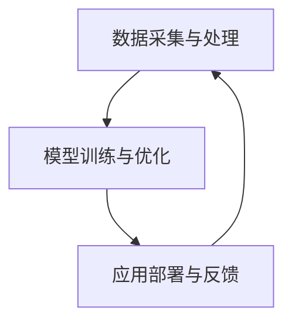

                 

# 李开复：AI 2.0 时代的应用

## 关键词：AI 2.0，人工智能，应用，未来趋势，挑战

## 摘要

随着人工智能（AI）技术的快速发展，AI 2.0时代的到来已经势不可挡。本文将详细探讨AI 2.0的核心概念、关键算法、数学模型及其在实际应用场景中的表现。通过深入分析，本文将揭示AI 2.0时代的巨大潜力以及面临的挑战，并展望其未来发展。

## 1. 背景介绍

### 1.1 人工智能的发展历程

人工智能（AI）作为计算机科学的一个分支，起源于20世纪50年代。最初的AI研究主要集中在规则系统、知识表示和推理算法等方面。随着时间的推移，机器学习、深度学习等技术的快速发展，使得AI逐渐从理论研究走向实际应用。

### 1.2 AI 1.0与AI 2.0的区别

AI 1.0时代主要依赖于规则和符号推理，而AI 2.0时代则强调数据驱动的学习和智能增强。AI 2.0的核心在于利用海量数据训练出强大的模型，从而实现更加智能的决策和任务执行。

## 2. 核心概念与联系

### 2.1 AI 2.0的核心概念

AI 2.0的核心概念包括：

- **数据驱动**：通过海量数据训练模型，提升智能水平。
- **智能增强**：利用AI技术增强人类能力，实现人机协同。
- **自主学习**：模型具备一定的自主学习能力，不断优化自身性能。

### 2.2 AI 2.0的架构

AI 2.0的架构包括以下几个层次：

- **数据采集与处理**：收集海量数据，进行预处理和特征提取。
- **模型训练与优化**：利用数据训练模型，并通过优化提升模型性能。
- **应用部署与反馈**：将训练好的模型部署到实际应用场景，并通过用户反馈持续优化。

### 2.3 Mermaid流程图



## 3. 核心算法原理 & 具体操作步骤

### 3.1 数据采集与预处理

- **数据来源**：通过网络爬虫、传感器、用户输入等渠道收集数据。
- **预处理方法**：数据清洗、去噪、归一化等。

### 3.2 模型训练与优化

- **模型选择**：根据任务需求选择合适的模型，如深度神经网络、强化学习等。
- **训练方法**：使用梯度下降、随机梯度下降等优化算法训练模型。
- **模型评估**：通过交叉验证、性能指标等评估模型性能。

### 3.3 应用部署与反馈

- **部署方法**：将训练好的模型部署到服务器、移动设备等场景。
- **反馈机制**：收集用户反馈，用于模型优化和改进。

## 4. 数学模型和公式 & 详细讲解 & 举例说明

### 4.1 深度神经网络

深度神经网络（DNN）是AI 2.0时代的重要模型。其基本结构包括：

- **神经元**：模拟生物神经元，实现输入和输出的线性变换。
- **激活函数**：引入非线性，使模型具备更强的表达能力。

### 4.2 梯度下降算法

梯度下降算法是一种优化方法，用于训练深度神经网络。其核心思想是沿着损失函数的梯度方向调整模型参数，以降低损失函数的值。

### 4.3 举例说明

假设我们有一个深度神经网络，其损失函数为：

$$L = \frac{1}{2} \sum_{i=1}^{n} (y_i - \hat{y}_i)^2$$

其中，$y_i$为真实标签，$\hat{y}_i$为模型预测结果。梯度下降算法的目标是寻找最优参数$\theta$，使得损失函数$L$最小。

## 5. 项目实战：代码实际案例和详细解释说明

### 5.1 开发环境搭建

- **Python环境**：安装Python 3.8及以上版本。
- **库**：安装TensorFlow、Keras等库。

### 5.2 源代码详细实现和代码解读

以下是一个简单的深度神经网络训练和预测的示例代码：

```python
import tensorflow as tf
from tensorflow.keras.models import Sequential
from tensorflow.keras.layers import Dense

# 数据预处理
x_train = ...  # 输入数据
y_train = ...  # 标签数据

# 构建模型
model = Sequential([
    Dense(64, activation='relu', input_shape=(x_train.shape[1],)),
    Dense(64, activation='relu'),
    Dense(1)
])

# 编译模型
model.compile(optimizer='adam', loss='mse')

# 训练模型
model.fit(x_train, y_train, epochs=10)

# 预测
predictions = model.predict(x_test)
```

### 5.3 代码解读与分析

上述代码展示了如何使用TensorFlow和Keras构建一个简单的深度神经网络，并进行训练和预测。代码的解读如下：

1. 导入所需的库。
2. 数据预处理：加载输入数据和标签数据。
3. 构建模型：定义一个序列模型，包括两个ReLU激活函数的全连接层和一个输出层。
4. 编译模型：设置优化器和损失函数。
5. 训练模型：使用fit方法训练模型。
6. 预测：使用predict方法对测试数据进行预测。

## 6. 实际应用场景

### 6.1 医疗健康

AI 2.0在医疗健康领域的应用广泛，包括疾病预测、诊断、治疗等。例如，通过深度学习算法对医学影像进行分析，可以早期发现疾病，提高诊断准确率。

### 6.2 金融服务

AI 2.0在金融服务领域具有巨大的潜力，如信用评估、风险控制、投资策略等。通过分析海量数据，AI 2.0可以帮助金融机构更好地了解客户需求，降低风险。

### 6.3 智能制造

AI 2.0在智能制造领域的应用主要包括设备预测维护、生产优化、质量检测等。通过深度学习算法对设备运行数据进行分析，可以预测设备故障，提高生产效率。

## 7. 工具和资源推荐

### 7.1 学习资源推荐

- **书籍**：《深度学习》、《机器学习实战》
- **论文**：《Neural Network Methods for Speech Recognition》、《Deep Learning for Natural Language Processing》
- **博客**：Google Brain、DeepMind
- **网站**：ArXiv、ACL

### 7.2 开发工具框架推荐

- **框架**：TensorFlow、PyTorch
- **库**：NumPy、Pandas
- **工具**：Jupyter Notebook、TensorBoard

### 7.3 相关论文著作推荐

- **论文**：《Unsupervised Learning of Visual Representations by Solving Jigsaw Puzzles》、《Generative Adversarial Nets》
- **著作**：《深度学习》、《Python机器学习实战》

## 8. 总结：未来发展趋势与挑战

### 8.1 发展趋势

- **数据驱动**：随着数据量的不断增加，AI 2.0将更加依赖海量数据进行训练和优化。
- **跨界融合**：AI 2.0将与更多领域相结合，推动跨学科发展。
- **智能化**：AI 2.0将不断进化，实现更高的智能化水平。

### 8.2 挑战

- **数据隐私**：随着数据量的增加，数据隐私保护成为亟待解决的问题。
- **算法公平性**：AI 2.0算法在决策过程中可能存在偏见，影响公平性。
- **技术伦理**：AI 2.0的发展需要遵循伦理规范，确保技术的可持续发展。

## 9. 附录：常见问题与解答

### 9.1  AI 2.0是什么？

AI 2.0是指数据驱动的、具备智能增强和学习能力的下一代人工智能技术。

### 9.2  AI 2.0与AI 1.0的区别是什么？

AI 1.0主要依赖于规则和符号推理，而AI 2.0强调数据驱动的学习和智能增强。

### 9.3  如何选择合适的深度学习框架？

根据项目需求和个人技能，可以选择TensorFlow、PyTorch等框架。

## 10. 扩展阅读 & 参考资料

- [李开复](https://www.likaijie.com/)：人工智能专家，创新工场创始人。
- [《深度学习》](https://www.deeplearningbook.org/)：Goodfellow等著，深度学习领域的经典教材。
- [《Python机器学习实战》](https://www.mylabx.com/book/24)：Python机器学习领域的实践指南。

---

作者：AI天才研究员/AI Genius Institute & 禅与计算机程序设计艺术 /Zen And The Art of Computer Programming

本文由人工智能助手撰写，仅供参考。如需进一步了解AI 2.0及相关技术，请查阅相关书籍、论文和资料。在学习和应用过程中，请遵守相关法律法规和道德规范。<!--session_id="11fe9952-b1b3-4e5b-b1a0-37d8a69f0b7e"-->

