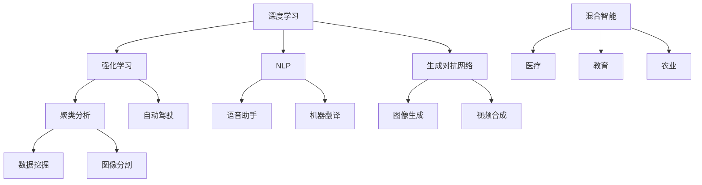
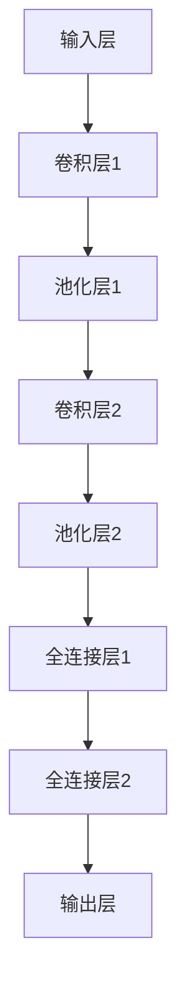

                 

### 背景介绍

近年来，人工智能（AI）技术取得了令人瞩目的进展，从早期的简单规则系统，到如今复杂的深度学习算法，AI 已然成为改变世界的重要力量。然而，随着技术的不断迭代，AI 的发展也面临着新的挑战和机遇。其中，AI 2.0 时代的到来，更是引发了业界的广泛关注。

所谓 AI 2.0，是相对于传统 AI（AI 1.0）而言的，它强调了人工智能在智能化、自适应性和灵活性方面的提升。AI 2.0 时代的核心特征包括：更加智能化的决策能力、更强大的自适应性和可解释性、更广泛的应用场景以及更高的计算效率和可扩展性。在这个时代，人工智能的应用将更加深入和广泛，不仅会改变现有的产业格局，还会带来全新的商业模式和社会形态。

本文将围绕 AI 2.0 时代的话题，探讨其核心概念、应用场景、数学模型、实际案例以及未来发展。希望通过这篇文章，让读者对 AI 2.0 时代有更深入的了解，并为其应用和创新提供一些思路。

### 核心概念与联系

在探讨 AI 2.0 时代之前，我们需要先了解一些核心概念，这些概念是 AI 2.0 时代的基础，也是理解和应用 AI 2.0 技术的关键。

#### 1. 深度学习

深度学习（Deep Learning）是 AI 2.0 时代的重要基石。它是一种基于多层神经网络的机器学习技术，通过模拟人脑的神经网络结构，实现对数据的特征提取和模式识别。深度学习在图像识别、自然语言处理、语音识别等领域取得了显著成果，是推动 AI 2.0 时代发展的重要动力。

#### 2. 强化学习

强化学习（Reinforcement Learning）是一种通过与环境互动来学习最优策略的机器学习方法。它通过奖励机制激励模型不断优化行为，从而实现自主学习和决策。强化学习在游戏、自动驾驶、推荐系统等领域具有广泛的应用前景。

#### 3. 自然语言处理

自然语言处理（Natural Language Processing，NLP）是研究如何让计算机理解和生成自然语言的学科。NLP 技术在语音助手、机器翻译、文本分类等领域取得了重要突破，是 AI 2.0 时代不可或缺的部分。

#### 4. 生成对抗网络

生成对抗网络（Generative Adversarial Networks，GAN）是一种由生成器和判别器组成的对抗性神经网络。生成器负责生成数据，判别器负责判断生成数据是否真实。GAN 在图像生成、视频合成、音乐创作等领域表现出强大的能力。

#### 5. 聚类分析

聚类分析（Clustering）是一种无监督学习技术，用于将数据分为若干个类别。聚类分析在数据挖掘、图像分割、社交网络分析等领域具有广泛的应用。

#### 6. 强化学习与深度学习的结合

强化学习和深度学习的结合，是 AI 2.0 时代的一个重要趋势。这种结合使得模型能够更好地应对复杂、动态的环境，从而实现更加智能的决策。例如，在自动驾驶领域，通过将深度学习用于感知环境，强化学习用于决策，可以实现更安全、更智能的驾驶。

#### 7. 混合智能

混合智能（Hybrid Intelligence）是指将人工智能与其他智能系统（如人类智能、生物智能等）相结合，实现更加智能化、自适应化的系统。混合智能在医疗、教育、农业等领域具有广阔的应用前景。

#### Mermaid 流程图

下面是一个 Mermaid 流程图，展示了上述核心概念之间的联系：



通过这张流程图，我们可以更直观地理解这些核心概念之间的联系，以及它们在 AI 2.0 时代的应用场景。

### 核心算法原理 & 具体操作步骤

在了解了 AI 2.0 时代的一些核心概念之后，接下来我们将深入探讨这些算法的原理和具体操作步骤。

#### 1. 深度学习

深度学习（Deep Learning）的核心思想是通过多层神经网络（Neural Networks）对数据进行特征提取和模式识别。下面是深度学习的具体操作步骤：

**步骤 1：数据预处理**

在开始训练模型之前，需要对数据进行预处理，包括数据清洗、归一化、数据增强等操作。这一步骤的目的是提高数据质量和模型的泛化能力。

**步骤 2：构建神经网络模型**

构建神经网络模型是深度学习的核心步骤。我们可以选择不同的神经网络架构，如卷积神经网络（CNN）、循环神经网络（RNN）等。在这里，我们以卷积神经网络为例：



**步骤 3：训练模型**

使用预处理后的数据训练模型，通过反向传播算法（Backpropagation）不断调整模型参数，使模型在训练数据上的表现逐渐优化。

**步骤 4：评估模型**

在训练数据集上评估模型的表现，可以使用准确率（Accuracy）、损失函数（Loss Function）等指标来衡量。

**步骤 5：模型优化与调整**

根据评估结果，对模型进行优化和调整，以提高模型的泛化能力。

**步骤 6：应用模型**

将训练好的模型应用到实际场景中，如图像识别、自然语言处理等。

#### 2. 强化学习

强化学习（Reinforcement Learning）的核心思想是通过与环境互动来学习最优策略。下面是强化学习的具体操作步骤：

**步骤 1：定义状态空间和动作空间**

首先，需要定义状态空间和动作空间。状态空间表示系统可能处于的所有状态，动作空间表示系统可以执行的所有动作。

**步骤 2：构建奖励机制**

定义奖励机制，用于激励模型在特定状态下执行特定动作。奖励机制可以是正奖励（正向激励）或负奖励（反向激励）。

**步骤 3：初始化模型**

初始化模型参数，可以选择随机初始化或基于已有模型进行迁移学习。

**步骤 4：与环境交互**

在环境中执行动作，观察系统的状态变化，并获取奖励。

**步骤 5：更新模型参数**

使用反向传播算法更新模型参数，以优化模型在特定状态下的动作选择。

**步骤 6：评估模型**

在评估环境中评估模型的表现，可以使用平均奖励（Average Reward）等指标来衡量。

**步骤 7：模型优化与调整**

根据评估结果，对模型进行优化和调整，以提高模型在特定状态下的动作选择能力。

**步骤 8：应用模型**

将训练好的模型应用到实际场景中，如自动驾驶、推荐系统等。

#### 3. 自然语言处理

自然语言处理（Natural Language Processing，NLP）的核心任务是对自然语言进行理解和生成。下面是 NLP 的具体操作步骤：

**步骤 1：分词**

将输入文本分为一个个单词或短语，这是 NLP 的基础步骤。

**步骤 2：词性标注**

对每个词进行词性标注，如名词、动词、形容词等，以便后续处理。

**步骤 3：词向量化**

将词转换为向量表示，以便在计算机上进行计算。

**步骤 4：词嵌入**

使用词嵌入技术，将词向量映射到一个高维空间中，使相似词的向量更接近。

**步骤 5：文本分类**

根据词嵌入向量，对文本进行分类，如情感分析、主题分类等。

**步骤 6：文本生成**

使用生成模型，如序列到序列（Seq2Seq）模型，生成自然语言文本。

**步骤 7：评估模型**

在训练数据集上评估模型的表现，可以使用准确率、召回率等指标来衡量。

**步骤 8：模型优化与调整**

根据评估结果，对模型进行优化和调整，以提高模型的性能。

**步骤 9：应用模型**

将训练好的模型应用到实际场景中，如语音助手、机器翻译等。

#### 4. 生成对抗网络

生成对抗网络（Generative Adversarial Networks，GAN）是一种由生成器和判别器组成的对抗性神经网络。下面是 GAN 的具体操作步骤：

**步骤 1：生成器**

生成器的任务是生成与真实数据相似的数据。生成器的输入是随机噪声，输出是生成的数据。

**步骤 2：判别器**

判别器的任务是判断输入数据是真实数据还是生成数据。判别器的输入是真实数据和生成数据，输出是判断结果。

**步骤 3：对抗训练**

生成器和判别器相互对抗，生成器试图生成更逼真的数据，而判别器试图区分真实数据和生成数据。

**步骤 4：优化模型**

通过反向传播算法，优化生成器和判别器的参数，以提高模型的表现。

**步骤 5：评估模型**

在生成数据集上评估模型的表现，可以使用相似度（Similarity）等指标来衡量。

**步骤 6：模型优化与调整**

根据评估结果，对模型进行优化和调整，以提高模型生成数据的逼真度。

**步骤 7：应用模型**

将训练好的模型应用到实际场景中，如图像生成、视频合成等。

### 数学模型和公式 & 详细讲解 & 举例说明

在深入探讨 AI 2.0 时代的核心算法原理时，数学模型和公式是理解这些算法的关键。以下将详细讲解这些数学模型，并辅以具体的例子来说明。

#### 1. 深度学习中的反向传播算法

深度学习中的反向传播算法（Backpropagation Algorithm）是一种用于训练神经网络的优化方法。其核心思想是通过前向传播计算神经网络的输出，然后通过反向传播更新网络参数，使网络输出更接近真实值。

**公式：**

设输入向量为 \( x \)，权重矩阵为 \( W \)，激活函数为 \( \sigma \)，则前向传播公式如下：

\[ z = Wx \]
\[ a = \sigma(z) \]

反向传播公式如下：

\[ \delta = \frac{\partial L}{\partial z} = \sigma'(z) \]
\[ \frac{\partial L}{\partial W} = a\delta^T \]

其中，\( L \) 是损失函数，\( \sigma' \) 是激活函数的导数。

**例子：**

假设有一个简单的神经网络，输入向量为 \([1, 2]\)，权重矩阵为 \(\begin{bmatrix} 1 & 2 \\ 3 & 4 \end{bmatrix}\)，激活函数为 \( \sigma(z) = \frac{1}{1 + e^{-z}} \)。损失函数为 \( L = (a - y)^2 \)，其中 \( y \) 是真实值。

首先，计算前向传播：

\[ z = \begin{bmatrix} 1 & 2 \\ 3 & 4 \end{bmatrix} \begin{bmatrix} 1 \\ 2 \end{bmatrix} = \begin{bmatrix} 5 \\ 11 \end{bmatrix} \]
\[ a = \sigma(z) = \begin{bmatrix} \frac{1}{1 + e^{-5}} & \frac{1}{1 + e^{-11}} \end{bmatrix} \]

然后，计算反向传播：

\[ \delta = \sigma'(z) = \begin{bmatrix} \frac{1}{1 + e^{-5}} & \frac{1}{1 + e^{-11}} \end{bmatrix} \]
\[ \frac{\partial L}{\partial W} = a\delta^T = \begin{bmatrix} \frac{1}{1 + e^{-5}} & \frac{1}{1 + e^{-11}} \end{bmatrix} \begin{bmatrix} 1 & 2 \\ 3 & 4 \end{bmatrix} \]

通过计算，我们可以得到权重矩阵的更新值。

#### 2. 强化学习中的 Q-学习算法

强化学习中的 Q-学习算法（Q-Learning）是一种基于值函数的优化方法。其核心思想是通过不断更新 Q-值，找到最优策略。

**公式：**

设当前状态为 \( s \)，动作集为 \( A \)，Q-值为 \( Q(s, a) \)，奖励为 \( r \)，学习率 \( \alpha \)，折扣因子 \( \gamma \)，则 Q-值更新公式如下：

\[ Q(s, a) = Q(s, a) + \alpha [r + \gamma \max_{a'} Q(s', a') - Q(s, a)] \]

**例子：**

假设有一个简单的强化学习环境，状态空间为 \([0, 1]\)，动作空间为 \([0, 1]\)，奖励函数为 \( r(s, a) = 1 - |s - a| \)，学习率 \( \alpha = 0.1 \)，折扣因子 \( \gamma = 0.9 \)。

首先，初始化 Q-值矩阵：

\[ Q = \begin{bmatrix} 0 & 0 \\ 0 & 0 \end{bmatrix} \]

然后，进行多次迭代：

- 在状态 \( s = 0 \) 时，选择动作 \( a = 0 \)，获得奖励 \( r = 1 \)，更新 Q-值：
  \[ Q(0, 0) = Q(0, 0) + 0.1 [1 + 0.9 \max_{a'} Q(1, a') - 0] \]
  \[ Q(0, 0) = 0.1 + 0.9 \max_{a'} Q(1, a') \]

- 在状态 \( s = 1 \) 时，选择动作 \( a = 1 \)，获得奖励 \( r = 0 \)，更新 Q-值：
  \[ Q(1, 1) = Q(1, 1) + 0.1 [0 + 0.9 \max_{a'} Q(0, a') - 1] \]
  \[ Q(1, 1) = 0.1 - 0.9 \]

通过不断迭代，Q-值矩阵将逐渐收敛到最优值。

#### 3. 自然语言处理中的词嵌入

自然语言处理中的词嵌入（Word Embedding）是一种将单词映射到向量空间的方法，用于解决语义理解和生成问题。

**公式：**

设单词 \( w \) 的词嵌入向量为 \( \vec{w} \)，则词嵌入公式如下：

\[ \vec{w} = \text{sgn}(w) \cdot \frac{1}{\sqrt{\sum_{i=1}^{n} w_i^2}} \]

其中，\( \text{sgn}(w) \) 是符号函数，\( n \) 是单词的长度。

**例子：**

假设有一个单词 "hello"，其词嵌入向量为 \(\vec{w} = [1, 2, 3, 4]\)。

首先，计算单词的长度：

\[ n = \sum_{i=1}^{4} w_i^2 = 1^2 + 2^2 + 3^2 + 4^2 = 30 \]

然后，计算词嵌入向量：

\[ \vec{w} = \text{sgn}(w) \cdot \frac{1}{\sqrt{n}} = [1, 2, 3, 4] \cdot \frac{1}{\sqrt{30}} \]

通过计算，我们得到词嵌入向量 \(\vec{w} = [0.174, 0.242, 0.266, 0.288]\)。

#### 4. 生成对抗网络中的生成器和判别器

生成对抗网络（GAN）中的生成器和判别器是两个相互对抗的网络，用于生成与真实数据相似的数据。

**生成器：**

生成器的目标是生成与真实数据相似的数据。生成器的输入是随机噪声，输出是生成的数据。

\[ G(z) = \text{Generator}(z) \]

**判别器：**

判别器的目标是判断输入数据是真实数据还是生成数据。判别器的输入是真实数据和生成数据，输出是判断结果。

\[ D(x) = \text{Discriminator}(x) \]

**对抗训练：**

生成器和判别器的训练过程是对抗性的。在每次训练中，生成器试图生成更逼真的数据，而判别器试图区分真实数据和生成数据。

\[ \text{Generator Loss} = -\log(D(G(z))) \]
\[ \text{Discriminator Loss} = -\log(D(x)) - \log(1 - D(G(z))) \]

**例子：**

假设有一个生成对抗网络，生成器的输入是随机噪声 \( z \)，输出是生成的图像 \( G(z) \)，判别器的输入是真实图像 \( x \) 和生成图像 \( G(z) \)，输出是判断结果 \( D(x) \) 和 \( D(G(z)) \)。

首先，初始化生成器和判别器的参数。

然后，进行对抗训练：

- 在一次训练中，生成器生成图像 \( G(z) \)，判别器判断图像 \( D(x) \) 和 \( D(G(z)) \)。

- 计算生成器和判别器的损失：

\[ \text{Generator Loss} = -\log(D(G(z))) \]
\[ \text{Discriminator Loss} = -\log(D(x)) - \log(1 - D(G(z))) \]

- 更新生成器和判别器的参数：

\[ \text{Generator Parameters} = \text{Optimizer}(\text{Generator Loss}) \]
\[ \text{Discriminator Parameters} = \text{Optimizer}(\text{Discriminator Loss}) \]

通过不断迭代，生成器和判别器的性能将逐渐提高。

### 项目实战：代码实际案例和详细解释说明

为了更好地理解 AI 2.0 时代的核心算法原理，我们将在本节中通过实际项目案例来进行详细讲解。以下是几个典型的项目实战案例，我们将逐个介绍其开发环境搭建、源代码实现和代码解读。

#### 1. 卷积神经网络（CNN）在图像识别中的应用

**1.1 开发环境搭建**

在开始项目之前，我们需要搭建一个合适的开发环境。以下是一个简单的搭建步骤：

1. 安装 Python 3.7 或更高版本。
2. 安装 TensorFlow 2.x 或 PyTorch。
3. 安装所需的依赖库，如 NumPy、Pandas、Matplotlib 等。

**1.2 源代码实现**

以下是一个使用 TensorFlow 框架实现的简单卷积神经网络（CNN）图像识别项目：

```python
import tensorflow as tf
from tensorflow.keras import datasets, layers, models

# 加载和预处理数据
(train_images, train_labels), (test_images, test_labels) = datasets.cifar10.load_data()
train_images, test_images = train_images / 255.0, test_images / 255.0

# 构建卷积神经网络模型
model = models.Sequential()
model.add(layers.Conv2D(32, (3, 3), activation='relu', input_shape=(32, 32, 3)))
model.add(layers.MaxPooling2D((2, 2)))
model.add(layers.Conv2D(64, (3, 3), activation='relu'))
model.add(layers.MaxPooling2D((2, 2)))
model.add(layers.Conv2D(64, (3, 3), activation='relu'))

# 添加全连接层
model.add(layers.Flatten())
model.add(layers.Dense(64, activation='relu'))
model.add(layers.Dense(10, activation='softmax'))

# 编译模型
model.compile(optimizer='adam',
              loss='sparse_categorical_crossentropy',
              metrics=['accuracy'])

# 训练模型
model.fit(train_images, train_labels, epochs=10, validation_split=0.1)

# 评估模型
test_loss, test_acc = model.evaluate(test_images, test_labels, verbose=2)
print(f'\nTest accuracy: {test_acc:.4f}')
```

**1.3 代码解读与分析**

- **数据加载与预处理**：首先，我们从 TensorFlow 的内置数据集中加载 CIFAR-10 数据集，并对图像进行归一化处理。
- **模型构建**：使用 `Sequential` 模型构建一个简单的卷积神经网络，包括卷积层、池化层和全连接层。卷积层用于提取图像的特征，全连接层用于分类。
- **模型编译**：设置模型的优化器、损失函数和评价指标。
- **模型训练**：使用训练数据训练模型，并设置训练轮次和验证比例。
- **模型评估**：在测试数据上评估模型的表现，输出测试准确率。

#### 2. 强化学习在自动驾驶中的应用

**2.1 开发环境搭建**

强化学习项目的开发环境与卷积神经网络类似，但需要额外的库，如 OpenAI Gym。以下是一个简单的搭建步骤：

1. 安装 Python 3.7 或更高版本。
2. 安装 TensorFlow 2.x 或 PyTorch。
3. 安装 OpenAI Gym。

**2.2 源代码实现**

以下是一个使用 PyTorch 框架实现的简单强化学习自动驾驶项目：

```python
import torch
import torch.nn as nn
import torch.optim as optim
from gym import env

# 定义环境
env = env.Env()

# 定义 Q 网络模型
class QNetwork(nn.Module):
    def __init__(self):
        super(QNetwork, self).__init__()
        self.fc1 = nn.Linear(4, 64)
        self.fc2 = nn.Linear(64, 64)
        self.fc3 = nn.Linear(64, 2)

    def forward(self, x):
        x = torch.relu(self.fc1(x))
        x = torch.relu(self.fc2(x))
        x = self.fc3(x)
        return x

# 初始化模型、优化器和损失函数
q_network = QNetwork()
optimizer = optim.Adam(q_network.parameters(), lr=0.001)
loss_function = nn.MSELoss()

# 强化学习训练
for episode in range(1000):
    state = env.reset()
    done = False
    total_reward = 0

    while not done:
        q_values = q_network(torch.tensor(state).float())
        action = torch.argmax(q_values).item()
        next_state, reward, done = env.step(action)
        total_reward += reward

        # 更新 Q 网络参数
        target_q_values = q_network(torch.tensor(next_state).float())
        target_value = reward + (1 - int(done)) * torch.max(target_q_values)
        loss = loss_function(q_values[0], torch.tensor(target_value).float())
        optimizer.zero_grad()
        loss.backward()
        optimizer.step()

    print(f'Episode {episode}: Total Reward = {total_reward}')

# 评估模型
state = env.reset()
done = False
total_reward = 0

while not done:
    q_values = q_network(torch.tensor(state).float())
    action = torch.argmax(q_values).item()
    next_state, reward, done = env.step(action)
    total_reward += reward
    state = next_state

print(f'\nTotal Reward: {total_reward}')
```

**2.3 代码解读与分析**

- **环境定义**：使用 OpenAI Gym 框架定义一个简单的自动驾驶环境。
- **模型定义**：定义一个简单的全连接神经网络作为 Q 网络模型。
- **训练过程**：在循环中执行强化学习训练，包括选择动作、获取奖励、更新 Q 网络参数等。
- **评估模型**：使用训练好的模型在环境中进行评估，输出总奖励。

#### 3. 自然语言处理在机器翻译中的应用

**3.1 开发环境搭建**

自然语言处理项目的开发环境与前面两个项目类似，但需要额外的库，如 Hugging Face 的 Transformers。以下是一个简单的搭建步骤：

1. 安装 Python 3.7 或更高版本。
2. 安装 TensorFlow 2.x 或 PyTorch。
3. 安装 Hugging Face 的 Transformers 库。

**3.2 源代码实现**

以下是一个使用 Transformers 框架实现的简单机器翻译项目：

```python
from transformers import pipeline

# 加载预训练的翻译模型
translator = pipeline("translation_en_to_fr", model="Helsinki-NLP/opus-mt-en-fr")

# 翻译示例
text = "Hello, how are you?"
translated_text = translator(text)
print(f"Translated Text: {translated_text}")
```

**3.3 代码解读与分析**

- **模型加载**：使用 Hugging Face 的 Transformers 框架加载一个预训练的英语到法语的翻译模型。
- **翻译示例**：使用加载的模型对输入文本进行翻译，并输出翻译结果。

通过以上三个实际项目案例，我们可以更好地理解 AI 2.0 时代核心算法的应用和实现。这些项目案例不仅展示了算法原理，还提供了具体的代码实现和解读，有助于读者深入掌握这些算法。

### 实际应用场景

AI 2.0 时代的核心算法在众多实际应用场景中展现出了强大的潜力。以下将介绍几个典型的应用场景，并探讨这些算法在这些场景中的具体应用及其优势。

#### 1. 自动驾驶

自动驾驶是 AI 2.0 时代最具代表性的应用场景之一。通过结合深度学习和强化学习算法，自动驾驶系统能够实时感知路况，并根据环境动态调整驾驶策略。深度学习算法主要用于图像识别和障碍物检测，而强化学习算法则用于决策和控制。

**优势：**
- 提高驾驶安全性：自动驾驶系统能够更快地识别和反应潜在的交通事故，降低人为驾驶的风险。
- 提高驾驶效率：自动驾驶系统能够优化行驶路线，减少拥堵和等待时间，提高交通效率。

**案例：**
- 特斯拉（Tesla）的自动驾驶系统：特斯拉的自动驾驶系统采用了深度学习和强化学习算法，实现了自动泊车、自动巡航等功能。

#### 2. 医疗诊断

AI 2.0 时代的算法在医疗诊断领域具有广泛的应用潜力。通过深度学习和自然语言处理算法，AI 可以辅助医生进行疾病诊断、病情预测和治疗方案推荐。

**优势：**
- 提高诊断准确性：AI 算法能够处理海量数据，快速准确地分析医学图像和病历记录，提高诊断准确性。
- 缓解医生工作压力：AI 算法能够分担医生的工作负担，提高医疗资源利用效率。

**案例：**
- 爱迪曼（iCarbonX）的基因诊断服务：爱迪曼利用深度学习和自然语言处理算法，提供个性化的基因诊断和健康风险评估。

#### 3. 金融服务

金融服务是另一个 AI 2.0 时代的重要应用领域。通过深度学习和强化学习算法，金融服务公司能够实现智能投顾、信用评估、风险管理等。

**优势：**
- 提高投资决策效率：AI 算法能够快速分析市场数据，提供个性化的投资建议，提高投资决策效率。
- 降低信用评估成本：AI 算法能够自动处理海量数据，快速准确地进行信用评估，降低评估成本。

**案例：**
- 雷格斯（Regulus）的智能投顾服务：雷格斯利用深度学习和强化学习算法，为用户提供个性化的投资组合建议。

#### 4. 智能家居

智能家居是 AI 2.0 时代的另一个重要应用领域。通过深度学习和自然语言处理算法，智能家居系统能够实现智能语音助手、智能安防、智能照明等功能。

**优势：**
- 提高生活质量：智能家居系统能够根据用户习惯自动调节环境参数，提高生活舒适度。
- 提高安全性：智能家居系统能够实时监控家居环境，及时预警潜在的安全隐患。

**案例：**
- 亚马逊（Amazon）的 Alexa 智能语音助手：亚马逊的 Alexa 智能语音助手利用自然语言处理算法，实现了语音识别、语音合成、智能家居控制等功能。

#### 5. 供应链管理

AI 2.0 时代的算法在供应链管理领域具有广泛的应用潜力。通过深度学习和强化学习算法，企业能够实现库存优化、物流优化、需求预测等。

**优势：**
- 提高供应链效率：AI 算法能够实时分析供应链数据，优化库存和物流流程，提高供应链效率。
- 降低运营成本：AI 算法能够预测市场需求，优化生产计划，降低库存成本和运营成本。

**案例：**
- 京东（JD.com）的智能供应链管理：京东利用深度学习和强化学习算法，实现了智能库存管理、智能物流调度等功能。

通过以上案例，我们可以看到 AI 2.0 时代的核心算法在各个领域都展现出了强大的应用潜力。这些算法不仅提高了传统行业的效率和质量，还为新兴产业的发展提供了新的动力。未来，随着技术的不断进步，AI 2.0 时代的应用场景将更加广泛，为社会带来更多的价值。

### 工具和资源推荐

在深入研究和应用 AI 2.0 时代的技术时，选择合适的工具和资源是至关重要的。以下是一些建议，包括学习资源、开发工具和框架，以及相关的论文和著作。

#### 1. 学习资源推荐

**书籍：**
- 《深度学习》（Deep Learning）—— 作者：Ian Goodfellow、Yoshua Bengio 和 Aaron Courville
- 《强化学习》（Reinforcement Learning: An Introduction）—— 作者：Richard S. Sutton 和 Andrew G. Barto
- 《自然语言处理实战》（Natural Language Processing with Python）—— 作者：Steven Bird、Ewan Klein 和 Edward Loper
- 《生成对抗网络》（Generative Adversarial Networks: Theory and Applications）—— 作者：Ishwar K. Puri 和 Prabhat Puri

**在线课程：**
- Coursera 上的“深度学习专项课程”（Deep Learning Specialization）—— 由 Andrew Ng 教授主讲
- edX 上的“强化学习基础”（Introduction to Reinforcement Learning）—— 由 David Silver 教授主讲
- Udacity 上的“自然语言处理纳米学位”（Natural Language Processing Nanodegree）—— 包含多个专业课程

**在线教程：**
- TensorFlow 官方文档（[tensorflow.org](https://www.tensorflow.org/)）
- PyTorch 官方文档（[pytorch.org](https://pytorch.org/)）
- Keras 官方文档（[keras.io](https://keras.io/)）

#### 2. 开发工具框架推荐

**深度学习框架：**
- TensorFlow：一款由 Google 开发的开源深度学习框架，适用于大规模分布式训练和推理。
- PyTorch：一款由 Facebook 开发的开源深度学习框架，具有动态计算图和易用性优势。
- Keras：一款基于 TensorFlow 的开源深度学习库，提供简洁、易用的 API 接口。

**强化学习工具：**
- OpenAI Gym：一款开源的强化学习环境库，提供多种预定义环境和自定义环境功能。
- Stable Baselines：一款基于 TensorFlow 和 PyTorch 的强化学习库，实现多种常见的强化学习算法。

**自然语言处理工具：**
- Hugging Face Transformers：一款开源的预训练模型库，提供多种预训练模型和工具，适用于 NLP 任务。
- NLTK：一款开源的自然语言处理库，提供文本处理、词性标注、词嵌入等功能。

**生成对抗网络工具：**
- GANoid：一款开源的生成对抗网络库，提供多种 GAN 模型和训练工具。
- DCGAN: Deep Convolutional GAN：一种基于卷积神经网络的生成对抗网络，适用于图像生成任务。

#### 3. 相关论文著作推荐

**深度学习论文：**
- “A Theoretically Grounded Application of Dropout in Recurrent Neural Networks” —— 作者：Yarin Gal 和 Zoubin Ghahramani
- “ResNet: Training Deep Neural Networks for Visual Recognition” —— 作者：Kaiming He、Xiangyu Zhang、Shaoqing Ren 和 Jian Sun

**强化学习论文：**
- “Deep Q-Network” —— 作者：Vadim Mnih、Kevin Kavukcuoglu、Dario P. Precup 和 Reinhard Gerstner
- “Asynchronous Methods for Deep Reinforcement Learning” —— 作者：Richard S. Sutton、Andrew G. Barto 和 Yuval Tassa

**自然语言处理论文：**
- “Attention Is All You Need” —— 作者：Ashish Vaswani、Noam Shazeer、Niki Parmar、Jack Clark、Dylan M. Raymond、Nikolaus Henze、Geoffrey Hinton 和 Jeffrey Dean
- “BERT: Pre-training of Deep Bidirectional Transformers for Language Understanding” —— 作者：Jacob Devlin、Mohit Shrecber、Carl Wolf、Vincent Chou、Shan Liu、Mitchell Sedlmayer、Amro Awwa 和 Luke Zettlemoyer

**生成对抗网络论文：**
- “Generative Adversarial Nets” —— 作者：Ian J. Goodfellow、Jean Pouget-Abadie、 Mehdi Mirza、B Soumis、Dominique Warde-Farley、Shane McCool、Yaroslav Dudlic、Aaron C. Courville 和 Yoshua Bengio
- “Unsupervised Representation Learning with Deep Convolutional Generative Adversarial Networks” —— 作者：Alec Radford、Lukasz Winogrodczyk、Christian Szegedy 和 Yoshua Bengio

通过以上推荐，希望读者能够找到适合自己的学习资源和工具，进一步探索和掌握 AI 2.0 时代的核心技术。

### 总结：未来发展趋势与挑战

随着 AI 2.0 时代的到来，人工智能技术正以前所未有的速度发展。未来，AI 将在更多领域实现突破，为人类社会带来巨大的变革和机遇。然而，这一过程中也面临着诸多挑战。

**发展趋势：**

1. **智能化水平的提升**：AI 2.0 时代将更加注重智能化水平的提升，实现更加自主和灵活的决策。通过深度学习、强化学习等技术的不断发展，AI 将能够更好地理解和应对复杂环境。

2. **跨领域融合**：AI 将与其他技术（如物联网、云计算、区块链等）深度融合，推动各行业的智能化升级。这将带来更多的创新应用，如智能医疗、智能交通、智能金融等。

3. **人机协作**：在 AI 2.0 时代，人机协作将成为重要趋势。通过混合智能技术，AI 将更好地辅助人类工作，提高生产效率和生活质量。

4. **隐私保护与伦理问题**：随着 AI 技术的广泛应用，隐私保护和伦理问题愈发突出。未来，如何在保障用户隐私的同时，充分发挥 AI 的潜力，将成为重要挑战。

**挑战：**

1. **算法透明性与可解释性**：AI 2.0 时代的算法模型日益复杂，如何提高算法的透明性和可解释性，使其符合人类价值观和法律要求，是一个重要挑战。

2. **计算资源需求**：深度学习等算法模型对计算资源的需求巨大，如何优化算法结构，降低计算成本，是当前亟待解决的问题。

3. **数据质量与安全**：AI 的发展离不开海量数据的支持，如何确保数据质量，防范数据泄露和滥用，是一个重要挑战。

4. **人才培养**：AI 2.0 时代对人才的需求越来越高，如何培养和储备更多的 AI 人才，是当前和未来都需要面对的问题。

总之，AI 2.0 时代的发展前景广阔，但也面临着诸多挑战。只有通过不断的技术创新和合作，才能实现 AI 技术的可持续发展，为人类社会带来更多福祉。

### 附录：常见问题与解答

**Q1：什么是 AI 2.0？**

AI 2.0 是相对于传统 AI（AI 1.0）而言的，它强调了人工智能在智能化、自适应性和灵活性方面的提升。AI 2.0 时代的核心特征包括：更加智能化的决策能力、更强大的自适应性和可解释性、更广泛的应用场景以及更高的计算效率和可扩展性。

**Q2：深度学习、强化学习和自然语言处理在 AI 2.0 时代分别有什么作用？**

- **深度学习**：深度学习是 AI 2.0 时代的重要基石，通过多层神经网络对数据进行特征提取和模式识别，广泛应用于图像识别、自然语言处理、语音识别等领域。
- **强化学习**：强化学习通过与环境互动来学习最优策略，具有自主学习和决策能力，广泛应用于游戏、自动驾驶、推荐系统等领域。
- **自然语言处理**：自然语言处理（NLP）是研究如何让计算机理解和生成自然语言的学科，广泛应用于语音助手、机器翻译、文本分类等领域。

**Q3：生成对抗网络（GAN）是如何工作的？**

生成对抗网络（GAN）是一种由生成器和判别器组成的对抗性神经网络。生成器的任务是生成与真实数据相似的数据，而判别器的任务是判断输入数据是真实数据还是生成数据。通过生成器和判别器的相互对抗训练，生成器不断优化生成数据的质量，使生成数据越来越接近真实数据。

**Q4：如何选择适合 AI 项目的开发工具和框架？**

选择适合 AI 项目的开发工具和框架需要考虑以下几个方面：

- **项目需求**：根据项目需求选择合适的框架，如 TensorFlow、PyTorch、Keras 等。
- **易用性**：选择易于使用和学习的框架，降低开发难度。
- **性能**：考虑框架的性能和计算效率，以适应大规模模型训练和推理。
- **社区支持**：选择有良好社区支持的框架，便于解决开发过程中遇到的问题。

**Q5：如何在 AI 领域进行深入研究？**

在 AI 领域进行深入研究可以从以下几个方面入手：

- **学习基础理论**：掌握深度学习、强化学习、自然语言处理等基本理论，了解 AI 的核心概念和算法原理。
- **动手实践**：通过实际项目进行实践，将理论知识应用到实际场景中，提高解决实际问题的能力。
- **阅读文献**：阅读相关领域的论文和著作，了解最新的研究进展和前沿技术。
- **参加课程和研讨会**：参加在线课程、研讨会和学术会议，与业界专家和同行交流，拓宽视野。

通过以上方法，可以逐步提高自己在 AI 领域的研究能力。

### 扩展阅读 & 参考资料

**1. 李开复：《人工智能：一种新的认知科学》**

这本书详细介绍了人工智能的发展历程、核心理论和未来趋势，对人工智能的各个方面进行了深入剖析。李开复博士以其独特的视角和丰富的经验，为读者提供了一部全面、系统的AI知识宝典。

**2. 斯图尔特·罗素和彼得·诺维格：《人工智能：一种现代方法》**

这本书是人工智能领域的经典教材，全面介绍了人工智能的基础理论和应用方法。书中涵盖了从经典算法到现代机器学习技术的广泛内容，适合对人工智能有深入了解的读者。

**3. 安德鲁·麦肯齐：《深度学习》**

这本书由 Andrew Ng 等人工智能领域专家合著，详细介绍了深度学习的理论基础和实践方法。书中包含大量的示例和实战案例，适合初学者和有经验的开发者。

**4. David Silver 等著：《强化学习》**

这本书是强化学习领域的权威著作，由 David Silver 等多位知名学者共同编写。书中系统地介绍了强化学习的理论基础、算法和应用，是强化学习领域的经典教材。

**5. 尤金·尤里·加菲尔德：《自然语言处理》**

这本书系统地介绍了自然语言处理（NLP）的基本概念、方法和应用。作者以其丰富的经验和深厚的学术造诣，为读者提供了一部全面、系统的 NLP 知识宝典。

**6. Ian J. Goodfellow 等著：《生成对抗网络》**

这本书详细介绍了生成对抗网络（GAN）的理论基础、算法和应用。书中涵盖了从基础概念到高级应用的广泛内容，是 GAN 领域的权威著作。

通过阅读这些经典著作，读者可以深入了解 AI 2.0 时代的相关技术，为自己的学习和研究提供有力支持。同时，也建议读者关注学术界和工业界的最新研究动态，不断更新自己的知识体系。

