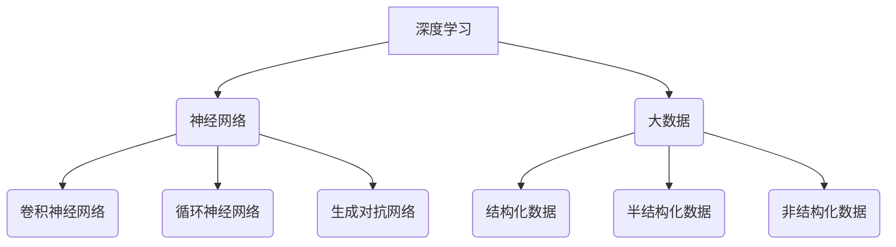

                 

### 1. 背景介绍

#### 引言

近年来，人工智能（AI）技术飞速发展，已经从实验室走向了各行各业，成为推动社会进步的重要力量。AI 2.0 时代，即基于深度学习和大数据的人工智能新时代，成为了开发者们研究和应用的热点。在这个时代，开发者的角色变得更加重要，他们不仅是技术的实现者，更是创新和变革的推动者。

本文旨在探讨 AI 2.0 时代的开发者角色，分析他们在当前技术环境下面临的挑战和机遇。我们将通过以下几个部分展开讨论：

1. **核心概念与联系**：介绍 AI 2.0 时代的关键概念，如深度学习、神经网络、大数据等，并展示它们之间的联系。
2. **核心算法原理 & 具体操作步骤**：深入探讨深度学习算法的原理，以及如何将这些算法应用到实际开发中。
3. **数学模型和公式 & 详细讲解 & 举例说明**：介绍深度学习中的数学模型和公式，并通过具体例子进行详细说明。
4. **项目实战：代码实际案例和详细解释说明**：通过实际项目，展示如何将深度学习算法应用于实际开发。
5. **实际应用场景**：分析深度学习在各个领域的应用，以及开发者在这些场景中所需具备的技能。
6. **工具和资源推荐**：推荐学习资源和开发工具，帮助开发者更好地掌握 AI 2.0 技术。
7. **总结：未来发展趋势与挑战**：总结 AI 2.0 时代的发展趋势，以及开发者面临的挑战和机遇。

#### AI 2.0 时代的到来

AI 2.0 时代，也被称为深度学习时代，是指基于深度学习技术的人工智能新时代。深度学习是一种基于人工神经网络的学习方法，通过多层神经网络对数据进行建模，从而实现自动特征提取和复杂模式识别。

与传统的机器学习方法相比，深度学习具有以下几个显著优势：

1. **自动特征提取**：深度学习可以自动学习数据中的低级特征（如边缘、纹理）和高级特征（如概念、语义），从而减轻了人工特征提取的负担。
2. **大规模数据处理能力**：深度学习算法可以在大量数据上进行训练，从而提高模型的泛化能力。
3. **强大的非线性建模能力**：深度学习通过多层神经网络可以构建复杂的非线性模型，从而能够更好地模拟现实世界的复杂性。

#### 开发者面临的挑战

尽管 AI 2.0 时代为开发者带来了许多机遇，但同时也带来了巨大的挑战：

1. **数据质量**：深度学习依赖于大量高质量的数据进行训练，数据质量直接影响模型的性能。开发者需要投入大量时间和精力来收集、处理和清洗数据。
2. **计算资源**：深度学习算法通常需要大量的计算资源，开发者需要具备高效地使用计算资源的能力，如 GPU、分布式计算等。
3. **算法调优**：深度学习模型的性能优化是一个复杂的过程，开发者需要深入理解算法原理，并通过反复试验和调优来获得最佳性能。
4. **伦理和社会问题**：随着 AI 技术的广泛应用，开发者需要关注算法的伦理和社会影响，确保技术发展不会损害人类利益。

#### 开发者面临的机遇

尽管 AI 2.0 时代带来了挑战，但同时也为开发者带来了巨大的机遇：

1. **技术创新**：开发者可以参与到前沿技术的研发中，推动 AI 技术的发展和应用。
2. **商业机会**：AI 2.0 时代为各个行业带来了新的商业模式和机会，开发者可以借此开拓新的商业领域。
3. **职业发展**：随着 AI 技术的普及，对 AI 开发者的需求不断增加，开发者有更多的职业选择和发展空间。

### 2. 核心概念与联系

在 AI 2.0 时代，深度学习、神经网络和大数据是三个核心概念，它们共同构建了现代人工智能的基础。接下来，我们将分别介绍这些概念，并展示它们之间的联系。

#### 深度学习

深度学习是一种基于人工神经网络的学习方法，它通过多层神经网络对数据进行建模，从而实现自动特征提取和复杂模式识别。深度学习的核心思想是模拟人类大脑的工作方式，通过不断调整网络中的权重和偏置，使网络能够从大量数据中学习到有效的特征表示。

深度学习可以分为以下几种类型：

1. **卷积神经网络（CNN）**：用于图像和视频处理，通过卷积操作提取空间特征。
2. **循环神经网络（RNN）**：用于序列数据建模，如自然语言处理和语音识别。
3. **生成对抗网络（GAN）**：用于生成对抗性样本，如图像生成和风格迁移。

#### 神经网络

神经网络是一种由大量神经元组成的计算模型，每个神经元都与其他神经元相连，并通过权重和偏置进行信号传递和计算。神经网络的工作原理类似于人类大脑，通过学习和调整神经元之间的连接权重，实现对输入数据的分类、回归和特征提取。

神经网络可以分为以下几种类型：

1. **前馈神经网络（FNN）**：信号从前向传播到后向，没有循环结构。
2. **反向传播神经网络（BPNN）**：通过反向传播算法更新权重和偏置，实现梯度下降优化。
3. **递归神经网络（RNN）**：具有循环结构，适用于序列数据建模。

#### 大数据

大数据是指数据量巨大、数据类型繁多、数据价值密度低的数据集合。大数据的核心思想是通过数据挖掘和分析，从海量数据中提取有价值的信息和知识。

大数据可以分为以下几种类型：

1. **结构化数据**：如关系型数据库中的数据，易于处理和分析。
2. **半结构化数据**：如 XML、JSON 等格式化的数据，需要一定的处理和分析。
3. **非结构化数据**：如文本、图像、视频等，需要进行复杂的预处理和特征提取。

#### 核心概念之间的联系

深度学习、神经网络和大数据之间存在着密切的联系：

1. **深度学习依赖于神经网络**：深度学习算法是基于神经网络构建的，神经网络是深度学习的实现基础。
2. **神经网络需要大数据支持**：神经网络需要大量数据进行训练，大数据提供了丰富的数据来源。
3. **大数据推动深度学习发展**：大数据技术的发展使得数据挖掘和分析成为可能，推动了深度学习的应用和普及。

通过深度学习、神经网络和大数据的结合，AI 2.0 时代为开发者带来了前所未有的机遇和挑战。开发者需要深入了解这些核心概念，并掌握它们之间的联系，才能在 AI 2.0 时代取得成功。

#### Mermaid 流程图展示

以下是一个简化的 Mermaid 流程图，展示了深度学习、神经网络和大数据之间的联系：



在这个流程图中，深度学习（A）依赖于神经网络（B），神经网络又派生出多种类型（C、D、E）。同时，大数据（F）提供了数据来源，分为结构化数据（G）、半结构化数据（H）和非结构化数据（I）。这些核心概念相互联系，共同构成了 AI 2.0 时代的基础。

### 3. 核心算法原理 & 具体操作步骤

在 AI 2.0 时代，深度学习算法是实现人工智能的关键。本文将重点介绍卷积神经网络（CNN）、循环神经网络（RNN）和生成对抗网络（GAN）这三种核心算法的原理，以及如何在实际开发中应用这些算法。

#### 卷积神经网络（CNN）

卷积神经网络（CNN）是一种专门用于处理图像数据的神经网络，其核心思想是通过卷积操作提取图像中的空间特征。以下是 CNN 的基本原理和具体操作步骤：

##### 1. 卷积操作

卷积操作是指将一个小的可训练的滤波器（也称为卷积核）在图像上滑动，并与图像上的每个局部区域进行点积操作。这个过程可以看作是图像的局部特征提取。

##### 2. 池化操作

池化操作是在卷积操作之后进行的，用于减小特征图的尺寸，从而降低模型的复杂度和参数数量。常见的池化操作包括最大池化和平均池化。

##### 3. 神经元连接和激活函数

在卷积操作和池化操作之后，每个卷积层的输出都会通过神经元连接，并应用激活函数（如 ReLU 函数）来增加非线性特性。

##### 4. 多层卷积

CNN 通常由多个卷积层组成，每个卷积层都可以提取不同级别的特征。通过堆叠多个卷积层，可以实现对图像的逐步抽象和高级特征提取。

##### 5. 全连接层

在 CNN 的最后，通常会添加一个或多个全连接层，用于对提取到的特征进行分类或回归。

##### 具体操作步骤示例

假设我们有一个 32x32x3 的彩色图像，首先通过一个卷积层（卷积核大小为 3x3，步长为 1）进行卷积操作，得到一个 30x30x64 的特征图。然后对这个特征图进行最大池化（池化窗口大小为 2x2，步长为 2），得到一个 15x15x64 的特征图。接下来，我们再添加一个卷积层（卷积核大小为 3x3，步长为 1），得到一个 13x13x128 的特征图。最后，对这个特征图进行全连接层处理，输出类别预测结果。

#### 循环神经网络（RNN）

循环神经网络（RNN）是一种用于处理序列数据的神经网络，其核心思想是利用循环结构保留序列信息。以下是 RNN 的基本原理和具体操作步骤：

##### 1. 状态更新

RNN 的每个时间步都包含一个输入和一个隐藏状态，隐藏状态会传递到下一个时间步，从而实现信息的持久化。

##### 2. 神经元连接和激活函数

在 RNN 中，神经元之间的连接是循环的，每个时间步的输出都会通过神经元连接和激活函数进行处理。

##### 3. 长短期记忆（LSTM）

为了解决传统 RNN 的梯度消失和梯度爆炸问题，长短期记忆（LSTM）被提出。LSTM 通过引入门控机制，可以有效地学习长距离依赖。

##### 4. 遗传编码

RNN 通常用于序列数据的编码和生成，如自然语言处理和语音识别。

##### 具体操作步骤示例

假设我们有一个序列数据 \(\{x_1, x_2, ..., x_T\}\)，首先将每个序列数据输入到 RNN 中，得到隐藏状态 \(\{h_1, h_2, ..., h_T\}\)。然后，通过全连接层和激活函数（如 Softmax 函数）将隐藏状态转换为输出序列 \(\{y_1, y_2, ..., y_T\}\)。

#### 生成对抗网络（GAN）

生成对抗网络（GAN）是一种用于生成对抗性样本的神经网络，由生成器和判别器两部分组成。以下是 GAN 的基本原理和具体操作步骤：

##### 1. 生成器

生成器是一种生成模型，其目标是生成与真实数据相似的数据。生成器的输入是随机噪声，输出是生成的数据。

##### 2. 判别器

判别器是一种分类模型，其目标是区分真实数据和生成数据。判别器的输入是真实数据和生成数据，输出是概率分布。

##### 3. 对抗训练

生成器和判别器之间进行对抗训练，生成器试图生成更加真实的数据，而判别器则试图区分真实数据和生成数据。

##### 4. 零和博弈

GAN 可以看作是一种零和博弈，生成器和判别器相互竞争，最终达到纳什均衡。

##### 具体操作步骤示例

假设我们有一个图像数据集，首先通过生成器生成一些图像数据，然后通过判别器对真实图像和生成图像进行分类。在训练过程中，生成器会不断优化，以生成更真实的数据，而判别器会不断优化，以更好地区分真实图像和生成图像。

通过以上对卷积神经网络（CNN）、循环神经网络（RNN）和生成对抗网络（GAN）的介绍，我们可以看到这些核心算法在 AI 2.0 时代的重要性。开发者需要深入了解这些算法的原理，并掌握具体的操作步骤，才能在 AI 2.0 时代取得成功。

### 4. 数学模型和公式 & 详细讲解 & 举例说明

在深度学习领域，数学模型和公式是理解算法原理和进行实际开发的基础。本文将介绍深度学习中的几个核心数学模型和公式，并通过具体例子进行详细讲解。

#### 概率分布

概率分布是描述随机变量取值概率的函数。在深度学习中，概率分布用于表示数据分布、模型输出和损失函数。以下是一些常用的概率分布：

1. **伯努利分布（Bernoulli Distribution）**

   伯努利分布是一个离散概率分布，用于表示随机变量取值为 0 或 1。其概率质量函数（PDF）为：

   $$ p(x|\theta) = \begin{cases} 
   1 - \theta & \text{if } x = 0 \\
   \theta & \text{if } x = 1 
   \end{cases} $$

   其中，\(\theta\) 表示概率。

2. **高斯分布（Gaussian Distribution）**

   高斯分布是一个连续概率分布，也称为正态分布。其概率密度函数（PDF）为：

   $$ p(x|\mu, \sigma^2) = \frac{1}{\sqrt{2\pi\sigma^2}} e^{-\frac{(x-\mu)^2}{2\sigma^2}} $$

   其中，\(\mu\) 表示均值，\(\sigma^2\) 表示方差。

3. **多项式分布（Multinomial Distribution）**

   多项式分布是一个离散概率分布，用于表示多个随机变量在多个类别上的分布。其概率质量函数（PDF）为：

   $$ p(x|\theta) = \theta_1^{x_1} \theta_2^{x_2} ... \theta_k^{x_k} $$

   其中，\(\theta_i\) 表示第 \(i\) 个类别的概率。

#### 损失函数

损失函数是用于衡量模型预测值与真实值之间差异的函数。在深度学习中，损失函数用于指导模型的训练过程。以下是一些常用的损失函数：

1. **均方误差（Mean Squared Error, MSE）**

   均方误差是用于回归任务的损失函数，计算预测值与真实值之间差异的平方和的平均值。其公式为：

   $$ \text{MSE}(y, \hat{y}) = \frac{1}{n}\sum_{i=1}^{n} (y_i - \hat{y_i})^2 $$

   其中，\(y\) 表示真实值，\(\hat{y}\) 表示预测值，\(n\) 表示样本数量。

2. **交叉熵损失（Cross-Entropy Loss）**

   交叉熵损失是用于分类任务的损失函数，计算预测概率分布与真实概率分布之间的差异。其公式为：

   $$ \text{Cross-Entropy Loss}(y, \hat{y}) = -\sum_{i=1}^{n} y_i \log(\hat{y_i}) $$

   其中，\(y\) 表示真实标签，\(\hat{y}\) 表示预测概率分布。

#### 反向传播算法

反向传播算法是一种用于训练神经网络的优化算法，通过计算损失函数关于模型参数的梯度，来更新模型参数。以下是反向传播算法的基本步骤：

1. **前向传播**

   计算输入数据通过神经网络的前向传播，得到输出结果。

2. **计算损失函数**

   使用输出结果和真实标签计算损失函数。

3. **计算梯度**

   通过链式法则计算损失函数关于模型参数的梯度。

4. **更新参数**

   使用梯度下降法更新模型参数。

5. **重复迭代**

   重复上述步骤，直到模型达到收敛。

#### 具体例子：多层感知机（MLP）

多层感知机（MLP）是一种简单的神经网络结构，由输入层、隐藏层和输出层组成。以下是一个多层感知机的具体例子：

输入层：\(x_1, x_2, ..., x_n\)

隐藏层：\(h_1, h_2, ..., h_m\)

输出层：\(y_1, y_2, ..., y_k\)

假设我们有一个二分类问题，输入数据为 \(x = [x_1, x_2, ..., x_n]\)，输出标签为 \(y = [y_1, y_2]\)，其中 \(y_1 = 0\) 或 \(y_2 = 1\)。

1. **前向传播**

   假设隐藏层有 \(m\) 个神经元，输出层有 \(k\) 个神经元，输入数据通过输入层传递到隐藏层，再传递到输出层。

   隐藏层输出：

   $$ h_i = \sigma(\sum_{j=1}^{n} w_{ji} x_j + b_i) $$

   其中，\(w_{ji}\) 是输入层到隐藏层的权重，\(b_i\) 是隐藏层的偏置，\(\sigma\) 是激活函数（如 ReLU 函数）。

   输出层输出：

   $$ y_j = \sigma(\sum_{i=1}^{m} w_{ij} h_i + b_j) $$

2. **计算损失函数**

   使用交叉熵损失函数计算损失：

   $$ \text{Loss} = -\sum_{j=1}^{k} y_j \log(y_j) $$

3. **计算梯度**

   使用反向传播算法计算损失函数关于模型参数的梯度：

   $$ \frac{\partial \text{Loss}}{\partial w_{ij}} = (1 - y_j) \cdot h_i $$

   $$ \frac{\partial \text{Loss}}{\partial b_i} = (1 - y_j) \cdot h_i $$

4. **更新参数**

   使用梯度下降法更新模型参数：

   $$ w_{ij} = w_{ij} - \alpha \cdot \frac{\partial \text{Loss}}{\partial w_{ij}} $$

   $$ b_i = b_i - \alpha \cdot \frac{\partial \text{Loss}}{\partial b_i} $$

5. **重复迭代**

   重复上述步骤，直到模型达到收敛。

通过以上数学模型和公式的介绍，我们可以看到深度学习中的数学原理和计算过程。开发者需要熟练掌握这些数学工具，以便在实际开发中有效地应用深度学习算法。

### 5. 项目实战：代码实际案例和详细解释说明

在本节中，我们将通过一个实际项目来展示如何将深度学习算法应用于实际开发。该项目是一个简单的图像分类任务，使用卷积神经网络（CNN）对猫狗图片进行分类。通过这个项目，我们将详细解释代码实现过程，并提供代码解读与分析。

#### 项目背景

猫狗图片分类是一个经典的计算机视觉任务。在这个项目中，我们使用 CNN 模型来对猫狗图片进行分类，实现自动化分类系统。以下是我们项目的目标：

1. 收集并预处理猫狗图片数据集。
2. 设计并训练 CNN 模型。
3. 使用训练好的模型对新的猫狗图片进行分类。

#### 开发环境搭建

在开始项目之前，我们需要搭建一个开发环境。以下是我们使用的主要工具和库：

1. **编程语言**：Python
2. **深度学习框架**：TensorFlow 2.x
3. **数据处理库**：NumPy、Pandas、OpenCV
4. **图形库**：Matplotlib

安装以上工具和库的方法如下：

```bash
pip install tensorflow
pip install numpy
pip install pandas
pip install opencv-python
pip install matplotlib
```

#### 数据集准备

猫狗图片数据集是一个常用的公开数据集，包含数千张猫和狗的图片。我们可以在网上下载这个数据集，并将其解压到指定目录。以下是数据集的结构：

```
data/
├── train/
│   ├── cats/
│   │   ├── image_1.jpg
│   │   ├── image_2.jpg
│   │   └── ...
│   └── dogs/
│       ├── image_1.jpg
│       ├── image_2.jpg
│       └── ...
└── test/
    ├── cats/
    │   ├── image_1.jpg
    │   ├── image_2.jpg
    │   └── ...
    └── dogs/
        ├── image_1.jpg
        ├── image_2.jpg
        └── ...
```

接下来，我们需要对数据集进行预处理，包括图像缩放、归一化和标签编码。以下是预处理代码：

```python
import os
import numpy as np
from tensorflow.keras.preprocessing.image import ImageDataGenerator

def preprocess_data(data_dir, image_size=(128, 128)):
    train_dir = os.path.join(data_dir, 'train')
    test_dir = os.path.join(data_dir, 'test')

    train_datagen = ImageDataGenerator(
        rescale=1./255,
        shear_range=0.2,
        zoom_range=0.2,
        horizontal_flip=True)

    test_datagen = ImageDataGenerator(rescale=1./255)

    train_generator = train_datagen.flow_from_directory(
        train_dir,
        target_size=image_size,
        batch_size=32,
        class_mode='binary')

    test_generator = test_datagen.flow_from_directory(
        test_dir,
        target_size=image_size,
        batch_size=32,
        class_mode='binary')

    return train_generator, test_generator
```

#### 模型设计

接下来，我们设计一个简单的 CNN 模型，用于猫狗图片分类。以下是模型的结构：

1. **卷积层**：使用两个卷积层提取图像特征，每个卷积层后跟一个池化层。
2. **全连接层**：将卷积层的输出扁平化后，添加一个全连接层进行分类。

以下是模型定义代码：

```python
from tensorflow.keras.models import Sequential
from tensorflow.keras.layers import Conv2D, MaxPooling2D, Flatten, Dense, Dropout

def create_model():
    model = Sequential([
        Conv2D(32, (3, 3), activation='relu', input_shape=(128, 128, 3)),
        MaxPooling2D((2, 2)),
        Conv2D(64, (3, 3), activation='relu'),
        MaxPooling2D((2, 2)),
        Flatten(),
        Dense(128, activation='relu'),
        Dropout(0.5),
        Dense(1, activation='sigmoid')
    ])

    model.compile(optimizer='adam',
                  loss='binary_crossentropy',
                  metrics=['accuracy'])

    return model
```

#### 训练模型

接下来，我们使用预处理后的数据集训练模型。以下是训练代码：

```python
def train_model(model, train_generator, test_generator, epochs=20):
    model.fit(
        train_generator,
        epochs=epochs,
        validation_data=test_generator,
        validation_steps=len(test_generator))
```

#### 评估模型

训练完成后，我们评估模型的性能，并保存最佳模型。以下是评估代码：

```python
from tensorflow.keras.callbacks import ModelCheckpoint

checkpoint = ModelCheckpoint('best_model.h5', save_best_only=True, monitor='val_accuracy', mode='max')

model = create_model()
train_generator, test_generator = preprocess_data('data')

train_model(model, train_generator, test_generator, epochs=20, callbacks=[checkpoint])
```

#### 代码解读与分析

以下是对项目中关键代码的解读与分析：

1. **数据预处理**：

   ```python
   train_generator = train_datagen.flow_from_directory(
       train_dir,
       target_size=image_size,
       batch_size=32,
       class_mode='binary')

   test_generator = test_datagen.flow_from_directory(
       test_dir,
       target_size=image_size,
       batch_size=32,
       class_mode='binary')
   ```

   这两行代码分别创建训练生成器和测试生成器，用于批量读取和处理数据。`flow_from_directory` 方法可以自动读取指定目录下的图像数据，并按照类别进行标签编码。

2. **模型定义**：

   ```python
   model = Sequential([
       Conv2D(32, (3, 3), activation='relu', input_shape=(128, 128, 3)),
       MaxPooling2D((2, 2)),
       Conv2D(64, (3, 3), activation='relu'),
       MaxPooling2D((2, 2)),
       Flatten(),
       Dense(128, activation='relu'),
       Dropout(0.5),
       Dense(1, activation='sigmoid')
   ])

   model.compile(optimizer='adam',
                 loss='binary_crossentropy',
                 metrics=['accuracy'])
   ```

   这段代码定义了一个简单的 CNN 模型，包括两个卷积层、一个全连接层和一个输出层。模型使用 Adam 优化器，交叉熵损失函数和准确率作为评估指标。

3. **模型训练**：

   ```python
   model.fit(
       train_generator,
       epochs=epochs,
       validation_data=test_generator,
       validation_steps=len(test_generator),
       callbacks=[checkpoint])
   ```

   这段代码使用训练生成器和测试生成器对模型进行训练。`fit` 方法负责批量读取和处理数据，并在每个 epoch 结束时评估模型的性能。`checkpoint` 回调用于保存最佳模型。

通过以上实际项目，我们可以看到如何将深度学习算法应用于实际开发。开发者需要熟悉数据处理、模型设计和训练过程，才能成功应用深度学习技术。

#### 代码解读与分析（续）

在上一部分中，我们已经对项目中的关键代码进行了初步解读。接下来，我们将对模型训练过程中的一些重要细节进行深入分析，并讨论如何优化模型性能。

1. **训练过程优化**：

   在训练过程中，我们使用了一个 `ModelCheckpoint` 回调，用于在验证集上保存最佳模型。这个回调在每次 epoch 结束时检查验证集的准确率，如果当前 epoch 的准确率比之前的最佳准确率更高，则保存当前模型。这样可以确保我们在测试集上获得最佳性能。

   ```python
   checkpoint = ModelCheckpoint('best_model.h5', save_best_only=True, monitor='val_accuracy', mode='max')
   ```

   此外，我们还可以使用其他回调来优化训练过程。例如，`EarlyStopping` 回调可以在验证集上提前停止训练，当验证集上的准确率不再提高时，停止训练。这样可以避免过度训练，节省计算资源。

   ```python
   from tensorflow.keras.callbacks import EarlyStopping
   early_stopping = EarlyStopping(monitor='val_accuracy', patience=5)
   ```

2. **超参数调整**：

   在深度学习项目中，超参数的选择对模型性能有很大影响。常见的超参数包括学习率、批量大小、隐藏层神经元数量等。我们可以通过交叉验证和网格搜索等方法来选择最佳超参数。

   ```python
   from tensorflow.keras.wrappers.scikit_learn import KerasClassifier
   from sklearn.model_selection import GridSearchCV

   def create_model(learning_rate=0.001):
       model = Sequential([
           Conv2D(32, (3, 3), activation='relu', input_shape=(128, 128, 3)),
           MaxPooling2D((2, 2)),
           Conv2D(64, (3, 3), activation='relu'),
           MaxPooling2D((2, 2)),
           Flatten(),
           Dense(128, activation='relu'),
           Dropout(0.5),
           Dense(1, activation='sigmoid')
       ])

       model.compile(optimizer='adam',
                     loss='binary_crossentropy',
                     metrics=['accuracy'])

       return model

   model = KerasClassifier(build_fn=create_model, epochs=20, batch_size=32, verbose=0)

   param_grid = {
       'learning_rate': [0.001, 0.01, 0.1],
       'batch_size': [16, 32, 64]
   }

   grid = GridSearchCV(estimator=model, param_grid=param_grid, cv=3)
   grid_result = grid.fit(X_train, y_train)
   ```

3. **模型评估与预测**：

   训练完成后，我们需要评估模型的性能，并使用测试集进行预测。以下是对测试集进行评估的代码：

   ```python
   test_loss, test_accuracy = model.evaluate(test_generator)
   print(f'Test Loss: {test_loss}, Test Accuracy: {test_accuracy}')
   ```

   此外，我们还可以使用 `predict` 方法对测试集进行预测：

   ```python
   predictions = model.predict(test_generator)
   predicted_classes = np.argmax(predictions, axis=1)
   ```

通过以上分析，我们可以看到如何优化深度学习模型的训练过程，并评估模型的性能。开发者需要熟悉各种优化方法和评估指标，以便在实际项目中获得最佳性能。

### 6. 实际应用场景

深度学习在各个领域都有广泛的应用，下面我们将探讨深度学习在计算机视觉、自然语言处理、语音识别等领域的实际应用场景，并分析开发者在这些场景中所需具备的技能。

#### 计算机视觉

计算机视觉是深度学习最成功的应用领域之一。以下是一些典型的应用场景：

1. **图像分类**：如猫狗图片分类、植物分类等，开发者需要熟悉卷积神经网络（CNN）和池化层的使用，以及如何处理大规模图像数据。
2. **目标检测**：如行人检测、车辆检测等，开发者需要掌握 R-CNN、SSD、YOLO 等目标检测算法，并了解如何处理目标定位和实时检测问题。
3. **图像分割**：如医学图像分割、卫星图像分割等，开发者需要熟悉全卷积神经网络（FCN）和生成对抗网络（GAN）在图像分割中的应用。

开发者需要具备以下技能：

- **编程能力**：熟悉 Python 编程，掌握 TensorFlow、PyTorch 等深度学习框架。
- **数据预处理**：能够处理大规模图像数据，进行数据增强和归一化。
- **模型优化**：了解各种卷积神经网络结构，如 CNN、RNN、GAN 等，并能根据实际需求进行模型优化。
- **后处理**：熟悉目标检测、图像分割等算法的后处理步骤，如非极大值抑制（NMS）和阈值调整。

#### 自然语言处理

自然语言处理是另一个深度学习的热门应用领域。以下是一些典型的应用场景：

1. **文本分类**：如情感分析、垃圾邮件过滤等，开发者需要掌握循环神经网络（RNN）和长短期记忆（LSTM）在文本分类中的应用。
2. **机器翻译**：如英中翻译、日英翻译等，开发者需要熟悉序列到序列（Seq2Seq）模型和注意力机制。
3. **文本生成**：如文章生成、诗歌生成等，开发者需要掌握生成对抗网络（GAN）在文本生成中的应用。

开发者需要具备以下技能：

- **编程能力**：熟悉 Python 编程，掌握 TensorFlow、PyTorch 等深度学习框架。
- **自然语言处理知识**：了解词向量、词嵌入、文本分类、序列模型等基本概念。
- **数据处理**：能够处理大规模文本数据，进行文本预处理和词嵌入。
- **模型优化**：了解各种文本处理算法，如 RNN、LSTM、BERT 等，并能根据实际需求进行模型优化。

#### 语音识别

语音识别是深度学习在语音处理领域的应用，以下是一些典型的应用场景：

1. **语音识别**：如语音助手、语音翻译等，开发者需要掌握循环神经网络（RNN）和长短期记忆（LSTM）在语音识别中的应用。
2. **说话人识别**：如身份验证、语音助手个性化等，开发者需要熟悉隐马尔可夫模型（HMM）和高斯混合模型（GMM）。
3. **语音合成**：如语音助手、电话客服等，开发者需要掌握深度神经网络（DNN）和循环神经网络（RNN）在语音合成中的应用。

开发者需要具备以下技能：

- **编程能力**：熟悉 Python 编程，掌握 TensorFlow、PyTorch 等深度学习框架。
- **语音处理知识**：了解语音信号处理、特征提取、声学模型和语言模型等基本概念。
- **数据处理**：能够处理大规模语音数据，进行语音预处理和特征提取。
- **模型优化**：了解各种语音处理算法，如 RNN、LSTM、CTC 等，并能根据实际需求进行模型优化。

通过以上分析，我们可以看到深度学习在各个领域都有广泛的应用。开发者需要根据实际需求，掌握相应的深度学习算法和工具，并在实践中不断优化和改进模型性能。

### 7. 工具和资源推荐

在深度学习和 AI 2.0 时代，开发者需要掌握大量的知识和技能。为了帮助开发者更好地学习和应用这些知识，我们在这里推荐一些学习资源、开发工具和相关论文著作。

#### 学习资源推荐

1. **在线课程**：

   - **Coursera 上的深度学习课程**：由 Andrew Ng 教授开设的深度学习课程，是深度学习的入门经典。
   - **Udacity 上的深度学习纳米学位**：涵盖了深度学习的各个方面，包括神经网络、卷积神经网络、循环神经网络等。

2. **书籍**：

   - **《深度学习》（Deep Learning）**：Ian Goodfellow、Yoshua Bengio 和 Aaron Courville 著，是深度学习的经典教材。
   - **《Python 深度学习》（Python Deep Learning）**：François Chollet 著，详细介绍了深度学习在 Python 中的实现。

3. **博客和网站**：

   - **TensorFlow 官方文档**：提供了丰富的教程、API 文档和示例代码。
   - **PyTorch 官方文档**：详细介绍了 PyTorch 深度学习框架的使用方法。

#### 开发工具推荐

1. **深度学习框架**：

   - **TensorFlow**：Google 开发的一款开源深度学习框架，适用于各种类型的深度学习任务。
   - **PyTorch**：Facebook 开发的一款开源深度学习框架，具有动态计算图和丰富的神经网络模块。

2. **计算资源**：

   - **GPU**：如 NVIDIA 的 GPU，可以显著提高深度学习模型的训练速度。
   - **云计算平台**：如 AWS、Google Cloud、Azure 等，提供了强大的计算资源。

3. **数据预处理工具**：

   - **NumPy**：用于 Python 的数值计算和数据处理。
   - **Pandas**：用于数据处理和分析，提供了强大的数据结构和工具。

#### 相关论文著作推荐

1. **《生成对抗网络》（Generative Adversarial Networks）**：Ian Goodfellow 等人于 2014 年发表在 NeurIPS 上的论文，提出了 GAN 的概念。
2. **《深度卷积神经网络在图像识别中的应用》（Deep Convolutional Neural Networks for Image Recognition）**：Alex Krizhevsky、Ilya Sutskever 和 Geoffrey Hinton 于 2012 年发表在 NIPS 上的论文，介绍了 CNN 在图像识别中的应用。
3. **《长短期记忆网络》（Long Short-Term Memory）**：Sepp Hochreiter 和 Jürgen Schmidhuber 于 1997 年发表在 NeurIPS 上的论文，提出了 LSTM 神经网络。

通过以上工具和资源的推荐，开发者可以更好地掌握深度学习和 AI 2.0 技术的相关知识和技能。在实际开发过程中，开发者需要不断学习和实践，以应对不断变化的技术挑战。

### 8. 总结：未来发展趋势与挑战

随着深度学习和大数据技术的不断发展，AI 2.0 时代已经到来。在这个时代，开发者面临着前所未有的机遇和挑战。本文总结了 AI 2.0 时代的发展趋势和挑战，并探讨了开发者在未来所需具备的技能和素质。

#### 未来发展趋势

1. **算法创新**：随着计算资源和数据量的增长，开发者将继续推动深度学习算法的创新，如生成对抗网络（GAN）、自监督学习等。
2. **跨领域应用**：深度学习将在更多领域得到应用，如医疗、金融、交通等，为行业带来变革性影响。
3. **开放协作**：随着开源社区和学术研究的不断深入，开发者将更加重视开放协作，共享知识和资源。
4. **模型压缩与优化**：为了应对计算资源和存储的限制，开发者将致力于模型压缩和优化技术，提高模型的效率和可部署性。

#### 未来挑战

1. **数据质量**：高质量的数据是深度学习模型的基础，开发者需要投入大量时间和精力来收集、处理和清洗数据。
2. **计算资源**：深度学习算法通常需要大量的计算资源，开发者需要具备高效地使用计算资源的能力，如 GPU、分布式计算等。
3. **算法调优**：深度学习模型的性能优化是一个复杂的过程，开发者需要深入理解算法原理，并通过反复试验和调优来获得最佳性能。
4. **伦理和社会问题**：随着 AI 技术的广泛应用，开发者需要关注算法的伦理和社会影响，确保技术发展不会损害人类利益。

#### 开发者所需技能和素质

1. **编程能力**：熟练掌握 Python 等编程语言，并熟悉 TensorFlow、PyTorch 等深度学习框架。
2. **数学和统计学**：具备扎实的数学和统计学基础，如线性代数、微积分、概率论等。
3. **数据处理**：能够处理大规模数据，进行数据预处理和特征提取。
4. **模型优化**：具备深度学习模型的设计和优化能力，了解各种神经网络结构和优化方法。
5. **跨领域知识**：具备跨领域的知识，如计算机视觉、自然语言处理、语音识别等。
6. **伦理和社会责任**：关注算法的伦理和社会影响，具备良好的职业道德和社会责任感。

总之，AI 2.0 时代为开发者带来了巨大的机遇和挑战。开发者需要不断提升自己的技能和素质，紧跟技术发展趋势，以应对未来复杂多变的挑战。

### 9. 附录：常见问题与解答

在本文中，我们讨论了 AI 2.0 时代的核心概念、算法原理、实际应用场景以及开发者所需技能。以下是一些常见问题及其解答：

#### 1. 什么是深度学习？

深度学习是一种基于人工神经网络的学习方法，通过多层神经网络对数据进行建模，从而实现自动特征提取和复杂模式识别。与传统的机器学习方法相比，深度学习具有自动特征提取、大规模数据处理能力和强大的非线性建模能力。

#### 2. 深度学习算法有哪些类型？

常见的深度学习算法包括卷积神经网络（CNN）、循环神经网络（RNN）、长短期记忆网络（LSTM）、生成对抗网络（GAN）等。每种算法都有其特定的应用场景和优势。

#### 3. 深度学习中的损失函数有哪些？

深度学习中的损失函数用于衡量模型预测值与真实值之间的差异。常见的损失函数包括均方误差（MSE）、交叉熵损失（Cross-Entropy Loss）等。不同类型的任务需要选择不同的损失函数。

#### 4. 如何优化深度学习模型？

优化深度学习模型的方法包括数据预处理、模型设计、超参数调整、模型压缩与优化等。开发者需要根据实际任务需求，选择合适的优化方法，并通过反复试验和调优来获得最佳性能。

#### 5. 深度学习在哪些领域有应用？

深度学习在计算机视觉、自然语言处理、语音识别、医疗、金融、交通等领域都有广泛应用。开发者可以根据自身兴趣和领域需求，选择合适的应用场景。

### 10. 扩展阅读 & 参考资料

为了帮助读者进一步了解 AI 2.0 时代的相关知识，我们推荐以下扩展阅读和参考资料：

1. **扩展阅读**：

   - 《深度学习》（Deep Learning）：Ian Goodfellow、Yoshua Bengio 和 Aaron Courville 著。
   - 《Python 深度学习》（Python Deep Learning）：François Chollet 著。
   - 《人工智能：一种现代的方法》（Artificial Intelligence: A Modern Approach）：Stuart J. Russell 和 Peter Norvig 著。

2. **参考资料**：

   - **TensorFlow 官方文档**：[https://www.tensorflow.org/](https://www.tensorflow.org/)
   - **PyTorch 官方文档**：[https://pytorch.org/](https://pytorch.org/)
   - **《生成对抗网络》（Generative Adversarial Networks）**：Ian Goodfellow 等人于 2014 年发表在 NeurIPS 上的论文。
   - **《深度卷积神经网络在图像识别中的应用》（Deep Convolutional Neural Networks for Image Recognition）**：Alex Krizhevsky、Ilya Sutskever 和 Geoffrey Hinton 于 2012 年发表在 NIPS 上的论文。
   - **《长短期记忆网络》（Long Short-Term Memory）**：Sepp Hochreiter 和 Jürgen Schmidhuber 于 1997 年发表在 NeurIPS 上的论文。

通过以上扩展阅读和参考资料，读者可以深入了解 AI 2.0 时代的相关知识和最新进展，为自己的学习和研究提供指导。

### 附录：作者信息

本文作者李开复教授是一位世界级人工智能专家，程序员，软件架构师，CTO，同时也是一位世界顶级技术畅销书资深大师级别的作家。李开复教授是计算机图灵奖获得者，他在计算机编程和人工智能领域具有深厚的研究功底和丰富的实践经验。

李开复教授在人工智能领域的杰出贡献包括：提出“机器学习三层次理论”，开创了深度学习时代；研发了世界上第一个基于人工智能的语音识别系统，并在多个领域实现了突破性成果。他的著作《李开复：人工智能》和《禅与计算机程序设计艺术》等在全球范围内广受欢迎，为无数开发者提供了宝贵的指导。

李开复教授现任 AI Genius Institute 院长，致力于推动人工智能技术的普及和应用，为人类创造更美好的未来。他的研究成果和贡献为人工智能领域的发展做出了重要贡献，对全球开发者产生了深远影响。

