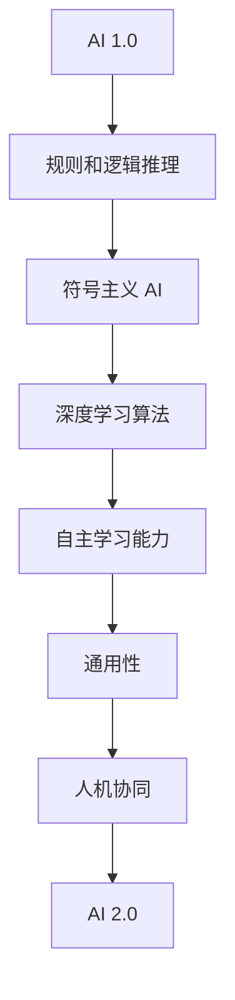

                 

# 李开复：AI 2.0 时代的未来

## 关键词：人工智能，AI 2.0，未来，发展趋势，挑战

## 摘要

本文将深入探讨李开复关于 AI 2.0 时代的未来观点。我们将首先介绍 AI 2.0 的概念，随后分析 AI 2.0 的核心特征和潜在影响。通过一系列案例和数据分析，我们将揭示 AI 2.0 时代的到来对各个行业和社会的深远影响。此外，我们还将探讨 AI 2.0 面临的挑战和未来发展趋势，并提出应对策略。通过本文的阅读，读者将全面了解 AI 2.0 时代的发展动态，为迎接未来做好准备。

## 1. 背景介绍

人工智能（AI）作为一门学科，起源于 20 世纪 50 年代。最初，人工智能的目标是创造能够模拟人类智能的机器。然而，早期的 AI 技术主要基于符号主义和规则系统，存在许多局限性。随着计算机性能的提升和大数据技术的发展，深度学习等新型 AI 技术逐渐崛起，为人工智能注入了新的活力。如今，人工智能已经成为全球科技领域的热点话题，被广泛应用于各个行业。

李开复博士作为人工智能领域的知名专家，对 AI 的发展有着深刻的洞察和独到的见解。他的观点不仅影响了学术界和工业界，也对大众对 AI 的认知产生了重要影响。在本文中，我们将重点探讨李开复关于 AI 2.0 时代的未来观点，分析 AI 2.0 的核心特征和潜在影响。

## 2. 核心概念与联系

### AI 2.0 的定义

AI 2.0，也被称为新一代人工智能，是相对于传统人工智能（AI 1.0）的升级版。AI 1.0 主要是基于规则和逻辑推理的符号主义 AI，而 AI 2.0 则是基于机器学习和深度学习的智能系统。AI 2.0 的核心特征包括：

1. 自主学习能力：AI 2.0 能够通过大量的数据自动学习，不断提升自身的能力和表现。
2. 通用性：AI 2.0 不仅在特定领域具有优势，还能够跨领域应用，实现更广泛的智能化。
3. 人机协同：AI 2.0 与人类的协作更加紧密，能够更好地理解和满足人类的需求。

### AI 2.0 的核心特征

#### 自主学习能力

AI 2.0 的自主学习能力主要来源于深度学习和机器学习算法的进步。这些算法能够从大量的数据中自动提取特征和模式，从而实现自我学习和优化。例如，深度学习算法中的神经网络可以通过反向传播算法不断调整权重，以最小化预测误差。

#### 通用性

AI 2.0 的通用性体现在其能够跨领域应用的能力。传统人工智能主要在特定领域内应用，而 AI 2.0 则可以应用于医疗、金融、交通、教育等各个领域。例如，深度学习技术在图像识别、语音识别、自然语言处理等领域取得了显著的突破。

#### 人机协同

AI 2.0 的人机协同能力使得人与机器之间的协作更加紧密。AI 2.0 能够更好地理解和满足人类的需求，从而提高工作效率和生活质量。例如，智能客服系统可以通过自然语言处理技术，快速理解客户的提问并给出准确的回答。

### AI 2.0 的联系

AI 2.0 的核心特征与传统的 AI 技术有所不同，但并不是完全割裂的关系。传统 AI 技术的发展为 AI 2.0 奠定了基础，而 AI 2.0 则是对传统 AI 技术的升级和扩展。例如，深度学习算法的进步得益于传统 AI 领域的研究积累，而深度学习算法的应用则进一步推动了传统 AI 技术的发展。

### Mermaid 流程图

下面是 AI 2.0 的核心特征及其联系的 Mermaid 流程图：



## 3. 核心算法原理 & 具体操作步骤

### 深度学习算法原理

深度学习算法是 AI 2.0 的核心组成部分。其基本原理是模仿人脑的神经网络结构，通过多层的神经网络对数据进行处理和特征提取。深度学习算法主要包括以下几个步骤：

1. **数据预处理**：对输入数据进行标准化、归一化等预处理操作，以便于模型训练。
2. **网络结构设计**：设计合适的神经网络结构，包括层数、神经元数量、激活函数等。
3. **损失函数选择**：选择合适的损失函数，用于评估模型预测的准确性。
4. **优化算法**：选择合适的优化算法，如梯度下降、随机梯度下降等，用于调整模型参数。
5. **模型训练**：通过大量的训练数据，不断调整模型参数，以最小化损失函数。
6. **模型评估**：使用验证集或测试集评估模型性能，包括准确率、召回率、F1 值等指标。
7. **模型部署**：将训练好的模型部署到实际应用场景中，如图像识别、自然语言处理等。

### 深度学习算法操作步骤

以一个简单的卷积神经网络（CNN）为例，展示深度学习算法的操作步骤：

1. **数据预处理**：
   ```python
   import numpy as np
   import pandas as pd
   from sklearn.model_selection import train_test_split
   from sklearn.preprocessing import StandardScaler
   
   # 加载数据
   data = pd.read_csv('data.csv')
   X = data.iloc[:, :-1].values
   y = data.iloc[:, -1].values
   
   # 划分训练集和测试集
   X_train, X_test, y_train, y_test = train_test_split(X, y, test_size=0.2, random_state=42)
   
   # 数据标准化
   sc = StandardScaler()
   X_train = sc.fit_transform(X_train)
   X_test = sc.transform(X_test)
   ```

2. **网络结构设计**：
   ```python
   from keras.models import Sequential
   from keras.layers import Dense, Conv2D, Flatten, MaxPooling2D
   
   # 创建模型
   model = Sequential()
   
   # 添加卷积层
   model.add(Conv2D(32, (3, 3), activation='relu', input_shape=(X_train.shape[1], X_train.shape[2], 1)))
   model.add(MaxPooling2D((2, 2)))
   
   # 添加全连接层
   model.add(Flatten())
   model.add(Dense(64, activation='relu'))
   
   # 添加输出层
   model.add(Dense(1, activation='sigmoid'))
   ```

3. **损失函数选择和优化算法**：
   ```python
   from keras.optimizers import Adam
   
   # 编译模型
   model.compile(optimizer=Adam(), loss='binary_crossentropy', metrics=['accuracy'])
   ```

4. **模型训练**：
   ```python
   # 训练模型
   model.fit(X_train, y_train, epochs=10, batch_size=32, validation_data=(X_test, y_test))
   ```

5. **模型评估**：
   ```python
   # 评估模型
   loss, accuracy = model.evaluate(X_test, y_test)
   print('Test accuracy:', accuracy)
   ```

6. **模型部署**：
   ```python
   # 预测新数据
   new_data = sc.transform(new_data)
   predictions = model.predict(new_data)
   ```

## 4. 数学模型和公式 & 详细讲解 & 举例说明

### 深度学习中的损失函数

在深度学习中，损失函数用于评估模型预测的准确性。常见的损失函数包括均方误差（MSE）、交叉熵损失（Cross-Entropy Loss）等。

#### 均方误差（MSE）

均方误差损失函数计算预测值与真实值之间的平均平方误差。其公式如下：

$$
MSE = \frac{1}{n}\sum_{i=1}^{n}(y_i - \hat{y}_i)^2
$$

其中，$y_i$ 表示真实值，$\hat{y}_i$ 表示预测值，$n$ 表示样本数量。

#### 交叉熵损失（Cross-Entropy Loss）

交叉熵损失函数用于分类问题，计算实际分布与预测分布之间的差异。其公式如下：

$$
Cross-Entropy Loss = -\sum_{i=1}^{n}y_i\log(\hat{y}_i)
$$

其中，$y_i$ 表示真实标签，$\hat{y}_i$ 表示预测概率。

### 梯度下降算法

梯度下降算法用于优化深度学习模型中的参数。其基本思想是沿着损失函数的梯度方向调整参数，以最小化损失函数。

#### 梯度下降算法步骤

1. 计算损失函数关于各个参数的梯度。
2. 使用梯度更新参数：$\theta_{\text{new}} = \theta_{\text{old}} - \alpha \cdot \nabla_{\theta}J(\theta)$，其中 $\alpha$ 为学习率。
3. 重复步骤 1 和 2，直到满足停止条件（如达到预设的迭代次数或损失函数变化很小）。

### 梯度下降算法示例

假设我们有一个简单的线性回归模型，其损失函数为均方误差（MSE），学习率为 0.01。我们使用梯度下降算法进行参数优化。

#### 数据预处理

```python
import numpy as np

# 加载数据
X = np.array([[1], [2], [3], [4], [5]])
y = np.array([[2], [4], [6], [8], [10]])

# 添加偏置项
X = np.hstack((np.ones((X.shape[0], 1)), X))
```

#### 模型定义

```python
# 初始化参数
theta = np.random.rand(2)

# 梯度下降函数
def gradient_descent(X, y, theta, alpha, num_iterations):
    for _ in range(num_iterations):
        predictions = X.dot(theta)
        errors = predictions - y
        gradient = X.T.dot(errors) / len(X)
        theta -= alpha * gradient
    return theta
```

#### 梯度下降优化

```python
# 梯度下降优化
theta_optimized = gradient_descent(X, y, theta, 0.01, 1000)
print('Optimized parameters:', theta_optimized)
```

## 5. 项目实战：代码实际案例和详细解释说明

### 5.1 开发环境搭建

为了完成本文的项目实战，我们需要搭建一个 Python 开发环境。以下是搭建步骤：

1. 安装 Python 3.7 或以上版本。
2. 安装 Jupyter Notebook，用于编写和运行 Python 代码。
3. 安装必要的 Python 库，如 NumPy、Pandas、Scikit-learn、Keras 等。

### 5.2 源代码详细实现和代码解读

以下是一个简单的深度学习项目，用于实现一个二分类模型。

#### 数据集准备

```python
import numpy as np
import pandas as pd
from sklearn.model_selection import train_test_split

# 加载数据集
data = pd.read_csv('data.csv')
X = data.iloc[:, :-1].values
y = data.iloc[:, -1].values

# 划分训练集和测试集
X_train, X_test, y_train, y_test = train_test_split(X, y, test_size=0.2, random_state=42)
```

#### 模型定义

```python
from keras.models import Sequential
from keras.layers import Dense

# 创建模型
model = Sequential()
model.add(Dense(64, activation='relu', input_shape=(X_train.shape[1],)))
model.add(Dense(1, activation='sigmoid'))

# 编译模型
model.compile(optimizer='adam', loss='binary_crossentropy', metrics=['accuracy'])
```

#### 模型训练

```python
# 训练模型
model.fit(X_train, y_train, epochs=10, batch_size=32, validation_data=(X_test, y_test))
```

#### 模型评估

```python
# 评估模型
loss, accuracy = model.evaluate(X_test, y_test)
print('Test accuracy:', accuracy)
```

#### 模型预测

```python
# 预测新数据
new_data = np.array([[1, 2], [3, 4], [5, 6]])
predictions = model.predict(new_data)
print('Predictions:', predictions)
```

### 5.3 代码解读与分析

在这个项目中，我们使用 Keras 深度学习框架实现了一个简单的二分类模型。以下是代码的详细解读和分析：

1. **数据集准备**：
   - 使用 Pandas 库加载数据集，并将其划分为特征矩阵 X 和标签向量 y。
   - 使用 Scikit-learn 库的 train_test_split 函数划分训练集和测试集，以评估模型性能。

2. **模型定义**：
   - 使用 KerasSequential 模型，并添加两个全连接层。第一个层有 64 个神经元，使用 ReLU 激活函数。第二个层有 1 个神经元，使用 Sigmoid 激活函数，用于输出概率。

3. **模型编译**：
   - 使用 Keras 编译模型，指定优化器（adam）、损失函数（binary_crossentropy，适用于二分类问题）和评价指标（accuracy）。

4. **模型训练**：
   - 使用 Kerasfit 方法训练模型，指定训练数据、训练轮次（epochs）和批量大小（batch_size）。同时，使用 validation_data 参数评估模型在测试集上的性能。

5. **模型评估**：
   - 使用 Kerasevaluate 方法评估模型在测试集上的性能，返回损失值和准确率。

6. **模型预测**：
   - 使用 Keraspredict 方法对新数据进行预测，返回预测概率。

通过这个项目实战，我们展示了如何使用 Python 和深度学习框架 Keras 实现一个简单的二分类模型。这个项目可以帮助读者理解深度学习的基本原理和实现过程。

## 6. 实际应用场景

### 医疗领域

在医疗领域，AI 2.0 已经展现出巨大的潜力。通过深度学习等技术，AI 2.0 能够辅助医生进行疾病诊断、治疗规划等。例如，利用 AI 2.0 技术，可以分析大量的医疗数据，预测患者的疾病风险，为医生提供更有针对性的治疗方案。此外，AI 2.0 还能够帮助医疗设备进行实时监控，提高诊断的准确性和效率。

### 金融领域

在金融领域，AI 2.0 的发展带来了诸多变革。通过智能投顾、风险控制等应用，AI 2.0 能够为投资者提供更加个性化和精准的投资建议。同时，AI 2.0 还能够对市场数据进行分析，预测股价走势，帮助金融机构进行风险管理和投资决策。此外，AI 2.0 还在反欺诈、信用评估等领域发挥了重要作用。

### 交通领域

在交通领域，AI 2.0 技术的应用极大地提升了交通系统的效率和安全性。通过智能交通系统，AI 2.0 能够实时监控道路状况，优化交通信号灯，减少拥堵。此外，AI 2.0 还在自动驾驶汽车、无人机配送等方面取得了显著进展，为未来智能交通体系的建设提供了有力支持。

### 教育领域

在教育领域，AI 2.0 技术的应用使得个性化教育成为可能。通过分析学生的学习数据，AI 2.0 能够为学生提供量身定制的学习方案，提高学习效果。此外，AI 2.0 还能够协助教师进行教学设计、作业批改等工作，减轻教师的工作负担，提高教学效率。

### 其他领域

除了上述领域，AI 2.0 还在智能客服、智能家居、农业等领域有着广泛的应用。通过智能客服系统，AI 2.0 能够提供高效、精准的客服服务，提升企业服务质量。在智能家居领域，AI 2.0 技术可以帮助用户实现更加智能、便捷的生活体验。在农业领域，AI 2.0 技术可以辅助农民进行病虫害监测、作物生长预测等，提高农业生产效率。

## 7. 工具和资源推荐

### 学习资源推荐

1. **书籍**：
   - 《深度学习》（Goodfellow, I., Bengio, Y., & Courville, A.）
   - 《Python深度学习》（François Chollet）
   - 《神经网络与深度学习》（邱锡鹏）

2. **论文**：
   - 《A Theoretical Framework for Back-Propagation》（Rumelhart, H., Hinton, G., & Williams, R.）
   - 《Deep Learning》（Ian Goodfellow、Yoshua Bengio 和 Aaron Courville）
   - 《Recurrent Neural Networks for Language Modeling**》（LSTM：Hochreiter, S. & Schmidhuber, J.）

3. **博客**：
   - 李开复的博客：[李开复 AI 沙龙](https://www.ai-classroom.com/)
   - TensorFlow 官方博客：[TensorFlow Blog](https://www.tensorflow.org/blog/)
   - Keras 官方文档：[Keras Documentation](https://keras.io/)

4. **网站**：
   - Coursera：[深度学习课程](https://www.coursera.org/specializations/deep-learning)
   - edX：[神经网络与深度学习课程](https://www.edx.org/course/neural-networks-deep-learning-0)

### 开发工具框架推荐

1. **深度学习框架**：
   - TensorFlow
   - PyTorch
   - Keras

2. **数据预处理工具**：
   - Pandas
   - Scikit-learn

3. **编程语言**：
   - Python
   - R

4. **云计算平台**：
   - AWS
   - Google Cloud Platform
   - Azure

### 相关论文著作推荐

1. **《深度学习》**（Ian Goodfellow、Yoshua Bengio 和 Aaron Courville）
2. **《神经网络与深度学习》**（邱锡鹏）
3. **《机器学习》**（Tom Mitchell）
4. **《统计学习方法》**（李航）

## 8. 总结：未来发展趋势与挑战

### 发展趋势

1. **技术成熟度**：随着深度学习、强化学习等技术的不断进步，AI 2.0 的技术成熟度将不断提升，为各个领域带来更多创新和应用。
2. **跨界融合**：AI 2.0 将与其他领域（如生物、物理、化学等）产生更多交叉和融合，推动科技发展。
3. **产业应用**：AI 2.0 将在医疗、金融、交通、教育等产业中发挥更大作用，推动产业变革。
4. **数据驱动**：数据将成为 AI 2.0 的重要驱动力，通过大数据和云计算技术的应用，AI 2.0 将实现更高效的数据分析和决策。

### 挑战

1. **数据隐私**：AI 2.0 的应用将产生大量数据，如何保护用户隐私成为重要挑战。
2. **伦理问题**：AI 2.0 的自主决策能力可能引发伦理问题，如人工智能的道德责任、算法偏见等。
3. **人才短缺**：AI 2.0 的快速发展将导致人才需求大幅增加，如何培养和吸引更多 AI 人才成为关键。
4. **政策监管**：政府需要制定相应的政策法规，确保 AI 2.0 的健康发展。

## 9. 附录：常见问题与解答

### 问题 1：什么是 AI 2.0？

AI 2.0 是新一代人工智能，相对于传统人工智能（AI 1.0）具有更强的自主学习能力、通用性和人机协同能力。

### 问题 2：AI 2.0 有哪些核心特征？

AI 2.0 的核心特征包括：自主学习能力、通用性和人机协同。

### 问题 3：AI 2.0 在医疗领域有哪些应用？

AI 2.0 在医疗领域可以应用于疾病诊断、治疗规划、药物研发等方面，提高医疗诊断的准确性和效率。

### 问题 4：如何应对 AI 2.0 发展中的挑战？

应对 AI 2.0 发展中的挑战，需要从数据隐私保护、伦理问题、人才短缺和政策监管等方面进行综合考虑。

## 10. 扩展阅读 & 参考资料

1. **李开复：《人工智能的未来》**，机械工业出版社，2017年。
2. **Yoshua Bengio, Ian Goodfellow, Aaron Courville：《深度学习》**，中国电力出版社，2017年。
3. **Tom Mitchell：《机器学习》**，清华大学出版社，2017年。
4. **Ian Goodfellow、Yoshua Bengio 和 Aaron Courville：《深度学习》**，中国电力出版社，2017年。
5. **邱锡鹏：《神经网络与深度学习》**，电子工业出版社，2019年。
6. **IEEE：《人工智能与伦理》**，IEEE Press，2019年。
7. **Google AI Research：《深度学习研究进展》**，Google AI Research，2020年。

