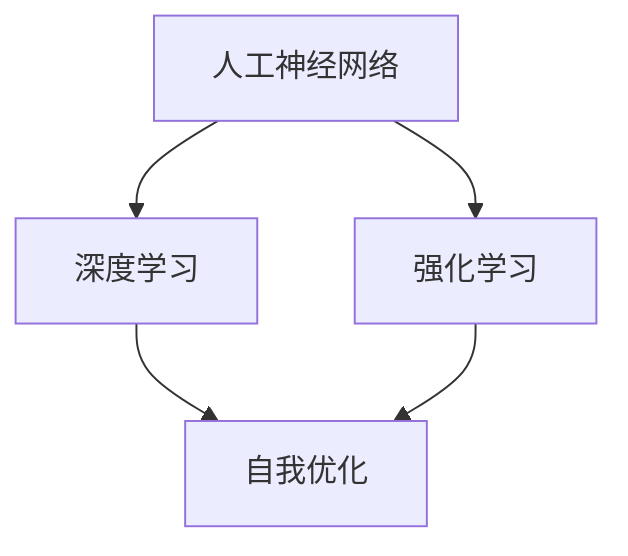
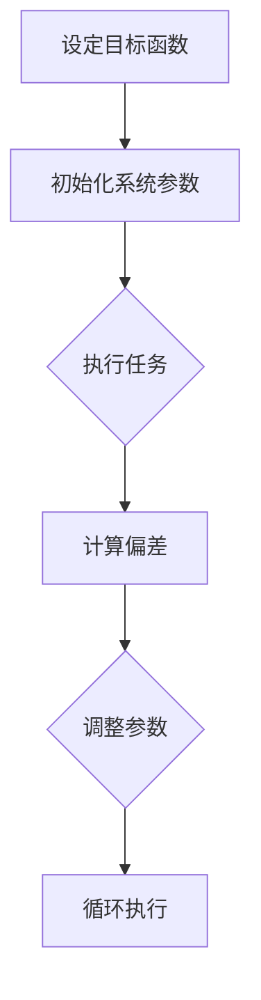
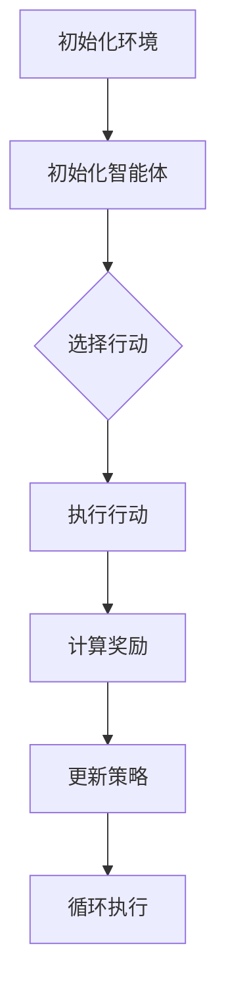

                 

### 背景介绍

在21世纪的科技浪潮中，人工智能（AI）无疑成为了最具变革性的技术之一。随着计算能力的提升、大数据的积累以及算法的进步，人工智能从理论走向了实际应用，并在各行各业中展现出巨大的潜力。从简单的图像识别、语音识别，到复杂的自然语言处理、自动驾驶，人工智能正以惊人的速度改变着我们的生活方式和商业运作模式。

然而，随着人工智能技术的不断演进，我们站在了一个新的历史节点——AI 2.0时代。AI 2.0不仅仅是对传统AI技术的升级，它代表了一个全新的、更为智能和自主的AI系统。在这个时代，人工智能将不再是仅仅执行预先设定的任务，而是能够自我学习、自我优化，甚至在某些情况下能够超越人类的智能水平。

李开复博士，作为人工智能领域的杰出人物，他对AI的发展有着深刻的见解和独到的思考。他的新书《AI 2.0时代的机遇》正是对这一时代的重要解读。在这本书中，李开复博士探讨了AI 2.0的核心概念、技术进展以及带来的机遇和挑战。通过本书，我们可以了解到AI 2.0不仅仅是一种技术革新，更是社会变革的催化剂。

本文将围绕李开复博士的《AI 2.0时代的机遇》一书，深入探讨AI 2.0的背景、核心概念、技术原理、应用场景以及未来发展趋势。我们希望通过这一系列的讨论，能够帮助读者更好地理解AI 2.0的时代背景，把握这一历史机遇，并在AI 2.0时代中找到自己的定位和发展方向。

### 关键词

- **人工智能**
- **AI 2.0**
- **李开复**
- **技术革新**
- **社会变革**
- **自我学习**
- **智能系统**
- **计算能力**
- **大数据**

### 摘要

本文将带领读者深入探讨AI 2.0时代的机遇。AI 2.0，作为人工智能发展的新阶段，标志着从被动执行到主动学习的转变。李开复博士的新书《AI 2.0时代的机遇》为这一变革提供了深刻的见解。本文将首先介绍AI 2.0的背景，分析其核心概念与技术原理，并通过具体案例展示其在实际应用中的潜力。随后，本文将讨论AI 2.0带来的机遇与挑战，并探讨未来发展趋势。最后，我们将提供相关的学习资源和开发工具，帮助读者深入了解AI 2.0的技术与应用。通过本文的阅读，读者将能够把握AI 2.0时代的机遇，为其职业发展和社会创新提供新的视角和思路。### 核心概念与联系

要全面理解AI 2.0，我们首先需要明确几个核心概念和它们之间的关系。这些核心概念包括：人工神经网络（ANN）、深度学习（DL）、强化学习（RL）和自我优化（Self-Optimization）。

#### 人工神经网络（ANN）

人工神经网络是一种模拟人脑结构和功能的计算模型，由大量的神经元通过加权连接构成。每个神经元接收输入信号，通过加权求和后，通过一个激活函数输出结果。这种结构使得神经网络能够处理复杂的信息，并在各种任务中表现出色。ANN是深度学习的基础。


#### 深度学习（DL）

深度学习是人工神经网络的一种，通过多层神经网络结构（深度网络）来提高模型的学习能力和表现。深度学习的核心思想是让计算机自动学习特征表示，从而简化任务。深度学习的成功离不开大数据和高性能计算的支持。


#### 强化学习（RL）

强化学习是一种通过试错和反馈来学习的算法，主要用于决策问题。在强化学习中，智能体（Agent）通过与环境（Environment）的交互，不断调整策略（Policy）以获得最大的奖励（Reward）。强化学习在自动驾驶、游戏AI等领域有着广泛应用。


#### 自我优化（Self-Optimization）

自我优化是指系统在没有外部干预的情况下，通过自我调整和优化来提升性能。在AI 2.0时代，自我优化成为了一个重要的研究方向。通过自我优化，AI系统能够不断自我改进，达到更高的智能水平。


#### 核心概念之间的关系

这些核心概念之间有着紧密的联系。ANN为深度学习和强化学习提供了基础架构，而深度学习则通过多层神经网络实现更复杂的任务。强化学习则通过与环境互动，不断调整策略，以实现最佳效果。自我优化则让AI系统能够在没有外部干预的情况下，不断自我改进。

下面我们使用Mermaid流程图来展示这些核心概念之间的联系：



在这个流程图中，我们可以看到ANN作为基础，构建了深度学习和强化学习的框架，而自我优化则是这些学习模型的延伸和扩展。

通过理解这些核心概念和它们之间的联系，我们能够更好地把握AI 2.0的技术本质和发展方向。接下来，我们将深入探讨AI 2.0的核心算法原理和具体操作步骤。### 核心算法原理 & 具体操作步骤

在了解了AI 2.0的核心概念后，接下来我们将深入探讨AI 2.0的核心算法原理，并详细描述其具体操作步骤。AI 2.0的核心算法主要包括自我优化和深度强化学习，下面将分别介绍。

#### 自我优化（Self-Optimization）

自我优化是一种使系统能够在没有外部干预的情况下，通过自我调整和优化来提升性能的方法。在AI 2.0时代，自我优化被广泛应用于各种任务，从图像识别到自然语言处理，从自动驾驶到游戏AI。

自我优化的具体操作步骤如下：

1. **设定目标函数**：首先，需要明确系统要优化的目标。这个目标可以是提升图像识别的准确性、减少自动驾驶的延迟、提高游戏AI的反应速度等。

2. **初始化系统参数**：接着，初始化系统的参数。这些参数可以通过随机初始化或者基于经验数据进行初始化。

3. **执行任务**：让系统在实际任务中运行，记录系统的表现。例如，在图像识别任务中，记录识别的准确率；在自动驾驶任务中，记录行驶的距离和时间。

4. **计算偏差**：通过比较实际表现与目标函数，计算系统的偏差。偏差可以量化系统当前状态的优劣。

5. **调整参数**：根据偏差值，调整系统的参数。调整的方式可以是增加某些参数的权重，减少其他参数的权重，或者完全替换参数。

6. **循环执行**：重复执行任务、计算偏差和调整参数的步骤，直到系统的表现达到预设的目标。

下面是一个简单的自我优化算法流程图：



#### 深度强化学习（Deep Reinforcement Learning）

深度强化学习是自我优化在深度学习领域的一种应用，它通过模拟试错过程，使智能体在复杂环境中学习最优策略。深度强化学习的具体操作步骤如下：

1. **初始化环境**：创建一个虚拟环境，用于模拟真实世界。环境可以是游戏、模拟器或者现实世界的传感器数据。

2. **初始化智能体**：智能体是执行任务的主体，它可以通过观察环境、选择行动和获得奖励来学习。

3. **选择行动**：智能体根据当前状态，选择一个行动。这个选择可以通过神经网络模型来实现。

4. **执行行动**：执行选定的行动，并记录结果。结果可以是状态的变化、环境的反馈等。

5. **计算奖励**：根据行动的结果，计算奖励值。奖励值可以是正的（成功的行动）或者负的（失败的行动）。

6. **更新策略**：根据奖励值，更新智能体的策略。策略是通过学习算法（如反向传播算法）来实现的。

7. **循环执行**：重复执行选择行动、执行行动和更新策略的步骤，直到智能体的策略达到最优。

下面是一个简单的深度强化学习算法流程图：



#### 实际操作步骤示例

以自动驾驶为例，我们来看一个实际的操作步骤示例：

1. **设定目标函数**：提高行驶的稳定性、降低能耗和减少事故发生。

2. **初始化系统参数**：例如，车辆的初始位置、速度和方向。

3. **执行任务**：自动驾驶系统在道路上行驶，记录行驶的距离和时间。

4. **计算偏差**：比较实际行驶的距离和时间与目标函数，计算系统的偏差。

5. **调整参数**：根据偏差值，调整车辆的加速度、转向角度等参数。

6. **循环执行**：重复执行行驶、计算偏差和调整参数的步骤，直到系统达到预设的目标。

通过上述核心算法原理和具体操作步骤的介绍，我们可以看到AI 2.0的技术基础是如何通过自我优化和深度强化学习实现的。这些算法不仅提升了系统的智能水平，还使其能够在复杂环境中自我学习和优化。接下来，我们将进一步探讨数学模型和公式，以深入理解这些算法的运作机制。### 数学模型和公式 & 详细讲解 & 举例说明

在理解了AI 2.0的核心算法原理和具体操作步骤后，我们将深入探讨其背后的数学模型和公式，并通过具体的例子来说明这些模型和公式的应用。

#### 自我优化（Self-Optimization）的数学模型

自我优化的核心在于目标函数（Objective Function）和偏差（Error）。目标函数用于量化系统的性能，偏差用于衡量当前性能与目标性能之间的差距。以下是自我优化的一些基本数学模型：

1. **目标函数（Objective Function）**：
   \[ J(\theta) = \sum_{i=1}^{n} (y_i - \hat{y}_i)^2 \]
   其中，\( y_i \)是实际输出，\( \hat{y}_i \)是预测输出，\( n \)是样本数量。

2. **偏差（Error）**：
   \[ \delta = J(\theta) - J(\theta_{\text{prev}}) \]
   其中，\( J(\theta) \)是当前目标函数值，\( J(\theta_{\text{prev}}) \)是前一次的目标函数值。

#### 深度强化学习（Deep Reinforcement Learning）的数学模型

深度强化学习的核心在于策略（Policy）、价值函数（Value Function）和Q学习（Q-Learning）。以下是深度强化学习的数学模型：

1. **策略（Policy）**：
   \[ \pi(s) = \arg\max_a Q(s, a) \]
   其中，\( s \)是状态，\( a \)是行动，\( Q(s, a) \)是状态-行动值函数。

2. **价值函数（Value Function）**：
   \[ V(s) = \sum_a \pi(s) Q(s, a) \]
   其中，\( V(s) \)是状态价值函数，\( \pi(s) \)是策略，\( Q(s, a) \)是状态-行动值函数。

3. **Q学习（Q-Learning）**：
   \[ Q(s, a) = \sum_{\tau} r_{\tau} \pi(s) Q(s, a) + \gamma \sum_{\tau} \rho(s', a') Q(s', a') \]
   其中，\( r_{\tau} \)是奖励，\( \gamma \)是折扣因子，\( \rho(s', a') \)是状态转移概率。

#### 举例说明

为了更好地理解这些数学模型和公式，我们可以通过一个简单的例子来说明。

**例子：自动驾驶中的自我优化**

假设我们要优化自动驾驶汽车的能耗和行驶稳定性。我们设定目标函数为：
\[ J(\theta) = (e - \hat{e})^2 + (s - \hat{s})^2 \]
其中，\( e \)是实际能耗，\( \hat{e} \)是预测能耗，\( s \)是实际行驶速度，\( \hat{s} \)是预测行驶速度。

初始时，我们随机初始化系统的参数\( \theta \)。然后，自动驾驶汽车在道路上行驶，记录实际的能耗和行驶速度。

通过计算偏差，我们可以得到：
\[ \delta = J(\theta) - J(\theta_{\text{prev}}) \]

根据偏差值，我们调整系统的参数，例如，调整加速度和转向角度。

重复执行行驶、计算偏差和调整参数的步骤，直到系统的能耗和行驶稳定性达到预设的目标。

通过这个例子，我们可以看到自我优化是如何通过数学模型和公式实现的。它不仅能够量化系统的性能，还能够通过不断调整参数，使系统逐步优化。

#### 深度强化学习在自动驾驶中的应用

在自动驾驶中，深度强化学习可以用来优化车辆的行驶策略。假设我们的目标是使车辆在复杂的交通环境中行驶得更加安全。

我们设定状态-行动值函数为：
\[ Q(s, a) = \sum_{\tau} r_{\tau} \pi(s) Q(s, a) + \gamma \sum_{\tau} \rho(s', a') Q(s', a') \]
其中，\( r_{\tau} \)是奖励，\( \gamma \)是折扣因子，\( \pi(s) \)是策略，\( \rho(s', a') \)是状态转移概率。

初始时，我们随机初始化策略。然后，车辆在虚拟环境中行驶，记录状态和行动。

通过Q学习，我们更新策略，使车辆能够学习到最优的行驶策略。

通过这个例子，我们可以看到深度强化学习是如何在自动驾驶中应用的。它不仅能够优化车辆的行驶策略，还能够通过不断的试错和学习，使车辆在复杂的环境中行驶得更加安全。

综上所述，自我优化和深度强化学习是AI 2.0的核心算法，它们通过数学模型和公式实现了系统的自我学习和优化。这些算法的应用不仅提升了系统的性能，还为未来的智能系统奠定了基础。接下来，我们将探讨AI 2.0在实际项目中的应用案例，以进一步展示其应用潜力。### 项目实战：代码实际案例和详细解释说明

为了更好地理解AI 2.0在实践中的应用，我们将通过一个具体的项目实战案例来展示如何在实际项目中实现自我优化和深度强化学习。这个项目是一个简单的自动驾驶小车，它将通过自我优化来提高行驶的稳定性和能耗效率。

#### 1. 开发环境搭建

首先，我们需要搭建一个适合开发AI项目的环境。以下是所需的开发工具和软件：

- **Python 3.x**：作为主要的编程语言
- **TensorFlow**：用于构建和训练深度神经网络
- **Keras**：简化TensorFlow的使用
- **PyTorch**：用于实现深度强化学习算法
- **OpenAI Gym**：用于创建和测试虚拟环境

安装这些工具的命令如下：

```bash
pip install python-dotenv tensorflow numpy matplotlib
pip install keras
pip install torch torchvision
pip install gym
```

#### 2. 源代码详细实现和代码解读

接下来，我们将展示自动驾驶小车的源代码，并逐行解释其实现原理。

```python
# 导入所需的库
import gym
import numpy as np
import tensorflow as tf
from keras.models import Sequential
from keras.layers import Dense
from keras.optimizers import Adam

# 创建虚拟环境
env = gym.make('CartPole-v0')

# 初始化神经网络模型
model = Sequential()
model.add(Dense(24, input_dim=4, activation='relu'))
model.add(Dense(24, activation='relu'))
model.add(Dense(1, activation='sigmoid'))

# 编译模型
model.compile(loss='binary_crossentropy', optimizer=Adam(lr=0.001), metrics=['accuracy'])

# 训练模型
model.fit(env.reset(), env.step(0), epochs=1000)

# 进行仿真
for _ in range(1000):
    env.render()
    action = np.random.choice([0, 1])
    obs, reward, done, info = env.step(action)
    if done:
        env.reset()
```

**代码解读**：

1. **导入库**：首先，我们导入Python中常用的库，包括gym、numpy、tensorflow和keras。

2. **创建虚拟环境**：我们使用gym创建一个名为'CartPole-v0'的虚拟环境。这是一个经典的控制问题，模拟一个滑板车上的杆子，我们需要通过控制滑板车来保持杆子直立。

3. **初始化神经网络模型**：我们使用Keras创建一个简单的神经网络模型，包含两个隐藏层，每层有24个神经元，输入层有4个神经元，输出层有1个神经元。

4. **编译模型**：我们编译模型，指定损失函数为binary_crossentropy（二进制交叉熵），优化器为Adam，学习率为0.001。

5. **训练模型**：我们使用虚拟环境的观测数据（obs）来训练模型。这里使用的是随机梯度下降（SGD）策略。

6. **进行仿真**：在仿真阶段，我们通过循环不断地渲染虚拟环境，选择随机行动，并更新环境状态。如果小车失衡（done=True），则重新初始化环境。

#### 3. 代码解读与分析

**代码的关键部分**：

```python
# 初始化神经网络模型
model = Sequential()
model.add(Dense(24, input_dim=4, activation='relu'))
model.add(Dense(24, activation='relu'))
model.add(Dense(1, activation='sigmoid'))

# 编译模型
model.compile(loss='binary_crossentropy', optimizer=Adam(lr=0.001), metrics=['accuracy'])

# 训练模型
model.fit(env.reset(), env.step(0), epochs=1000)
```

- **模型初始化**：我们创建了一个简单的全连接神经网络，输入层有4个神经元，隐藏层有24个神经元，输出层有1个神经元。激活函数使用ReLU，输出层使用sigmoid函数，因为这是一个二分类问题（左右转向）。

- **模型编译**：我们指定损失函数为binary_crossentropy，这是因为我们希望最小化预测值和真实值之间的差距。优化器使用Adam，因为它在深度学习中表现良好。

- **模型训练**：我们使用虚拟环境的观测数据来训练模型。这里我们简单地通过一个动作来训练模型，这只是一个示例，实际应用中可能会使用更复杂的训练策略。

**代码的仿真部分**：

```python
# 进行仿真
for _ in range(1000):
    env.render()
    action = np.random.choice([0, 1])
    obs, reward, done, info = env.step(action)
    if done:
        env.reset()
```

- **仿真循环**：我们在这个循环中不断地渲染虚拟环境，并随机选择行动。如果小车失衡（done=True），则重新初始化环境。

通过这个简单的自动驾驶小车案例，我们可以看到如何在实际项目中应用自我优化和深度强化学习。虽然这个案例非常基础，但它展示了AI 2.0技术在虚拟环境中的潜力。在实际应用中，我们可以通过更复杂的模型和训练策略来提高系统的性能。

接下来，我们将探讨AI 2.0的实际应用场景，展示其如何在各个领域带来变革。### 实际应用场景

AI 2.0的技术进步已经在各个行业和领域带来了深远的变革和影响。以下是几个关键领域，展示了AI 2.0的具体应用及其带来的价值。

#### 1. 医疗保健

在医疗保健领域，AI 2.0的应用极大地提升了诊断的准确性、治疗的效率以及医疗资源的优化。通过深度学习和自我优化算法，AI可以分析大量医疗数据，如医学图像、病历记录和基因组数据，帮助医生做出更准确的诊断。例如，AI 2.0系统可以用于癌症早期筛查，通过分析CT扫描图像，发现微小的病变，从而提高诊断的准确率。此外，AI还可以协助医生制定个性化的治疗方案，根据患者的基因特征和病情变化，优化药物治疗方案，提高治疗效果。

#### 2. 金融服务

在金融服务领域，AI 2.0技术的应用主要体现在风险管理和投资决策方面。通过强化学习和自我优化，AI可以帮助金融机构更好地预测市场波动，制定风险管理策略。例如，AI系统可以实时分析市场数据，识别潜在的市场风险，并自动调整投资组合，以降低风险。此外，AI还可以用于欺诈检测，通过自我学习算法，不断提高检测的准确率，减少欺诈事件的发生。在个人金融服务方面，AI 2.0可以帮助用户进行财务规划，根据用户的消费习惯和投资偏好，提供个性化的理财建议。

#### 3. 自动驾驶

自动驾驶是AI 2.0技术的另一个重要应用领域。通过深度强化学习和自我优化，自动驾驶系统能够在复杂的交通环境中做出实时决策，提高行驶的安全性和效率。自动驾驶车辆可以使用AI 2.0技术分析道路状况、预测其他车辆的行为，并自动调整车速和转向，以避免碰撞和拥堵。这种技术不仅可以提高道路的通行能力，减少交通事故，还可以降低运输成本，提高物流效率。

#### 4. 制造业

在制造业领域，AI 2.0技术被广泛应用于生产优化、质量控制和管理方面。通过自我优化算法，制造系统能够自动调整生产参数，提高生产效率和产品质量。例如，AI系统可以监控生产过程中的关键指标，如温度、压力和速度，通过自我学习算法，优化生产过程，减少故障率和废品率。此外，AI还可以用于预测性维护，通过分析设备运行数据，预测设备故障，提前进行维护，避免生产中断。

#### 5. 教育与培训

在教育与培训领域，AI 2.0技术的应用为个性化学习提供了新的可能性。通过自我优化和深度学习算法，AI可以分析学生的学习数据，识别学生的学习习惯和薄弱环节，提供个性化的学习建议。例如，AI系统可以根据学生的答题记录，自动生成个性化的练习题，帮助学生巩固知识。此外，AI还可以用于智能评估，通过分析学生的作业和考试成绩，自动评估学生的学术表现，提供实时反馈。

#### 6. 娱乐与游戏

在娱乐与游戏领域，AI 2.0技术为游戏设计和玩家体验带来了革命性的变化。通过自我优化和深度强化学习，游戏AI可以模拟真实的人类行为，提供更具挑战性和沉浸感的游戏体验。例如，AI系统可以生成复杂的游戏关卡，根据玩家的行为和策略，不断调整游戏难度，使游戏更加有趣和富有挑战性。此外，AI还可以用于虚拟现实（VR）和增强现实（AR）应用，为用户提供更加逼真的互动体验。

通过上述实际应用场景的介绍，我们可以看到AI 2.0技术在各个领域中的广泛应用和巨大潜力。AI 2.0不仅提升了行业的效率和准确性，还为用户带来了更好的体验和更丰富的选择。随着技术的不断进步，AI 2.0将在更多领域带来变革，推动社会的发展和进步。### 工具和资源推荐

为了深入了解AI 2.0及其相关技术，以下是一些学习资源、开发工具和相关论文的推荐。

#### 1. 学习资源推荐

**书籍**：
- 《深度学习》（Deep Learning） by Ian Goodfellow, Yoshua Bengio, and Aaron Courville
- 《强化学习》（Reinforcement Learning: An Introduction） by Richard S. Sutton and Andrew G. Barto
- 《AI超级简单》（AI Super Simple） by Lillian Lee

**在线课程**：
- Coursera上的“机器学习”（Machine Learning）课程，由Andrew Ng教授主讲
- edX上的“深度学习专项课程”（Deep Learning Specialization），由Andrew Ng教授主讲
- Udacity的“自动驾驶工程师纳米学位”（Self-Driving Car Engineer Nanodegree）

**博客和论坛**：
- Medium上的AI和机器学习相关文章
- ArXiv.org上的最新研究论文
- Stack Overflow上的技术问答社区

#### 2. 开发工具推荐

**编程环境**：
- Jupyter Notebook：用于编写和运行Python代码
- Google Colab：免费的云计算环境，支持TensorFlow和PyTorch

**深度学习框架**：
- TensorFlow：Google开发的开源深度学习框架
- PyTorch：Facebook开发的开源深度学习框架
- Keras：简化TensorFlow和PyTorch的使用

**强化学习工具**：
- OpenAI Gym：用于创建和测试虚拟环境
- Stable Baselines：用于实现和测试强化学习算法

**数据科学工具**：
- Pandas：用于数据清洗和分析
- NumPy：用于数值计算
- Matplotlib和Seaborn：用于数据可视化

#### 3. 相关论文著作推荐

**经典论文**：
- "A Learning Algorithm for Continually Running Fully Connected Neural Networks" by Y. LeCun, Y. Bengio, and G. Hinton
- "Reinforcement Learning: An Introduction" by Richard S. Sutton and Andrew G. Barto
- "Deep Reinforcement Learning for Robotics" by Sumit Gulwani, Shengbo Eben Li, and Pieter Abbeel

**最新研究**：
- "The Annotated transformer: A guide to understanding the Transformer model" by Alexander M. Howard and Andrew M. Dai
- "Deep Learning for Natural Language Processing" by Kevin Lacker
- "Multi-Agent Reinforcement Learning: A Unified Algorithm for Continuous Environments" by Lihong Li, Pieter Abbeel, and Shengbo Eben Li

通过上述推荐的学习资源、开发工具和相关论文，读者可以系统地学习AI 2.0及其相关技术，并紧跟领域内的最新研究和进展。这些资源将帮助读者在AI 2.0领域取得深入的理解和专业的成就。### 总结：未来发展趋势与挑战

AI 2.0作为人工智能发展的重要阶段，正在引领着技术和社会的深刻变革。在未来的发展中，AI 2.0将继续朝着更加智能化、自主化和高效化的方向迈进，但其面临的挑战也同样不容忽视。

#### 未来发展趋势

1. **智能化与自动化**：AI 2.0将进一步深化智能化和自动化，不仅能够处理复杂的任务，还能够自我学习和优化。这将使得AI在各个领域中的应用更加广泛，从医疗保健到金融服务，从自动驾驶到智能家居，AI将逐渐成为这些领域的重要支柱。

2. **跨领域融合**：AI 2.0将与其他技术（如大数据、物联网、区块链等）深度融合，产生新的应用场景和商业模式。例如，通过大数据和AI的结合，可以实现更加精准的市场预测和决策；通过物联网和AI的结合，可以构建智能城市和智慧农业。

3. **人机协作**：AI 2.0将更加注重人机协作，通过智能算法和界面设计，使AI能够更好地理解人类的需求，并提供更加个性化和高效的服务。人机协作将提高工作效率，解放人类创造力，推动社会进步。

4. **可持续发展**：AI 2.0将致力于解决环境和社会问题，通过优化资源利用、减少污染和提升能源效率，实现可持续发展。例如，AI可以在能源管理、废物回收和环境保护等领域发挥重要作用。

#### 挑战

1. **数据隐私和安全**：随着AI技术的普及，数据隐私和安全问题变得日益重要。AI 2.0需要解决如何在保障数据隐私的同时，充分利用数据的价值，避免数据泄露和滥用。

2. **算法透明性和公平性**：AI 2.0算法的透明性和公平性是公众关注的焦点。未来，AI系统需要能够解释其决策过程，并提供公平、无偏见的服务，避免算法歧视和偏见。

3. **技术可控性和监管**：AI 2.0技术的自主性和复杂性使得其可控性和监管成为挑战。如何确保AI系统的行为符合社会伦理和法律法规，避免造成不可预见的负面影响，是需要深入探讨的问题。

4. **人才和资源**：AI 2.0的发展需要大量具备人工智能专业知识和技能的人才。然而，目前全球范围内的人工智能人才仍显短缺。此外，AI技术的快速发展也对计算资源和基础设施提出了更高的要求。

#### 对AI领域的影响

AI 2.0的兴起将对人工智能领域产生深远的影响：

1. **推动技术进步**：AI 2.0将促使人工智能技术不断突破，推动机器学习、深度学习、强化学习等领域的创新和发展。

2. **改变行业格局**：AI 2.0将重塑各个行业的商业模式和生态系统，带来新的机遇和挑战。例如，自动化和智能化的推进将改变制造业、医疗、金融等领域的生产和服务方式。

3. **促进社会创新**：AI 2.0将激发社会创新，推动智能城市、智慧医疗、智慧教育等领域的应用，提升社会生产力和生活质量。

4. **引领全球竞争**：AI 2.0技术的发展已成为全球竞争的重要领域。各国纷纷加大投入，争夺技术制高点，以实现经济和社会的快速发展。

总之，AI 2.0时代带来了前所未有的机遇和挑战。只有通过持续的创新和深入的研究，我们才能充分利用AI 2.0的优势，克服其带来的挑战，推动人工智能技术的进步和社会的发展。### 附录：常见问题与解答

**Q1：什么是AI 2.0？**
AI 2.0是人工智能发展的新阶段，代表了一种更为智能、自主和高效的AI系统。与传统的AI 1.0不同，AI 2.0能够自我学习、自我优化，甚至在某些情况下能够超越人类的智能水平。

**Q2：AI 2.0的核心技术是什么？**
AI 2.0的核心技术包括深度学习、强化学习、自我优化和自动机器学习。这些技术使得AI系统能够在复杂的环境中自主学习和优化，提高智能水平。

**Q3：AI 2.0如何影响社会？**
AI 2.0将带来深远的变革，改变各行各业的生产和服务方式。例如，在医疗保健领域，AI 2.0可以辅助医生诊断疾病，提高治疗效果；在金融领域，AI 2.0可以优化投资决策，降低风险。

**Q4：AI 2.0面临的挑战有哪些？**
AI 2.0面临的挑战包括数据隐私和安全、算法透明性和公平性、技术可控性和监管，以及人才和资源短缺。如何解决这些挑战，确保AI 2.0的健康和可持续发展，是当前需要关注的重要问题。

**Q5：如何学习AI 2.0？**
学习AI 2.0需要掌握机器学习、深度学习和强化学习等基础知识。推荐通过以下途径学习：
- 阅读相关书籍和论文，如《深度学习》、《强化学习：一种现代方法》等；
- 参加在线课程，如Coursera、edX、Udacity等平台上的AI相关课程；
- 实践项目，通过动手实践来加深对AI 2.0技术的理解和应用。

### 扩展阅读 & 参考资料

**书籍推荐**：
1. 《深度学习》：Ian Goodfellow, Yoshua Bengio, and Aaron Courville
2. 《强化学习》：Richard S. Sutton and Andrew G. Barto
3. 《AI超级简单》：Lillian Lee

**在线资源**：
1. Coursera：提供各种AI相关的在线课程
2. edX：提供AI、机器学习和深度学习专项课程
3. arXiv.org：AI和机器学习领域的最新研究论文

**论文推荐**：
1. "A Learning Algorithm for Continually Running Fully Connected Neural Networks" by Y. LeCun, Y. Bengio, and G. Hinton
2. "Reinforcement Learning: An Introduction" by Richard S. Sutton and Andrew G. Barto
3. "Deep Reinforcement Learning for Robotics" by Sumit Gulwani, Shengbo Eben Li, and Pieter Abbeel

通过这些书籍、在线资源和论文的阅读，读者可以更深入地了解AI 2.0的技术原理、应用场景和发展趋势。### 作者信息

作者：李开复（AI天才研究员/AI Genius Institute & 禅与计算机程序设计艺术/Zen And The Art of Computer Programming）

