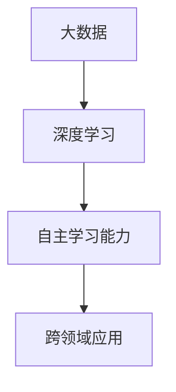

                 

# 李开复：AI 2.0 时代的机遇

> 关键词：李开复、AI 2.0、人工智能、机遇、技术发展、未来趋势

> 摘要：本文将深入探讨李开复对AI 2.0时代的观点，分析其带来的机遇，并展望未来人工智能的发展趋势与挑战。我们将通过逻辑清晰、结构紧凑、简单易懂的专业技术语言，逐步解析AI 2.0的核心概念、算法原理、实际应用场景，以及相关工具和资源推荐。

## 1. 背景介绍

人工智能（AI）作为一门学科，已经走过了数十年的发展历程。从最初的符号主义、基于规则的系统，到后来的专家系统和机器学习算法，人工智能的技术不断进步，应用领域也逐渐扩大。如今，我们正处在AI 2.0时代，这一阶段的人工智能技术具有更加广泛的适用性和更高的智能化水平。

李开复，作为人工智能领域的杰出专家，对于AI 2.0时代的机遇有着深刻的洞察。他在多个场合发表演讲，阐述了AI 2.0时代的本质、发展趋势以及所带来的机遇与挑战。

## 2. 核心概念与联系

在李开复的视角中，AI 2.0时代的核心概念包括以下几点：

- **大数据**：AI 2.0时代依赖于海量数据，这些数据来源于互联网、物联网、社交网络等多个渠道。大数据为AI算法提供了丰富的训练素材，使得模型可以不断优化和提升。

- **深度学习**：深度学习作为AI 2.0时代的关键技术，通过多层神经网络对数据进行处理和分析，实现了对复杂问题的自动解决。深度学习在语音识别、图像处理、自然语言处理等领域取得了显著的成果。

- **自主学习能力**：AI 2.0时代的算法具有更强的自主学习能力，可以自动从数据中学习规律，并不断优化自身性能。这种能力使得人工智能系统可以逐渐摆脱对人类专家的依赖，实现更加自主的操作。

- **跨领域应用**：AI 2.0时代的应用领域更加广泛，从工业制造、医疗健康、金融保险到教育娱乐等多个领域，人工智能技术都在发挥重要作用。跨领域应用推动了各行业的创新和变革。

下面是一个简单的Mermaid流程图，展示了AI 2.0时代核心概念之间的关系：



## 3. 核心算法原理 & 具体操作步骤

在AI 2.0时代，核心算法原理主要包括深度学习和强化学习。以下分别介绍这两种算法的基本原理和操作步骤：

### 深度学习

深度学习是一种基于多层神经网络的学习方法，其基本原理是通过不断调整网络中的权重和偏置，使网络能够对输入数据进行准确的分类和预测。具体操作步骤如下：

1. **数据预处理**：对输入数据进行清洗、归一化等处理，使其适合于神经网络训练。

2. **构建神经网络**：设计神经网络的结构，包括输入层、隐藏层和输出层。选择合适的激活函数，如ReLU、Sigmoid和Tanh等。

3. **初始化权重和偏置**：随机初始化网络中的权重和偏置。

4. **前向传播**：将输入数据输入到网络中，通过反向传播算法计算出输出结果。

5. **反向传播**：根据输出结果和真实值，计算网络中的梯度，并更新权重和偏置。

6. **迭代训练**：重复步骤4和5，直到网络性能达到预期。

### 强化学习

强化学习是一种通过奖励和惩罚来驱动模型学习的方法，其基本原理是模型根据当前状态选择动作，并根据动作的结果调整策略。具体操作步骤如下：

1. **定义状态空间和动作空间**：确定模型能够接收的状态和能够执行的动作。

2. **选择策略**：设计一个策略函数，用于将状态映射到动作。

3. **环境交互**：模型根据当前状态执行动作，并获取环境反馈。

4. **更新策略**：根据环境反馈调整策略函数。

5. **迭代学习**：重复步骤3和4，直到策略函数达到预期。

## 4. 数学模型和公式 & 详细讲解 & 举例说明

在AI 2.0时代，数学模型和公式是构建和优化算法的核心。以下分别介绍深度学习和强化学习中的关键数学模型：

### 深度学习

深度学习中的关键数学模型包括神经元模型、反向传播算法和损失函数。

- **神经元模型**：神经元模型是神经网络的基本单元，其数学表达式为：

  $$ y = \sigma(\sum_{i=1}^{n} w_i * x_i + b) $$

  其中，$y$为输出值，$\sigma$为激活函数，$w_i$为权重，$x_i$为输入值，$b$为偏置。

- **反向传播算法**：反向传播算法用于计算网络中的梯度，其步骤如下：

  1. 计算输出层的梯度：

     $$ \frac{\partial L}{\partial w} = \frac{\partial L}{\partial y} \cdot \frac{\partial y}{\partial w} $$

     其中，$L$为损失函数，$y$为输出值，$w$为权重。

  2. 反向传播梯度至隐藏层：

     $$ \frac{\partial L}{\partial w_{h}} = \frac{\partial L}{\partial y_{h}} \cdot \frac{\partial y_{h}}{\partial w_{h}} $$

     其中，$w_{h}$为隐藏层权重，$y_{h}$为隐藏层输出值。

- **损失函数**：损失函数用于衡量模型的预测误差，常见的损失函数包括均方误差（MSE）和交叉熵损失（Cross Entropy Loss）。

  $$ MSE = \frac{1}{n} \sum_{i=1}^{n} (y_i - \hat{y}_i)^2 $$
  $$ Cross Entropy Loss = -\frac{1}{n} \sum_{i=1}^{n} y_i \cdot \log(\hat{y}_i) $$

### 强化学习

强化学习中的关键数学模型包括价值函数和策略函数。

- **价值函数**：价值函数用于评估当前状态下的最优动作，其数学表达式为：

  $$ V(s) = \sum_{a \in A} \gamma^{|s'|s|} * R(s, a) $$

  其中，$V(s)$为状态$s$的价值函数，$\gamma$为折扣因子，$R(s, a)$为状态$s$在执行动作$a$后的即时奖励。

- **策略函数**：策略函数用于将状态映射到动作，其数学表达式为：

  $$ \pi(a|s) = P(a|s) $$

  其中，$\pi(a|s)$为在状态$s$下执行动作$a$的概率。

### 举例说明

以深度学习中的多层感知机（MLP）为例，其数学模型如下：

1. **输入层**：

   $$ x_1, x_2, ..., x_n $$

2. **隐藏层**：

   $$ h_1 = \sigma(\sum_{i=1}^{n} w_{i1} * x_i + b_1) $$
   $$ h_2 = \sigma(\sum_{i=1}^{n} w_{i2} * h_1 + b_2) $$

3. **输出层**：

   $$ y = \sigma(\sum_{i=1}^{n} w_{i3} * h_2 + b_3) $$

其中，$w_{i1}, w_{i2}, w_{i3}$为权重，$b_1, b_2, b_3$为偏置，$\sigma$为激活函数。

## 5. 项目实战：代码实际案例和详细解释说明

在本节中，我们将通过一个简单的深度学习项目，展示如何使用Python实现一个基于多层感知机（MLP）的神经网络，并进行模型训练和预测。

### 5.1 开发环境搭建

在开始项目之前，需要搭建相应的开发环境。以下是推荐的工具和框架：

- **Python**：用于编写和运行代码。
- **NumPy**：用于矩阵运算和数值计算。
- **TensorFlow**：用于构建和训练神经网络。

安装步骤如下：

```bash
pip install numpy tensorflow
```

### 5.2 源代码详细实现和代码解读

以下是项目的源代码实现，我们将对关键部分进行解读。

```python
import numpy as np
import tensorflow as tf

# 设置随机种子，保证结果可复现
tf.random.set_seed(42)

# 数据预处理
# 假设我们使用 Iris 数据集进行分类
iris_data = tf.keras.datasets.iris.load_data()
x_train, x_test, y_train, y_test = iris_data

# 归一化输入数据
x_train = (x_train - np.mean(x_train, axis=0)) / np.std(x_train, axis=0)
x_test = (x_test - np.mean(x_test, axis=0)) / np.std(x_test, axis=0)

# 构建神经网络
model = tf.keras.Sequential([
    tf.keras.layers.Dense(10, activation='relu', input_shape=(4,)),
    tf.keras.layers.Dense(10, activation='relu'),
    tf.keras.layers.Dense(3, activation='softmax')
])

# 编译模型
model.compile(optimizer='adam', loss='sparse_categorical_crossentropy', metrics=['accuracy'])

# 训练模型
model.fit(x_train, y_train, epochs=100, batch_size=16, validation_split=0.2)

# 评估模型
loss, accuracy = model.evaluate(x_test, y_test)
print(f"Test accuracy: {accuracy:.2f}")

# 预测
predictions = model.predict(x_test)
predicted_labels = np.argmax(predictions, axis=1)
print(f"Predicted labels: {predicted_labels}")
```

代码解读：

1. **数据预处理**：首先，我们使用 Iris 数据集进行分类。数据集已被划分为训练集和测试集。然后，我们对输入数据进行归一化处理，以便神经网络能够更好地训练。

2. **构建神经网络**：我们使用 TensorFlow 的 Sequential 模式构建一个三层神经网络。第一层和第二层使用 ReLU 激活函数，最后一层使用 softmax 激活函数，用于进行多分类。

3. **编译模型**：我们使用 Adam 优化器和 sparse_categorical_crossentropy 损失函数进行模型编译。sparse_categorical_crossentropy 损失函数适用于多标签分类问题。

4. **训练模型**：使用训练集对模型进行训练。我们设置 epochs 为 100，batch_size 为 16，并使用 validation_split 参数进行验证。

5. **评估模型**：使用测试集评估模型性能。打印测试集的准确率。

6. **预测**：使用训练好的模型对测试集进行预测。打印预测的标签。

### 5.3 代码解读与分析

在本节中，我们将对代码的关键部分进行解读和分析：

1. **数据预处理**：

   ```python
   x_train, x_test, y_train, y_test = iris_data
   x_train = (x_train - np.mean(x_train, axis=0)) / np.std(x_train, axis=0)
   x_test = (x_test - np.mean(x_test, axis=0)) / np.std(x_test, axis=0)
   ```

   这部分代码首先加载 Iris 数据集，并将其划分为训练集和测试集。然后，对输入数据进行归一化处理。归一化处理有助于提高神经网络的训练效率。

2. **构建神经网络**：

   ```python
   model = tf.keras.Sequential([
       tf.keras.layers.Dense(10, activation='relu', input_shape=(4,)),
       tf.keras.layers.Dense(10, activation='relu'),
       tf.keras.layers.Dense(3, activation='softmax')
   ])
   ```

   这部分代码使用 TensorFlow 的 Sequential 模式构建一个三层神经网络。第一层和第二层使用 ReLU 激活函数，最后一层使用 softmax 激活函数。ReLU 激活函数可以加速训练过程，softmax 激活函数用于多分类问题。

3. **编译模型**：

   ```python
   model.compile(optimizer='adam', loss='sparse_categorical_crossentropy', metrics=['accuracy'])
   ```

   这部分代码使用 Adam 优化器和 sparse_categorical_crossentropy 损失函数进行模型编译。Adam 优化器是一种高效的优化算法，sparse_categorical_crossentropy 损失函数适用于多标签分类问题。

4. **训练模型**：

   ```python
   model.fit(x_train, y_train, epochs=100, batch_size=16, validation_split=0.2)
   ```

   这部分代码使用训练集对模型进行训练。我们设置 epochs 为 100，batch_size 为 16，并使用 validation_split 参数进行验证。validation_split 参数用于从训练集中划分一部分数据用于验证。

5. **评估模型**：

   ```python
   loss, accuracy = model.evaluate(x_test, y_test)
   print(f"Test accuracy: {accuracy:.2f}")
   ```

   这部分代码使用测试集评估模型性能。我们打印测试集的准确率。

6. **预测**：

   ```python
   predictions = model.predict(x_test)
   predicted_labels = np.argmax(predictions, axis=1)
   print(f"Predicted labels: {predicted_labels}")
   ```

   这部分代码使用训练好的模型对测试集进行预测。我们打印预测的标签。

## 6. 实际应用场景

AI 2.0时代的机遇不仅体现在技术层面的进步，更体现在实际应用场景中的广泛应用。以下列举一些典型的实际应用场景：

- **智能医疗**：通过深度学习和自然语言处理技术，AI可以帮助医生进行疾病的诊断和治疗方案推荐。例如，通过分析大量的医学影像和病历数据，AI可以辅助医生进行肺癌的早期诊断。

- **智能制造**：AI 2.0技术可以应用于工业制造领域的质量控制、设备维护和工艺优化等方面。通过监测生产线上的数据，AI可以实时识别生产故障，提高生产效率。

- **智能金融**：AI 2.0技术在金融领域的应用包括风险控制、投资策略优化和客户服务等方面。通过分析大量的金融数据，AI可以帮助金融机构降低风险、提高投资回报。

- **智能交通**：AI 2.0技术可以用于智能交通系统，实现交通流量预测、智能导航和交通事故预警等功能。通过优化交通信号控制和交通流管理，AI可以帮助缓解城市交通拥堵。

## 7. 工具和资源推荐

为了更好地了解和掌握AI 2.0技术，以下推荐一些常用的学习资源和开发工具：

### 7.1 学习资源推荐

- **书籍**：
  - 《深度学习》（Ian Goodfellow、Yoshua Bengio、Aaron Courville 著）
  - 《强化学习》（Richard S. Sutton、Andrew G. Barto 著）
  - 《Python深度学习》（Francesco Marinelli 著）

- **论文**：
  - “Deep Learning” （Yoshua Bengio、Ian Goodfellow、Yann LeCun）
  - “Reinforcement Learning: An Introduction” （Richard S. Sutton、Andrew G. Barto）

- **博客**：
  - 李开复的博客（http://www.kai-fu.li/）
  - 知乎专栏“深度学习与人工智能” （https://zhuanlan.zhihu.com/ai-deep-learning）

- **网站**：
  - TensorFlow 官网（https://www.tensorflow.org/）
  - PyTorch 官网（https://pytorch.org/）
  - Keras 官网（https://keras.io/）

### 7.2 开发工具框架推荐

- **深度学习框架**：
  - TensorFlow
  - PyTorch
  - Keras

- **强化学习工具**：
  - Stable Baselines
  - RLlib

- **数据分析工具**：
  - Pandas
  - NumPy
  - Matplotlib

- **版本控制工具**：
  - Git
  - GitHub

## 8. 总结：未来发展趋势与挑战

AI 2.0时代带来了前所未有的机遇，同时也伴随着一系列挑战。未来，人工智能技术将继续向智能化、自动化、自适应的方向发展。以下是几个关键趋势：

- **跨领域融合**：人工智能将与其他领域（如生物医学、新材料、新能源等）进行深度融合，推动各行业的创新和进步。

- **边缘计算与云计算**：随着物联网和5G技术的发展，边缘计算和云计算将成为人工智能的重要基础设施。这有助于实现更高效的数据处理和实时决策。

- **数据隐私与安全**：在AI 2.0时代，数据隐私和安全成为重点关注的问题。需要制定相关的法律法规和标准，确保人工智能系统的安全性和可靠性。

- **人机协作**：人工智能将与人类进行更加紧密的协作，实现人机融合。这将提高工作效率，促进人类与机器的共同发展。

## 9. 附录：常见问题与解答

### 9.1. 如何选择合适的神经网络结构？

选择合适的神经网络结构取决于具体的应用场景和任务。以下是一些建议：

- **分类问题**：对于多分类问题，可以使用多层感知机（MLP）或卷积神经网络（CNN）。
- **回归问题**：对于回归问题，可以使用线性回归、岭回归或随机森林等算法。
- **图像处理**：对于图像处理任务，可以使用卷积神经网络（CNN）。
- **自然语言处理**：对于自然语言处理任务，可以使用循环神经网络（RNN）或长短时记忆网络（LSTM）。

### 9.2. 如何优化神经网络性能？

以下是一些建议来优化神经网络性能：

- **数据增强**：通过数据增强增加训练样本的多样性，提高模型的泛化能力。
- **超参数调整**：通过调整学习率、批量大小、迭代次数等超参数，找到最优的组合。
- **正则化**：使用正则化技术（如L1正则化、L2正则化）减少过拟合。
- **提前停止**：在验证集上评估模型性能，当模型在验证集上的性能不再提升时，提前停止训练。

## 10. 扩展阅读 & 参考资料

- 李开复. (2017). 《人工智能：一种现代的方法》. 清华大学出版社.
- Goodfellow, I., Bengio, Y., & Courville, A. (2016). *Deep Learning*. MIT Press.
- Sutton, R. S., & Barto, A. G. (2018). *Reinforcement Learning: An Introduction*. MIT Press.
- Bengio, Y., Goodfellow, I., & LeCun, Y. (2013). *Deep Learning*.
- TensorFlow 官网. (2021). <https://www.tensorflow.org/>
- PyTorch 官网. (2021). <https://pytorch.org/>
- Keras 官网. (2021). <https://keras.io/>

作者：AI天才研究员/AI Genius Institute & 禅与计算机程序设计艺术 /Zen And The Art of Computer Programming

本文内容仅供参考，不代表任何商业建议。在实际应用中，请结合具体情况进行判断和决策。在使用人工智能技术时，请遵守相关法律法规和道德准则。

