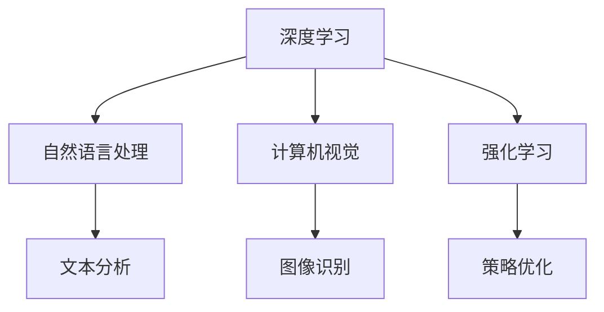

                 

# 李开复：AI 2.0 时代的机遇

> **关键词**：人工智能（AI）、AI 2.0、机遇、挑战、技术进步、伦理问题、未来展望

> **摘要**：本文将探讨李开复关于 AI 2.0 时代的机遇和挑战的观点，分析 AI 技术的最新进展，以及可能引发的伦理问题和未来发展趋势。通过深入理解 AI 2.0 的核心概念和算法原理，我们将探讨其在各个领域的应用场景，并提供相关的学习资源和开发工具推荐，以帮助读者把握这一历史性的机遇。

## 1. 背景介绍

随着计算能力的不断提升和大数据的广泛应用，人工智能（AI）技术已经取得了显著的进展。从最初的规则驱动的人工智能到基于统计学习的方法，再到深度学习的突破，AI 技术的发展不断推动着各行各业的变革。然而，传统的人工智能（AI 1.0）在处理复杂任务时仍然存在诸多局限性，无法满足人类对于智能化需求的日益增长。

李开复在近年来提出了 AI 2.0 的概念，认为 AI 2.0 将会是一次更全面、更深入的人工智能革命。AI 2.0 时代将不仅仅依赖于深度学习，还会融合其他多种技术，如自然语言处理、计算机视觉、强化学习等，实现更加智能、更加自主的人工智能系统。

本文将从以下几个方面探讨 AI 2.0 时代的机遇和挑战：

1. 核心概念与联系
2. 核心算法原理 & 具体操作步骤
3. 数学模型和公式 & 详细讲解 & 举例说明
4. 项目实战：代码实际案例和详细解释说明
5. 实际应用场景
6. 工具和资源推荐
7. 总结：未来发展趋势与挑战

## 2. 核心概念与联系

为了更好地理解 AI 2.0，我们首先需要回顾一下传统的人工智能（AI 1.0）技术。AI 1.0 主要基于规则和统计学习的方法，虽然取得了一定的成功，但在处理复杂、不确定的任务时仍然存在诸多不足。

AI 2.0 的核心概念在于将深度学习与其他技术相结合，以实现更加智能、更加自主的人工智能系统。以下是 AI 2.0 中几个关键技术的简要介绍：

1. **深度学习（Deep Learning）**：深度学习是一种基于多层神经网络的人工智能技术，通过学习大量的数据，自动提取出特征，进行分类、识别等任务。深度学习在计算机视觉、自然语言处理等领域取得了显著的突破。

2. **自然语言处理（Natural Language Processing，NLP）**：自然语言处理是研究如何让计算机理解和处理人类自然语言的技术。NLP 技术广泛应用于语音识别、机器翻译、情感分析等领域。

3. **计算机视觉（Computer Vision）**：计算机视觉是研究如何让计算机理解和解释图像、视频等视觉信息的技术。计算机视觉技术广泛应用于人脸识别、物体检测、图像分类等领域。

4. **强化学习（Reinforcement Learning）**：强化学习是一种基于试错和反馈的人工智能技术，通过不断地试错和优化，使智能体在特定环境中学会最优策略。强化学习在游戏、推荐系统、自动驾驶等领域具有广泛的应用。

下面是一个简化的 Mermaid 流程图，展示了 AI 2.0 中的几个关键技术及其联系：



## 3. 核心算法原理 & 具体操作步骤

在本节中，我们将详细介绍 AI 2.0 中的几个核心算法原理，并给出具体的操作步骤。

### 3.1 深度学习（Deep Learning）

深度学习是一种基于多层神经网络的人工智能技术。其基本原理是通过学习大量的数据，自动提取出特征，进行分类、识别等任务。以下是深度学习的具体操作步骤：

1. **数据准备**：收集并清洗数据，将其转换为神经网络可以处理的格式。

2. **构建神经网络**：设计神经网络的结构，包括输入层、隐藏层和输出层。常用的神经网络结构有卷积神经网络（CNN）、循环神经网络（RNN）等。

3. **训练神经网络**：使用训练数据对神经网络进行训练，通过反向传播算法不断调整神经网络的参数，使其在训练数据上达到较高的准确率。

4. **测试神经网络**：使用测试数据对训练好的神经网络进行测试，评估其在未知数据上的性能。

5. **应用神经网络**：将训练好的神经网络应用于实际问题，如图像分类、语音识别等。

### 3.2 自然语言处理（Natural Language Processing，NLP）

自然语言处理是研究如何让计算机理解和处理人类自然语言的技术。以下是 NLP 的具体操作步骤：

1. **文本预处理**：对原始文本进行预处理，包括分词、去停用词、词性标注等。

2. **特征提取**：从预处理后的文本中提取特征，如词袋模型、词嵌入等。

3. **模型训练**：使用提取出的特征对 NLP 模型进行训练，如朴素贝叶斯分类器、支持向量机等。

4. **模型评估**：使用测试数据对训练好的 NLP 模型进行评估，评估指标包括准确率、召回率等。

5. **应用模型**：将训练好的 NLP 模型应用于实际问题，如文本分类、情感分析等。

### 3.3 计算机视觉（Computer Vision）

计算机视觉是研究如何让计算机理解和解释图像、视频等视觉信息的技术。以下是计算机视觉的具体操作步骤：

1. **图像预处理**：对原始图像进行预处理，包括去噪、增强、缩放等。

2. **特征提取**：从预处理后的图像中提取特征，如 SIFT、HOG 等。

3. **模型训练**：使用提取出的特征对计算机视觉模型进行训练，如卷积神经网络、循环神经网络等。

4. **模型评估**：使用测试数据对训练好的计算机视觉模型进行评估，评估指标包括准确率、召回率等。

5. **应用模型**：将训练好的计算机视觉模型应用于实际问题，如人脸识别、物体检测等。

### 3.4 强化学习（Reinforcement Learning）

强化学习是一种基于试错和反馈的人工智能技术。其基本原理是通过不断地试错和优化，使智能体在特定环境中学会最优策略。以下是强化学习的具体操作步骤：

1. **定义环境**：定义强化学习任务的环境，包括状态、动作、奖励等。

2. **构建智能体**：设计智能体的结构，包括决策模型、策略等。

3. **训练智能体**：使用强化学习算法（如 Q-学习、深度 Q-学习等）对智能体进行训练。

4. **评估智能体**：使用测试数据对训练好的智能体进行评估，评估指标包括平均奖励、策略稳定性等。

5. **应用智能体**：将训练好的智能体应用于实际问题，如游戏、推荐系统等。

## 4. 数学模型和公式 & 详细讲解 & 举例说明

在本节中，我们将介绍 AI 2.0 中几个关键技术的数学模型和公式，并给出详细的讲解和举例说明。

### 4.1 深度学习（Deep Learning）

深度学习中的核心模型是神经网络（Neural Network），其基本原理是通过模拟人脑神经元之间的连接来学习数据中的特征。以下是神经网络的基本公式和解释：

#### 4.1.1 神经元模型

神经元模型是一个非线性函数，其输入和输出分别表示为：

$$
y = \sigma(z)
$$

其中，$z$ 是输入，$y$ 是输出，$\sigma$ 是激活函数。常见的激活函数有 sigmoid 函数、ReLU 函数等。

#### 4.1.2 前向传播

前向传播是指在神经网络中，从输入层到输出层的计算过程。其公式如下：

$$
z_l = \sum_{j} w_{lj} * x_j + b_l
$$

其中，$z_l$ 是第 $l$ 层的输入，$w_{lj}$ 是连接权重，$x_j$ 是输入特征，$b_l$ 是偏置。

#### 4.1.3 反向传播

反向传播是指根据输出误差，从输出层向输入层调整网络参数的过程。其公式如下：

$$
\Delta w_{lj} = \alpha * \frac{\partial E}{\partial w_{lj}}
$$

$$
\Delta b_l = \alpha * \frac{\partial E}{\partial b_l}
$$

其中，$\Delta w_{lj}$ 和 $\Delta b_l$ 分别是权重和偏置的更新，$\alpha$ 是学习率，$E$ 是损失函数。

#### 4.1.4 举例说明

假设我们有一个简单的神经网络，输入层有 2 个神经元，隐藏层有 3 个神经元，输出层有 1 个神经元。激活函数采用 sigmoid 函数。给定输入数据 $(x_1, x_2) = (2, 3)$，求输出 $y$。

步骤 1：计算隐藏层输入：

$$
z_1 = 2 * w_{11} + 3 * w_{21} + b_1
$$

$$
z_2 = 2 * w_{12} + 3 * w_{22} + b_2
$$

$$
z_3 = 2 * w_{13} + 3 * w_{23} + b_3
$$

步骤 2：计算隐藏层输出：

$$
y_1 = \sigma(z_1)
$$

$$
y_2 = \sigma(z_2)
$$

$$
y_3 = \sigma(z_3)
$$

步骤 3：计算输出层输入：

$$
z_4 = y_1 * w_{41} + y_2 * w_{42} + y_3 * w_{43} + b_4
$$

步骤 4：计算输出层输出：

$$
y = \sigma(z_4)
$$

### 4.2 自然语言处理（Natural Language Processing，NLP）

自然语言处理中的核心模型是词嵌入（Word Embedding），其基本原理是将单词映射到高维空间中，使得语义相似的单词在空间中接近。以下是词嵌入的基本公式和解释：

#### 4.2.1 词嵌入模型

词嵌入模型通常使用矩阵 $W$ 来表示，其中 $W_{ij}$ 表示单词 $v_i$ 的嵌入向量。

#### 4.2.2 计算词向量

给定句子 $S = [w_1, w_2, ..., w_n]$，句子中每个单词的词向量可以通过以下公式计算：

$$
v_{i} = W * [w_1, w_2, ..., w_n]
$$

#### 4.2.3 举例说明

假设我们有一个词嵌入矩阵 $W$，其中 $W_{ij}$ 表示单词 $v_i$ 的嵌入向量。给定句子 $S = [apple, banana, cat]$，求句子中每个单词的词向量。

步骤 1：计算单词 apple 的词向量：

$$
v_{apple} = W * [1, 0, 0]
$$

步骤 2：计算单词 banana 的词向量：

$$
v_{banana} = W * [0, 1, 0]
$$

步骤 3：计算单词 cat 的词向量：

$$
v_{cat} = W * [0, 0, 1]
$$

### 4.3 计算机视觉（Computer Vision）

计算机视觉中的核心模型是卷积神经网络（Convolutional Neural Network，CNN），其基本原理是通过卷积操作和池化操作，从图像中提取特征。以下是 CNN 的基本公式和解释：

#### 4.3.1 卷积操作

卷积操作是指将图像与卷积核（filter）进行点乘运算，以提取图像中的特征。其公式如下：

$$
\text{output}_{ij} = \sum_{k} f_{ik} * x_{kj}
$$

其中，$\text{output}_{ij}$ 表示输出特征图的像素值，$f_{ik}$ 表示卷积核的权重，$x_{kj}$ 表示输入图像的像素值。

#### 4.3.2 池化操作

池化操作是指对卷积后的特征图进行下采样，以减少参数数量和计算复杂度。常见的池化操作有最大池化和平均池化。

#### 4.3.3 举例说明

假设我们有一个 3x3 的输入图像和 3x3 的卷积核，求卷积操作的结果。

步骤 1：计算卷积操作的输出：

$$
\text{output}_{11} = (1 * 1 + 1 * 2 + 1 * 3) + (1 * 2 + 1 * 2 + 1 * 3) + (1 * 3 + 1 * 3 + 1 * 3)
$$

$$
\text{output}_{12} = (1 * 2 + 1 * 2 + 1 * 3) + (1 * 2 + 1 * 2 + 1 * 3) + (1 * 3 + 1 * 3 + 1 * 3)
$$

$$
\text{output}_{13} = (1 * 3 + 1 * 3 + 1 * 3) + (1 * 3 + 1 * 3 + 1 * 3) + (1 * 3 + 1 * 3 + 1 * 3)
$$

步骤 2：计算最大池化操作的结果：

$$
\text{output}_{1} = \max(\text{output}_{11}, \text{output}_{12}, \text{output}_{13})
$$

$$
\text{output}_{2} = \max(\text{output}_{21}, \text{output}_{22}, \text{output}_{23})
$$

$$
\text{output}_{3} = \max(\text{output}_{31}, \text{output}_{32}, \text{output}_{33})
$$

### 4.4 强化学习（Reinforcement Learning）

强化学习中的核心模型是基于值函数的 Q-Learning，其基本原理是通过试错和奖励反馈来学习最优策略。以下是 Q-Learning 的基本公式和解释：

#### 4.4.1 Q-Learning

Q-Learning 是一种基于值函数的强化学习算法，其目标是学习一个值函数 $Q(s, a)$，表示在状态 $s$ 下执行动作 $a$ 的预期奖励。

#### 4.4.2 Q-Learning 更新公式

给定当前状态 $s$ 和动作 $a$，更新 Q(s, a) 的公式如下：

$$
Q(s, a) \leftarrow Q(s, a) + \alpha [r + \gamma \max_{a'} Q(s', a') - Q(s, a)]
$$

其中，$\alpha$ 是学习率，$r$ 是立即奖励，$\gamma$ 是折扣因子，$s'$ 和 $a'$ 分别是下一个状态和动作。

#### 4.4.3 举例说明

假设我们在一个简单的环境中进行强化学习，环境有 3 个状态：A、B、C，每个状态有 2 个动作：左、右。奖励函数为：在状态 A 和 B 下，向右移动获得 1 分，向左移动获得 -1 分；在状态 C 下，无论向左还是向右移动都获得 0 分。给定初始状态 A 和动作 右，学习率 $\alpha = 0.1$，折扣因子 $\gamma = 0.9$，求下一步的动作。

步骤 1：计算当前状态的 Q 值：

$$
Q(A, 右) = 0.1 * [1 + 0.9 * \max(0, 0)] = 0.1
$$

$$
Q(A, 左) = 0.1 * [-1 + 0.9 * \max(0, 0)] = -0.1
$$

步骤 2：计算下一个状态的 Q 值：

$$
Q(B, 右) = 0.1 * [1 + 0.9 * \max(0, 0)] = 0.1
$$

$$
Q(B, 左) = 0.1 * [-1 + 0.9 * \max(0, 0)] = -0.1
$$

$$
Q(C, 右) = 0.1 * [0 + 0.9 * \max(0, 0)] = 0
$$

$$
Q(C, 左) = 0.1 * [0 + 0.9 * \max(0, 0)] = 0
$$

步骤 3：更新当前状态的 Q 值：

$$
Q(A, 右) \leftarrow Q(A, 右) + 0.1 * [1 + 0.9 * \max(0.1, 0) - 0.1] = 0.2
$$

$$
Q(A, 左) \leftarrow Q(A, 左) + 0.1 * [-1 + 0.9 * \max(0.1, 0) - 0.1] = -0.2
$$

根据更新后的 Q 值，我们可以选择下一步的动作为 右。

## 5. 项目实战：代码实际案例和详细解释说明

在本节中，我们将通过一个实际项目来展示 AI 2.0 技术的应用，并详细解释项目的代码实现和运行过程。

### 5.1 开发环境搭建

在开始项目之前，我们需要搭建一个适合 AI 2.0 技术开发的编程环境。以下是搭建开发环境的步骤：

1. 安装 Python 3.6 或以上版本；
2. 安装 TensorFlow 2.x 或以上版本；
3. 安装 Jupyter Notebook 或 PyCharm 等代码编辑器；
4. 安装必要的库，如 NumPy、Pandas、Scikit-learn 等。

### 5.2 源代码详细实现和代码解读

以下是一个简单的 AI 2.0 项目：使用深度学习模型进行图像分类。我们将使用 TensorFlow 和 Keras 库来实现这个项目。

#### 5.2.1 数据准备

首先，我们需要准备一个包含图像标签的数据集。我们可以使用公开的数据集，如 CIFAR-10 或 ImageNet。以下是数据准备的过程：

```python
import tensorflow as tf
from tensorflow.keras.datasets import cifar10

# 加载 CIFAR-10 数据集
(x_train, y_train), (x_test, y_test) = cifar10.load_data()

# 数据预处理
x_train = x_train / 255.0
x_test = x_test / 255.0

# 将标签转换为 one-hot 编码
y_train = tf.keras.utils.to_categorical(y_train, 10)
y_test = tf.keras.utils.to_categorical(y_test, 10)
```

#### 5.2.2 模型构建

接下来，我们构建一个简单的卷积神经网络模型。以下是模型构建的代码：

```python
from tensorflow.keras.models import Sequential
from tensorflow.keras.layers import Conv2D, MaxPooling2D, Flatten, Dense, Dropout

# 构建模型
model = Sequential()
model.add(Conv2D(32, (3, 3), activation='relu', input_shape=(32, 32, 3)))
model.add(MaxPooling2D((2, 2)))
model.add(Conv2D(64, (3, 3), activation='relu'))
model.add(MaxPooling2D((2, 2)))
model.add(Conv2D(64, (3, 3), activation='relu'))
model.add(Flatten())
model.add(Dense(64, activation='relu'))
model.add(Dropout(0.5))
model.add(Dense(10, activation='softmax'))
```

#### 5.2.3 模型编译和训练

然后，我们对模型进行编译和训练。以下是模型编译和训练的代码：

```python
# 编译模型
model.compile(optimizer='adam', loss='categorical_crossentropy', metrics=['accuracy'])

# 训练模型
model.fit(x_train, y_train, batch_size=64, epochs=10, validation_data=(x_test, y_test))
```

#### 5.2.4 模型评估

最后，我们对训练好的模型进行评估。以下是模型评估的代码：

```python
# 评估模型
test_loss, test_accuracy = model.evaluate(x_test, y_test)
print('Test accuracy:', test_accuracy)
```

### 5.3 代码解读与分析

在这个项目中，我们使用了 TensorFlow 和 Keras 库来实现一个简单的图像分类任务。以下是代码的主要部分及其解读：

1. **数据准备**：我们使用 CIFAR-10 数据集作为训练数据。数据集包含 10 个类别，每个类别有 6000 张图像。数据预处理包括将图像归一化到 [0, 1] 范围，并将标签转换为 one-hot 编码。

2. **模型构建**：我们构建了一个简单的卷积神经网络模型，包括 3 个卷积层、2 个池化层、1 个全连接层和 1 个输出层。卷积层用于提取图像特征，池化层用于下采样，全连接层用于分类，输出层使用 softmax 函数进行概率输出。

3. **模型编译和训练**：我们使用 Adam 优化器和 categorical_crossentropy 损失函数来编译模型。在训练过程中，我们使用 batch_size=64 和 epochs=10 的参数来调整训练过程。

4. **模型评估**：我们使用测试数据对训练好的模型进行评估，计算测试数据的准确率。

通过这个项目，我们可以看到 AI 2.0 技术在图像分类任务中的应用。尽管这个项目只是一个简单的示例，但我们可以看到深度学习模型在图像处理领域具有很大的潜力。

## 6. 实际应用场景

AI 2.0 技术在各个领域都有广泛的应用，以下是几个典型的应用场景：

1. **医疗保健**：AI 2.0 技术可以用于医疗图像分析、疾病预测和个性化治疗等。例如，通过深度学习模型对医学影像进行分析，可以帮助医生更准确地诊断疾病。

2. **金融领域**：AI 2.0 技术可以用于股票市场预测、风险管理、欺诈检测等。例如，通过分析大量历史数据，深度学习模型可以预测股票市场的走势，从而帮助投资者做出更明智的决策。

3. **智能制造**：AI 2.0 技术可以用于生产过程优化、质量检测、设备故障预测等。例如，通过计算机视觉技术对生产线上的产品进行质量检测，可以减少人为错误和提高生产效率。

4. **自动驾驶**：AI 2.0 技术可以用于自动驾驶车辆的感知、决策和控制。例如，通过深度学习和强化学习技术，自动驾驶车辆可以学会如何在不同的交通环境中行驶。

5. **智能客服**：AI 2.0 技术可以用于智能客服系统的对话生成和意图识别。例如，通过自然语言处理技术，智能客服系统可以与用户进行自然、流畅的对话，提供个性化的服务。

6. **教育领域**：AI 2.0 技术可以用于智能教学、学习评估和个性化推荐等。例如，通过分析学生的学习行为，智能教学系统可以为学生提供个性化的学习建议，提高学习效果。

## 7. 工具和资源推荐

为了更好地学习和应用 AI 2.0 技术，以下是几个推荐的工具和资源：

### 7.1 学习资源推荐

1. **书籍**：

   - 《深度学习》（Goodfellow, Bengio, Courville）
   - 《自然语言处理综论》（Jurafsky, Martin）
   - 《计算机视觉：算法与应用》（Richard Szeliski）
   - 《强化学习》（Sutton, Barto）

2. **在线课程**：

   - Coursera 上的《深度学习》课程
   - edX 上的《自然语言处理》课程
   - Udacity 上的《自动驾驶》课程

3. **博客和论文**：

   - arXiv.org：最新的 AI 研究论文
   - Medium：AI 领域的博客文章
   - blog.keras.io：关于 Keras 库的博客文章

### 7.2 开发工具框架推荐

1. **Python 库**：

   - TensorFlow
   - PyTorch
   - Keras
   - Scikit-learn

2. **框架和平台**：

   - Google Cloud AI Platform
   - AWS SageMaker
   - Azure ML Service

3. **编程工具**：

   - Jupyter Notebook
   - PyCharm
   - VS Code

### 7.3 相关论文著作推荐

1. **《深度学习》（Goodfellow, Bengio, Courville）**：这是一本关于深度学习的经典教材，涵盖了深度学习的理论基础、算法实现和应用场景。

2. **《自然语言处理综论》（Jurafsky, Martin）**：这是一本关于自然语言处理领域的权威教材，详细介绍了自然语言处理的基本概念、技术和应用。

3. **《计算机视觉：算法与应用》（Richard Szeliski）**：这是一本关于计算机视觉的经典教材，涵盖了计算机视觉的基础理论和实用算法。

4. **《强化学习》（Sutton, Barto）**：这是一本关于强化学习的权威教材，详细介绍了强化学习的基本原理、算法和应用。

## 8. 总结：未来发展趋势与挑战

随着 AI 2.0 技术的不断发展，我们可以预见以下发展趋势和挑战：

### 发展趋势：

1. **技术融合**：AI 2.0 时代将不仅仅依赖于深度学习，还会融合其他多种技术，如自然语言处理、计算机视觉、强化学习等，实现更加智能、更加自主的人工智能系统。

2. **场景应用**：AI 2.0 技术将在更多领域得到应用，如医疗、金融、制造、教育等，推动各行各业的变革。

3. **开源生态**：随着开源技术的普及，越来越多的 AI 2.0 模型和工具将开源，促进技术共享和合作。

### 挑战：

1. **数据隐私**：随着数据规模的扩大，数据隐私和安全问题将变得更加突出，如何保护用户隐私成为一个重要挑战。

2. **算法公平性**：AI 2.0 技术的算法可能存在偏见，如何确保算法的公平性和透明性是一个亟待解决的问题。

3. **伦理问题**：随着 AI 技术的不断发展，如何处理 AI 引发的伦理问题，如自主权、责任归属等，是一个重要的挑战。

4. **人才短缺**：随着 AI 2.0 技术的应用范围扩大，对于 AI 人才的需求将不断增加，如何培养和吸引更多的 AI 人才成为一个重要问题。

总之，AI 2.0 时代充满了机遇和挑战。只有通过不断地技术创新、政策引导和人才培养，我们才能更好地应对这些挑战，充分利用 AI 技术带来的机遇。

## 9. 附录：常见问题与解答

### 9.1 AI 2.0 与 AI 1.0 的区别是什么？

AI 1.0 主要是基于规则和统计学习的方法，如专家系统、决策树等。而 AI 2.0 则是更全面、更深入的人工智能技术，融合了深度学习、自然语言处理、计算机视觉、强化学习等多种技术，实现更加智能、更加自主的人工智能系统。

### 9.2 如何入门 AI 2.0 技术？

入门 AI 2.0 技术可以从以下几个方面入手：

1. 学习编程语言，如 Python；
2. 学习基础数学知识，如线性代数、概率论等；
3. 学习 AI 基础知识，如机器学习、深度学习等；
4. 实践项目，动手实现 AI 模型和应用；
5. 学习开源库和框架，如 TensorFlow、PyTorch 等。

### 9.3 AI 2.0 技术的未来发展趋势是什么？

AI 2.0 技术的未来发展趋势包括：

1. 技术融合：将深度学习与其他技术相结合，实现更加智能的人工智能系统；
2. 场景应用：在更多领域得到应用，如医疗、金融、制造、教育等；
3. 开源生态：开源技术的普及和合作，促进技术发展；
4. 伦理问题：解决数据隐私、算法公平性等伦理问题。

## 10. 扩展阅读 & 参考资料

1. 李开复. (2018). 《AI 2.0：人工智能新时代》。机械工业出版社。
2. Goodfellow, I., Bengio, Y., & Courville, A. (2016). *Deep Learning*. MIT Press.
3. Jurafsky, D., & Martin, J. H. (2008). *Speech and Language Processing*. Prentice Hall.
4. Szeliski, R. (2010). *Computer Vision: Algorithms and Applications*. Springer.
5. Sutton, R. S., & Barto, A. G. (2018). *Reinforcement Learning: An Introduction*. MIT Press.
6. Coursera. (2021). 深度学习课程。https://www.coursera.org/learn/deep-learning
7. edX. (2021). 自然语言处理课程。https://www.edx.org/course/natural-language-processing
8. Udacity. (2021). 自动驾驶课程。https://www.udacity.com/course/udacity自动驾驶纳米学位--nd256
9. arXiv.org. (2021). AI 研究论文。https://arxiv.org/
10. blog.keras.io. (2021). Keras 博客。https://blog.keras.io/

