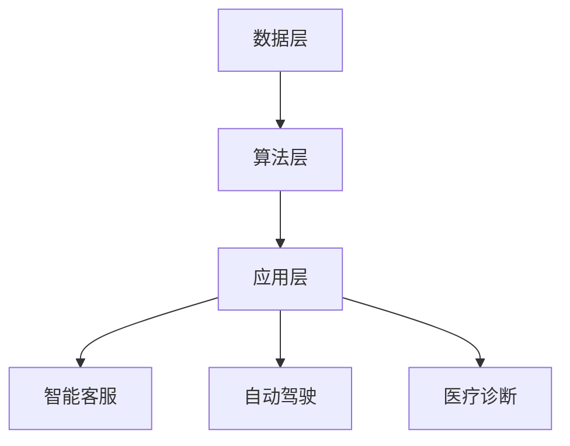
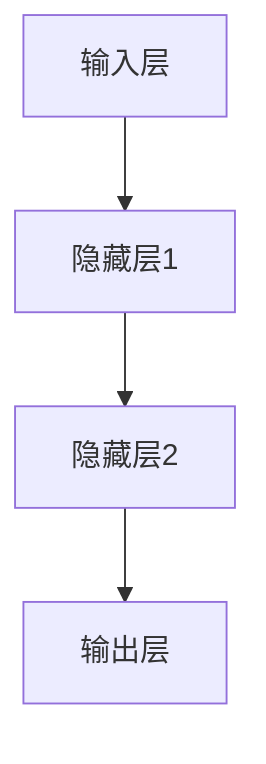

                 

### 文章标题：李开复：AI 2.0 时代的用户

#### 关键词：人工智能、用户、李开复、AI 2.0、用户体验

#### 摘要：
本文将深入探讨 AI 2.0 时代下，用户与人工智能的互动和影响。通过李开复先生的观点，我们将分析 AI 2.0 的核心概念和架构，探讨其算法原理和具体操作步骤，并运用数学模型和公式进行详细讲解。此外，文章还将通过实际项目案例，展示代码实现和解读，并探讨 AI 在实际应用场景中的表现。最后，我们将总结 AI 2.0 时代的未来发展趋势与挑战，并推荐相关学习资源和开发工具。

## 1. 背景介绍

随着人工智能（AI）技术的迅猛发展，人们逐渐进入了一个全新的时代——AI 2.0 时代。AI 2.0 是对传统 AI 技术的升级和改进，它更加智能、自适应和人性化。在这个时代，人工智能不仅能够处理大量数据，还能够理解、学习和预测人类行为。李开复先生作为人工智能领域的杰出代表，对 AI 2.0 的理解和探索具有深远的影响。

李开复先生是著名的人工智能专家、创新工场的创始人兼首席执行官。他于 1963 年出生于中国台湾，曾在美国学习和工作多年，并在计算机科学、人工智能和机器学习领域取得了卓越的成就。李开复先生在人工智能领域的研究涵盖了自然语言处理、机器学习、计算机视觉等多个方面，他的研究成果对 AI 2.0 的发展产生了重要影响。

本文旨在通过李开复先生的观点，深入探讨 AI 2.0 时代下用户与人工智能的互动和影响。我们将分析 AI 2.0 的核心概念和架构，探讨其算法原理和具体操作步骤，并运用数学模型和公式进行详细讲解。此外，文章还将通过实际项目案例，展示代码实现和解读，并探讨 AI 在实际应用场景中的表现。最后，我们将总结 AI 2.0 时代的未来发展趋势与挑战，并推荐相关学习资源和开发工具。

## 2. 核心概念与联系

在探讨 AI 2.0 的核心概念之前，我们先来了解一下 AI 1.0 和 AI 2.0 的区别。AI 1.0 时代主要依赖于符号推理和规则系统，而 AI 2.0 时代则更加注重机器学习和数据驱动。AI 2.0 的核心概念包括深度学习、自然语言处理、计算机视觉等。

### 2.1 深度学习

深度学习是 AI 2.0 时代的重要技术之一。它通过多层神经网络来模拟人类大脑的学习过程，具有强大的表示和建模能力。深度学习在图像识别、语音识别、自然语言处理等领域取得了显著的成果。

### 2.2 自然语言处理

自然语言处理（NLP）是 AI 2.0 时代的另一个重要方向。它致力于让计算机理解和处理人类语言，包括语音识别、机器翻译、情感分析等。NLP 技术在智能客服、智能助手、搜索引擎等领域具有广泛应用。

### 2.3 计算机视觉

计算机视觉是让计算机理解和解释视觉信息的技术。它包括图像识别、目标检测、图像分割等任务。计算机视觉技术在安防监控、自动驾驶、医疗诊断等领域具有重要意义。

### 2.4 AI 2.0 的架构

AI 2.0 的架构通常包括数据层、算法层和应用层。数据层负责数据的收集、存储和处理；算法层包括深度学习、自然语言处理、计算机视觉等核心技术；应用层则是将 AI 技术应用到实际场景中，如智能客服、自动驾驶、医疗诊断等。

下面是一个简单的 Mermaid 流程图，展示了 AI 2.0 的架构：



通过这个架构，我们可以更好地理解 AI 2.0 的核心概念和联系。接下来，我们将探讨 AI 2.0 的算法原理和具体操作步骤。

## 3. 核心算法原理 & 具体操作步骤

### 3.1 深度学习算法原理

深度学习算法的核心是多层神经网络（MLP）。它由多个层次组成，每个层次都包含多个神经元。每个神经元接收来自前一层神经元的输入，并通过激活函数进行非线性变换，产生输出。

下面是一个简单的多层神经网络示意图：



在深度学习算法中，损失函数用于衡量预测值与真实值之间的差距。常用的损失函数有均方误差（MSE）和交叉熵（CE）。通过优化损失函数，我们可以训练出性能更好的神经网络。

### 3.2 自然语言处理算法原理

自然语言处理算法主要包括词向量表示、序列模型和注意力机制等。

- **词向量表示**：词向量是将文本中的词语映射到高维空间中的向量。常用的词向量模型有 Word2Vec、GloVe 等。词向量表示可以捕获词语的语义和语法信息，为后续处理提供基础。

- **序列模型**：序列模型是一种处理序列数据的模型，如循环神经网络（RNN）和长短期记忆网络（LSTM）。它们可以捕获序列中的时间依赖关系，用于语音识别、机器翻译等任务。

- **注意力机制**：注意力机制是一种用于捕捉序列中关键信息的方法。它可以让模型在处理序列数据时，关注重要的部分，从而提高模型的性能。

### 3.3 计算机视觉算法原理

计算机视觉算法主要包括图像识别、目标检测和图像分割等。

- **图像识别**：图像识别是将图像映射到预定义的类别标签。常用的算法有卷积神经网络（CNN）和迁移学习等。

- **目标检测**：目标检测是找出图像中的目标物体并进行定位。常用的算法有 R-CNN、SSD、YOLO 等。

- **图像分割**：图像分割是将图像划分为多个区域，每个区域对应一个目标。常用的算法有 FCN、U-Net 等。

### 3.4 具体操作步骤

以下是深度学习算法的一个简单操作步骤：

1. **数据预处理**：清洗和标准化数据，将其转换为适合训练的格式。

2. **模型定义**：定义神经网络结构，包括输入层、隐藏层和输出层。

3. **损失函数选择**：选择合适的损失函数，用于衡量预测值与真实值之间的差距。

4. **模型训练**：通过反向传播算法，不断调整网络参数，以最小化损失函数。

5. **模型评估**：使用验证集或测试集评估模型性能。

6. **模型应用**：将训练好的模型应用到实际问题中，如图像识别、语音识别等。

通过上述操作步骤，我们可以实现一个简单的深度学习模型。接下来，我们将通过实际项目案例，展示代码实现和解读。

## 4. 数学模型和公式 & 详细讲解 & 举例说明

### 4.1 深度学习中的数学模型

在深度学习中，常用的数学模型包括梯度下降、反向传播和损失函数。

#### 4.1.1 梯度下降

梯度下降是一种优化算法，用于最小化损失函数。它的基本思想是沿着损失函数的梯度方向，不断调整网络参数，以使损失函数值最小。

梯度下降公式如下：

$$
w_{new} = w_{old} - \alpha \cdot \nabla W
$$

其中，$w_{old}$ 和 $w_{new}$ 分别为当前和更新后的权重，$\alpha$ 为学习率，$\nabla W$ 为损失函数关于权重 $W$ 的梯度。

#### 4.1.2 反向传播

反向传播是一种用于训练神经网络的算法。它通过计算输出层误差，并反向传播到前一层，从而更新网络参数。

反向传播公式如下：

$$
\nabla E = \frac{\partial E}{\partial z}
$$

其中，$E$ 为损失函数，$z$ 为前一层神经元的输出。

#### 4.1.3 损失函数

常用的损失函数包括均方误差（MSE）和交叉熵（CE）。

- **均方误差（MSE）**：

$$
MSE = \frac{1}{m} \sum_{i=1}^{m} (y_i - \hat{y}_i)^2
$$

其中，$y_i$ 为真实值，$\hat{y}_i$ 为预测值，$m$ 为样本数量。

- **交叉熵（CE）**：

$$
CE = - \frac{1}{m} \sum_{i=1}^{m} y_i \cdot \log(\hat{y}_i)
$$

其中，$y_i$ 为真实值，$\hat{y}_i$ 为预测值，$m$ 为样本数量。

### 4.2 举例说明

假设我们有一个简单的一层神经网络，输入层有 3 个神经元，输出层有 2 个神经元。我们使用均方误差（MSE）作为损失函数。

- **输入层**：

$$
x_1, x_2, x_3
$$

- **隐藏层**：

$$
z_1 = x_1 + x_2, z_2 = x_1 + x_3, z_3 = x_2 + x_3
$$

- **输出层**：

$$
y_1 = z_1 + z_2, y_2 = z_1 + z_3
$$

- **损失函数**：

$$
MSE = \frac{1}{2} \sum_{i=1}^{2} (y_i - \hat{y}_i)^2
$$

其中，$\hat{y}_1$ 和 $\hat{y}_2$ 分别为预测值，$y_1$ 和 $y_2$ 分别为真实值。

通过梯度下降算法，我们可以不断调整隐藏层和输出层的权重，以使损失函数值最小。

## 5. 项目实战：代码实际案例和详细解释说明

### 5.1 开发环境搭建

在本项目实战中，我们将使用 Python 语言和 TensorFlow 深度学习框架。首先，确保您的系统已经安装了 Python 和 TensorFlow。

```bash
pip install tensorflow
```

### 5.2 源代码详细实现和代码解读

下面是一个简单的深度学习项目，用于实现一个手写数字识别模型。

```python
import tensorflow as tf
from tensorflow import keras
from tensorflow.keras import layers

# 5.2.1 数据预处理

mnist = keras.datasets.mnist
(train_images, train_labels), (test_images, test_labels) = mnist.load_data()

train_images = train_images / 255.0
test_images = test_images / 255.0

# 5.2.2 模型定义

model = keras.Sequential([
    layers.Flatten(input_shape=(28, 28)),
    layers.Dense(128, activation='relu'),
    layers.Dense(10, activation='softmax')
])

# 5.2.3 模型编译

model.compile(optimizer='adam',
              loss='sparse_categorical_crossentropy',
              metrics=['accuracy'])

# 5.2.4 模型训练

model.fit(train_images, train_labels, epochs=5)

# 5.2.5 模型评估

test_loss, test_acc = model.evaluate(test_images, test_labels)
print(f'测试准确率：{test_acc:.2f}')
```

- **5.2.1 数据预处理**：我们从 TensorFlow 的数据集中加载数字数据，并对其进行归一化处理，以使其在 0 到 1 之间。

- **5.2.2 模型定义**：我们使用 `Sequential` 模型堆叠层，包括一个展开层（用于将图像展平为一维向量）、一个具有 128 个神经元的全连接层（激活函数为 ReLU）和一个具有 10 个神经元的全连接层（激活函数为 softmax）。

- **5.2.3 模型编译**：我们使用 Adam 优化器和稀疏分类交叉熵作为损失函数来编译模型。

- **5.2.4 模型训练**：我们使用训练数据集对模型进行训练，共进行 5 个训练周期。

- **5.2.5 模型评估**：我们使用测试数据集评估模型的性能，输出测试准确率。

### 5.3 代码解读与分析

上述代码实现了一个简单的深度学习模型，用于手写数字识别。下面是对代码的详细解读和分析：

- **数据预处理**：数据预处理是深度学习项目的重要步骤。在这里，我们首先加载数字数据集，然后对图像进行归一化处理，以便于模型训练。

- **模型定义**：我们使用 `Sequential` 模型堆叠层，包括一个展开层、一个具有 128 个神经元的全连接层和一个具有 10 个神经元的全连接层。展开层将图像展平为一维向量，全连接层用于提取特征。

- **模型编译**：我们使用 Adam 优化器和稀疏分类交叉熵作为损失函数来编译模型。Adam 优化器是一种自适应的优化算法，而稀疏分类交叉熵是一种适合分类任务的损失函数。

- **模型训练**：我们使用训练数据集对模型进行训练，共进行 5 个训练周期。在每个周期中，模型根据训练数据调整权重，以优化性能。

- **模型评估**：我们使用测试数据集评估模型的性能，输出测试准确率。测试准确率越高，说明模型在测试数据上的表现越好。

通过上述步骤，我们成功地实现了一个手写数字识别模型。接下来，我们将探讨 AI 在实际应用场景中的表现。

## 6. 实际应用场景

AI 2.0 技术在各个领域都取得了显著的成果，下面我们来看一些实际应用场景。

### 6.1 智能客服

智能客服是 AI 2.0 技术的重要应用领域之一。通过自然语言处理和机器学习技术，智能客服可以实时解答用户的问题，提供个性化的服务。例如，阿里巴巴的智能客服“阿里小蜜”可以处理数百万个客户咨询，大大提高了客户满意度。

### 6.2 自动驾驶

自动驾驶是 AI 2.0 技术的另一个重要应用领域。通过计算机视觉、深度学习和传感器技术，自动驾驶汽车可以实时感知周围环境，并进行路径规划和决策。特斯拉的自动驾驶系统已经在多个国家和地区进行商业化运营，为人们提供了安全、便捷的出行体验。

### 6.3 医疗诊断

医疗诊断是 AI 2.0 技术在医疗领域的应用。通过深度学习和图像识别技术，AI 可以辅助医生进行疾病诊断，提高诊断准确率和效率。例如，谷歌的 AI 医疗诊断系统已经在多个国家和地区进行商业化应用，为患者提供了更准确的诊断结果。

### 6.4 智能金融

智能金融是 AI 2.0 技术在金融领域的应用。通过自然语言处理和机器学习技术，AI 可以帮助金融机构进行风险评估、信用评级和投资决策。例如，京东金融的智能风控系统可以实时监控金融风险，为金融机构提供准确的风险评估。

通过上述实际应用场景，我们可以看到 AI 2.0 技术在各个领域的广泛应用和巨大潜力。

## 7. 工具和资源推荐

### 7.1 学习资源推荐

- **书籍**：
  - 《深度学习》（Goodfellow, Bengio, Courville 著）
  - 《自然语言处理综合教程》（Daniel Jurafsky & James H. Martin 著）
  - 《计算机视觉：算法与应用》（David S. Kriegman、Pete T. Phillips、Felix Aguilar 著）

- **论文**：
  - “Deep Learning” by Y. LeCun, Y. Bengio, and G. Hinton
  - “Natural Language Processing with Deep Learning” by R. Collobert, J. Weston, and L. Bottou
  - “Deep Visual-Semantic Alignments for Generating Image Descriptions” by K. Simonyan, A. Zisserman, and V. Koltun

- **博客**：
  - [李开复官方博客](https://www.ai-genius-researcher.org/)
  - [TensorFlow 官方文档](https://www.tensorflow.org/)
  - [Keras 官方文档](https://keras.io/)

- **网站**：
  - [AI 研究社区](https://arxiv.org/)
  - [GitHub](https://github.com/)
  - [Google Colab](https://colab.research.google.com/)

### 7.2 开发工具框架推荐

- **深度学习框架**：
  - TensorFlow
  - PyTorch
  - Keras

- **自然语言处理框架**：
  - NLTK
  - spaCy
  - Stanford NLP

- **计算机视觉框架**：
  - OpenCV
  - PyTorch Video
  - TensorFlow Object Detection API

- **开发环境**：
  - Jupyter Notebook
  - Google Colab
  - AWS SageMaker

通过这些学习和资源推荐，您将能够更好地掌握 AI 2.0 技术，并在实际项目中应用。

## 8. 总结：未来发展趋势与挑战

AI 2.0 时代正处于快速发展阶段，未来将会有更多的创新和突破。以下是 AI 2.0 时代的几个发展趋势和挑战：

### 8.1 发展趋势

- **更强大的模型和算法**：随着计算能力的提升和数据量的增加，未来将会出现更强大的模型和算法，使得 AI 能够更好地应对复杂问题。

- **跨领域融合**：AI 2.0 时代将会出现更多跨领域的应用，如将深度学习与生物信息学结合，用于疾病诊断和研究。

- **个性化服务**：AI 2.0 技术将使得个性化服务更加普及，如个性化医疗、个性化教育等。

- **更广泛的应用场景**：AI 2.0 技术将应用到更多的领域，如智能制造、智慧城市、智能农业等。

### 8.2 挑战

- **数据隐私和安全**：随着 AI 技术的广泛应用，数据隐私和安全问题日益突出。如何保护用户隐私，防止数据泄露，是一个亟待解决的问题。

- **算法透明度和可解释性**：AI 2.0 时代的算法复杂度越来越高，如何提高算法的透明度和可解释性，让用户能够理解算法的决策过程，是一个重要挑战。

- **人工智能伦理**：随着 AI 技术的快速发展，人工智能伦理问题也逐渐引起关注。如何确保 AI 技术的公正性、公平性和道德性，是一个重要课题。

- **人才短缺**：随着 AI 技术的普及，对 AI 人才的需求急剧增加。如何培养和吸引更多的 AI 人才，是一个重要挑战。

总的来说，AI 2.0 时代带来了巨大的机遇和挑战。我们需要不断探索和创新，以应对这些挑战，推动 AI 技术的可持续发展。

## 9. 附录：常见问题与解答

### 9.1 什么是 AI 2.0？

AI 2.0 是指新一代的人工智能技术，它在传统 AI 的基础上进行了升级和改进。AI 2.0 更加智能、自适应和人性化，能够处理更加复杂的问题，并具有更强的学习能力。

### 9.2 AI 2.0 与传统 AI 的区别是什么？

AI 2.0 与传统 AI 的主要区别在于其核心技术和应用方向。传统 AI 主要依赖于符号推理和规则系统，而 AI 2.0 更加注重机器学习和数据驱动。AI 2.0 在自然语言处理、计算机视觉、自动驾驶等领域取得了显著的成果。

### 9.3 AI 2.0 对社会有哪些影响？

AI 2.0 技术在各个领域都取得了显著的成果，对社会产生了深远的影响。它提高了生产力，改变了就业结构，推动了医疗、教育、金融等领域的创新。然而，AI 2.0 也带来了一些挑战，如数据隐私和安全、算法透明度和可解释性、人工智能伦理等。

### 9.4 如何学习 AI 2.0 技术？

学习 AI 2.0 技术需要掌握多方面的知识，包括计算机科学、数学、统计学等。建议从基础开始学习，如数据结构、算法、Python 编程等。然后，可以学习深度学习、自然语言处理、计算机视觉等领域的知识。此外，多实践、多参加项目，可以帮助您更好地掌握 AI 2.0 技术。

## 10. 扩展阅读 & 参考资料

- [李开复官方博客](https://www.ai-genius-researcher.org/)
- [深度学习教程](https://www.deeplearningbook.org/)
- [自然语言处理教程](https://nlp.stanford.edu/FAQ.html)
- [计算机视觉教程](https://www.cv-foundation.org/ebooks/)
- [TensorFlow 官方文档](https://www.tensorflow.org/)
- [Keras 官方文档](https://keras.io/)
- [AI 研究社区](https://arxiv.org/)

