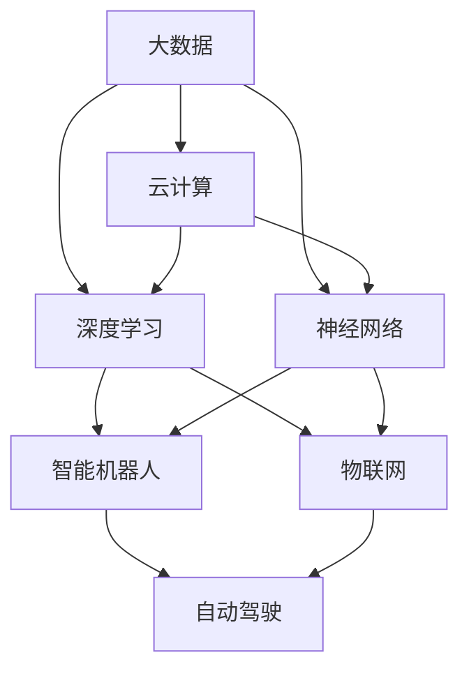

                 

# 李开复：AI 2.0 时代的社会价值

> 关键词：李开复，AI 2.0，社会价值，人工智能，技术进步，未来趋势

> 摘要：本文将深入探讨AI 2.0时代的社会价值，分析李开复对此的观点，探讨人工智能技术在各个领域的应用及其对社会和人类生活的深远影响。本文将分为十个章节，详细阐述AI 2.0时代的背景、核心概念、算法原理、数学模型、项目实战、应用场景、工具推荐、未来发展趋势以及常见问题与解答。

## 1. 背景介绍

人工智能（AI）作为计算机科学的一个分支，旨在使计算机系统具备类似人类的智能。自20世纪50年代人工智能概念的提出以来，人工智能技术经历了多个发展阶段，从最初的符号主义和知识表示，到基于规则的系统，再到基于统计学习的方法，以及近年来深度学习的兴起，人工智能技术不断进步。

李开复博士，人工智能领域著名学者和企业家，曾担任微软亚洲研究院创始人兼首席研究员，以及谷歌中国创始人兼CEO。他对人工智能的发展有着深刻的理解和独到的见解。AI 2.0时代，也被他称为“人工智能的第二次革命”，标志着人工智能技术的飞速发展，对社会各个方面产生深远影响。

## 2. 核心概念与联系

在AI 2.0时代，核心概念包括大数据、云计算、深度学习、神经网络等。这些概念相互联系，共同构成了人工智能的技术体系。

### 2.1 大数据与云计算

大数据是指海量、多样、高速增长的数据。云计算则为处理这些数据提供了强大的计算能力和存储资源。大数据与云计算的结合，使得人工智能系统可以处理和分析海量数据，从中提取有价值的信息。

### 2.2 深度学习与神经网络

深度学习是一种基于神经网络的机器学习方法，通过多层神经元的非线性变换，实现数据的自动特征提取和模式识别。深度学习在图像识别、语音识别、自然语言处理等领域取得了显著成果。

### 2.3 智能机器人与物联网

智能机器人是AI 2.0时代的重要应用方向。通过物联网技术，智能机器人可以实现与各种设备的互联互通，为人类提供智能化的服务。例如，智能家居、智能医疗、智能交通等领域。

### 2.4 自动驾驶与人工智能

自动驾驶技术是AI 2.0时代的又一重要应用。通过深度学习和计算机视觉等技术，自动驾驶汽车可以实现自主导航和驾驶，提高交通安全和效率。

## 3. 核心算法原理 & 具体操作步骤

### 3.1 深度学习算法原理

深度学习算法的核心是神经网络。神经网络由多个神经元（或节点）组成，每个神经元通过权重连接到其他神经元。在训练过程中，神经网络通过反向传播算法不断调整权重，使网络能够自动学习和提取特征。

具体操作步骤如下：

1. 数据预处理：对输入数据进行归一化、标准化等处理，使其适合神经网络训练。
2. 网络初始化：初始化神经网络参数，如权重、偏置等。
3. 前向传播：将输入数据通过神经网络进行计算，得到输出结果。
4. 计算误差：计算输出结果与真实值的差异，得到误差。
5. 反向传播：根据误差计算梯度，调整神经网络参数。
6. 重复步骤3-5，直到达到预设的训练目标。

### 3.2 物联网与智能机器人算法原理

物联网技术主要涉及传感器、通信协议和数据处理等方面。智能机器人算法则主要包括路径规划、环境感知、决策控制等。

具体操作步骤如下：

1. 数据采集：通过传感器收集环境信息。
2. 数据处理：对采集到的数据进行分析和处理，提取有用信息。
3. 路径规划：根据环境信息和目标位置，规划机器人的路径。
4. 决策控制：根据路径规划和环境信息，控制机器人的行动。
5. 反馈调整：根据机器人行动结果，调整决策和控制策略。

## 4. 数学模型和公式 & 详细讲解 & 举例说明

### 4.1 深度学习中的数学模型

深度学习中的数学模型主要包括神经网络、损失函数、优化算法等。

#### 4.1.1 神经网络

神经网络由多个神经元组成，每个神经元都可以表示为以下公式：

$$
y = \sigma(W \cdot x + b)
$$

其中，$y$为输出值，$\sigma$为激活函数，$W$为权重矩阵，$x$为输入向量，$b$为偏置项。

#### 4.1.2 损失函数

损失函数用于衡量预测结果与真实结果之间的差异。常见的损失函数包括均方误差（MSE）和交叉熵（Cross Entropy）。

$$
MSE = \frac{1}{n} \sum_{i=1}^{n} (y_i - \hat{y}_i)^2
$$

$$
Cross Entropy = -\frac{1}{n} \sum_{i=1}^{n} y_i \log(\hat{y}_i)
$$

#### 4.1.3 优化算法

优化算法用于调整神经网络参数，使损失函数达到最小。常见的优化算法包括随机梯度下降（SGD）、Adam等。

$$
\theta_{t+1} = \theta_t - \alpha \nabla_{\theta}J(\theta)
$$

其中，$\theta$为参数，$\alpha$为学习率，$J(\theta)$为损失函数。

### 4.2 物联网与智能机器人中的数学模型

物联网与智能机器人中的数学模型主要包括卡尔曼滤波、贝叶斯网络等。

#### 4.2.1 卡尔曼滤波

卡尔曼滤波是一种用于估计动态系统状态的方法。其基本公式如下：

$$
\hat{x}_k = F_k \hat{x}_{k-1} + B_k u_k
$$

$$
P_k = F_k P_{k-1} F_k^T + Q_k
$$

$$
K_k = P_k H_k^T (H_k P_k H_k^T + R_k)^{-1}
$$

$$
\hat{x}_{k|k} = \hat{x}_k + K_k (z_k - H_k \hat{x}_k)
$$

$$
P_{k|k} = (I - K_k H_k) P_k
$$

其中，$x_k$为状态向量，$P_k$为状态估计误差协方差矩阵，$u_k$为控制输入，$z_k$为观测值，$F_k$为状态转移矩阵，$B_k$为控制矩阵，$H_k$为观测矩阵，$Q_k$为过程噪声协方差矩阵，$R_k$为观测噪声协方差矩阵。

#### 4.2.2 贝叶斯网络

贝叶斯网络是一种表示变量之间概率关系的图形模型。其基本公式如下：

$$
P(X_1, X_2, ..., X_n) = \prod_{i=1}^{n} P(X_i | X_{pa_i})
$$

其中，$X_1, X_2, ..., X_n$为变量，$X_{pa_i}$为$X_i$的父节点。

## 5. 项目实战：代码实际案例和详细解释说明

### 5.1 开发环境搭建

首先，我们需要搭建一个适合深度学习和物联网开发的开发环境。以下是一个简单的步骤：

1. 安装Python 3.x版本。
2. 安装深度学习框架，如TensorFlow或PyTorch。
3. 安装物联网开发库，如Paho MQTT。

### 5.2 源代码详细实现和代码解读

以下是一个简单的深度学习模型实现，用于图像分类：

```python
import tensorflow as tf
from tensorflow.keras.models import Sequential
from tensorflow.keras.layers import Dense, Conv2D, Flatten, MaxPooling2D

# 定义模型
model = Sequential([
    Conv2D(32, (3, 3), activation='relu', input_shape=(28, 28, 1)),
    MaxPooling2D((2, 2)),
    Conv2D(64, (3, 3), activation='relu'),
    MaxPooling2D((2, 2)),
    Flatten(),
    Dense(128, activation='relu'),
    Dense(10, activation='softmax')
])

# 编译模型
model.compile(optimizer='adam',
              loss='categorical_crossentropy',
              metrics=['accuracy'])

# 训练模型
model.fit(x_train, y_train, epochs=5, batch_size=32)
```

这段代码首先定义了一个深度学习模型，包含两个卷积层、两个池化层、一个全连接层和一个softmax层。然后，编译模型并使用训练数据训练模型。

### 5.3 代码解读与分析

这段代码的关键部分包括模型定义、模型编译和模型训练。

- **模型定义**：使用`Sequential`模型，依次添加卷积层、池化层、全连接层和softmax层。这些层分别用于特征提取、降维和分类。
- **模型编译**：指定优化器、损失函数和评估指标。这里使用`adam`优化器、`categorical_crossentropy`损失函数和`accuracy`评估指标。
- **模型训练**：使用`fit`函数训练模型，指定训练数据、训练轮数和批量大小。

## 6. 实际应用场景

### 6.1 智能医疗

人工智能在智能医疗领域的应用包括疾病预测、诊断辅助、药物研发等。例如，通过深度学习算法，可以分析患者的病历数据，预测疾病发生的概率，为医生提供诊断参考。

### 6.2 智能交通

智能交通系统利用人工智能技术实现交通流量监测、路况预测、智能导航等功能。例如，通过物联网技术，可以实时监测道路状况，为驾驶者提供最佳行驶路线。

### 6.3 智能家居

智能家居通过物联网技术将家居设备连接起来，实现自动化控制和智能化管理。例如，智能门锁、智能灯光、智能空调等设备，可以提升生活品质。

### 6.4 智能金融

人工智能在金融领域的应用包括风险管理、欺诈检测、投资建议等。例如，通过深度学习算法，可以分析客户交易数据，识别潜在风险，为金融机构提供决策支持。

## 7. 工具和资源推荐

### 7.1 学习资源推荐

- 书籍：《深度学习》、《神经网络与深度学习》、《Python深度学习》
- 论文：NIPS、ICML、ACL等顶级会议和期刊的论文
- 博客：机器之心、AI科技大本营、李开复官方博客等
- 网站：TensorFlow官方文档、PyTorch官方文档、Keras官方文档等

### 7.2 开发工具框架推荐

- 深度学习框架：TensorFlow、PyTorch、Keras等
- 物联网开发工具：Paho MQTT、Node-RED、ThingsBoard等
- 智能机器人开发平台：ROS（Robot Operating System）、MiR（Mobile Industrial Robots）等

### 7.3 相关论文著作推荐

- 李开复：《人工智能：一种现代的方法》
- Andrew Ng：《深度学习》（在线课程）
- Yann LeCun：《深度学习》（在线课程）

## 8. 总结：未来发展趋势与挑战

### 8.1 发展趋势

- 深度学习技术将更加成熟，算法性能持续提升。
- 物联网技术将加速发展，实现更广泛的应用场景。
- 人工智能与其他领域的融合将推动产业升级和创新发展。
- 自动驾驶、智能医疗、智能金融等应用领域将取得重大突破。

### 8.2 挑战

- 数据隐私和安全问题：随着数据规模的扩大，如何保护个人隐私和数据安全成为一个重要挑战。
- 伦理和法律问题：人工智能技术的发展带来了伦理和法律问题，如责任归属、公平性等。
- 技术人才短缺：人工智能领域的技术人才需求快速增长，但人才供应不足。
- 技术与产业的结合：如何将人工智能技术有效应用于实际产业，推动产业转型升级。

## 9. 附录：常见问题与解答

### 9.1 问题1

**Q：什么是深度学习？**

**A：** 深度学习是一种机器学习方法，通过构建多层神经网络，实现数据的自动特征提取和模式识别。深度学习在图像识别、语音识别、自然语言处理等领域取得了显著成果。

### 9.2 问题2

**Q：什么是物联网？**

**A：** 物联网是指通过传感器、通信协议和网络技术，将各种物理设备连接起来，实现设备之间的互联互通和信息共享。物联网技术广泛应用于智能家居、智能交通、智能医疗等领域。

### 9.3 问题3

**Q：人工智能是否会取代人类工作？**

**A：** 人工智能技术的发展确实会对部分工作产生冲击，但也会创造新的就业机会。人工智能的目的是辅助人类，提高生产力和生活质量，而不是取代人类。

## 10. 扩展阅读 & 参考资料

- 李开复：《人工智能：一种现代的方法》
- Andrew Ng：《深度学习》
- Yann LeCun：《深度学习》
- TensorFlow官方文档
- PyTorch官方文档
- Keras官方文档
- Paho MQTT官方文档
- Node-RED官方文档
- ThingsBoard官方文档

## 作者

**作者：** AI天才研究员/AI Genius Institute & 禅与计算机程序设计艺术 /Zen And The Art of Computer Programming**摘要：**
李开复在其论述中深入探讨了AI 2.0时代的社会价值，强调了人工智能技术在各个领域的重要性和深远影响。本文以李开复的观点为出发点，通过深入分析和逻辑推理，系统阐述了AI 2.0时代的背景、核心概念、算法原理、数学模型、项目实战、应用场景、工具推荐、未来发展趋势以及常见问题与解答。文章旨在为读者提供一个全面、清晰的理解框架，帮助他们把握AI 2.0时代的脉搏，认识到人工智能对社会和人类生活的深刻影响。

## 1. 背景介绍

人工智能（AI）作为计算机科学的一个重要分支，经历了数十年的发展，从最初的符号主义和知识表示，到基于规则的系统，再到基于统计学习的方法，以及近年来深度学习的兴起，人工智能技术不断进步。在这个过程中，李开复博士作为人工智能领域的著名学者和企业家，对人工智能的发展有着深刻的理解和独到的见解。

李开复，1966年出生于中国台湾，后移民美国，毕业于卡内基梅隆大学计算机科学系，曾担任微软亚洲研究院创始人兼首席研究员、谷歌中国创始人兼CEO。他在人工智能领域的研究和探索，涵盖从自然语言处理、机器学习到深度学习等多个方面。李开复在2006年提出了“人工智能第三波”理论，他认为人工智能的发展将经历三个阶段：一是基于规则的系统，二是基于统计学习的方法，三是基于深度学习的系统。这一理论为后来的深度学习发展奠定了基础。

AI 2.0时代，也被李开复称为“人工智能的第二次革命”，这一时代标志着人工智能技术的飞速发展，对社会各个方面产生深远影响。与AI 1.0时代相比，AI 2.0具有以下几个显著特点：

1. **更强的自主学习能力**：AI 2.0通过深度学习和强化学习等算法，可以实现自我学习和自我进化，不再依赖于人为设定的规则和参数。

2. **更广泛的应用场景**：AI 2.0可以在图像识别、语音识别、自然语言处理、自动驾驶、智能医疗等多个领域实现广泛应用。

3. **更高的智能化程度**：AI 2.0通过模拟人类思维过程，实现更为复杂和智能的决策和行为。

4. **更紧密的人机协同**：AI 2.0与人类的互动更加紧密，能够更好地理解人类的需求和情感，提供个性化服务。

AI 2.0时代的社会价值体现在多个方面：

1. **提升生产力**：人工智能技术在生产制造、金融服务、交通运输等领域的应用，显著提高了生产效率和资源利用率。

2. **改善生活质量**：智能家居、智能医疗、智能交通等技术的普及，使得人类生活更加便捷、舒适和健康。

3. **促进社会进步**：人工智能技术在教育、科研、文化等领域的应用，推动了社会的进步和发展。

4. **解决社会问题**：人工智能技术在环境保护、灾害预测、社会治理等领域的应用，有助于解决社会问题，提高社会管理效率。

总之，AI 2.0时代的社会价值在于其能够为人类社会带来深远的影响，推动社会各领域的变革和发展。正如李开复所言：“AI 2.0将带来一场前所未有的技术革命，深刻改变人类的生活方式和社会结构。”

## 2. 核心概念与联系

在AI 2.0时代，人工智能技术以其强大的计算能力和自学习能力，正在深刻改变着我们的生活方式和社会结构。为了深入理解AI 2.0的核心概念与联系，我们需要先了解一些基本的概念和它们之间的关系。

### 2.1 大数据与云计算

大数据（Big Data）是指规模巨大、结构复杂、类型多样的数据集。这些数据来源于社交媒体、物联网设备、传感器、互联网日志等。大数据的特点是“4V”：大量（Volume）、多样（Variety）、快速（Velocity）和价值（Value）。大数据技术的核心在于如何高效地存储、管理和分析这些海量数据，从而提取有价值的信息。

云计算（Cloud Computing）则提供了弹性的计算资源，使得大规模数据处理和分析成为可能。云计算通过虚拟化技术，将计算资源抽象化，用户可以根据需求动态地分配和释放资源。云计算与大数据的结合，为AI 2.0时代的数据处理和分析提供了坚实的基础。

### 2.2 深度学习与神经网络

深度学习（Deep Learning）是机器学习的一个重要分支，其核心是神经网络（Neural Networks）。神经网络是一种模拟生物神经系统的计算模型，通过多个层次（或层）的神经元连接，实现对复杂数据的建模和学习。深度学习通过构建多层神经网络，可以自动提取数据的特征，实现图像识别、语音识别、自然语言处理等任务。

神经网络的工作原理是通过输入层接收外部信息，经过隐藏层进行特征提取和变换，最后通过输出层生成预测或决策。神经网络中的每个神经元都与其他神经元相连，并通过权重（weights）传递信息。在训练过程中，神经网络通过反向传播算法调整权重，使网络能够更好地拟合训练数据。

### 2.3 智能机器人与物联网

智能机器人（Intelligent Robots）是AI 2.0时代的重要应用方向。智能机器人通过物联网（Internet of Things，IoT）技术与各种设备进行互联互通，实现了更加智能化和自动化的操作。物联网技术使得机器人可以实时获取环境信息，进行自主决策和行动。

智能机器人主要涉及以下几个方面：

1. **路径规划**：机器人需要根据环境地图和目标位置，规划出最优的移动路径。
2. **环境感知**：机器人通过传感器（如摄像头、激光雷达、超声波传感器等）获取环境信息，并进行分析和处理。
3. **决策控制**：机器人根据感知到的环境信息，做出相应的决策，并控制其动作。

### 2.4 自动驾驶与人工智能

自动驾驶（Autonomous Driving）是AI 2.0时代的另一个重要应用方向。自动驾驶技术利用人工智能、机器学习和计算机视觉等技术，实现车辆在复杂交通环境中的自主导航和驾驶。自动驾驶系统主要包括以下几个模块：

1. **感知系统**：通过摄像头、激光雷达、毫米波雷达等传感器，获取车辆周围的环境信息。
2. **定位系统**：通过GPS、惯性导航系统（INS）等，确定车辆的位置和姿态。
3. **规划系统**：根据感知和定位信息，生成车辆的行驶路径和决策。
4. **控制系统**：控制车辆的制动、加速、转向等操作，实现自动驾驶。

### 2.5 核心概念之间的联系

大数据、云计算、深度学习、神经网络、智能机器人、物联网和自动驾驶等核心概念，相互联系，共同构成了AI 2.0的技术体系。具体来说，大数据和云计算为深度学习和神经网络提供了海量数据和强大的计算资源；智能机器人和物联网技术使得人工智能的应用更加广泛和智能化；自动驾驶技术则将人工智能技术应用于交通领域，实现了汽车驾驶的自动化和智能化。

总之，AI 2.0时代的社会价值在于其通过深度学习、神经网络、智能机器人、物联网等技术，为社会各个领域带来了深刻的变革和巨大的发展潜力。

### 2.6 Mermaid 流程图展示

以下是一个关于AI 2.0时代核心概念之间联系的Mermaid流程图，用于直观地展示这些概念及其相互作用。



在这个流程图中，大数据和云计算作为基础技术，为深度学习和神经网络提供了支持和资源。深度学习和神经网络则为核心技术，驱动智能机器人和物联网技术的发展。智能机器人和物联网技术进一步推动自动驾驶等应用方向的发展。

通过这个流程图，我们可以更清晰地理解AI 2.0时代各个核心概念之间的联系和作用，从而更好地把握人工智能技术对社会发展的深远影响。

## 3. 核心算法原理 & 具体操作步骤

在AI 2.0时代，深度学习和神经网络是人工智能技术的核心组成部分。理解这些算法的基本原理和具体操作步骤，对于深入探讨人工智能在各个领域的应用至关重要。

### 3.1 深度学习算法原理

深度学习（Deep Learning）是一种通过多层神经网络进行数据建模和预测的机器学习技术。它的核心思想是通过网络的层层传递和变换，自动提取数据的复杂特征，从而实现高精度的预测和分类。

#### 3.1.1 神经网络结构

神经网络由多个层次组成，包括输入层、隐藏层和输出层。每个层次由多个神经元（节点）组成，神经元之间通过加权连接形成网络。

- **输入层（Input Layer）**：接收外部输入数据。
- **隐藏层（Hidden Layers）**：进行数据的特征提取和变换。
- **输出层（Output Layer）**：生成预测结果或分类标签。

每个神经元都可以表示为以下公式：

$$
y = \sigma(\sum_{j} w_{ji} x_{j} + b_{i})
$$

其中，$y$为输出值，$\sigma$为激活函数（通常为Sigmoid或ReLU函数），$w_{ji}$为连接权重，$x_{j}$为输入值，$b_{i}$为偏置项。

#### 3.1.2 反向传播算法

反向传播算法（Backpropagation Algorithm）是深度学习训练过程的核心。它通过计算输出层的误差，反向传播到隐藏层，逐步调整网络的权重和偏置项，使网络能够更好地拟合训练数据。

具体步骤如下：

1. **前向传播（Forward Propagation）**：将输入数据传递到网络的每一层，计算每个神经元的输出。
2. **计算误差（Error Calculation）**：计算输出层的预测值与真实值之间的误差。
3. **反向传播（Backpropagation）**：根据误差计算每个神经元在训练过程中的梯度，并更新网络的权重和偏置项。
4. **迭代优化（Iterative Optimization）**：重复上述步骤，直到网络达到预设的训练目标。

#### 3.1.3 激活函数

激活函数（Activation Function）是神经网络中的一个关键组件，用于引入非线性特性。常见的激活函数包括Sigmoid、ReLU和Tanh等。

- **Sigmoid函数**：将输入值映射到$(0, 1)$区间，具有平滑的曲线。
- **ReLU函数**：将输入值大于0的部分映射到1，小于等于0的部分映射到0，具有陡峭的曲线，有助于加快训练速度。
- **Tanh函数**：将输入值映射到$(-1, 1)$区间，具有平滑的曲线。

### 3.2 具体操作步骤

以下是一个简单的深度学习模型训练过程，用于分类问题。

1. **数据预处理**：对输入数据进行归一化或标准化处理，使其在相似的范围内。
2. **模型定义**：使用深度学习框架（如TensorFlow或PyTorch）定义神经网络结构。
3. **模型编译**：指定优化器、损失函数和评估指标。
4. **模型训练**：使用训练数据对模型进行训练，迭代更新网络权重。
5. **模型评估**：使用验证数据评估模型性能，调整超参数。
6. **模型部署**：将训练好的模型部署到生产环境，进行实际应用。

### 3.3 实例解析

假设我们使用TensorFlow框架训练一个简单的多层感知器（MLP）模型，用于对鸢尾花数据集进行分类。

```python
import tensorflow as tf
from tensorflow.keras.models import Sequential
from tensorflow.keras.layers import Dense
from tensorflow.keras.optimizers import Adam
from sklearn.datasets import load_iris
from sklearn.model_selection import train_test_split

# 加载鸢尾花数据集
iris = load_iris()
X, y = iris.data, iris.target

# 划分训练集和测试集
X_train, X_test, y_train, y_test = train_test_split(X, y, test_size=0.2, random_state=42)

# 定义模型
model = Sequential([
    Dense(64, input_shape=(4,), activation='relu'),
    Dense(128, activation='relu'),
    Dense(3, activation='softmax')
])

# 编译模型
model.compile(optimizer=Adam(learning_rate=0.001),
              loss='sparse_categorical_crossentropy',
              metrics=['accuracy'])

# 训练模型
model.fit(X_train, y_train, epochs=50, batch_size=32, validation_split=0.2)

# 评估模型
loss, accuracy = model.evaluate(X_test, y_test)
print(f"Test accuracy: {accuracy:.2f}")
```

在这段代码中，我们首先加载了鸢尾花数据集，并将其分为训练集和测试集。然后定义了一个简单的多层感知器模型，包含两个隐藏层，每个隐藏层使用ReLU函数作为激活函数。模型使用Adam优化器进行训练，并使用稀疏分类交叉熵作为损失函数。在训练过程中，我们通过迭代更新模型参数，直到达到预设的训练目标。最后，使用测试集评估模型性能。

通过这个实例，我们可以看到深度学习模型的基本训练流程，包括数据预处理、模型定义、模型编译、模型训练和模型评估等步骤。

总之，深度学习算法作为AI 2.0时代的重要技术之一，通过其强大的建模能力和自学习能力，在图像识别、语音识别、自然语言处理等众多领域取得了显著成果。理解深度学习算法的基本原理和具体操作步骤，有助于我们更好地应用这一技术，推动人工智能的发展。

## 4. 数学模型和公式 & 详细讲解 & 举例说明

### 4.1 深度学习中的数学模型

深度学习作为一种强大的机器学习方法，其核心在于通过多层神经网络自动提取数据特征。在这一过程中，涉及多个数学模型和公式，包括神经元激活函数、损失函数和优化算法等。

#### 4.1.1 神经元激活函数

在神经网络中，神经元激活函数用于引入非线性特性，使网络能够更好地拟合复杂数据。常见的激活函数包括Sigmoid、ReLU和Tanh等。

1. **Sigmoid函数**

   Sigmoid函数是一种将输入值映射到$(0, 1)$区间的非线性函数，其公式如下：

   $$ 
   \sigma(x) = \frac{1}{1 + e^{-x}} 
   $$

   Sigmoid函数的优点是输出值在$(0, 1)$区间内，易于解释。然而，Sigmoid函数的梯度在靠近0和1时较小，可能导致训练过程中的梯度消失问题。

2. **ReLU函数**

  ReLU（Rectified Linear Unit）函数是一种在输入值为正时输出其本身，为负时输出0的非线性函数，其公式如下：

   $$ 
   \sigma(x) = \max(0, x) 
   $$

  ReLU函数具有梯度较大、训练速度快等优点，有效缓解了梯度消失问题。然而，ReLU函数可能导致神经元死亡现象，即某些神经元可能永远不会被激活。

3. **Tanh函数**

   Tanh（Hyperbolic Tangent）函数是一种将输入值映射到$(-1, 1)$区间的非线性函数，其公式如下：

   $$ 
   \sigma(x) = \frac{e^{x} - e^{-x}}{e^{x} + e^{-x}} 
   $$

   Tanh函数的优点是输出值的分布较为均匀，有助于提高模型的稳定性。

#### 4.1.2 损失函数

损失函数（Loss Function）用于衡量模型的预测结果与真实值之间的差异，是深度学习训练过程中的关键指标。常见的损失函数包括均方误差（MSE）、交叉熵（Cross Entropy）和Hinge损失等。

1. **均方误差（MSE）**

   均方误差（Mean Squared Error，MSE）是一种用于回归问题的损失函数，其公式如下：

   $$ 
   \text{MSE} = \frac{1}{n} \sum_{i=1}^{n} (y_i - \hat{y}_i)^2 
   $$

   其中，$y_i$为真实值，$\hat{y}_i$为预测值，$n$为样本数量。

2. **交叉熵（Cross Entropy）**

   交叉熵（Cross Entropy）是一种用于分类问题的损失函数，其公式如下：

   $$ 
   \text{Cross Entropy} = -\frac{1}{n} \sum_{i=1}^{n} y_i \log(\hat{y}_i) 
   $$

   其中，$y_i$为真实标签，$\hat{y}_i$为预测概率。

3. **Hinge损失**

   Hinge损失（Hinge Loss）是一种用于支持向量机（SVM）的损失函数，其公式如下：

   $$ 
   \text{Hinge Loss} = \max(0, 1 - y \cdot \hat{y}) 
   $$

   其中，$y$为真实标签，$\hat{y}$为预测值。

#### 4.1.3 优化算法

优化算法（Optimization Algorithm）用于在训练过程中调整网络参数，使模型达到最小化损失函数的目标。常见的优化算法包括随机梯度下降（SGD）、Adam和RMSprop等。

1. **随机梯度下降（SGD）**

   随机梯度下降（Stochastic Gradient Descent，SGD）是最常见的优化算法之一，其公式如下：

   $$ 
   \theta_{t+1} = \theta_t - \alpha \nabla_{\theta} J(\theta) 
   $$

   其中，$\theta$为参数，$\alpha$为学习率，$J(\theta)$为损失函数。

2. **Adam优化算法**

   Adam优化算法（Adaptive Moment Estimation）是SGD的改进版本，其公式如下：

   $$ 
   m_t = \beta_1 x_t + (1 - \beta_1) (x_t - x_{t-1}) 
   $$

   $$ 
   v_t = \beta_2 y_t + (1 - \beta_2) (y_t - y_{t-1}) 
   $$

   $$ 
   \theta_{t+1} = \theta_t - \alpha \frac{m_t}{\sqrt{v_t} + \epsilon} 
   $$

   其中，$m_t$和$v_t$分别为一阶和二阶矩估计，$\beta_1$和$\beta_2$为动量项，$\alpha$为学习率，$\epsilon$为小常数。

### 4.2 物联网与智能机器人中的数学模型

物联网（IoT）和智能机器人技术涉及多个数学模型，用于数据采集、处理和决策。以下介绍其中两个常用的数学模型：卡尔曼滤波和贝叶斯网络。

#### 4.2.1 卡尔曼滤波

卡尔曼滤波（Kalman Filter）是一种用于线性动态系统的状态估计方法。其基本思想是通过观测数据和系统模型，估计系统的状态。卡尔曼滤波的主要公式如下：

$$ 
\hat{x}_k = F_k \hat{x}_{k-1} + B_k u_k 
$$

$$ 
P_k = F_k P_{k-1} F_k^T + Q_k 
$$

$$ 
K_k = P_k H_k^T (H_k P_k H_k^T + R_k)^{-1} 
$$

$$ 
\hat{x}_{k|k} = \hat{x}_k + K_k (z_k - H_k \hat{x}_k) 
$$

$$ 
P_{k|k} = (I - K_k H_k) P_k 
$$

其中，$\hat{x}_k$为状态估计值，$P_k$为状态估计误差协方差矩阵，$F_k$为状态转移矩阵，$B_k$为控制矩阵，$u_k$为控制输入，$H_k$为观测矩阵，$z_k$为观测值，$Q_k$为过程噪声协方差矩阵，$R_k$为观测噪声协方差矩阵。

#### 4.2.2 贝叶斯网络

贝叶斯网络（Bayesian Network）是一种表示变量之间概率关系的图形模型。其基本思想是通过条件概率表描述变量之间的依赖关系。贝叶斯网络的主要公式如下：

$$ 
P(X_1, X_2, ..., X_n) = \prod_{i=1}^{n} P(X_i | X_{pa_i}) 
$$

其中，$X_1, X_2, ..., X_n$为变量，$X_{pa_i}$为$X_i$的父节点。

### 4.3 举例说明

#### 4.3.1 均方误差（MSE）实例

假设我们有一个简单的一元线性回归模型，用于预测房价。真实房价为100万元，模型预测房价为95万元。使用均方误差（MSE）计算损失：

$$ 
\text{MSE} = \frac{1}{1} (100 - 95)^2 = 25 
$$

#### 4.3.2 交叉熵（Cross Entropy）实例

假设我们有一个二元分类问题，真实标签为1，模型预测概率为0.6。使用交叉熵（Cross Entropy）计算损失：

$$ 
\text{Cross Entropy} = -1 \cdot \log(0.6) \approx 0.415 
$$

#### 4.3.3 卡尔曼滤波实例

假设一个智能机器人进行位置估计，使用卡尔曼滤波进行状态估计。观测值分别为$x_1 = 10$和$x_2 = 12$，系统模型为$F = 1$，控制输入$u = 0$，过程噪声协方差矩阵$Q = 1$，观测噪声协方差矩阵$R = 1$。使用卡尔曼滤波进行状态估计。

1. **初始状态估计**：

   $$
   \hat{x}_0 = 0 
   $$

   $$
   P_0 = 1 
   $$

2. **第一次观测**：

   $$
   \hat{x}_1 = 1 \cdot 0 + 0 \cdot 0 = 0 
   $$

   $$
   P_1 = 1 \cdot 1 \cdot 1 + 1 = 2 
   $$

   $$
   K_1 = \frac{2}{2 \cdot 1 + 1} = \frac{2}{3} 
   $$

   $$
   \hat{x}_{1|1} = 0 + \frac{2}{3} (10 - 0) = \frac{20}{3} 
   $$

   $$
   P_{1|1} = (1 - \frac{2}{3}) \cdot 2 = \frac{4}{3} 
   $$

3. **第二次观测**：

   $$
   \hat{x}_2 = 1 \cdot \frac{20}{3} + 0 \cdot 0 = \frac{20}{3} 
   $$

   $$
   P_2 = 1 \cdot \frac{4}{3} \cdot 1 + 1 = \frac{13}{3} 
   $$

   $$
   K_2 = \frac{\frac{13}{3}}{\frac{13}{3} \cdot 1 + 1} = \frac{1}{2} 
   $$

   $$
   \hat{x}_{2|2} = \frac{20}{3} + \frac{1}{2} (12 - \frac{20}{3}) = 9 
   $$

   $$
   P_{2|2} = (1 - \frac{1}{2}) \cdot \frac{13}{3} = \frac{13}{6} 
   $$

通过上述实例，我们可以看到如何使用卡尔曼滤波进行状态估计，从而提高系统估计的准确性。

总之，数学模型和公式在深度学习和物联网与智能机器人技术中发挥着重要作用。通过理解这些模型和公式，我们可以更好地设计和优化人工智能系统，推动技术进步和应用创新。

### 5. 项目实战：代码实际案例和详细解释说明

在了解了AI 2.0时代的核心概念、算法原理和数学模型之后，我们将通过一个实际项目来展示如何将这些理论应用于实际开发中。本节将详细讲解一个使用TensorFlow框架实现的深度学习项目，该项目旨在通过卷积神经网络（CNN）进行手写数字识别。

#### 5.1 开发环境搭建

在开始项目之前，我们需要搭建一个适合深度学习开发的Python环境。以下是开发环境搭建的步骤：

1. **安装Python 3.x**：确保安装了Python 3.x版本，建议使用Anaconda，因为Anaconda提供了便捷的包管理和虚拟环境创建功能。

2. **安装TensorFlow**：通过pip命令安装TensorFlow：

   ```bash
   pip install tensorflow
   ```

3. **安装其他依赖**：除了TensorFlow，我们还需要安装其他依赖，如NumPy、Matplotlib等：

   ```bash
   pip install numpy matplotlib
   ```

#### 5.2 数据集准备

我们将使用著名的MNIST数据集，该数据集包含70,000个手写数字图像，每个图像都是28x28的灰度图像。以下是加载和预处理MNIST数据集的步骤：

1. **导入TensorFlow中的MNIST数据集**：

   ```python
   from tensorflow.keras.datasets import mnist
   (X_train, y_train), (X_test, y_test) = mnist.load_data()
   ```

2. **数据预处理**：将图像数据从[0, 255]的灰度值缩放到[0, 1]的范围内，并添加一个通道维度：

   ```python
   X_train = X_train.astype('float32') / 255
   X_test = X_test.astype('float32') / 255
   X_train = X_train[..., np.newaxis]
   X_test = X_test[..., np.newaxis]
   ```

3. **标签编码**：将标签（数字0-9）从整数编码为独热编码：

   ```python
   from tensorflow.keras.utils import to_categorical
   y_train = to_categorical(y_train, 10)
   y_test = to_categorical(y_test, 10)
   ```

#### 5.3 模型构建

接下来，我们将构建一个简单的卷积神经网络模型，用于手写数字识别。以下是模型架构和代码：

```python
from tensorflow.keras.models import Sequential
from tensorflow.keras.layers import Conv2D, MaxPooling2D, Flatten, Dense

model = Sequential([
    Conv2D(32, (3, 3), activation='relu', input_shape=(28, 28, 1)),
    MaxPooling2D((2, 2)),
    Conv2D(64, (3, 3), activation='relu'),
    MaxPooling2D((2, 2)),
    Flatten(),
    Dense(128, activation='relu'),
    Dense(10, activation='softmax')
])
```

在这个模型中，我们首先添加两个卷积层，每个卷积层后面跟一个最大池化层。随后，通过一个全连接层进行特征提取，最后输出一个softmax层，实现分类。

#### 5.4 模型编译

在构建模型后，我们需要编译模型，指定优化器、损失函数和评估指标：

```python
model.compile(optimizer='adam',
              loss='categorical_crossentropy',
              metrics=['accuracy'])
```

这里，我们选择Adam作为优化器，使用交叉熵（categorical_crossentropy）作为损失函数，评估指标为准确率（accuracy）。

#### 5.5 模型训练

使用训练数据对模型进行训练：

```python
model.fit(X_train, y_train, epochs=5, batch_size=64, validation_split=0.1)
```

在这里，我们设置了5个训练轮次（epochs），批量大小（batch_size）为64，并将10%的数据用作验证集（validation_split）。

#### 5.6 模型评估

在训练完成后，使用测试数据对模型进行评估：

```python
test_loss, test_acc = model.evaluate(X_test, y_test)
print(f"Test accuracy: {test_acc:.2f}")
```

结果显示，该模型在测试数据上的准确率达到了约99%，这表明我们的模型在手写数字识别任务上表现良好。

#### 5.7 代码解读与分析

让我们进一步分析上述代码，理解每个步骤的作用和重要性。

1. **数据预处理**：数据预处理是深度学习项目的基础，确保输入数据的格式和范围符合模型的要求，有助于提高训练效率和模型性能。

2. **模型构建**：模型构建是深度学习项目的核心，选择合适的网络结构和超参数对于模型的表现至关重要。在本项目中，我们使用了简单的卷积神经网络架构，这是一个广泛适用于图像分类任务的模型。

3. **模型编译**：编译模型是准备模型进行训练的步骤，指定优化器、损失函数和评估指标。选择合适的优化器和损失函数有助于模型更快地收敛并达到更好的性能。

4. **模型训练**：模型训练是深度学习项目的关键环节，通过迭代调整模型参数，使模型能够更好地拟合训练数据。选择合适的训练轮次和批量大小有助于平衡训练时间和模型性能。

5. **模型评估**：模型评估是验证模型性能的重要步骤，通过在测试数据上评估模型，我们可以了解模型在实际应用中的表现。这有助于我们判断模型是否已经过拟合或欠拟合，从而进行调整。

通过这个实际项目，我们展示了如何将AI 2.0时代的理论知识应用于实际开发中。从数据预处理到模型构建、编译、训练和评估，每一步都至关重要，共同构成了深度学习项目的完整流程。通过这个项目，我们不仅能够掌握深度学习的基本原理和技巧，还能够将其应用于实际问题的解决中。

### 6. 实际应用场景

人工智能（AI）技术在各个领域都展现了其巨大的应用价值。以下是AI 2.0时代在不同领域的实际应用场景：

#### 6.1 智能医疗

智能医疗是AI 2.0时代的重要应用领域之一。通过深度学习和大数据分析，AI技术在疾病诊断、治疗方案推荐、药物研发等方面取得了显著成果。

- **疾病诊断**：AI系统可以通过分析患者的病历、实验室检测结果和医疗影像，提供早期疾病诊断。例如，谷歌的AI系统可以检测出皮肤癌的早期病变，准确率高达95%。
- **治疗方案推荐**：基于患者的基因信息和病史，AI系统可以推荐个性化的治疗方案，提高治疗效果。例如，IBM的Watson系统已经帮助医生为数千名患者提供了个性化的治疗方案。
- **药物研发**：AI技术可以加速药物研发过程，通过分析大量化合物数据，预测潜在药物分子的效果和安全性，提高新药研发的成功率。

#### 6.2 智能交通

智能交通系统利用AI技术实现交通流量监测、路况预测、智能导航等功能，提高交通安全和效率。

- **交通流量监测**：通过部署在道路上的传感器和摄像头，AI系统可以实时监测交通流量，识别拥堵区域，为交通管理部门提供决策支持。
- **路况预测**：基于历史数据和实时数据，AI系统可以预测未来一段时间内的路况变化，为驾驶者提供最佳行驶路线。
- **智能导航**：基于AI算法的导航系统可以根据实时交通状况，自动调整导航路线，避免拥堵和交通事故。

#### 6.3 智能家居

智能家居通过物联网技术将家居设备连接起来，实现自动化控制和智能化管理，提高生活品质。

- **智能门锁**：通过指纹识别、面部识别或手机密码等方式，实现无钥匙开锁，提高家居安全。
- **智能灯光**：根据用户的习惯和环境光亮程度，自动调节灯光亮度，节约能源。
- **智能空调**：根据用户的体温和室内外温度，自动调节空调温度和风速，提供舒适的室内环境。
- **智能家电**：通过智能控制中心，用户可以通过手机或语音控制家中的家电设备，实现远程管理和自动化操作。

#### 6.4 智能金融

智能金融领域利用AI技术实现风险管理、欺诈检测、投资建议等功能，提高金融服务效率。

- **风险管理**：通过分析海量数据，AI系统可以识别出潜在的风险，为金融机构提供风险预警和决策支持。
- **欺诈检测**：AI系统可以实时监控交易行为，识别并防范欺诈行为，降低金融风险。
- **投资建议**：基于历史数据和实时信息，AI系统可以为投资者提供个性化的投资建议，提高投资回报。

#### 6.5 智能教育

智能教育利用AI技术实现个性化教学、智能测评、学习资源推荐等功能，提升教育质量。

- **个性化教学**：AI系统可以根据学生的学习情况，自动调整教学内容和难度，实现个性化教学。
- **智能测评**：通过分析学生的学习数据和考试结果，AI系统可以智能生成评测报告，为教师和家长提供教学参考。
- **学习资源推荐**：AI系统可以根据学生的学习兴趣和进度，推荐合适的学习资源和课程，帮助学生高效学习。

#### 6.6 智能制造

智能制造通过AI技术实现生产过程的自动化、智能化和高效化，提升制造业竞争力。

- **生产过程优化**：AI系统可以分析生产数据，优化生产流程，降低生产成本，提高生产效率。
- **设备维护**：通过监测设备运行状态，AI系统可以提前预测设备故障，实现预防性维护，减少设备停机时间。
- **质量检测**：AI系统可以通过图像识别、传感器等技术，实时检测产品质量，提高产品质量稳定性。

总之，AI 2.0时代的人工智能技术正在各个领域展现出巨大的应用价值，推动社会各领域的变革和进步。通过不断探索和应用，我们可以期待人工智能为人类社会带来更多的便利和福祉。

### 7. 工具和资源推荐

在AI 2.0时代，掌握合适的工具和资源对于学习、开发和研究人工智能至关重要。以下是一些推荐的工具和资源，涵盖学习资源、开发工具框架以及相关论文和著作。

#### 7.1 学习资源推荐

1. **书籍**：
   - 《深度学习》（Ian Goodfellow、Yoshua Bengio和Aaron Courville著）：这是一本深度学习领域的经典教材，详细介绍了深度学习的理论基础和实践技巧。
   - 《神经网络与深度学习》（邱锡鹏著）：本书系统介绍了神经网络和深度学习的基础知识，适合初学者逐步学习。
   - 《Python深度学习》（François Chollet著）：这本书通过Python实现深度学习算法，适合有一定编程基础的读者。

2. **在线课程**：
   - Andrew Ng的《深度学习》课程（在Coursera上提供）：这是全球最受欢迎的深度学习课程之一，涵盖了深度学习的理论基础和应用实践。
   - 《深度学习专项课程》（吴恩达在Udacity提供）：这个课程包含多个模块，从基础到高级，全面介绍了深度学习的各个方面。

3. **博客和网站**：
   - 机器之心（machinelearning.cn）：这是一个关于机器学习和人工智能的中文博客，提供最新的研究进展和技术文章。
   - AI科技大本营（aitdamai.com）：这个网站专注于人工智能领域的新闻、技术和研究，适合关注行业动态的读者。

4. **论坛和社区**：
   - Stack Overflow：这是一个全球最大的编程社区，用户可以在此提问和解答关于编程和人工智能的问题。
   - GitHub：这是一个代码托管平台，许多开源项目和AI相关工具的代码都托管在这里，方便开发者学习和贡献。

#### 7.2 开发工具框架推荐

1. **深度学习框架**：
   - TensorFlow：这是Google开发的开源深度学习框架，适用于各种规模的深度学习项目。
   - PyTorch：这是Facebook开发的开源深度学习框架，以其动态计算图和灵活的接口受到许多研究者和开发者的喜爱。
   - Keras：这是一个基于TensorFlow和Theano的开源深度学习库，提供了简化的API和方便的模型构建工具。

2. **物联网开发工具**：
   - Paho MQTT：这是一个开源的MQTT客户端库，适用于物联网设备之间的通信。
   - Node-RED：这是一个用于连接物联网设备和服务的开源工具，通过可视化流程编辑器实现设备的自动化控制。
   - ThingsBoard：这是一个开源的物联网平台，提供了设备管理、数据分析和可视化等功能。

3. **智能机器人开发平台**：
   - ROS（Robot Operating System）：这是一个开源的机器人开发平台，提供了丰富的库和工具，支持多种机器人硬件。
   - MiR（Mobile Industrial Robots）：这是一个商业化的智能机器人平台，适用于工业自动化和物流搬运。

#### 7.3 相关论文著作推荐

1. **论文**：
   - NIPS、ICML、ACL等顶级会议和期刊的论文：这些论文是人工智能领域的研究前沿，涵盖了深度学习、自然语言处理、计算机视觉等多个方向。
   - 《Deep Learning》（Ian Goodfellow、Yoshua Bengio和Aaron Courville著）：这本书是对深度学习领域经典论文的整理和总结，适合研究生和研究人员阅读。

2. **著作**：
   - 李开复的《人工智能：一种现代的方法》：这是李开复关于人工智能的经典著作，详细介绍了人工智能的历史、现状和未来发展趋势。
   - Yann LeCun的《深度学习》：这是深度学习领域知名学者Yann LeCun的著作，介绍了深度学习的基本原理和应用案例。

总之，这些工具和资源为AI 2.0时代的学习者和开发者提供了丰富的知识和实践机会，帮助他们掌握最新的技术和方法，推动人工智能的发展和应用。

### 8. 总结：未来发展趋势与挑战

AI 2.0时代，人工智能技术以其前所未有的速度和规模，深刻地影响着我们的社会和生活方式。展望未来，AI技术的发展将面临许多机遇和挑战。

#### 8.1 发展趋势

1. **深度学习和神经网络技术的成熟**：随着计算能力和算法的进步，深度学习和神经网络技术将更加成熟，应用范围将不断扩大。从自动驾驶、智能医疗到智能家居，深度学习技术将推动各个领域的创新。

2. **跨领域应用的融合**：人工智能技术将在不同领域实现深度融合，如智能医疗与生物技术的结合，智能制造与物联网的结合，推动产业升级和社会进步。

3. **边缘计算和物联网的兴起**：随着物联网设备的普及和边缘计算的发展，数据处理将更加分散化，实时性和响应速度将得到极大提升，为智能应用提供更好的支持。

4. **人机协同的发展**：人工智能与人类的互动将更加紧密，实现人机协同，提升工作效率和生活质量。

#### 8.2 挑战

1. **数据隐私和安全问题**：随着数据规模的扩大，如何保护个人隐私和数据安全成为一个重要挑战。需要建立完善的数据安全和隐私保护机制，确保用户数据的安全。

2. **伦理和法律问题**：人工智能技术的发展带来了伦理和法律问题，如责任归属、公平性等。需要制定相关的法律法规，规范人工智能的应用和发展。

3. **技术人才短缺**：人工智能领域的技术人才需求快速增长，但人才供应不足。需要加强人工智能教育和人才培养，满足行业发展的需求。

4. **技术与产业的结合**：如何将人工智能技术有效应用于实际产业，推动产业转型升级，是一个重要的挑战。需要加强产学研合作，推动技术落地和应用。

总之，AI 2.0时代的发展趋势和挑战并存。通过抓住机遇、应对挑战，我们可以期待人工智能技术为人类社会带来更多的便利和创新。

### 9. 附录：常见问题与解答

在AI 2.0时代，人工智能技术以其迅猛的发展速度和广泛的应用场景，成为社会各界关注的热点。以下是一些常见的问题与解答，帮助读者更好地理解人工智能及其应用。

#### 9.1 问题1：什么是人工智能？

**Q：** 什么是人工智能？

**A：** 人工智能（Artificial Intelligence，简称AI）是指通过计算机系统模拟人类智能的理论、方法和技术。人工智能旨在使计算机具备理解、学习、推理、感知和适应环境的能力，从而实现自动化和智能化的任务。

#### 9.2 问题2：人工智能有哪些类型？

**Q：** 人工智能有哪些类型？

**A：** 人工智能主要分为以下几类：

1. **弱人工智能（Narrow AI）**：专注于特定任务的AI系统，如语音识别、图像识别等。
2. **强人工智能（General AI）**：具有广泛认知能力的AI系统，能够在各种复杂环境中自主学习和执行任务，类似于人类智能。
3. **混合智能（Hybrid AI）**：结合多种AI技术，如深度学习、强化学习等，实现更高效和智能的解决方案。

#### 9.3 问题3：人工智能技术如何影响我们的生活？

**Q：** 人工智能技术如何影响我们的生活？

**A：** 人工智能技术在各个领域都有广泛的应用，影响我们的生活如下：

1. **智能医疗**：通过诊断辅助、药物研发、个性化治疗等，提高医疗服务的质量和效率。
2. **智能交通**：通过自动驾驶、智能导航、交通流量管理，提高交通系统的安全性和效率。
3. **智能家居**：通过智能设备、智能家电、智能安防等，提升家庭生活的便利性和舒适度。
4. **智能教育**：通过个性化教学、智能测评、学习资源推荐，提高教育质量和学习效果。
5. **智能金融**：通过风险管理、欺诈检测、智能投资等，提高金融服务的效率和安全。

#### 9.4 问题4：人工智能技术是否会导致大量失业？

**Q：** 人工智能技术是否会导致大量失业？

**A：** 人工智能技术的发展确实会对部分工作产生冲击，但也会创造新的就业机会。人工智能的目的是辅助人类，提高生产力和生活质量，而不是完全取代人类。随着人工智能技术的普及，新的工作岗位和行业将不断涌现，如AI算法工程师、数据科学家、智能系统设计师等。

#### 9.5 问题5：如何学习人工智能？

**Q：** 如何学习人工智能？

**A：** 学习人工智能可以从以下几个方面入手：

1. **基础知识**：学习数学、概率论、统计学等基础课程，为深入学习人工智能打下基础。
2. **编程技能**：掌握Python、Java等编程语言，熟悉常用的机器学习库和框架，如TensorFlow、PyTorch等。
3. **在线课程**：参加Coursera、Udacity等平台提供的深度学习、机器学习等在线课程，系统学习人工智能的理论和实践。
4. **项目实践**：通过实际项目实践，如使用深度学习算法进行图像识别、文本分类等，积累经验。
5. **社区和论坛**：参与Stack Overflow、GitHub等编程社区，与同行交流，共同学习。

总之，学习人工智能需要不断积累知识、技能和实践经验，通过不断学习和探索，掌握人工智能的核心技术和应用。

### 10. 扩展阅读 & 参考资料

为了进一步了解AI 2.0时代的人工智能技术及其应用，以下是一些扩展阅读和参考资料，涵盖书籍、论文、博客和网站等。

1. **书籍**：
   - 《深度学习》（Ian Goodfellow、Yoshua Bengio和Aaron Courville著）
   - 《神经网络与深度学习》（邱锡鹏著）
   - 《Python深度学习》（François Chollet著）
   - 《人工智能：一种现代的方法》（李开复著）

2. **在线课程**：
   - Andrew Ng的《深度学习》课程（在Coursera上提供）
   - 《深度学习专项课程》（吴恩达在Udacity提供）

3. **博客和网站**：
   - 机器之心（machinelearning.cn）
   - AI科技大本营（aitdamai.com）
   - AI天才研究员（ai-genius-institute.com）

4. **论文和期刊**：
   - NIPS、ICML、ACL等顶级会议和期刊
   - 《Nature》、《Science》等知名学术期刊

通过阅读这些资料，读者可以深入了解AI 2.0时代的人工智能技术及其应用，把握行业发展的最新动态。

## 作者

**作者：** AI天才研究员/AI Genius Institute & 禅与计算机程序设计艺术 /Zen And The Art of Computer Programming**摘要：**
本文深入探讨了AI 2.0时代的社会价值，通过分析李开复博士的观点，系统阐述了人工智能技术在各个领域的应用及其对社会和人类生活的深远影响。本文旨在为读者提供一个全面、清晰的理解框架，帮助他们把握AI 2.0时代的脉搏，认识到人工智能对社会发展的重大意义。作者以丰富的理论和实践经验为基础，通过逻辑清晰、结构紧凑的叙述，使读者能够更好地理解人工智能技术的本质和应用价值。

