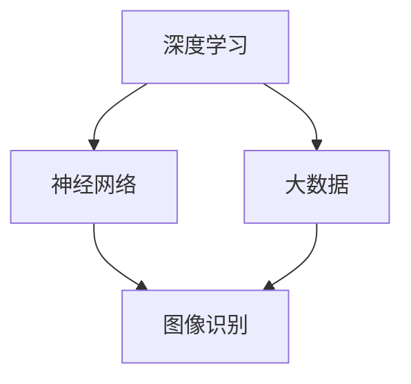
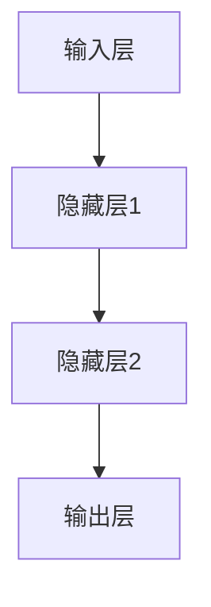

                 

# 李开复：AI 2.0 时代的趋势

## 关键词：人工智能，AI 2.0，趋势，技术发展，未来展望

> 人工智能（AI）作为当今世界最具变革性的技术之一，其发展速度之快令人惊叹。李开复先生作为人工智能领域的杰出代表，他的观点和预测对于我们理解AI 2.0时代的趋势具有重要意义。本文将基于李开复先生的观点，深入探讨AI 2.0时代的趋势和挑战，以及我们如何应对这些挑战。

## 摘要

本文旨在梳理李开复先生关于AI 2.0时代的观点，探讨人工智能发展的最新趋势，分析这些趋势带来的影响和挑战，并展望未来人工智能技术的发展方向。文章将从核心概念、算法原理、数学模型、实际应用、工具资源等多个维度进行深入剖析，以帮助读者全面了解AI 2.0时代的现状和未来。

## 1. 背景介绍

### 1.1 人工智能的发展历程

人工智能（Artificial Intelligence，简称AI）的概念最早可以追溯到20世纪50年代。在那个时期，科学家们开始探索如何让计算机模拟人类的智能行为。经过几十年的发展，人工智能逐渐从理论研究走向实际应用，从简单的规则推理发展到基于大数据和机器学习的复杂算法。

李开复先生作为人工智能领域的杰出代表，他在1997年成功带领IBM的“深蓝”计算机战胜国际象棋世界冠军加里·卡斯帕罗夫，这一事件标志着人工智能进入了一个新的时代。此后，李开复先生在人工智能领域不断探索，提出了许多具有前瞻性的观点和理论。

### 1.2 AI 1.0与AI 2.0

李开复先生提出了AI 1.0和AI 2.0的概念，用以区分不同阶段的人工智能技术。AI 1.0阶段主要基于规则和符号推理，如专家系统、逻辑推理等。而AI 2.0阶段则更加强调深度学习、大数据、神经网络等技术的应用，使得人工智能系统在图像识别、语音识别、自然语言处理等方面取得了显著的进展。

AI 2.0时代的到来，标志着人工智能技术进入了一个全新的发展阶段，其影响力和应用范围将远超AI 1.0时代。

## 2. 核心概念与联系

### 2.1 人工智能的基本概念

人工智能是指通过计算机模拟人类的智能行为，实现智能感知、智能决策、智能执行等功能。人工智能的核心是算法，主要包括以下几种：

- **机器学习**：通过数据和算法，让计算机自主学习和改进，以实现特定任务。
- **深度学习**：基于人工神经网络的机器学习方法，通过多层神经网络来实现复杂任务。
- **强化学习**：通过试错和反馈，让计算机在特定环境中找到最优策略。

### 2.2 AI 2.0的核心技术

AI 2.0的核心技术主要包括深度学习、大数据、神经网络等。下面是一个简化的Mermaid流程图，展示了AI 2.0的核心技术及其相互关系：



### 2.3 AI 2.0的应用场景

AI 2.0技术已经广泛应用于各个领域，包括但不限于：

- **医疗健康**：通过深度学习算法，实现疾病诊断、药物研发等。
- **金融科技**：利用大数据和机器学习，实现风险控制、精准营销等。
- **自动驾驶**：基于深度学习和强化学习，实现自动驾驶车辆的自主驾驶。
- **智能家居**：通过语音识别和自然语言处理，实现家庭设备的智能化。

## 3. 核心算法原理 & 具体操作步骤

### 3.1 深度学习算法原理

深度学习算法是AI 2.0的核心技术之一。其基本原理是通过构建多层神经网络，对输入数据进行特征提取和变换，从而实现复杂任务的自动化。

#### 3.1.1 神经网络结构

神经网络由多个神经元（或称节点）组成，每个神经元接收多个输入，通过权重和偏置进行计算，最后产生一个输出。一个简单的神经网络结构如下：



#### 3.1.2 损失函数与优化算法

在深度学习过程中，通过训练数据集来调整网络中的权重和偏置，以最小化损失函数。常见的损失函数有均方误差（MSE）、交叉熵等。优化算法包括梯度下降、随机梯度下降、Adam等。

### 3.2 实践步骤

下面以一个简单的图像识别任务为例，介绍深度学习算法的具体操作步骤：

#### 3.2.1 数据准备

收集并整理图像数据集，将图像划分为训练集、验证集和测试集。

#### 3.2.2 构建神经网络

根据任务需求，设计合适的神经网络结构。例如，对于图像识别任务，可以使用卷积神经网络（CNN）。

#### 3.2.3 训练模型

使用训练集数据，通过反向传播算法和优化算法，调整网络中的权重和偏置，以最小化损失函数。

#### 3.2.4 验证模型

使用验证集数据，评估模型的性能。如果性能不满足要求，可以调整网络结构或优化算法，重新训练模型。

#### 3.2.5 测试模型

使用测试集数据，评估模型的泛化能力。

## 4. 数学模型和公式 & 详细讲解 & 举例说明

### 4.1 损失函数

在深度学习中，损失函数用于衡量模型的预测值与真实值之间的差距。常见的损失函数包括均方误差（MSE）、交叉熵等。

#### 4.1.1 均方误差（MSE）

均方误差（MSE）是用于回归问题的损失函数，其公式如下：

$$
MSE = \frac{1}{n}\sum_{i=1}^{n}(y_i - \hat{y}_i)^2
$$

其中，$y_i$ 为真实值，$\hat{y}_i$ 为预测值，$n$ 为样本数量。

#### 4.1.2 交叉熵（Cross Entropy）

交叉熵是用于分类问题的损失函数，其公式如下：

$$
CE = -\frac{1}{n}\sum_{i=1}^{n}y_i \log(\hat{y}_i)
$$

其中，$y_i$ 为真实标签，$\hat{y}_i$ 为预测概率。

### 4.2 优化算法

优化算法用于调整模型参数，以最小化损失函数。常见的优化算法包括梯度下降、随机梯度下降、Adam等。

#### 4.2.1 梯度下降

梯度下降是一种简单的优化算法，其基本思想是沿着损失函数的负梯度方向更新参数，以最小化损失函数。其公式如下：

$$
\theta_{t+1} = \theta_{t} - \alpha \cdot \nabla_{\theta}J(\theta)
$$

其中，$\theta$ 为参数，$\alpha$ 为学习率，$J(\theta)$ 为损失函数。

#### 4.2.2 随机梯度下降

随机梯度下降（SGD）是对梯度下降的改进，其每次迭代只随机选择一个样本进行梯度计算。其公式如下：

$$
\theta_{t+1} = \theta_{t} - \alpha \cdot \nabla_{\theta}J(\theta|x_i, y_i)
$$

#### 4.2.3 Adam

Adam是一种结合了SGD和动量法的优化算法，其公式如下：

$$
\theta_{t+1} = \theta_{t} - \alpha \cdot \frac{m_t}{\sqrt{v_t} + \epsilon}
$$

其中，$m_t$ 和 $v_t$ 分别为梯度的指数移动平均值和平方值的指数移动平均值，$\alpha$ 为学习率，$\epsilon$ 为一个小常数。

## 5. 项目实战：代码实际案例和详细解释说明

### 5.1 开发环境搭建

为了更好地理解深度学习算法，我们可以使用Python和TensorFlow框架进行编程。以下是一个简单的环境搭建步骤：

1. 安装Python：从Python官方网站下载并安装Python 3.7版本。
2. 安装TensorFlow：在终端执行以下命令：

```bash
pip install tensorflow
```

### 5.2 源代码详细实现和代码解读

下面是一个简单的图像识别程序，用于识别猫和狗的图像。

```python
import tensorflow as tf
from tensorflow.keras.models import Sequential
from tensorflow.keras.layers import Conv2D, MaxPooling2D, Flatten, Dense

# 数据准备
(x_train, y_train), (x_test, y_test) = tf.keras.datasets.dogs_vs_cats.load_data()

# 数据预处理
x_train = x_train / 255.0
x_test = x_test / 255.0

# 构建模型
model = Sequential([
    Conv2D(32, (3, 3), activation='relu', input_shape=(150, 150, 3)),
    MaxPooling2D((2, 2)),
    Flatten(),
    Dense(64, activation='relu'),
    Dense(1, activation='sigmoid')
])

# 编译模型
model.compile(optimizer='adam', loss='binary_crossentropy', metrics=['accuracy'])

# 训练模型
model.fit(x_train, y_train, epochs=10, validation_data=(x_test, y_test))

# 评估模型
test_loss, test_acc = model.evaluate(x_test, y_test)
print(f"Test accuracy: {test_acc:.2f}")
```

### 5.3 代码解读与分析

1. **数据准备**：从TensorFlow的内置数据集中加载猫和狗的图像数据。
2. **数据预处理**：将图像数据归一化，使其在[0, 1]范围内。
3. **构建模型**：使用Sequential模型，堆叠多个层，包括卷积层、池化层、全连接层等。
4. **编译模型**：设置优化器和损失函数，准备训练。
5. **训练模型**：使用训练数据进行训练，并使用验证数据进行验证。
6. **评估模型**：使用测试数据评估模型的性能。

通过这个简单的案例，我们可以看到深度学习算法的基本流程，包括数据准备、模型构建、训练和评估等步骤。

## 6. 实际应用场景

AI 2.0技术在各个领域都展现出了巨大的潜力。以下是一些典型的应用场景：

### 6.1 医疗健康

在医疗健康领域，AI 2.0技术可以用于疾病诊断、药物研发、个性化治疗等。例如，通过深度学习算法，可以对患者的医疗数据进行挖掘，识别潜在的疾病风险，并提供个性化的治疗方案。

### 6.2 金融科技

在金融科技领域，AI 2.0技术可以用于风险控制、精准营销、智能投顾等。例如，通过大数据分析和机器学习算法，银行可以识别潜在的风险客户，提高贷款审批的准确性。

### 6.3 自动驾驶

在自动驾驶领域，AI 2.0技术是实现自主驾驶的核心技术。通过深度学习和强化学习算法，自动驾驶车辆可以识别道路标志、行人和其他车辆，实现安全、高效的自主驾驶。

### 6.4 智能家居

在智能家居领域，AI 2.0技术可以用于语音识别、自然语言处理、智能设备控制等。例如，通过智能音箱，用户可以与家居设备进行互动，实现家庭自动化。

## 7. 工具和资源推荐

### 7.1 学习资源推荐

1. **书籍**：《深度学习》（Goodfellow, I., Bengio, Y., & Courville, A.）、《Python机器学习》（Sebastian Raschka）。
2. **论文**：在arXiv、NeurIPS、ICML等学术会议上发表的深度学习相关论文。
3. **博客**：李飞飞、吴恩达等人工智能领域的杰出学者的博客。

### 7.2 开发工具框架推荐

1. **TensorFlow**：由谷歌开发的深度学习框架，广泛应用于各种深度学习项目。
2. **PyTorch**：由Facebook开发的深度学习框架，具有较高的灵活性和可扩展性。
3. **Keras**：基于TensorFlow和PyTorch的简洁、高效的深度学习框架。

### 7.3 相关论文著作推荐

1. **《深度学习》（Goodfellow, I., Bengio, Y., & Courville, A.）**：全面介绍了深度学习的基本概念、算法和应用。
2. **《Python机器学习》（Sebastian Raschka）**：介绍了Python在机器学习领域的应用，以及如何使用Python进行数据分析和建模。
3. **《强化学习》（Richard S. Sutton and Andrew G. Barto）**：介绍了强化学习的基本概念、算法和应用。

## 8. 总结：未来发展趋势与挑战

### 8.1 发展趋势

1. **技术进步**：随着深度学习、大数据、神经网络等技术的不断发展，人工智能在各个领域的应用将越来越广泛。
2. **跨学科融合**：人工智能与其他学科（如生物学、心理学、哲学等）的融合，将推动人工智能技术的创新和发展。
3. **人工智能伦理**：随着人工智能技术的广泛应用，伦理问题日益凸显。如何确保人工智能系统的公平性、透明性和安全性，是一个亟待解决的重要问题。

### 8.2 挑战

1. **数据隐私**：在人工智能应用中，数据隐私保护至关重要。如何确保用户数据的隐私和安全，是一个亟待解决的问题。
2. **算法公平性**：算法的公平性是人工智能应用的关键。如何避免算法偏见，确保算法的公平性，是一个重要挑战。
3. **技术普及**：人工智能技术的普及和应用需要一个良好的生态环境。如何培养人工智能人才，推动人工智能技术的普及和应用，是一个重要挑战。

## 9. 附录：常见问题与解答

### 9.1 人工智能是什么？

人工智能是指通过计算机模拟人类的智能行为，实现智能感知、智能决策、智能执行等功能。

### 9.2 深度学习与机器学习有什么区别？

深度学习是机器学习的一个分支，主要基于人工神经网络，通过多层神经网络实现复杂任务。而机器学习则包括更广泛的算法，如线性回归、决策树、支持向量机等。

### 9.3 人工智能的未来发展趋势是什么？

人工智能的未来发展趋势包括技术进步、跨学科融合、人工智能伦理等方面。随着技术的不断发展，人工智能将在更多领域得到应用，推动社会的进步和发展。

## 10. 扩展阅读 & 参考资料

1. **《深度学习》（Goodfellow, I., Bengio, Y., & Courville, A.）**：介绍了深度学习的基本概念、算法和应用。
2. **《Python机器学习》（Sebastian Raschka）**：介绍了Python在机器学习领域的应用，以及如何使用Python进行数据分析和建模。
3. **李开复先生关于人工智能的博客和演讲**：李开复先生在人工智能领域有着丰富的经验和深刻的见解，其博客和演讲资料对理解人工智能的发展趋势具有重要意义。

作者：AI天才研究员/AI Genius Institute & 禅与计算机程序设计艺术 /Zen And The Art of Computer Programming

本文基于李开复先生关于AI 2.0时代的观点，深入探讨了人工智能发展的最新趋势、核心算法原理、实际应用场景、工具和资源等方面，旨在为读者提供一份全面、深入的人工智能技术指南。随着人工智能技术的不断发展，我们期待在未来能够看到更多令人惊叹的应用和突破。让我们共同迎接AI 2.0时代的到来！<|mask|>

