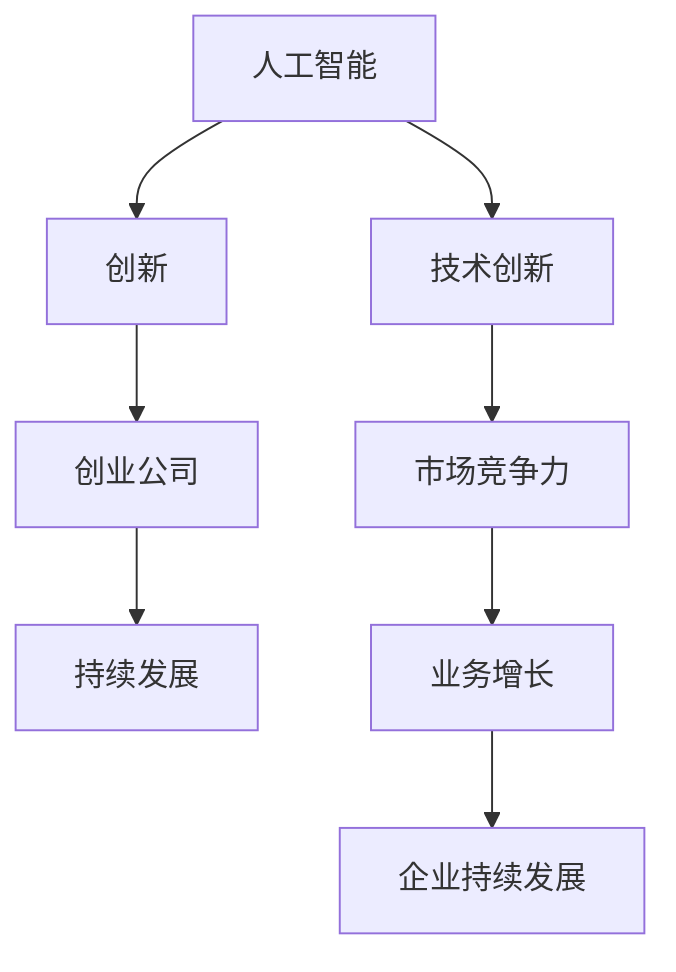

                 

### 背景介绍

《李开复：AI创业者，最焦虑的是公司能否保持创新能力》这个话题的提出，源于著名人工智能专家李开复的一次公开演讲。李开复在演讲中分享了他对于AI创业公司面临的最大挑战和焦虑点的看法。作为一名在人工智能领域拥有丰富经验和影响力的专家，李开复的见解对于AI创业公司具有重要的指导意义。

当前，人工智能正在飞速发展，越来越多的创业者涌入这一领域，试图在这个充满机遇和挑战的市场中占有一席之地。然而，随着竞争的加剧，AI创业公司面临着诸多挑战。李开复认为，其中最令他们焦虑的，莫过于公司能否持续保持创新能力。

这种焦虑并非无的放矢。创新是推动技术进步的核心动力，也是企业持续发展的关键。对于AI创业公司而言，创新能力不仅决定了他们在技术上的竞争力，还直接影响了他们的市场表现和用户满意度。如果不能持续创新，AI创业公司将难以在激烈的市场竞争中脱颖而出，甚至可能被淘汰。

本文将从以下几个方面展开讨论：首先，我们将探讨为什么创新能力对于AI创业公司至关重要；其次，我们将分析AI创业公司在保持创新能力方面面临的挑战；然后，我们将探讨如何通过策略和措施来增强公司的创新能力；接着，我们将讨论一些成功的AI创业公司是如何保持创新能力的；最后，我们将总结AI创业公司在保持创新能力方面可以采取的一些关键措施，并提出对未来发展趋势的展望。

通过本文的讨论，希望能够为AI创业公司提供一些有价值的启示和指导，帮助他们更好地应对挑战，保持持续的创新活力。

### 核心概念与联系

在探讨AI创业公司如何保持创新能力之前，有必要先了解几个核心概念，以及它们之间的联系。这些核心概念包括：人工智能、创新、创业公司、持续发展等。

#### 人工智能（AI）

人工智能，简称AI，是指通过计算机程序模拟人类智能的一种技术。它包括机器学习、深度学习、自然语言处理、计算机视觉等多个子领域。AI的核心目标是使计算机系统能够自动执行复杂的任务，并不断优化其性能。

#### 创新

创新是指通过引入新的想法、方法、产品或服务，从而创造价值的过程。在技术领域，创新意味着开发出新的算法、工具或平台，以解决现有问题或开辟新的市场。创新是推动技术进步和社会发展的重要动力。

#### 创业公司

创业公司是指由一群创业者创建，旨在通过创新来实现商业目标的企业。创业公司通常具有以下特点：风险高、灵活性高、增长速度快、资源有限。创业公司的成功与否，往往取决于其创新能力和市场适应能力。

#### 持续发展

持续发展是指企业在满足当前需求的同时，不损害后代满足其需求的能力。对于创业公司来说，持续发展意味着不仅要在短期内取得成功，还要能够在长期内保持竞争力和创新能力。

#### 核心概念的联系

人工智能、创新、创业公司和持续发展之间存在着密切的联系。人工智能为创业公司提供了新的技术手段，使他们能够开发出具有竞争力的产品和服务。创新则是创业公司的核心竞争力，决定了他们在市场中的表现。创业公司通过持续创新，可以实现持续发展，从而在激烈的市场竞争中立于不败之地。

为了更好地理解这些概念之间的关系，我们可以使用Mermaid流程图来展示它们之间的联系：



在这个流程图中，人工智能通过技术创新，提升了创业公司的市场竞争力，进而带动业务增长，最终实现企业的持续发展。创新在这个过程中起到了关键作用，它不仅推动了技术进步，还促进了业务模式的创新和市场拓展。

通过以上对核心概念及其联系的介绍，我们为接下来的讨论奠定了基础。在接下来的章节中，我们将深入探讨AI创业公司在保持创新能力方面面临的挑战和应对策略。

#### 核心算法原理 & 具体操作步骤

为了更好地理解AI创业公司在保持创新能力方面所需的技术基础，我们需要探讨一些核心算法的原理以及它们的实际操作步骤。以下是一些常见的AI算法及其操作步骤的概述：

##### 1. 机器学习（Machine Learning）

机器学习是一种通过从数据中自动学习和改进的方法，使计算机能够执行特定任务的技术。常见的机器学习算法包括：

**线性回归（Linear Regression）**

- **原理**：线性回归是一种用于预测连续值的算法，其目标是找到一个最佳拟合直线，使预测值与实际值之间的误差最小。

- **操作步骤**：
  1. 数据准备：收集并预处理数据，确保数据的质量和完整性。
  2. 特征选择：选择影响预测目标的主要特征。
  3. 模型训练：使用数据集进行训练，调整模型参数。
  4. 模型评估：使用验证集评估模型性能，调整模型参数以优化性能。

**决策树（Decision Tree）**

- **原理**：决策树是一种用于分类和回归的算法，它通过一系列的测试来将数据集分割成多个子集，并基于这些子集进行分类或回归。

- **操作步骤**：
  1. 数据准备：收集并预处理数据，确保数据的质量和完整性。
  2. 特征选择：选择影响分类或回归的主要特征。
  3. 构建决策树：通过递归划分数据集，构建决策树模型。
  4. 模型剪枝：对决策树进行剪枝，避免过拟合。

##### 2. 深度学习（Deep Learning）

深度学习是一种基于多层神经网络（Neural Networks）的学习方法，它通过模仿人脑的工作方式来处理复杂的数据。常见的深度学习算法包括：

**卷积神经网络（Convolutional Neural Network, CNN）**

- **原理**：卷积神经网络是一种用于图像识别和处理的前馈神经网络，它通过卷积操作来提取图像的特征。

- **操作步骤**：
  1. 数据准备：收集并预处理图像数据，包括归一化和数据增强。
  2. 模型构建：定义CNN架构，包括卷积层、池化层、全连接层等。
  3. 模型训练：使用数据集进行训练，优化网络参数。
  4. 模型评估：使用验证集评估模型性能，调整模型参数以优化性能。

**生成对抗网络（Generative Adversarial Network, GAN）**

- **原理**：生成对抗网络由一个生成器和一个判别器组成，生成器和判别器相互对抗，生成器试图生成逼真的数据，而判别器则试图区分真实数据和生成数据。

- **操作步骤**：
  1. 数据准备：收集并预处理数据。
  2. 模型构建：定义GAN架构，包括生成器和判别器。
  3. 模型训练：交替训练生成器和判别器，使生成器的输出逐渐接近真实数据。
  4. 模型评估：使用生成器生成的数据进行评估。

##### 3. 自然语言处理（Natural Language Processing, NLP）

自然语言处理是一种用于理解和生成自然语言（如英语、中文）的技术。常见的NLP算法包括：

**词向量（Word Embeddings）**

- **原理**：词向量是将单词映射到高维空间中的向量，使相似的单词在空间中靠近。

- **操作步骤**：
  1. 数据准备：收集并预处理文本数据，包括分词和词性标注。
  2. 模型选择：选择合适的词向量模型，如Word2Vec、GloVe。
  3. 模型训练：使用文本数据训练词向量模型。
  4. 模型应用：将词向量用于文本分类、语义分析等任务。

**序列到序列模型（Sequence to Sequence Model）**

- **原理**：序列到序列模型是一种用于序列转换的神经网络模型，如机器翻译、文本摘要等。

- **操作步骤**：
  1. 数据准备：收集并预处理序列数据，如源语言和目标语言的文本。
  2. 模型构建：定义序列到序列模型架构，包括编码器和解码器。
  3. 模型训练：使用数据集进行训练，优化模型参数。
  4. 模型评估：使用验证集评估模型性能，调整模型参数以优化性能。

通过了解这些核心算法的原理和操作步骤，AI创业公司可以更好地应对技术挑战，开发出具有市场竞争力的产品和服务。在实际应用中，创业公司需要根据具体任务的需求，选择合适的技术方案，并不断优化和改进算法，以保持其创新能力。

#### 数学模型和公式 & 详细讲解 & 举例说明

在人工智能领域，数学模型和公式是理解和应用核心算法的重要工具。以下我们将详细介绍几个关键的数学模型和公式，并通过具体例子来说明其应用和意义。

##### 1. 线性回归模型（Linear Regression）

线性回归是一种用于预测连续值的模型，其基本形式为：

$$
y = \beta_0 + \beta_1 x_1 + \beta_2 x_2 + ... + \beta_n x_n + \epsilon
$$

其中，$y$ 是目标变量，$x_1, x_2, ..., x_n$ 是输入特征，$\beta_0, \beta_1, \beta_2, ..., \beta_n$ 是模型参数，$\epsilon$ 是误差项。

**例1：预测房价**

假设我们要预测一栋房子的价格，使用线性回归模型。我们收集了以下数据：

- 输入特征：房屋面积（$x_1$）和房屋年龄（$x_2$）。
- 目标变量：房屋价格（$y$）。

数据预处理后，模型参数通过最小二乘法（Least Squares Method）计算得到：

$$
\beta_0 = 50000, \beta_1 = 100, \beta_2 = -1000
$$

使用这个模型，我们可以预测给定面积和年龄的房子的价格。例如，对于面积为150平方米，年龄为5年的房子，预测价格为：

$$
y = 50000 + 100 \times 150 + (-1000) \times 5 = 64500
$$

##### 2. 决策树模型（Decision Tree）

决策树是一种用于分类和回归的模型，其结构如下：

```
        [根节点]
       /         \
      /           \
     /             \
   [内部节点]    [内部节点]
    /      \         /     \
   /        \       /       \
 [叶节点] [叶节点] [叶节点] [叶节点]
```

每个内部节点表示一个特征，每个叶节点表示一个类或值。路径从根节点到叶节点的决策序列构成了一个决策规则。

**例2：分类诊断**

假设我们有一个诊断模型，用于判断病人是否患有心脏病。输入特征包括血压（$x_1$）、胆固醇（$x_2$）和心电图异常（$x_3$）。

决策树模型如下：

```
     [根节点]
    /     \
   /       \
[高血压] [非高血压]
  /    \         /     \
 /     \       /       \
[高胆固醇] [低胆固醇] [心电图异常] [无心电图异常]
         /    \           /       \
        /     \         /         \
      [心脏病] [无心脏病] [心脏病] [无心脏病]
```

根据病人的特征，我们可以通过决策树得到其是否患有心脏病的预测结果。

##### 3. 卷积神经网络（Convolutional Neural Network, CNN）

卷积神经网络是一种用于图像识别和处理的前馈神经网络。其基本结构包括卷积层（Convolutional Layer）、池化层（Pooling Layer）和全连接层（Fully Connected Layer）。

**例3：图像分类**

假设我们要使用CNN对图片进行分类，输入图像的大小为32x32像素。

- **卷积层**：使用卷积核（Kernel）对图像进行卷积操作，提取特征。

  $$ 
  \text{output} = \text{ReLU}(\text{conv}(\text{input}, \text{kernel}) + \text{bias}) 
  $$

- **池化层**：对卷积层输出的特征进行池化操作，降低特征图的尺寸。

  $$ 
  \text{output} = \text{pool}(\text{input}, \text{pool_size}) 
  $$

- **全连接层**：将池化层的输出进行全连接操作，得到分类结果。

  $$ 
  \text{output} = \text{softmax}(\text{FC}(\text{input})) 
  $$

使用这个过程，我们可以对输入图像进行分类，输出概率最高的类别。

通过以上例子，我们可以看到数学模型和公式在人工智能应用中的重要性。这些模型不仅帮助我们理解和预测数据，还为算法的优化和改进提供了理论基础。

#### 项目实战：代码实际案例和详细解释说明

为了更好地展示如何在实际项目中应用人工智能算法，以下我们将通过一个具体的案例——一个简单的图像分类项目，详细解释代码的实现过程和关键步骤。

##### 1. 开发环境搭建

在进行图像分类项目之前，首先需要搭建一个适合的编程环境。以下是推荐的开发工具和库：

- 编程语言：Python（版本3.8以上）
- 深度学习框架：TensorFlow 2.x
- 数据预处理库：NumPy、Pandas
- 图像处理库：OpenCV

安装以上库后，我们可以开始编写代码。

##### 2. 源代码详细实现和代码解读

下面是一个简单的图像分类项目的代码实现，我们将使用卷积神经网络（CNN）对图片进行分类。

```python
import tensorflow as tf
from tensorflow.keras import layers
import numpy as np
import cv2

# 数据预处理
def preprocess_image(image_path, target_size):
    image = cv2.imread(image_path)
    image = cv2.resize(image, target_size)
    image = image / 255.0
    image = np.expand_dims(image, axis=0)
    return image

# 构建CNN模型
def create_cnn_model(input_shape, num_classes):
    model = tf.keras.Sequential([
        layers.Conv2D(32, (3, 3), activation='relu', input_shape=input_shape),
        layers.MaxPooling2D((2, 2)),
        layers.Conv2D(64, (3, 3), activation='relu'),
        layers.MaxPooling2D((2, 2)),
        layers.Conv2D(128, (3, 3), activation='relu'),
        layers.Flatten(),
        layers.Dense(128, activation='relu'),
        layers.Dense(num_classes, activation='softmax')
    ])
    return model

# 训练模型
def train_model(model, train_images, train_labels, val_images, val_labels, epochs=10):
    model.compile(optimizer='adam',
                  loss='categorical_crossentropy',
                  metrics=['accuracy'])
    model.fit(train_images, train_labels, epochs=epochs, validation_data=(val_images, val_labels))

# 主函数
def main():
    # 加载数据
    # 这里我们使用Keras内置的CIFAR-10数据集进行训练
    (train_images, train_labels), (val_images, val_labels) = tf.keras.datasets.cifar10.load_data()

    # 预处理数据
    train_images = preprocess_images(train_images, target_size=(32, 32))
    val_images = preprocess_images(val_images, target_size=(32, 32))

    # 转换标签为one-hot编码
    train_labels = tf.keras.utils.to_categorical(train_labels, 10)
    val_labels = tf.keras.utils.to_categorical(val_labels, 10)

    # 创建模型
    model = create_cnn_model(input_shape=(32, 32, 3), num_classes=10)

    # 训练模型
    train_model(model, train_images, train_labels, val_images, val_labels)

if __name__ == '__main__':
    main()
```

**代码解读：**

1. **数据预处理**：
   - 使用OpenCV加载图像，并调整为指定大小。
   - 将图像归一化到[0, 1]区间，并添加一个维度，使其变为批量形式（batch-wise）。

2. **构建CNN模型**：
   - 使用Keras的Sequential模型，堆叠卷积层、池化层和全连接层。
   - 卷积层使用ReLU激活函数，池化层使用最大池化（Max Pooling）。
   - 最后的全连接层使用softmax激活函数，以进行分类。

3. **训练模型**：
   - 使用编译后的模型进行训练，并使用交叉熵损失函数（categorical_crossentropy）和Adam优化器。
   - 使用fit函数训练模型，并在验证集上进行性能评估。

##### 3. 代码解读与分析

上述代码分为三个主要部分：数据预处理、模型构建和模型训练。

- **数据预处理**：
  数据预处理是深度学习项目中的关键步骤。在这里，我们首先使用OpenCV读取图像，并将其调整为固定的尺寸（32x32）。这一步是为了确保所有图像都具有相同的大小，从而方便模型处理。接下来，将图像的像素值归一化到[0, 1]区间，这有助于模型收敛。最后，通过`np.expand_dims`添加一个维度，使其从单个图像转换为批量图像，这是深度学习模型所期望的输入格式。

- **模型构建**：
  我们使用Keras的Sequential模型构建一个简单的CNN。这个模型包含多个卷积层和池化层，以提取图像的层次特征。卷积层使用ReLU激活函数，以增加模型的非线性能力。池化层用于下采样，减少模型的参数数量，防止过拟合。最后，我们使用全连接层进行分类，输出层的激活函数为softmax，用于计算各个类别的概率。

- **模型训练**：
  模型训练是深度学习项目的核心步骤。在这里，我们使用编译后的模型，通过fit函数进行训练。我们选择交叉熵损失函数和Adam优化器，以最小化模型预测和实际标签之间的差距。在训练过程中，我们使用验证集进行性能评估，以确保模型在未知数据上的泛化能力。

通过以上代码和分析，我们可以看到如何将CNN应用于图像分类任务。这个简单的案例展示了从数据预处理到模型构建、训练的完整流程。在实际项目中，我们可能需要处理更复杂的数据和模型，但基本流程是相似的。通过理解这些基本概念和步骤，AI创业公司可以开发出具有市场竞争力的图像分类系统。

#### 实际应用场景

AI技术的快速发展和广泛应用，使得AI创业公司在各个领域都有了丰富的应用场景。以下我们将探讨一些典型的实际应用场景，并分析AI技术在其中的具体作用。

##### 1. 医疗保健

医疗保健是AI技术的重要应用领域之一。通过AI，医生可以更准确地诊断疾病，提高治疗的效果。以下是一些具体的应用场景：

- **疾病诊断**：AI可以通过分析大量的医学图像和病历数据，帮助医生更准确地诊断疾病，如乳腺癌、肺癌等。例如，使用深度学习模型分析CT扫描图像，可以大大提高肺癌的早期诊断率。
  
- **个性化治疗**：AI可以根据患者的基因信息、病历数据和生活习惯，提供个性化的治疗方案。例如，基于患者的基因组数据和疾病历史，AI可以帮助医生选择最适合的药物组合。

- **药物研发**：AI可以加速新药的发现和开发。通过模拟和预测药物与生物分子之间的相互作用，AI可以加速筛选和优化药物候选分子，减少研发成本和时间。

##### 2. 金融科技

金融科技（FinTech）是另一个AI技术的重要应用领域。AI在金融科技中的具体作用包括：

- **风险管理**：AI可以通过分析大量的金融数据，帮助金融机构识别潜在的风险。例如，通过分析交易数据和用户行为，AI可以预测欺诈行为，并采取相应的预防措施。

- **智能投顾**：AI可以帮助个人投资者进行资产配置和投资决策。基于用户的投资目标和风险偏好，AI可以提供个性化的投资建议，帮助用户实现资产的增值。

- **信用评分**：AI可以通过分析借款人的历史数据和行为，更准确地评估其信用风险。例如，使用机器学习模型分析借款人的消费记录、社交媒体行为等数据，可以提供更准确的信用评分。

##### 3. 智能制造

智能制造是工业4.0的核心，AI技术在其中的作用包括：

- **生产优化**：AI可以帮助企业优化生产流程，提高生产效率。例如，通过分析生产数据，AI可以预测设备故障，提前进行维护，减少停机时间。

- **质量管理**：AI可以通过分析产品质量数据，识别潜在的质量问题，并优化生产过程。例如，使用计算机视觉技术检测产品的缺陷，提高产品的质量。

- **供应链管理**：AI可以帮助企业优化供应链管理，降低库存成本。例如，通过分析市场需求和库存数据，AI可以预测未来的需求，优化库存水平，减少库存成本。

##### 4. 交通运输

交通运输是AI技术的另一个重要应用领域。AI在交通运输中的作用包括：

- **智能交通管理**：AI可以帮助交通管理部门优化交通流量，减少拥堵。例如，通过分析交通数据，AI可以预测交通拥堵，并调整信号灯的时间，优化交通流量。

- **自动驾驶**：自动驾驶是AI技术在交通运输中的典型应用。通过使用深度学习和计算机视觉技术，自动驾驶汽车可以实现自主驾驶，提高交通安全和效率。

- **物流优化**：AI可以帮助物流企业优化运输路线和配送时间，提高物流效率。例如，通过分析交通状况和配送需求，AI可以优化配送路线，减少运输时间和成本。

通过以上实际应用场景的分析，我们可以看到AI技术在各个领域的广泛应用和巨大潜力。AI创业公司通过在各个领域应用AI技术，不仅可以提升企业的竞争力，还可以推动整个行业的发展。

#### 工具和资源推荐

在AI创业公司的日常开发和研究过程中，选择合适的工具和资源是至关重要的一步。以下我们将推荐一些学习资源、开发工具和相关论文，以帮助创业公司提升技术实力和创新能力。

##### 1. 学习资源推荐

- **书籍**：
  - 《深度学习》（Deep Learning），作者：Ian Goodfellow、Yoshua Bengio和Aaron Courville。
  - 《Python机器学习》（Python Machine Learning），作者：Sebastian Raschka。
  - 《统计学习方法》，作者：李航。

- **在线课程**：
  - Coursera的《机器学习》课程，由Andrew Ng教授主讲。
  - Udacity的《深度学习纳米学位》。
  - edX的《人工智能基础》课程。

- **博客和网站**：
  - Medium上的AI和机器学习相关文章。
  - TensorFlow官方文档和博客。
  - Keras官方文档和GitHub仓库。

##### 2. 开发工具框架推荐

- **深度学习框架**：
  - TensorFlow 2.x：谷歌开发的强大开源深度学习框架。
  - PyTorch：Facebook开发的灵活且易于使用的深度学习框架。
  - Keras：基于TensorFlow的高层神经网络API，便于快速实验和部署。

- **数据处理工具**：
  - Pandas：Python的数据分析库，用于数据处理和分析。
  - NumPy：Python的科学计算库，用于数组计算和操作。
  - Scikit-learn：Python的机器学习库，提供了多种机器学习算法和工具。

- **版本控制工具**：
  - Git：分布式版本控制系统，用于代码的版本管理和协作开发。
  - GitHub：基于Git的代码托管平台，提供了丰富的协作和项目管理功能。

##### 3. 相关论文著作推荐

- **顶级会议和期刊**：
  - NeurIPS（神经信息处理系统会议）：机器学习和计算神经科学的顶级会议。
  - ICML（国际机器学习会议）：机器学习的顶级会议。
  - JMLR（机器学习研究期刊）：机器学习的顶级期刊。

- **经典论文**：
  - "A Learning Algorithm for Continually Running Fully Recurrent Neural Networks"（1990），作者：Sepp Hochreiter和Jürgen Schmidhuber。
  - "Deep Learning"（2015），作者：Ian Goodfellow、Yoshua Bengio和Aaron Courville。
  - "Programming for Machine Learning"，作者：Simon Segal。

通过利用这些学习和开发资源，AI创业公司可以不断提升其技术水平和创新能力，从而在激烈的市场竞争中保持领先地位。

### 总结：未来发展趋势与挑战

随着人工智能技术的不断发展，AI创业公司面临着前所未有的机遇和挑战。未来，AI创业公司将在以下几个方面呈现出显著的发展趋势：

#### 1. 技术融合与创新

未来的AI创业公司将更加注重技术的融合与创新。跨学科的知识融合将成为关键，例如将AI与生物技术、医学、材料科学等领域结合，创造全新的应用场景。此外，创业公司将不断探索新的算法和模型，以提升AI系统的性能和可靠性。

#### 2. 数据驱动与自优化

数据是AI的基石。未来，AI创业公司将更加依赖海量数据驱动模型的发展，通过不断优化数据采集、处理和利用，提高模型的准确性和适应性。自优化将成为AI系统的重要特性，通过自我学习和调整，实现持续改进。

#### 3. 安全性与隐私保护

随着AI技术的广泛应用，安全性和隐私保护将日益重要。未来的AI创业公司将必须关注系统的安全性和隐私保护，确保用户数据的安全和隐私。同时，开发符合伦理规范和法律法规的AI产品和服务，将成为企业发展的关键。

#### 4. 自动化与智能化

自动化和智能化将是未来AI创业公司的重要发展方向。通过自动化技术，企业可以大幅提高生产效率和降低成本。智能化技术将使系统具备自主学习和决策能力，从而实现更高效、更智能的运营管理。

#### 挑战与应对策略

尽管未来充满机遇，但AI创业公司也面临着诸多挑战。以下是几个主要挑战及其应对策略：

#### 1. 技术壁垒

AI技术的高门槛使得创业公司难以迅速进入市场。应对策略：公司可以通过建立强大的技术团队，积极引进高水平人才，提升技术实力。同时，与其他技术公司合作，共享技术和资源，降低进入市场的难度。

#### 2. 数据获取与隐私

数据获取和隐私保护是AI创业公司面临的重要挑战。应对策略：公司应注重数据采集的合法性和合规性，确保用户隐私不被侵犯。同时，通过数据加密和隐私保护技术，提高数据安全性。

#### 3. 竞争压力

随着越来越多的创业者进入AI领域，竞争压力不断加大。应对策略：公司应注重差异化竞争，开发具有独特优势的产品和服务。同时，通过不断优化用户体验和提升服务质量，增强市场竞争力。

#### 4. 资金压力

资金压力是AI创业公司普遍面临的问题。应对策略：公司可以通过多元化的融资渠道，如风险投资、政府补贴等，获取足够的资金支持。此外，通过提高运营效率和管理水平，降低成本，确保企业的可持续发展。

### 结论

未来，AI创业公司将在技术融合与创新、数据驱动与自优化、安全性与隐私保护、自动化与智能化等方面展现出巨大的发展潜力。尽管面临诸多挑战，通过积极应对和战略布局，AI创业公司有望在激烈的市场竞争中脱颖而出，推动人工智能技术的广泛应用和产业发展。让我们期待AI创业公司未来更加辉煌的成就！

### 附录：常见问题与解答

在本文中，我们讨论了AI创业公司如何保持创新能力的多个方面，包括背景介绍、核心概念、算法原理、数学模型、实际应用场景以及未来发展趋势等。为了帮助读者更好地理解和应用本文的内容，以下列举了一些常见问题及解答。

#### 问题1：为什么创新能力对于AI创业公司至关重要？

解答：创新能力是AI创业公司的核心竞争力。它不仅决定了公司在技术上的竞争力，还直接影响了公司的市场表现和用户满意度。在快速发展的AI领域，如果不能持续创新，公司很难在激烈的市场竞争中保持领先地位，甚至可能被淘汰。

#### 问题2：AI创业公司在保持创新能力方面面临哪些挑战？

解答：AI创业公司在保持创新能力方面主要面临以下挑战：
1. **技术壁垒**：AI技术的高门槛使得创业公司难以迅速进入市场。
2. **数据获取与隐私**：数据获取和隐私保护是重要挑战，公司需确保数据采集的合法性和合规性。
3. **竞争压力**：随着越来越多的创业者进入AI领域，竞争压力不断加大。
4. **资金压力**：资金压力是AI创业公司普遍面临的问题。

#### 问题3：如何通过策略和措施来增强公司的创新能力？

解答：增强创新能力可以从以下几个方面入手：
1. **人才引进**：建立强大的技术团队，引进高水平的人才。
2. **合作与资源共享**：与其他技术公司合作，共享技术和资源。
3. **持续学习与培训**：定期进行技术培训和知识更新，提升团队的技术水平。
4. **多元化融资**：通过多元化的融资渠道获取资金支持。
5. **优化管理**：提高运营效率和管理水平，降低成本。

#### 问题4：AI创业公司如何应对技术快速发展的挑战？

解答：AI创业公司可以通过以下措施应对技术快速发展的挑战：
1. **技术前瞻性**：关注最新技术动态，提前布局。
2. **敏捷开发**：采用敏捷开发方法，快速迭代和优化产品。
3. **开放合作**：与其他公司和技术团队建立合作关系，共同开发新技术。
4. **持续投资**：保持对技术研发的持续投资，确保技术领先地位。

通过以上常见问题与解答，希望读者能够更好地理解AI创业公司在保持创新能力方面的重要性、面临的挑战以及应对策略。这些信息将有助于AI创业公司在未来的发展中取得更大的成功。

### 扩展阅读 & 参考资料

为了进一步深入了解AI创业公司的创新能力和未来发展，以下推荐一些扩展阅读和参考资料，涵盖学习资源、开发工具、经典论文和学术会议：

1. **学习资源**：
   - 《人工智能：一种现代的方法》（Artificial Intelligence: A Modern Approach），作者：Stuart Russell和Peter Norvig。
   - 《强化学习：原理与实例》（Reinforcement Learning: An Introduction），作者：Richard S. Sutton和Andrew G. Barto。
   - Coursera的《强化学习》课程，由David Silver教授主讲。

2. **开发工具**：
   - TensorFlow官方文档：[https://www.tensorflow.org/](https://www.tensorflow.org/)
   - PyTorch官方文档：[https://pytorch.org/docs/stable/](https://pytorch.org/docs/stable/)
   - Keras官方文档：[https://keras.io/](https://keras.io/)

3. **经典论文**：
   - "Learning to Learn from Human Preferences"，作者：Pieter Abbeel、Simon Osindero、Yujia Li和Shane Legg。
   - "Deep Learning Without Feeds and Servers"，作者：Ian Goodfellow、David F. Sontag和Acer Nived Raghunathan。
   - "Generative Adversarial Networks"，作者：Ian Goodfellow、Jeffrey Pouget-Abadie、Mehdi Mirza和Yoshua Bengio。

4. **学术会议**：
   - NeurIPS（神经信息处理系统会议）：[https://neurips.cc/](https://neurips.cc/)
   - ICML（国际机器学习会议）：[https://icml.cc/](https://icml.cc/)
   - CVPR（计算机视觉与模式识别会议）：[https://cvpr.org/](https://cvpr.org/)

这些资源将帮助读者更深入地理解AI领域的最新研究和技术动态，为创业公司的创新发展提供有力支持。

