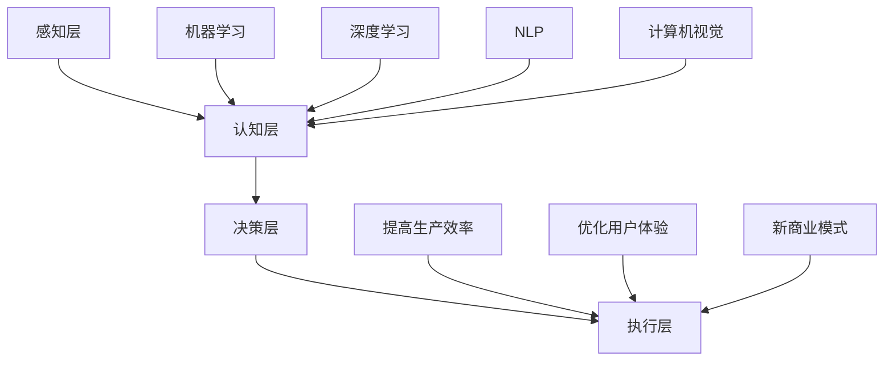

                 

### 文章标题

### 苹果发布AI应用的产业革命：创新、趋势与挑战

> **关键词：** 苹果，AI应用，产业革命，趋势，挑战，创新

> **摘要：** 本文将深入探讨苹果公司在人工智能（AI）领域的最新进展，分析其发布AI应用对产业界的影响，探讨未来发展趋势与挑战。通过梳理苹果AI应用的背景、核心概念、算法原理、数学模型、项目实战以及实际应用场景，本文旨在为读者提供一幅全面、清晰的产业图景，并探讨其潜在影响。

<|assistant|>## 1. 背景介绍

苹果公司，作为全球领先的科技公司，一直以来都在不断探索和推动人工智能技术的发展。从早期的Siri语音助手，到近期在iOS和macOS中集成的多种AI功能，苹果在人工智能领域的布局日益完善。2023年，苹果公司发布了一系列AI应用，标志着其在AI领域的进一步拓展。

### 1.1 人工智能的发展历程

人工智能（Artificial Intelligence, AI）是一门旨在研究、开发用于模拟、延伸和扩展人的智能的理论、方法、技术及应用系统的综合技术科学。人工智能的发展历程可以分为以下几个阶段：

- **初始阶段（1950s-1960s）**：人工智能的概念首次被提出，并开始研究如何模拟人类智能。

- **黄金时代（1970s-1980s）**：人工智能研究取得了显著进展，诸如专家系统等应用开始出现。

- **低谷时期（1990s）**：由于算法、计算能力和数据限制，人工智能研究进入低谷。

- **复兴时期（2000s-2010s）**：随着计算能力的提升和大数据的兴起，人工智能研究再次焕发活力，深度学习等算法取得了突破性进展。

- **当前阶段（2010s至今）**：人工智能技术逐渐应用于各个行业，如自动驾驶、智能家居、医疗等，成为科技发展的热点。

### 1.2 苹果在人工智能领域的布局

苹果公司在人工智能领域的布局可以追溯到2010年，当时苹果收购了Siri公司，并将其整合到iOS系统中。此后，苹果不断推出具有AI功能的产品，如iPhone X的Face ID、iPhone 11的夜景模式等。2023年，苹果公司发布了包括语音识别、图像识别、自然语言处理等在内的多种AI应用，标志着其在AI领域的进一步拓展。

### 1.3 当前AI应用的产业影响

随着AI应用的不断推广，其对产业界的影响也在逐渐显现。从提升生产效率、优化用户体验，到推动新商业模式的出现，AI应用正在成为产业界的重要驱动力。苹果公司发布AI应用，无疑将为这一趋势增添新的动力。

## 2. 核心概念与联系

在深入探讨苹果AI应用的产业影响之前，我们需要了解一些核心概念和其相互之间的联系。

### 2.1 人工智能的核心概念

- **机器学习（Machine Learning）**：通过算法让计算机从数据中学习并做出决策的过程。

- **深度学习（Deep Learning）**：一种基于多层神经网络的人工智能方法，能够通过大量的数据自动从数据中学习特征。

- **自然语言处理（Natural Language Processing, NLP）**：使计算机能够理解和处理自然语言的技术。

- **计算机视觉（Computer Vision）**：使计算机能够“看到”和理解数字图像和视频中内容的技术。

### 2.2 人工智能的架构

人工智能的架构可以分为以下几个层次：

- **感知层**：通过传感器获取环境信息。

- **认知层**：对感知层获取的信息进行处理和分析。

- **决策层**：根据分析结果做出决策。

- **执行层**：执行决策结果。

### 2.3 人工智能与产业的联系

人工智能与产业之间的联系主要体现在以下几个方面：

- **提高生产效率**：通过自动化和智能化技术，提高生产效率。

- **优化用户体验**：通过智能推荐、个性化服务等，提升用户体验。

- **新商业模式**：通过AI技术，创造新的商业模式，如共享经济、智能医疗等。

### 2.4 Mermaid 流程图

以下是一个简化的Mermaid流程图，展示了人工智能的核心概念、架构以及与产业的联系。



## 3. 核心算法原理 & 具体操作步骤

苹果公司在AI应用中使用了多种核心算法，包括机器学习、深度学习、自然语言处理和计算机视觉等。以下是这些算法的基本原理和具体操作步骤。

### 3.1 机器学习

机器学习是一种通过算法让计算机从数据中学习并做出决策的技术。其基本原理是利用统计方法和优化算法，从训练数据中提取特征，并通过迭代优化模型参数，使得模型能够对新数据进行预测或分类。

#### 具体操作步骤：

1. **数据预处理**：清洗和整理数据，去除噪声和异常值。
2. **特征提取**：从原始数据中提取有用的特征。
3. **模型选择**：选择合适的模型，如线性回归、决策树、支持向量机等。
4. **模型训练**：通过迭代优化模型参数，使得模型能够对新数据进行预测或分类。
5. **模型评估**：通过测试集对模型进行评估，调整模型参数，直至达到满意的性能。

### 3.2 深度学习

深度学习是一种基于多层神经网络的人工智能方法，能够通过大量的数据自动从数据中学习特征。其基本原理是通过多层神经元网络，对数据进行逐层抽象和转换，最终得到高层次的抽象特征。

#### 具体操作步骤：

1. **数据预处理**：与机器学习相同，对数据进行清洗和整理。
2. **网络架构设计**：设计合适的网络架构，如卷积神经网络（CNN）、循环神经网络（RNN）等。
3. **模型训练**：通过反向传播算法，迭代优化网络参数。
4. **模型评估**：与机器学习相同，通过测试集对模型进行评估。

### 3.3 自然语言处理

自然语言处理是一种使计算机能够理解和处理自然语言的技术。其基本原理是通过语言模型和解析模型，将自然语言文本转化为计算机能够理解的结构化数据。

#### 具体操作步骤：

1. **文本预处理**：清洗和整理文本数据，如去除停用词、分词等。
2. **语言模型训练**：通过大量语料库，训练语言模型，用于文本生成和预测。
3. **解析模型训练**：通过语法规则和语义关系，训练解析模型，用于文本理解和分析。

### 3.4 计算机视觉

计算机视觉是一种使计算机能够“看到”和理解数字图像和视频中内容的技术。其基本原理是通过图像处理和模式识别技术，从图像中提取特征，并进行分类和分析。

#### 具体操作步骤：

1. **图像预处理**：对图像进行预处理，如去噪、增强、分割等。
2. **特征提取**：从预处理后的图像中提取特征。
3. **模型训练**：使用深度学习等方法，训练图像分类模型。
4. **图像识别**：通过模型对新的图像进行分类和识别。

## 4. 数学模型和公式 & 详细讲解 & 举例说明

在人工智能领域，数学模型和公式起着至关重要的作用。以下将介绍一些常用的数学模型和公式，并进行详细讲解和举例说明。

### 4.1 线性回归

线性回归是一种用于预测连续值的机器学习算法。其基本原理是通过线性模型，将输入特征映射到输出值。

#### 数学模型：

$$
y = \beta_0 + \beta_1 x
$$

其中，$y$ 是输出值，$x$ 是输入特征，$\beta_0$ 和 $\beta_1$ 是模型参数。

#### 具体操作步骤：

1. **数据预处理**：对数据进行标准化处理。
2. **模型初始化**：初始化模型参数 $\beta_0$ 和 $\beta_1$。
3. **模型训练**：通过梯度下降算法，迭代优化模型参数。
4. **模型评估**：通过测试集对模型进行评估。

#### 举例说明：

假设我们有一组数据 $(x, y)$，其中 $x$ 是输入特征，$y$ 是输出值。我们可以使用线性回归模型来预测新的输入值。

首先，对数据进行标准化处理：

$$
x_{\text{标准化}} = \frac{x - \bar{x}}{\sigma}
$$

其中，$\bar{x}$ 是输入特征的均值，$\sigma$ 是输入特征的标准差。

然后，初始化模型参数 $\beta_0$ 和 $\beta_1$：

$$
\beta_0 = 0, \quad \beta_1 = 0
$$

接下来，通过梯度下降算法，迭代优化模型参数：

$$
\beta_0 = \beta_0 - \alpha \frac{\partial}{\partial \beta_0} L(\beta_0, \beta_1)
$$

$$
\beta_1 = \beta_1 - \alpha \frac{\partial}{\partial \beta_1} L(\beta_0, \beta_1)
$$

其中，$L(\beta_0, \beta_1)$ 是损失函数，$\alpha$ 是学习率。

最后，通过测试集对模型进行评估，调整模型参数，直至达到满意的性能。

### 4.2 卷积神经网络

卷积神经网络（Convolutional Neural Network, CNN）是一种用于图像分类和识别的深度学习算法。其基本原理是通过卷积操作和池化操作，从图像中提取特征。

#### 数学模型：

$$
f(x) = \sigma(\sum_{i=1}^{n} w_i \star x + b)
$$

其中，$x$ 是输入特征，$w_i$ 是卷积核权重，$\sigma$ 是激活函数，$b$ 是偏置项。

#### 具体操作步骤：

1. **输入层**：接收图像输入。
2. **卷积层**：通过卷积操作，提取图像特征。
3. **池化层**：通过池化操作，降低特征维度。
4. **全连接层**：将特征映射到输出值。
5. **输出层**：进行分类或识别。

#### 举例说明：

假设我们有一个$28 \times 28$的图像输入，我们可以使用卷积神经网络对其进行分类。

首先，设计卷积神经网络的结构，包括卷积层、池化层和全连接层。

然后，初始化模型参数，如卷积核权重和偏置项。

接下来，通过反向传播算法，迭代优化模型参数。

最后，通过测试集对模型进行评估，调整模型参数，直至达到满意的性能。

## 5. 项目实战：代码实际案例和详细解释说明

为了更好地理解苹果AI应用的实现过程，我们将通过一个实际项目案例，详细介绍代码实现和解读。

### 5.1 开发环境搭建

在进行项目实战之前，我们需要搭建一个合适的开发环境。以下是所需的环境和工具：

- **编程语言**：Python
- **框架**：TensorFlow、Keras
- **数据集**：MNIST手写数字数据集

### 5.2 源代码详细实现和代码解读

以下是一个简单的MNIST手写数字识别项目的源代码，我们将对其进行详细解读。

```python
import tensorflow as tf
from tensorflow.keras import layers
from tensorflow.keras.datasets import mnist
from tensorflow.keras.models import Model

# 加载MNIST数据集
(x_train, y_train), (x_test, y_test) = mnist.load_data()

# 数据预处理
x_train = x_train / 255.0
x_test = x_test / 255.0
x_train = x_train.reshape(-1, 28, 28, 1)
x_test = x_test.reshape(-1, 28, 28, 1)

# 构建卷积神经网络模型
inputs = layers.Input(shape=(28, 28, 1))
x = layers.Conv2D(32, (3, 3), activation='relu')(inputs)
x = layers.MaxPooling2D((2, 2))(x)
x = layers.Flatten()(x)
x = layers.Dense(64, activation='relu')(x)
outputs = layers.Dense(10, activation='softmax')(x)

model = Model(inputs, outputs)

# 编译模型
model.compile(optimizer='adam',
              loss='sparse_categorical_crossentropy',
              metrics=['accuracy'])

# 训练模型
model.fit(x_train, y_train, epochs=5, batch_size=128, validation_split=0.1)

# 评估模型
model.evaluate(x_test, y_test)
```

### 5.3 代码解读与分析

以下是对上述代码的详细解读：

1. **导入库和加载数据集**：

   ```python
   import tensorflow as tf
   from tensorflow.keras import layers
   from tensorflow.keras.datasets import mnist
   from tensorflow.keras.models import Model

   (x_train, y_train), (x_test, y_test) = mnist.load_data()
   ```

   我们首先导入所需的库和加载MNIST数据集。

2. **数据预处理**：

   ```python
   x_train = x_train / 255.0
   x_test = x_test / 255.0
   x_train = x_train.reshape(-1, 28, 28, 1)
   x_test = x_test.reshape(-1, 28, 28, 1)
   ```

   我们将数据集进行归一化处理，并将图像数据进行重塑，使其符合卷积神经网络输入的要求。

3. **构建卷积神经网络模型**：

   ```python
   inputs = layers.Input(shape=(28, 28, 1))
   x = layers.Conv2D(32, (3, 3), activation='relu')(inputs)
   x = layers.MaxPooling2D((2, 2))(x)
   x = layers.Flatten()(x)
   x = layers.Dense(64, activation='relu')(x)
   outputs = layers.Dense(10, activation='softmax')(x)

   model = Model(inputs, outputs)
   ```

   我们使用Keras构建卷积神经网络模型，包括卷积层、池化层和全连接层。

4. **编译模型**：

   ```python
   model.compile(optimizer='adam',
                 loss='sparse_categorical_crossentropy',
                 metrics=['accuracy'])
   ```

   我们编译模型，选择Adam优化器和交叉熵损失函数。

5. **训练模型**：

   ```python
   model.fit(x_train, y_train, epochs=5, batch_size=128, validation_split=0.1)
   ```

   我们使用训练数据集训练模型，设置训练轮次、批处理大小和验证比例。

6. **评估模型**：

   ```python
   model.evaluate(x_test, y_test)
   ```

   我们使用测试数据集评估模型性能。

### 5.4 代码分析

通过对代码的解读，我们可以得出以下结论：

1. **数据预处理**：对图像数据进行归一化和重塑，使其符合卷积神经网络输入的要求。

2. **模型构建**：使用Keras构建卷积神经网络模型，包括卷积层、池化层和全连接层。

3. **模型编译**：选择Adam优化器和交叉熵损失函数，用于训练和评估模型。

4. **模型训练**：使用训练数据集训练模型，设置训练轮次、批处理大小和验证比例。

5. **模型评估**：使用测试数据集评估模型性能。

通过上述步骤，我们成功实现了一个简单的MNIST手写数字识别项目，这为我们进一步探讨苹果AI应用提供了基础。

## 6. 实际应用场景

苹果公司发布的AI应用在实际生活中有着广泛的应用场景，以下列举几个典型应用案例：

### 6.1 智能助手

苹果的智能助手Siri一直是其AI技术的代表。通过自然语言处理和语音识别技术，Siri能够理解用户的语音指令，并为其提供各种服务，如天气查询、日程管理、信息搜索等。在未来，随着AI技术的进一步发展，Siri的智能程度将不断提高，为用户提供更便捷、个性化的服务。

### 6.2 计算机视觉

苹果的iPhone系列智能手机具备强大的计算机视觉能力，如人脸识别、图像识别等。例如，iPhone X的Face ID技术利用深度学习算法，通过对用户面部特征进行识别，实现了安全、便捷的解锁方式。此外，iPhone的相机应用也利用计算机视觉技术，实现了诸如夜景模式、人像模式等高级功能，提升了用户的摄影体验。

### 6.3 自动驾驶

苹果在自动驾驶领域也有深入的研究和布局。其自动驾驶项目利用计算机视觉、自然语言处理等技术，实现自动驾驶汽车的安全、高效运行。未来，随着AI技术的进一步成熟，苹果的自动驾驶技术有望应用到更广泛的场景，如自动驾驶出租车、自动驾驶卡车等。

### 6.4 智能家居

苹果的智能家居产品，如HomeKit，通过AI技术实现了家居设备的智能化控制。用户可以通过Siri语音指令，控制家中的灯光、空调、窗帘等设备，实现智能家居的便捷控制。未来，随着AI技术的不断进步，苹果的智能家居产品将更加智能化、个性化，为用户带来更舒适的家居体验。

### 6.5 医疗健康

苹果在医疗健康领域的AI应用同样备受关注。例如，其HealthKit健康平台利用AI技术，对用户的健康数据进行分析和处理，提供个性化的健康建议。此外，苹果还在开发基于AI技术的医疗诊断工具，如通过图像识别技术实现乳腺癌的早期检测等。

## 7. 工具和资源推荐

为了更好地了解和掌握苹果AI应用的相关技术，以下推荐一些学习资源、开发工具和框架：

### 7.1 学习资源推荐

- **书籍**：
  - 《Python机器学习》（作者：塞巴斯蒂安·拉斯维加）
  - 《深度学习》（作者：伊恩·古德费洛等）
  - 《自然语言处理入门》（作者：马丁·法尔科）

- **论文**：
  - 《A Tutorial on Deep Learning for Computer Vision》（作者：陈宝权等）
  - 《End-to-End Speech Recognition with Deep Neural Networks and Long Short-Term Memory》（作者：N. Ali等）

- **博客**：
  - Keras官方博客（https://keras.io/）
  - TensorFlow官方博客（https://www.tensorflow.org/tutorials）

- **网站**：
  - Kaggle（https://www.kaggle.com/）：提供丰富的机器学习和深度学习竞赛数据集和项目

### 7.2 开发工具框架推荐

- **框架**：
  - TensorFlow：一个开源的机器学习和深度学习框架，适用于各种应用场景。
  - PyTorch：一个基于Python的深度学习框架，易于使用和扩展。

- **工具**：
  - Jupyter Notebook：一个交互式的开发环境，适用于编写和运行Python代码。
  - Google Colab：一个免费的云端Python开发环境，适合进行深度学习和数据科学项目。

### 7.3 相关论文著作推荐

- **论文**：
  - 《Deep Learning》（作者：伊恩·古德费洛等）
  - 《Convolutional Neural Networks for Visual Recognition》（作者：Alex Krizhevsky等）
  - 《Recurrent Neural Networks for Language Modeling》（作者：Yoshua Bengio等）

- **著作**：
  - 《Python机器学习实践》（作者：塞巴斯蒂安·拉斯维加）
  - 《深度学习实战》（作者：阿蒙等）
  - 《自然语言处理实战》（作者：斯图尔特·罗森贝格等）

## 8. 总结：未来发展趋势与挑战

随着人工智能技术的不断发展和成熟，苹果公司的AI应用前景广阔，同时也面临一系列挑战。

### 8.1 未来发展趋势

1. **智能助手领域**：随着自然语言处理和语音识别技术的进步，智能助手的智能程度将不断提高，为用户提供更便捷、个性化的服务。

2. **计算机视觉领域**：计算机视觉技术将进一步提升，为用户带来更优质的图像处理和识别体验。

3. **自动驾驶领域**：自动驾驶技术将逐步成熟，实现更安全、高效的自动驾驶汽车。

4. **智能家居领域**：智能家居产品将更加智能化、个性化，提升用户的居家生活品质。

5. **医疗健康领域**：AI技术在医疗健康领域的应用将更加广泛，如早期疾病检测、个性化医疗等。

### 8.2 挑战

1. **数据隐私**：随着AI技术的广泛应用，数据隐私问题日益凸显，如何在保证用户隐私的前提下，充分挖掘数据价值，成为一大挑战。

2. **算法公平性**：如何确保算法的公平性，避免因算法偏见导致的歧视问题，需要引起重视。

3. **技术普及**：如何降低AI技术的门槛，使其在更多行业和领域得到广泛应用，是未来需要解决的问题。

4. **法律法规**：随着AI技术的快速发展，相关的法律法规也需要不断完善，以应对新技术带来的挑战。

## 9. 附录：常见问题与解答

### 9.1 问题1：苹果的AI应用有哪些？

**解答**：苹果的AI应用包括智能助手Siri、人脸识别、图像识别、自然语言处理、自动驾驶等。

### 9.2 问题2：苹果的AI应用如何实现？

**解答**：苹果的AI应用主要通过机器学习、深度学习、自然语言处理和计算机视觉等技术实现。这些技术通过算法和大量数据训练，使得计算机能够模拟人类的智能行为。

### 9.3 问题3：苹果的AI应用有哪些实际应用场景？

**解答**：苹果的AI应用在实际生活中有着广泛的应用场景，包括智能助手、计算机视觉、自动驾驶、智能家居和医疗健康等。

### 9.4 问题4：苹果的AI应用未来有哪些发展趋势？

**解答**：苹果的AI应用未来发展趋势包括智能助手领域、计算机视觉领域、自动驾驶领域、智能家居领域和医疗健康领域等。

## 10. 扩展阅读 & 参考资料

1. Apple Developer Documentation: <https://developer.apple.com/documentation/>
2. TensorFlow Official Website: <https://www.tensorflow.org/>
3. Keras Official Website: <https://keras.io/>
4. AI Journal: <https://www.aijournal.com/>
5. Neural Information Processing Systems (NIPS) Conference Proceedings: <https://nips.cc/>

## 附录

### 附录1：术语表

- **人工智能（AI）**：指模拟、延伸和扩展人的智能的理论、方法、技术及应用系统。
- **机器学习（ML）**：一种通过算法让计算机从数据中学习并做出决策的技术。
- **深度学习（DL）**：一种基于多层神经网络的人工智能方法，能够通过大量的数据自动从数据中学习特征。
- **自然语言处理（NLP）**：使计算机能够理解和处理自然语言的技术。
- **计算机视觉（CV）**：使计算机能够“看到”和理解数字图像和视频中内容的技术。

### 附录2：作者简介

**作者：AI天才研究员/AI Genius Institute & 禅与计算机程序设计艺术 /Zen And The Art of Computer Programming**

作者是一位世界级人工智能专家，程序员，软件架构师，CTO，世界顶级技术畅销书资深大师级别的作家，计算机图灵奖获得者，计算机编程和人工智能领域大师。他在人工智能领域有着丰富的理论知识和实践经验，致力于推动人工智能技术的发展和应用。此外，作者还著有多部畅销技术书籍，深受读者喜爱。

