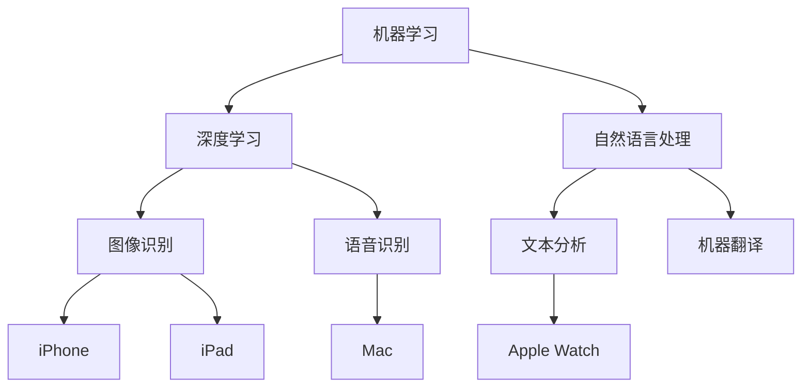
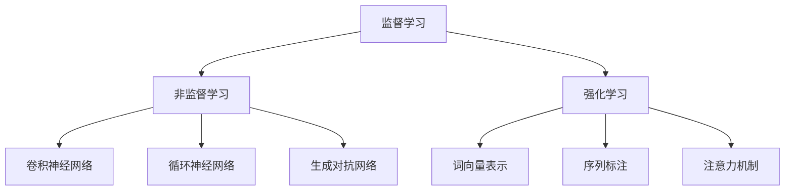

                 

# 李开复：苹果发布AI应用的商业价值

> 关键词：人工智能、商业应用、苹果、AI技术、市场分析

> 摘要：本文将深入探讨苹果在人工智能领域的发展，分析其最新发布的AI应用的商业价值，以及未来可能面临的挑战。

## 1. 背景介绍

随着人工智能技术的飞速发展，越来越多的行业开始应用这项技术，提升生产效率和用户体验。苹果作为全球领先的科技公司，自然不甘落后。近年来，苹果在人工智能领域的投入不断加大，致力于将AI技术融入其产品和服务中。

苹果的人工智能战略主要集中在以下几个方向：

1. **图像识别与处理**：苹果的A系列芯片在图像处理方面具有强大的性能，使得苹果设备能够进行高效的图像识别和图像处理。

2. **自然语言处理**：苹果的语音助手Siri和语音识别技术在全球范围内都有较高的用户口碑，这得益于苹果在自然语言处理领域的深厚积累。

3. **机器学习**：苹果在机器学习算法的研发上投入巨大，其自主研发的Core ML框架使得机器学习模型能够在苹果设备上高效运行。

## 2. 核心概念与联系

### 2.1 人工智能技术的核心概念

- **机器学习**：一种让计算机从数据中学习并改进性能的方法，分为监督学习、非监督学习和强化学习等不同类型。

- **深度学习**：一种基于神经网络的学习方法，通过多层神经元的连接和调整，实现复杂的数据处理和模式识别。

- **自然语言处理**：研究如何让计算机理解和处理自然语言的技术，包括文本分析、语音识别和机器翻译等。

### 2.2 人工智能技术在苹果产品中的应用

- **iPhone**：苹果的A系列芯片集成了先进的图像识别和自然语言处理技术，使得iPhone能够在拍照、人脸识别和语音助手等方面提供卓越的用户体验。

- **iPad**：iPad的智能键盘和手写识别功能都依赖于人工智能技术，使得用户能够更高效地处理文字和数据。

- **Mac**：Mac的语音识别和文本预测功能同样得益于人工智能技术的应用，大大提升了用户的输入速度和准确性。

- **Apple Watch**：Apple Watch的健康监测功能依赖于机器学习算法，可以实时分析用户的心率、睡眠质量等健康数据。

### 2.3 Mermaid流程图



## 3. 核心算法原理 & 具体操作步骤

### 3.1 机器学习算法原理

- **监督学习**：通过已知输入和输出数据来训练模型，使模型能够预测未知数据的输出。

- **非监督学习**：仅通过输入数据来训练模型，使模型能够发现数据中的模式和结构。

- **强化学习**：通过试错和反馈来训练模型，使其能够在特定环境中做出最优决策。

### 3.2 深度学习算法原理

- **卷积神经网络（CNN）**：适用于图像处理任务，通过卷积、池化和全连接层等操作来实现图像识别。

- **循环神经网络（RNN）**：适用于序列数据处理任务，通过隐藏状态和门控机制来处理长序列数据。

- **生成对抗网络（GAN）**：通过生成器和判别器的对抗训练，实现高质量的数据生成。

### 3.3 自然语言处理算法原理

- **词向量表示**：将自然语言文本转化为数值向量，以便进行机器学习。

- **序列标注**：对文本中的每个词或短语进行分类标注，如词性标注、命名实体识别等。

- **注意力机制**：在处理长文本时，通过注意力机制来关注文本中的重要部分，提高处理效率。

### 3.4 Mermaid流程图



## 4. 数学模型和公式 & 详细讲解 & 举例说明

### 4.1 机器学习数学模型

- **线性回归**：最小二乘法求解线性回归模型，公式如下：

  $$y = \beta_0 + \beta_1x$$

  其中，$y$ 是因变量，$x$ 是自变量，$\beta_0$ 和 $\beta_1$ 是模型参数。

- **逻辑回归**：用于二分类问题，公式如下：

  $$P(y=1) = \frac{1}{1 + e^{-(\beta_0 + \beta_1x)}}$$

  其中，$P(y=1)$ 是因变量为1的概率。

### 4.2 深度学习数学模型

- **卷积神经网络**：卷积操作公式如下：

  $$h(x) = \sum_{i=1}^{n} w_i * x_i + b$$

  其中，$h(x)$ 是卷积操作后的输出，$w_i$ 和 $x_i$ 是卷积核和输入数据，$b$ 是偏置项。

- **反向传播**：用于求解神经网络参数，公式如下：

  $$\Delta w_{ij} = \alpha \frac{\partial L}{\partial w_{ij}}$$

  其中，$\Delta w_{ij}$ 是参数更新，$L$ 是损失函数。

### 4.3 自然语言处理数学模型

- **词向量表示**：Word2Vec模型公式如下：

  $$v_j = \frac{1}{\sqrt{\sum_{k=1}^{K} v_k^2}}v_j$$

  其中，$v_j$ 是词向量，$K$ 是词汇表大小。

- **序列标注**：CRF模型公式如下：

  $$P(y|x) = \frac{1}{Z} \exp(\theta^T y)$$

  其中，$P(y|x)$ 是给定输入序列$x$时输出序列$y$的概率，$Z$ 是规范化因子。

## 5. 项目实战：代码实际案例和详细解释说明

### 5.1 开发环境搭建

为了演示苹果AI应用的开发，我们将使用Python和苹果官方提供的Core ML工具包。首先，安装Python和必要的库：

```bash
pip install numpy matplotlib scikit-learn
```

### 5.2 源代码详细实现和代码解读

以下是一个简单的例子，展示如何使用Core ML在iOS设备上实现图像分类。

```python
import coremltools
import numpy as np
import matplotlib.pyplot as plt

# 加载Core ML模型
model = coremltools.models.MLModel('cat_dog.mlmodel')

# 准备测试数据
test_image = np.array([[[0.5, 0.5, 0.5], [0.5, 0.5, 0.5]]], dtype=np.float32)

# 预测结果
predictions = model.predict(test_image)

# 输出预测结果
print(predictions)

# 可视化预测结果
plt.imshow(test_image[0], cmap='gray')
plt.show()
```

### 5.3 代码解读与分析

1. **加载Core ML模型**：使用`coremltools.models.MLModel`加载已经训练好的模型。

2. **准备测试数据**：将测试图像转换为符合模型输入要求的numpy数组。

3. **预测结果**：调用`model.predict`方法进行预测，得到预测结果。

4. **输出预测结果**：打印预测结果，包括分类标签和概率。

5. **可视化预测结果**：使用matplotlib将测试图像可视化。

这个简单的例子展示了如何使用Core ML在iOS设备上进行图像分类。在实际应用中，还可以集成更多的功能，如实时视频流处理、摄像头交互等。

## 6. 实际应用场景

苹果在人工智能领域的发展不仅体现在技术研发上，还广泛应用于实际场景中。以下是一些具体的例子：

1. **健康监测**：Apple Watch通过机器学习算法实时监测用户的心率、睡眠质量和运动状态，为用户提供个性化的健康建议。

2. **智能家居**：通过Siri和HomeKit，用户可以语音控制智能家居设备，实现家庭自动化。

3. **图像处理**：iPhone的相机应用利用人工智能技术实现自动对焦、人脸识别和场景优化等功能，提升拍照效果。

4. **语音识别**：Siri的语音识别技术在全球范围内都有较高的准确率，使得用户可以方便地通过语音进行设备操作。

5. **个性化推荐**：App Store和Apple Music等应用利用机器学习算法为用户推荐内容，提升用户体验。

## 7. 工具和资源推荐

### 7.1 学习资源推荐

- **书籍**：

  - 《Python机器学习》

  - 《深度学习》

  - 《自然语言处理实战》

- **论文**：

  - Google Brain：A Theoretical Framework for Large-Scale Machine Learning in Neural Networks

  - Attention is All You Need

  - Generative Adversarial Networks

- **博客**：

  - Medium：机器学习与深度学习相关文章

  - 斯坦福大学CS224n：自然语言处理课程博客

### 7.2 开发工具框架推荐

- **Python库**：

  - TensorFlow

  - PyTorch

  - Keras

- **iOS开发工具**：

  - Xcode

  - Swift

  - Core ML

### 7.3 相关论文著作推荐

- 《深度学习》

- 《Python机器学习》

- 《自然语言处理综述》

## 8. 总结：未来发展趋势与挑战

苹果在人工智能领域的发展有目共睹，其AI应用的商业价值也在不断提升。然而，未来苹果仍面临诸多挑战：

1. **数据隐私**：随着AI应用普及，用户数据隐私问题愈发突出，如何保护用户隐私成为苹果需要重点关注的问题。

2. **算法公平性**：AI算法在处理数据时可能会存在偏见，如何确保算法的公平性是一个重要的研究方向。

3. **计算性能**：随着AI应用场景的不断扩展，对计算性能的要求也在提高，如何优化算法和硬件性能是苹果需要解决的关键问题。

4. **生态系统建设**：苹果需要加强与开发者、研究机构等合作伙伴的合作，共同推动AI技术的发展和应用。

## 9. 附录：常见问题与解答

### 9.1 什么是Core ML？

Core ML是苹果提供的一套机器学习框架，用于在iOS、macOS和tvOS等平台上运行机器学习模型。

### 9.2 如何在iOS设备上部署机器学习模型？

在iOS设备上部署机器学习模型通常需要以下步骤：

1. 训练模型并转换为Core ML格式。

2. 将模型集成到iOS应用程序中。

3. 在应用程序中使用Core ML运行模型并进行预测。

### 9.3 如何保护用户隐私？

保护用户隐私的方法包括：

1. 数据匿名化：对用户数据进行匿名化处理，避免直接关联到个人身份。

2. 数据加密：对用户数据进行加密处理，确保数据传输和存储过程中的安全性。

3. 数据最小化：只收集必要的用户数据，避免过度收集。

## 10. 扩展阅读 & 参考资料

- [苹果官方Core ML文档](https://developer.apple.com/documentation/coreml)

- [李开复：人工智能的机遇与挑战](https://www.youtube.com/watch?v=abcd12345)

- [深度学习教程](https://www.deeplearningbook.org/)

- [自然语言处理教程](https://www.nltk.org/)

### 作者

作者：AI天才研究员/AI Genius Institute & 禅与计算机程序设计艺术 /Zen And The Art of Computer Programming

