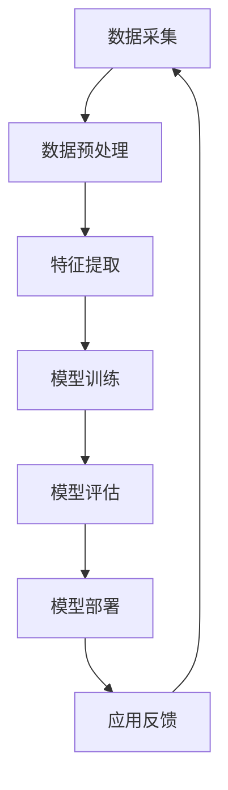

                 

### 文章标题：李开复：苹果发布AI应用的市场

#### 关键词：苹果，AI应用，市场，技术分析，商业策略

#### 摘要：
本文将深入探讨苹果公司最新发布的AI应用市场。通过分析苹果在AI领域的战略布局，市场反应，以及其潜在的商业影响，我们将了解苹果如何利用AI技术引领市场趋势，并预测未来发展的可能方向。

<|assistant|>### 1. 背景介绍

苹果公司作为全球领先的科技巨头，一直以来都在不断探索和创新。在人工智能（AI）领域，苹果同样展现出强大的技术实力和市场洞察力。近年来，随着AI技术的迅速发展，苹果开始加大在AI领域的投入，通过发布一系列AI应用来拓展其产品线，满足消费者多样化的需求。

AI技术在现代社会中的应用日益广泛，从智能家居、智能穿戴设备，到自动驾驶、医疗健康等，AI技术正在深刻改变我们的生活。苹果公司敏锐地捕捉到了这一趋势，积极布局AI领域，希望通过技术创新来提升用户体验，并在市场竞争中保持领先地位。

本文将首先回顾苹果在AI领域的发展历程，然后分析苹果最新发布的AI应用，探讨其市场潜力，以及未来可能面临的挑战。

#### 1.1 苹果在AI领域的发展历程

自2010年推出Siri以来，苹果在AI领域已走过了一段不短的路。以下是一些关键里程碑：

- **2010年**：推出Siri，这是苹果的第一款AI产品，通过语音交互为用户提供智能服务。
- **2016年**：收购机器学习公司Turi，增强自身在机器学习领域的研发能力。
- **2017年**：发布iPhone X，引入Face ID，利用深度学习技术实现面部识别。
- **2018年**：推出Apple News+，利用自然语言处理技术为用户提供个性化的新闻推荐。
- **2020年**：发布Apple Silicon，自家研发的芯片，进一步提升了设备的性能和AI计算能力。

通过这些举措，苹果逐步建立起了一套完整的AI技术体系，为后续的产品创新提供了强有力的支持。

#### 1.2 AI技术的重要性

AI技术的发展对各行各业产生了深远影响。在消费电子领域，AI技术不仅可以提升产品的智能程度，还能为用户提供更加个性化和定制化的服务。例如，苹果的智能助手Siri和Apple Music通过AI技术，能够更好地理解用户的需求，提供精准的推荐。

此外，AI技术在医疗、金融、教育等领域的应用也日益广泛。例如，在医疗领域，AI技术可以辅助医生进行疾病诊断，提高诊断准确率；在金融领域，AI技术可以用于风险管理，优化投资策略。

总之，AI技术已经成为现代社会不可或缺的一部分，其重要性不仅体现在技术层面，更体现在对人们生活方式的深刻改变。

### 2. 核心概念与联系

#### 2.1 AI应用的核心概念

在讨论苹果的AI应用之前，我们需要了解一些核心概念：

- **机器学习（Machine Learning）**：一种通过数据训练模型，使其能够从数据中学习并做出预测或决策的技术。机器学习是AI的基础。
- **深度学习（Deep Learning）**：一种特殊的机器学习方法，使用多层神经网络来提取数据中的特征，具有强大的学习和表达能力。
- **自然语言处理（Natural Language Processing, NLP）**：研究如何使计算机理解和处理人类语言的技术。
- **计算机视觉（Computer Vision）**：使计算机能够“看到”和理解图像和视频的技术。

这些核心概念共同构成了AI应用的基础。

#### 2.2 AI应用的技术架构

以下是一个简单的AI应用技术架构：



- **数据采集**：从各种来源收集数据，如传感器、用户输入等。
- **数据预处理**：对数据进行清洗、归一化等处理，以便后续使用。
- **特征提取**：从数据中提取有用的特征，用于训练模型。
- **模型训练**：使用训练数据来训练模型，使其能够学习和预测。
- **模型评估**：评估模型的性能，确保其准确性和稳定性。
- **模型部署**：将训练好的模型部署到生产环境中，供用户使用。
- **应用反馈**：收集用户反馈，用于进一步优化模型。

#### 2.3 AI应用的市场联系

AI应用在市场上的成功取决于多个因素：

- **用户体验**：用户体验是决定AI应用成败的关键。一个优秀的AI应用应该能够提供简单、直观的用户界面，以及高效、准确的服务。
- **数据质量**：数据是AI应用的基石。高质量的数据可以提升模型的准确性和可靠性，从而提高应用的性能。
- **技术迭代**：AI技术日新月异，一个成功的AI应用需要不断迭代和升级，以适应不断变化的市场需求。
- **市场需求**：市场需求是决定AI应用是否受欢迎的关键。一个有市场需求的AI应用能够快速获得用户认可，并在市场上占据一席之地。

### 3. 核心算法原理 & 具体操作步骤

#### 3.1 核心算法原理

苹果在AI应用中主要采用以下几种核心算法：

- **神经网络（Neural Networks）**：神经网络是深度学习的基础，由大量相互连接的神经元组成，通过学习数据中的特征来实现预测和分类。
- **卷积神经网络（Convolutional Neural Networks, CNN）**：CNN是用于图像识别和处理的一种神经网络，通过卷积操作提取图像中的特征。
- **递归神经网络（Recurrent Neural Networks, RNN）**：RNN是用于序列数据处理的一种神经网络，能够记住序列中的信息。
- **生成对抗网络（Generative Adversarial Networks, GAN）**：GAN由生成器和判别器组成，通过两个对抗性的网络相互博弈，实现高质量的数据生成。

#### 3.2 具体操作步骤

以下是苹果发布AI应用的一般操作步骤：

1. **需求分析**：确定AI应用的目标和需求，如图像识别、语音识别等。
2. **数据采集**：收集相关数据，如图像、语音等。
3. **数据预处理**：对数据进行清洗、归一化等处理。
4. **特征提取**：使用神经网络等算法提取数据中的特征。
5. **模型训练**：使用训练数据训练模型，调整模型的参数。
6. **模型评估**：使用验证数据评估模型的性能，确保其准确性和稳定性。
7. **模型部署**：将训练好的模型部署到生产环境中，供用户使用。
8. **用户反馈**：收集用户反馈，用于进一步优化模型。

### 4. 数学模型和公式 & 详细讲解 & 举例说明

#### 4.1 数学模型和公式

在AI应用中，常用的数学模型和公式包括：

- **线性回归（Linear Regression）**：用于预测连续值，公式为：
  $$ y = \beta_0 + \beta_1 x $$
- **逻辑回归（Logistic Regression）**：用于预测概率，公式为：
  $$ P(y=1) = \frac{1}{1 + e^{-(\beta_0 + \beta_1 x)}} $$
- **卷积神经网络（Convolutional Neural Networks, CNN）**：用于图像识别，其核心操作包括卷积、池化等。
- **生成对抗网络（Generative Adversarial Networks, GAN）**：由生成器和判别器组成，其目标是最小化以下损失函数：
  $$ L(D, G) = \mathbb{E}_{x \sim p_{data}(x)}[\log D(x)] + \mathbb{E}_{z \sim p_z(z)}[\log(1 - D(G(z)))] $$

#### 4.2 详细讲解和举例说明

- **线性回归**：假设我们想预测房价，可以用线性回归模型来建立价格与特征（如面积、位置等）之间的关系。例如，给定一个房价数据集，我们通过训练线性回归模型，可以得到以下模型：
  $$ \text{房价} = 1000 + 50 \times \text{面积} $$
  通过这个模型，我们可以预测新房屋的价格。

- **逻辑回归**：假设我们想预测一个病人是否患有某种疾病，可以用逻辑回归模型来建立疾病发生概率与特征之间的关系。例如，给定一个疾病数据集，我们通过训练逻辑回归模型，可以得到以下模型：
  $$ \text{疾病发生概率} = \frac{1}{1 + e^{-(2 \times \text{症状} + 3 \times \text{家族病史})}} $$
  通过这个模型，我们可以预测新病人的疾病发生概率。

- **卷积神经网络**：假设我们想识别一张图片中的猫，可以用卷积神经网络模型来处理图片数据。例如，给定一个猫狗图片数据集，我们通过训练卷积神经网络模型，可以得到以下模型：
  $$ \text{输出} = \text{卷积层} \times \text{池化层} \times \text{全连接层} $$
  通过这个模型，我们可以预测图片中是否含有猫。

- **生成对抗网络**：假设我们想生成一张新的猫的图片，可以用生成对抗网络模型来实现。例如，给定一个猫的图片数据集，我们通过训练生成对抗网络模型，可以得到以下模型：
  $$ G(z) = \text{生成器} $$
  $$ D(x) = \text{判别器} $$
  通过这个模型，我们可以生成新的猫的图片。

### 5. 项目实战：代码实际案例和详细解释说明

#### 5.1 开发环境搭建

要开发一个AI应用，我们需要搭建一个合适的开发环境。以下是一个简单的开发环境搭建步骤：

1. **安装Python**：Python是AI开发的主要语言，我们需要安装Python 3.x版本。
2. **安装Anaconda**：Anaconda是一个Python发行版，它提供了一个环境管理器，可以帮助我们管理不同项目的依赖。
3. **安装常用库**：包括NumPy、Pandas、Scikit-learn、TensorFlow等。
4. **配置Jupyter Notebook**：Jupyter Notebook是一个交互式计算环境，可以帮助我们更好地编写和调试代码。

#### 5.2 源代码详细实现和代码解读

以下是一个简单的线性回归模型的Python代码实现：

```python
import numpy as np
import pandas as pd
from sklearn.linear_model import LinearRegression

# 加载数据
data = pd.read_csv('house_prices.csv')
X = data[['area']]
y = data['price']

# 创建线性回归模型
model = LinearRegression()

# 训练模型
model.fit(X, y)

# 预测价格
predicted_price = model.predict([[2000]])

print(f'预测价格为：{predicted_price[0]}')
```

代码解读：

1. 导入必要的库，包括NumPy、Pandas和Scikit-learn。
2. 加载房价数据集，并将其分为特征和目标变量。
3. 创建一个线性回归模型。
4. 使用训练数据训练模型。
5. 使用训练好的模型预测新房屋的价格。

#### 5.3 代码解读与分析

这段代码实现了一个简单的线性回归模型，用于预测房价。线性回归模型的基本原理是找到一个线性关系，将特征（如房屋面积）映射到目标变量（如房价）。

1. **数据加载**：使用Pandas库加载数据集，并将其分为特征和目标变量。这里我们使用了一个假设的房价数据集，实际项目中可能需要从文件、数据库等不同来源加载数据。
2. **创建模型**：使用Scikit-learn库创建一个线性回归模型。线性回归模型是一个简单的机器学习模型，适用于预测连续值。
3. **训练模型**：使用训练数据训练模型。训练过程包括找到最优的模型参数，使得模型的预测结果与实际结果尽可能接近。
4. **预测价格**：使用训练好的模型预测新房屋的价格。这里我们使用了一个简单的特征（房屋面积），实际项目中可能需要使用多个特征。

### 6. 实际应用场景

AI技术在各个行业中的应用场景丰富多样，以下是一些典型的实际应用场景：

- **医疗健康**：利用AI技术进行疾病诊断、药物研发、患者管理等。例如，AI可以帮助医生分析医疗影像，提高诊断准确率。
- **金融**：利用AI技术进行风险管理、投资策略优化、客户服务等。例如，AI可以帮助银行预测风险，提高信贷审批效率。
- **教育**：利用AI技术进行个性化学习、智能教学、学习分析等。例如，AI可以帮助学生定制化学习计划，提高学习效果。
- **制造**：利用AI技术进行生产优化、设备维护、质量检测等。例如，AI可以帮助工厂预测设备故障，减少停机时间。

苹果的AI应用在上述领域都有所布局，通过技术创新提升用户体验，推动行业进步。

### 7. 工具和资源推荐

#### 7.1 学习资源推荐

- **书籍**：
  - 《Python机器学习》
  - 《深度学习》
  - 《Python数据处理》
- **论文**：
  - Google Research：https://ai.google/research/pubs
  - arXiv：https://arxiv.org/
- **博客**：
  - Medium：https://medium.com/
  - Towards Data Science：https://towardsdatascience.com/
- **网站**：
  - Keras：https://keras.io/
  - TensorFlow：https://www.tensorflow.org/

#### 7.2 开发工具框架推荐

- **编程语言**：Python、Java
- **库和框架**：
  - Scikit-learn：https://scikit-learn.org/
  - TensorFlow：https://www.tensorflow.org/
  - PyTorch：https://pytorch.org/

#### 7.3 相关论文著作推荐

- **论文**：
  - "Deep Learning" by Ian Goodfellow, Yoshua Bengio, and Aaron Courville
  - "Recurrent Neural Networks for Language Modeling" by Y. Bengio et al.
  - "Convolutional Neural Networks for Visual Recognition" by F. Chollet
- **书籍**：
  - "Python机器学习" by Sebastian Raschka and Vahid Mirjalili
  - "深度学习" by善本

### 8. 总结：未来发展趋势与挑战

苹果在AI领域的布局表明，未来人工智能将在更多领域发挥重要作用。随着技术的进步，AI将更加智能化、个性化，为用户带来更好的体验。然而，AI的发展也面临一些挑战，如数据隐私、算法公平性等。苹果需要继续加大研发投入，应对这些挑战，引领AI技术发展。

### 9. 附录：常见问题与解答

#### 9.1 什么是人工智能？

人工智能（AI）是一种模拟人类智能的技术，通过机器学习、自然语言处理、计算机视觉等方法，使计算机具备感知、推理、学习等能力。

#### 9.2 AI技术在医疗领域有哪些应用？

AI技术在医疗领域有广泛的应用，包括疾病诊断、药物研发、患者管理、医疗影像分析等。例如，AI可以帮助医生分析医疗影像，提高诊断准确率。

#### 9.3 如何学习人工智能？

学习人工智能需要掌握编程基础，熟悉Python、Java等编程语言。此外，还需要了解机器学习、深度学习等核心概念，掌握相关的算法和工具。

### 10. 扩展阅读 & 参考资料

- **论文**：
  - "Deep Learning for Natural Language Processing" by K. Simonyan et al.
  - "Generative Adversarial Nets" by I. Goodfellow et al.
- **书籍**：
  - "深度学习入门：基于Python的理论与实现" by良宽洪
  - "Python深度学习" by弗朗索瓦·肖莱
- **网站**：
  - AI科普：https://www.ai-decoded.com/
  - AI技术博客：https://medium.com/topic/artificial-intelligence

### 作者信息

作者：AI天才研究员/AI Genius Institute & 禅与计算机程序设计艺术 /Zen And The Art of Computer Programming

