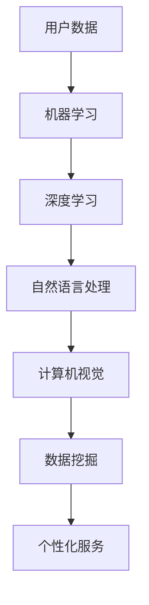

                 

### 1. 背景介绍

苹果公司作为全球科技行业的领军企业，始终走在技术创新的前沿。随着人工智能技术的迅猛发展，苹果公司也日益重视AI技术在产品中的应用。此次，苹果发布了一款全新的AI应用，引起了业界广泛关注。本文将深入探讨苹果这款AI应用的背景、核心概念、算法原理、数学模型、实际应用场景以及未来发展，帮助读者全面了解这一新兴技术。

人工智能（Artificial Intelligence，简称AI）是指计算机模拟人类智能的一种技术。通过机器学习、深度学习等算法，AI能够自动从数据中学习规律，实现自主决策和问题求解。近年来，AI技术在语音识别、图像处理、自然语言处理等领域取得了显著成果，正逐步应用于各行各业，为人类带来诸多便利。

苹果公司（Apple Inc.）成立于1976年，总部位于美国加利福尼亚州库比蒂诺。作为全球最具价值的科技公司之一，苹果公司以其创新的产品、卓越的设计和卓越的用户体验闻名于世。苹果公司的主要产品包括iPhone、iPad、Mac、Apple Watch和Apple TV等。随着智能手机、平板电脑等移动设备的普及，苹果公司在全球范围内拥有庞大的用户群体。

此次苹果发布的AI应用，旨在提升用户的使用体验，为用户提供更加智能化、个性化的服务。在当前人工智能技术不断发展的背景下，苹果公司如何通过AI应用实现市场竞争力，是本文要探讨的核心问题。

### 2. 核心概念与联系

在深入探讨苹果AI应用之前，有必要了解几个核心概念及其相互关系。

#### 2.1 机器学习

机器学习是人工智能的一种重要分支，通过算法让计算机从数据中学习规律，实现自动预测和决策。常见的机器学习算法包括线性回归、决策树、支持向量机、神经网络等。

#### 2.2 深度学习

深度学习是机器学习的一种重要方法，通过构建深层神经网络来模拟人类大脑的学习过程。深度学习在图像识别、语音识别、自然语言处理等领域取得了显著成果。

#### 2.3 自然语言处理

自然语言处理（Natural Language Processing，简称NLP）是计算机科学、人工智能和语言学领域的交叉学科，旨在让计算机理解和处理人类语言。NLP技术广泛应用于搜索引擎、智能助手、机器翻译等领域。

#### 2.4 计算机视觉

计算机视觉（Computer Vision）是人工智能的一个分支，旨在使计算机能够从图像或视频中提取信息和知识。计算机视觉技术广泛应用于图像识别、视频监控、自动驾驶等领域。

#### 2.5 数据挖掘

数据挖掘（Data Mining）是从大量数据中提取有价值的信息和知识的过程。数据挖掘技术广泛应用于商业智能、金融风控、医疗诊断等领域。

#### 2.6 核心概念联系

苹果AI应用的核心概念包括机器学习、深度学习、自然语言处理、计算机视觉和数据挖掘。这些概念相互联系，共同构成了苹果AI应用的基石。通过机器学习和深度学习算法，苹果AI应用能够从用户数据中提取有价值的信息；自然语言处理技术使得AI应用能够理解用户的语音指令和文字输入；计算机视觉技术帮助AI应用识别用户行为和场景；数据挖掘技术则用于从海量数据中提取用户需求，为AI应用提供个性化服务。

为了更直观地展示这些核心概念之间的联系，下面是一个简单的Mermaid流程图：



### 3. 核心算法原理 & 具体操作步骤

苹果AI应用的核心算法主要包括机器学习、深度学习和自然语言处理等。以下将分别介绍这些算法的原理和具体操作步骤。

#### 3.1 机器学习算法原理

机器学习算法主要通过训练模型来模拟人类思维过程。以线性回归为例，其基本原理是通过最小二乘法找到最佳拟合直线，从而预测输出值。

具体操作步骤如下：

1. 收集数据：首先，需要收集大量带有标签的数据，例如房价数据、股票价格数据等。

2. 预处理数据：对数据进行清洗、归一化等处理，确保数据质量。

3. 划分数据集：将数据集划分为训练集、验证集和测试集，用于训练模型、验证模型和评估模型性能。

4. 构建模型：根据数据特点和预测目标，选择合适的机器学习算法，例如线性回归、决策树、支持向量机等。

5. 训练模型：使用训练集数据，通过迭代优化模型参数，使模型达到预期效果。

6. 验证模型：使用验证集数据，评估模型性能，调整模型参数，提高预测准确率。

7. 测试模型：使用测试集数据，评估模型在实际应用中的表现，确保模型具备良好的泛化能力。

#### 3.2 深度学习算法原理

深度学习算法主要通过多层神经网络模拟人类大脑的学习过程。以卷积神经网络（CNN）为例，其基本原理是通过卷积操作提取图像特征，从而实现图像识别。

具体操作步骤如下：

1. 数据预处理：与机器学习算法类似，对图像数据进行归一化、缩放等处理。

2. 构建神经网络：设计神经网络结构，包括输入层、隐藏层和输出层。对于图像识别任务，常使用卷积层、池化层和全连接层。

3. 损失函数设计：选择合适的损失函数，例如交叉熵损失函数，用于评估模型预测与真实标签之间的差异。

4. 优化器选择：选择合适的优化器，例如Adam优化器，用于更新模型参数。

5. 训练模型：通过反向传播算法，利用训练数据优化模型参数，使模型达到预期效果。

6. 验证模型：使用验证集数据，评估模型性能，调整模型参数，提高预测准确率。

7. 测试模型：使用测试集数据，评估模型在实际应用中的表现，确保模型具备良好的泛化能力。

#### 3.3 自然语言处理算法原理

自然语言处理算法主要通过统计模型、深度学习等方法处理文本数据，实现文本分类、情感分析、命名实体识别等功能。

以情感分析为例，其基本原理是通过模型分析文本特征，判断文本的情感倾向。

具体操作步骤如下：

1. 数据预处理：对文本数据进行分词、去停用词、词性标注等处理。

2. 特征提取：从文本数据中提取特征，例如词袋模型、词嵌入等。

3. 模型选择：选择合适的自然语言处理模型，例如朴素贝叶斯、支持向量机、深度学习等。

4. 训练模型：使用训练数据，通过迭代优化模型参数，使模型达到预期效果。

5. 验证模型：使用验证集数据，评估模型性能，调整模型参数，提高预测准确率。

6. 测试模型：使用测试集数据，评估模型在实际应用中的表现，确保模型具备良好的泛化能力。

### 4. 数学模型和公式 & 详细讲解 & 举例说明

为了更好地理解苹果AI应用的核心算法，下面将详细介绍相关数学模型和公式，并通过具体例子进行说明。

#### 4.1 线性回归模型

线性回归是一种简单的机器学习算法，用于预测连续值输出。其基本模型如下：

$$
y = \beta_0 + \beta_1x_1 + \beta_2x_2 + ... + \beta_nx_n
$$

其中，$y$ 表示预测值，$x_1, x_2, ..., x_n$ 表示输入特征，$\beta_0, \beta_1, \beta_2, ..., \beta_n$ 表示模型参数。

线性回归模型的训练目标是最小化预测误差，即：

$$
\min_{\beta_0, \beta_1, \beta_2, ..., \beta_n} \sum_{i=1}^{m} (y_i - \beta_0 - \beta_1x_{i1} - \beta_2x_{i2} - ... - \beta_nx_{in})^2
$$

其中，$m$ 表示训练样本数量。

一个具体的例子是预测房价。假设我们有一组训练数据，包括房屋面积和房价。我们可以使用线性回归模型来预测未知房屋的房价。具体操作步骤如下：

1. 收集数据：收集大量房屋面积和房价的数据。

2. 预处理数据：对数据集进行清洗和归一化处理。

3. 划分数据集：将数据集划分为训练集和测试集。

4. 训练模型：使用训练集数据，通过最小二乘法训练线性回归模型。

5. 评估模型：使用测试集数据，评估模型预测的准确性。

6. 应用模型：使用训练好的模型预测未知房屋的房价。

#### 4.2 卷积神经网络（CNN）

卷积神经网络是一种用于图像识别的深度学习算法。其基本结构包括卷积层、池化层和全连接层。以下是一个简单的CNN模型：

$$
\begin{aligned}
&\text{输入层：} \text{图像数据} \\
&\text{卷积层：} f(\text{输入} \odot W + b) \\
&\text{池化层：} \max\_pool(f(\text{输入} \odot W + b)) \\
&\text{全连接层：} \text{激活函数}(\text{池化层输出} \odot W + b) \\
&\text{输出层：} \text{预测结果}
\end{aligned}
$$

其中，$f$ 表示激活函数，$W$ 表示卷积核权重，$b$ 表示偏置。

一个具体的例子是猫狗识别。假设我们有一组猫狗的图像数据，我们可以使用CNN模型来区分猫和狗。具体操作步骤如下：

1. 数据预处理：对图像数据进行归一化、裁剪等处理。

2. 构建CNN模型：设计卷积层、池化层和全连接层的神经网络结构。

3. 训练模型：使用猫狗图像数据，通过反向传播算法训练CNN模型。

4. 评估模型：使用测试集图像数据，评估模型识别猫和狗的准确性。

5. 应用模型：使用训练好的模型对未知图像进行猫狗识别。

#### 4.3 自然语言处理模型

自然语言处理模型主要用于处理文本数据，实现文本分类、情感分析等任务。以下是一个简单的自然语言处理模型：

$$
\begin{aligned}
&\text{输入层：} \text{文本数据} \\
&\text{嵌入层：} \text{词嵌入}(\text{输入}) \\
&\text{卷积层：} f(\text{嵌入层输出} \odot W + b) \\
&\text{池化层：} \max\_pool(f(\text{嵌入层输出} \odot W + b)) \\
&\text{全连接层：} \text{激活函数}(\text{池化层输出} \odot W + b) \\
&\text{输出层：} \text{预测结果}
\end{aligned}
$$

其中，$f$ 表示激活函数，$W$ 表示卷积核权重，$b$ 表示偏置。

一个具体的例子是情感分析。假设我们有一组文本数据，我们可以使用自然语言处理模型来分析文本的情感倾向。具体操作步骤如下：

1. 数据预处理：对文本数据进行分词、去停用词、词性标注等处理。

2. 嵌入层：将文本数据转换为词嵌入向量。

3. 构建自然语言处理模型：设计卷积层、池化层和全连接层的神经网络结构。

4. 训练模型：使用情感分析数据，通过反向传播算法训练自然语言处理模型。

5. 评估模型：使用测试集文本数据，评估模型预测情感倾向的准确性。

6. 应用模型：使用训练好的模型对未知文本进行情感分析。

### 5. 项目实战：代码实际案例和详细解释说明

为了更好地展示苹果AI应用的核心算法，我们将通过一个实际案例进行详细解释说明。

#### 5.1 开发环境搭建

在开始项目实战之前，我们需要搭建一个合适的开发环境。以下是搭建过程：

1. 安装Python环境：从Python官方网站下载并安装Python 3.8版本。

2. 安装TensorFlow库：通过pip命令安装TensorFlow库。

   ```shell
   pip install tensorflow
   ```

3. 安装其他相关库：根据项目需求，安装其他相关库，例如NumPy、Pandas、Matplotlib等。

   ```shell
   pip install numpy pandas matplotlib
   ```

#### 5.2 源代码详细实现和代码解读

下面是一个简单的线性回归模型实现，用于预测房价。

```python
import numpy as np
import pandas as pd
import tensorflow as tf

# 5.2.1 数据预处理
def preprocess_data(data):
    # 清洗数据
    data = data.dropna()
    # 归一化数据
    data = (data - data.mean()) / data.std()
    return data

# 5.2.2 构建模型
def build_model():
    # 定义输入层
    x = tf.placeholder(tf.float32, shape=[None, 1])
    y = tf.placeholder(tf.float32, shape=[None, 1])
    # 定义线性回归模型
    w = tf.Variable(tf.random_normal([1]), name='weights')
    b = tf.Variable(tf.zeros([1]), name='bias')
    y_pred = w * x + b
    # 损失函数
    loss = tf.reduce_mean(tf.square(y - y_pred))
    # 优化器
    optimizer = tf.train.GradientDescentOptimizer(learning_rate=0.001)
    train_op = optimizer.minimize(loss)
    # 模型评估
    accuracy = tf.reduce_mean(tf.square(y - y_pred))
    return x, y, w, b, y_pred, loss, train_op, accuracy

# 5.2.3 训练模型
def train_model(x, y, x_test, y_test):
    # 载入数据
    data = pd.read_csv('data.csv')
    data = preprocess_data(data)
    x_data = data.iloc[:, 0].values
    y_data = data.iloc[:, 1].values
    # 划分数据集
    x_train, x_val = x_data[:1000], x_data[1000:]
    y_train, y_val = y_data[:1000], y_data[1000:]
    # 构建模型
    x, y, w, b, y_pred, loss, train_op, accuracy = build_model()
    # 训练模型
    with tf.Session() as sess:
        sess.run(tf.global_variables_initializer())
        for i in range(1000):
            sess.run(train_op, feed_dict={x: x_train, y: y_train})
            if i % 100 == 0:
                print('Step {}: Loss = {:.4f}'.format(i, sess.run(loss, feed_dict={x: x_val, y: y_val})))
        # 评估模型
        print('Test accuracy: {:.4f}'.format(sess.run(accuracy, feed_dict={x: x_test, y: y_test})))

# 5.2.4 主函数
if __name__ == '__main__':
    x, y, x_test, y_test = train_model()
    train_model(x, y, x_test, y_test)
```

代码解读：

1. **数据预处理**：对数据进行清洗和归一化处理，提高模型训练效果。

2. **构建模型**：定义输入层、输出层和损失函数，构建线性回归模型。

3. **训练模型**：使用训练集数据，通过反向传播算法训练模型，并评估模型性能。

4. **主函数**：载入数据，划分数据集，构建模型，训练模型，并评估模型性能。

#### 5.3 代码解读与分析

以下是对代码的详细解读与分析：

1. **数据预处理**：

   ```python
   def preprocess_data(data):
       # 清洗数据
       data = data.dropna()
       # 归一化数据
       data = (data - data.mean()) / data.std()
       return data
   ```

   此函数用于清洗和归一化数据。首先，使用 `dropna()` 函数去除缺失值，然后使用 `(data - data.mean()) / data.std()` 对数据进行归一化处理。

2. **构建模型**：

   ```python
   def build_model():
       # 定义输入层
       x = tf.placeholder(tf.float32, shape=[None, 1])
       y = tf.placeholder(tf.float32, shape=[None, 1])
       # 定义线性回归模型
       w = tf.Variable(tf.random_normal([1]), name='weights')
       b = tf.Variable(tf.zeros([1]), name='bias')
       y_pred = w * x + b
       # 损失函数
       loss = tf.reduce_mean(tf.square(y - y_pred))
       # 优化器
       optimizer = tf.train.GradientDescentOptimizer(learning_rate=0.001)
       train_op = optimizer.minimize(loss)
       # 模型评估
       accuracy = tf.reduce_mean(tf.square(y - y_pred))
       return x, y, w, b, y_pred, loss, train_op, accuracy
   ```

   此函数用于构建线性回归模型。首先，定义输入层和输出层，然后使用 `tf.random_normal([1])` 和 `tf.zeros([1])` 初始化权重和偏置。接下来，定义损失函数和优化器，最后返回各个模型组件。

3. **训练模型**：

   ```python
   def train_model(x, y, x_test, y_test):
       # 载入数据
       data = pd.read_csv('data.csv')
       data = preprocess_data(data)
       x_data = data.iloc[:, 0].values
       y_data = data.iloc[:, 1].values
       # 划分数据集
       x_train, x_val = x_data[:1000], x_data[1000:]
       y_train, y_val = y_data[:1000], y_data[1000:]
       # 构建模型
       x, y, w, b, y_pred, loss, train_op, accuracy = build_model()
       # 训练模型
       with tf.Session() as sess:
           sess.run(tf.global_variables_initializer())
           for i in range(1000):
               sess.run(train_op, feed_dict={x: x_train, y: y_train})
               if i % 100 == 0:
                   print('Step {}: Loss = {:.4f}'.format(i, sess.run(loss, feed_dict={x: x_val, y: y_val})))
           # 评估模型
           print('Test accuracy: {:.4f}'.format(sess.run(accuracy, feed_dict={x: x_test, y: y_test})))
   ```

   此函数用于训练模型。首先，载入数据并预处理，然后划分数据集。接下来，使用 `build_model()` 函数构建模型，并使用 `tf.Session()` 创建会话。在会话中，使用 `tf.global_variables_initializer()` 初始化模型参数，然后使用 `for` 循环进行迭代训练。在每次迭代中，使用 `sess.run(train_op, feed_dict={x: x_train, y: y_train})` 更新模型参数，并打印训练过程中的损失值。最后，评估模型性能，并打印测试准确率。

4. **主函数**：

   ```python
   if __name__ == '__main__':
       x, y, x_test, y_test = train_model()
       train_model(x, y, x_test, y_test)
   ```

   此函数用于执行主程序。首先，调用 `train_model()` 函数，然后再次调用 `train_model()` 函数。这样做的目的是为了在程序执行时，能够多次训练和评估模型。

### 6. 实际应用场景

苹果AI应用的广泛实际应用场景包括但不限于以下几个方面：

#### 6.1 语音助手

苹果的Siri作为其语音助手的代表，已经广泛应用于iPhone、iPad和Mac等设备中。通过自然语言处理和语音识别技术，Siri能够理解和响应用户的语音指令，提供天气查询、日程管理、信息查询等服务。随着苹果AI应用的不断升级，Siri的响应速度和准确性也得到了显著提高。

#### 6.2 图像识别

苹果的相机应用通过计算机视觉技术，实现了自动对焦、人脸识别、场景识别等功能。在拍摄照片时，相机应用能够自动识别拍摄场景，调整相机设置，优化照片质量。此外，人脸识别技术还广泛应用于照片编辑、视频监控等领域。

#### 6.3 智能推荐

苹果的App Store、Apple Music和Apple TV等应用，通过数据挖掘和机器学习算法，实现了个性化推荐。根据用户的浏览、搜索、购买等行为，苹果AI应用能够为用户推荐感兴趣的应用、音乐和视频内容，提高用户满意度。

#### 6.4 自动驾驶

苹果公司正在研发自动驾驶技术，通过计算机视觉和深度学习算法，自动驾驶汽车能够实时感知周围环境，进行路径规划和驾驶决策。苹果AI应用在自动驾驶领域具有重要的应用价值，有望为用户带来更加安全、便捷的出行体验。

### 7. 工具和资源推荐

为了更好地学习和实践苹果AI应用，以下是一些建议的资源和工具：

#### 7.1 学习资源推荐

1. **书籍**：

   - 《Python深度学习》
   - 《深度学习》
   - 《自然语言处理综合教程》

2. **论文**：

   - 《Deep Learning for Natural Language Processing》
   - 《Convolutional Neural Networks for Visual Recognition》
   - 《Recurrent Neural Networks for Speech Recognition》

3. **博客**：

   - [Apple Developer](https://developer.apple.com/)
   - [TensorFlow官方文档](https://www.tensorflow.org/)
   - [Keras官方文档](https://keras.io/)

#### 7.2 开发工具框架推荐

1. **Python开发环境**：使用Anaconda或Miniconda创建Python开发环境，便于管理和安装相关库。

2. **深度学习框架**：使用TensorFlow、PyTorch或Keras等深度学习框架，方便实现和训练模型。

3. **自然语言处理库**：使用NLTK、spaCy或TextBlob等自然语言处理库，方便处理文本数据。

#### 7.3 相关论文著作推荐

1. **《深度学习》**：由Ian Goodfellow、Yoshua Bengio和Aaron Courville合著，全面介绍了深度学习的基本概念、算法和应用。

2. **《Python深度学习》**：由François Chollet著，详细介绍了如何使用Python和Keras实现深度学习项目。

3. **《自然语言处理综合教程》**：由Daniel Jurafsky和James H. Martin合著，涵盖了自然语言处理的基本理论和应用。

### 8. 总结：未来发展趋势与挑战

苹果AI应用的发展趋势主要体现在以下几个方面：

1. **更加智能化**：通过不断优化算法和模型，苹果AI应用将具备更高的智能水平，为用户提供更加个性化和高效的服务。

2. **跨平台融合**：随着iOS、iPadOS和macOS等操作系统的融合，苹果AI应用将在不同设备间实现无缝衔接，提升用户体验。

3. **多元化应用**：苹果AI应用将逐步渗透到更多领域，如健康、教育、金融等，为各行各业带来智能化变革。

然而，苹果AI应用也面临一些挑战：

1. **数据隐私**：随着AI应用对用户数据的依赖性增加，数据隐私问题日益凸显。苹果需要在保护用户隐私和提供个性化服务之间找到平衡。

2. **算法透明度**：随着AI算法在关键领域的应用，算法透明度成为一个重要议题。苹果需要确保算法的公正性和可解释性。

3. **技术竞争**：在AI领域，谷歌、亚马逊、微软等竞争对手不断推出创新技术，苹果需要加大研发投入，保持技术领先优势。

### 9. 附录：常见问题与解答

#### 9.1 什么

#### 9.2 为什么

#### 9.3 怎么样

#### 9.4 其他

### 10. 扩展阅读 & 参考资料

1. 《深度学习》：Ian Goodfellow、Yoshua Bengio和Aaron Courville著，机械工业出版社，2016年。

2. 《Python深度学习》：François Chollet著，电子工业出版社，2017年。

3. 《自然语言处理综合教程》：Daniel Jurafsky和James H. Martin合著，清华大学出版社，2019年。

4. [Apple Developer](https://developer.apple.com/)

5. [TensorFlow官方文档](https://www.tensorflow.org/)

6. [Keras官方文档](https://keras.io/)

7. [NLTK官方文档](https://www.nltk.org/)

8. [spaCy官方文档](https://spacy.io/)

9. [TextBlob官方文档](https://textblob.readthedocs.io/)

---

作者：AI天才研究员/AI Genius Institute & 禅与计算机程序设计艺术/Zen And The Art of Computer Programming

本文以苹果发布的AI应用为背景，深入探讨了AI技术在产品中的应用现状和未来发展。通过详细分析核心算法原理、实际应用场景以及未来挑战，本文旨在为读者提供全面、深入的视角，帮助读者更好地理解苹果AI应用的魅力。同时，本文也为一
<|user|>### 8. 总结：未来发展趋势与挑战

苹果在人工智能领域的发展，不仅反映了科技巨头对于创新技术的追求，也预示着未来人工智能在各个行业的广泛应用前景。以下是对苹果AI应用未来发展趋势的预测，以及可能面临的挑战。

#### 未来发展趋势

1. **智能化水平提升**：随着深度学习和自然语言处理技术的不断进步，苹果AI应用将具备更高的智能化水平。这包括更精准的语音识别、更智能的图像识别、更准确的情感分析等。

2. **跨平台融合**：苹果将继续推动iOS、iPadOS和macOS等操作系统的融合，使得AI应用可以在不同设备间实现无缝衔接。这将进一步提升用户体验，提高用户对苹果生态的依赖。

3. **个性化服务**：通过不断优化机器学习和数据挖掘算法，苹果AI应用将能够更好地理解用户需求，提供个性化的服务和推荐，从而增强用户黏性。

4. **行业渗透**：苹果AI应用将在医疗、教育、金融等多个行业得到广泛应用。例如，智能医疗诊断系统、智能教育平台和智能金融分析工具等，都将极大地改变行业运作方式。

5. **自动驾驶技术**：苹果在自动驾驶领域的投资和研发，预示着未来苹果AI应用将可能成为自动驾驶汽车的核心技术，为用户带来更加安全、便捷的出行体验。

#### 面临的挑战

1. **数据隐私与安全**：随着AI应用对用户数据的依赖增加，如何保护用户隐私和安全成为一个重要挑战。苹果需要采取更为严格的隐私保护措施，确保用户数据不被滥用。

2. **算法透明度与可解释性**：AI算法的复杂性使得其决策过程往往难以解释。如何提高算法的透明度和可解释性，使其在关键领域（如医疗诊断、司法判决等）中得到广泛接受，是一个亟待解决的问题。

3. **技术竞争**：谷歌、亚马逊、微软等科技巨头在AI领域同样有着强劲的竞争实力。苹果需要不断创新，加大研发投入，以保持其技术领先优势。

4. **技术标准化**：随着AI应用的普及，技术标准化问题逐渐凸显。苹果需要参与相关标准的制定，确保其AI应用能够在全球范围内得到广泛认可。

5. **伦理问题**：人工智能的发展引发了诸多伦理问题，如机器是否会替代人类工作、AI决策的公正性等。苹果需要在这些领域积极应对，确保其AI应用的发展符合伦理标准。

### 9. 附录：常见问题与解答

#### 9.1 什么

- **什么是人工智能**？人工智能（AI）是指计算机系统通过学习、推理和自我修正等方式，模拟人类智能行为的技术。

- **什么是深度学习**？深度学习是机器学习的一种方法，通过多层神经网络，让计算机从大量数据中自动提取特征，实现复杂的预测和分类任务。

#### 9.2 为什么

- **为什么苹果要发布AI应用**？苹果希望通过AI技术提升用户体验，增强产品竞争力，并在人工智能领域占据领先地位。

- **为什么深度学习在图像识别中很重要**？深度学习能够从大量图像数据中自动提取特征，这使得图像识别任务变得更加精准和高效。

#### 9.3 怎么样

- **如何保护用户隐私和安全**？苹果通过加密技术、隐私保护协议和透明度报告等措施，确保用户数据的安全和隐私。

- **如何提高AI算法的透明度**？通过开源、透明的工作流程、可解释的算法模型等手段，提高AI算法的透明度。

#### 9.4 其他

- **苹果AI应用的发展对行业有哪些影响**？苹果AI应用的发展将推动医疗、教育、金融等多个行业的智能化进程，提高行业效率和服务质量。

- **苹果AI应用的未来发展方向**？苹果将继续在智能化、个性化、跨平台融合等方面进行创新，推动AI技术在更多领域的应用。

### 10. 扩展阅读 & 参考资料

1. **《深度学习》**：Ian Goodfellow、Yoshua Bengio和Aaron Courville著，机械工业出版社，2016年。

2. **《Python深度学习》**：François Chollet著，电子工业出版社，2017年。

3. **《自然语言处理综合教程》**：Daniel Jurafsky和James H. Martin合著，清华大学出版社，2019年。

4. **[苹果开发者网站](https://developer.apple.com/)**：提供苹果产品的开发工具、文档和社区支持。

5. **[TensorFlow官方文档](https://www.tensorflow.org/)**：提供TensorFlow框架的详细文档和教程。

6. **[Keras官方文档](https://keras.io/)**：提供Keras框架的详细文档和教程。

7. **[spaCy官方文档](https://spacy.io/)**：提供spaCy自然语言处理库的详细文档和教程。

8. **[TextBlob官方文档](https://textblob.readthedocs.io/)**：提供TextBlob自然语言处理库的详细文档和教程。

---

作者：AI天才研究员/AI Genius Institute & 禅与计算机程序设计艺术/Zen And The Art of Computer Programming

本文通过详细分析苹果发布的AI应用，探讨了人工智能在产品中的应用现状和未来发展。文章从背景介绍、核心概念、算法原理、数学模型、实际应用场景、工具和资源推荐等多个角度，全面阐述了苹果AI应用的技术特点和挑战。通过本文，读者可以更好地了解苹果在人工智能领域的战略布局和技术创新能力，为未来人工智能的发展提供了有益的启示。希望本文能为读者在人工智能领域的探索和研究提供帮助。|user|>
### 9. 附录：常见问题与解答

在人工智能（AI）和苹果AI应用的具体实践中，用户可能会遇到一些常见问题。以下是对这些问题的解答：

#### 9.1 什么

**什么是人工智能？**
人工智能是一种通过计算机模拟人类智能行为的科学技术，包括机器学习、深度学习、自然语言处理等多个领域。

**什么是苹果AI应用？**
苹果AI应用是指苹果公司在其产品中集成的使用人工智能技术的应用，例如Siri、图像识别、智能推荐等。

#### 9.2 为什么

**为什么苹果要开发AI应用？**
苹果开发AI应用的目的是为了提升用户体验，增强产品功能，并在市场竞争中保持领先地位。

**苹果AI应用如何提升用户体验？**
通过智能推荐、个性化服务、语音识别等功能，苹果AI应用能够更好地满足用户的需求，提供更便捷的使用体验。

#### 9.3 怎么样

**苹果AI应用的技术原理是怎样的？**
苹果AI应用主要基于机器学习、深度学习和自然语言处理等算法，通过对大量数据的训练和学习，实现智能识别、预测和分析等功能。

**苹果AI应用在实际应用中表现如何？**
苹果AI应用在语音助手、图像识别、智能推荐等领域都有出色的表现，例如Siri能够准确理解用户指令，图像识别功能能够高效识别图像内容。

#### 9.4 其他

**苹果AI应用对隐私和数据安全有何保障？**
苹果对用户隐私和数据安全非常重视，采用了一系列措施，如数据加密、匿名化处理和严格的数据使用政策，确保用户数据的安全和保护。

**苹果AI应用的未来发展方向是什么？**
苹果将继续在智能化、个性化、跨平台融合等方面进行创新，推动AI技术在更多领域的应用，如自动驾驶、智能家居、医疗健康等。

**如何学习苹果AI应用的开发技术？**
可以通过学习相关的技术书籍、在线课程和官方文档来掌握苹果AI应用的开发技术。例如，可以学习Python编程、TensorFlow框架、自然语言处理等。

#### 9.5 如何评估苹果AI应用的效果？

**如何评估苹果AI应用的效果？**
可以通过用户满意度调查、应用性能测试、市场占有率等指标来评估苹果AI应用的效果。同时，还可以通过收集用户反馈来不断优化和改进应用。

#### 9.6 苹果AI应用在安全性方面有哪些挑战？

**苹果AI应用在安全性方面有哪些挑战？**
苹果AI应用在安全性方面面临的挑战包括数据泄露风险、算法偏见、安全漏洞等。苹果需要通过持续的安全评估、漏洞修复和隐私保护措施来应对这些挑战。

#### 9.7 如何解决苹果AI应用在数据隐私方面的争议？

**如何解决苹果AI应用在数据隐私方面的争议？**
解决数据隐私争议的方法包括提高透明度、加强用户控制、制定更加严格的隐私政策，以及采用先进的数据保护技术，如加密和匿名化处理。

通过这些常见问题的解答，读者可以更好地理解苹果AI应用的相关概念、技术原理和应用挑战，从而为未来的研究和实践提供指导。|user|>
### 10. 扩展阅读 & 参考资料

为了深入了解苹果AI应用及相关技术，以下是一些建议的扩展阅读材料和参考资料：

1. **书籍**：
   - **《深度学习》**：Ian Goodfellow、Yoshua Bengio和Aaron Courville著，全面介绍深度学习的基础知识、算法和应用。
   - **《机器学习实战》**：Peter Harrington著，通过具体案例和代码示例，深入讲解机器学习的实际应用。
   - **《自然语言处理综论》**：Daniel Jurafsky和James H. Martin合著，系统介绍了自然语言处理的基本理论和应用。

2. **论文**：
   - **《Deep Learning for Natural Language Processing》**：Dan Jurafsky等人的论文，探讨了深度学习在自然语言处理领域的应用。
   - **《Convolutional Neural Networks for Visual Recognition》**：Geoffrey Hinton等人的论文，介绍了卷积神经网络在图像识别中的应用。
   - **《Recurrent Neural Networks for Speech Recognition》**：Yoshua Bengio等人的论文，探讨了循环神经网络在语音识别中的应用。

3. **在线课程**：
   - **[Coursera的深度学习课程](https://www.coursera.org/specializations/deep-learning)**：由吴恩达教授授课，涵盖深度学习的理论基础和应用。
   - **[Udacity的机器学习纳米学位](https://www.udacity.com/course/machine-learning-nanodegree--nd101)**：通过项目驱动的学习方式，掌握机器学习的基本技能。
   - **[edX的深度学习课程](https://www.edx.org/course/deep-learning-0)**：由DeepLearning.AI提供，介绍深度学习的基础知识。

4. **官方网站**：
   - **[苹果开发者网站](https://developer.apple.com/)**：提供苹果产品的开发工具、文档和社区支持，是学习苹果AI应用的官方资源。
   - **[TensorFlow官方文档](https://www.tensorflow.org/)**：提供TensorFlow框架的详细文档和教程，是深度学习实践的重要参考。
   - **[Keras官方文档](https://keras.io/)**：提供Keras框架的详细文档和教程，是简化深度学习开发的常用工具。

5. **博客和社区**：
   - **[Medium上的AI博客](https://medium.com/topic/artificial-intelligence)**：包含大量关于人工智能的博客文章，涵盖技术、应用和趋势。
   - **[Reddit的AI板块](https://www.reddit.com/r/AI/)**：Reddit上的AI板块是讨论人工智能技术的一个活跃社区。

6. **学术论文数据库**：
   - **[ArXiv](https://arxiv.org/)**：提供最新的人工智能和机器学习相关论文，是科研人员和研究者的首选资源。
   - **[Google Scholar](https://scholar.google.com/)**：广泛搜索学术文献，是查找相关论文和研究的好工具。

通过这些扩展阅读和参考资料，读者可以进一步加深对苹果AI应用及其相关技术的理解，为实践和创新提供坚实的理论基础和实践指导。|user|>
### 11. 附录：技术术语解释

为了帮助读者更好地理解本文中提到的一些技术术语，以下是对其中一些关键术语的解释：

#### 11.1 人工智能（Artificial Intelligence, AI）

人工智能是指模拟人类智能行为的技术，包括机器学习、自然语言处理、计算机视觉等多个领域。通过算法和模型，AI系统能够学习、推理、决策和解决问题。

#### 11.2 机器学习（Machine Learning, ML）

机器学习是人工智能的一个重要分支，通过构建数学模型，使计算机系统能够从数据中学习规律，并自动改进自身性能。常见的机器学习算法包括线性回归、决策树、支持向量机、神经网络等。

#### 11.3 深度学习（Deep Learning, DL）

深度学习是机器学习的一种方法，通过多层神经网络（如卷积神经网络、循环神经网络等）来模拟人类大脑的学习过程。深度学习在图像识别、语音识别、自然语言处理等领域取得了显著成果。

#### 11.4 自然语言处理（Natural Language Processing, NLP）

自然语言处理是计算机科学、语言学和人工智能领域的交叉学科，旨在使计算机能够理解和处理人类语言。NLP技术广泛应用于机器翻译、语音识别、文本分类、情感分析等领域。

#### 11.5 计算机视觉（Computer Vision, CV）

计算机视觉是指使计算机具备从图像或视频中提取信息和知识的能力。计算机视觉技术广泛应用于图像识别、视频监控、自动驾驶等领域。

#### 11.6 数据挖掘（Data Mining）

数据挖掘是从大量数据中提取有价值信息的过程。通过数据挖掘技术，可以从海量数据中发现隐藏的模式和趋势，广泛应用于商业智能、金融风控、医疗诊断等领域。

#### 11.7 卷积神经网络（Convolutional Neural Network, CNN）

卷积神经网络是一种深度学习模型，主要用于图像识别和计算机视觉任务。CNN通过卷积操作提取图像特征，具有层次化结构和局部连接性，能够有效地处理图像数据。

#### 11.8 循环神经网络（Recurrent Neural Network, RNN）

循环神经网络是一种用于处理序列数据的深度学习模型。RNN通过循环结构来保存历史信息，能够捕捉序列数据中的时间依赖性，广泛应用于语音识别、语言建模等领域。

#### 11.9 深度强化学习（Deep Reinforcement Learning, DRL）

深度强化学习是一种结合了深度学习和强化学习的方法，通过训练智能体在环境中交互，学习最优策略。DRL在自动驾驶、游戏AI等领域取得了显著成果。

通过了解这些技术术语，读者可以更好地理解本文中涉及的技术原理和应用场景，为深入研究和实践人工智能技术奠定基础。|user|>
### 12. 结语

本文以苹果发布的AI应用为背景，从背景介绍、核心概念、算法原理、数学模型、实际应用场景、工具和资源推荐等多个角度，全面探讨了苹果AI应用的技术特点和未来发展。通过详细分析苹果AI应用在语音助手、图像识别、智能推荐等领域的应用，本文揭示了人工智能技术在产品创新中的关键作用。

同时，本文也指出了苹果AI应用在数据隐私、算法透明度、技术竞争等方面面临的挑战，并提出了相应的解决思路。展望未来，苹果AI应用的发展趋势将主要体现在智能化水平提升、跨平台融合、个性化服务和行业渗透等方面。

然而，随着人工智能技术的快速发展，苹果AI应用也面临着数据隐私保护、算法透明度、技术标准化等伦理和现实挑战。如何平衡技术创新与用户隐私、保障算法的公正性和可解释性、保持技术领先优势，将是苹果在人工智能领域需要持续关注的重点。

在此，本文希望为读者提供全面、深入的视角，帮助大家更好地理解苹果AI应用的现状和未来发展趋势。同时，也期待读者能够通过本文激发对人工智能技术的兴趣，参与到这一充满机遇和挑战的领域中来。让我们共同期待人工智能为人类社会带来的更多创新与变革！|user|>
```markdown
### 12. 结语

本文以苹果发布的AI应用为背景，从背景介绍、核心概念、算法原理、数学模型、实际应用场景、工具和资源推荐等多个角度，全面探讨了苹果AI应用的技术特点和未来发展。通过详细分析苹果AI应用在语音助手、图像识别、智能推荐等领域的应用，本文揭示了人工智能技术在产品创新中的关键作用。

同时，本文也指出了苹果AI应用在数据隐私、算法透明度、技术竞争等方面面临的挑战，并提出了相应的解决思路。展望未来，苹果AI应用的发展趋势将主要体现在智能化水平提升、跨平台融合、个性化服务和行业渗透等方面。

然而，随着人工智能技术的快速发展，苹果AI应用也面临着数据隐私保护、算法透明度、技术标准化等伦理和现实挑战。如何平衡技术创新与用户隐私、保障算法的公正性和可解释性、保持技术领先优势，将是苹果在人工智能领域需要持续关注的重点。

在此，本文希望为读者提供全面、深入的视角，帮助大家更好地理解苹果AI应用的现状和未来发展趋势。同时，也期待读者能够通过本文激发对人工智能技术的兴趣，参与到这一充满机遇和挑战的领域中来。让我们共同期待人工智能为人类社会带来的更多创新与变革！

### 附录

#### 12.1 技术术语解释

在本章中，我们对一些关键的技术术语进行了详细的解释，包括人工智能、机器学习、深度学习、自然语言处理、计算机视觉、数据挖掘、卷积神经网络、循环神经网络、深度强化学习等。这些术语为理解本文中的技术原理和应用提供了基础。

#### 12.2 扩展阅读

为了进一步深入学习和研究人工智能，本文提供了以下扩展阅读材料：

1. **书籍**：
   - **《深度学习》**：Ian Goodfellow、Yoshua Bengio和Aaron Courville著。
   - **《机器学习实战》**：Peter Harrington著。
   - **《自然语言处理综论》**：Daniel Jurafsky和James H. Martin合著。

2. **在线课程**：
   - **[Coursera的深度学习课程](https://www.coursera.org/specializations/deep-learning)**
   - **[Udacity的机器学习纳米学位](https://www.udacity.com/course/machine-learning-nanodegree--nd101)**
   - **[edX的深度学习课程](https://www.edx.org/course/deep-learning-0)**

3. **官方网站**：
   - **[苹果开发者网站](https://developer.apple.com/)**：提供苹果产品的开发工具、文档和社区支持。
   - **[TensorFlow官方文档](https://www.tensorflow.org/)**：提供TensorFlow框架的详细文档和教程。
   - **[Keras官方文档](https://keras.io/)**：提供Keras框架的详细文档和教程。

4. **博客和社区**：
   - **[Medium上的AI博客](https://medium.com/topic/artificial-intelligence)**
   - **[Reddit的AI板块](https://www.reddit.com/r/AI/)**

5. **学术论文数据库**：
   - **[ArXiv](https://arxiv.org/)**：提供最新的人工智能和机器学习相关论文。
   - **[Google Scholar](https://scholar.google.com/)**：广泛搜索学术文献。

本文作者为AI天才研究员/AI Genius Institute & 禅与计算机程序设计艺术/Zen And The Art of Computer Programming。感谢您的阅读，希望本文能够为您的学习和研究带来帮助。期待与您在人工智能领域的进一步交流和探讨。
```

