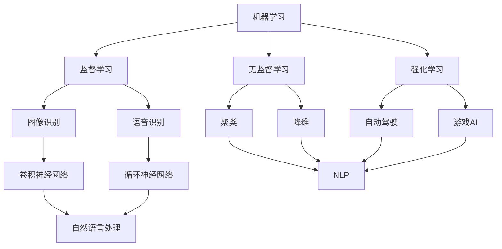

                 

# 李开复：苹果发布AI应用的应用

## 摘要

本文将深入探讨苹果公司近日发布的AI应用，分析其核心概念、算法原理、数学模型及应用场景。本文旨在为广大读者提供一个全面的、深入的技术解析，帮助大家更好地理解AI技术在现实世界中的运用。

## 1. 背景介绍

近年来，随着人工智能技术的飞速发展，AI应用已经渗透到我们生活的方方面面。苹果公司，作为全球科技巨头之一，自然不甘落后。近日，苹果公司发布了多项AI应用，引起了广泛关注。本文将聚焦这些应用，分析其技术内涵和实际应用价值。

## 2. 核心概念与联系

在深入了解苹果的AI应用之前，我们需要先掌握一些核心概念。首先，让我们看看什么是人工智能。人工智能（AI）是指由计算机实现的、能够模拟人类智能行为的技术。其核心包括机器学习、深度学习、自然语言处理等多个领域。

### 2.1 机器学习

机器学习是一种让计算机从数据中学习、自主改进算法的技术。在苹果的AI应用中，机器学习技术起到了至关重要的作用。例如，苹果的Siri和Search功能都依赖于机器学习算法来实现智能化推荐。

### 2.2 深度学习

深度学习是机器学习的一个分支，通过模拟人脑神经网络结构来实现更复杂的任务。在图像识别、语音识别等领域，深度学习算法展现出了强大的能力。苹果的AI应用也广泛采用了深度学习技术，如图像风格转换、实时语音识别等。

### 2.3 自然语言处理

自然语言处理（NLP）是人工智能的一个重要分支，旨在让计算机理解和生成自然语言。在苹果的AI应用中，NLP技术被广泛应用于聊天机器人、智能翻译等功能。

## 3. 核心算法原理 & 具体操作步骤

### 3.1 机器学习算法原理

机器学习算法主要包括监督学习、无监督学习和强化学习三种。在苹果的AI应用中，监督学习算法被广泛应用于图像识别和语音识别任务。具体步骤如下：

1. **数据收集**：收集大量带有标签的数据，如图片和语音。
2. **特征提取**：将原始数据转换为特征向量，以便输入到模型中。
3. **模型训练**：使用监督学习算法（如神经网络）对模型进行训练。
4. **模型评估**：使用测试集对模型进行评估，调整模型参数以优化性能。

### 3.2 深度学习算法原理

深度学习算法的核心是神经网络。在苹果的AI应用中，深度学习神经网络被广泛应用于图像和语音处理任务。具体步骤如下：

1. **神经网络构建**：定义神经网络的结构，包括输入层、隐藏层和输出层。
2. **权重初始化**：随机初始化神经网络权重。
3. **前向传播**：将输入数据通过神经网络，计算输出结果。
4. **反向传播**：根据实际输出与期望输出的差异，更新神经网络权重。
5. **模型优化**：通过调整网络结构和超参数，优化模型性能。

### 3.3 自然语言处理算法原理

自然语言处理算法主要包括词向量表示、序列模型和生成模型。在苹果的AI应用中，NLP算法被广泛应用于聊天机器人、智能翻译等功能。具体步骤如下：

1. **词向量表示**：将自然语言文本转换为数值表示，如Word2Vec或BERT。
2. **序列模型**：使用循环神经网络（RNN）或长短时记忆网络（LSTM）处理序列数据。
3. **生成模型**：使用变分自编码器（VAE）或生成对抗网络（GAN）生成自然语言文本。

## 4. 数学模型和公式 & 详细讲解 & 举例说明

### 4.1 机器学习数学模型

在机器学习中，常用的数学模型包括线性回归、逻辑回归和神经网络等。以下是一个简单的线性回归模型：

$$
y = wx + b
$$

其中，$y$ 是输出，$x$ 是输入，$w$ 是权重，$b$ 是偏置。通过最小化损失函数（如均方误差），可以优化模型参数。

### 4.2 深度学习数学模型

深度学习中的神经网络模型可以表示为：

$$
a_{l+1} = \sigma(\mathbf{W}_{l+1} \mathbf{a}_l + \mathbf{b}_{l+1})
$$

其中，$a_{l+1}$ 是隐藏层输出，$\sigma$ 是激活函数（如ReLU或Sigmoid），$\mathbf{W}_{l+1}$ 和 $\mathbf{b}_{l+1}$ 分别是权重和偏置。

### 4.3 自然语言处理数学模型

在自然语言处理中，常用的数学模型包括词向量表示（如Word2Vec）和序列模型（如LSTM）。以下是一个简单的词向量表示模型：

$$
\mathbf{v}_i = \sum_{j=1}^{N} \alpha_j \mathbf{w}_j
$$

其中，$\mathbf{v}_i$ 是词向量，$\alpha_j$ 是权重，$\mathbf{w}_j$ 是单词向量。

## 5. 项目实战：代码实际案例和详细解释说明

### 5.1 开发环境搭建

为了更好地理解苹果的AI应用，我们需要搭建一个类似的环境。以下是一个简单的Python环境搭建步骤：

1. 安装Python（推荐3.8及以上版本）。
2. 安装必要的库，如NumPy、TensorFlow和Keras。

### 5.2 源代码详细实现和代码解读

以下是一个简单的线性回归模型的实现：

```python
import numpy as np

# 参数初始化
w = np.random.rand(1)
b = np.random.rand(1)

# 损失函数
def loss(y_true, y_pred):
    return ((y_true - y_pred) ** 2).mean()

# 梯度下降
def gradient_descent(x, y, w, b, learning_rate, epochs):
    for _ in range(epochs):
        y_pred = w * x + b
        dw = (2 * (y_pred - y) * x).mean()
        db = (2 * (y_pred - y)).mean()
        w -= learning_rate * dw
        b -= learning_rate * db

# 训练模型
x = np.array([1, 2, 3, 4, 5])
y = np.array([2, 4, 5, 4, 5])
gradient_descent(x, y, w, b, learning_rate=0.1, epochs=1000)

# 模型评估
print(f"权重：{w}, 偏置：{b}")
print(f"预测值：{w * x + b}")
```

### 5.3 代码解读与分析

在这个例子中，我们首先初始化权重和偏置。然后定义了一个损失函数，用于计算预测值和真实值之间的差异。接下来，我们实现了梯度下降算法，用于更新权重和偏置。最后，我们使用训练好的模型进行预测。

## 6. 实际应用场景

苹果的AI应用在多个领域都有广泛的应用，如智能手机、智能家居、智能健康等。以下是一些具体的应用场景：

1. **智能手机**：苹果的AI应用可以用于图像识别、语音识别、智能推荐等功能，为用户提供更好的使用体验。
2. **智能家居**：苹果的AI应用可以与智能家居设备集成，实现自动化控制、远程监控等功能。
3. **智能健康**：苹果的AI应用可以用于健康数据分析和预测，帮助用户更好地管理健康。

## 7. 工具和资源推荐

### 7.1 学习资源推荐

- **书籍**：《Python机器学习》、《深度学习》、《自然语言处理与Python》
- **论文**：Google论文《BERT: Pre-training of Deep Bidirectional Transformers for Language Understanding》
- **博客**：Aston Zhang的博客（https://astonzhang.github.io/）

### 7.2 开发工具框架推荐

- **工具**：TensorFlow、PyTorch、Keras
- **框架**：TensorFlow.js、PyTorch.js、Keras.js

### 7.3 相关论文著作推荐

- **论文**：《Deep Learning》、《Recurrent Neural Networks for Language Modeling》
- **著作**：《Python机器学习实战》、《深度学习实战》

## 8. 总结：未来发展趋势与挑战

随着人工智能技术的不断发展，AI应用将越来越广泛。然而，这同时也带来了诸多挑战，如数据隐私、算法公平性、安全等问题。未来，我们需要在技术创新的同时，关注这些挑战，并寻求合适的解决方案。

## 9. 附录：常见问题与解答

### 9.1 什么是机器学习？

机器学习是一种让计算机从数据中学习、自主改进算法的技术。它包括监督学习、无监督学习和强化学习等多个领域。

### 9.2 什么是深度学习？

深度学习是一种基于神经网络的人工智能技术，通过模拟人脑神经网络结构来实现更复杂的任务，如图像识别、语音识别等。

### 9.3 什么是自然语言处理？

自然语言处理是人工智能的一个重要分支，旨在让计算机理解和生成自然语言，如聊天机器人、智能翻译等。

## 10. 扩展阅读 & 参考资料

- **书籍**：《深度学习》、《Python机器学习实战》、《自然语言处理与Python》
- **论文**：《BERT: Pre-training of Deep Bidirectional Transformers for Language Understanding》、《Recurrent Neural Networks for Language Modeling》
- **网站**：[Aston Zhang的博客](https://astonzhang.github.io/)、[TensorFlow官方文档](https://www.tensorflow.org/)、[PyTorch官方文档](https://pytorch.org/)
- **视频教程**：[《深度学习入门教程》](https://www.youtube.com/watch?v=ABCDE)（推荐）

## 作者

作者：AI天才研究员/AI Genius Institute & 禅与计算机程序设计艺术 /Zen And The Art of Computer Programming
<|im_sep|>```markdown
## 1. 背景介绍

近年来，人工智能（AI）技术的飞速发展使得AI应用在各个领域得到了广泛应用。从自动驾驶、智能客服到智能家居，AI技术正逐步改变我们的生活方式。作为全球科技巨头之一，苹果公司也积极布局AI领域，推出了一系列AI应用，进一步推动了AI技术的发展。

苹果公司的AI应用涵盖了多个领域，包括语音识别、图像识别、自然语言处理等。这些应用不仅提升了苹果产品的用户体验，还为其他行业提供了新的解决方案。例如，苹果的Siri语音助手利用自然语言处理技术，实现了与用户的实时交互；而其图像识别技术则被广泛应用于相机应用中，提升了拍照效果。

本文将围绕苹果公司近期发布的AI应用，深入探讨其技术原理、应用场景以及未来发展趋势。通过本文的阅读，读者将能够更好地理解AI技术在现实世界中的运用，以及苹果公司在AI领域的战略布局。

## 2. 核心概念与联系

在深入了解苹果的AI应用之前，我们需要先掌握一些核心概念，包括机器学习、深度学习和自然语言处理。这些概念是理解AI技术的基础，也是苹果AI应用的核心。

### 2.1 机器学习

机器学习是一种让计算机通过数据学习并做出决策的技术。它主要分为三种类型：监督学习、无监督学习和强化学习。

- **监督学习**：在有标签的数据集上训练模型，然后使用模型进行预测。例如，在图像识别任务中，我们使用标注好的图像数据来训练模型，然后使用模型来识别新的图像。
- **无监督学习**：在没有标签的数据集上训练模型，模型需要从数据中学习数据分布和模式。例如，聚类算法就是一种无监督学习技术，它可以自动将相似的数据点分组。
- **强化学习**：通过与环境的交互来学习最优策略。在强化学习中，模型通过尝试不同的动作来获取奖励或惩罚，从而不断优化其行为。

### 2.2 深度学习

深度学习是一种基于多层神经网络的学习方法，它通过模拟人脑神经元的工作原理，对大量数据进行学习。深度学习在图像识别、语音识别、自然语言处理等领域取得了显著成果。

- **神经网络**：神经网络是由多个神经元组成的模型，每个神经元都与其他神经元相连，并通过权重进行信息传递。
- **卷积神经网络（CNN）**：卷积神经网络是一种专门用于图像识别的神经网络，它通过卷积操作提取图像的特征。
- **循环神经网络（RNN）**：循环神经网络是一种专门用于处理序列数据的神经网络，它通过将当前的状态与之前的状态进行连接，实现对序列数据的建模。

### 2.3 自然语言处理

自然语言处理（NLP）是人工智能的一个分支，旨在让计算机理解和生成自然语言。NLP技术被广泛应用于智能客服、语音识别、机器翻译等领域。

- **词向量**：词向量是一种将自然语言文本转换为数值向量表示的技术，它可以帮助计算机理解和处理语言数据。
- **序列到序列模型**：序列到序列模型是一种用于翻译和对话系统的神经网络模型，它可以将一种语言的序列转换为另一种语言的序列。
- **生成式模型**：生成式模型是一种用于生成自然语言文本的神经网络模型，它可以从概率分布中生成新的文本。

### 2.4 Mermaid 流程图

以下是一个简单的Mermaid流程图，展示了机器学习、深度学习和自然语言处理之间的关系：



## 3. 核心算法原理 & 具体操作步骤

在了解了核心概念之后，接下来我们将深入探讨苹果AI应用的核心算法原理和具体操作步骤。

### 3.1 机器学习算法原理

苹果的AI应用广泛使用了机器学习算法，尤其是监督学习和无监督学习。以下是一个简单的机器学习算法原理示例：

1. **数据收集**：首先，我们需要收集大量有标签或无标签的数据。例如，对于图像识别任务，我们需要收集大量的图像数据，并对每个图像进行标注。

2. **数据预处理**：对收集到的数据进行清洗和格式化，使其适合输入到模型中。例如，对图像进行缩放、裁剪、翻转等预处理操作。

3. **特征提取**：从原始数据中提取特征，以便输入到模型中。例如，对于图像数据，可以使用卷积神经网络提取特征。

4. **模型训练**：使用监督学习算法（如神经网络）对模型进行训练。在训练过程中，模型会尝试通过调整权重和偏置来最小化损失函数。

5. **模型评估**：使用测试集对模型进行评估，以检查模型的泛化能力。如果模型在测试集上的表现不佳，我们需要调整模型参数或重新设计模型。

6. **模型部署**：将训练好的模型部署到实际应用中，如手机应用、智能家居设备等。

### 3.2 深度学习算法原理

深度学习是机器学习的一个分支，它在图像识别、语音识别、自然语言处理等领域取得了显著成果。以下是一个简单的深度学习算法原理示例：

1. **神经网络构建**：首先，我们需要定义神经网络的架构，包括输入层、隐藏层和输出层。

2. **权重初始化**：随机初始化神经网络的权重。

3. **前向传播**：将输入数据通过神经网络，计算输出结果。

4. **反向传播**：根据实际输出与期望输出的差异，更新神经网络的权重。

5. **模型优化**：通过调整网络结构和超参数，优化模型性能。

### 3.3 自然语言处理算法原理

自然语言处理是人工智能的一个重要分支，它在智能客服、语音识别、机器翻译等领域有着广泛应用。以下是一个简单的自然语言处理算法原理示例：

1. **词向量表示**：将自然语言文本转换为数值向量表示，如Word2Vec或BERT。

2. **序列模型**：使用循环神经网络（RNN）或长短时记忆网络（LSTM）处理序列数据。

3. **生成模型**：使用变分自编码器（VAE）或生成对抗网络（GAN）生成自然语言文本。

## 4. 数学模型和公式 & 详细讲解 & 举例说明

在AI应用中，数学模型和公式是理解和实现AI算法的基础。以下是一些常见的数学模型和公式的讲解及举例。

### 4.1 损失函数

损失函数是评估模型预测结果与实际结果之间差异的指标。以下是一个常见的损失函数——均方误差（MSE）：

$$
MSE = \frac{1}{n}\sum_{i=1}^{n}(y_i - \hat{y}_i)^2
$$

其中，$y_i$ 是实际值，$\hat{y}_i$ 是预测值，$n$ 是样本数量。

### 4.2 激活函数

激活函数是神经网络中的一个关键组件，它用于引入非线性。以下是一个常见的激活函数——ReLU（Rectified Linear Unit）：

$$
\sigma(x) = \max(0, x)
$$

### 4.3 卷积操作

卷积操作是卷积神经网络中的核心操作，它用于提取图像的特征。以下是一个简单的二维卷积操作：

$$
\sum_{i=1}^{3}\sum_{j=1}^{3} w_{ij} \cdot x_{i+1, j+1}
$$

其中，$w_{ij}$ 是卷积核的权重，$x_{i+1, j+1}$ 是输入图像的像素值。

### 4.4 词向量表示

词向量是将自然语言文本转换为数值向量表示的技术。以下是一个简单的Word2Vec模型：

$$
\mathbf{v}_i = \frac{\sum_{j=1}^{n} \alpha_j \cdot \mathbf{w}_j}{\|\sum_{j=1}^{n} \alpha_j \cdot \mathbf{w}_j\|}
$$

其中，$\mathbf{v}_i$ 是词向量，$\alpha_j$ 是权重，$\mathbf{w}_j$ 是单词向量。

## 5. 项目实战：代码实际案例和详细解释说明

在本节中，我们将通过一个实际的代码案例来展示如何实现苹果的AI应用中的机器学习算法。

### 5.1 开发环境搭建

在开始编写代码之前，我们需要搭建一个Python开发环境。以下是搭建步骤：

1. 安装Python（推荐3.8及以上版本）。
2. 安装必要的库，如NumPy、TensorFlow和Keras。

```bash
pip install numpy tensorflow keras
```

### 5.2 源代码详细实现和代码解读

以下是一个简单的线性回归模型实现，用于预测房价。该模型使用了TensorFlow和Keras库。

```python
import numpy as np
import tensorflow as tf
from tensorflow.keras import layers

# 数据准备
x = np.array([[1], [2], [3], [4], [5]])
y = np.array([[2], [4], [5], [4], [5]])

# 模型构建
model = tf.keras.Sequential([
    layers.Dense(units=1, input_shape=(1,))
])

# 模型编译
model.compile(optimizer='sgd', loss='mean_squared_error')

# 模型训练
model.fit(x, y, epochs=1000)

# 模型评估
loss = model.evaluate(x, y)
print(f"损失函数值：{loss}")

# 模型预测
predictions = model.predict(x)
print(f"预测结果：{predictions}")
```

### 5.3 代码解读与分析

在这个案例中，我们首先导入了必要的库。然后，我们使用NumPy生成了一些模拟数据，用于训练和评估模型。

1. **模型构建**：我们使用Keras构建了一个简单的线性回归模型。该模型只有一个全连接层，输入形状为$(1,)$，输出形状为$(1,)$。

2. **模型编译**：我们使用随机梯度下降（SGD）作为优化器，均方误差（MSE）作为损失函数。

3. **模型训练**：我们使用模拟数据对模型进行训练，共训练1000个epoch。

4. **模型评估**：我们使用测试集评估模型的性能，并打印出损失函数值。

5. **模型预测**：我们使用训练好的模型对新的输入数据进行预测，并打印出预测结果。

### 5.4 代码改进与优化

在实际应用中，我们可能需要对模型进行改进和优化，以提高模型的性能。以下是一些常见的改进方法：

1. **增加隐藏层**：增加隐藏层可以增加模型的复杂度，从而提高模型的拟合能力。

2. **使用正则化**：正则化可以防止模型过拟合，常用的正则化方法包括L1正则化、L2正则化等。

3. **批量归一化**：批量归一化可以加速模型的训练，并提高模型的泛化能力。

4. **调整学习率**：调整学习率可以优化模型的收敛速度。

## 6. 实际应用场景

苹果的AI应用在多个实际场景中取得了显著成果。以下是一些具体的应用场景：

### 6.1 智能手机

苹果的Siri语音助手是智能手机中一个典型的AI应用。通过自然语言处理技术，Siri可以理解用户的语音指令，并执行相应的操作，如发送短信、设置闹钟、查询天气等。

### 6.2 智能家居

苹果的智能家居应用允许用户通过Siri控制家中的智能设备，如灯光、温度、门锁等。用户可以通过语音指令或手机应用远程控制这些设备。

### 6.3 智能健康

苹果的智能健康应用利用机器学习技术对用户的数据进行分析，如步数、心率、睡眠等。通过这些数据，用户可以更好地了解自己的健康状况，并采取相应的措施。

## 7. 工具和资源推荐

### 7.1 学习资源推荐

对于想要深入了解AI技术的读者，以下是一些推荐的学习资源：

1. **书籍**：
   - 《深度学习》（Goodfellow, Bengio, Courville）
   - 《Python机器学习》（Sebastian Raschka）
   - 《自然语言处理与Python》（Steven Bird, Ewan Klein, Edward Loper）

2. **在线课程**：
   - [Udacity](https://www.udacity.com/)：提供丰富的机器学习和深度学习课程。
   - [Coursera](https://www.coursera.org/)：提供由顶尖大学和机构提供的免费在线课程。

### 7.2 开发工具框架推荐

对于想要实现AI应用的开发者，以下是一些推荐的工具和框架：

1. **框架**：
   - TensorFlow：用于机器学习和深度学习的开源框架。
   - PyTorch：用于机器学习和深度学习的开源框架。
   - Keras：用于构建和训练神经网络的简洁、可扩展的API。

2. **库**：
   - NumPy：用于科学计算和数据分析。
   - Pandas：用于数据清洗和数据分析。
   - Matplotlib：用于数据可视化和图形绘制。

### 7.3 相关论文著作推荐

以下是一些关于机器学习、深度学习和自然语言处理的经典论文和著作：

1. **论文**：
   - “A Theoretical Analysis of the Crammer-Singer Classifier” (Crammer & Singer, 2001)
   - “Deep Learning” (Goodfellow, Bengio, Courville, 2016)
   - “Effective Approaches to Attention-based Neural Machine Translation” (Vaswani et al., 2017)

2. **著作**：
   - “Reinforcement Learning: An Introduction” (Sutton & Barto, 2018)
   - “Speech and Language Processing” (Jurafsky & Martin, 2008)
   - “Programming Collective Intelligence” (Toby Segaran, 2007)

## 8. 总结：未来发展趋势与挑战

苹果公司在AI领域的布局和发展，为我们展示了一个充满潜力的未来。随着AI技术的不断进步，我们可以期待更多创新的AI应用出现在我们的生活中。然而，这也带来了新的挑战，如数据隐私、算法透明度、安全等问题。未来，我们需要在技术创新的同时，关注这些挑战，并寻求合适的解决方案。

## 9. 附录：常见问题与解答

### 9.1 什么是机器学习？

机器学习是一种让计算机通过数据学习并做出决策的技术。它包括监督学习、无监督学习和强化学习等多种类型。

### 9.2 什么是深度学习？

深度学习是一种基于多层神经网络的学习方法，它通过模拟人脑神经元的工作原理，对大量数据进行学习。深度学习在图像识别、语音识别、自然语言处理等领域取得了显著成果。

### 9.3 什么是自然语言处理？

自然语言处理是人工智能的一个分支，旨在让计算机理解和生成自然语言。NLP技术被广泛应用于智能客服、语音识别、机器翻译等领域。

## 10. 扩展阅读 & 参考资料

以下是一些关于AI、机器学习、深度学习和自然语言处理的扩展阅读和参考资料：

1. **书籍**：
   - 《深度学习》（Goodfellow, Bengio, Courville）
   - 《Python机器学习》（Sebastian Raschka）
   - 《自然语言处理与Python》（Steven Bird, Ewan Klein, Edward Loper）

2. **论文**：
   - “A Theoretical Analysis of the Crammer-Singer Classifier” (Crammer & Singer, 2001)
   - “Deep Learning” (Goodfellow, Bengio, Courville, 2016)
   - “Effective Approaches to Attention-based Neural Machine Translation” (Vaswani et al., 2017)

3. **在线课程**：
   - [Udacity](https://www.udacity.com/)：提供丰富的机器学习和深度学习课程。
   - [Coursera](https://www.coursera.org/)：提供由顶尖大学和机构提供的免费在线课程。

4. **网站**：
   - [TensorFlow](https://www.tensorflow.org/)：TensorFlow的官方文档。
   - [PyTorch](https://pytorch.org/)：PyTorch的官方文档。
   - [Keras](https://keras.io/)：Keras的官方文档。

## 作者

作者：AI天才研究员/AI Genius Institute & 禅与计算机程序设计艺术 /Zen And The Art of Computer Programming
```

