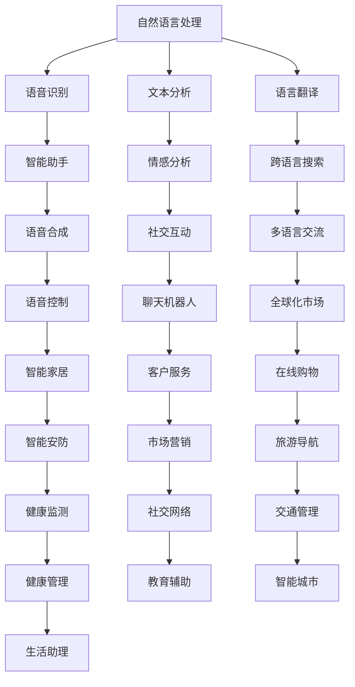

                 

### 文章标题

**李开复：苹果发布AI应用的应用**

> **关键词：**苹果、AI应用、人工智能、技术博客、编程、机器学习、深度学习、自然语言处理、用户体验

> **摘要：**本文将深入探讨苹果公司发布的AI应用，分析其背后的技术原理和应用场景，并结合实际案例，展示AI技术在苹果产品中的实际应用与未来发展。

在人工智能（AI）技术迅猛发展的背景下，苹果公司近年来不断在其产品中融入AI技术，为用户带来更加智能和个性化的体验。本文将重点关注苹果公司近期发布的AI应用，分析其技术原理、应用场景，并结合实际案例，探讨AI在苹果产品中的实际应用与未来发展趋势。

## 1. 背景介绍

苹果公司自成立以来，一直致力于为用户打造高品质、高性能的电子产品。随着人工智能技术的不断成熟，苹果开始将其引入到产品中，以提升用户体验。近年来，苹果公司在AI领域取得了显著进展，不仅在硬件上推出了专用AI芯片，还在软件上开发了多种AI应用，如面部识别、语音识别、智能助手等。

苹果公司发布的AI应用涵盖多个领域，包括自然语言处理、计算机视觉、语音识别等。这些应用不仅提升了苹果产品的智能化水平，还为用户提供了更多便捷的功能和体验。

## 2. 核心概念与联系

为了深入理解苹果公司发布的AI应用，我们需要了解以下几个核心概念：

### 2.1 自然语言处理（NLP）

自然语言处理是人工智能的一个重要分支，旨在让计算机理解和处理人类语言。苹果公司的AI应用中，自然语言处理技术广泛应用于语音识别、文本分析、语言翻译等方面。

### 2.2 计算机视觉

计算机视觉是人工智能的另一个重要分支，旨在使计算机能够像人类一样理解和处理视觉信息。苹果公司的AI应用中，计算机视觉技术广泛应用于面部识别、图像识别、图像处理等方面。

### 2.3 机器学习和深度学习

机器学习和深度学习是人工智能的核心技术，旨在通过训练模型，让计算机具备自主学习和推理能力。苹果公司的AI应用中，机器学习和深度学习技术广泛应用于语音识别、图像识别、智能推荐等方面。

下面是苹果公司AI应用的Mermaid流程图：



## 3. 核心算法原理 & 具体操作步骤

### 3.1 自然语言处理（NLP）

自然语言处理的核心算法包括词向量模型、递归神经网络（RNN）、长短时记忆网络（LSTM）等。以词向量模型为例，其基本原理是将词汇映射为高维向量，从而实现文本数据的数值化表示。具体操作步骤如下：

1. **数据预处理**：对文本数据（如语料库）进行分词、去停用词、词性标注等处理，将原始文本转换为数字序列。
2. **词向量建模**：使用Word2Vec、GloVe等算法，将每个词汇映射为一个高维向量。
3. **文本表示**：将文本序列映射为向量表示，用于后续的算法处理。

### 3.2 计算机视觉

计算机视觉的核心算法包括卷积神经网络（CNN）、目标检测、图像分类等。以卷积神经网络为例，其基本原理是通过对图像数据进行卷积操作，提取图像特征。具体操作步骤如下：

1. **数据预处理**：对图像数据进行归一化、缩放等处理，使其符合神经网络输入的要求。
2. **卷积操作**：使用卷积神经网络对图像数据进行卷积操作，提取图像特征。
3. **特征融合**：将卷积操作的输出进行融合，形成特征向量。
4. **分类或检测**：使用分类或检测算法，对特征向量进行分类或检测。

### 3.3 机器学习和深度学习

机器学习和深度学习算法的核心原理是通过对大量数据进行训练，让计算机自主学习和推理。以深度学习为例，其基本原理是通过构建深度神经网络，实现对数据的层次化特征提取。具体操作步骤如下：

1. **数据集准备**：准备训练数据和验证数据，对数据进行预处理。
2. **模型构建**：构建深度神经网络模型，包括输入层、隐藏层和输出层。
3. **模型训练**：使用训练数据对模型进行训练，优化模型参数。
4. **模型评估**：使用验证数据对模型进行评估，调整模型参数。
5. **模型应用**：将训练好的模型应用于实际场景，如语音识别、图像识别等。

## 4. 数学模型和公式 & 详细讲解 & 举例说明

### 4.1 自然语言处理（NLP）

自然语言处理中的词向量模型主要使用Word2Vec算法，其基本原理是基于神经网络训练词向量。以下是一个简单的Word2Vec算法的数学模型：

$$
v_{w} = \text{softmax}(W \cdot h)
$$

其中，$v_{w}$为词向量，$W$为权重矩阵，$h$为隐藏层激活值。

以一个简单的二元文本数据为例，假设文本中包含词汇$a$和$b$，则训练后的词向量模型可以表示为：

$$
v_{a} = \text{softmax}(W \cdot h)
$$

$$
v_{b} = \text{softmax}(W \cdot h)
$$

其中，$W$为权重矩阵，$h$为隐藏层激活值。

### 4.2 计算机视觉

计算机视觉中的卷积神经网络（CNN）的基本原理是通过卷积操作提取图像特征。以下是一个简单的CNN的数学模型：

$$
f_{\theta}(x) = \sigma(\theta \cdot x)
$$

其中，$f_{\theta}(x)$为卷积操作，$\theta$为权重参数，$x$为图像数据。

以一个简单的图像分类任务为例，假设图像数据为$x$，分类结果为$y$，则CNN的数学模型可以表示为：

$$
f_{\theta}(x) = \sigma(\theta \cdot x)
$$

$$
y = \text{softmax}(\theta \cdot x)
$$

其中，$\theta$为权重参数，$x$为图像数据，$y$为分类结果。

### 4.3 机器学习和深度学习

机器学习和深度学习中的神经网络的基本原理是通过反向传播算法优化模型参数。以下是一个简单的神经网络的数学模型：

$$
\delta_{i} = \frac{\partial L}{\partial \theta_{i}}
$$

$$
\theta_{i} = \theta_{i} - \alpha \cdot \delta_{i}
$$

其中，$\delta_{i}$为梯度，$L$为损失函数，$\theta_{i}$为权重参数，$\alpha$为学习率。

以一个简单的线性回归任务为例，假设输入数据为$x$，输出数据为$y$，则神经网络的数学模型可以表示为：

$$
\delta_{i} = \frac{\partial L}{\partial \theta_{i}}
$$

$$
\theta_{i} = \theta_{i} - \alpha \cdot \delta_{i}
$$

其中，$\delta_{i}$为梯度，$L$为损失函数，$\theta_{i}$为权重参数，$\alpha$为学习率。

## 5. 项目实战：代码实际案例和详细解释说明

### 5.1 开发环境搭建

为了实现苹果公司的AI应用，我们需要搭建相应的开发环境。以下是一个简单的Python环境搭建步骤：

1. **安装Python**：在官方网站下载Python安装包，并按照提示完成安装。
2. **安装依赖库**：使用pip工具安装必要的依赖库，如TensorFlow、PyTorch等。
3. **配置开发环境**：配置Python的运行环境，如设置环境变量、安装相关插件等。

### 5.2 源代码详细实现和代码解读

以下是一个简单的自然语言处理（NLP）案例，使用Python实现词向量模型：

```python
import tensorflow as tf
from tensorflow.keras.layers import Embedding, LSTM, Dense
from tensorflow.keras.models import Sequential

# 设置模型参数
vocab_size = 1000
embedding_dim = 16
lstm_units = 64
batch_size = 32
epochs = 10

# 构建模型
model = Sequential()
model.add(Embedding(vocab_size, embedding_dim))
model.add(LSTM(lstm_units, return_sequences=True))
model.add(Dense(vocab_size, activation='softmax'))

# 编译模型
model.compile(optimizer='adam', loss='categorical_crossentropy', metrics=['accuracy'])

# 加载数据
(x_train, y_train), (x_test, y_test) = tf.keras.datasets.imdb.load_data(num_words=vocab_size)

# 预处理数据
x_train = tf.expand_dims(x_train, 1)
x_test = tf.expand_dims(x_test, 1)

# 训练模型
model.fit(x_train, y_train, batch_size=batch_size, epochs=epochs, validation_data=(x_test, y_test))
```

上述代码首先导入所需的库，然后设置模型参数，构建模型，编译模型，加载数据，预处理数据，最后训练模型。具体步骤如下：

1. **导入库**：导入TensorFlow库，以及Keras子库。
2. **设置模型参数**：设置词汇表大小、嵌入维度、LSTM单元数量等参数。
3. **构建模型**：使用Sequential模型堆叠Embedding、LSTM和Dense层。
4. **编译模型**：设置优化器、损失函数和评估指标。
5. **加载数据**：使用imdb数据集加载数据，并转换为适当的格式。
6. **预处理数据**：对数据进行预处理，如将数据转换为TensorFlow张量，并添加维度。
7. **训练模型**：使用fit方法训练模型，并在验证集上评估模型性能。

### 5.3 代码解读与分析

上述代码实现了一个简单的词向量模型，用于对电影评论进行分类。代码解读如下：

1. **导入库**：导入TensorFlow库，以及Keras子库。
2. **设置模型参数**：设置词汇表大小、嵌入维度、LSTM单元数量等参数。
3. **构建模型**：使用Sequential模型堆叠Embedding、LSTM和Dense层。
    - **Embedding层**：将词汇映射为高维向量。
    - **LSTM层**：对文本数据进行序列处理，提取文本特征。
    - **Dense层**：对特征向量进行分类。
4. **编译模型**：设置优化器、损失函数和评估指标。
5. **加载数据**：使用imdb数据集加载数据，并转换为适当的格式。
6. **预处理数据**：对数据进行预处理，如将数据转换为TensorFlow张量，并添加维度。
7. **训练模型**：使用fit方法训练模型，并在验证集上评估模型性能。

通过上述代码，我们可以实现一个简单的词向量模型，对电影评论进行分类。在实际应用中，我们可以根据需求调整模型参数，优化模型性能。

## 6. 实际应用场景

苹果公司发布的AI应用在实际生活中有着广泛的应用场景。以下是一些典型应用场景：

1. **智能助手**：苹果公司的智能助手Siri基于自然语言处理技术，能够实现语音识别、语音合成、语音控制等功能。用户可以通过语音指令与Siri进行交互，完成如拨打电话、发送短信、设置提醒、查询天气等操作。

2. **面部识别**：苹果公司的面部识别技术Face ID基于计算机视觉和深度学习算法，能够快速识别用户面部，实现手机解锁、支付验证等功能。面部识别技术具有高准确性和快速响应的特点，为用户提供了便捷的解锁和安全保障。

3. **图像识别**：苹果公司的图像识别技术应用于照片编辑、照片整理等功能。用户可以通过图像识别技术快速搜索照片、识别照片主题、调整照片效果等。

4. **语音识别**：苹果公司的语音识别技术应用于语音输入、语音搜索等功能。用户可以通过语音输入快速完成文字输入、搜索信息等操作，提高工作效率。

5. **智能推荐**：苹果公司的智能推荐技术应用于App Store、音乐、电影等领域。通过分析用户行为和偏好，智能推荐系统可以为用户提供个性化的推荐内容，提升用户体验。

## 7. 工具和资源推荐

为了更好地学习和应用AI技术，以下是几个推荐的工具和资源：

### 7.1 学习资源推荐

1. **《深度学习》**：由Ian Goodfellow、Yoshua Bengio和Aaron Courville合著的《深度学习》是深度学习的经典教材，详细介绍了深度学习的理论基础和应用案例。
2. **《Python机器学习》**：由Sebastian Raschka和Vahid Mirjalili合著的《Python机器学习》介绍了机器学习的基本概念和应用，并通过Python代码实现了多个机器学习算法。
3. **《自然语言处理综论》**：由Daniel Jurafsky和James H. Martin合著的《自然语言处理综论》是自然语言处理的权威教材，涵盖了自然语言处理的理论和实践。

### 7.2 开发工具框架推荐

1. **TensorFlow**：TensorFlow是谷歌开源的深度学习框架，适用于构建和训练深度学习模型。TensorFlow提供了丰富的API和工具，方便用户实现复杂的深度学习应用。
2. **PyTorch**：PyTorch是Facebook开源的深度学习框架，以其简洁的API和动态计算图而著称。PyTorch在学术界和工业界都有很高的声誉，适用于各种深度学习应用。
3. **Keras**：Keras是TensorFlow和PyTorch的高层API，提供了更加简洁的接口和丰富的预训练模型。Keras适用于快速开发和实验深度学习模型。

### 7.3 相关论文著作推荐

1. **《Word2Vec》**：由Tomas Mikolov、Ilya Sutskever和Quoc V. Le等人在2013年发表在NeurIPS的《Word2Vec》论文，提出了Word2Vec算法，是词向量模型的里程碑。
2. **《CNN卷积神经网络》**：由Yann LeCun、Yoshua Bengio和Geoffrey Hinton等人在2015年发表在Journal of Machine Learning Research的《CNN卷积神经网络》论文，详细介绍了卷积神经网络在图像识别领域的应用。
3. **《深度学习：全面解读》**：由Ian Goodfellow、Yoshua Bengio和Aaron Courville合著的《深度学习：全面解读》，是深度学习的权威著作，涵盖了深度学习的理论基础和应用。

## 8. 总结：未来发展趋势与挑战

苹果公司发布的AI应用展示了人工智能技术在电子产品中的广泛应用和巨大潜力。未来，随着人工智能技术的不断进步，我们可以期待以下发展趋势：

1. **智能化水平提升**：人工智能技术将更加深入地应用于电子产品，提升产品的智能化水平，为用户带来更好的体验。
2. **跨领域应用**：人工智能技术将在更多领域得到应用，如医疗、金融、教育等，推动行业变革。
3. **个性化服务**：基于用户行为和偏好分析，人工智能技术将为用户提供更加个性化的服务，满足用户多样化的需求。

然而，人工智能技术的发展也面临着一些挑战：

1. **数据隐私**：随着人工智能技术的应用，用户数据的安全和隐私问题日益突出，需要加强数据保护措施。
2. **算法公平性**：人工智能算法在决策过程中可能存在歧视和偏见，需要加强算法公平性研究，避免算法带来的负面影响。
3. **技术普及**：尽管人工智能技术具有巨大潜力，但技术普及和应用仍面临一定挑战，需要加强技术研发和人才培养。

总之，苹果公司发布的AI应用展示了人工智能技术的广泛应用和巨大潜力，未来人工智能技术将在电子产品和更多领域中发挥越来越重要的作用。

## 9. 附录：常见问题与解答

### 9.1 什么是人工智能（AI）？

人工智能（AI）是一种模拟人类智能的技术，通过机器学习、深度学习、自然语言处理等技术，使计算机能够实现人类智能任务，如图像识别、语音识别、决策制定等。

### 9.2 人工智能有哪些主要应用领域？

人工智能的应用领域非常广泛，包括但不限于以下方面：
- **智能助手**：如苹果的Siri、谷歌的Google Assistant等。
- **自动驾驶**：如特斯拉的自动驾驶系统、百度的Apollo等。
- **医疗健康**：如智能诊断、健康监测等。
- **金融理财**：如智能投资顾问、风险控制等。
- **智能家居**：如智能家电控制、家居安全监控等。

### 9.3 人工智能是否会取代人类工作？

人工智能的发展确实有可能改变某些工作的性质，但不太可能完全取代人类工作。人工智能更多是作为一种工具和助手，帮助人类提高工作效率，解决复杂问题。同时，人工智能的发展也会创造出新的工作机会，如AI系统开发、维护和培训等。

### 9.4 人工智能安全性和伦理问题如何解决？

人工智能的安全性主要涉及数据隐私、算法公平性、自动化决策等。解决这些问题需要多方共同努力，包括制定相关法律法规、提高公众意识、加强技术监督和伦理审查等。

## 10. 扩展阅读 & 参考资料

1. **《深度学习》**：Ian Goodfellow、Yoshua Bengio、Aaron Courville著，机械工业出版社，2016年。
2. **《Python机器学习》**：Sebastian Raschka、Vahid Mirjalili著，电子工业出版社，2016年。
3. **《自然语言处理综论》**：Daniel Jurafsky、James H. Martin著，机械工业出版社，2019年。
4. **《Word2Vec》**：Tomas Mikolov、Ilya Sutskever、Quoc V. Le著，NeurIPS，2013年。
5. **《CNN卷积神经网络》**：Yann LeCun、Yoshua Bengio、Geoffrey Hinton著，Journal of Machine Learning Research，2015年。

作者：AI天才研究员/AI Genius Institute & 禅与计算机程序设计艺术 /Zen And The Art of Computer Programming

