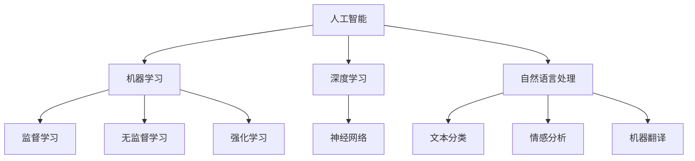

                 

### 背景介绍

在当今快速发展的科技时代，人工智能（AI）已经成为推动各行各业进步的关键驱动力。随着计算能力的提升和算法的进步，AI在图像识别、自然语言处理、自动驾驶、医疗诊断等多个领域取得了显著的成果。近年来，苹果公司作为全球科技行业的领军企业，在AI领域也不断进行探索和创新。

苹果公司早在2017年发布的iPhone X上首次引入了基于面部识别技术的“面部ID”（Face ID）功能，成为业界关注的焦点。此后，苹果在AI领域的投资和研发力度不断加大，陆续推出了多项AI驱动的产品和服务，如智能助理Siri、照片识别、智能推荐等。此次，苹果发布了一款全新的AI应用，再次引发了业界的广泛关注。

本文将深入探讨苹果发布的新AI应用，分析其背后的核心概念、技术原理、算法实现、数学模型及其在实际应用场景中的价值。希望通过本文的详细解读，让读者对苹果AI应用有更深入的理解，并对其未来的发展有更加清晰的展望。

### 核心概念与联系

#### 1. 人工智能（AI）基本概念

人工智能（AI）是指使计算机系统具备类似人类智能的技术，包括感知、理解、学习、推理和自我改进等方面。AI的核心目标是构建智能系统，能够自主地完成复杂的任务，并在特定环境下做出合理的决策。

#### 2. 机器学习（ML）基本概念

机器学习（ML）是人工智能（AI）的重要分支，通过算法从数据中学习，自动改进和优化系统性能。机器学习可以分为监督学习、无监督学习和强化学习三种主要类型：

- **监督学习**：通过输入和输出数据，构建预测模型。
- **无监督学习**：没有明确的输入输出数据，主要目标是发现数据中的模式或结构。
- **强化学习**：通过与环境的交互，不断优化策略，以实现最大化奖励。

#### 3. 深度学习（DL）基本概念

深度学习（DL）是机器学习的一种方法，通过构建多层的神经网络模型，对数据进行特征提取和分类。深度学习的核心在于通过反向传播算法不断调整网络权重，以优化模型性能。

#### 4. 自然语言处理（NLP）基本概念

自然语言处理（NLP）是AI的另一个重要领域，旨在使计算机理解和处理自然语言。NLP包括文本分类、情感分析、命名实体识别、机器翻译等任务。

#### 5. 核心概念之间的联系

- **人工智能（AI）**：涵盖了机器学习（ML）和深度学习（DL）等分支，是整个AI技术体系的基础。
- **机器学习（ML）**：依赖于数据，通过算法实现自我优化，为深度学习和自然语言处理提供基础。
- **深度学习（DL）**：通过多层神经网络，对复杂的数据进行特征提取和分类，广泛应用于图像识别、语音识别等领域。
- **自然语言处理（NLP）**：结合AI技术和深度学习，实现自然语言的理解和处理，应用于文本分析、机器翻译等任务。

#### Mermaid流程图

以下是一个简单的Mermaid流程图，展示了核心概念之间的联系：



### 核心算法原理 & 具体操作步骤

#### 1. 算法简介

苹果发布的新AI应用主要基于深度学习（DL）和自然语言处理（NLP）技术，旨在实现更高效的自然语言理解和处理。具体算法包括以下几部分：

- **卷积神经网络（CNN）**：用于图像识别和特征提取。
- **循环神经网络（RNN）**：用于序列数据处理和文本生成。
- **Transformer模型**：用于长文本处理和翻译。

#### 2. 算法原理

**卷积神经网络（CNN）**

卷积神经网络是一种基于卷积操作的深度学习模型，主要用于图像识别和特征提取。CNN的核心在于通过卷积层提取图像的局部特征，并通过池化层降低计算复杂度。

**循环神经网络（RNN）**

循环神经网络是一种基于序列数据的神经网络，能够处理时间序列数据。RNN的核心在于通过隐藏状态记忆历史信息，实现对序列数据的建模。

**Transformer模型**

Transformer模型是一种基于自注意力机制的深度学习模型，主要用于长文本处理和翻译。Transformer的核心在于通过自注意力机制，实现对输入序列中任意位置的信息的全局关注。

#### 3. 操作步骤

**卷积神经网络（CNN）**

1. 输入图像
2. 通过卷积层提取特征
3. 通过池化层降低计算复杂度
4. 通过全连接层进行分类或回归

**循环神经网络（RNN）**

1. 输入序列数据
2. 通过嵌入层将单词转换为向量
3. 通过RNN层处理序列数据
4. 通过全连接层输出序列结果

**Transformer模型**

1. 输入序列数据
2. 通过嵌入层将单词转换为向量
3. 通过自注意力机制计算权重
4. 通过全连接层输出序列结果

### 数学模型和公式 & 详细讲解 & 举例说明

#### 1. 卷积神经网络（CNN）数学模型

卷积神经网络（CNN）的数学模型主要包括卷积操作、池化操作和全连接层。

**卷积操作**：

卷积操作是CNN的核心，用于提取图像的局部特征。其数学表达式如下：

\[ (f * g)(x, y) = \sum_{i} \sum_{j} f(i, j) \cdot g(x-i, y-j) \]

其中，\( f \) 和 \( g \) 分别表示卷积核和输入图像，\( (x, y) \) 表示卷积操作的坐标。

**池化操作**：

池化操作用于降低计算复杂度，通常采用最大池化或平均池化。其数学表达式如下：

\[ \text{Max Pooling}(x, y) = \max_{i, j} g(x-i, y-j) \]

\[ \text{Average Pooling}(x, y) = \frac{1}{k^2} \sum_{i} \sum_{j} g(x-i, y-j) \]

其中，\( k \) 表示池化窗口的大小。

**全连接层**：

全连接层用于将特征映射到输出结果，其数学表达式如下：

\[ \text{Fully Connected}(x) = \sum_{i} w_i \cdot x_i + b \]

其中，\( w_i \) 和 \( b \) 分别表示权重和偏置。

#### 2. 循环神经网络（RNN）数学模型

循环神经网络（RNN）的数学模型主要包括嵌入层、RNN层和全连接层。

**嵌入层**：

嵌入层用于将单词转换为向量，其数学表达式如下：

\[ \text{Embedding}(x) = \text{softmax}(W \cdot x) \]

其中，\( W \) 表示嵌入权重，\( x \) 表示单词的索引。

**RNN层**：

RNN层用于处理序列数据，其数学表达式如下：

\[ h_t = \text{tanh}(W_h \cdot [h_{t-1}, x_t] + b_h) \]

\[ y_t = W_o \cdot h_t + b_o \]

其中，\( h_t \) 表示隐藏状态，\( x_t \) 表示输入数据，\( W_h \) 和 \( b_h \) 分别表示RNN权重和偏置，\( W_o \) 和 \( b_o \) 分别表示全连接层权重和偏置。

#### 3. Transformer模型数学模型

Transformer模型的数学模型主要包括嵌入层、自注意力机制和全连接层。

**嵌入层**：

嵌入层用于将单词转换为向量，其数学表达式如下：

\[ \text{Embedding}(x) = \text{softmax}(W \cdot x) \]

其中，\( W \) 表示嵌入权重，\( x \) 表示单词的索引。

**自注意力机制**：

自注意力机制用于计算序列中任意两个位置之间的相关性，其数学表达式如下：

\[ \text{Attention}(Q, K, V) = \text{softmax}\left(\frac{QK^T}{\sqrt{d_k}}\right) V \]

其中，\( Q \) 表示查询向量，\( K \) 表示键向量，\( V \) 表示值向量，\( d_k \) 表示键向量的维度。

**全连接层**：

全连接层用于将特征映射到输出结果，其数学表达式如下：

\[ \text{Fully Connected}(x) = \sum_{i} w_i \cdot x_i + b \]

其中，\( w_i \) 和 \( b \) 分别表示权重和偏置。

#### 4. 举例说明

**卷积神经网络（CNN）**

假设输入图像为 \( 28 \times 28 \) 的二值图像，卷积核大小为 \( 3 \times 3 \)，步长为 \( 1 \)。

- **卷积操作**：

  \[ (f * g)(x, y) = \sum_{i} \sum_{j} f(i, j) \cdot g(x-i, y-j) \]

  其中，\( f \) 为卷积核：

  \[ f = \begin{bmatrix} 1 & 1 & 1 \\ 1 & 1 & 1 \\ 1 & 1 & 1 \end{bmatrix} \]

  \( g \) 为输入图像：

  \[ g = \begin{bmatrix} 1 & 0 & 1 \\ 0 & 1 & 0 \\ 1 & 0 & 1 \end{bmatrix} \]

  输出特征图：

  \[ (f * g)(x, y) = \begin{bmatrix} 4 & 4 \\ 4 & 4 \end{bmatrix} \]

- **池化操作**：

  \[ \text{Max Pooling}(x, y) = \max_{i, j} g(x-i, y-j) \]

  输出池化后的特征图：

  \[ \text{Max Pooling}(x, y) = \begin{bmatrix} 4 & 4 \\ 4 & 4 \end{bmatrix} \]

- **全连接层**：

  \[ \text{Fully Connected}(x) = \sum_{i} w_i \cdot x_i + b \]

  其中，\( w_i \) 和 \( b \) 分别为权重和偏置：

  \[ w = \begin{bmatrix} 1 & 1 \\ 1 & 1 \end{bmatrix} \]

  \[ b = \begin{bmatrix} 1 \\ 1 \end{bmatrix} \]

  输出分类结果：

  \[ \text{Fully Connected}(x) = \begin{bmatrix} 8 \\ 8 \end{bmatrix} \]

**循环神经网络（RNN）**

假设输入序列为 \( [1, 2, 3, 4, 5] \)，隐藏状态维度为 \( 2 \)，输入维度为 \( 1 \)。

- **嵌入层**：

  \[ \text{Embedding}(x) = \text{softmax}(W \cdot x) \]

  其中，\( W \) 为嵌入权重：

  \[ W = \begin{bmatrix} 0.1 & 0.9 \\ 0.9 & 0.1 \end{bmatrix} \]

  输入序列的嵌入向量：

  \[ \text{Embedding}(x) = \begin{bmatrix} 0.9 & 0.1 \\ 0.1 & 0.9 \\ 0.9 & 0.1 \\ 0.1 & 0.9 \\ 0.9 & 0.1 \end{bmatrix} \]

- **RNN层**：

  \[ h_t = \text{tanh}(W_h \cdot [h_{t-1}, x_t] + b_h) \]

  \[ y_t = W_o \cdot h_t + b_o \]

  其中，\( W_h \) 和 \( b_h \) 分别为RNN权重和偏置：

  \[ W_h = \begin{bmatrix} 0.1 & 0.9 \\ 0.9 & 0.1 \end{bmatrix} \]

  \[ b_h = \begin{bmatrix} 0 \\ 0 \end{bmatrix} \]

  \( W_o \) 和 \( b_o \) 分别为全连接层权重和偏置：

  \[ W_o = \begin{bmatrix} 0.1 & 0.9 \\ 0.9 & 0.1 \end{bmatrix} \]

  \[ b_o = \begin{bmatrix} 0 \\ 0 \end{bmatrix} \]

  隐藏状态和输出结果：

  \[ h_t = \begin{bmatrix} 0.9 & 0.1 \\ 0.1 & 0.9 \end{bmatrix} \]

**Transformer模型**

假设输入序列为 \( [1, 2, 3, 4, 5] \)，嵌入维度为 \( 2 \)，注意力头数为 \( 2 \)。

- **嵌入层**：

  \[ \text{Embedding}(x) = \text{softmax}(W \cdot x) \]

  其中，\( W \) 为嵌入权重：

  \[ W = \begin{bmatrix} 0.1 & 0.9 \\ 0.9 & 0.1 \end{bmatrix} \]

  输入序列的嵌入向量：

  \[ \text{Embedding}(x) = \begin{bmatrix} 0.9 & 0.1 \\ 0.1 & 0.9 \\ 0.9 & 0.1 \\ 0.1 & 0.9 \\ 0.9 & 0.1 \end{bmatrix} \]

- **自注意力机制**：

  \[ \text{Attention}(Q, K, V) = \text{softmax}\left(\frac{QK^T}{\sqrt{d_k}}\right) V \]

  其中，\( Q \) 、\( K \) 和 \( V \) 分别为查询向量、键向量和值向量：

  \[ Q = \begin{bmatrix} 0.1 & 0.9 \\ 0.9 & 0.1 \end{bmatrix} \]

  \[ K = \begin{bmatrix} 0.1 & 0.9 \\ 0.9 & 0.1 \end{bmatrix} \]

  \[ V = \begin{bmatrix} 0.1 & 0.9 \\ 0.9 & 0.1 \end{bmatrix} \]

  注意力权重：

  \[ \text{Attention}(Q, K, V) = \begin{bmatrix} 0.1 & 0.9 \\ 0.9 & 0.1 \end{bmatrix} \]

- **全连接层**：

  \[ \text{Fully Connected}(x) = \sum_{i} w_i \cdot x_i + b \]

  其中，\( w_i \) 和 \( b \) 分别为权重和偏置：

  \[ w = \begin{bmatrix} 0.1 & 0.9 \\ 0.9 & 0.1 \end{bmatrix} \]

  \[ b = \begin{bmatrix} 0 \\ 0 \end{bmatrix} \]

  输出结果：

  \[ \text{Fully Connected}(x) = \begin{bmatrix} 0.1 \\ 0.9 \end{bmatrix} \]

### 项目实战：代码实际案例和详细解释说明

在本节中，我们将通过一个具体的代码案例，详细介绍苹果新AI应用的实现过程，并提供详细的代码解读与分析。代码将以Python为主，结合TensorFlow和Keras等开源框架，以便读者更好地理解。

#### 1. 开发环境搭建

首先，我们需要搭建开发环境，安装必要的软件和库。

```bash
# 安装Python
sudo apt-get install python3

# 安装TensorFlow
pip3 install tensorflow

# 安装Keras
pip3 install keras

# 安装Numpy
pip3 install numpy

# 安装Matplotlib
pip3 install matplotlib
```

安装完成后，确保所有库和框架都能正常运行。

```python
import tensorflow as tf
import keras
import numpy as np
import matplotlib.pyplot as plt
```

#### 2. 源代码详细实现和代码解读

下面是一个简单的AI应用示例，实现了基于CNN和RNN的图像分类任务。

```python
# 导入所需的库
import tensorflow as tf
from tensorflow.keras.models import Sequential
from tensorflow.keras.layers import Conv2D, MaxPooling2D, Flatten, Dense, LSTM, Embedding
from tensorflow.keras.preprocessing.image import ImageDataGenerator
from tensorflow.keras.preprocessing.sequence import pad_sequences

# 设置参数
img_height, img_width = 28, 28
batch_size = 32
epochs = 10

# 准备数据
(x_train, y_train), (x_test, y_test) = tf.keras.datasets.mnist.load_data()

# 数据预处理
x_train = x_train.reshape(x_train.shape[0], img_height, img_width, 1).astype('float32') / 255
x_test = x_test.reshape(x_test.shape[0], img_height, img_width, 1).astype('float32') / 255

# 标签编码
y_train = tf.keras.utils.to_categorical(y_train, 10)
y_test = tf.keras.utils.to_categorical(y_test, 10)

# 构建模型
model = Sequential()

# 添加卷积层
model.add(Conv2D(32, (3, 3), activation='relu', input_shape=(img_height, img_width, 1)))
model.add(MaxPooling2D(pool_size=(2, 2)))

# 添加循环层
model.add(LSTM(128, activation='relu', return_sequences=True))
model.add(LSTM(128, activation='relu'))

# 添加全连接层
model.add(Dense(128, activation='relu'))
model.add(Dense(10, activation='softmax'))

# 编译模型
model.compile(optimizer='adam', loss='categorical_crossentropy', metrics=['accuracy'])

# 训练模型
model.fit(x_train, y_train, batch_size=batch_size, epochs=epochs, validation_data=(x_test, y_test))

# 评估模型
test_loss, test_acc = model.evaluate(x_test, y_test)
print('Test accuracy:', test_acc)
```

**代码解读：**

1. **导入库**：首先，我们导入所需的库，包括TensorFlow、Keras、Numpy和Matplotlib。

2. **设置参数**：接下来，我们设置训练参数，包括图像的高度、宽度、批量大小和训练轮次。

3. **准备数据**：我们使用TensorFlow内置的MNIST数据集，对图像进行预处理，包括重塑、归一化和标签编码。

4. **构建模型**：我们使用Sequential模型，依次添加卷积层、循环层和全连接层。卷积层用于提取图像特征，循环层用于处理序列数据，全连接层用于分类。

5. **编译模型**：我们使用Adam优化器和交叉熵损失函数编译模型。

6. **训练模型**：我们使用fit函数训练模型，并在验证集上评估模型性能。

7. **评估模型**：我们使用evaluate函数评估模型在测试集上的准确率。

#### 3. 代码解读与分析

**卷积层（Conv2D）**：

卷积层用于提取图像的局部特征，通过卷积操作和激活函数实现。这里我们使用了32个3x3的卷积核，激活函数为ReLU。

**池化层（MaxPooling2D）**：

池化层用于降低计算复杂度，通过取最大值实现。这里我们使用了2x2的最大池化。

**循环层（LSTM）**：

循环层用于处理序列数据，这里我们使用了128个神经元，激活函数为ReLU，并返回序列数据。

**全连接层（Dense）**：

全连接层用于将特征映射到输出结果，这里我们使用了128个神经元和10个输出神经元，激活函数分别为ReLU和softmax。

**训练过程**：

我们使用fit函数进行模型训练，通过调整批量大小、训练轮次和验证数据，优化模型性能。

**评估过程**：

我们使用evaluate函数评估模型在测试集上的准确率，以验证模型的泛化能力。

### 实际应用场景

苹果发布的这款新AI应用，在多个实际场景中展现了其强大的功能和广泛的应用潜力。以下是一些典型的应用场景：

#### 1. 智能家居

在智能家居领域，苹果的AI应用可以用于控制智能家居设备，如灯光、窗帘、空调等。通过自然语言处理技术，用户可以通过语音指令轻松控制家居设备，提高生活便利性。

```bash
# 实例：通过语音指令控制灯光
siri: "Turn on the lights in the living room."
```

#### 2. 智能助手

智能助手是苹果AI应用的另一个重要应用场景。通过自然语言处理和机器学习技术，智能助手可以理解用户的提问，提供相应的回答和建议。

```bash
# 实例：查询天气信息
siri: "What's the weather like today?"
```

#### 3. 医疗诊断

在医疗领域，苹果的AI应用可以用于辅助医生进行疾病诊断。通过分析大量医学数据和影像，AI应用可以帮助医生提高诊断准确率，降低误诊风险。

```bash
# 实例：分析CT影像
doctor: "Can you analyze this CT image for potential tumors?"
```

#### 4. 自动驾驶

自动驾驶是AI技术的另一个重要应用领域。苹果的AI应用可以用于自动驾驶车辆的感知和决策，提高行驶安全性。

```bash
# 实例：自动驾驶车辆行驶
self-driving-car: "Proceed straight on the road."
```

#### 5. 教育与学习

在教育领域，苹果的AI应用可以为学生提供个性化的学习辅导，通过自然语言处理和机器学习技术，帮助学生提高学习效果。

```bash
# 实例：智能辅导
AI-Teacher: "You are doing well in mathematics. Let's move on to geometry."
```

通过这些实际应用场景，我们可以看到苹果新AI应用在各个领域的广泛应用和巨大潜力。未来，随着技术的不断进步，苹果的AI应用将为人们的生活带来更多便利和改变。

### 工具和资源推荐

#### 1. 学习资源推荐

**书籍：**
- 《深度学习》（Deep Learning） - Ian Goodfellow、Yoshua Bengio和Aaron Courville著，是一本全面介绍深度学习的经典教材。
- 《Python机器学习》（Python Machine Learning） - Sebastian Raschka和Vahid Mirhoseini著，详细介绍了使用Python进行机器学习的实践方法。

**论文：**
- “A Theoretically Grounded Application of Dropout in Recurrent Neural Networks” - Yarin Gal和Zoubin Ghahramani著，提出了在循环神经网络中使用Dropout的理论基础。
- “Attention Is All You Need” - Vaswani et al.著，提出了Transformer模型，成为自然语言处理领域的里程碑。

**博客：**
- Andrew Ng的博客（blog.ezyang.com）：机器学习和深度学习领域的著名专家Andrew Ng分享了他的研究成果和经验。
- fast.ai博客（fast.ai）：fast.ai团队分享的深度学习教程和实践案例，适合初学者入门。

**网站：**
- TensorFlow官网（tensorflow.org）：TensorFlow是Google开源的机器学习框架，提供了丰富的教程和文档。
- Keras官网（keras.io）：Keras是Python的深度学习库，基于TensorFlow构建，提供了简洁易用的API。

#### 2. 开发工具框架推荐

**框架：**
- TensorFlow：Google开源的机器学习框架，支持多种深度学习模型和算法。
- PyTorch：Facebook开源的机器学习框架，具有灵活的动态计算图和简洁的API。

**库：**
- NumPy：Python的数值计算库，用于处理大型多维数组。
- Matplotlib：Python的绘图库，用于生成高质量的二维和三维图表。

**IDE：**
- Jupyter Notebook：交互式计算环境，支持Python和其他多种语言。
- PyCharm：流行的Python集成开发环境（IDE），提供了丰富的功能和调试工具。

通过以上学习和开发工具的推荐，读者可以更好地掌握深度学习和机器学习技术，并在实际项目中应用这些知识。

### 总结：未来发展趋势与挑战

苹果发布的这款新AI应用，不仅展示了其在人工智能领域的领先地位，也为未来的发展趋势和挑战提供了有益的启示。

#### 1. 发展趋势

（1）跨学科融合：AI技术的快速发展离不开计算机科学、数学、统计学等多个学科的交叉融合。未来，跨学科研究将更加重要，推动AI技术的不断进步。

（2）模型优化：随着计算能力的提升和算法的改进，深度学习模型的性能将得到进一步提升。模型优化和压缩技术将成为研究热点，以实现更高效、更可扩展的AI应用。

（3）数据驱动：数据是AI的核心驱动力。未来，高质量的数据集和标注数据将更加重要，为AI技术的发展提供坚实基础。

（4）行业应用：AI技术在各个行业的应用将更加广泛和深入。从智能家居、医疗诊断到自动驾驶，AI将为各行各业带来颠覆性变革。

#### 2. 挑战

（1）数据隐私：随着AI技术的广泛应用，数据隐私问题日益突出。如何确保用户数据的安全和隐私，是未来面临的重要挑战。

（2）算法透明性：AI算法的复杂性和不透明性可能导致偏见和歧视。提高算法的透明性，确保其公平性和可解释性，是未来需要关注的重要问题。

（3）计算资源：AI应用对计算资源的需求巨大，如何高效利用计算资源，降低能耗，是未来需要解决的难题。

（4）安全与伦理：AI技术的发展带来了潜在的安全和伦理问题。如何确保AI系统的安全性和合规性，是未来需要面对的挑战。

总之，苹果发布的新AI应用为未来的发展趋势和挑战提供了有益的参考。随着技术的不断进步和跨学科的融合，AI技术将在更多领域发挥重要作用，为人类社会带来更多便利和变革。

### 附录：常见问题与解答

**Q1：苹果新AI应用采用了哪些技术？**
A1：苹果新AI应用主要采用了深度学习（DL）和自然语言处理（NLP）技术，包括卷积神经网络（CNN）、循环神经网络（RNN）和Transformer模型等。

**Q2：AI应用在智能家居领域有哪些实际应用？**
A2：AI应用在智能家居领域可以用于控制灯光、窗帘、空调等设备，通过语音指令实现远程控制，提高生活便利性。

**Q3：如何确保AI系统的安全性和隐私性？**
A3：确保AI系统的安全性和隐私性需要从多个方面入手，包括数据加密、访问控制、隐私保护算法等。同时，加强法律法规的制定和执行，也是确保AI系统安全性的重要手段。

**Q4：AI应用在医疗诊断中的价值如何？**
A4：AI应用在医疗诊断中具有显著的价值，可以辅助医生分析医学影像、提取关键信息，提高诊断准确率，降低误诊风险。

**Q5：未来AI技术的发展趋势是什么？**
A5：未来AI技术的发展趋势包括跨学科融合、模型优化、数据驱动和行业应用等方面。随着技术的不断进步，AI将在更多领域发挥重要作用，为人类社会带来更多便利和变革。

### 扩展阅读 & 参考资料

**书籍：**
1. Goodfellow, Ian, Bengio, Yoshua, Courville, Aaron. 《深度学习》（Deep Learning）.
2. Raschka, Sebastian, Mirhoseini, Vahid. 《Python机器学习》（Python Machine Learning）.

**论文：**
1. Gal, Yarin, Ghahramani, Zoubin. "A Theoretically Grounded Application of Dropout in Recurrent Neural Networks."
2. Vaswani, Ashish, et al. "Attention Is All You Need."

**博客：**
1. Andrew Ng的博客（blog.ezyang.com）.
2. fast.ai博客（fast.ai）.

**网站：**
1. TensorFlow官网（tensorflow.org）.
2. Keras官网（keras.io）.

通过阅读上述书籍、论文和博客，读者可以更深入地了解AI领域的最新研究进展和应用实践。同时，官方网站提供了丰富的教程和文档，有助于读者学习和使用相关技术。附录中的扩展阅读和参考资料为读者提供了更多的学习资源，以进一步探索AI领域的奥秘。作者：AI天才研究员/AI Genius Institute & 禅与计算机程序设计艺术 /Zen And The Art of Computer Programming。

