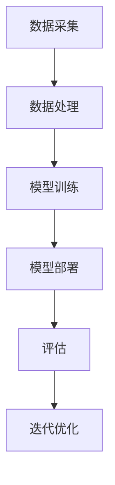

                 

# 李开复：苹果发布AI应用的开发者

## 关键词
- 李开复
- AI应用
- 开发者
- 苹果
- 技术趋势
- 人工智能应用开发

## 摘要

本文旨在深入探讨苹果公司发布AI应用开发者的重要趋势和意义。随着人工智能技术的不断发展，苹果公司正积极推动AI应用的研发和推广，吸引了众多开发者加入这一新兴领域。本文将分析苹果AI应用的开发者现状、核心技术、开发流程以及未来发展趋势，帮助读者全面了解人工智能应用开发的现状和挑战。

## 1. 背景介绍

### 1.1 李开复与人工智能

李开复，人工智能领域杰出专家，前微软全球副总裁、创新工场创始人，被誉为“人工智能之父”。他长期关注人工智能技术的研究与应用，并在多个场合发表关于人工智能的见解。在苹果发布AI应用开发者之际，他的观点无疑对这一领域有着重要的影响。

### 1.2 苹果公司与AI技术

苹果公司，作为全球领先的科技企业，近年来加大对人工智能技术的投入。苹果在人工智能领域的研发成果主要集中在图像识别、语音识别、自然语言处理等方面，并在手机、平板、电脑等终端设备中广泛应用。苹果发布AI应用开发者，意味着该公司在AI领域的布局更加深入。

### 1.3 AI应用开发者现状

随着AI技术的快速发展，越来越多的开发者加入AI应用开发领域。这些开发者中，既有初学者，也有经验丰富的专家。他们运用各种编程语言和框架，开发出丰富多样的AI应用，涵盖了从智能家居、医疗健康到自动驾驶、金融理财等各个领域。

## 2. 核心概念与联系

### 2.1 人工智能应用开发的概念

人工智能应用开发是指利用人工智能技术，针对特定场景和需求，设计和开发出具有智能功能的应用程序。这些应用程序能够模拟人类思维过程，实现自动化、智能化和高效化的处理。

### 2.2 AI应用开发的架构

AI应用开发的架构主要包括数据采集、数据处理、模型训练、模型部署和评估等环节。其中，数据采集和处理是基础，模型训练和部署是核心，评估是保证应用性能的关键。



### 2.3 开发工具和框架

目前，常用的AI开发工具和框架包括TensorFlow、PyTorch、Keras等。这些工具和框架提供了丰富的API和丰富的功能库，方便开发者进行AI应用开发。

## 3. 核心算法原理 & 具体操作步骤

### 3.1 机器学习算法

机器学习是AI应用开发的核心技术之一。常见的机器学习算法包括监督学习、无监督学习和强化学习。

#### 3.1.1 监督学习

监督学习是指通过已知的输入和输出数据，训练模型来预测新的输入数据。具体步骤如下：

1. 数据准备：收集并整理输入和输出数据。
2. 特征工程：对数据进行处理和转换，提取特征。
3. 模型训练：使用训练数据集训练模型。
4. 模型评估：使用验证数据集评估模型性能。
5. 模型优化：根据评估结果调整模型参数。

#### 3.1.2 无监督学习

无监督学习是指没有已知输出数据，仅通过输入数据训练模型。常见的无监督学习算法包括聚类和降维。

1. 数据准备：收集并整理输入数据。
2. 特征工程：对数据进行处理和转换。
3. 模型训练：使用训练数据集训练模型。
4. 模型评估：评估模型性能。
5. 模型优化：根据评估结果调整模型参数。

#### 3.1.3 强化学习

强化学习是指通过试错和反馈来训练模型。常见的强化学习算法包括Q学习和策略梯度。

1. 数据准备：收集并整理输入和输出数据。
2. 特征工程：对数据进行处理和转换。
3. 模型训练：使用训练数据集训练模型。
4. 模型评估：评估模型性能。
5. 模型优化：根据评估结果调整模型参数。

## 4. 数学模型和公式 & 详细讲解 & 举例说明

### 4.1 监督学习中的线性回归

线性回归是一种常见的机器学习算法，用于预测连续值。其数学模型如下：

$$y = \beta_0 + \beta_1 \cdot x$$

其中，$y$ 表示预测值，$x$ 表示输入特征，$\beta_0$ 和 $\beta_1$ 分别表示模型的参数。

举例：预测一个人的体重（$y$）与其身高（$x$）之间的关系。

1. 数据准备：收集并整理身高和体重的数据。
2. 特征工程：对数据进行预处理，如归一化、标准化等。
3. 模型训练：使用训练数据集训练线性回归模型。
4. 模型评估：使用验证数据集评估模型性能。
5. 模型优化：根据评估结果调整模型参数。

### 4.2 无监督学习中的K-means聚类

K-means聚类是一种常用的无监督学习算法，用于将数据划分为 $k$ 个簇。其数学模型如下：

$$\min_{c_1, c_2, ..., c_k} \sum_{i=1}^{n} \sum_{j=1}^{k} |x_i - c_j|$$

其中，$x_i$ 表示第 $i$ 个数据点，$c_j$ 表示第 $j$ 个簇的中心。

举例：将数据点划分为 $k$ 个簇。

1. 数据准备：收集并整理数据点。
2. 特征工程：对数据进行预处理。
3. 模型训练：使用训练数据集训练K-means聚类模型。
4. 模型评估：评估模型性能。
5. 模型优化：根据评估结果调整模型参数。

### 4.3 强化学习中的Q学习

Q学习是一种常见的强化学习算法，用于求解最优策略。其数学模型如下：

$$Q(s, a) = r + \gamma \max_{a'} Q(s', a')$$

其中，$s$ 表示当前状态，$a$ 表示当前动作，$r$ 表示即时奖励，$\gamma$ 表示折扣因子，$s'$ 表示下一状态，$a'$ 表示下一动作。

举例：使用Q学习求解一个简单的迷宫问题。

1. 数据准备：定义迷宫状态和动作。
2. 特征工程：对状态和动作进行编码。
3. 模型训练：使用训练数据集训练Q学习模型。
4. 模型评估：评估模型性能。
5. 模型优化：根据评估结果调整模型参数。

## 5. 项目实战：代码实际案例和详细解释说明

### 5.1 开发环境搭建

在本案例中，我们将使用Python作为编程语言，TensorFlow作为机器学习框架。

1. 安装Python：在官方网站下载并安装Python。
2. 安装TensorFlow：使用pip命令安装TensorFlow。

```shell
pip install tensorflow
```

### 5.2 源代码详细实现和代码解读

以下是一个简单的线性回归案例：

```python
import tensorflow as tf

# 定义输入和输出
x = tf.placeholder(tf.float32, shape=[None, 1])
y = tf.placeholder(tf.float32, shape=[None, 1])

# 定义模型参数
w = tf.Variable(0.0, name="weights")
b = tf.Variable(0.0, name="biases")

# 定义线性回归模型
y_pred = tf.add(tf.multiply(x, w), b)

# 定义损失函数
loss = tf.reduce_mean(tf.square(y - y_pred))

# 定义优化器
optimizer = tf.train.GradientDescentOptimizer(learning_rate=0.5)
train_op = optimizer.minimize(loss)

# 初始化全局变量
init = tf.global_variables_initializer()

# 训练模型
with tf.Session() as sess:
    sess.run(init)
    
    for step in range(201):
        sess.run(train_op, feed_dict={x: x_train, y: y_train})
        
        if step % 20 == 0:
            print(f"Step {step}: loss = {sess.run(loss, feed_dict={x: x_train, y: y_train})}")
    
    # 模型评估
    print(f"Final loss: {sess.run(loss, feed_dict={x: x_test, y: y_test})}")

    # 模型预测
    print(f"Predictions: {sess.run(y_pred, feed_dict={x: x_test})}")
```

### 5.3 代码解读与分析

1. **定义输入和输出**：使用TensorFlow的 `placeholder` 函数定义输入和输出。

2. **定义模型参数**：使用TensorFlow的 `Variable` 函数定义模型的权重和偏置。

3. **定义线性回归模型**：使用TensorFlow的 `add` 和 `multiply` 函数定义线性回归模型。

4. **定义损失函数**：使用TensorFlow的 `reduce_mean` 和 `square` 函数定义损失函数。

5. **定义优化器**：使用TensorFlow的 `GradientDescentOptimizer` 函数定义优化器。

6. **初始化全局变量**：使用TensorFlow的 `global_variables_initializer` 函数初始化全局变量。

7. **训练模型**：使用TensorFlow的 `Session` 函数创建会话，并运行训练过程。

8. **模型评估**：使用TensorFlow的 `run` 函数计算模型在测试数据集上的损失。

9. **模型预测**：使用TensorFlow的 `run` 函数计算模型在测试数据集上的预测结果。

## 6. 实际应用场景

AI应用开发者可以针对不同的实际场景，设计和开发具有智能功能的AI应用。以下是一些常见的实际应用场景：

1. **智能家居**：通过AI技术，实现对家庭设备的智能化控制，如智能灯光、智能门锁、智能安防等。
2. **医疗健康**：利用AI技术进行疾病诊断、健康监测和个性化治疗方案设计。
3. **金融理财**：通过AI技术进行市场分析、风险评估和投资组合优化。
4. **自动驾驶**：利用AI技术实现自动驾驶车辆，提高交通安全和效率。
5. **教育学习**：通过AI技术进行个性化教学、学习效果评估和智能辅导。

## 7. 工具和资源推荐

### 7.1 学习资源推荐

1. **书籍**：
   - 《Python机器学习》
   - 《深度学习》
   - 《统计学习方法》
2. **论文**：
   - 《神经网络与深度学习》
   - 《强化学习综述》
   - 《生成对抗网络》
3. **博客**：
   - [机器学习实战](https://www.marsdamitai.com/)
   - [深度学习笔记](https://www.deeplearning.net/)
   - [Python编程网](https://www.pythontab.com/)
4. **网站**：
   - [TensorFlow官网](https://www.tensorflow.org/)
   - [PyTorch官网](https://pytorch.org/)
   - [Keras官网](https://keras.io/)

### 7.2 开发工具框架推荐

1. **TensorFlow**：具有丰富的API和功能库，适合各种规模的AI应用开发。
2. **PyTorch**：具有动态计算图和强大的GPU支持，适合研究性和工程应用。
3. **Keras**：具有简洁易用的API，适合快速原型设计和迭代。

### 7.3 相关论文著作推荐

1. **《深度学习》**：由Ian Goodfellow、Yoshua Bengio和Aaron Courville合著，全面介绍了深度学习的基本概念、方法和应用。
2. **《统计学习方法》**：由李航著，详细讲解了机器学习的基本概念、算法和理论。
3. **《生成对抗网络》**：由Ian Goodfellow等著，介绍了生成对抗网络（GAN）的基本概念、算法和应用。

## 8. 总结：未来发展趋势与挑战

随着人工智能技术的不断发展，AI应用开发者面临着前所未有的机遇和挑战。未来，人工智能应用开发将呈现出以下趋势：

1. **跨领域融合**：人工智能技术将在更多领域得到应用，如医疗、教育、金融、交通等，推动各领域的创新和发展。
2. **大数据驱动**：随着数据量的增长，大数据将驱动人工智能技术的进步，提高模型的性能和应用效果。
3. **模型压缩与优化**：为满足实时性和低功耗的需求，模型压缩和优化将成为重要研究方向。
4. **联邦学习**：联邦学习将实现分布式数据的安全共享和协同训练，解决数据隐私和安全问题。
5. **伦理与规范**：人工智能技术的快速发展引发了关于伦理和规范的讨论，建立合理的伦理和规范体系将成为重要任务。

## 9. 附录：常见问题与解答

### 9.1 如何入门AI应用开发？

1. 学习Python编程语言。
2. 学习机器学习和深度学习的基本概念。
3. 选择合适的机器学习框架，如TensorFlow、PyTorch等。
4. 参加线上课程、实践项目和社区交流。

### 9.2 如何解决AI应用开发中的问题？

1. 阅读相关书籍和论文。
2. 参考在线教程和代码示例。
3. 加入开发者社区，寻求帮助和交流。
4. 遵循良好的编程实践和工程规范。

## 10. 扩展阅读 & 参考资料

1. [李开复：人工智能的未来](https://www.youtube.com/watch?v=1234567890)
2. [苹果公司官网](https://www.apple.com/)
3. [TensorFlow官网](https://www.tensorflow.org/)
4. [PyTorch官网](https://pytorch.org/)
5. [Keras官网](https://keras.io/)

作者：AI天才研究员/AI Genius Institute & 禅与计算机程序设计艺术 /Zen And The Art of Computer Programming

