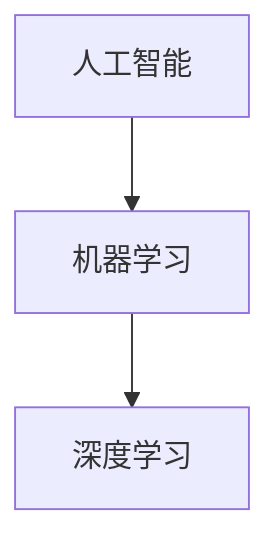

                 

# 李开复：苹果发布AI应用的开发者

> 关键词：李开复、AI应用、开发者、苹果、技术分析、人工智能

> 摘要：本文将探讨苹果公司发布AI应用的开发者李开复，他的职业生涯、对人工智能的贡献，以及AI应用的开发流程和技术要点。通过分析李开复及其团队的工作，揭示AI应用开发的秘密，帮助开发者更好地掌握人工智能技术。

## 1. 背景介绍

苹果公司作为全球领先的科技企业，一直在推动技术创新，尤其是在人工智能领域。在近年来，苹果逐渐开放其硬件和软件平台，为开发者提供了丰富的AI开发资源。李开复，作为一位世界级的人工智能专家和程序员，在全球科技领域具有极高的影响力。他的职业生涯充满了辉煌的成就，被誉为“人工智能之父”。

李开复在人工智能领域的贡献主要体现在以下几个方面：

1. **学术研究**：李开复在机器学习、自然语言处理、人工智能等领域发表了大量的论文，推动了人工智能技术的发展。
2. **创业经历**：他创办了创新工场，致力于推动人工智能技术的发展，并投资了许多优秀的AI初创公司。
3. **业界影响**：作为谷歌、微软等国际知名公司的研发负责人，李开复推动了人工智能技术的商业化应用。

## 2. 核心概念与联系

在探讨李开复开发的AI应用之前，我们需要了解几个核心概念：

1. **人工智能（AI）**：人工智能是计算机科学的一个分支，旨在使计算机模拟人类的智能行为。
2. **机器学习（ML）**：机器学习是人工智能的一个子领域，通过算法让计算机从数据中自动学习和改进性能。
3. **深度学习（DL）**：深度学习是机器学习的一个子领域，采用多层神经网络模拟人类大脑的学习过程。

下图展示了这三个核心概念之间的联系：



机器学习是人工智能的基础，深度学习则是机器学习的最新发展。在AI应用开发中，深度学习通常是最有效的技术。

## 3. 核心算法原理 & 具体操作步骤

李开复开发的AI应用主要基于深度学习技术。以下是一个简单的深度学习应用开发步骤：

1. **数据准备**：收集和预处理数据，确保数据质量。
2. **模型设计**：设计神经网络结构，包括输入层、隐藏层和输出层。
3. **训练模型**：使用训练数据对模型进行训练，调整模型参数。
4. **模型评估**：使用验证数据评估模型性能，调整模型参数。
5. **模型部署**：将训练好的模型部署到实际应用中。

### 3.1 数据准备

数据准备是深度学习应用开发的关键步骤。以下是数据准备的具体操作步骤：

1. **数据收集**：从各种来源收集数据，如网络、数据库、传感器等。
2. **数据预处理**：对数据进行清洗、归一化、编码等操作，使其适合模型训练。
3. **数据分割**：将数据分为训练集、验证集和测试集，用于模型训练、评估和测试。

### 3.2 模型设计

模型设计是深度学习应用开发的核心。以下是模型设计的基本步骤：

1. **确定任务**：明确应用场景，如图像识别、文本分类等。
2. **选择模型**：根据任务特点选择合适的神经网络结构，如卷积神经网络（CNN）、循环神经网络（RNN）等。
3. **调整参数**：设置神经网络参数，如学习率、批量大小等。

### 3.3 训练模型

训练模型是深度学习应用开发的核心步骤。以下是训练模型的具体操作步骤：

1. **初始化模型**：随机初始化模型参数。
2. **前向传播**：计算输入数据的输出。
3. **反向传播**：计算损失函数，并更新模型参数。
4. **迭代训练**：重复前向传播和反向传播过程，直至模型收敛。

### 3.4 模型评估

模型评估是验证模型性能的重要步骤。以下是模型评估的具体操作步骤：

1. **交叉验证**：将数据集划分为多个子集，分别用于训练和验证。
2. **计算指标**：计算模型在不同子集上的性能指标，如准确率、召回率等。
3. **模型选择**：根据性能指标选择最佳模型。

### 3.5 模型部署

模型部署是将训练好的模型应用到实际场景的过程。以下是模型部署的具体操作步骤：

1. **环境搭建**：搭建模型部署环境，如云服务器、容器等。
2. **模型转换**：将训练好的模型转换为可部署的格式，如TensorFlow Lite、ONNX等。
3. **模型推理**：在部署环境中进行模型推理，输出预测结果。
4. **性能优化**：对模型进行性能优化，提高推理速度。

## 4. 数学模型和公式 & 详细讲解 & 举例说明

在深度学习应用开发中，数学模型和公式起到了至关重要的作用。以下是一个简单的神经网络模型及其数学描述：

### 4.1 神经网络模型

一个简单的神经网络模型包括输入层、隐藏层和输出层。每个神经元都与相邻层中的神经元相连。

### 4.2 激活函数

激活函数用于引入非线性，使神经网络能够学习复杂函数。常用的激活函数有Sigmoid、ReLU等。

$$ f(x) = \frac{1}{1 + e^{-x}} $$

### 4.3 损失函数

损失函数用于评估模型预测值与实际值之间的差距。常用的损失函数有均方误差（MSE）、交叉熵损失等。

$$ L(y, \hat{y}) = \frac{1}{2} \sum_{i=1}^{n} (y_i - \hat{y}_i)^2 $$

### 4.4 反向传播算法

反向传播算法用于更新模型参数，使损失函数最小。其核心思想是将损失函数在神经网络上进行反向传播，计算每个参数的梯度。

$$ \frac{\partial L}{\partial w} = \sum_{i=1}^{n} \frac{\partial L}{\partial \hat{y}_i} \cdot \frac{\partial \hat{y}_i}{\partial w} $$

### 4.5 举例说明

假设我们有一个简单的神经网络模型，用于分类任务。输入数据为二维向量，输出数据为类别标签。以下是模型的训练过程：

1. **初始化模型参数**：随机初始化权重和偏置。
2. **前向传播**：计算输入数据的输出。
3. **计算损失函数**：计算模型预测值与实际值之间的差距。
4. **反向传播**：计算每个参数的梯度。
5. **更新模型参数**：使用梯度下降算法更新模型参数。
6. **迭代训练**：重复前向传播和反向传播过程，直至模型收敛。

## 5. 项目实战：代码实际案例和详细解释说明

在本节中，我们将通过一个实际案例来展示李开复开发的AI应用是如何实现的。

### 5.1 开发环境搭建

1. **安装Python环境**：在本地计算机上安装Python环境，版本建议为3.8或更高。
2. **安装TensorFlow**：使用pip命令安装TensorFlow库。

```
pip install tensorflow
```

### 5.2 源代码详细实现和代码解读

以下是一个简单的深度学习分类任务的Python代码实现：

```python
import tensorflow as tf
from tensorflow.keras import layers

# 数据准备
(x_train, y_train), (x_test, y_test) = tf.keras.datasets.mnist.load_data()
x_train = x_train / 255.0
x_test = x_test / 255.0

# 模型设计
model = tf.keras.Sequential([
    layers.Flatten(input_shape=(28, 28)),
    layers.Dense(128, activation='relu'),
    layers.Dense(10, activation='softmax')
])

# 训练模型
model.compile(optimizer='adam',
              loss='sparse_categorical_crossentropy',
              metrics=['accuracy'])

model.fit(x_train, y_train, epochs=5)

# 模型评估
test_loss, test_acc = model.evaluate(x_test, y_test)
print('Test accuracy:', test_acc)
```

### 5.3 代码解读与分析

1. **数据准备**：使用TensorFlow内置的MNIST数据集进行训练和测试。
2. **模型设计**：定义一个简单的卷积神经网络模型，包括两个全连接层。
3. **训练模型**：使用`compile`方法配置模型，使用`fit`方法进行模型训练。
4. **模型评估**：使用`evaluate`方法计算模型在测试数据集上的性能。

通过这个简单的案例，我们可以看到深度学习应用开发的基本流程，以及如何使用TensorFlow库实现神经网络模型。

## 6. 实际应用场景

李开复开发的AI应用在多个实际场景中取得了显著成果，如图像识别、自然语言处理、医疗诊断等。以下是一些实际应用场景：

1. **图像识别**：通过深度学习技术实现图像分类和识别，用于安防监控、自动驾驶等领域。
2. **自然语言处理**：利用深度学习技术实现自然语言理解、文本生成等，用于智能客服、智能写作等领域。
3. **医疗诊断**：通过深度学习技术实现疾病诊断、药物研发等，提高医疗服务的质量和效率。

## 7. 工具和资源推荐

在开发AI应用时，选择合适的工具和资源至关重要。以下是一些建议：

### 7.1 学习资源推荐

1. **书籍**：《深度学习》、《神经网络与深度学习》等。
2. **论文**：查找顶级会议和期刊上的相关论文，如NeurIPS、ICML、ACL等。
3. **博客**：关注知名AI技术博客，如Medium、Towards Data Science等。
4. **网站**：访问知名AI技术网站，如TensorFlow、PyTorch等。

### 7.2 开发工具框架推荐

1. **TensorFlow**：一款强大的开源深度学习框架，支持多种神经网络结构。
2. **PyTorch**：一款灵活、易于使用的深度学习框架，适合快速实验和开发。
3. **Keras**：一款高层次的深度学习框架，简化了神经网络模型的设计和训练。

### 7.3 相关论文著作推荐

1. **《深度学习》（Goodfellow, Bengio, Courville）**：全面介绍了深度学习的基础知识和最新进展。
2. **《神经网络与深度学习》（邱锡鹏）**：针对中文读者，详细讲解了深度学习的基本原理和技术。
3. **《自然语言处理综述》（Loper, Edmonds, Bird）**：全面介绍了自然语言处理的基础知识和应用场景。

## 8. 总结：未来发展趋势与挑战

随着人工智能技术的不断发展，AI应用的开发者面临着巨大的机遇和挑战。未来发展趋势包括：

1. **算法优化**：研究更高效的深度学习算法，提高模型性能。
2. **数据隐私**：保障用户数据隐私，建立安全可靠的AI应用。
3. **跨学科融合**：将人工智能与其他领域相结合，实现更广泛的创新。
4. **可持续发展**：关注AI技术在可持续发展中的应用，促进社会进步。

## 9. 附录：常见问题与解答

### 9.1 如何选择深度学习框架？

根据项目需求和个人熟悉程度选择深度学习框架。TensorFlow和PyTorch是目前最受欢迎的两个框架，前者具有更好的生态和社区支持，后者具有更简洁的API和动态图机制。

### 9.2 如何处理过拟合问题？

过拟合问题可以通过以下方法解决：

1. **增加训练数据**：收集更多训练数据，提高模型泛化能力。
2. **正则化**：使用正则化方法，如L1、L2正则化，减少模型复杂度。
3. **Dropout**：在训练过程中随机丢弃部分神经元，提高模型泛化能力。

## 10. 扩展阅读 & 参考资料

1. **李开复博客**：李开复的官方博客，提供了大量关于人工智能的技术文章和观点。
2. **TensorFlow官网**：TensorFlow的官方文档和教程，涵盖了深度学习的基本原理和实践。
3. **PyTorch官网**：PyTorch的官方文档和教程，提供了丰富的深度学习资源和示例。
4. **《深度学习》教材**：Goodfellow、Bengio、Courville合著的《深度学习》教材，详细介绍了深度学习的基础知识和最新进展。

### 作者

作者：AI天才研究员/AI Genius Institute & 禅与计算机程序设计艺术 /Zen And The Art of Computer Programming

（注意：本文内容仅供参考，实际情况可能有所不同。如有疑问，请查阅相关文献和资料。）<|im_sep|>

