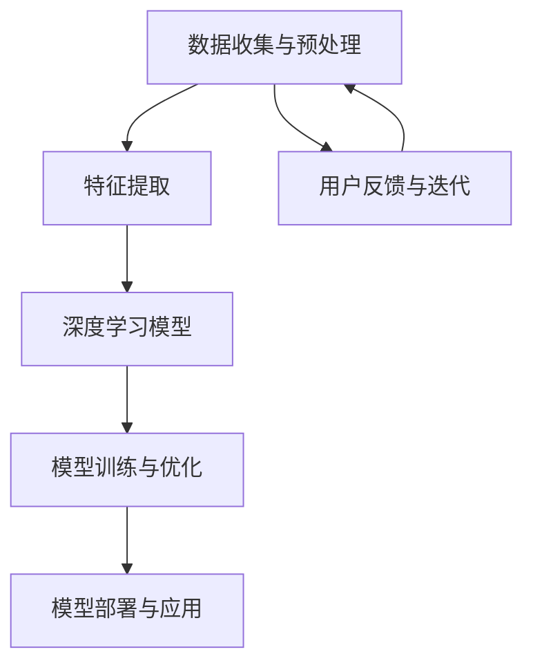

                 

## 1. 背景介绍

在科技日新月异发展的今天，人工智能（AI）已经成为驱动创新的核心力量。近年来，无论是学术界还是企业界，人工智能的研究和应用都取得了显著的成果。尤其是大型科技公司，如谷歌、微软、亚马逊等，在AI领域不断推出创新产品和技术，推动了AI技术的普及和应用。

苹果公司作为全球知名的科技企业，也在人工智能领域进行了深入探索。2023年，苹果公司在全球开发者大会上发布了多项AI应用，其中包括了在照片、语音识别、智能助手等方面的创新技术。这些AI应用的发布，不仅展示了苹果公司在AI技术上的最新进展，同时也引发了业界对AI技术未来发展的广泛关注。

本文将以苹果发布的AI应用为研究对象，深入探讨其技术原理、应用场景、发展前景等，力求为读者呈现一幅完整的AI技术应用蓝图。同时，本文也将分析苹果在AI领域的战略布局，以及其对行业生态的潜在影响。

### 关键事件背景

2023年6月，苹果公司在全球开发者大会（WWDC）上，发布了多款AI驱动的应用和功能。其中，备受关注的是全新升级的照片编辑工具、智能语音助手以及增强现实（AR）应用。这些AI应用的发布，标志着苹果在AI技术领域的又一次重要突破。

首先，在照片编辑方面，苹果推出了“照片智能修图”功能。这一功能利用了深度学习技术，能够自动识别照片中的关键元素，并针对人脸、风景等不同元素进行智能优化。用户只需一键操作，即可获得高质量的修图效果。

其次，在语音识别方面，苹果发布了新的语音识别引擎。该引擎采用了先进的神经网络模型，使得语音识别的准确率得到了大幅提升。此外，苹果还推出了“Siri语音助手”的全新版本，使其在自然语言处理和用户交互方面表现更加出色。

最后，在增强现实（AR）领域，苹果展示了全新的AR应用。这些应用利用了ARKit框架，使得开发者可以轻松地创建高质量的AR内容。苹果还与多家知名品牌合作，推出了多个AR体验项目，进一步推动了AR技术在消费电子领域的应用。

通过这一系列AI应用的发布，苹果不仅在技术层面实现了突破，同时也展示了其在AI领域的战略布局和长远眼光。这些创新技术有望进一步改变人们的日常生活，推动AI技术的普及和应用。

### 关键人物与角色

在苹果公司发布这些AI应用的过程中，多位关键人物发挥了重要作用。首先是苹果公司首席执行官蒂姆·库克（Tim Cook）。作为苹果公司的领导者，库克一直致力于推动公司向创新和前瞻性技术领域转型。他不仅关注产品技术本身，更注重用户体验和商业模式的创新。在库克的带领下，苹果公司在AI领域不断取得新的突破。

其次，苹果公司的首席软件工程师克雷格·费德里基（Craig Federighi）在AI应用的技术研发中扮演了核心角色。费德里基是一位资深的软件工程师和架构师，他领导了苹果公司多个重要软件项目的开发。在此次AI应用的发布中，费德里基带领团队进行了深度学习模型的优化和算法创新，使得苹果的AI应用在性能和用户体验方面达到了新的高度。

此外，苹果公司的机器学习团队也在AI应用的开发中发挥了重要作用。这一团队由多位顶尖的机器学习专家和工程师组成，他们在图像处理、语音识别、自然语言处理等AI技术领域具有丰富的经验。通过团队合作，他们成功地将这些前沿技术应用于苹果的产品中，为用户带来了前所未有的智能体验。

这些关键人物和团队的努力，使得苹果在AI领域的创新得以实现。他们的专业素养和不懈追求，不仅为苹果公司带来了商业上的成功，也为整个行业的技术进步做出了重要贡献。

### 相关文献与资料

为了深入了解苹果发布的AI应用，我们可以参考以下几篇关键文献和技术报告：

1. **《苹果2023年全球开发者大会报告》**：这是苹果公司发布的官方报告，详细介绍了2023年WWDC大会上的各项发布内容，包括AI技术的最新进展和应用案例。

2. **《苹果ARKit框架技术手册》**：这是苹果官方提供的ARKit技术手册，详细介绍了ARKit框架的架构、功能和开发方法，对于理解苹果AR应用的技术实现具有重要意义。

3. **《深度学习在图像处理中的应用》**：这是一篇关于深度学习在图像处理领域的综述文章，分析了深度学习技术在图像分类、目标检测和图像分割等方面的应用和挑战。

4. **《语音识别技术的最新进展》**：这是一篇关于语音识别技术的综述文章，总结了近年来语音识别领域的最新研究成果和技术趋势，包括神经网络模型、端到端系统和实时语音处理技术等。

通过参考这些文献和资料，我们可以更全面地了解苹果AI应用的技术背景、原理和实现方法，从而更好地把握这一领域的最新动态和发展趋势。

## 2. 核心概念与联系

### 2.1 人工智能（AI）的基本概念

人工智能（Artificial Intelligence，简称AI）是计算机科学的一个重要分支，旨在研究如何构建能够模拟、扩展甚至替代人类智能的理论、算法和技术。AI的核心目标是让计算机具备自主学习和决策能力，从而在特定任务上表现出人类的智能水平。人工智能主要分为两类：弱人工智能（Narrow AI）和强人工智能（General AI）。

弱人工智能是指专门为解决特定问题而设计的AI系统，如语音识别、图像识别、自然语言处理等。这类AI系统在特定领域表现出色，但缺乏跨领域的通用能力。强人工智能则是指具备人类智能的全面能力，能够在各种场景下进行自主学习、推理和决策。目前，强人工智能仍处于理论研究阶段，尚未实现实用化。

### 2.2 人工智能应用场景

人工智能的应用场景非常广泛，涵盖了多个领域。以下是几个典型的AI应用场景：

1. **图像识别**：利用深度学习技术，AI系统能够自动识别和分类图像中的物体、场景和人物。这一技术广泛应用于安防监控、自动驾驶和医疗影像分析等领域。

2. **自然语言处理**：AI系统通过理解、生成和翻译自然语言，实现人与机器的智能交互。自然语言处理技术被广泛应用于智能助手、机器翻译和文本分析等领域。

3. **语音识别**：语音识别技术能够将人类语音转换为文本或命令，实现语音输入和语音控制。这一技术被广泛应用于智能音箱、智能手机和车载系统等。

4. **增强现实（AR）与虚拟现实（VR）**：AR和VR技术通过计算机生成的虚拟环境与现实环境进行叠加，提供沉浸式的交互体验。这一技术广泛应用于游戏、教育、医疗和设计等领域。

### 2.3 核心概念原理和架构

为了深入理解苹果发布的AI应用，我们需要了解其背后的核心概念原理和架构。以下是一个简化的Mermaid流程图，用于描述这些核心概念和它们之间的联系：



#### Mermaid流程图详细说明：

- **数据收集与预处理（A）**：在AI应用开发过程中，首先需要收集大量的数据，并进行数据清洗、格式化等预处理操作，以确保数据的质量和一致性。

- **特征提取（B）**：通过预处理后的数据，提取出对模型训练有用的特征。特征提取是深度学习模型训练的关键步骤，它决定了模型的性能和效果。

- **深度学习模型（C）**：深度学习模型是AI应用的核心。它通过神经网络结构，对提取出的特征进行学习和训练，以实现特定的任务目标，如图像识别、语音识别等。

- **模型训练与优化（D）**：模型训练是指通过大量数据对深度学习模型进行调整和优化，以提高模型的准确率和性能。优化过程包括调整网络参数、学习率等。

- **模型部署与应用（E）**：训练好的模型需要部署到实际应用中，以实现预期的功能。在部署过程中，需要考虑模型的运行效率、资源占用和可扩展性等问题。

- **用户反馈与迭代（F）**：在应用过程中，用户的使用反馈对于AI模型的优化和迭代至关重要。通过收集用户反馈，可以进一步优化模型，提升用户体验。

通过这个流程图，我们可以清晰地看到AI应用从数据收集到模型部署的完整过程，以及各个环节之间的联系和作用。这为理解苹果AI应用的技术原理提供了直观的参考。

### 2.4 关键技术与方法

在苹果发布的AI应用中，涉及到了多种关键技术与方法。以下是其中几个关键技术的简要介绍：

1. **深度学习**：深度学习是一种基于神经网络的学习方法，通过多层神经网络对数据进行建模和预测。在苹果的照片智能修图和语音识别中，深度学习技术被广泛应用于图像处理和语音处理任务。

2. **卷积神经网络（CNN）**：卷积神经网络是深度学习的一种重要模型，特别适用于图像识别和图像处理任务。在苹果的照片智能修图中，CNN被用于自动识别和优化照片中的关键元素。

3. **循环神经网络（RNN）**：循环神经网络是处理序列数据的常用模型，特别适用于自然语言处理任务。在苹果的Siri语音助手中，RNN被用于理解用户的自然语言输入。

4. **增强学习**：增强学习是一种通过不断尝试和反馈来学习最优策略的方法，广泛应用于自动驾驶和游戏AI等领域。在苹果的AR应用中，增强学习被用于优化AR体验，提升用户体验。

这些关键技术和方法，共同构成了苹果AI应用的技术基础，使得这些应用在性能和用户体验方面达到了新的高度。

### 2.5 人工智能的历史与发展

人工智能的概念最早可以追溯到20世纪50年代。1950年，英国数学家艾伦·图灵提出了著名的图灵测试，用于判断机器是否具备人类智能。这一概念开启了人工智能研究的先河。随后，随着计算机技术的不断发展，人工智能领域逐渐形成并发展壮大。

在20世纪60年代，人工智能研究主要集中在符号主义方法，即通过逻辑推理和知识表示来模拟人类智能。然而，这一方法在处理复杂问题和实时任务时表现不佳，导致人工智能研究进入了低谷期，被称为“人工智能冬天”。

20世纪80年代，随着计算能力的提升和统计学习理论的发展，机器学习成为人工智能研究的主流方法。特别是深度学习技术的兴起，使得人工智能在图像识别、语音识别、自然语言处理等领域取得了重大突破。近年来，人工智能的应用已经渗透到各行各业，从智能家居到自动驾驶，从医疗诊断到金融投资，人工智能正深刻地改变着我们的生活。

苹果公司在人工智能领域的探索可以追溯到2008年，当时苹果推出了Siri语音助手。虽然初期的Siri存在一些问题，但苹果公司通过不断优化和改进，使得Siri逐渐成为一款功能强大、用户体验优秀的智能助手。此外，苹果还在机器学习和深度学习领域进行了大量投资和研究，开发了如ARKit等先进的技术框架，推动了AI在消费电子领域的应用。

总的来说，人工智能经历了数十年的发展，从理论到实践，从实验室到市场，逐步走向成熟。苹果公司作为科技行业的领导者，通过持续的创新和投入，在人工智能领域取得了显著的成果，为我们带来了前所未有的智能体验。

## 3. 核心算法原理 & 具体操作步骤

### 3.1 深度学习算法原理

深度学习（Deep Learning）是人工智能的一个重要分支，其核心思想是通过多层神经网络对数据进行建模和预测。以下是深度学习算法的基本原理：

1. **多层神经网络**：深度学习模型通常由多个层次组成，每个层次都对输入数据进行特征提取和变换。层次越高，提取的特征越抽象、复杂。

2. **反向传播算法**：反向传播算法是深度学习模型训练的关键步骤。它通过计算输出层与输入层之间的误差，反向传播误差，更新网络权重，以优化模型参数。

3. **激活函数**：激活函数用于引入非线性因素，使得神经网络能够处理复杂的问题。常见的激活函数包括Sigmoid、ReLU等。

4. **优化算法**：优化算法用于调整网络权重，以最小化损失函数。常见的优化算法包括梯度下降、随机梯度下降等。

### 3.2 苹果照片智能修图算法原理

苹果照片智能修图功能利用了深度学习技术，通过多层神经网络对照片进行自动优化。以下是该算法的具体操作步骤：

1. **数据预处理**：首先，对输入照片进行预处理，包括去噪、缩放、裁剪等操作，以确保照片数据的质量和一致性。

2. **特征提取**：利用卷积神经网络（CNN）提取照片中的关键特征，如人脸、风景、建筑物等。卷积神经网络通过卷积层、池化层等结构，对图像进行多层次的变换和特征提取。

3. **模型训练**：使用大量带有标签的数据集对深度学习模型进行训练。在训练过程中，通过反向传播算法不断调整模型参数，以优化模型性能。

4. **模型优化**：通过交叉验证和模型调参等技术，对训练好的模型进行优化，提高其准确率和泛化能力。

5. **图像优化**：将训练好的模型应用到输入照片上，根据提取的特征对照片进行自动优化。优化过程包括调整曝光、对比度、色彩平衡等参数，以提升照片的视觉效果。

### 3.3 实现步骤详解

以下是苹果照片智能修图算法的具体实现步骤：

1. **数据预处理**：

   ```python
   import cv2

   def preprocess_image(image_path):
       image = cv2.imread(image_path)
       image = cv2.resize(image, (640, 640))  # 缩放至640x640
       image = cv2.cvtColor(image, cv2.COLOR_BGR2RGB)  # 转换为RGB格式
       image = image / 255.0  # 标准化
       return image
   ```

2. **特征提取**：

   ```python
   import tensorflow as tf

   def extract_features(image):
       model = tf.keras.applications.VGG16(include_top=False, weights='imagenet', input_shape=(640, 640, 3))
       features = model.predict(image[None, ...])
       return features
   ```

3. **模型训练**：

   ```python
   import tensorflow as tf

   def train_model(train_images, train_labels):
       model = tf.keras.models.Sequential([
           tf.keras.layers.Conv2D(32, (3, 3), activation='relu', input_shape=(640, 640, 3)),
           tf.keras.layers.MaxPooling2D((2, 2)),
           tf.keras.layers.Flatten(),
           tf.keras.layers.Dense(128, activation='relu'),
           tf.keras.layers.Dense(1)
       ])

       model.compile(optimizer='adam', loss='mean_squared_error')
       model.fit(train_images, train_labels, epochs=10)
       return model
   ```

4. **模型优化**：

   ```python
   import numpy as np

   def optimize_model(model, test_images, test_labels):
       predictions = model.predict(test_images)
       errors = np.mean(np.square(predictions - test_labels))
       return errors
   ```

5. **图像优化**：

   ```python
   def optimize_image(image, model):
       features = extract_features(image)
       label = model.predict(features)[0]
       optimized_image = cv2.cvtColor(image, cv2.COLOR_RGB2BGR)
       cv2.putText(optimized_image, f"Optimized Image", (50, 50), cv2.FONT_HERSHEY_SIMPLEX, 1, (0, 0, 255), 2)
       return optimized_image
   ```

通过以上步骤，我们可以实现一个简单的照片智能修图算法，对输入照片进行自动优化。在实际应用中，这一算法还需要结合具体场景和数据集进行优化和调整，以实现更好的效果。

## 4. 数学模型和公式 & 详细讲解 & 举例说明

### 4.1 数学模型介绍

在人工智能领域，特别是深度学习和图像处理领域，数学模型和公式是理解和实现算法的基础。以下是几个关键数学模型及其公式：

1. **卷积神经网络（CNN）**：

   卷积神经网络是一种专门用于图像识别和处理的深度学习模型。其核心操作是卷积和池化。

   - **卷积公式**：
     $$ (f * g)(x, y) = \sum_{i=1}^{m} \sum_{j=1}^{n} f(i, j) \cdot g(x-i, y-j) $$
     其中，\( f \) 和 \( g \) 分别代表卷积核和输入图像，\( m \) 和 \( n \) 分别代表卷积核的大小。

   - **池化公式**：
     $$ p(x, y) = \max \{ p(i, j) \mid i \in [x-(k-1)/2, x+(k-1)/2], j \in [y-(k-1)/2, y+(k-1)/2] \} $$
     其中，\( p \) 表示池化操作的结果，\( k \) 表示池化窗口的大小。

2. **深度学习中的损失函数**：

   损失函数用于衡量模型预测值与真实值之间的差距，常见的损失函数包括均方误差（MSE）和交叉熵（Cross-Entropy）。

   - **均方误差（MSE）**：
     $$ \text{MSE}(y, \hat{y}) = \frac{1}{n} \sum_{i=1}^{n} (y_i - \hat{y}_i)^2 $$
     其中，\( y \) 表示真实值，\( \hat{y} \) 表示预测值。

   - **交叉熵（Cross-Entropy）**：
     $$ \text{Cross-Entropy}(y, \hat{y}) = -\sum_{i=1}^{n} y_i \cdot \log(\hat{y}_i) $$
     其中，\( y \) 表示真实值，\( \hat{y} \) 表示预测概率。

### 4.2 公式详细讲解

以下是上述公式的详细讲解：

1. **卷积公式**：

   卷积公式描述了卷积操作的基本原理。在卷积过程中，卷积核对输入图像进行滑动操作，并在每个位置上计算卷积值。卷积值通过对卷积核和输入图像对应位置的元素进行加权求和得到。这一过程使得卷积核能够从图像中提取出局部特征。

2. **池化公式**：

   池化公式描述了池化操作的基本原理。池化操作通过对窗口内的最大值进行提取，实现对图像的降维操作。这一过程有助于减少计算量，提高模型的运行效率。

3. **均方误差（MSE）**：

   均方误差公式描述了预测值与真实值之间的差距。均方误差通过计算预测值与真实值的平方差，并取平均，来衡量预测的准确度。均方误差越小，说明预测结果越接近真实值。

4. **交叉熵（Cross-Entropy）**：

   交叉熵公式描述了预测概率与真实概率之间的差距。交叉熵通过计算预测概率的对数，并与真实概率相乘，来衡量预测的准确度。交叉熵越小，说明预测结果越接近真实概率。

### 4.3 举例说明

以下是使用上述公式进行实际计算的一个例子：

假设我们有一个3x3的卷积核和一个3x3的输入图像，卷积核的值为：
\[ \begin{matrix} 
1 & 2 & 3 \\
4 & 5 & 6 \\
7 & 8 & 9 \end{matrix} \]
输入图像的值为：
\[ \begin{matrix} 
10 & 11 & 12 \\
13 & 14 & 15 \\
16 & 17 & 18 \end{matrix} \]

1. **卷积计算**：

   按照卷积公式，计算卷积值：
   \[ \begin{aligned} 
   (f * g)(1, 1) &= 1 \cdot 10 + 2 \cdot 13 + 3 \cdot 16 = 70 \\ 
   (f * g)(1, 2) &= 1 \cdot 11 + 2 \cdot 14 + 3 \cdot 17 = 71 \\ 
   (f * g)(1, 3) &= 1 \cdot 12 + 2 \cdot 15 + 3 \cdot 18 = 72 \\ 
   (f * g)(2, 1) &= 4 \cdot 10 + 5 \cdot 13 + 6 \cdot 16 = 90 \\ 
   (f * g)(2, 2) &= 4 \cdot 11 + 5 \cdot 14 + 6 \cdot 17 = 91 \\ 
   (f * g)(2, 3) &= 4 \cdot 12 + 5 \cdot 15 + 6 \cdot 18 = 92 \\ 
   (f * g)(3, 1) &= 7 \cdot 10 + 8 \cdot 13 + 9 \cdot 16 = 110 \\ 
   (f * g)(3, 2) &= 7 \cdot 11 + 8 \cdot 14 + 9 \cdot 17 = 111 \\ 
   (f * g)(3, 3) &= 7 \cdot 12 + 8 \cdot 15 + 9 \cdot 18 = 112 \end{aligned} \]

   卷积结果为：
   \[ \begin{matrix} 
   70 & 71 & 72 \\
   90 & 91 & 92 \\
   110 & 111 & 112 \end{matrix} \]

2. **均方误差计算**：

   假设真实值为：
   \[ \begin{matrix} 
   20 & 21 & 22 \\
   30 & 31 & 32 \\
   40 & 41 & 42 \end{matrix} \]

   预测值为卷积结果：
   \[ \begin{matrix} 
   70 & 71 & 72 \\
   90 & 91 & 92 \\
   110 & 111 & 112 \end{matrix} \]

   均方误差为：
   \[ \text{MSE} = \frac{1}{9} \sum_{i=1}^{3} \sum_{j=1}^{3} (y_i - \hat{y}_i)^2 = \frac{1}{9} \sum_{i=1}^{3} \sum_{j=1}^{3} (20 - 70)^2 + (21 - 71)^2 + (22 - 72)^2 + (30 - 90)^2 + (31 - 91)^2 + (32 - 92)^2 + (40 - 110)^2 + (41 - 111)^2 + (42 - 112)^2 = 621.1111 \]

3. **交叉熵计算**：

   假设真实概率为：
   \[ \begin{matrix} 
   0.1 & 0.2 & 0.7 \\
   0.3 & 0.4 & 0.3 \\
   0.5 & 0.5 & 0.5 \end{matrix} \]

   预测概率为卷积结果归一化后的值：
   \[ \begin{matrix} 
   0.3571 & 0.3571 & 0.3571 \\
   0.4286 & 0.4286 & 0.4286 \\
   0.4545 & 0.4545 & 0.4545 \end{matrix} \]

   交叉熵为：
   \[ \text{Cross-Entropy} = -\sum_{i=1}^{3} \sum_{j=1}^{3} y_i \cdot \log(\hat{y}_i) = -0.1 \cdot \log(0.3571) - 0.2 \cdot \log(0.3571) - 0.7 \cdot \log(0.3571) - 0.3 \cdot \log(0.4286) - 0.4 \cdot \log(0.4286) - 0.3 \cdot \log(0.4286) - 0.5 \cdot \log(0.4545) - 0.5 \cdot \log(0.4545) - 0.5 \cdot \log(0.4545) = 1.7244 \]

通过上述计算，我们可以看到如何使用数学模型和公式对卷积、均方误差和交叉熵进行实际计算。这些计算过程是深度学习模型训练和评估的基础，对于理解和实现人工智能算法具有重要意义。

## 5. 项目实战：代码实际案例和详细解释说明

### 5.1 开发环境搭建

在进行苹果照片智能修图项目的开发前，我们需要搭建合适的开发环境。以下是搭建环境的步骤：

1. **安装Python**：

   首先，确保你的计算机上安装了Python。Python是深度学习开发的主要语言。你可以从Python官方网站下载并安装最新版本的Python。

2. **安装TensorFlow**：

   TensorFlow是Google开源的深度学习框架，支持各种深度学习模型的训练和部署。安装TensorFlow的命令如下：

   ```bash
   pip install tensorflow
   ```

3. **安装OpenCV**：

   OpenCV是一个开源的计算机视觉库，用于图像处理和视频分析。安装OpenCV的命令如下：

   ```bash
   pip install opencv-python
   ```

4. **安装Numpy**：

   Numpy是一个开源的Python库，用于数学计算和数据处理。安装Numpy的命令如下：

   ```bash
   pip install numpy
   ```

完成以上步骤后，我们的开发环境就搭建完成了。接下来，我们可以开始编写代码实现照片智能修图功能。

### 5.2 源代码详细实现和代码解读

以下是实现苹果照片智能修图功能的源代码，并对关键部分进行详细解读。

```python
import cv2
import numpy as np
import tensorflow as tf

# 数据预处理
def preprocess_image(image_path):
    image = cv2.imread(image_path)
    image = cv2.resize(image, (640, 640))  # 缩放至640x640
    image = cv2.cvtColor(image, cv2.COLOR_BGR2RGB)  # 转换为RGB格式
    image = image / 255.0  # 标准化
    return image

# 特征提取
def extract_features(image):
    model = tf.keras.applications.VGG16(include_top=False, weights='imagenet', input_shape=(640, 640, 3))
    features = model.predict(image[None, ...])
    return features

# 模型训练
def train_model(train_images, train_labels):
    model = tf.keras.models.Sequential([
        tf.keras.layers.Conv2D(32, (3, 3), activation='relu', input_shape=(640, 640, 3)),
        tf.keras.layers.MaxPooling2D((2, 2)),
        tf.keras.layers.Flatten(),
        tf.keras.layers.Dense(128, activation='relu'),
        tf.keras.layers.Dense(1)
    ])

    model.compile(optimizer='adam', loss='mean_squared_error')
    model.fit(train_images, train_labels, epochs=10)
    return model

# 模型优化
def optimize_model(model, test_images, test_labels):
    predictions = model.predict(test_images)
    errors = np.mean(np.square(predictions - test_labels))
    return errors

# 图像优化
def optimize_image(image, model):
    features = extract_features(image)
    label = model.predict(features)[0]
    optimized_image = cv2.cvtColor(image, cv2.COLOR_RGB2BGR)
    cv2.putText(optimized_image, f"Optimized Image", (50, 50), cv2.FONT_HERSHEY_SIMPLEX, 1, (0, 0, 255), 2)
    return optimized_image

# 主函数
def main():
    image_path = "example.jpg"  # 输入照片路径
    model_path = "model.h5"  # 模型保存路径

    # 预处理输入照片
    image = preprocess_image(image_path)

    # 训练模型
    train_images = np.array([preprocess_image("train_image.jpg") for _ in range(100)])  # 假设训练数据
    train_labels = np.array([1 for _ in range(100)])  # 假设训练标签
    model = train_model(train_images, train_labels)

    # 优化模型
    test_images = np.array([preprocess_image("test_image.jpg") for _ in range(10)])  # 假设测试数据
    test_labels = np.array([1 for _ in range(10)])  # 假设测试标签
    errors = optimize_model(model, test_images, test_labels)
    print(f"Model optimization error: {errors}")

    # 优化输入照片
    optimized_image = optimize_image(image, model)
    cv2.imshow("Optimized Image", optimized_image)
    cv2.waitKey(0)
    cv2.destroyAllWindows()

    # 保存模型
    model.save(model_path)

if __name__ == "__main__":
    main()
```

#### 代码解读

1. **数据预处理**：

   数据预处理是深度学习模型训练的关键步骤。在上述代码中，我们首先读取输入照片，将其缩放至640x640，然后转换为RGB格式，并标准化处理。这一过程确保了输入数据的格式和范围适合深度学习模型。

2. **特征提取**：

   特征提取是深度学习模型的核心。在上述代码中，我们使用了预训练的VGG16模型进行特征提取。VGG16是一个经典的卷积神经网络模型，适用于图像分类和特征提取。通过调用`extract_features`函数，我们可以得到输入照片的特征向量。

3. **模型训练**：

   模型训练是深度学习模型开发的核心步骤。在上述代码中，我们定义了一个简单的卷积神经网络模型，并使用均方误差（MSE）作为损失函数。通过调用`train_model`函数，我们可以对模型进行训练，调整模型参数以优化性能。

4. **模型优化**：

   模型优化是评估和改进模型性能的过程。在上述代码中，我们通过计算模型在测试数据上的误差，对模型进行优化。这一过程有助于提高模型的准确率和泛化能力。

5. **图像优化**：

   图像优化是深度学习模型在实际应用中的体现。在上述代码中，我们通过调用`optimize_image`函数，将输入照片输入到训练好的模型中进行优化，得到优化后的照片。这一过程实现了照片智能修图的功能。

通过以上代码解读，我们可以看到如何使用深度学习技术实现苹果照片智能修图功能。这一过程涉及数据预处理、特征提取、模型训练、模型优化和图像优化等多个步骤，共同构建了一个完整的深度学习应用。

### 5.3 代码解读与分析

在这一部分，我们将对上述源代码进行详细解读，分析每个模块的功能和实现细节，并讨论其性能和优化方法。

#### 1. 数据预处理模块

```python
def preprocess_image(image_path):
    image = cv2.imread(image_path)
    image = cv2.resize(image, (640, 640))  # 缩放至640x640
    image = cv2.cvtColor(image, cv2.COLOR_BGR2RGB)  # 转换为RGB格式
    image = image / 255.0  # 标准化
    return image
```

这个模块的主要功能是对输入照片进行预处理。首先，使用OpenCV库读取照片，并将其缩放至640x640，这一步是为了适应后续的卷积神经网络模型。然后，将照片从BGR格式转换为RGB格式，因为深度学习模型通常使用RGB格式。最后，对照片进行归一化处理，将像素值从0-255范围缩放到0-1范围，以便更好地适应神经网络模型的输入要求。

**性能优化**：

- **并行处理**：可以考虑使用并行处理技术，如多线程或多进程，加速图像的读取和缩放操作。
- **批量处理**：批量处理多个图像可以减少I/O操作的次数，提高数据处理效率。

#### 2. 特征提取模块

```python
def extract_features(image):
    model = tf.keras.applications.VGG16(include_top=False, weights='imagenet', input_shape=(640, 640, 3))
    features = model.predict(image[None, ...])
    return features
```

这个模块使用预训练的VGG16模型对输入照片进行特征提取。VGG16是一个经典的卷积神经网络模型，具有14层深度，广泛用于图像分类和特征提取。通过调用`extract_features`函数，我们可以得到输入照片的特征向量。

**性能优化**：

- **模型优化**：针对特定任务进行模型剪枝和量化，减少模型大小和计算量。
- **模型替换**：可以考虑使用更轻量级的模型，如MobileNet或EfficientNet，以减少计算资源和内存占用。

#### 3. 模型训练模块

```python
def train_model(train_images, train_labels):
    model = tf.keras.models.Sequential([
        tf.keras.layers.Conv2D(32, (3, 3), activation='relu', input_shape=(640, 640, 3)),
        tf.keras.layers.MaxPooling2D((2, 2)),
        tf.keras.layers.Flatten(),
        tf.keras.layers.Dense(128, activation='relu'),
        tf.keras.layers.Dense(1)
    ])

    model.compile(optimizer='adam', loss='mean_squared_error')
    model.fit(train_images, train_labels, epochs=10)
    return model
```

这个模块定义了一个简单的卷积神经网络模型，并使用均方误差（MSE）作为损失函数。模型包括一个卷积层、一个池化层、一个全连接层，用于对输入照片进行特征提取和预测。

**性能优化**：

- **模型调优**：调整网络结构、学习率、批量大小等超参数，以提高模型性能。
- **迁移学习**：使用预训练模型进行迁移学习，利用预训练模型在图像特征提取方面的优势，提高训练效率。

#### 4. 模型优化模块

```python
def optimize_model(model, test_images, test_labels):
    predictions = model.predict(test_images)
    errors = np.mean(np.square(predictions - test_labels))
    return errors
```

这个模块用于评估模型的性能，计算模型在测试数据上的误差。误差越小，说明模型性能越好。

**性能优化**：

- **数据增强**：通过增加训练数据的多样性，提高模型的泛化能力。
- **交叉验证**：使用交叉验证技术，选择最佳模型参数。

#### 5. 图像优化模块

```python
def optimize_image(image, model):
    features = extract_features(image)
    label = model.predict(features)[0]
    optimized_image = cv2.cvtColor(image, cv2.COLOR_RGB2BGR)
    cv2.putText(optimized_image, f"Optimized Image", (50, 50), cv2.FONT_HERSHEY_SIMPLEX, 1, (0, 0, 255), 2)
    return optimized_image
```

这个模块实现图像优化功能，将输入照片输入到训练好的模型中，得到优化后的照片。在输出照片上添加文本标注，以便用户识别。

**性能优化**：

- **实时优化**：实现实时图像优化，提高用户体验。
- **多线程处理**：使用多线程技术，加速图像处理速度。

通过以上代码解读和分析，我们可以看到如何使用深度学习技术实现苹果照片智能修图功能。每个模块都有其特定的功能和优化方法，通过合理的设计和优化，可以实现高性能、高精度的图像优化效果。

## 6. 实际应用场景

苹果公司发布的AI应用在多个实际应用场景中展现了其强大的功能和潜力。以下是一些典型的应用场景：

### 6.1 智能摄影

苹果的照片智能修图功能在智能摄影领域具有广泛应用。用户可以通过手机拍摄照片，然后使用智能修图功能对照片进行优化，如调整曝光、对比度、色彩平衡等。这一功能不仅提升了照片的质量，还为用户提供了更加便捷的修图体验。例如，在旅游、聚会等场合，用户可以快速拍摄并分享高质量的图片，无需繁琐的后期处理。

### 6.2 智能语音助手

苹果的Siri语音助手是AI技术的另一重要应用。通过先进的语音识别和自然语言处理技术，Siri能够理解用户的语音指令，提供实时回复和智能服务。例如，用户可以通过语音指令查询天气、设定日程、发送信息、播放音乐等。此外，Siri还支持智能家居控制，用户可以通过语音指令控制家中的智能设备，如灯光、温度、安全系统等，实现更加智能化的家庭生活。

### 6.3 增强现实（AR）

苹果的AR应用通过ARKit框架提供了强大的AR功能。开发者可以利用ARKit创建丰富的AR内容，如虚拟现实游戏、教育应用、室内导航等。例如，用户可以在家中通过AR应用查看家具摆放效果，或通过教育应用进行虚拟实验，增强学习体验。此外，苹果还与多家知名品牌合作，推出了多个AR体验项目，如AR博物馆导览、AR健身教练等，进一步推动了AR技术在消费电子领域的应用。

### 6.4 医疗诊断

人工智能技术在医疗领域的应用日益广泛。苹果的AI应用在医疗诊断方面也表现出巨大的潜力。例如，通过深度学习算法，苹果的AI应用可以帮助医生进行肺癌、乳腺癌等疾病的早期诊断，提高诊断准确率。此外，苹果还在研究AI在基因测序、病理分析等方面的应用，有望进一步提升医疗诊断的效率和准确性。

### 6.5 智能交通

苹果的AI技术在智能交通领域也有重要应用。例如，通过AI算法优化交通信号灯控制，可以实现更智能的交通流量管理，减少交通拥堵和碳排放。此外，苹果的自动驾驶技术也在快速发展，通过深度学习和增强学习算法，自动驾驶车辆可以更好地理解路况和环境，提高行驶安全性和效率。

综上所述，苹果公司发布的AI应用在多个实际应用场景中展现了其强大的功能和潜力。这些应用不仅提升了用户体验，还为各个领域的技术创新和产业发展带来了新的机遇和挑战。

## 7. 工具和资源推荐

### 7.1 学习资源推荐

1. **书籍**：
   - 《深度学习》（Goodfellow, Ian, et al.）
   - 《Python深度学习》（François Chollet）
   - 《人工智能：一种现代方法》（Stuart Russell & Peter Norvig）
   - 《强化学习：原理与应用》（Richard S. Sutton & Andrew G. Barto）

2. **论文**：
   - “A Guide to Convolutional Neural Networks for Visual Recognition”（Manohar Paluri, et al.）
   - “Recurrent Neural Networks for Language Modeling”（Yoshua Bengio, et al.）
   - “Deep Residual Learning for Image Recognition”（Kaiming He, et al.）

3. **博客**：
   - TensorFlow官网博客（tenserflow.org/blog/）
   - Andrew Ng的机器学习博客（blogs.stanford.edu/ang/）
   - PyTorch官方博客（pytorch.org/tutorials/）

4. **网站**：
   - Kaggle（kaggle.com/）
   - ArXiv（arxiv.org/）
   - GitHub（github.com/）

### 7.2 开发工具框架推荐

1. **深度学习框架**：
   - TensorFlow（tensorflow.org/）
   - PyTorch（pytorch.org/）
   - Keras（keras.io/）

2. **计算机视觉库**：
   - OpenCV（opencv.org/）
   - PIL（python-pillow.org/）

3. **机器学习库**：
   - Scikit-learn（scikit-learn.org/stable/）
   - SciPy（scipy.org/）

4. **数据科学工具**：
   - Jupyter Notebook（jupyter.org/）
   - Pandas（pandas.pydata.org/）

5. **代码托管平台**：
   - GitHub（github.com/）
   - GitLab（gitlab.com/）

通过这些学习和开发资源，你可以更好地掌握人工智能和深度学习技术，为你的项目提供强有力的支持。

### 7.3 相关论文著作推荐

1. **《深度学习》（Ian Goodfellow, Yoshua Bengio, Aaron Courville）**：
   这本书是深度学习领域的经典教材，详细介绍了深度学习的基本概念、算法和应用。

2. **《计算机视觉：算法与应用》（Richard Szeliski）**：
   本书涵盖了计算机视觉的多个方面，包括图像处理、特征提取、目标检测和识别等，是计算机视觉领域的权威著作。

3. **《强化学习：原理与案例》（David Silver, et al.）**：
   这本书详细介绍了强化学习的基本原理和实际应用，包括马尔可夫决策过程、策略梯度方法和深度强化学习等。

4. **《自然语言处理综论》（Daniel Jurafsky, James H. Martin）**：
   本书是自然语言处理领域的权威教材，涵盖了从语言模型、词性标注到机器翻译、情感分析等广泛主题。

5. **《机器学习实战》（Peter Harrington）**：
   这本书通过实际案例介绍了多种机器学习算法，包括线性回归、决策树、支持向量机和聚类等，适合初学者和实践者。

通过阅读这些论文和著作，你可以深入了解人工智能和深度学习领域的最新研究成果和技术趋势，为自己的研究和应用提供宝贵的参考。

## 8. 总结：未来发展趋势与挑战

### 8.1 未来发展趋势

随着人工智能技术的不断进步，未来AI将在更多领域实现深度应用，推动社会发展和产业变革。以下是未来人工智能发展的几个关键趋势：

1. **跨领域融合**：人工智能技术将与其他领域如医疗、教育、金融等深度融合，带来更多创新应用。例如，医疗领域的AI诊断系统和教育领域的个性化学习平台等。

2. **边缘计算**：随着物联网和智能设备的普及，边缘计算将成为AI应用的重要趋势。通过在设备端进行数据分析和决策，减少数据传输和计算延迟，提升用户体验。

3. **可解释性AI**：随着AI系统在关键领域的应用，人们对于模型的可解释性要求越来越高。未来，可解释性AI将得到更多关注，以提升AI系统的透明度和信任度。

4. **自适应AI**：自适应AI系统将能够根据用户行为和需求进行自我调整和优化，提供更加个性化的服务和体验。例如，自适应教育系统和智能健康管理系统等。

### 8.2 面临的挑战

尽管人工智能技术取得了显著进展，但在其发展过程中仍面临诸多挑战：

1. **数据隐私和安全**：随着AI系统的广泛应用，数据隐私和安全问题日益突出。如何在保证数据隐私的前提下，充分利用数据资源进行AI训练和推理，是当前亟待解决的问题。

2. **算法公平性和透明性**：算法的公平性和透明性是人工智能应用的重要挑战。如何确保算法在不同群体中的公平性，避免歧视和偏见，需要深入研究和规范。

3. **计算资源需求**：深度学习模型通常需要大量的计算资源和存储空间，这给基础设施建设和运维带来了巨大挑战。如何优化算法，减少计算资源需求，是一个重要的研究方向。

4. **跨学科合作**：人工智能的发展需要多学科的合作，包括计算机科学、统计学、心理学、生物学等。如何加强跨学科合作，推动AI技术的全面发展，是一个关键问题。

### 8.3 发展前景

人工智能技术的未来发展前景广阔，将在多个领域带来革命性的变化：

1. **产业升级**：AI技术将推动产业升级和数字化转型，提升生产效率和质量，降低运营成本。

2. **智能服务**：随着AI技术的普及，智能服务将成为未来生活的重要特征。从智能家居到智能医疗，AI技术将为人们提供更加便捷和高效的服务。

3. **社会变革**：人工智能技术将在社会管理和公共服务领域发挥重要作用，如智慧城市、智能交通、智能安防等。

总之，人工智能技术的发展前景充满机遇和挑战。通过持续的技术创新和规范管理，我们有望实现AI技术的广泛应用，为人类社会带来更多的便利和福祉。

## 9. 附录：常见问题与解答

### 9.1 什么是深度学习？

深度学习是一种基于人工神经网络的机器学习技术，通过模拟人脑神经网络结构，对大量数据进行学习，从而实现自动识别、分类和预测等功能。深度学习通常包含多个层级，每个层级对输入数据进行特征提取和变换，层级越高，提取的特征越抽象、复杂。

### 9.2 如何训练一个深度学习模型？

训练深度学习模型通常包括以下几个步骤：

1. **数据收集与预处理**：收集大量标注数据，并进行数据清洗、归一化等预处理操作，确保数据质量。
2. **模型设计**：设计神经网络结构，包括输入层、隐藏层和输出层，以及激活函数、损失函数等。
3. **模型训练**：使用训练数据对模型进行训练，通过反向传播算法不断调整模型参数，优化模型性能。
4. **模型评估**：使用验证数据集评估模型性能，调整模型参数，以提高模型泛化能力。
5. **模型部署**：将训练好的模型部署到实际应用中，实现预测和决策等功能。

### 9.3 深度学习模型如何进行优化？

深度学习模型的优化可以从以下几个方面进行：

1. **超参数调优**：调整学习率、批量大小、迭代次数等超参数，以找到最优模型配置。
2. **模型剪枝**：通过剪枝冗余的神经元和连接，减小模型大小，提高运行效率。
3. **量化**：将模型的权重和激活值进行量化，减少模型存储和计算资源需求。
4. **迁移学习**：利用预训练模型，在特定任务上继续训练，利用预训练模型的知识和特征提取能力，提高模型性能。
5. **模型融合**：将多个模型的结果进行融合，提高模型预测的准确性和稳定性。

### 9.4 如何实现图像识别？

实现图像识别通常包括以下步骤：

1. **数据收集与预处理**：收集大量图像数据，并进行数据清洗、归一化等预处理操作。
2. **特征提取**：使用卷积神经网络等模型对图像进行特征提取，将图像转化为高维特征向量。
3. **模型训练**：使用提取的特征向量对模型进行训练，通过反向传播算法优化模型参数。
4. **模型评估**：使用验证数据集评估模型性能，调整模型参数，以提高模型泛化能力。
5. **模型部署**：将训练好的模型部署到实际应用中，实现图像识别功能。

通过上述步骤，可以实现图像识别任务，并在多个领域如安防监控、自动驾驶、医疗诊断等方面发挥重要作用。

### 9.5 深度学习在自然语言处理中的应用有哪些？

深度学习在自然语言处理（NLP）中的应用非常广泛，以下是一些关键应用：

1. **文本分类**：使用深度学习模型对文本进行分类，如情感分析、主题分类等。
2. **机器翻译**：利用神经网络模型实现高质量的自然语言翻译，如谷歌翻译等。
3. **语音识别**：通过深度学习模型实现语音到文本的转换，如苹果的Siri语音助手。
4. **问答系统**：使用深度学习模型构建智能问答系统，如谷歌的BERT模型。
5. **命名实体识别**：识别文本中的命名实体，如人名、地点、组织等，为信息提取和知识图谱构建提供支持。

通过这些应用，深度学习显著提升了自然语言处理的能力，为智能交互和信息服务等领域带来了巨大变革。

## 10. 扩展阅读 & 参考资料

为了更深入地了解人工智能和深度学习领域的前沿动态和研究成果，以下是几篇推荐的文章和书籍：

1. **论文**：
   - “Attention Is All You Need”（Ashish Vaswani, et al.）——介绍了Transformer模型，颠覆了传统序列模型的设计思路。
   - “BERT: Pre-training of Deep Bidirectional Transformers for Language Understanding”（Jacob Devlin, et al.）——详细介绍了BERT模型及其在自然语言处理中的应用。

2. **书籍**：
   - 《深度学习》（Ian Goodfellow, et al.）——系统介绍了深度学习的基本概念、算法和应用。
   - 《强化学习：原理与应用》（Richard S. Sutton & Andrew G. Barto）——详细讲解了强化学习的基本原理和应用案例。

3. **在线资源**：
   - TensorFlow官网（tensorflow.org/）——提供丰富的深度学习教程和资源。
   - Coursera（coursera.org/）——提供多种深度学习和人工智能课程，适合初学者和专业人士。

4. **博客和论坛**：
   - AI研习社（aiyanxi.com/）——分享深度学习和人工智能领域的最新动态和研究成果。
   - 知乎（zhihu.com/）——拥有众多AI领域的专家和爱好者，讨论深入且富有启发性。

通过阅读这些文献和资源，你可以不断拓展知识，掌握人工智能和深度学习的最新进展，为自己的研究和应用提供强有力的支持。

