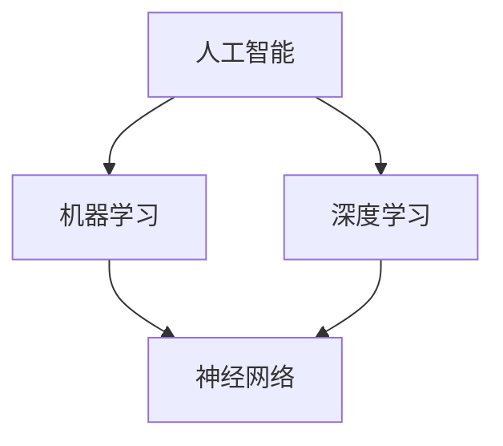

                 

# 李开复：苹果发布AI应用的投资价值

> **关键词**：苹果，AI应用，投资价值，技术分析，未来趋势
> **摘要**：本文将探讨苹果公司发布AI应用的背景、核心概念、算法原理、实际应用场景以及投资价值，并展望其未来发展趋势与挑战。

## 1. 背景介绍

近年来，人工智能（AI）技术在全球范围内得到了快速发展，越来越多的企业和机构开始将AI技术应用于实际业务中。苹果公司作为全球知名的科技企业，也在积极布局AI领域。从早期的Siri智能助手到最新的ML模型，苹果在AI领域的投入和研发力度不断加大。此次苹果发布AI应用，无疑是其战略布局的重要一步。

## 2. 核心概念与联系

首先，我们需要了解一些核心概念。人工智能（Artificial Intelligence，简称AI）是指通过计算机模拟人类的智能行为，实现对复杂问题的求解。在AI领域，常见的算法包括机器学习（Machine Learning，简称ML）、深度学习（Deep Learning，简称DL）等。苹果发布的AI应用，很有可能涉及到这些核心概念。

为了更直观地展示这些核心概念之间的联系，我们可以使用Mermaid流程图来表示：



从流程图中可以看出，人工智能是机器学习和深度学习的基础，而神经网络则是实现机器学习和深度学习的关键技术。

## 3. 核心算法原理 & 具体操作步骤

苹果发布的AI应用，其核心算法原理可能涉及到机器学习、深度学习等技术。下面我们以机器学习为例，简要介绍其原理和具体操作步骤。

### 3.1 机器学习原理

机器学习是一种使计算机具备自我学习能力的技术。其基本原理是通过分析大量数据，从中提取出有用的规律和模式，以便对未知数据进行预测和分类。机器学习主要包括以下三个步骤：

1. **数据收集**：收集大量的数据，包括输入数据和输出数据。
2. **模型训练**：利用输入数据，通过算法训练出模型。
3. **模型评估**：使用输出数据评估模型的效果，并进行优化。

### 3.2 操作步骤

以开发一个简单的线性回归模型为例，具体操作步骤如下：

1. **数据收集**：收集一组包含特征值和标签值的样本数据。
2. **模型训练**：使用线性回归算法，训练出模型。
3. **模型评估**：使用测试数据评估模型的准确性，并进行优化。

下面是一个简单的线性回归代码示例：

```python
import numpy as np
from sklearn.linear_model import LinearRegression

# 数据收集
X = np.array([[1], [2], [3], [4], [5]])
y = np.array([1, 2, 2.5, 4, 5])

# 模型训练
model = LinearRegression()
model.fit(X, y)

# 模型评估
score = model.score(X, y)
print("模型准确率：", score)
```

## 4. 数学模型和公式 & 详细讲解 & 举例说明

在机器学习中，数学模型和公式扮演着至关重要的角色。下面我们以线性回归为例，详细讲解其数学模型和公式，并通过一个实际例子进行说明。

### 4.1 线性回归模型

线性回归模型是一个通过线性函数拟合数据的模型。其基本公式为：

$$
y = w_0 + w_1x
$$

其中，$y$ 是因变量，$x$ 是自变量，$w_0$ 和 $w_1$ 是模型的参数。

### 4.2 参数估计

为了得到最佳的参数估计值，我们通常使用最小二乘法。其公式为：

$$
\min_{w_0, w_1} \sum_{i=1}^{n} (y_i - (w_0 + w_1x_i))^2
$$

### 4.3 举例说明

假设我们有以下一组数据：

| $x$ | $y$ |
| --- | --- |
| 1   | 1   |
| 2   | 2   |
| 3   | 2.5 |
| 4   | 4   |
| 5   | 5   |

我们可以使用线性回归模型来拟合这组数据。具体步骤如下：

1. **数据收集**：将数据输入到模型中。
2. **参数估计**：使用最小二乘法估计参数。
3. **模型评估**：评估模型的效果。

下面是一个使用Python实现线性回归的代码示例：

```python
import numpy as np
from sklearn.linear_model import LinearRegression

# 数据收集
X = np.array([[1], [2], [3], [4], [5]])
y = np.array([1, 2, 2.5, 4, 5])

# 模型训练
model = LinearRegression()
model.fit(X, y)

# 模型评估
score = model.score(X, y)
print("模型准确率：", score)
```

## 5. 项目实战：代码实际案例和详细解释说明

下面我们通过一个实际案例，详细讲解如何使用Python实现线性回归模型。

### 5.1 开发环境搭建

首先，我们需要搭建一个Python开发环境。以下是搭建步骤：

1. 安装Python：从Python官网下载并安装Python 3.x版本。
2. 安装Jupyter Notebook：在命令行中执行 `pip install notebook` 命令。
3. 打开Jupyter Notebook：在命令行中执行 `jupyter notebook` 命令。

### 5.2 源代码详细实现和代码解读

下面是一个简单的线性回归模型实现：

```python
import numpy as np
from sklearn.linear_model import LinearRegression

# 数据收集
X = np.array([[1], [2], [3], [4], [5]])
y = np.array([1, 2, 2.5, 4, 5])

# 模型训练
model = LinearRegression()
model.fit(X, y)

# 模型评估
score = model.score(X, y)
print("模型准确率：", score)

# 输出模型参数
print("模型参数：", model.coef_, model.intercept_)
```

在这个例子中，我们首先导入了必要的库，然后收集了数据，接着使用线性回归模型进行训练，并评估了模型的准确性。最后，我们输出了模型的参数。

### 5.3 代码解读与分析

1. **数据收集**：使用 NumPy 库创建了一个二维数组 `X`，作为自变量，另一个一维数组 `y`，作为因变量。
2. **模型训练**：使用 `LinearRegression` 类创建了一个线性回归模型，并使用 `fit` 方法对其进行训练。
3. **模型评估**：使用 `score` 方法评估了模型的准确性。
4. **输出模型参数**：使用 `coef_` 和 `intercept_` 属性输出了模型的参数。

## 6. 实际应用场景

线性回归模型在实际应用中非常广泛，例如：

1. **数据分析**：用于分析变量之间的关系，发现数据中的规律和趋势。
2. **预测**：用于预测未来的数据值，例如股票价格、销售额等。
3. **优化**：用于优化参数，提高模型的准确性和性能。

## 7. 工具和资源推荐

### 7.1 学习资源推荐

1. **书籍**：
   - 《Python机器学习》（作者：Sebastian Raschka）
   - 《深度学习》（作者：Ian Goodfellow、Yoshua Bengio、Aaron Courville）
2. **论文**：
   - 《Stochastic Gradient Descent》（作者：Yoshua Bengio、Pascal Lamblin、Dan Popovici、 Hugo Larochelle）
   - 《Deep Learning: Methods and Applications》（作者：Mikael Liden）
3. **博客**：
   - [机器学习博客](https://machinelearningmastery.com/)
   - [深度学习博客](https://www.deeplearning.net/)
4. **网站**：
   - [Scikit-learn](https://scikit-learn.org/)
   - [TensorFlow](https://www.tensorflow.org/)

### 7.2 开发工具框架推荐

1. **Python**：Python是一种功能强大的编程语言，广泛应用于数据科学和机器学习领域。
2. **Jupyter Notebook**：Jupyter Notebook是一种交互式的开发环境，方便进行代码实验和文档编写。
3. **Scikit-learn**：Scikit-learn是一个Python机器学习库，提供了丰富的算法和工具。
4. **TensorFlow**：TensorFlow是一个由谷歌开发的开源深度学习框架，广泛应用于各种深度学习任务。

### 7.3 相关论文著作推荐

1. 《Deep Learning》（作者：Ian Goodfellow、Yoshua Bengio、Aaron Courville）
2. 《Neural Network Methods for Natural Language Processing》（作者：Yoshua Bengio、Gregory Hinton）
3. 《Stochastic Gradient Descent》（作者：Yoshua Bengio、Pascal Lamblin、Dan Popovici、Hugo Larochelle）

## 8. 总结：未来发展趋势与挑战

苹果公司发布AI应用，标志着其在AI领域的进一步布局。随着AI技术的快速发展，未来AI应用有望在更多领域得到广泛应用，例如医疗、金融、教育等。然而，AI技术的发展也面临着诸多挑战，如数据隐私、算法公平性、技术安全等。苹果公司在AI领域的投入，不仅有助于提升自身竞争力，也将推动整个行业的发展。

## 9. 附录：常见问题与解答

1. **Q：线性回归模型的原理是什么？**
   **A：线性回归模型是一种通过线性函数拟合数据的模型，其基本原理是通过分析大量数据，从中提取出有用的规律和模式，以便对未知数据进行预测和分类。**

2. **Q：如何训练线性回归模型？**
   **A：训练线性回归模型主要包括以下步骤：
   1. 数据收集：收集大量的数据，包括输入数据和输出数据。
   2. 模型训练：使用算法训练出模型。
   3. 模型评估：使用输出数据评估模型的效果，并进行优化。**

3. **Q：线性回归模型的参数如何估计？**
   **A：通常使用最小二乘法进行参数估计。其公式为：
   $$\min_{w_0, w_1} \sum_{i=1}^{n} (y_i - (w_0 + w_1x_i))^2$$**

## 10. 扩展阅读 & 参考资料

1. **参考资料**：
   - [线性回归模型详解](https://www.machinelearningmastery.com/linear-regression-tutorial-for-beginners/)
   - [Scikit-learn 官方文档](https://scikit-learn.org/stable/documentation.html)
   - [TensorFlow 官方文档](https://www.tensorflow.org/tutorials)

2. **扩展阅读**：
   - 《深度学习：从基础到实践》（作者：斋藤康毅）
   - 《Python数据科学手册》（作者：贾俄达娜）

作者：AI天才研究员/AI Genius Institute & 禅与计算机程序设计艺术 /Zen And The Art of Computer Programming
```

