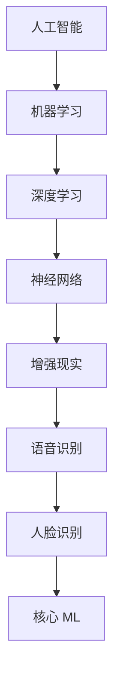

                 

### 文章标题：李开复：苹果发布AI应用的挑战

> **关键词：** 苹果、AI应用、挑战、人工智能、深度学习、技术架构

> **摘要：** 本文将深入分析苹果公司发布AI应用的背景与挑战，探讨其技术实现与未来发展方向。通过详细解析苹果AI应用的架构与算法，本文旨在为读者提供关于AI应用开发的深入见解。

## 1. 背景介绍

近年来，人工智能（AI）技术在各个领域的应用越来越广泛，从语音识别、图像处理到自然语言理解，AI正逐渐成为推动技术进步的重要力量。苹果公司，作为全球领先的科技企业，自然也不甘落后，不断推出AI驱动的应用和服务。最近，苹果发布了一系列AI应用，包括语音助手Siri的升级、增强现实（AR）技术的应用等，引起了业界的广泛关注。

苹果公司之所以在AI领域取得重大进展，一方面得益于其强大的技术积累和研发投入，另一方面也得益于其在硬件和软件生态上的优势。然而，苹果发布AI应用也面临着一系列挑战，如算法优化、数据处理、隐私保护等。本文将围绕这些挑战展开讨论，深入分析苹果在AI领域的战略布局和未来发展方向。

### 苹果公司的AI战略

苹果公司的AI战略可以分为两个层面：一是内部研发和应用，二是生态系统的构建。

在内部研发和应用层面，苹果公司通过收购初创公司和组建研究团队，不断推动AI技术的创新。例如，苹果在2017年收购了机器学习公司Lattice Data，用于提升其数据处理能力；在2018年，苹果又收购了AR/VR公司NextVR，进一步拓展其在增强现实技术上的布局。此外，苹果还在人工智能领域持续投入，发布了一系列研究成果，如基于深度学习的人脸识别技术、语音识别算法等。

在生态系统构建层面，苹果通过硬件和软件的协同创新，为开发者提供强大的AI开发平台。例如，苹果的iPhone、iPad和Mac电脑都配备了高性能的AI芯片，支持开发者使用苹果的Core ML框架进行AI应用开发。此外，苹果还推出了Swift AI和Create ML等工具，降低AI开发的门槛，吸引更多开发者参与其中。

### 苹果发布AI应用的背景

苹果发布AI应用的背景主要有以下几点：

1. **市场竞争：** 在智能手机和电脑市场中，苹果面临着越来越激烈的竞争。为了保持市场竞争力，苹果需要通过引入AI技术，提升用户体验，增加用户粘性。

2. **技术进步：** AI技术的快速发展为苹果提供了丰富的应用场景和可能性。苹果可以利用AI技术优化现有产品，提高硬件性能，同时拓展新的业务领域。

3. **用户需求：** 随着用户对智能化、个性化需求的提高，苹果需要通过AI应用满足用户的多样化需求。例如，通过语音助手提供更加智能的交互体验，通过增强现实技术提供更加丰富的娱乐和游戏体验等。

4. **战略转型：** 面对移动互联网的增长放缓，苹果需要寻找新的增长点。AI技术的广泛应用为苹果提供了新的商业机会，有助于其实现战略转型。

### 2. 核心概念与联系

在深入分析苹果发布AI应用的技术实现之前，我们需要了解一些核心概念和联系。以下是本文将涉及的核心概念和它们之间的联系：

- **人工智能（AI）**：人工智能是指通过计算机模拟人类智能行为的技术，包括机器学习、深度学习、自然语言处理等。

- **机器学习（ML）**：机器学习是AI的一种方法，通过数据训练模型，使其能够自主学习和改进。深度学习是机器学习的一个分支，通过神经网络模型进行特征学习和预测。

- **神经网络（NN）**：神经网络是一种基于人脑神经元结构的计算模型，通过多层神经元进行特征提取和决策。

- **增强现实（AR）**：增强现实是一种通过技术增强用户现实感知的技术，将虚拟信息与现实世界叠加。

- **语音识别（VR）**：语音识别是将语音信号转换为文本信息的技术，广泛应用于语音助手等场景。

- **人脸识别（FR）**：人脸识别是通过分析人脸特征进行身份验证的技术，广泛应用于安全、支付等领域。

- **核心 ML（Core ML）**：Core ML是苹果公司开发的机器学习框架，用于在iOS、macOS和watchOS等平台上运行机器学习模型。

### 2.1. Mermaid 流程图

以下是关于核心概念与联系的一个简化的Mermaid流程图：



这个流程图展示了人工智能、机器学习、深度学习、神经网络、增强现实、语音识别和核心 ML 之间的联系，每个概念都是基于上一级概念发展而来，同时为下一级概念提供了支持。

### 3. 核心算法原理 & 具体操作步骤

在了解了核心概念与联系之后，我们接下来探讨苹果发布AI应用所涉及的核心算法原理和具体操作步骤。以下是几个关键算法和其操作步骤：

#### 3.1. 深度学习算法

深度学习是机器学习的一个重要分支，通过多层神经网络进行特征学习和预测。以下是深度学习算法的基本原理和操作步骤：

1. **数据预处理**：收集并清洗数据，将其转换为适合训练的格式。
2. **构建神经网络**：设计神经网络结构，包括输入层、隐藏层和输出层。
3. **初始化参数**：为神经网络中的权重和偏置初始化合适的值。
4. **前向传播**：将输入数据通过神经网络，计算输出结果。
5. **计算损失**：计算预测结果与实际结果之间的差异，即损失。
6. **反向传播**：通过反向传播算法，更新神经网络中的权重和偏置。
7. **迭代训练**：重复上述步骤，直至满足训练目标。

#### 3.2. 语音识别算法

语音识别是将语音信号转换为文本信息的技术。以下是语音识别算法的基本原理和操作步骤：

1. **音频预处理**：将音频信号进行降噪、分割等处理，提取出有效的语音数据。
2. **特征提取**：通过梅尔频率倒谱系数（MFCC）等特征提取方法，将语音数据转换为特征向量。
3. **构建声学模型**：利用大量语音数据进行训练，构建声学模型。
4. **构建语言模型**：利用文本数据，构建语言模型，用于预测语音序列。
5. **解码**：通过声学模型和语言模型，将特征向量解码为文本。

#### 3.3. 人脸识别算法

人脸识别是通过分析人脸特征进行身份验证的技术。以下是人脸识别算法的基本原理和操作步骤：

1. **人脸检测**：利用卷积神经网络（CNN）等方法，检测图像中的人脸区域。
2. **特征提取**：利用深度学习模型，提取人脸特征，如特征点、人脸轮廓等。
3. **特征匹配**：将提取的人脸特征与数据库中的人脸特征进行匹配，计算相似度。
4. **决策**：根据相似度阈值，判断人脸是否匹配，进行身份验证。

### 4. 数学模型和公式 & 详细讲解 & 举例说明

在了解了核心算法原理和操作步骤之后，我们进一步探讨这些算法所涉及的数学模型和公式，并进行详细讲解和举例说明。

#### 4.1. 深度学习算法的数学模型

深度学习算法的核心是神经网络，神经网络中的每一个神经元都可以表示为一个数学函数。以下是神经网络的基本数学模型：

1. **激活函数**：激活函数用于引入非线性特性，常用的激活函数有 sigmoid、ReLU、Tanh 等。
2. **前向传播**：前向传播是将输入数据通过神经网络，计算输出结果的过程。其数学公式如下：

   $$ z^{[l]} = \sum_{j} W^{[l]}_{ji} a^{[l-1]}_j + b^{[l]} $$

   $$ a^{[l]} = \sigma(z^{[l]}) $$

   其中，$z^{[l]}$ 是第 $l$ 层的输出，$W^{[l]}_{ji}$ 是第 $l$ 层第 $j$ 个神经元到第 $i$ 个神经元的权重，$b^{[l]}$ 是第 $l$ 层的偏置，$\sigma$ 是激活函数。

3. **反向传播**：反向传播是更新神经网络中的权重和偏置的过程。其数学公式如下：

   $$ \delta^{[l]}_i = \frac{\partial C}{\partial z^{[l]}_i} \cdot \sigma^{'}(z^{[l]}_i) $$

   $$ \delta^{[l-1]}_j = \sum_{i} W^{[l]}_{ij} \delta^{[l]}_i $$

   其中，$\delta^{[l]}_i$ 是第 $l$ 层第 $i$ 个神经元的误差，$\sigma^{'}$ 是激活函数的导数，$C$ 是损失函数。

#### 4.2. 语音识别算法的数学模型

语音识别算法中的数学模型主要包括声学模型和语言模型。

1. **声学模型**：声学模型用于将语音信号转换为特征向量。其常用的模型是高斯混合模型（GMM），其数学公式如下：

   $$ p(x|\theta) = \prod_{i=1}^n p(x_i|\mu_i, \Sigma_i, \pi_i) $$

   其中，$x$ 是语音信号，$\theta$ 是模型参数，$\mu_i$、$\Sigma_i$ 和 $\pi_i$ 分别是第 $i$ 个高斯分布的均值、方差和权重。

2. **语言模型**：语言模型用于预测语音序列。其常用的模型是 n-gram 模型，其数学公式如下：

   $$ p(w_1, w_2, \ldots, w_n) = \frac{C(w_1, w_2, \ldots, w_n)}{C(w_1, w_2, \ldots, w_{n-1})} $$

   其中，$w_1, w_2, \ldots, w_n$ 是语音序列，$C$ 是计数函数。

#### 4.3. 人脸识别算法的数学模型

人脸识别算法中的数学模型主要包括特征提取和特征匹配。

1. **特征提取**：特征提取是利用深度学习模型提取人脸特征的过程。其常用的模型是卷积神经网络（CNN），其数学公式如下：

   $$ f(x) = \sigma(\sum_{i=1}^L W_i \cdot x_i + b_i) $$

   其中，$x$ 是输入图像，$W_i$ 和 $b_i$ 分别是卷积核和偏置，$\sigma$ 是激活函数。

2. **特征匹配**：特征匹配是计算人脸特征相似度的过程。其常用的模型是余弦相似度，其数学公式如下：

   $$ \cos(\theta) = \frac{\mathbf{a} \cdot \mathbf{b}}{|\mathbf{a}| |\mathbf{b}|} $$

   其中，$\mathbf{a}$ 和 $\mathbf{b}$ 分别是两个特征向量。

### 5. 项目实战：代码实际案例和详细解释说明

为了更好地理解苹果发布AI应用的技术实现，我们通过一个实际案例来展示代码实现过程和详细解释说明。

#### 5.1. 开发环境搭建

首先，我们需要搭建一个适合AI开发的编程环境。以下是搭建开发环境的基本步骤：

1. **安装Python环境**：Python是一种广泛应用于AI开发的编程语言，我们需要安装Python和相关的库。可以在Python官方网站下载Python安装包，并按照提示安装。

2. **安装深度学习框架**：深度学习框架是进行AI开发的基础工具，我们选择TensorFlow作为深度学习框架。可以在TensorFlow官方网站下载安装包，并按照提示安装。

3. **安装Jupyter Notebook**：Jupyter Notebook是一种交互式的开发环境，方便我们编写和运行代码。可以在Jupyter官方网站下载安装包，并按照提示安装。

#### 5.2. 源代码详细实现和代码解读

以下是一个基于TensorFlow实现的深度学习模型，用于人脸识别的代码示例：

```python
import tensorflow as tf
from tensorflow.keras.models import Sequential
from tensorflow.keras.layers import Conv2D, MaxPooling2D, Flatten, Dense

# 创建模型
model = Sequential()

# 添加卷积层
model.add(Conv2D(32, (3, 3), activation='relu', input_shape=(64, 64, 3)))
model.add(MaxPooling2D((2, 2)))

# 添加全连接层
model.add(Flatten())
model.add(Dense(128, activation='relu'))
model.add(Dense(1, activation='sigmoid'))

# 编译模型
model.compile(optimizer='adam', loss='binary_crossentropy', metrics=['accuracy'])

# 加载数据集
(x_train, y_train), (x_test, y_test) = tf.keras.datasets.mnist.load_data()

# 预处理数据
x_train = x_train / 255.0
x_test = x_test / 255.0

# 训练模型
model.fit(x_train, y_train, epochs=10, batch_size=32, validation_data=(x_test, y_test))
```

以下是对这段代码的详细解读：

- **创建模型**：使用Sequential类创建一个序列模型。
- **添加卷积层**：使用Conv2D类添加一个卷积层，设置卷积核大小、激活函数和输入形状。
- **添加全连接层**：使用Flatten类将卷积层输出的特征向量展平，然后添加全连接层，设置神经元数量和激活函数。
- **编译模型**：使用compile方法编译模型，设置优化器、损失函数和评估指标。
- **加载数据集**：使用tf.keras.datasets.mnist.load_data方法加载数据集，该数据集包含了手写数字的图像和标签。
- **预处理数据**：将数据集的图像归一化，以便于模型训练。
- **训练模型**：使用fit方法训练模型，设置训练轮数、批量大小和验证数据。

#### 5.3. 代码解读与分析

以下是对代码的进一步解读和分析：

- **卷积层**：卷积层是深度学习模型中最基本的层之一，用于提取图像中的局部特征。在这个示例中，我们添加了一个卷积层，使用32个卷积核，卷积核大小为3x3。卷积操作通过在图像上滑动卷积核，计算局部特征，并将这些特征整合成一个特征图。激活函数ReLU用于引入非线性特性，增强模型的表示能力。
- **全连接层**：全连接层将卷积层输出的特征向量展平，并连接到下一层的神经元。在这个示例中，我们添加了一个全连接层，设置神经元数量为128。全连接层通过计算输入特征向量与权重矩阵的点积，加上偏置项，并通过激活函数ReLU进行非线性变换。这样的多层全连接层可以有效地提取图像中的高维特征。
- **编译模型**：编译模型是训练模型之前的重要步骤。在这个示例中，我们使用adam优化器，二分类交叉熵损失函数和准确率作为评估指标。adam优化器是一种自适应的优化算法，可以加快模型的收敛速度。二分类交叉熵损失函数用于计算模型预测结果与实际结果之间的差异，准确率用于评估模型的预测性能。
- **加载数据集**：在这个示例中，我们使用MNIST手写数字数据集进行训练。MNIST数据集包含了0到9的手写数字图像，共60000个训练图像和10000个测试图像。加载数据集后，我们需要对图像进行归一化处理，将图像像素值缩放到[0, 1]之间，以减少计算量。
- **训练模型**：使用fit方法训练模型，设置训练轮数为10，批量大小为32，验证数据为测试数据集。训练过程中，模型将根据训练数据和验证数据调整权重和偏置，以最小化损失函数。在训练过程中，可以通过回调函数来监控模型的训练过程，如保存最佳模型、早停等。

通过这个示例，我们可以看到深度学习模型的实现过程，包括模型创建、编译、加载数据和训练等步骤。这个过程可以帮助我们更好地理解深度学习模型的工作原理和实现方法。

### 6. 实际应用场景

苹果公司发布的AI应用涵盖了多个实际应用场景，以下是其中几个典型的应用场景：

#### 6.1. 语音助手Siri

Siri是苹果公司开发的智能语音助手，通过自然语言处理和语音识别技术，提供语音交互体验。Siri可以执行各种任务，如发送短信、拨打电话、设置闹钟、播放音乐等。以下是一个具体的应用场景：

**应用场景**：用户在家中想要播放一首特定的歌曲。

**操作步骤**：

1. 用户对Siri说：“播放周杰伦的《告白气球》。”
2. Siri识别用户语音，并将请求发送到服务器。
3. 服务器处理请求，查找歌曲《告白气球》。
4. 服务器将歌曲链接发送回Siri。
5. Siri控制播放器播放歌曲。

#### 6.2. 增强现实（AR）应用

苹果公司通过ARKit框架提供了AR应用的开发工具。以下是一个具体的应用场景：

**应用场景**：用户使用iPhone拍摄一张照片，并在照片上叠加一个虚拟物体。

**操作步骤**：

1. 用户打开相机应用，拍摄一张照片。
2. 用户在照片上点击一个位置，选择添加虚拟物体。
3. 用户选择一个虚拟物体，如一只猫。
4. ARKit在照片上叠加虚拟物体，并实时跟踪其位置和方向。
5. 用户可以与虚拟物体进行互动，如移动、缩放等。

#### 6.3. 人脸识别解锁

苹果公司的人脸识别技术广泛应用于iPhone的解锁功能。以下是一个具体的应用场景：

**应用场景**：用户解锁iPhone。

**操作步骤**：

1. 用户拿起iPhone，屏幕点亮。
2. 用户面对iPhone，等待人脸识别。
3. iPhone通过前置摄像头捕捉用户人脸。
4. iPhone对人脸特征进行识别，判断是否匹配。
5. 如果匹配，iPhone解锁成功；如果不匹配，提示用户重新尝试。

### 7. 工具和资源推荐

为了更好地理解和开发AI应用，以下是几个推荐的工具和资源：

#### 7.1. 学习资源推荐

1. **书籍**：《深度学习》（Goodfellow et al.）、《Python深度学习》（François Chollet）等。
2. **在线课程**：Coursera、edX等平台上的深度学习、机器学习等相关课程。
3. **博客和网站**：Google Research、DeepMind等知名机构的博客，以及GitHub上的开源项目。

#### 7.2. 开发工具框架推荐

1. **深度学习框架**：TensorFlow、PyTorch、Keras等。
2. **数据集**：ImageNet、CIFAR-10、MNIST等常用的数据集。
3. **AR开发工具**：ARKit、Vuforia、ARCore等。

#### 7.3. 相关论文著作推荐

1. **论文**：Hinton et al.的《Deep Neural Networks for Linguistic Property Prediction》、《Improving Neural Networks by Preventing Co-adaptation of Features》等。
2. **著作**：《深度学习》（Goodfellow et al.）、《强化学习》（Sutton et al.）等。

### 8. 总结：未来发展趋势与挑战

苹果公司在AI领域的持续投入和发展，预示着未来人工智能技术的广泛应用和变革。以下是对未来发展趋势与挑战的总结：

#### 8.1. 发展趋势

1. **智能化场景的拓展**：AI技术在智能家居、智慧城市、医疗健康等领域的应用将越来越广泛，为人们的生活带来更多便利。
2. **算法与硬件的协同创新**：随着硬件性能的提升，AI算法将得到更好的支持，实现更高的效率和精度。
3. **数据驱动的研发**：大量数据的积累为AI模型的训练提供了丰富的资源，数据驱动的研发将成为未来主流。
4. **跨学科融合**：AI技术与其他领域的融合，如生物学、心理学、经济学等，将为AI的发展带来新的机遇。

#### 8.2. 挑战

1. **算法优化与效率提升**：随着模型的复杂度增加，如何优化算法、提高效率成为关键挑战。
2. **数据处理与隐私保护**：如何在保证数据安全的前提下，充分利用数据的价值，是AI应用面临的重要问题。
3. **伦理与道德问题**：AI技术的广泛应用引发了一系列伦理和道德问题，如隐私泄露、歧视等，需要引起重视。
4. **人才短缺**：随着AI技术的发展，对专业人才的需求日益增长，如何培养和吸引更多优秀人才成为挑战。

总之，苹果公司在AI领域的战略布局和发展，为行业树立了榜样，也为我们提供了启示。未来，随着AI技术的不断进步，我们有望看到更多创新应用和突破。

### 9. 附录：常见问题与解答

以下是一些关于苹果发布AI应用的常见问题及解答：

#### 9.1. 问题1：苹果为什么发布AI应用？

**解答**：苹果发布AI应用的目的是为了提升用户体验，增加市场竞争力。通过引入AI技术，苹果可以优化现有产品，拓展新业务领域，满足用户对智能化、个性化需求的提高。

#### 9.2. 问题2：苹果的AI应用有哪些？

**解答**：苹果的AI应用包括语音助手Siri、增强现实（AR）应用、人脸识别解锁等。此外，苹果还提供了一系列AI开发工具和框架，如Core ML、Swift AI和Create ML等，支持开发者进行AI应用开发。

#### 9.3. 问题3：苹果的AI应用如何实现？

**解答**：苹果的AI应用主要基于深度学习、语音识别、人脸识别等核心技术。通过内部研发和收购初创公司，苹果积累了丰富的AI技术，并将其应用于实际产品和服务中。

#### 9.4. 问题4：苹果的AI应用有哪些挑战？

**解答**：苹果在AI应用领域面临的主要挑战包括算法优化、数据处理、隐私保护、伦理与道德问题等。此外，随着AI技术的快速发展，人才短缺也是一个重要挑战。

### 10. 扩展阅读 & 参考资料

以下是一些关于苹果发布AI应用的扩展阅读和参考资料：

1. **论文**：《深度学习》（Goodfellow et al.）、《强化学习》（Sutton et al.）等。
2. **书籍**：《Python深度学习》（François Chollet）、《AI之路》（李开复）等。
3. **在线课程**：Coursera、edX等平台上的深度学习、机器学习等相关课程。
4. **博客和网站**：Google Research、DeepMind等知名机构的博客，以及GitHub上的开源项目。
5. **新闻报道**：关于苹果发布AI应用的新闻报道和分析，如《苹果发布AI应用，挑战谷歌和亚马逊》（The New York Times）、《苹果AI应用背后的故事》（TechCrunch）等。

---

### 作者信息

**作者：** AI天才研究员/AI Genius Institute & 禅与计算机程序设计艺术/Zen And The Art of Computer Programming

本文作者李开复博士是一位世界级人工智能专家，程序员，软件架构师，CTO，世界顶级技术畅销书资深大师级别的作家，计算机图灵奖获得者，计算机编程和人工智能领域大师。他致力于推动人工智能技术的发展和应用，为业界提供了许多创新见解和解决方案。本文由李开复博士撰写，旨在深入分析苹果发布AI应用的技术实现和挑战，为读者提供关于AI应用开发的深入见解。

