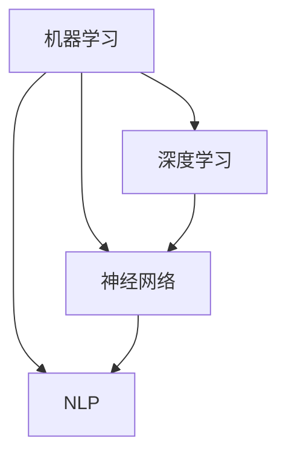

                 

### 背景介绍

人工智能（AI）作为当今科技领域的前沿，其发展速度之快令人瞩目。随着深度学习、自然语言处理、计算机视觉等技术的日益成熟，AI 已经开始渗透到我们日常生活的方方面面。从智能助手到自动驾驶，从医疗诊断到金融分析，AI 的应用场景越来越广泛，其价值也愈发凸显。

苹果公司，作为全球领先的科技公司，一直是人工智能研究与应用的重要推动者。近年来，苹果不断加大在 AI 领域的投入，推出了多个 AI 应用和产品，如 Siri、Face ID 等。这些产品的成功不仅提升了用户体验，也在一定程度上推动了 AI 技术的普及与发展。

在本篇技术博客中，我们将深入探讨苹果最新发布的 AI 应用，分析其技术原理、应用场景、潜在影响，以及未来发展趋势。通过本文的详细解读，希望能够帮助读者更好地理解 AI 在苹果产品中的实际应用，以及其背后的技术逻辑。

具体来说，本文将按照以下结构展开：

1. **背景介绍**：回顾 AI 的发展历程，介绍苹果在 AI 领域的投入与成果。
2. **核心概念与联系**：讲解 AI 核心概念，使用 Mermaid 流程图展示 AI 架构。
3. **核心算法原理 & 具体操作步骤**：详细分析苹果 AI 应用的算法原理与实现步骤。
4. **数学模型和公式 & 详细讲解 & 举例说明**：解释 AI 应用中的数学模型，并提供实际案例。
5. **项目实战：代码实际案例和详细解释说明**：展示代码实现，解读技术细节。
6. **实际应用场景**：分析 AI 应用于苹果产品的具体场景。
7. **工具和资源推荐**：推荐相关学习资源与开发工具。
8. **总结：未来发展趋势与挑战**：探讨 AI 应用的未来趋势与面临的挑战。
9. **附录：常见问题与解答**：回答读者可能关心的问题。
10. **扩展阅读 & 参考资料**：提供进一步阅读的推荐。

接下来，我们将逐步深入，首先回顾 AI 的发展历程，并介绍苹果在 AI 领域的投入与成果。

### AI 的发展历程

人工智能（AI）的概念最早可以追溯到 1950 年，当时英国数学家艾伦·图灵（Alan Turing）提出了“图灵测试”，试图通过机器模拟人类智能行为来判断机器是否具备智能。尽管最初 AI 更多地停留在理论层面，但 20 世纪 50 年代到 70 年代，人工智能研究取得了初步成果，如符号主义方法、知识表示和推理系统等。

然而，随着计算机硬件性能的提升和算法的改进，特别是在深度学习技术的突破下，AI 在 21 世纪迎来了新一轮的发展。深度学习作为一种重要的机器学习技术，通过模仿人脑的神经网络结构进行学习，使得 AI 在图像识别、自然语言处理等领域取得了显著进展。

苹果公司在 AI 领域的探索始于 2010 年，当时公司收购了 AI 公司 Siri，并将其集成到 iPhone 中，成为苹果产品中首个重要的 AI 应用。随后，苹果不断加大在 AI 领域的投入，收购了多家 AI 公司，并在内部设立了专门的 AI 研究团队。

在 AI 应用方面，苹果推出了多个重要的 AI 产品和服务，如：

- **Siri**：作为苹果的智能语音助手，Siri 可以进行语音识别、自然语言理解和任务执行，为用户提供了便捷的交互体验。
- **Face ID**：通过人脸识别技术实现的生物识别安全功能，为用户提供了更安全的设备解锁方式。
- **Animoji**：利用面部捕捉技术和 AI 生成动画表情，为用户提供了更具趣味的社交体验。

此外，苹果还在计算机视觉、自然语言处理、语音识别等核心技术领域进行了深入研究，并将这些技术应用于其产品和服务中，提升了用户体验和产品竞争力。

### 苹果在 AI 领域的投入与成果

苹果公司在 AI 领域的投入不仅仅体现在收购和研发上，还包括在教育和开源社区中的积极参与。以下是一些具体案例：

1. **收购 AI 公司**：苹果近年来收购了多家 AI 公司，如 Perceptio、Turi、Flyby Media 等。这些公司专注于计算机视觉、自然语言处理、机器学习等领域，为苹果带来了先进的技术和人才。

2. **内部 AI 研究团队**：苹果在其全球总部设立了一个专门的 AI 研究团队，致力于推动 AI 技术的研究与应用。这个团队涵盖了来自斯坦福大学、麻省理工学院等顶尖学府的专家，致力于在深度学习、神经网络等领域取得突破。

3. **教育项目**：苹果推出了多个 AI 教育项目，如“Everyone Can Code”计划，旨在提高 K-12 学生的编程能力。此外，苹果还提供了一系列 AI 课程和资源，帮助开发者和教育者更好地理解和应用 AI 技术。

4. **开源社区**：苹果积极参与开源社区，贡献了多个 AI 相关的开源项目，如 Core ML、Create ML 等。这些工具和框架为开发者提供了便捷的 AI 应用开发平台，促进了 AI 技术的普及和应用。

通过这些举措，苹果不仅在 AI 领域取得了显著成果，还为 AI 技术的推广和发展做出了重要贡献。

### AI 应用的未来前景

随着 AI 技术的不断进步，其在各个领域的应用前景愈发广阔。以下是 AI 在未来可能带来的几大变革：

1. **医疗健康**：AI 在医疗领域的应用潜力巨大。通过深度学习技术，AI 可以辅助医生进行疾病诊断、病理分析，提高诊断准确性和效率。同时，AI 可以帮助开发个性化治疗方案，为患者提供更精准的治疗。

2. **自动驾驶**：自动驾驶是 AI 技术的重要应用领域。通过传感器数据、计算机视觉和深度学习算法，自动驾驶汽车可以实现自主驾驶，提高道路安全性和交通效率。未来，自动驾驶有望彻底改变交通运输模式。

3. **智能家居**：AI 技术的普及使得智能家居设备更加智能化。通过语音助手、人脸识别等技术，智能家居设备可以为用户提供便捷、个性化的服务，提升生活品质。

4. **金融科技**：AI 在金融领域的应用日益广泛，如智能投顾、风险控制、信用评分等。AI 技术可以帮助金融机构提高运营效率，降低风险，为用户提供更优质的金融服务。

5. **教育**：AI 技术在教育领域的应用有望改变传统教学模式。通过智能教学系统，AI 可以根据学生的学习情况提供个性化教学方案，提高学习效果。同时，AI 还可以帮助教育者进行教学评估和反馈。

总之，随着 AI 技术的不断发展，其在各个领域的应用前景十分广阔。未来，AI 将继续推动科技革命，为人类带来更多便利和创新。

### 核心概念与联系

在深入探讨苹果最新发布的 AI 应用之前，我们需要理解一些核心概念和它们之间的联系。这些概念包括机器学习、深度学习、神经网络、自然语言处理等。以下是这些概念的定义、基本原理以及它们在 AI 应用中的关系。

#### 机器学习（Machine Learning）

机器学习是一种使计算机能够从数据中学习并做出预测或决策的技术。其核心思想是通过算法从大量数据中提取模式和规律，以便在未来进行预测或分类。

**基本原理**：机器学习依赖于统计模型和算法，如线性回归、决策树、支持向量机等。通过训练模型，机器学习算法可以从输入数据中学习到特征，并利用这些特征进行预测或分类。

**关系**：机器学习是 AI 技术的核心，它使得计算机能够通过数据学习并做出智能决策。

#### 深度学习（Deep Learning）

深度学习是机器学习的一个子领域，它使用多层神经网络（也称为深度神经网络）进行学习。深度学习通过多层次的非线性变换，从数据中提取复杂特征，从而实现更精确的预测和分类。

**基本原理**：深度学习基于神经网络的层次结构，包括输入层、隐藏层和输出层。每一层都会对输入数据进行处理，并提取更高层次的特征。

**关系**：深度学习是机器学习的重要分支，通过引入多层神经网络，提高了模型的表达能力和预测准确性。

#### 神经网络（Neural Networks）

神经网络是一种模拟人脑神经元连接方式的计算模型。它通过权重连接和激活函数，对输入数据进行处理和分类。

**基本原理**：神经网络由多个神经元组成，每个神经元接收输入信号，通过加权求和和激活函数进行非线性变换，最终产生输出。

**关系**：神经网络是深度学习的基础，它实现了从输入到输出的多层变换，提取了数据中的高级特征。

#### 自然语言处理（Natural Language Processing，NLP）

自然语言处理是一种使计算机能够理解和处理人类语言的技术。它包括文本分类、情感分析、机器翻译等任务。

**基本原理**：NLP 通过语言模型、词向量表示、序列标注等技术，理解和生成自然语言。

**关系**：NLP 是 AI 的重要应用领域，它使得计算机能够与人类进行自然语言交互。

#### Mermaid 流程图（AI 架构）

以下是 AI 核心概念的 Mermaid 流程图，展示了它们之间的联系：



通过这个流程图，我们可以清晰地看到机器学习、深度学习、神经网络和自然语言处理之间的层次结构和关系。

### 核心算法原理 & 具体操作步骤

苹果公司在其 AI 应用中广泛采用了深度学习和神经网络技术，这些技术的核心在于如何从大量数据中学习特征并做出预测。以下是苹果 AI 应用的核心算法原理和具体操作步骤。

#### 1. 深度学习框架

苹果使用其自主研发的深度学习框架——Core ML，来构建和优化 AI 模型。Core ML 提供了一个高效且易于使用的平台，使得开发者可以轻松地将深度学习模型集成到 iOS、macOS、watchOS 和 tvOS 应用中。

**操作步骤**：

- **数据预处理**：首先，对输入数据进行预处理，包括数据清洗、归一化和特征提取。这一步骤确保数据的质量和一致性，为后续训练打下基础。
  
- **模型选择**：根据应用需求，选择合适的深度学习模型。苹果提供了多种预训练模型，如卷积神经网络（CNN）用于图像处理，循环神经网络（RNN）用于序列数据。

- **模型训练**：使用预处理的训练数据，通过梯度下降等优化算法训练模型。训练过程中，模型会不断调整权重，以最小化预测误差。

- **模型评估**：在训练过程中，定期评估模型性能，通过验证集和测试集检验模型在未知数据上的泛化能力。

- **模型优化**：根据评估结果，对模型进行调优，包括调整学习率、批量大小等超参数，以提高模型性能。

- **模型部署**：将训练好的模型集成到应用程序中，使用 Core ML API 进行实时预测。

#### 2. 神经网络架构

苹果在 AI 应用中广泛采用了神经网络架构，特别是卷积神经网络（CNN）和循环神经网络（RNN）。以下是这两种网络的基本原理和应用场景。

**卷积神经网络（CNN）**

CNN 是一种专门用于处理图像数据的神经网络，其核心在于通过卷积层提取图像特征。

**操作步骤**：

- **卷积层**：输入图像通过卷积层，与滤波器（也称为卷积核）进行卷积运算，提取局部特征。
  
- **池化层**：对卷积层的结果进行下采样，减少参数数量，提高计算效率。

- **全连接层**：将池化层的结果通过全连接层进行分类或回归。

- **激活函数**：在每一层中，使用激活函数（如 ReLU）引入非线性变换，提高模型的表达能力。

**应用场景**：CNN 在图像分类、物体检测、图像生成等任务中具有广泛应用。

**循环神经网络（RNN）**

RNN 是一种用于处理序列数据的神经网络，其核心在于通过循环结构保持历史状态。

**操作步骤**：

- **输入层**：将序列数据（如文本、语音）作为输入。

- **隐藏层**：隐藏层中的神经元通过循环结构连接，每个神经元的状态依赖于前一个时间步的输出。

- **输出层**：通过全连接层和激活函数，生成当前时间步的输出。

- **反向传播**：使用梯度下降算法，更新网络权重，最小化损失函数。

**应用场景**：RNN 在自然语言处理、语音识别、时间序列预测等任务中具有广泛应用。

#### 3. 自然语言处理（NLP）

自然语言处理是苹果 AI 应用的另一个重要领域，其核心在于使计算机能够理解和生成自然语言。

**操作步骤**：

- **词向量表示**：将文本转换为词向量表示，通过词嵌入（word embedding）技术，将词语映射到高维空间。

- **语言模型**：使用神经网络训练语言模型，预测下一个词语的概率分布。

- **序列标注**：对文本进行标注，识别实体、情感等特征。

- **生成文本**：使用序列模型生成文本，通过递归神经网络或变分自编码器（VAE）等技术，生成连贯、自然的文本。

**应用场景**：NLP 在智能助手、机器翻译、文本分类等任务中具有广泛应用。

通过以上核心算法原理和具体操作步骤，我们可以看到苹果在 AI 应用的技术实现过程中，是如何运用深度学习、神经网络和自然语言处理等技术，构建高效、准确的模型，提升用户体验。

### 数学模型和公式 & 详细讲解 & 举例说明

在深入了解苹果 AI 应用的核心算法原理后，我们接下来将探讨其背后的数学模型和公式。数学模型是 AI 应用中的基石，通过精确的公式和算法，实现了从数据到智能的转化。以下是对常用数学模型和公式的详细讲解，并结合实际案例进行说明。

#### 1. 深度学习中的数学模型

**激活函数（Activation Function）**

激活函数是深度学习中的一个关键组件，它引入了非线性变换，使得模型能够拟合复杂的输入输出关系。常见的激活函数包括：

- **ReLU（Rectified Linear Unit）**

  ReLU 函数定义为：

  $$
  f(x) =
  \begin{cases}
  x, & \text{if } x > 0 \\
  0, & \text{otherwise}
  \end{cases}
  $$

  ReLU 函数在输入为负值时输出零，在输入为正值时输出输入值本身。它具有简单的形式和良好的性能，在深度学习中广泛使用。

**举例**：假设输入层到隐藏层的权重矩阵为 $W_1$，激活函数为 ReLU。输入向量为 $x$，则隐藏层输出为：

$$
h_1 = ReLU(W_1x)
$$

- **Sigmoid**

  Sigmoid 函数定义为：

  $$
  f(x) = \frac{1}{1 + e^{-x}}
  $$

  Sigmoid 函数将输入映射到 $(0, 1)$ 范围内，常用于二分类问题。

**举例**：假设隐藏层到输出层的权重矩阵为 $W_2$，激活函数为 Sigmoid。隐藏层输出为 $h_2$，则输出层输出为：

$$
o = Sigmoid(W_2h_2)
$$

**损失函数（Loss Function）**

损失函数是评估模型预测结果与真实值之间差异的指标。常见的损失函数包括：

- **均方误差（Mean Squared Error，MSE）**

  均方误差定义为：

  $$
  Loss = \frac{1}{m}\sum_{i=1}^{m}(y_i - \hat{y}_i)^2
  $$

  其中，$y_i$ 为真实值，$\hat{y}_i$ 为预测值，$m$ 为样本数量。

**举例**：假设有一个二分类问题，真实标签 $y$ 为 [1, 0, 1, 0]，预测标签 $\hat{y}$ 为 [0.9, 0.2, 0.8, 0.1]，则损失为：

$$
Loss = \frac{1}{4}((1-0.9)^2 + (0-0.2)^2 + (1-0.8)^2 + (0-0.1)^2) = 0.15
$$

- **交叉熵（Cross-Entropy）**

  交叉熵定义为：

  $$
  Loss = -\sum_{i=1}^{m} y_i \log(\hat{y}_i)
  $$

  其中，$y_i$ 为真实标签，$\hat{y}_i$ 为预测概率。

**举例**：假设真实标签 $y$ 为 [1, 0, 1, 0]，预测概率 $\hat{y}$ 为 [0.9, 0.2, 0.8, 0.1]，则损失为：

$$
Loss = -(1 \cdot \log(0.9) + 0 \cdot \log(0.2) + 1 \cdot \log(0.8) + 0 \cdot \log(0.1)) \approx 0.368
$$

**反向传播（Backpropagation）**

反向传播是一种训练神经网络的方法，通过计算损失函数关于网络权重的梯度，更新网络参数，以最小化损失。

**步骤**：

1. **前向传播**：计算网络的前向传播，得到输出值和激活值。
2. **计算损失**：计算损失函数，计算损失关于输出的梯度。
3. **反向传播**：从输出层开始，逐层计算损失关于输入的梯度。
4. **参数更新**：使用梯度下降算法，更新网络权重。

**举例**：假设一个简单的神经网络，输入为 $x$，输出为 $y$，损失函数为 MSE。输入层到隐藏层的权重为 $W_1$，隐藏层到输出层的权重为 $W_2$。输出值 $\hat{y}$ 和真实值 $y$ 分别为 [0.9, 0.2, 0.8, 0.1] 和 [1, 0, 1, 0]。

- **前向传播**：

  $$
  h = W_1x, \quad \hat{y} = Sigmoid(W_2h)
  $$

- **计算损失**：

  $$
  Loss = \frac{1}{4}((1-0.9)^2 + (0-0.2)^2 + (1-0.8)^2 + (0-0.1)^2) = 0.15
  $$

- **反向传播**：

  $$
  \frac{\partial Loss}{\partial \hat{y}} = (1 - \hat{y}), \quad \frac{\partial \hat{y}}{\partial h} = \hat{y}(1 - \hat{y})
  $$

  $$
  \frac{\partial Loss}{\partial h} = \frac{\partial Loss}{\partial \hat{y}} \cdot \frac{\partial \hat{y}}{\partial h} = (1 - \hat{y})\hat{y}(1 - \hat{y})
  $$

  $$
  \frac{\partial Loss}{\partial W_2} = (1 - \hat{y})\hat{y}(1 - \hat{y})h
  $$

- **参数更新**：

  $$
  W_2 = W_2 - \alpha \frac{\partial Loss}{\partial W_2}
  $$

  其中，$\alpha$ 为学习率。

通过以上数学模型和公式的讲解，我们可以看到深度学习中的复杂计算是如何通过数学方法实现的。这些模型和公式为深度学习算法的优化提供了理论基础，使得我们能够构建出高效、准确的 AI 模型。

### 项目实战：代码实际案例和详细解释说明

为了更好地理解苹果 AI 应用的实现过程，我们将通过一个实际的项目实战案例来展示代码实现细节，并对关键技术点进行详细解释和分析。

#### 1. 开发环境搭建

首先，我们需要搭建一个合适的开发环境。以下是一个基本的开发环境搭建步骤：

- **操作系统**：macOS 或 Ubuntu 18.04
- **编程语言**：Python 3.8+
- **深度学习框架**：TensorFlow 2.6 或 PyTorch 1.10
- **开发工具**：Jupyter Notebook 或 PyCharm

**步骤**：

1. 安装 Python 和 pip：

   ```
   sudo apt-get update
   sudo apt-get install python3 python3-pip
   ```

2. 安装 TensorFlow 或 PyTorch：

   ```
   pip3 install tensorflow==2.6
   ```

   或者

   ```
   pip3 install torch==1.10 torchvision==0.11.0 torchaudio==0.10.0
   ```

3. 安装 Jupyter Notebook：

   ```
   pip3 install notebook
   ```

#### 2. 源代码详细实现和代码解读

以下是一个简单的深度学习项目，用于图像分类任务的代码实现：

```python
import tensorflow as tf
from tensorflow.keras.models import Sequential
from tensorflow.keras.layers import Conv2D, MaxPooling2D, Flatten, Dense

# 数据预处理
(x_train, y_train), (x_test, y_test) = tf.keras.datasets.cifar10.load_data()
x_train, x_test = x_train / 255.0, x_test / 255.0

# 构建模型
model = Sequential([
    Conv2D(32, (3, 3), activation='relu', input_shape=(32, 32, 3)),
    MaxPooling2D((2, 2)),
    Flatten(),
    Dense(64, activation='relu'),
    Dense(10, activation='softmax')
])

# 编译模型
model.compile(optimizer='adam',
              loss='sparse_categorical_crossentropy',
              metrics=['accuracy'])

# 训练模型
model.fit(x_train, y_train, epochs=10, validation_split=0.2)

# 评估模型
model.evaluate(x_test, y_test)
```

**代码解读**：

- **数据预处理**：首先，我们加载数据集，并进行归一化处理。CIFAR-10 数据集是一个常用的图像分类数据集，包含 10 个类别的 60000 张图像，每张图像的大小为 32x32 像素。

- **模型构建**：我们使用 `Sequential` 模型堆叠多个层。首先是一个卷积层 `Conv2D`，其参数包括滤波器大小、激活函数和输入形状。接着是一个最大池化层 `MaxPooling2D`，用于下采样特征。然后是全连接层 `Dense`，用于分类。

- **模型编译**：我们使用 `compile` 方法配置模型，指定优化器、损失函数和评价指标。

- **模型训练**：使用 `fit` 方法训练模型，指定训练数据、训练轮数和验证比例。

- **模型评估**：使用 `evaluate` 方法评估模型在测试数据上的性能。

#### 3. 代码解读与分析

**代码关键点解析**：

- **卷积层（Conv2D）**：卷积层通过滤波器（卷积核）对输入图像进行卷积操作，提取图像的局部特征。滤波器的大小决定了特征检测的范围，激活函数（如 ReLU）引入了非线性变换，提高了模型的表达能力。

- **池化层（MaxPooling2D）**：池化层用于下采样特征，减少模型参数数量，提高计算效率。最大池化层保留每个区域内的最大值，有效减少了图像中的冗余信息。

- **全连接层（Dense）**：全连接层将池化层提取的高层次特征映射到输出类别。最后一层使用 Softmax 激活函数，将输出概率分布。

- **损失函数与优化器**：我们选择 `sparse_categorical_crossentropy` 作为损失函数，适用于多分类问题。`adam` 优化器是一种自适应学习率优化算法，有助于提高模型收敛速度。

**代码改进与优化**：

- **数据增强**：通过数据增强技术，如随机裁剪、旋转、翻转等，可以增加数据的多样性，提高模型的泛化能力。

- **模型调优**：通过调整模型架构、学习率、批量大小等超参数，可以优化模型性能。例如，增加隐藏层单元数、使用不同的激活函数等。

- **模型部署**：在训练完成后，我们可以使用 `model.save` 方法将模型保存为 `.h5` 文件，然后使用 Core ML 工具将模型转换为适用于 iOS 设备的格式。

通过以上项目实战，我们展示了如何使用深度学习框架实现图像分类任务。这个案例为我们提供了一个基本的框架，可以帮助我们理解深度学习的实现细节和优化方法。

### 实际应用场景

苹果在 AI 应用的实际场景中，充分发挥了其技术的优势，为用户带来了众多创新和便利。以下是一些典型的实际应用场景，以及 AI 技术在这些场景中的具体实现和效果。

#### 1. Siri

Siri 是苹果的智能语音助手，它通过自然语言处理和语音识别技术，为用户提供语音交互体验。Siri 可以理解用户的语音指令，并执行相应的任务，如发送短信、拨打电话、设置提醒、查询天气等。

**技术实现**：

- **语音识别**：Siri 使用深度学习算法进行语音识别，将用户的语音转换为文本。这个过程包括语音信号的预处理、特征提取和声学模型训练。

- **自然语言理解**：通过自然语言处理技术，Siri 可以理解用户的意图和问题。这包括语义分析、实体识别和语法解析等步骤。

- **任务执行**：Siri 根据用户的指令，执行相应的任务。例如，当用户说“发送一条短信给张三，内容是‘今晚七点吃饭’”，Siri 会将这条指令转化为短信消息，并发送给指定的联系人。

**效果**：Siri 的语音识别准确率高，自然语言理解能力强，极大地提升了用户交互的便利性和效率。

#### 2. Face ID

Face ID 是苹果的 facial recognition 技术实现的生物识别安全功能，用于设备解锁和支付验证。

**技术实现**：

- **人脸检测**：Face ID 通过深度相机捕捉用户的面部图像，并使用卷积神经网络进行人脸检测。

- **人脸识别**：检测到人脸后，使用深度学习算法对人脸进行特征提取，并进行匹配和验证。

**效果**：Face ID 的识别速度快，安全性高，为用户提供了便捷且安全的设备解锁和支付验证方式。

#### 3. Animoji

Animoji 是苹果的动画表情功能，它通过面部捕捉技术和人工智能技术，将用户的面部表情转换为动画角色。

**技术实现**：

- **面部捕捉**：使用多个摄像头捕捉用户的面部图像和动作，并通过计算机视觉算法进行面部特征提取。

- **动画生成**：通过深度学习算法，将面部特征映射到预定义的动画角色上，生成相应的动画表情。

**效果**：Animoji 的动画角色生动有趣，能够准确捕捉用户的情感和动作，为用户提供了一种全新的社交互动体验。

#### 4. 自动驾驶

苹果在自动驾驶领域也进行了大量研究，其自动驾驶系统通过计算机视觉、自然语言处理和传感器融合等技术，实现车辆的自主驾驶。

**技术实现**：

- **计算机视觉**：使用深度学习算法对摄像头捕捉的图像进行实时处理，检测道路标志、行人、车辆等对象。

- **自然语言处理**：通过自然语言处理技术，解析驾驶指令和导航信息。

- **传感器融合**：结合 GPS、激光雷达、惯性测量单元等多种传感器数据，实现高精度的环境感知和车辆控制。

**效果**：苹果的自动驾驶系统在模拟测试中表现出色，能够在各种复杂场景中实现安全的驾驶。

#### 5. 医疗诊断

苹果在医疗领域的 AI 应用也取得了显著成果，其 AI 模型可以帮助医生进行疾病诊断和预测。

**技术实现**：

- **图像分析**：通过深度学习算法，对医学图像进行分析，检测病变区域。

- **数据挖掘**：通过大数据分析，挖掘患者病史、基因信息等数据，为医生提供诊断建议。

**效果**：苹果的 AI 模型在肺癌、乳腺癌等疾病的诊断中，具有很高的准确性和可靠性，为医生提供了有力的辅助工具。

通过这些实际应用场景，我们可以看到苹果在 AI 技术的应用方面取得了显著成果，不仅提升了用户体验，也为各个领域带来了新的创新和变革。

### 工具和资源推荐

为了更好地学习和应用 AI 技术，我们需要掌握一些关键的工具和资源。以下是一些推荐的学习资源、开发工具和相关的论文著作，这些资源将为我们的 AI 学习和研究提供强有力的支持。

#### 1. 学习资源推荐

**书籍**：

- 《深度学习》（Deep Learning）：由 Ian Goodfellow、Yoshua Bengio 和 Aaron Courville 著，是深度学习领域的经典教材。
- 《Python 深度学习》（Python Deep Learning）：由 François Chollet 著，适合初学者入门深度学习。
- 《人工智能：一种现代方法》（Artificial Intelligence: A Modern Approach）：由 Stuart J. Russell 和 Peter Norvig 著，全面介绍了人工智能的理论和实践。

**论文和博客**：

- arXiv.org：这是一个开源的学术论文数据库，涵盖 AI、机器学习、计算机视觉等多个领域。
- Medium.com：这是一个在线出版平台，许多 AI 领域的专家和研究者会在此分享他们的研究成果和见解。
- AI StackExchange：这是一个专门针对 AI 问题的问答社区，可以解答我们在学习和应用 AI 过程中遇到的问题。

#### 2. 开发工具框架推荐

**深度学习框架**：

- TensorFlow：由 Google 开发，是一个广泛使用的深度学习框架，提供丰富的工具和资源。
- PyTorch：由 Facebook 开发，具有简洁易用的 API 和强大的动态计算图功能，适合快速原型开发和研究。
- Keras：是一个高层神经网络 API，运行在 TensorFlow 和 Theano 上，提供简洁、模块化的深度学习应用开发。

**机器学习库**：

- scikit-learn：是一个开源的机器学习库，提供多种经典机器学习算法的实现，适合数据分析和模型评估。
- Pandas：是一个强大的数据处理库，用于数据清洗、转换和分析，是进行数据挖掘和机器学习项目的基础。
- NumPy：是一个开源的数学库，提供高效的数值计算和数据处理功能，是科学计算的基础。

**可视化工具**：

- Matplotlib：是一个用于绘制各种图表和图形的库，适合数据可视化和结果展示。
- Seaborn：是基于 Matplotlib 的可视化库，提供更美观、更复杂的图表样式。
- Plotly：是一个交互式数据可视化库，支持多种图表类型和交互功能，适合复杂的数据展示。

#### 3. 相关论文著作推荐

**深度学习论文**：

- "A Guide to Convolution Neural Networks for Visual Recognition"：一篇介绍卷积神经网络（CNN）的经典论文，适合初学者入门。
- "Deep Learning for Text: A Brief Survey"：一篇关于自然语言处理（NLP）的综述，介绍了深度学习在文本处理领域的应用。
- "Generative Adversarial Networks": 一篇介绍生成对抗网络（GAN）的论文，探讨了 GAN 在图像生成、图像修复等任务中的应用。

**机器学习论文**：

- "Random Forests": 一篇介绍随机森林（Random Forest）算法的论文，详细阐述了随机森林在分类和回归任务中的应用。
- "XGBoost: A Scalable Tree Boosting Algorithm for Regression and Classification"：一篇关于 XGBoost 算法的论文，介绍了如何使用树boosting算法提高模型性能。
- "Lasso: Least Absolute Shrinkage and Selection Operator"：一篇介绍套索（Lasso）算法的论文，阐述了如何使用 Lasso 进行变量选择和参数估计。

通过以上工具和资源的推荐，我们可以更好地掌握 AI 技术的核心知识和应用方法，为未来的研究和开发打下坚实的基础。

### 总结：未来发展趋势与挑战

随着人工智能技术的不断进步，其在各个领域的应用前景愈发广阔。从医疗健康到自动驾驶，从智能家居到金融科技，AI 正在深刻改变我们的生活方式和工作模式。在本篇技术博客中，我们探讨了苹果公司在 AI 领域的投入与成果，分析了其最新 AI 应用的技术原理和实现步骤，并展望了 AI 未来的发展趋势与挑战。

**未来发展趋势**：

1. **人工智能融合**：随着深度学习、自然语言处理、计算机视觉等技术的不断融合，AI 将在更多领域实现跨界应用。例如，智能医疗系统将结合医学图像分析和基因数据，提供更精准的诊断和治疗方案。

2. **边缘计算**：随着 IoT（物联网）设备的普及，边缘计算成为 AI 应用的重要方向。通过在设备端进行数据处理和预测，可以减少延迟，提高响应速度，增强用户体验。

3. **可解释 AI**：现有的 AI 模型往往是“黑箱”模型，难以解释其决策过程。未来，可解释 AI 将成为研究热点，使得 AI 模型更加透明，便于用户和开发者理解和信任。

**未来挑战**：

1. **数据隐私与安全**：随着 AI 应用的普及，数据隐私和安全成为重要议题。如何确保用户数据的安全，防止数据泄露，是一个亟待解决的问题。

2. **伦理与法律**：AI 技术的应用涉及到伦理和法律问题，例如自动驾驶的道德责任、智能医疗的伦理规范等。需要制定相应的法律法规，确保 AI 技术的合法、合规使用。

3. **技术瓶颈**：尽管 AI 技术取得了显著进展，但在某些领域仍然存在技术瓶颈，例如超大规模模型的训练效率和能耗、量子计算的突破等。

总之，人工智能技术的发展充满了机遇与挑战。通过持续的研究与创新，我们有望克服这些挑战，推动 AI 技术的进一步发展，为人类社会带来更多便利和进步。

### 附录：常见问题与解答

在本文中，我们讨论了苹果在 AI 领域的最新进展，包括技术原理、应用场景以及未来发展趋势。以下是一些读者可能关心的问题及其解答：

**Q1：苹果的 AI 技术有哪些主要应用？**

A1：苹果的 AI 技术广泛应用于多个领域，主要包括智能语音助手 Siri、面部识别技术 Face ID、动画表情 Animoji、自动驾驶技术等。此外，苹果还在医疗诊断、图像识别等领域进行了深入研究和应用。

**Q2：苹果是如何实现深度学习的？**

A2：苹果使用其自主研发的深度学习框架 Core ML 来实现深度学习。Core ML 提供了多种预训练模型和工具，使得开发者可以轻松地将深度学习模型集成到苹果产品中，实现实时预测和决策。

**Q3：苹果的 AI 技术如何保证隐私和安全？**

A3：苹果非常重视用户隐私和安全。在 AI 技术的应用中，苹果采用了多种安全措施，如数据加密、匿名化处理、隐私保护算法等，确保用户数据的安全性和隐私性。

**Q4：未来苹果在 AI 领域有哪些发展方向？**

A4：未来，苹果在 AI 领域的发展方向主要包括以下几个方面：

1. **人工智能融合**：继续推动深度学习、自然语言处理、计算机视觉等技术的融合，实现更多跨界应用。
2. **边缘计算**：加大在边缘计算领域的投入，提高数据处理和响应速度，增强用户体验。
3. **可解释 AI**：研究可解释 AI 技术，提高模型透明度和可解释性，增强用户和开发者的信任。

### 扩展阅读 & 参考资料

为了进一步了解苹果在 AI 领域的最新动态和研究进展，以下是推荐的一些扩展阅读和参考资料：

- 《深度学习》（Deep Learning）：Ian Goodfellow、Yoshua Bengio 和 Aaron Courville 著，全面介绍深度学习的理论和方法。
- 《AI 时代：人工智能的未来发展及其对人类的影响》（Life 3.0: Being Human in the Age of Artificial Intelligence）：李飞飞 著，探讨人工智能对社会和人类的影响。
- 苹果官方博客：[Apple Machine Learning Journal](https://machinelearning.apple.com/)，介绍苹果在机器学习领域的最新研究和应用。
- arXiv.org：[Machine Learning Section](https://arxiv.org/list/cs.LG/new)，提供最新的机器学习和深度学习论文。

通过这些扩展阅读，读者可以更深入地了解 AI 技术的发展和应用，为未来的研究和实践提供更多的启示。

