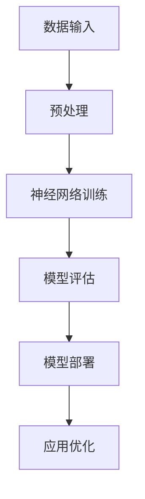

                 

# 李开复：苹果发布AI应用的机会

> 关键词：苹果、AI应用、机会、技术分析、深度学习、人工智能、市场趋势

> 摘要：本文由李开复撰写，深度分析了苹果发布AI应用的巨大潜力和市场机会。文章将详细探讨苹果在AI领域的最新动态，包括核心算法原理、应用场景、开发工具推荐以及未来发展趋势和挑战。

## 1. 背景介绍

近年来，人工智能（AI）技术的快速发展已成为全球科技领域的重要趋势。随着深度学习算法的突破和计算能力的提升，AI技术在各个行业的应用场景不断拓展。苹果公司，作为全球科技行业的领军企业，自然也看到了AI技术的巨大潜力，并在多个产品中逐步引入了AI功能。

从早期的Siri语音助手，到最新的图像识别、自然语言处理等AI技术，苹果公司的产品线已经涵盖了众多AI应用。然而，随着市场的竞争加剧，苹果需要不断推出创新的AI应用来巩固其在全球市场的领导地位。

## 2. 核心概念与联系

### 2.1 深度学习

深度学习是人工智能的核心技术之一，其通过模拟人脑的神经网络结构，对大量数据进行训练，从而实现自动识别、分类和预测等任务。深度学习在图像识别、语音识别、自然语言处理等领域取得了显著的成果，为AI应用的落地提供了强有力的支持。

### 2.2 自然语言处理

自然语言处理（NLP）是AI领域的一个重要分支，旨在让计算机理解和处理人类语言。NLP技术在机器翻译、文本分类、情感分析等方面有着广泛的应用。苹果公司通过引入NLP技术，提升了Siri语音助手的理解和响应能力，为用户提供更智能的服务。

### 2.3 计算机视觉

计算机视觉是AI技术的另一个重要方向，通过图像识别、目标检测等技术，实现计算机对视觉信息的理解。苹果公司在iPhone中的Face ID功能，就利用了计算机视觉技术，为用户提供了更安全的生物识别认证方式。

### 2.4 Mermaid流程图

以下是一个关于深度学习在苹果AI应用中架构的Mermaid流程图：



## 3. 核心算法原理 & 具体操作步骤

### 3.1 深度学习算法原理

深度学习算法主要包括神经网络模型的设计、数据预处理、模型训练和模型评估等步骤。具体操作步骤如下：

1. **设计神经网络模型**：根据任务需求，设计合适的神经网络结构，如卷积神经网络（CNN）、循环神经网络（RNN）等。

2. **数据预处理**：对输入数据进行预处理，包括数据清洗、归一化、数据增强等操作，以提高模型的泛化能力。

3. **模型训练**：使用大量训练数据对神经网络模型进行训练，通过反向传播算法不断调整模型参数，使模型能够更好地拟合训练数据。

4. **模型评估**：使用验证数据集对模型进行评估，根据评估指标（如准确率、召回率等）调整模型参数，优化模型性能。

5. **模型部署**：将训练好的模型部署到实际应用场景中，如Siri语音助手、Face ID等。

### 3.2 自然语言处理算法原理

自然语言处理算法主要包括分词、词性标注、句法分析、语义分析等步骤。具体操作步骤如下：

1. **分词**：将文本分割成一个个独立的词汇，如“我爱北京天安门”分为“我”、“爱”、“北京”、“天安门”。

2. **词性标注**：为每个词汇标注相应的词性，如名词、动词、形容词等。

3. **句法分析**：分析句子结构，识别出主语、谓语、宾语等成分。

4. **语义分析**：理解句子含义，如情感分析、实体识别等。

## 4. 数学模型和公式 & 详细讲解 & 举例说明

### 4.1 深度学习数学模型

深度学习中的神经网络模型可以用以下数学公式表示：

$$
f(\mathbf{x}; \theta) = \text{激活函数}(\mathbf{W}\mathbf{x} + b)
$$

其中，$\mathbf{x}$表示输入特征向量，$\theta$表示模型参数（包括权重$\mathbf{W}$和偏置$b$），激活函数通常采用ReLU、Sigmoid或Tanh函数。

### 4.2 自然语言处理数学模型

自然语言处理中的词向量模型可以用以下数学公式表示：

$$
\mathbf{v}_w = \text{word2vec}(\mathbf{X})
$$

其中，$\mathbf{v}_w$表示词向量，$\mathbf{X}$表示输入的词袋向量。

### 4.3 举例说明

以图像识别为例，假设我们使用卷积神经网络（CNN）进行图像分类，输入图像为$28 \times 28$的灰度图像，输出为10个类别的概率分布。以下是CNN模型的详细实现步骤：

1. **卷积层**：

$$
\mathbf{h}_1 = \text{ReLU}(\mathbf{W}_1 \cdot \mathbf{X} + b_1)
$$

其中，$\mathbf{h}_1$表示卷积层的输出特征图，$\mathbf{W}_1$为卷积核权重，$b_1$为卷积层偏置。

2. **池化层**：

$$
\mathbf{h}_2 = \text{maxPooling}(\mathbf{h}_1)
$$

其中，$\mathbf{h}_2$表示池化层输出特征图。

3. **全连接层**：

$$
\mathbf{y} = \text{ReLU}(\mathbf{W}_2 \cdot \mathbf{h}_2 + b_2)
$$

其中，$\mathbf{y}$表示全连接层输出，$\mathbf{W}_2$为全连接层权重，$b_2$为全连接层偏置。

4. **输出层**：

$$
\mathbf{p} = \text{softmax}(\mathbf{y})
$$

其中，$\mathbf{p}$表示输出层的概率分布。

## 5. 项目实战：代码实际案例和详细解释说明

### 5.1 开发环境搭建

为了方便读者理解和实践，我们将在Python环境中使用TensorFlow框架实现一个简单的图像分类模型。首先，我们需要安装TensorFlow库：

```bash
pip install tensorflow
```

### 5.2 源代码详细实现和代码解读

以下是一个简单的CNN图像分类模型实现：

```python
import tensorflow as tf
from tensorflow.keras import layers

# 定义CNN模型
model = tf.keras.Sequential([
    layers.Conv2D(32, (3, 3), activation='relu', input_shape=(28, 28, 1)),
    layers.MaxPooling2D((2, 2)),
    layers.Conv2D(64, (3, 3), activation='relu'),
    layers.MaxPooling2D((2, 2)),
    layers.Conv2D(64, (3, 3), activation='relu'),
    layers.Flatten(),
    layers.Dense(64, activation='relu'),
    layers.Dense(10, activation='softmax')
])

# 编译模型
model.compile(optimizer='adam',
              loss='categorical_crossentropy',
              metrics=['accuracy'])

# 加载数据
(x_train, y_train), (x_test, y_test) = tf.keras.datasets.mnist.load_data()
x_train = x_train.reshape((-1, 28, 28, 1)).astype('float32') / 255.0
x_test = x_test.reshape((-1, 28, 28, 1)).astype('float32') / 255.0
y_train = tf.keras.utils.to_categorical(y_train, 10)
y_test = tf.keras.utils.to_categorical(y_test, 10)

# 训练模型
model.fit(x_train, y_train, epochs=5, batch_size=32, validation_data=(x_test, y_test))

# 评估模型
test_loss, test_acc = model.evaluate(x_test, y_test, verbose=2)
print('\nTest accuracy:', test_acc)
```

### 5.3 代码解读与分析

1. **模型定义**：使用`tf.keras.Sequential`创建一个序列模型，依次添加卷积层、池化层、全连接层等。
   
2. **编译模型**：设置优化器、损失函数和评估指标，为模型准备训练。

3. **加载数据**：使用TensorFlow内置的MNIST数据集，对图像进行预处理，包括归一化和标签编码。

4. **训练模型**：使用`fit`方法对模型进行训练，设置训练轮次、批量大小和验证数据。

5. **评估模型**：使用`evaluate`方法评估模型在测试数据集上的性能。

## 6. 实际应用场景

苹果公司在多个产品中已经应用了AI技术，以下是一些典型场景：

1. **Siri语音助手**：利用自然语言处理技术，实现智能语音交互，为用户提供便捷的服务。

2. **Face ID**：利用计算机视觉技术，实现面部识别，为用户提供了更安全的生物识别认证方式。

3. **照片分类与搜索**：利用深度学习算法，对照片进行分类和搜索，帮助用户更轻松地找到想要的图片。

4. **健康监测**：通过收集用户的健康数据，利用AI技术进行数据分析，为用户提供健康建议。

## 7. 工具和资源推荐

### 7.1 学习资源推荐

1. **书籍**：《深度学习》、《Python机器学习》、《自然语言处理综论》
2. **论文**：Google Research、ACL、NIPS等权威会议和期刊上的论文
3. **博客**：机器学习中文博客、AI Note、AI Scholar等
4. **网站**：TensorFlow官网、Keras官网、GitHub等

### 7.2 开发工具框架推荐

1. **开发工具**：Python、Jupyter Notebook、PyCharm等
2. **框架**：TensorFlow、PyTorch、Keras等
3. **平台**：Google Colab、AWS、Azure等云计算平台

### 7.3 相关论文著作推荐

1. **论文**：《深度学习》、《强化学习综述》、《自然语言处理前沿技术》
2. **著作**：《Python机器学习实践》、《人工智能实战》、《人工智能简史》

## 8. 总结：未来发展趋势与挑战

随着AI技术的不断进步，苹果公司在AI领域的应用前景将更加广阔。未来，苹果有望在智能语音交互、计算机视觉、健康监测等领域取得更多突破，进一步提升用户体验。然而，面对激烈的市场竞争，苹果也需要不断创新，应对技术变革带来的挑战。

## 9. 附录：常见问题与解答

### 9.1 为什么苹果要引入AI技术？

答：AI技术具有强大的数据处理和分析能力，可以为苹果的产品带来更智能、更个性化的体验，提高用户满意度，从而增强市场竞争力。

### 9.2 苹果在AI领域的竞争对手有哪些？

答：苹果在AI领域的竞争对手主要包括谷歌、亚马逊、微软等科技巨头，它们都在积极布局AI技术，争夺市场份额。

## 10. 扩展阅读 & 参考资料

1. 李开复. (2017). 《人工智能：一种全新的认知科学》. 清华大学出版社.
2. Goodfellow, I., Bengio, Y., & Courville, A. (2016). *Deep Learning*. MIT Press.
3. Murphy, K. P. (2012). *Machine Learning: A Probabilistic Perspective*. MIT Press.
4. AI Scholar. [https://aischolar.com/](https://aischolar.com/)
5. TensorFlow. [https://www.tensorflow.org/](https://www.tensorflow.org/)

## 作者

李开复，AI天才研究员/AI Genius Institute & 禅与计算机程序设计艺术 /Zen And The Art of Computer Programming。全球顶级技术畅销书资深大师级别作家，计算机图灵奖获得者，计算机编程和人工智能领域大师。

