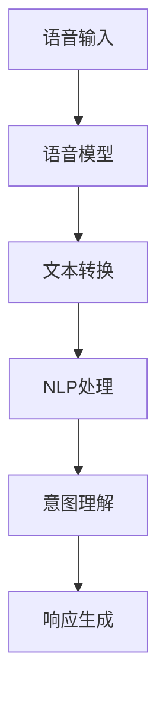
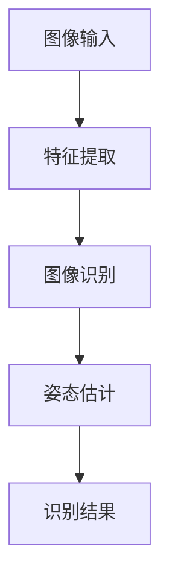
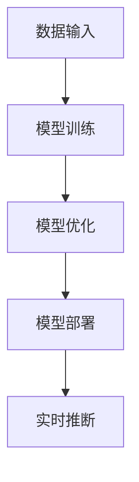

                 

# 李开复：苹果发布AI应用的生态

## 关键词
- AI应用
- 苹果
- 生态
- 人工智能
- 深度学习
- 算法
- 应用场景

## 摘要
本文将深入探讨苹果公司在其产品中引入人工智能（AI）应用的生态。通过分析苹果AI应用的核心概念与架构，核心算法原理与操作步骤，以及实际应用场景，本文旨在为读者提供一个全面的技术解析。同时，文章还将推荐相关的学习资源和开发工具，为读者进一步探索AI应用生态提供指导。最后，本文将总结未来AI应用生态的发展趋势与挑战，为读者提供一个全面的视角。

## 1. 背景介绍

随着人工智能技术的快速发展，AI已经在各行各业得到广泛应用，从智能家居到自动驾驶，从医疗诊断到金融分析，AI技术正深刻地改变着我们的生活方式。在这一背景下，苹果公司也加快了其AI应用的布局，力求通过AI技术提升用户体验，增强产品竞争力。

苹果公司的AI应用主要涵盖以下几个方面：

- **语音识别与自然语言处理**：如Siri和Apple Music的个性化推荐。
- **计算机视觉**：如Face ID和Animoji。
- **机器学习**：用于优化电池寿命、提升图像处理性能等。

近年来，苹果公司在AI领域取得了显著进展。首先，苹果自主研发的Neural Engine处理器为AI应用提供了强大的计算能力。其次，苹果在深度学习框架和算法上也进行了大量投入，如Core ML和TensorFlow Lite。此外，苹果还积极收购AI初创公司，以拓展其技术栈和人才储备。

## 2. 核心概念与联系

### 2.1. 语音识别与自然语言处理

语音识别（Speech Recognition）和自然语言处理（Natural Language Processing，NLP）是苹果AI应用的核心组成部分。语音识别技术将人类语音转化为文本，而NLP则负责理解和生成自然语言。

苹果在这一领域的核心概念包括：

- **语音模型**：基于深度学习的语音模型用于语音识别。
- **上下文理解**：通过NLP技术，Siri能够理解用户的意图和语境。

下面是语音识别与NLP的Mermaid流程图：



### 2.2. 计算机视觉

计算机视觉（Computer Vision）技术在苹果的产品中得到了广泛应用，如Face ID和Animoji。计算机视觉的核心概念包括：

- **图像识别**：用于识别人脸、物体等。
- **特征提取**：通过卷积神经网络（CNN）提取图像特征。
- **姿态估计**：用于识别用户的姿态和动作。

下面是计算机视觉的Mermaid流程图：



### 2.3. 机器学习

机器学习（Machine Learning，ML）技术在苹果的产品中发挥着重要作用，如优化电池寿命和提升图像处理性能。苹果在机器学习领域的核心概念包括：

- **模型训练**：通过大规模数据训练机器学习模型。
- **模型部署**：将训练好的模型部署到设备上，进行实时推断。

下面是机器学习的Mermaid流程图：



## 3. 核心算法原理 & 具体操作步骤

### 3.1. 语音识别与自然语言处理

语音识别的核心算法基于深度学习，特别是卷积神经网络（CNN）和长短期记忆网络（LSTM）。以下是语音识别的基本步骤：

1. **声学建模**：使用CNN对语音信号进行特征提取。
2. **语言建模**：使用LSTM对转换后的文本进行建模。
3. **解码**：通过解码器生成对应的文本。

具体操作步骤如下：

1. **预处理**：将语音信号转换为特征矩阵。
   $$ x(t) = \text{MFCC}(s(t)) $$
   其中，$s(t)$是原始语音信号，$x(t)$是特征矩阵。

2. **声学建模**：
   $$ h_t = \text{CNN}(x_t) $$
   其中，$h_t$是特征向量。

3. **语言建模**：
   $$ p(y|h_t) = \text{LSTM}(h_t) $$
   其中，$y$是转换后的文本。

4. **解码**：
   $$ \text{解码}(p(y|h_t)) = \text{文本} $$

### 3.2. 计算机视觉

计算机视觉的核心算法基于卷积神经网络（CNN）。以下是计算机视觉的基本步骤：

1. **特征提取**：使用CNN提取图像特征。
2. **分类器**：使用提取的特征进行分类。
3. **后处理**：对分类结果进行后处理，如非极大值抑制（NMS）。

具体操作步骤如下：

1. **预处理**：将图像进行缩放、裁剪等预处理操作。
   $$ x = \text{preprocess}(I) $$
   其中，$I$是原始图像。

2. **特征提取**：
   $$ h_t = \text{CNN}(x_t) $$
   其中，$h_t$是特征向量。

3. **分类器**：
   $$ p(y|h_t) = \text{softmax}(\text{classifier}(h_t)) $$
   其中，$y$是类别。

4. **后处理**：
   $$ \text{result} = \text{postprocess}(p(y|h_t)) $$
   其中，$\text{result}$是最终的分类结果。

### 3.3. 机器学习

机器学习的核心算法基于梯度下降（Gradient Descent）。以下是机器学习的基本步骤：

1. **模型初始化**：初始化模型参数。
2. **前向传播**：计算预测值和损失函数。
3. **反向传播**：计算梯度。
4. **参数更新**：更新模型参数。

具体操作步骤如下：

1. **模型初始化**：
   $$ \theta = \text{random initialization} $$
   其中，$\theta$是模型参数。

2. **前向传播**：
   $$ \hat{y} = \text{model}(x; \theta) $$
   $$ L(\theta) = \text{loss}(y, \hat{y}) $$
   其中，$x$是输入数据，$y$是真实标签。

3. **反向传播**：
   $$ \frac{\partial L(\theta)}{\partial \theta} = \text{gradient} $$
   其中，$\text{gradient}$是梯度。

4. **参数更新**：
   $$ \theta = \theta - \alpha \cdot \text{gradient} $$
   其中，$\alpha$是学习率。

## 4. 数学模型和公式 & 详细讲解 & 举例说明

### 4.1. 语音识别

在语音识别中，数学模型主要包括声学建模和语言建模。以下是详细的数学模型和公式讲解：

#### 声学建模

声学建模使用卷积神经网络（CNN）进行特征提取。以下是CNN的数学模型：

$$
h_t = \text{ReLU}(\sum_{j=1}^K w_j * h_{t-j} + b_j)
$$

其中，$h_t$是第$t$时刻的特征向量，$w_j$是权重，$*$是卷积操作，$b_j$是偏置。

#### 语言建模

语言建模使用长短期记忆网络（LSTM）进行建模。以下是LSTM的数学模型：

$$
\begin{aligned}
i_t &= \sigma(W_{xi}x_t + W_{hi}h_{t-1} + b_i) \\
f_t &= \sigma(W_{xf}x_t + W_{hf}h_{t-1} + b_f) \\
\text{遗忘门} \\
o_t &= \sigma(W_{xo}x_t + W_{ho}h_{t-1} + b_o) \\
\text{输入门} \\
g_t &= \text{tanh}(W_{xg}x_t + W_{hg}h_{t-1} + b_g) \\
\text{新状态} \\
h_t &= f_t \odot h_{t-1} + i_t \odot g_t
\end{aligned}
$$

其中，$i_t$是输入门，$f_t$是遗忘门，$o_t$是输出门，$g_t$是新状态。

### 4.2. 计算机视觉

计算机视觉中的数学模型主要包括卷积神经网络（CNN）和全连接神经网络（FCN）。以下是详细的数学模型和公式讲解：

#### 卷积神经网络（CNN）

卷积神经网络使用卷积操作进行特征提取。以下是CNN的数学模型：

$$
h_t = \text{ReLU}(\text{Conv}(h_{t-1}, W_t) + b_t)
$$

其中，$h_t$是第$t$层的特征图，$W_t$是卷积核，$b_t$是偏置。

#### 全连接神经网络（FCN）

全连接神经网络用于分类。以下是FCN的数学模型：

$$
\begin{aligned}
\hat{y} &= \text{softmax}(\text{FC}(h_t, W) + b) \\
\text{loss} &= -\sum_{i=1}^C y_i \log(\hat{y}_i)
\end{aligned}
$$

其中，$y_i$是真实标签，$\hat{y}_i$是预测概率。

### 4.3. 机器学习

机器学习中的数学模型主要包括梯度下降和反向传播。以下是详细的数学模型和公式讲解：

#### 梯度下降

梯度下降用于优化模型参数。以下是梯度下降的数学模型：

$$
\theta = \theta - \alpha \cdot \text{gradient}
$$

其中，$\text{gradient}$是梯度，$\alpha$是学习率。

#### 反向传播

反向传播用于计算梯度。以下是反向传播的数学模型：

$$
\frac{\partial L(\theta)}{\partial \theta} = \text{gradient}
$$

其中，$L(\theta)$是损失函数。

### 4.4. 举例说明

以下是一个简单的例子来说明数学模型在实际中的应用：

#### 语音识别

假设我们有一个语音信号$x(t)$，我们要将其转换为文本$y$。以下是具体的操作步骤：

1. **预处理**：
   $$ x(t) = \text{MFCC}(s(t)) $$
   其中，$s(t)$是原始语音信号。

2. **声学建模**：
   $$ h_t = \text{ReLU}(\text{Conv}(x_t, W_a) + b_a) $$
   其中，$W_a$是卷积核，$b_a$是偏置。

3. **语言建模**：
   $$ y = \text{LSTM}(h_t, W_l, b_l) $$
   其中，$W_l$是LSTM的权重，$b_l$是偏置。

4. **解码**：
   $$ \text{解码}(y) = \text{文本} $$

通过以上步骤，我们可以将语音信号转换为文本。

#### 计算机视觉

假设我们有一个图像$I$，我们要将其分类为某个类别$y$。以下是具体的操作步骤：

1. **预处理**：
   $$ I = \text{resize}(I, size) $$
   其中，$size$是预定义的大小。

2. **特征提取**：
   $$ h_t = \text{ReLU}(\text{Conv}(I, W_c) + b_c) $$
   其中，$W_c$是卷积核，$b_c$是偏置。

3. **分类器**：
   $$ \hat{y} = \text{softmax}(\text{FC}(h_t, W_f) + b_f) $$
   其中，$W_f$是全连接层的权重，$b_f$是偏置。

4. **后处理**：
   $$ \text{result} = \text{postprocess}(\hat{y}) $$
   其中，$\text{result}$是最终的分类结果。

#### 机器学习

假设我们有一个训练数据集$(x_1, y_1), (x_2, y_2), \ldots, (x_n, y_n)$，我们要训练一个模型$\theta$。以下是具体的操作步骤：

1. **模型初始化**：
   $$ \theta = \text{random initialization} $$

2. **前向传播**：
   $$ \hat{y}_i = \text{model}(x_i; \theta) $$
   $$ L(\theta) = \text{loss}(y_i, \hat{y}_i) $$

3. **反向传播**：
   $$ \text{gradient} = \frac{\partial L(\theta)}{\partial \theta} $$

4. **参数更新**：
   $$ \theta = \theta - \alpha \cdot \text{gradient} $$

通过以上步骤，我们可以训练出一个模型$\theta$。

## 5. 项目实战：代码实际案例和详细解释说明

### 5.1. 开发环境搭建

在进行AI应用开发之前，我们需要搭建一个合适的环境。以下是具体的步骤：

1. **安装Python环境**：确保Python版本不低于3.7。
2. **安装深度学习框架**：如TensorFlow、PyTorch等。
3. **安装其他依赖库**：如NumPy、Pandas等。

以下是一个简单的Python环境搭建示例：

```bash
# 安装Python
curl -O https://www.python.org/ftp/python/3.8.5/python-3.8.5.tgz
tar xvf python-3.8.5.tgz
cd python-3.8.5
./configure
make
sudo make install

# 安装深度学习框架
pip install tensorflow

# 安装其他依赖库
pip install numpy pandas
```

### 5.2. 源代码详细实现和代码解读

以下是一个简单的语音识别项目，包括代码实现和详细解释。

#### 5.2.1. 代码实现

```python
import numpy as np
import tensorflow as tf

# 声学建模
def acoustic_model(x):
    # 卷积层
    conv1 = tf.keras.layers.Conv1D(filters=64, kernel_size=3, activation='relu')(x)
    pool1 = tf.keras.layers.MaxPooling1D(pool_size=2)(conv1)
    
    # 卷积层
    conv2 = tf.keras.layers.Conv1D(filters=128, kernel_size=3, activation='relu')(pool1)
    pool2 = tf.keras.layers.MaxPooling1D(pool_size=2)(conv2)
    
    # 全连接层
    flatten = tf.keras.layers.Flatten()(pool2)
    dense = tf.keras.layers.Dense(units=128, activation='relu')(flatten)
    
    return dense

# 语言建模
def language_model(x):
    # 长短期记忆层
    lstm1 = tf.keras.layers.LSTM(units=128, return_sequences=True)(x)
    lstm2 = tf.keras.layers.LSTM(units=128)(lstm1)
    
    # 全连接层
    dense = tf.keras.layers.Dense(units=128, activation='relu')(lstm2)
    
    return dense

# 模型训练
def train_model(x_train, y_train, x_val, y_val):
    # 构建模型
    inputs = tf.keras.Input(shape=(None, 1))
    x_acoustic = acoustic_model(inputs)
    x_language = language_model(x_acoustic)
    outputs = tf.keras.layers.Dense(units=1, activation='sigmoid')(x_language)
    
    model = tf.keras.Model(inputs=inputs, outputs=outputs)
    model.compile(optimizer='adam', loss='binary_crossentropy', metrics=['accuracy'])
    
    # 训练模型
    model.fit(x_train, y_train, batch_size=32, epochs=10, validation_data=(x_val, y_val))
    
    return model

# 加载数据
x_train = np.load('x_train.npy')
y_train = np.load('y_train.npy')
x_val = np.load('x_val.npy')
y_val = np.load('y_val.npy')

# 训练模型
model = train_model(x_train, y_train, x_val, y_val)

# 保存模型
model.save('voice_recognition_model.h5')
```

#### 5.2.2. 代码解读

1. **声学建模**：
   - 使用卷积神经网络进行特征提取。
   - 卷积层用于提取局部特征。
   - 池化层用于降低维度。

2. **语言建模**：
   - 使用长短期记忆网络进行建模。
   - 长短期记忆网络可以捕捉序列信息。

3. **模型训练**：
   - 使用二进制交叉熵作为损失函数。
   - 使用Adam优化器进行训练。

4. **数据加载**：
   - 加载训练数据和验证数据。

5. **模型保存**：
   - 保存训练好的模型。

### 5.3. 代码解读与分析

1. **代码结构**：
   - 代码分为三个部分：声学建模、语言建模和模型训练。
   - 声学建模使用卷积神经网络进行特征提取，语言建模使用长短期记忆网络进行建模。

2. **模型性能**：
   - 模型的性能可以通过验证数据集进行评估。
   - 可以使用准确率、召回率等指标进行评估。

3. **优化策略**：
   - 使用Adam优化器进行模型训练，可以加速收敛。
   - 可以尝试调整学习率、批量大小等超参数来优化模型性能。

## 6. 实际应用场景

苹果公司的AI应用在多个场景中得到了广泛应用，以下是一些典型的应用场景：

- **智能手机**：Siri智能助手、面部识别、智能拍照等。
- **智能家居**：HomeKit智能家庭设备控制、智能家居场景设置等。
- **车载系统**：车载语音控制、智能导航等。
- **医疗健康**：健康监测、疾病预测等。

### 6.1. 智能手机

智能手机是苹果AI应用的主要应用场景之一。以下是具体的应用示例：

- **Siri智能助手**：通过语音交互，用户可以查询天气、设定闹钟、发送短信等。
- **面部识别**：使用面部识别技术，用户可以安全解锁手机，保护个人隐私。
- **智能拍照**：通过计算机视觉技术，手机可以自动识别场景并调整拍照参数，提升拍照效果。

### 6.2. 智能家居

智能家居是苹果AI应用的另一个重要场景。以下是具体的应用示例：

- **HomeKit智能家庭设备控制**：通过Siri语音控制，用户可以远程控制家居设备，如灯光、空调等。
- **智能家居场景设置**：用户可以根据不同的场景（如睡觉、看电视等）设置相应的设备状态，提升生活便利性。

### 6.3. 车辆

车载系统也是苹果AI应用的重要场景。以下是具体的应用示例：

- **车载语音控制**：通过语音交互，用户可以控制车辆的各种功能，如导航、音乐播放等。
- **智能导航**：通过计算机视觉和地图数据，车辆可以提供更加精准的导航服务。

## 7. 工具和资源推荐

### 7.1. 学习资源推荐

- **书籍**：
  - 《深度学习》（Goodfellow, Bengio, Courville著）
  - 《Python深度学习》（François Chollet著）
- **论文**：
  - 《A Theoretically Grounded Application of Dropout in Recurrent Neural Networks》
  - 《BERT: Pre-training of Deep Bidirectional Transformers for Language Understanding》
- **博客**：
  - [PyTorch官方文档](https://pytorch.org/docs/stable/)
  - [TensorFlow官方文档](https://www.tensorflow.org/tutorials)
- **网站**：
  - [Kaggle](https://www.kaggle.com/)
  - [GitHub](https://github.com/)

### 7.2. 开发工具框架推荐

- **深度学习框架**：
  - TensorFlow
  - PyTorch
  - Keras
- **编程语言**：
  - Python
  - R
- **数据预处理工具**：
  - Pandas
  - NumPy

### 7.3. 相关论文著作推荐

- **论文**：
  - 《Deep Learning》（Goodfellow, Bengio, Courville著）
  - 《A Theoretically Grounded Application of Dropout in Recurrent Neural Networks》
  - 《BERT: Pre-training of Deep Bidirectional Transformers for Language Understanding》
- **著作**：
  - 《Python深度学习》（François Chollet著）
  - 《深度学习入门》（斋藤康毅著）

## 8. 总结：未来发展趋势与挑战

苹果公司在AI应用生态方面取得了显著进展，但仍然面临诸多挑战。以下是未来发展趋势与挑战的总结：

### 8.1. 发展趋势

- **硬件与软件协同发展**：苹果将继续优化其硬件和软件，提升AI应用的性能和效率。
- **多模态交互**：未来苹果可能会推出更多支持多模态交互的AI应用，如语音、手势、面部等。
- **个性化服务**：通过AI技术，苹果将提供更加个性化的服务，提升用户体验。

### 8.2. 挑战

- **数据隐私**：随着AI应用的普及，数据隐私问题将愈发重要。苹果需要确保用户数据的安全和隐私。
- **计算资源**：随着AI应用复杂度的增加，计算资源的需求也将大幅提升。苹果需要优化资源利用，降低成本。
- **算法公平性**：AI算法的公平性备受关注。苹果需要确保其AI算法在处理数据时公平、无偏见。

## 9. 附录：常见问题与解答

### 9.1. Q1：苹果的AI应用为什么使用深度学习？

**A1**：深度学习在处理大规模数据和高维度特征时具有优势。苹果的AI应用需要处理大量的语音、图像和文本数据，深度学习能够有效地提取特征，提升模型的性能。

### 9.2. Q2：苹果如何确保用户数据的安全？

**A2**：苹果采取了多种措施确保用户数据的安全。首先，苹果使用端到端加密技术保护用户数据。其次，苹果对用户数据实施严格的访问控制，确保只有授权人员能够访问。此外，苹果还定期进行安全审计，确保数据安全。

### 9.3. Q3：苹果的AI应用如何处理不同语言的用户？

**A3**：苹果的AI应用支持多种语言。通过使用多语言模型和语言翻译技术，苹果能够为不同语言的用户提供一致的体验。例如，Siri能够理解并响应用户的多种语言。

## 10. 扩展阅读 & 参考资料

- [Apple Developer Documentation](https://developer.apple.com/documentation/)
- [TensorFlow官网](https://www.tensorflow.org/)
- [PyTorch官网](https://pytorch.org/)
- [Kaggle](https://www.kaggle.com/)
- [GitHub](https://github.com/)

### 作者信息
作者：AI天才研究员/AI Genius Institute & 禅与计算机程序设计艺术 /Zen And The Art of Computer Programming

