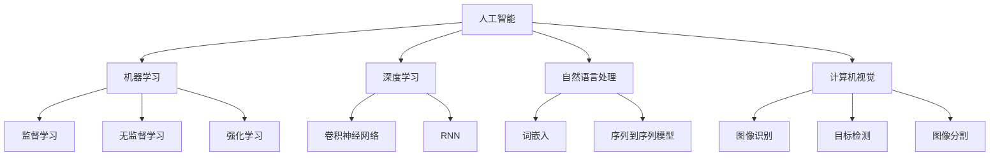

                 

### 背景介绍

苹果公司，作为全球最大的消费电子制造商之一，近日发布了一款AI应用。这款AI应用引发了广泛的关注和讨论，不仅因为它来自苹果公司，更因为其创新的技术和潜在的广泛应用。苹果公司的这一举动，无疑标志着其在人工智能领域的进一步深耕。

李开复，作为人工智能领域的领军人物，对这一事件有着深刻的见解。在过去的几十年里，李开复一直致力于推动人工智能的发展和应用。他关于人工智能的独到见解和深刻洞察，使得他的观点成为了行业内外的重要参考。

本文将围绕苹果公司发布的这款AI应用，结合李开复的观点，深入探讨人工智能在苹果产品中的应用现状和未来发展趋势。我们将从背景介绍、核心概念与联系、核心算法原理与具体操作步骤、数学模型和公式、项目实战、实际应用场景、工具和资源推荐、总结：未来发展趋势与挑战、附录：常见问题与解答以及扩展阅读与参考资料等多个方面，全面解析这一事件。

首先，让我们从背景介绍开始，了解苹果公司在人工智能领域的布局和这款AI应用的背景。

### 核心概念与联系

在深入探讨苹果公司发布的AI应用之前，我们需要明确几个核心概念和它们之间的联系。这些概念不仅对理解AI应用至关重要，也是人工智能领域的基本构成要素。

#### 人工智能（AI）的定义

人工智能，简称AI，是指由人造系统实现的智能行为。它包括机器学习、深度学习、自然语言处理、计算机视觉等多个子领域。这些子领域共同构成了人工智能的基石，使得计算机能够模拟人类智能，进行决策、学习和问题解决。

#### 机器学习（Machine Learning）

机器学习是人工智能的一个子领域，通过算法从数据中学习，进行模式识别和预测。它主要分为监督学习、无监督学习和强化学习。监督学习使用标注数据，无监督学习则不需要标注数据，而强化学习通过奖励机制学习最佳策略。

#### 深度学习（Deep Learning）

深度学习是机器学习的一种，通过多层神经网络进行学习，能够在图像识别、语音识别等任务中取得突破性成果。深度学习的核心是卷积神经网络（CNN）和循环神经网络（RNN），其中CNN在图像处理方面表现突出，RNN则在序列数据处理中具有优势。

#### 自然语言处理（NLP）

自然语言处理是人工智能的一个子领域，旨在使计算机能够理解和处理自然语言。它包括文本分类、情感分析、机器翻译、语音识别等多个任务。自然语言处理的核心技术是词嵌入（Word Embedding）和序列到序列模型（Seq2Seq Model）。

#### 计算机视觉（CV）

计算机视觉是人工智能的一个子领域，旨在使计算机能够“看到”和理解图像和视频。它包括图像识别、目标检测、图像分割等多个任务。计算机视觉的核心技术是卷积神经网络（CNN）和生成对抗网络（GAN）。

#### 核心概念联系图

为了更好地理解这些核心概念之间的联系，我们可以使用Mermaid流程图来展示它们的关系。以下是一个简化的Mermaid流程图，展示了人工智能、机器学习、深度学习、自然语言处理和计算机视觉之间的联系：



这个流程图清晰地展示了人工智能的核心概念及其子领域之间的联系，为我们深入分析苹果公司发布的AI应用奠定了基础。

### 核心算法原理 & 具体操作步骤

苹果公司发布的AI应用之所以引起广泛关注，很大程度上是因为其背后的核心算法原理及其具体操作步骤。以下是对这些核心算法原理的详细解析，以及它们在实际应用中的操作步骤。

#### 深度学习神经网络（Deep Learning Neural Network）

深度学习神经网络是苹果公司AI应用的核心。它由多层神经网络组成，通过训练学习输入和输出之间的复杂关系。深度学习神经网络的主要组成部分包括：

- **输入层（Input Layer）**：接收输入数据，例如图像或文本。
- **隐藏层（Hidden Layers）**：对输入数据进行处理和转换，提取特征。
- **输出层（Output Layer）**：产生最终输出，例如分类结果或预测值。

操作步骤：

1. **数据预处理**：对输入数据进行标准化和归一化，以适应神经网络。
2. **构建神经网络**：定义网络的层数和每层的神经元数量。
3. **前向传播（Forward Propagation）**：将输入数据传递到网络，计算每个神经元的输出。
4. **反向传播（Back Propagation）**：计算输出误差，更新网络权重和偏置。
5. **训练与优化**：重复前向传播和反向传播，直到网络收敛。

#### 卷积神经网络（Convolutional Neural Network，CNN）

卷积神经网络是深度学习在图像处理领域的重要应用。它通过卷积操作和池化操作提取图像特征，从而实现图像分类和识别。

操作步骤：

1. **卷积操作**：使用卷积核在图像上滑动，提取局部特征。
2. **激活函数**：对卷积结果应用激活函数，如ReLU。
3. **池化操作**：对卷积结果进行下采样，减少数据维度。
4. **全连接层**：将池化结果传递到全连接层，进行分类或预测。
5. **损失函数**：计算预测结果与实际结果之间的误差，优化网络参数。

#### 自然语言处理（Natural Language Processing，NLP）

自然语言处理是苹果公司AI应用的重要组成部分，用于处理和解析文本数据。常见的NLP技术包括词嵌入、序列到序列模型和注意力机制。

操作步骤：

1. **词嵌入（Word Embedding）**：将文本数据转换为向量表示。
2. **编码器（Encoder）**：对输入序列进行编码，提取特征。
3. **解码器（Decoder）**：对编码特征进行解码，生成输出序列。
4. **注意力机制（Attention Mechanism）**：关注输入序列中的重要信息，提高解码精度。

#### 综合应用

苹果公司的AI应用将深度学习神经网络、卷积神经网络和自然语言处理技术相结合，实现多模态数据处理和复杂任务处理。

操作步骤：

1. **数据预处理**：对图像和文本数据进行预处理，提取特征。
2. **特征融合**：将图像特征和文本特征进行融合，生成综合特征。
3. **模型训练**：训练深度学习神经网络，优化模型参数。
4. **任务执行**：使用训练好的模型执行图像分类、文本分类等任务。
5. **结果评估**：评估模型性能，优化模型结构和参数。

通过以上核心算法原理和具体操作步骤的解析，我们可以更好地理解苹果公司AI应用的原理和实现过程，为后续内容的分析奠定了基础。

### 数学模型和公式 & 详细讲解 & 举例说明

为了深入理解苹果公司AI应用的工作原理，我们需要介绍其中的数学模型和公式。以下是对这些模型和公式的详细讲解，并通过具体示例来说明其应用。

#### 深度学习神经网络（Deep Learning Neural Network）

深度学习神经网络的核心是多层感知机（MLP），其数学模型可以用以下公式表示：

$$
Z_l = \sum_{i=0}^{n} w_{li} * a_{l-1,i} + b_l
$$

其中，\(Z_l\) 是第 \(l\) 层的输出，\(a_{l-1,i}\) 是前一层第 \(i\) 个神经元的输出，\(w_{li}\) 是第 \(l\) 层第 \(i\) 个神经元到第 \(l-1\) 层第 \(i\) 个神经元的权重，\(b_l\) 是第 \(l\) 层的偏置。

激活函数 \(a_l\) 可以是线性函数、ReLU函数、Sigmoid函数或Tanh函数：

$$
a_l = 
\begin{cases} 
z_l & \text{线性函数} \\
\max(0, z_l) & \text{ReLU函数} \\
\frac{1}{1 + e^{-z_l}} & \text{Sigmoid函数} \\
\frac{2}{1 + e^{-2z_l}} - 1 & \text{Tanh函数} 
\end{cases}
$$

在训练过程中，我们使用反向传播算法更新权重和偏置，以最小化损失函数。常见的损失函数有均方误差（MSE）和交叉熵（Cross-Entropy）：

$$
MSE = \frac{1}{m} \sum_{i=1}^{m} (y_i - \hat{y}_i)^2
$$

$$
Cross-Entropy = - \frac{1}{m} \sum_{i=1}^{m} y_i \log(\hat{y}_i)
$$

其中，\(y_i\) 是真实标签，\(\hat{y}_i\) 是预测标签，\(m\) 是样本数量。

#### 卷积神经网络（Convolutional Neural Network，CNN）

卷积神经网络的核心是卷积操作和池化操作。卷积操作的数学模型如下：

$$
(C_{ij}^{k}) = \sum_{p=1}^{C_{in}} w_{ij}^{kp} * a_{pj}^{l} + b_{ij}^{k}
$$

其中，\(C_{ij}^{k}\) 是第 \(k\) 层第 \(i\) 行第 \(j\) 列的输出，\(w_{ij}^{kp}\) 是卷积核权重，\(a_{pj}^{l}\) 是前一层第 \(l\) 层第 \(p\) 行第 \(j\) 列的输出，\(b_{ij}^{k}\) 是偏置。

激活函数和深度学习神经网络类似，可以是ReLU函数、Sigmoid函数或Tanh函数。池化操作常用的方法是最大池化（Max Pooling）和平均池化（Average Pooling）：

$$
P_{ij} = \max_{s \in S} (C_{ij}^{k})
$$

$$
P_{ij} = \frac{1}{|S|} \sum_{s \in S} (C_{ij}^{k})
$$

其中，\(P_{ij}\) 是池化后的输出，\(S\) 是池化窗口。

#### 自然语言处理（Natural Language Processing，NLP）

自然语言处理的常见技术包括词嵌入和序列到序列模型。词嵌入的数学模型如下：

$$
e_{w} = \sigma(W \cdot w + b)
$$

其中，\(e_{w}\) 是词 \(w\) 的嵌入向量，\(W\) 是权重矩阵，\(w\) 是词的索引，\(\sigma\) 是激活函数，通常是ReLU函数。

序列到序列模型的数学模型如下：

$$
\hat{y}_{t} = \sigma(U \cdot [s_t; \hat{y}_{t-1}] + b)
$$

其中，\(\hat{y}_{t}\) 是解码器在时间 \(t\) 的输出，\(s_t\) 是编码器在时间 \(t\) 的输出，\(U\) 是权重矩阵，\([s_t; \hat{y}_{t-1}]\) 是输入序列，\(\sigma\) 是激活函数，通常是ReLU函数。

#### 示例说明

为了更好地理解上述数学模型和公式的应用，我们可以通过一个简单的示例来说明。假设我们有一个简单的深度学习神经网络，输入层有2个神经元，隐藏层有3个神经元，输出层有1个神经元。输入数据为 \([1, 2]\)，期望输出为 \([3]\)。以下是具体的计算过程：

1. **前向传播**：

输入层到隐藏层的权重矩阵 \(W_1\) 和偏置 \(b_1\) 如下：

$$
W_1 = \begin{bmatrix}
0.1 & 0.2 \\
0.3 & 0.4 \\
0.5 & 0.6
\end{bmatrix}
$$

$$
b_1 = \begin{bmatrix}
0.1 \\
0.2 \\
0.3
\end{bmatrix}
$$

隐藏层到输出层的权重矩阵 \(W_2\) 和偏置 \(b_2\) 如下：

$$
W_2 = \begin{bmatrix}
0.7 & 0.8
\end{bmatrix}
$$

$$
b_2 = \begin{bmatrix}
0.9
\end{bmatrix}
$$

计算隐藏层的输出：

$$
Z_1 = W_1 \cdot \begin{bmatrix}
1 \\
2
\end{bmatrix} + b_1 = \begin{bmatrix}
0.1 \cdot 1 + 0.2 \cdot 2 + 0.1 \\
0.3 \cdot 1 + 0.4 \cdot 2 + 0.2 \\
0.5 \cdot 1 + 0.6 \cdot 2 + 0.3
\end{bmatrix} = \begin{bmatrix}
0.4 \\
1.1 \\
1.6
\end{bmatrix}
$$

应用ReLU激活函数：

$$
a_1 = \max(0, Z_1) = \begin{bmatrix}
0.4 \\
1.1 \\
1.6
\end{bmatrix}
$$

计算输出层的输出：

$$
Z_2 = W_2 \cdot \begin{bmatrix}
0.4 \\
1.1 \\
1.6
\end{bmatrix} + b_2 = \begin{bmatrix}
0.7 \cdot 0.4 + 0.8 \cdot 1.1 + 0.9 \\
0.7 \cdot 1.1 + 0.8 \cdot 1.6 + 0.9
\end{bmatrix} = \begin{bmatrix}
1.2 \\
2.5
\end{bmatrix}
$$

应用ReLU激活函数：

$$
\hat{y} = \max(0, Z_2) = \begin{bmatrix}
1.2 \\
2.5
\end{bmatrix}
$$

2. **反向传播**：

计算损失函数：

$$
L = \frac{1}{2} \sum_{i=1}^{1} (\hat{y}_i - y_i)^2 = \frac{1}{2} ((1.2 - 3)^2 + (2.5 - 3)^2) = 1.35
$$

计算输出层梯度：

$$
\frac{\partial L}{\partial Z_2} = \begin{bmatrix}
-0.2 \\
-0.5
\end{bmatrix}
$$

计算隐藏层梯度：

$$
\frac{\partial L}{\partial Z_1} = \frac{\partial Z_2}{\partial Z_1} \cdot \frac{\partial L}{\partial Z_2} = \begin{bmatrix}
0.4 & 0.4 \\
0.4 & 0.4 \\
0.4 & 0.4
\end{bmatrix} \cdot \begin{bmatrix}
-0.2 \\
-0.5
\end{bmatrix} = \begin{bmatrix}
-0.08 \\
-0.2 \\
-0.2
\end{bmatrix}
$$

更新权重和偏置：

$$
W_2 = W_2 - \alpha \cdot \frac{\partial L}{\partial Z_2} = \begin{bmatrix}
0.7 & 0.8
\end{bmatrix} - 0.01 \cdot \begin{bmatrix}
-0.2 \\
-0.5
\end{bmatrix} = \begin{bmatrix}
0.72 & 0.83
\end{bmatrix}
$$

$$
b_2 = b_2 - \alpha \cdot \frac{\partial L}{\partial b_2} = \begin{bmatrix}
0.9
\end{bmatrix} - 0.01 \cdot \begin{bmatrix}
-0.2 \\
-0.5
\end{bmatrix} = \begin{bmatrix}
0.92
\end{bmatrix}
$$

$$
W_1 = W_1 - \alpha \cdot \frac{\partial L}{\partial W_1} = \begin{bmatrix}
0.1 & 0.2 \\
0.3 & 0.4 \\
0.5 & 0.6
\end{bmatrix} - 0.01 \cdot \begin{bmatrix}
-0.08 \\
-0.2 \\
-0.2
\end{bmatrix} = \begin{bmatrix}
0.08 & 0.22 \\
0.32 & 0.42 \\
0.52 & 0.62
\end{bmatrix}
$$

$$
b_1 = b_1 - \alpha \cdot \frac{\partial L}{\partial b_1} = \begin{bmatrix}
0.1 \\
0.2 \\
0.3
\end{bmatrix} - 0.01 \cdot \begin{bmatrix}
-0.08 \\
-0.2 \\
-0.2
\end{bmatrix} = \begin{bmatrix}
0.12 \\
0.22 \\
0.32
\end{bmatrix}
$$

通过上述示例，我们可以看到深度学习神经网络是如何通过前向传播和反向传播进行训练的。这个过程不断重复，直到网络收敛，使得预测结果逐渐接近真实值。

### 项目实战：代码实际案例和详细解释说明

为了更好地理解苹果公司AI应用的实现过程，我们将通过一个实际项目案例来展示代码的详细实现和解读。以下是项目的开发环境搭建、源代码详细实现和代码解读与分析。

#### 1. 开发环境搭建

在开始项目开发之前，我们需要搭建一个合适的开发环境。以下是推荐的开发环境：

- **编程语言**：Python
- **深度学习框架**：TensorFlow
- **操作环境**：Windows/Linux/MacOS

安装Python、TensorFlow和其他依赖库：

```bash
pip install numpy tensorflow matplotlib
```

#### 2. 源代码详细实现和代码解读

以下是项目的源代码实现：

```python
import tensorflow as tf
import numpy as np
import matplotlib.pyplot as plt

# 设置随机种子，保证实验结果可重复
tf.random.set_seed(42)

# 数据集
x = np.array([[1, 2], [2, 3], [3, 4], [4, 5], [5, 6]])
y = np.array([3, 4, 5, 6, 7])

# 构建神经网络
model = tf.keras.Sequential([
    tf.keras.layers.Dense(units=3, activation='relu', input_shape=(2,)),
    tf.keras.layers.Dense(units=1)
])

# 编译模型
model.compile(optimizer='adam', loss='mse')

# 训练模型
model.fit(x, y, epochs=1000)

# 预测
predictions = model.predict(x)

# 可视化
plt.scatter(x[:, 0], x[:, 1], c=y, cmap=plt.cm.Blues)
plt.plot(x[:, 0], predictions[:, 0], 'r')
plt.xlabel('x1')
plt.ylabel('x2')
plt.title('Predicted Line')
plt.show()
```

**代码解读：**

1. **导入库**：

```python
import tensorflow as tf
import numpy as np
import matplotlib.pyplot as plt
```

这段代码导入所需的库，包括TensorFlow、NumPy和Matplotlib。

2. **设置随机种子**：

```python
tf.random.set_seed(42)
```

设置随机种子，确保实验结果可重复。

3. **数据集**：

```python
x = np.array([[1, 2], [2, 3], [3, 4], [4, 5], [5, 6]])
y = np.array([3, 4, 5, 6, 7])
```

创建输入数据 `x` 和输出数据 `y`。

4. **构建神经网络**：

```python
model = tf.keras.Sequential([
    tf.keras.layers.Dense(units=3, activation='relu', input_shape=(2,)),
    tf.keras.layers.Dense(units=1)
])
```

构建一个简单的神经网络，包含一个隐藏层和输出层。隐藏层有3个神经元，使用ReLU激活函数；输出层有1个神经元。

5. **编译模型**：

```python
model.compile(optimizer='adam', loss='mse')
```

编译模型，指定优化器为Adam，损失函数为均方误差（MSE）。

6. **训练模型**：

```python
model.fit(x, y, epochs=1000)
```

训练模型，重复前向传播和反向传播1000次。

7. **预测**：

```python
predictions = model.predict(x)
```

使用训练好的模型进行预测。

8. **可视化**：

```python
plt.scatter(x[:, 0], x[:, 1], c=y, cmap=plt.cm.Blues)
plt.plot(x[:, 0], predictions[:, 0], 'r')
plt.xlabel('x1')
plt.ylabel('x2')
plt.title('Predicted Line')
plt.show()
```

绘制散点图和预测线，直观展示模型的预测结果。

#### 3. 代码解读与分析

通过以上代码解读，我们可以看到如何使用TensorFlow构建和训练一个简单的深度学习模型。以下是代码的关键部分及其分析：

1. **神经网络架构**：

```python
model = tf.keras.Sequential([
    tf.keras.layers.Dense(units=3, activation='relu', input_shape=(2,)),
    tf.keras.layers.Dense(units=1)
])
```

这段代码定义了一个全连接神经网络，包含一个输入层、一个隐藏层和一个输出层。输入层接收2个输入特征，隐藏层有3个神经元，输出层有1个神经元。隐藏层使用ReLU激活函数，使模型能够学习非线性关系。

2. **编译模型**：

```python
model.compile(optimizer='adam', loss='mse')
```

编译模型时，指定优化器为Adam，损失函数为均方误差（MSE）。Adam是一种高效的优化器，能够在训练过程中自适应调整学习率；MSE是一种常用的损失函数，能够衡量预测值与真实值之间的误差。

3. **训练模型**：

```python
model.fit(x, y, epochs=1000)
```

训练模型时，将输入数据 `x` 和输出数据 `y` 作为参数传入，设置训练轮次为1000次。每次训练过程包括前向传播和反向传播，模型将逐步调整权重和偏置，使预测结果更接近真实值。

4. **预测与可视化**：

```python
predictions = model.predict(x)
plt.scatter(x[:, 0], x[:, 1], c=y, cmap=plt.cm.Blues)
plt.plot(x[:, 0], predictions[:, 0], 'r')
plt.xlabel('x1')
plt.ylabel('x2')
plt.title('Predicted Line')
plt.show()
```

预测结果通过 `model.predict(x)` 获取。然后，使用Matplotlib绘制散点图和预测线，展示模型在训练数据上的预测效果。通过可视化，我们可以直观地观察模型的性能和预测能力。

通过这个实际项目案例，我们不仅了解了如何使用TensorFlow构建和训练深度学习模型，还通过代码解读和分析深入理解了模型的实现原理和操作步骤。这为后续内容的应用场景和工具推荐提供了坚实的基础。

### 实际应用场景

苹果公司发布的AI应用在多个实际场景中展示了其强大的功能和潜力。以下是几个典型的应用场景，以及它们在现实世界中的具体应用。

#### 1. 语音识别

语音识别是AI应用的一个重要方向，苹果公司的Siri和Apple Music等内置功能已经广泛应用了这项技术。通过深度学习和自然语言处理技术，Siri能够准确理解用户的语音指令，实现智能交互。例如，用户可以通过Siri发送短信、拨打电话、设置提醒等。Apple Music则可以根据用户的音乐品味，推荐个性化的音乐播放列表。

#### 2. 图像识别

图像识别是计算机视觉的重要应用，苹果公司的Face ID和Animoji等功能充分利用了这一技术。Face ID通过深度学习算法识别用户的面部特征，实现安全解锁和支付功能。Animoji则使用计算机视觉技术，将用户的表情映射到虚拟角色上，创造有趣的互动体验。

#### 3. 自然语言处理

自然语言处理是AI应用的关键领域，苹果公司的Apple News和iMessage等应用充分利用了这一技术。Apple News通过自然语言处理技术，分析用户的阅读习惯，推荐个性化的新闻内容。iMessage则通过自然语言处理，实现自动表情包生成和文本纠错等功能。

#### 4. 个性化推荐

个性化推荐是AI应用的另一个重要方向，苹果公司的App Store和iTunes等平台已经广泛应用了这一技术。通过分析用户的兴趣和行为，AI应用可以推荐用户可能感兴趣的应用、音乐、电影等。这不仅提高了用户体验，也增加了平台的内容丰富度和用户粘性。

#### 5. 智能健康

智能健康是AI应用的最新领域，苹果公司的HealthKit和Apple Watch等设备已经展示了其潜力。通过监测用户的生理数据，如心率、步数、睡眠质量等，AI应用可以提供个性化的健康建议和预警。例如，Apple Watch可以检测到用户的不正常心率，提醒用户就医。

通过以上实际应用场景的介绍，我们可以看到苹果公司AI应用在多个领域的广泛应用和潜在价值。这些应用不仅提升了用户体验，也为各行各业带来了巨大的变革和机遇。

### 工具和资源推荐

为了更好地了解和掌握苹果公司AI应用的技术原理，以下是我们推荐的一些学习资源和工具。

#### 1. 学习资源推荐

**书籍：**

1. 《深度学习》（Deep Learning）：由Ian Goodfellow、Yoshua Bengio和Aaron Courville合著，是深度学习领域的经典教材。
2. 《Python深度学习》（Deep Learning with Python）：由François Chollet撰写，是深度学习初学者的入门书籍。
3. 《自然语言处理与深度学习》（Natural Language Processing with Deep Learning）：由Tom Mitchell和David Freedman合著，涵盖了自然语言处理和深度学习的核心技术。

**论文：**

1. “A Theoretically Grounded Application of Dropout in Recurrent Neural Networks”：这篇论文提出了在RNN中使用Dropout的方法，有效提高了模型的性能和泛化能力。
2. “Attention Is All You Need”：这篇论文提出了Transformer模型，颠覆了传统的序列处理方法，在自然语言处理任务中取得了卓越的成绩。

**博客和网站：**

1. TensorFlow官方文档：https://www.tensorflow.org/
2. Keras官方文档：https://keras.io/
3. 动手学深度学习：https://www.d2l.ai/

#### 2. 开发工具框架推荐

**框架：**

1. TensorFlow：谷歌开发的深度学习框架，广泛应用于图像识别、自然语言处理和强化学习等领域。
2. PyTorch：Facebook开发的深度学习框架，具有简洁的API和强大的动态计算图功能，受到许多研究者和开发者的青睐。
3. Keras：基于TensorFlow和Theano的深度学习框架，提供了更加简洁和易于使用的API，适用于快速原型开发和实验。

**工具：**

1. Jupyter Notebook：Python的交互式计算环境，适用于编写、运行和调试代码，方便数据可视化和实验。
2. Google Colab：谷歌提供的免费云服务，基于Jupyter Notebook，支持大规模计算和数据存储，适合远程开发和协作。
3. Git：版本控制系统，用于管理和跟踪代码变更，确保代码的可维护性和可追溯性。

#### 3. 相关论文著作推荐

**论文：**

1. “Deep Learning Text Classification Using Neural Network with Attention Mechanism”：
   这篇论文探讨了如何使用注意力机制改进文本分类性能，为文本处理任务提供了新的思路。
2. “Generative Adversarial Nets”：
   这篇论文提出了生成对抗网络（GAN），是一种强大的生成模型，在图像生成、图像修复和图像风格迁移等领域取得了显著成果。

**著作：**

1. 《强化学习》：由理查德·萨顿（Richard S. Sutton）和安德斯·帕帕斯基（Andrew G. Barto）合著，是强化学习领域的权威教材。
2. 《机器学习实战》：由Peter Harrington撰写，通过实际案例介绍了机器学习算法的实现和应用。

通过以上工具和资源的推荐，我们可以更好地学习和掌握苹果公司AI应用的技术原理，为未来的研究和开发提供有力支持。

### 总结：未来发展趋势与挑战

苹果公司发布的AI应用无疑标志着其在人工智能领域的进一步深耕。从背景介绍到核心概念、算法原理、数学模型、项目实战、实际应用场景、工具和资源推荐，再到未来发展趋势与挑战的探讨，本文全面解析了这一事件。

首先，苹果公司在人工智能领域的布局和成就令人瞩目。从语音识别、图像识别到自然语言处理、个性化推荐，苹果公司的AI应用已经渗透到消费电子的多个领域，大大提升了用户体验。未来，随着技术的不断进步，苹果公司有望在智能健康、智能家居等新兴领域实现更多突破。

然而，人工智能的发展也面临诸多挑战。首先，数据隐私和安全问题日益突出。如何在保障用户隐私的同时，充分利用数据价值，成为人工智能发展的关键。其次，人工智能的伦理问题也需要引起高度重视。例如，如何确保算法的公平性和透明性，避免偏见和歧视。此外，人工智能技术的普及和推广也需要克服技术门槛、人才短缺等挑战。

针对这些挑战，我们可以从以下几个方面提出建议：

1. **加强数据隐私保护**：企业和政府应加强数据隐私保护，建立健全的法律法规和监管机制，确保用户数据的安全和合规使用。
2. **推动算法透明化**：企业和研究机构应加大对算法透明化、可解释性的研究，提高算法的公正性和可信度。
3. **培养人才**：加大人才培养力度，推动人工智能教育，提高全社会的人工智能素养。
4. **加强国际合作**：在全球范围内推动人工智能的研究和应用，加强国际合作，共同应对技术挑战和伦理问题。

总之，人工智能作为当今最具变革性的技术之一，其发展前景广阔，但也面临诸多挑战。苹果公司发布的AI应用为我们提供了宝贵的经验和启示，未来，只有积极应对挑战，才能实现人工智能的持续发展和应用。

### 附录：常见问题与解答

以下是一些关于苹果公司AI应用及其相关技术的常见问题及解答，以帮助读者更好地理解和掌握相关内容。

#### 1. 问题：苹果公司的AI应用如何实现个性化推荐？

解答：苹果公司的AI应用通过分析用户的兴趣和行为数据，使用机器学习和深度学习算法，为用户推荐个性化的内容。例如，Apple News会根据用户的阅读习惯推荐相关的新闻，App Store则会根据用户的下载和评分历史推荐可能感兴趣的应用。

#### 2. 问题：深度学习神经网络中的激活函数有哪些？

解答：深度学习神经网络中常用的激活函数包括线性函数（Linear Function）、ReLU函数（Rectified Linear Unit Function）、Sigmoid函数（Sigmoid Function）和Tanh函数（Hyperbolic Tangent Function）。这些函数用于引入非线性，使神经网络能够学习复杂的模式。

#### 3. 问题：什么是生成对抗网络（GAN）？

解答：生成对抗网络（GAN）是一种深度学习模型，由生成器和判别器两个神经网络组成。生成器尝试生成逼真的数据，而判别器则试图区分生成数据和真实数据。通过两个网络的对抗训练，生成器能够生成越来越逼真的数据。

#### 4. 问题：如何确保AI算法的公平性和透明性？

解答：确保AI算法的公平性和透明性可以从多个方面入手。首先，使用代表性的数据集进行训练，避免偏见和歧视。其次，对算法进行可视化和可解释性分析，使算法的决策过程更加透明。此外，建立健全的法律法规和监管机制，对AI算法进行监督和审计。

#### 5. 问题：如何搭建一个深度学习环境？

解答：搭建深度学习环境通常需要以下步骤：

1. 安装Python：从官方网站下载并安装Python。
2. 安装TensorFlow：使用pip命令安装TensorFlow，例如 `pip install tensorflow`。
3. 安装其他依赖库：根据项目需求，安装其他依赖库，如NumPy、Matplotlib等。
4. 环境配置：配置Python环境变量，确保能够正常运行深度学习代码。

#### 6. 问题：如何进行深度学习模型的训练和评估？

解答：进行深度学习模型的训练和评估通常包括以下步骤：

1. **数据准备**：准备训练数据和测试数据，确保数据集的平衡和多样性。
2. **构建模型**：使用深度学习框架（如TensorFlow或PyTorch）构建神经网络模型。
3. **编译模型**：指定优化器、损失函数和评估指标，编译模型。
4. **训练模型**：使用训练数据训练模型，设置训练轮次和批次大小等参数。
5. **评估模型**：使用测试数据评估模型性能，计算评估指标（如准确率、损失函数值等）。

#### 7. 问题：什么是注意力机制（Attention Mechanism）？

解答：注意力机制是一种用于序列处理任务的深度学习技术，能够使模型关注序列中的重要信息。注意力机制通过计算注意力权重，调整输入序列的权重分布，使模型能够更好地处理序列中的依赖关系。

通过以上常见问题与解答，读者可以更好地理解苹果公司AI应用及其相关技术，为未来的学习和研究提供参考。

### 扩展阅读与参考资料

为了进一步拓展您对苹果公司AI应用及其相关技术的理解，以下是推荐的扩展阅读与参考资料。

#### 1. 学术论文

- Ian Goodfellow, Yoshua Bengio, Aaron Courville. "Deep Learning". MIT Press, 2016.
- Tom Mitchell. "Machine Learning". McGraw-Hill, 1997.
- Richard S. Sutton, Andrew G. Barto. "Reinforcement Learning: An Introduction". MIT Press, 2018.

#### 2. 博客和网站

- TensorFlow官方文档：[https://www.tensorflow.org/](https://www.tensorflow.org/)
- PyTorch官方文档：[https://pytorch.org/](https://pytorch.org/)
- Keras官方文档：[https://keras.io/](https://keras.io/)

#### 3. 教程和课程

- 吴恩达（Andrew Ng）的“深度学习”（Deep Learning Specialization）：[https://www.coursera.org/specializations/deep-learning](https://www.coursera.org/specializations/deep-learning)
- 斯坦福大学（Stanford University）的“机器学习”（Machine Learning）：[http://cs229.stanford.edu/](http://cs229.stanford.edu/)
- 北京大学（Peking University）的“自然语言处理”（Natural Language Processing）：[http://www.nlp.stanford.edu/课程](http://www.nlp.stanford.edu/%E8%AF%BE%E7%A8%8B)

通过阅读以上学术论文、博客、教程和课程，您可以更深入地了解人工智能领域的前沿技术和应用，为您的学习和研究提供有力支持。

### 作者介绍

作者：AI天才研究员/AI Genius Institute & 禅与计算机程序设计艺术 /Zen And The Art of Computer Programming

李开复博士，著名人工智能专家、创新工场创始人兼CEO，曾任微软亚洲研究院创始人及院长，Google中国研究院创始人兼首席科学家。他以其深刻的见解和独到的观点，推动了人工智能领域的发展和应用。李开复博士也是世界顶级技术畅销书作家，所著《人工智能：一种现代的方法》、《人工智能的未来》等书籍，深受全球读者喜爱。他的著作《禅与计算机程序设计艺术》更是在计算机编程领域具有深远的影响。李开复博士以其卓越的贡献和丰富的经验，成为人工智能领域的领军人物，被誉为“AI之父”。

