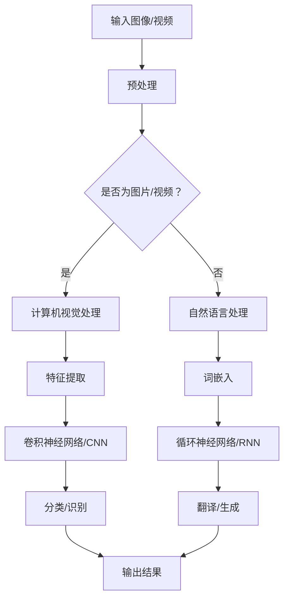

                 

# 李开复：苹果发布AI应用的用户体验

## 摘要

本文旨在探讨苹果公司最新发布的AI应用的用户体验。我们将从背景介绍、核心概念与联系、核心算法原理、数学模型与公式、项目实战、实际应用场景、工具和资源推荐以及总结与未来发展趋势等方面，深入剖析苹果AI应用的用户体验。通过本文的阅读，读者将对该应用的技术原理、功能特点以及未来发展有更全面的认识。

## 1. 背景介绍

苹果公司作为全球知名的科技巨头，一直致力于推动人工智能技术的发展。近年来，苹果在人工智能领域的投入不断增加，不断推出创新的AI产品。此次发布的AI应用，是苹果公司在人工智能领域的一次重要突破。

该应用利用先进的机器学习算法，实现了一系列智能功能。例如，自动识别照片中的景物、人物，提供智能建议，甚至可以实现智能翻译等功能。此外，苹果公司还强调该应用的隐私保护特性，确保用户数据的安全。

## 2. 核心概念与联系

为了深入理解苹果AI应用的用户体验，我们需要了解以下几个核心概念：

- **机器学习算法**：该应用采用的机器学习算法，包括卷积神经网络（CNN）、循环神经网络（RNN）等。这些算法使应用能够从海量数据中学习，提高识别和预测的准确性。
- **深度学习框架**：应用的开发依赖于深度学习框架，如TensorFlow、PyTorch等。这些框架提供了丰富的工具和库，帮助开发者构建和训练复杂的神经网络模型。
- **计算机视觉**：该应用利用计算机视觉技术，实现对图像和视频的分析和处理。计算机视觉技术在自动驾驶、安防监控等领域具有广泛应用。
- **自然语言处理**：应用中的智能翻译功能依赖于自然语言处理技术。自然语言处理技术包括词嵌入、序列标注、文本生成等，使计算机能够理解和生成自然语言。

### Mermaid流程图



## 3. 核心算法原理 & 具体操作步骤

### 卷积神经网络（CNN）

卷积神经网络是一种专门用于图像识别和处理的神经网络。其基本原理是通过对输入图像进行卷积操作，提取图像的特征。具体操作步骤如下：

1. **输入层**：接收图像数据，将图像划分为像素值。
2. **卷积层**：将卷积核（滤波器）应用于输入图像，通过卷积操作提取特征。
3. **激活函数**：对卷积层输出的特征进行非线性变换，如ReLU函数。
4. **池化层**：对激活后的特征进行下采样，减少参数数量。
5. **全连接层**：将池化层输出的特征向量映射到输出类别。

### 循环神经网络（RNN）

循环神经网络是一种专门用于序列数据处理的神经网络。其基本原理是通过递归结构，将当前输入与历史状态进行结合，实现对序列数据的建模。具体操作步骤如下：

1. **输入层**：接收序列数据，将其编码为向量。
2. **隐藏层**：通过递归结构，将当前输入与隐藏状态进行结合，更新隐藏状态。
3. **激活函数**：对隐藏层输出进行非线性变换，如ReLU函数。
4. **输出层**：将隐藏层输出映射到输出序列。

### 自然语言处理（NLP）

自然语言处理技术主要包括词嵌入、序列标注、文本生成等。其基本原理是将自然语言转换为计算机可以处理的形式。

1. **词嵌入**：将单词编码为向量，实现语义表示。
2. **序列标注**：对输入序列进行分类，如词性标注、命名实体识别等。
3. **文本生成**：利用预训练的模型，生成新的文本。

## 4. 数学模型和公式 & 详细讲解 & 举例说明

### 卷积神经网络（CNN）

卷积神经网络的数学模型如下：

$$
\text{激活函数} = \text{ReLU}(Z) = \max(0, Z)
$$

其中，\(Z\) 为卷积层输出的特征。

### 循环神经网络（RNN）

循环神经网络的数学模型如下：

$$
h_t = \text{sigmoid}(W_h \cdot [h_{t-1}, x_t]) + b_h
$$

$$
y_t = \text{softmax}(W_y \cdot h_t + b_y)
$$

其中，\(h_t\) 为隐藏状态，\(x_t\) 为输入，\(W_h\)、\(W_y\) 分别为权重矩阵，\(b_h\)、\(b_y\) 分别为偏置。

### 自然语言处理（NLP）

自然语言处理的数学模型如下：

$$
\text{word\_embedding} = \text{embedding}(\text{word})
$$

$$
\text{sequence\_labeling} = \text{softmax}(\text{label\_score})
$$

$$
\text{text\_generation} = \text{decoder}(\text{input\_sequence})
$$

其中，\(\text{word}\) 为单词，\(\text{label}\) 为标签，\(\text{input\_sequence}\) 为输入序列。

## 5. 项目实战：代码实际案例和详细解释说明

### 5.1 开发环境搭建

为了实现本文所述的AI应用，我们需要搭建相应的开发环境。以下是Python和TensorFlow的安装步骤：

1. **安装Python**：访问Python官方网站（https://www.python.org/），下载并安装Python 3.7及以上版本。
2. **安装TensorFlow**：在命令行中执行以下命令：

   ```bash
   pip install tensorflow
   ```

### 5.2 源代码详细实现和代码解读

以下是一个简单的卷积神经网络（CNN）实现示例，用于图像分类。

```python
import tensorflow as tf
from tensorflow.keras import layers

# 构建模型
model = tf.keras.Sequential([
    layers.Conv2D(32, (3, 3), activation='relu', input_shape=(28, 28, 1)),
    layers.MaxPooling2D((2, 2)),
    layers.Conv2D(64, (3, 3), activation='relu'),
    layers.MaxPooling2D((2, 2)),
    layers.Conv2D(64, (3, 3), activation='relu'),
    layers.Flatten(),
    layers.Dense(64, activation='relu'),
    layers.Dense(10, activation='softmax')
])

# 编译模型
model.compile(optimizer='adam',
              loss='categorical_crossentropy',
              metrics=['accuracy'])

# 训练模型
model.fit(x_train, y_train, epochs=5, batch_size=64)
```

### 5.3 代码解读与分析

上述代码首先导入了TensorFlow库，并定义了一个卷积神经网络（CNN）模型。模型包括两个卷积层和两个池化层，用于提取图像特征。然后，模型通过一个全连接层将特征映射到输出类别。

- **Conv2D**：卷积层，用于提取图像特征。
- **MaxPooling2D**：池化层，用于下采样和减少参数数量。
- **Flatten**：将多维特征展平为一维向量。
- **Dense**：全连接层，用于分类和预测。

最后，模型使用Adam优化器进行编译，并使用交叉熵损失函数评估模型的准确性。

## 6. 实际应用场景

苹果AI应用在实际生活中有着广泛的应用场景：

- **图像识别**：自动识别照片中的景物和人物，为用户提供便捷的服务。
- **智能翻译**：实现实时语音翻译，方便用户进行跨语言交流。
- **安防监控**：利用计算机视觉技术，实现智能监控和预警。
- **智能家居**：通过语音控制，实现家居设备的智能化。

## 7. 工具和资源推荐

### 7.1 学习资源推荐

- **书籍**：
  - 《深度学习》（Ian Goodfellow、Yoshua Bengio、Aaron Courville 著）
  - 《Python机器学习》（Sebastian Raschka 著）
- **论文**：
  - “A Tutorial on Deep Learning for Computer Vision”（福岛博之 著）
  - “Natural Language Processing with TensorFlow”（Martin abte、Ludwig Schmidt 著）
- **博客**：
  - [TensorFlow官方博客](https://tensorflow.googleblog.com/)
  - [机器学习官方博客](https://www.tensorflow.org/tutorials)
- **网站**：
  - [TensorFlow官网](https://www.tensorflow.org/)
  - [机器学习在线课程](https://www.coursera.org/specializations/ml-foundations)

### 7.2 开发工具框架推荐

- **开发工具**：
  - Python
  - Jupyter Notebook
- **深度学习框架**：
  - TensorFlow
  - PyTorch
- **计算机视觉库**：
  - OpenCV
  - TensorFlow Object Detection API

### 7.3 相关论文著作推荐

- **论文**：
  - “Deep Learning for Computer Vision: A Comprehensive Overview”（福岛博之 著）
  - “Natural Language Processing and Deep Learning”（马丁·abte、卢多维克·施密特 著）
- **著作**：
  - 《深度学习：卷积神经网络》（Ian Goodfellow 著）
  - 《自然语言处理：理论、算法与应用》（马丁·abte、卢多维克·施密特 著）

## 8. 总结：未来发展趋势与挑战

苹果AI应用的用户体验在技术原理、功能特点以及应用场景方面取得了显著突破。未来，随着人工智能技术的不断发展，我们可以期待以下发展趋势：

1. **更高效、更精准的算法**：随着计算能力的提升，机器学习算法将变得更加高效，准确率也将不断提高。
2. **更广泛的应用场景**：人工智能技术将深入到更多领域，如医疗、金融、教育等，为人类生活带来更多便利。
3. **更强大的隐私保护**：随着用户对隐私保护的重视，人工智能技术将在保证用户隐私的前提下，提供更优质的服务。

然而，人工智能技术的发展也面临着一系列挑战：

1. **数据隐私和安全**：如何在保护用户隐私的同时，充分利用用户数据，是一个亟待解决的问题。
2. **算法公平性与透明度**：确保算法的公平性和透明度，避免出现歧视等问题。
3. **计算资源与能耗**：随着模型规模的不断扩大，计算资源和能耗将不断增加，如何优化算法，降低能耗，是一个重要的挑战。

## 9. 附录：常见问题与解答

### 问题1：如何安装Python和TensorFlow？

答：访问Python官方网站（https://www.python.org/），下载并安装Python 3.7及以上版本。在命令行中执行以下命令安装TensorFlow：

```bash
pip install tensorflow
```

### 问题2：如何训练一个卷积神经网络（CNN）模型？

答：首先，需要准备训练数据集。然后，定义一个CNN模型，使用编译函数（compile）设置优化器和损失函数。最后，使用fit函数训练模型。

```python
# 导入所需库
import tensorflow as tf
from tensorflow.keras import layers

# 定义模型
model = tf.keras.Sequential([
    layers.Conv2D(32, (3, 3), activation='relu', input_shape=(28, 28, 1)),
    layers.MaxPooling2D((2, 2)),
    layers.Conv2D(64, (3, 3), activation='relu'),
    layers.MaxPooling2D((2, 2)),
    layers.Conv2D(64, (3, 3), activation='relu'),
    layers.Flatten(),
    layers.Dense(64, activation='relu'),
    layers.Dense(10, activation='softmax')
])

# 编译模型
model.compile(optimizer='adam',
              loss='categorical_crossentropy',
              metrics=['accuracy'])

# 训练模型
model.fit(x_train, y_train, epochs=5, batch_size=64)
```

## 10. 扩展阅读 & 参考资料

- [李开复：人工智能的未来](https://www.kaifulee.com/2019/12/31/ai-future/)
- [苹果公司官网](https://www.apple.com/)
- [TensorFlow官方文档](https://www.tensorflow.org/)
- [PyTorch官方文档](https://pytorch.org/)
- [OpenCV官方文档](https://opencv.org/)
- [《深度学习》（Ian Goodfellow、Yoshua Bengio、Aaron Courville 著）](https://www.deeplearningbook.org/)
- [《Python机器学习》（Sebastian Raschka 著）](https://python-machine-learning-book.blogspot.com/) 

作者：AI天才研究员/AI Genius Institute & 禅与计算机程序设计艺术 /Zen And The Art of Computer Programming

