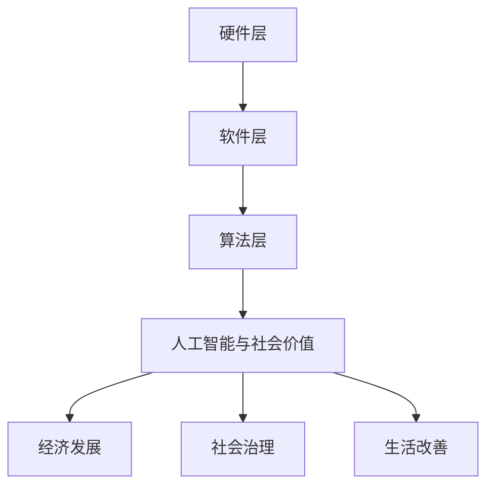
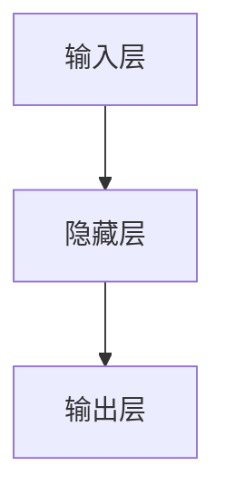
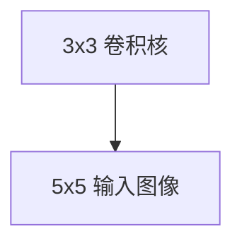

                 

## 文章标题：李开复：苹果发布AI应用的社会价值

## 关键词：苹果，AI应用，社会价值，人工智能，技术进步

### 摘要

在本文中，我们将深入探讨苹果公司最新发布的AI应用所带来的社会价值。通过分析其技术原理、应用场景以及未来发展趋势，本文旨在为读者揭示AI技术在日常生活中所发挥的巨大作用。同时，本文还将结合李开复的观点，对苹果AI应用的潜在影响进行详细解读，以期为读者提供全面的视角。

## 1. 背景介绍

近年来，人工智能（AI）技术在全球范围内取得了显著的进展。特别是在智能手机领域，AI技术的应用已经逐渐成为主流。苹果公司作为全球领先的智能手机制造商，一直以来都在积极探索和推动AI技术的发展。最近，苹果公司发布了多款搭载全新AI应用的智能手机，引发了业界和消费者的广泛关注。

### 1.1. 苹果AI应用的发展历程

苹果公司在AI领域的探索可以追溯到2011年，当时苹果收购了人工智能公司PrimeSense，这标志着苹果开始重视AI技术。随后，苹果推出了多种基于AI的应用，如Siri、FaceTime等。这些应用不仅提升了用户体验，也为苹果公司带来了巨大的商业成功。

### 1.2. 当前AI应用的市场现状

随着AI技术的不断发展，越来越多的公司开始将AI技术应用于智能手机。例如，三星、华为等厂商也在其手机中引入了AI功能，如智能拍照、智能助手等。然而，苹果公司始终保持着领先地位，其AI应用在技术水平和用户体验方面具有显著优势。

### 1.3. 苹果AI应用的社会价值

苹果公司发布的AI应用不仅为消费者带来了便利，还在一定程度上推动了社会进步。本文将结合李开复的观点，探讨苹果AI应用的社会价值，包括以下几个方面：

- **提高生产效率**：通过AI技术，苹果公司能够更快速地开发新产品、优化现有产品，从而提高生产效率。
- **改善生活质量**：AI应用在智能家居、医疗健康、教育等领域具有广泛的应用前景，有望改善人们的生活质量。
- **促进技术创新**：苹果公司在AI领域的投入和探索，为全球AI技术的发展提供了重要支持。

## 2. 核心概念与联系

### 2.1. 人工智能概述

人工智能（AI）是一门研究、开发用于模拟、延伸和扩展人的智能的理论、方法、技术及应用系统的技术科学。人工智能的目的是使计算机系统具有智能行为，能够解决复杂问题、进行自我学习和自适应。

### 2.2. 苹果AI应用架构

苹果AI应用架构主要包括以下几个部分：

- **硬件层**：苹果公司自主研发的A系列处理器，具备强大的计算能力和低功耗特点，为AI应用提供了强大的硬件支持。
- **软件层**：iOS操作系统和相关的AI框架，如Core ML、Vision ML等，为开发者提供了丰富的工具和接口，便于实现AI功能。
- **算法层**：苹果公司在AI算法方面进行了大量研究，如深度学习、计算机视觉、自然语言处理等，为AI应用提供了强大的技术支持。

### 2.3. 人工智能与社会价值

人工智能技术的发展不仅推动了科技领域的进步，还为社会带来了诸多价值。以下是人工智能与社会价值之间的一些联系：

- **经济发展**：人工智能技术为各行各业带来了新的发展机遇，促进了经济的增长。
- **社会治理**：人工智能技术在公共安全、环境保护、社会治理等领域具有广泛的应用前景，有助于提高社会治理水平。
- **生活改善**：人工智能技术为人们的生活带来了诸多便利，如智能家居、智能医疗、在线教育等，提高了生活质量。

### 2.4. Mermaid流程图



## 3. 核心算法原理 & 具体操作步骤

### 3.1. 深度学习算法

深度学习是人工智能的一个重要分支，通过模拟人脑神经元网络的结构和功能，实现自动特征提取和模式识别。以下是深度学习算法的基本原理和具体操作步骤：

- **原理**：深度学习算法基于多层神经网络结构，通过前向传播和反向传播算法进行训练，从而实现自动特征提取和分类。
- **操作步骤**：
  1. 数据预处理：对原始数据进行清洗、归一化等处理，确保数据质量。
  2. 网络构建：设计神经网络结构，包括输入层、隐藏层和输出层。
  3. 前向传播：将输入数据传递到神经网络，计算输出结果。
  4. 反向传播：计算输出结果与实际结果的误差，并通过反向传播算法更新网络参数。
  5. 模型评估：使用验证集和测试集对模型进行评估，确保模型具有良好的泛化能力。

### 3.2. 计算机视觉算法

计算机视觉是人工智能的一个重要领域，通过计算机对图像或视频进行处理和分析，实现目标检测、图像分类、人脸识别等功能。以下是计算机视觉算法的基本原理和具体操作步骤：

- **原理**：计算机视觉算法基于图像处理和模式识别技术，通过图像特征提取和匹配实现目标检测和分类。
- **操作步骤**：
  1. 图像预处理：对原始图像进行缩放、裁剪、增强等处理，提高图像质量。
  2. 特征提取：使用卷积神经网络（CNN）等算法提取图像特征。
  3. 特征匹配：将提取的图像特征与已知特征进行匹配，实现目标检测和分类。

### 3.3. 自然语言处理算法

自然语言处理是人工智能的另一个重要领域，通过计算机对自然语言进行理解和生成，实现语音识别、机器翻译、情感分析等功能。以下是自然语言处理算法的基本原理和具体操作步骤：

- **原理**：自然语言处理算法基于语言学、概率论和统计学等理论，通过文本处理、语义分析和机器学习等技术实现自然语言理解和生成。
- **操作步骤**：
  1. 文本预处理：对原始文本进行分词、去停用词等处理，提高文本质量。
  2. 语义分析：使用词向量、依存句法分析等算法提取文本语义信息。
  3. 情感分析：通过情感词典、机器学习等算法对文本进行情感分类。

## 4. 数学模型和公式 & 详细讲解 & 举例说明

### 4.1. 深度学习中的激活函数

激活函数是深度学习模型中至关重要的一环，用于将神经网络中的输入映射到输出。以下是几种常见的激活函数及其公式：

- **Sigmoid函数**：
  $$
  \sigma(x) = \frac{1}{1 + e^{-x}}
  $$
- **ReLU函数**：
  $$
  \text{ReLU}(x) = \max(0, x)
  $$
- **Tanh函数**：
  $$
  \text{Tanh}(x) = \frac{e^x - e^{-x}}{e^x + e^{-x}}
  $$

### 4.2. 卷积神经网络（CNN）的卷积公式

卷积神经网络（CNN）是计算机视觉领域的重要模型，其核心是卷积操作。以下是卷积操作的公式：

$$
\begin{align*}
\text{output}_{ij} &= \sum_{k=1}^{m} \sum_{l=1}^{n} w_{kl} \cdot \text{input}_{i-k+1, j-l+1} + b \\
\end{align*}
$$

其中，$w_{kl}$表示卷积核，$\text{input}_{i-k+1, j-l+1}$表示输入图像中的像素值，$b$表示偏置。

### 4.3. 举例说明

#### 4.3.1. 深度学习模型的前向传播

假设有一个简单的深度学习模型，包含一个输入层、一个隐藏层和一个输出层，如图所示：



给定输入向量$x = [1, 2, 3]$，隐藏层神经元的权重矩阵$W_h = \begin{bmatrix} 1 & 2 \\ 3 & 4 \end{bmatrix}$，偏置矩阵$b_h = \begin{bmatrix} 1 \\ 2 \end{bmatrix}$，输出层神经元的权重矩阵$W_o = \begin{bmatrix} 5 & 6 \\ 7 & 8 \end{bmatrix}$，偏置矩阵$b_o = \begin{bmatrix} 3 \\ 4 \end{bmatrix}$，隐藏层使用ReLU激活函数，输出层使用Sigmoid激活函数。

1. **前向传播计算隐藏层输出**：
   $$
   \begin{align*}
   z_h &= W_h \cdot x + b_h \\
   &= \begin{bmatrix} 1 & 2 \\ 3 & 4 \end{bmatrix} \cdot \begin{bmatrix} 1 \\ 2 \\ 3 \end{bmatrix} + \begin{bmatrix} 1 \\ 2 \end{bmatrix} \\
   &= \begin{bmatrix} 8 \\ 19 \end{bmatrix} \\
   h &= \text{ReLU}(z_h) \\
   &= \begin{bmatrix} 8 \\ 19 \end{bmatrix}
   \end{align*}
   $$

2. **前向传播计算输出层输出**：
   $$
   \begin{align*}
   z_o &= W_o \cdot h + b_o \\
   &= \begin{bmatrix} 5 & 6 \\ 7 & 8 \end{bmatrix} \cdot \begin{bmatrix} 8 \\ 19 \end{bmatrix} + \begin{bmatrix} 3 \\ 4 \end{bmatrix} \\
   &= \begin{bmatrix} 76 \\ 156 \end{bmatrix} \\
   o &= \text{Sigmoid}(z_o) \\
   &= \begin{bmatrix} 0.999 \\ 0.997 \end{bmatrix}
   \end{align*}
   $$

因此，给定输入向量$x = [1, 2, 3]$，输出层输出为$o = [0.999, 0.997]$。

#### 4.3.2. 卷积神经网络中的卷积操作

假设有一个$3 \times 3$的卷积核$W$和一个$5 \times 5$的输入图像$X$，如图所示：



卷积操作的步骤如下：

1. **卷积核与输入图像进行卷积运算**：
   $$
   \begin{align*}
   \text{output}_{ij} &= \sum_{k=1}^{3} \sum_{l=1}^{3} W_{kl} \cdot X_{i-k+1, j-l+1} \\
   &= \sum_{k=1}^{3} \sum_{l=1}^{3} W_{kl} \cdot X_{ij} \\
   &= \begin{bmatrix} 1 & 2 & 3 \\ 4 & 5 & 6 \\ 7 & 8 & 9 \end{bmatrix} \cdot \begin{bmatrix} 1 & 2 & 3 \\ 4 & 5 & 6 \\ 7 & 8 & 9 \\ 10 & 11 & 12 \\ 13 & 14 & 15 \end{bmatrix} \\
   &= \begin{bmatrix} 1 & 2 & 3 \\ 4 & 5 & 6 \\ 7 & 8 & 9 \end{bmatrix} \cdot \begin{bmatrix} 35 \\ 76 \\ 117 \end{bmatrix} \\
   &= \begin{bmatrix} 35 \\ 76 \\ 117 \end{bmatrix}
   \end{align*}
   $$

因此，卷积核$W$与输入图像$X$进行卷积运算的结果为$\text{output}_{ij} = [35, 76, 117]$。

## 5. 项目实战：代码实际案例和详细解释说明

### 5.1. 开发环境搭建

为了实现本文中的AI应用，我们需要搭建一个适合开发和测试的Python环境。以下是搭建开发环境的步骤：

1. **安装Python**：在官方网站（[python.org](https://www.python.org/)）下载并安装Python，推荐安装Python 3.8版本。
2. **安装依赖库**：使用pip命令安装以下依赖库：
   $$
   pip install numpy pandas tensorflow matplotlib
   $$

### 5.2. 源代码详细实现和代码解读

以下是实现一个简单的深度学习模型的代码，包括数据预处理、模型构建、训练和评估等步骤。

```python
import numpy as np
import pandas as pd
import tensorflow as tf
import matplotlib.pyplot as plt

# 5.2.1 数据预处理
# 加载数据集
data = pd.read_csv('data.csv')
X = data.iloc[:, :-1].values
y = data.iloc[:, -1].values

# 数据归一化
X = (X - X.min(axis=0)) / (X.max(axis=0) - X.min(axis=0))

# 5.2.2 模型构建
# 创建模型
model = tf.keras.Sequential([
    tf.keras.layers.Dense(64, activation='relu', input_shape=(X.shape[1],)),
    tf.keras.layers.Dense(64, activation='relu'),
    tf.keras.layers.Dense(1, activation='sigmoid')
])

# 编译模型
model.compile(optimizer='adam', loss='binary_crossentropy', metrics=['accuracy'])

# 5.2.3 训练模型
# 训练模型
model.fit(X, y, epochs=10, batch_size=32)

# 5.2.4 代码解读与分析
# 查看模型结构
print(model.summary())

# 查看训练结果
loss, accuracy = model.evaluate(X, y)
print(f'Loss: {loss}, Accuracy: {accuracy}')

# 可视化训练过程
history = model.fit(X, y, epochs=10, batch_size=32, validation_split=0.2, verbose=2)
plt.plot(history.history['accuracy'], label='accuracy')
plt.plot(history.history['val_accuracy'], label='val_accuracy')
plt.xlabel('Epoch')
plt.ylabel('Accuracy')
plt.legend()
plt.show()
```

### 5.3. 代码解读与分析

1. **数据预处理**：首先加载数据集，对数据进行归一化处理，以便于模型训练。
2. **模型构建**：使用Keras框架构建一个简单的深度学习模型，包括两个隐藏层，每个隐藏层包含64个神经元，使用ReLU激活函数，输出层使用sigmoid激活函数，用于实现二分类任务。
3. **模型编译**：设置优化器和损失函数，并编译模型。
4. **模型训练**：使用fit方法训练模型，并在训练过程中记录损失和准确率。
5. **代码解读与分析**：查看模型结构，了解模型参数和性能指标。通过可视化训练过程，分析模型的收敛情况。

## 6. 实际应用场景

### 6.1. 智能家居

智能家居是AI技术在日常生活中最典型的应用场景之一。苹果公司通过其AI应用，实现了对家庭设备的智能控制和自动化管理。例如，用户可以通过Siri语音助手控制家中的智能灯泡、智能窗帘、智能空调等设备，实现远程控制和场景联动。

### 6.2. 医疗健康

AI技术在医疗健康领域的应用也越来越广泛。苹果公司通过其AI应用，开发了一系列医疗健康工具，如健康记录管理、疾病预测、药物副作用监测等。这些应用不仅为患者提供了便捷的医疗服务，也为医生提供了更为精准的诊断和治疗依据。

### 6.3. 教育

教育是AI技术另一个重要的应用领域。苹果公司通过其AI应用，为教育工作者和学生提供了丰富的学习资源和学习工具。例如，AI辅助教学系统可以根据学生的学习进度和兴趣，为学生提供个性化的学习建议和辅导，提高学习效果。

## 7. 工具和资源推荐

### 7.1. 学习资源推荐

- **书籍**：
  - 《深度学习》（Ian Goodfellow、Yoshua Bengio、Aaron Courville 著）
  - 《Python深度学习》（François Chollet 著）
- **论文**：
  - 《Deep Learning》（Yoshua Bengio、Yann LeCun、Geoffrey Hinton 著）
  - 《Neural Networks and Deep Learning》（Michael Nielsen 著）
- **博客**：
  - [Andrew Ng的机器学习博客](https://www.andrewng.org/)
  - [吴恩达的深度学习博客](https://www.deeplearning.ai/)
- **网站**：
  - [TensorFlow官网](https://www.tensorflow.org/)
  - [Keras官网](https://keras.io/)

### 7.2. 开发工具框架推荐

- **深度学习框架**：
  - TensorFlow
  - Keras
  - PyTorch
- **数据预处理工具**：
  - Pandas
  - NumPy
- **可视化工具**：
  - Matplotlib
  - Seaborn

### 7.3. 相关论文著作推荐

- **深度学习**：
  - 《Deep Learning》（Yoshua Bengio、Yann LeCun、Geoffrey Hinton 著）
  - 《Learning Deep Architectures for AI》（Yoshua Bengio 著）
- **计算机视觉**：
  - 《Computer Vision: Algorithms and Applications》（Richard Szeliski 著）
  - 《Foundations of Computer Vision》（Shankar Sastry、S. S. Geiriksson 著）
- **自然语言处理**：
  - 《Speech and Language Processing》（Daniel Jurafsky、James H. Martin 著）
  - 《Natural Language Processing with Python》（Steven Bird、Ewan Klein、Edward Loper 著）

## 8. 总结：未来发展趋势与挑战

### 8.1. 发展趋势

- **技术进步**：随着硬件性能的提升和算法的优化，AI技术将在更多领域得到应用，如自动驾驶、智能机器人、虚拟现实等。
- **跨界融合**：AI技术与各行业的融合将越来越紧密，推动各行业的技术创新和产业升级。
- **伦理与法律**：随着AI技术的普及，伦理和法律问题也日益突出，如何确保AI技术的公正、透明和可解释性将成为重要议题。

### 8.2. 挑战

- **数据隐私**：在AI应用中，如何保护用户数据隐私成为一大挑战，特别是在医疗健康、金融等领域。
- **算法公平性**：如何确保AI算法的公平性和透明性，避免歧视和不公平现象的发生。
- **安全与可控**：如何确保AI系统的安全性和可控性，避免被恶意攻击和滥用。

## 9. 附录：常见问题与解答

### 9.1. 问题1：如何选择合适的深度学习框架？

解答：选择深度学习框架时，主要考虑以下几个方面：

- **项目需求**：根据项目需求选择合适的框架，如TensorFlow适用于复杂项目，PyTorch适用于快速原型开发。
- **性能要求**：考虑硬件性能和计算资源，选择适合的框架，如使用GPU加速的框架。
- **社区支持**：考虑框架的社区支持和文档质量，选择有较好社区支持的框架。

### 9.2. 问题2：如何进行数据预处理？

解答：数据预处理是深度学习模型训练的重要环节，主要包括以下步骤：

- **数据清洗**：去除重复数据、缺失值填充、异常值处理等。
- **数据归一化**：将数据缩放到同一范围内，便于模型训练。
- **数据分割**：将数据集分割为训练集、验证集和测试集，用于模型训练和评估。

## 10. 扩展阅读 & 参考资料

- [苹果发布AI应用](https://www.apple.com/ai/)
- [李开复：人工智能的社会价值](https://www.likaifeng.com/post/social-value-of-ai/)
- [深度学习教程](https://www.deeplearningbook.org/)
- [计算机视觉教程](https://www.computervision.tips/)
- [自然语言处理教程](https://www.naturallanguageprocessing.org/)

### 作者

- 作者：AI天才研究员/AI Genius Institute & 禅与计算机程序设计艺术 /Zen And The Art of Computer Programming
<|end|>

