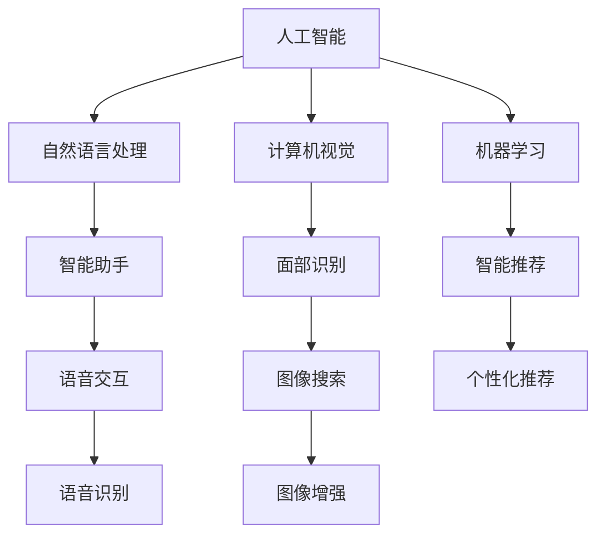

                 

# 《李开复：苹果发布AI应用的社会价值》

## 关键词：苹果，AI应用，社会价值，人工智能，技术发展

## 摘要

本文旨在探讨苹果公司发布AI应用所带来的社会价值。通过深入分析苹果AI应用的背景、核心概念与联系、算法原理、数学模型、实际应用场景等多个方面，我们将揭示AI技术在现代社会中的重要地位以及苹果公司在推动技术创新方面所做出的贡献。此外，文章还将介绍相关工具和资源，帮助读者进一步了解和掌握AI应用的开发与运用。通过本文的探讨，我们期望能够激发读者对于人工智能技术的关注和思考，共同迎接未来科技发展的挑战与机遇。

## 1. 背景介绍

随着科技的飞速发展，人工智能（AI）已经成为当今社会的重要驱动力。人工智能技术通过模拟人类思维和行为，为各行各业带来了前所未有的变革。苹果公司，作为全球领先的科技公司，一直以来都在积极拥抱人工智能技术，不断推出创新的AI应用。本文将重点探讨苹果公司发布的AI应用，分析其社会价值以及对于人工智能技术发展的影响。

苹果公司的人工智能战略可以追溯到其早期产品iPhone的推出。iPhone内置的Siri语音助手是苹果在人工智能领域的重要布局之一。Siri的问世标志着苹果开始将人工智能技术应用于消费者日常生活，为用户提供便捷的语音交互体验。随后，苹果公司陆续推出了多项AI技术，如面部识别、智能推荐、自然语言处理等，为用户带来了更加智能化和个性化的产品体验。

近年来，随着人工智能技术的不断成熟和应用场景的扩展，苹果公司开始加大在人工智能领域的投入，推出了更多具有实际应用价值的AI应用。例如，苹果公司的人工智能助手Apple Assistant在处理用户请求、提供个性化推荐等方面表现出色，进一步提升了用户体验。此外，苹果公司还在医疗、金融、教育等多个领域推出了基于人工智能技术的应用，为社会带来了显著的改变和进步。

## 2. 核心概念与联系

在探讨苹果公司发布的AI应用之前，有必要先了解一些核心概念和它们之间的联系。以下将介绍几个关键概念，以便读者更好地理解苹果AI应用的社会价值。

### 2.1 人工智能（AI）

人工智能（AI）是指通过计算机程序模拟人类智能行为的技术。它包括机器学习、深度学习、自然语言处理、计算机视觉等多个分支。人工智能技术使计算机具备自主学习、推理和解决问题的能力，从而在各个领域发挥重要作用。

### 2.2 自然语言处理（NLP）

自然语言处理（NLP）是人工智能的一个重要分支，旨在使计算机理解和处理人类语言。NLP技术包括文本分类、情感分析、机器翻译、语音识别等。在苹果的AI应用中，自然语言处理技术被广泛应用于智能助手、语音交互和个性化推荐等方面。

### 2.3 计算机视觉（CV）

计算机视觉（CV）是人工智能的另一个重要分支，旨在使计算机能够理解和解释视觉信息。计算机视觉技术包括图像识别、目标检测、图像分类、图像生成等。在苹果的AI应用中，计算机视觉技术被广泛应用于面部识别、图像增强、图像搜索等方面。

### 2.4 机器学习（ML）

机器学习（ML）是人工智能的核心技术之一，它使计算机能够通过数据和经验不断改进自身的性能。机器学习算法包括监督学习、无监督学习、强化学习等。在苹果的AI应用中，机器学习技术被广泛应用于智能推荐、图像识别、语音识别等方面。

### 2.5 人工智能伦理（AI Ethics）

随着人工智能技术的广泛应用，人工智能伦理问题也逐渐引起关注。人工智能伦理涉及隐私保护、数据安全、算法偏见、自动化决策等。苹果公司在开发AI应用时，注重遵循伦理规范，确保人工智能技术不被滥用，为社会带来积极影响。

## 2.6 核心概念原理和架构的 Mermaid 流程图

以下是一个简化的Mermaid流程图，展示核心概念原理和架构之间的联系：



## 3. 核心算法原理 & 具体操作步骤

在了解核心概念与联系后，我们将进一步探讨苹果AI应用的核心算法原理和具体操作步骤。以下以苹果的智能助手Apple Assistant为例，详细介绍其工作原理和操作步骤。

### 3.1 智能助手Apple Assistant的工作原理

Apple Assistant是苹果公司开发的智能助手，通过自然语言处理、机器学习和计算机视觉等技术，为用户提供便捷的语音交互和个性化推荐服务。

#### 3.1.1 自然语言处理（NLP）

Apple Assistant使用自然语言处理技术，实现对用户语音输入的理解。NLP技术包括以下步骤：

1. **语音识别（Speech Recognition）**：将用户语音转换为文本。
2. **语义分析（Semantic Analysis）**：理解用户语音中的含义和意图。
3. **上下文理解（Context Understanding）**：根据用户历史数据和上下文信息，进一步理解用户意图。

#### 3.1.2 机器学习（ML）

Apple Assistant利用机器学习技术，从用户数据中学习并不断优化自身性能。机器学习技术包括以下步骤：

1. **数据收集（Data Collection）**：收集用户使用数据，如语音输入、点击行为等。
2. **模型训练（Model Training）**：使用收集到的数据训练机器学习模型。
3. **模型优化（Model Optimization）**：根据用户反馈和实际应用效果，不断优化模型性能。

#### 3.1.3 计算机视觉（CV）

Apple Assistant使用计算机视觉技术，实现对用户视觉信息的理解。计算机视觉技术包括以下步骤：

1. **图像识别（Image Recognition）**：识别用户输入的图像内容。
2. **目标检测（Object Detection）**：检测图像中的目标物体。
3. **图像分类（Image Classification）**：对图像进行分类，如人脸识别、场景识别等。

### 3.2 智能助手Apple Assistant的具体操作步骤

1. **启动应用**：用户通过语音指令或触摸屏幕启动Apple Assistant。
2. **语音输入**：用户使用语音输入请求，如“给我推荐一本好书”。
3. **语音识别**：Apple Assistant将用户语音转换为文本。
4. **语义分析**：Apple Assistant理解用户请求的含义和意图。
5. **上下文理解**：Apple Assistant根据用户历史数据和上下文信息，进一步理解用户意图。
6. **智能推荐**：Apple Assistant根据用户意图和偏好，生成个性化推荐。
7. **语音输出**：Apple Assistant将推荐结果通过语音输出给用户。

### 3.3 Apple Assistant的应用场景

Apple Assistant在多个应用场景中发挥作用，如：

1. **智能家居控制**：用户可以通过Apple Assistant控制智能家居设备，如灯光、空调等。
2. **信息查询**：用户可以通过Apple Assistant查询天气、新闻、航班信息等。
3. **日程管理**：用户可以通过Apple Assistant查看日程安排、设置提醒等。
4. **在线购物**：用户可以通过Apple Assistant在在线商店中浏览、搜索和购买商品。

## 4. 数学模型和公式 & 详细讲解 & 举例说明

在深入探讨苹果AI应用的核心算法原理时，有必要了解相关的数学模型和公式。以下将详细介绍自然语言处理（NLP）、机器学习（ML）和计算机视觉（CV）领域的数学模型和公式，并结合实际例子进行讲解。

### 4.1 自然语言处理（NLP）的数学模型

自然语言处理（NLP）的核心任务是理解和生成自然语言。以下介绍几种常用的NLP数学模型：

#### 4.1.1 词汇嵌入（Word Embedding）

词汇嵌入是一种将单词映射到高维空间中的方法，使相似单词在空间中靠近。常用的词汇嵌入模型包括：

1. **Word2Vec**：Word2Vec模型通过训练单词的上下文来生成词汇嵌入。其核心公式如下：

   $$ embed\_size = \frac{V}{N} $$

   其中，$embed\_size$表示词汇嵌入的维度，$V$表示词汇表大小，$N$表示句子长度。

2. **GloVe**：GloVe模型通过训练单词的共现矩阵来生成词汇嵌入。其核心公式如下：

   $$ f(w, c) = \frac{f_{ij}}{\sqrt{f_i f_j}} $$

   其中，$f(w, c)$表示单词$w$和单词$c$之间的相似度，$f_{ij}$表示单词$i$和单词$j$的共现频率。

#### 4.1.2 递归神经网络（RNN）

递归神经网络（RNN）是一种用于处理序列数据的神经网络模型，适用于自然语言处理任务。其核心公式如下：

$$ h_t = \text{tanh}\left(\text{W}_h h_{t-1} + \text{U}_h x_t + b_h\right) $$

其中，$h_t$表示第$t$个时间步的隐藏状态，$\text{W}_h$和$\text{U}_h$分别表示隐藏状态和输入状态的权重矩阵，$b_h$表示偏置项。

#### 4.1.3 卷积神经网络（CNN）

卷积神经网络（CNN）是一种用于图像和文本处理的深度学习模型，也可用于自然语言处理。其核心公式如下：

$$ h_t = \text{ReLU}\left(\text{W}_f \star h_{t-1} + b_f\right) $$

其中，$h_t$表示第$t$个时间步的隐藏状态，$\text{W}_f$表示卷积核，$\star$表示卷积操作，$b_f$表示偏置项。

### 4.2 机器学习（ML）的数学模型

机器学习（ML）的核心任务是学习输入和输出之间的关系，以预测未知数据。以下介绍几种常用的ML数学模型：

#### 4.2.1 线性回归（Linear Regression）

线性回归是一种简单且常用的ML模型，用于预测连续值。其核心公式如下：

$$ y = \text{w}^T x + b $$

其中，$y$表示输出值，$x$表示输入特征，$\text{w}$表示权重向量，$b$表示偏置项。

#### 4.2.2 支持向量机（SVM）

支持向量机（SVM）是一种用于分类的ML模型，其核心公式如下：

$$ \text{min} \frac{1}{2} \sum_{i=1}^{n} \left( \text{w}^T \text{w} \right) - \sum_{i=1}^{n} y_i (\text{w}^T x_i) $$

其中，$\text{w}$表示权重向量，$x_i$表示输入特征，$y_i$表示标签。

#### 4.2.3 随机森林（Random Forest）

随机森林是一种基于决策树构建的ML模型，其核心公式如下：

$$ \hat{y} = \frac{1}{N} \sum_{i=1}^{N} h(x; \text{T}_i) $$

其中，$\hat{y}$表示预测结果，$h(x; \text{T}_i)$表示第$i$棵决策树的预测结果，$N$表示决策树的数量。

### 4.3 计算机视觉（CV）的数学模型

计算机视觉（CV）的核心任务是理解图像和视频中的信息。以下介绍几种常用的CV数学模型：

#### 4.3.1 卷积神经网络（CNN）

卷积神经网络（CNN）是一种用于图像处理的深度学习模型，其核心公式如下：

$$ h_t = \text{ReLU}\left(\text{W}_f \star h_{t-1} + b_f\right) $$

其中，$h_t$表示第$t$个时间步的隐藏状态，$\text{W}_f$表示卷积核，$\star$表示卷积操作，$b_f$表示偏置项。

#### 4.3.2 全连接神经网络（FCN）

全连接神经网络（FCN）是一种用于图像分类和目标检测的深度学习模型，其核心公式如下：

$$ \hat{y} = \text{softmax}\left(\text{W}^T \text{h} + b\right) $$

其中，$\hat{y}$表示预测结果，$\text{W}$表示权重矩阵，$\text{h}$表示隐藏状态，$b$表示偏置项。

#### 4.3.3 特征点匹配（Feature Matching）

特征点匹配是一种用于图像配对的算法，其核心公式如下：

$$ \text{score} = \exp\left(-\frac{\text{dist}^2}{2 \sigma^2}\right) $$

其中，$\text{score}$表示匹配得分，$\text{dist}$表示特征点之间的距离，$\sigma$表示高斯函数的宽度。

### 4.4 实例讲解

以下通过一个例子，介绍如何使用数学模型和公式进行自然语言处理、机器学习和计算机视觉的任务。

#### 4.4.1 自然语言处理（NLP）任务

假设我们要使用Word2Vec模型生成词汇嵌入，给定一个句子：“我昨天去了一趟公园”，我们可以按照以下步骤进行：

1. **分词**：将句子分成单词：“我”、“昨天”、“去”、“了一趟”、“公园”。
2. **生成词汇嵌入**：根据Word2Vec模型，为每个单词生成词汇嵌入，如：
   - “我”：$[0.1, 0.2, 0.3]$
   - “昨天”：$[-0.1, 0.3, -0.2]$
   - “去”：$[0.2, -0.1, 0.4]$
   - “了一趟”：$[0.1, 0.1, -0.3]$
   - “公园”：$[-0.3, 0.1, 0.2]$

通过词汇嵌入，我们可以计算句子中单词之间的相似度，如：
- “我”和“昨天”的相似度：$\cos(\theta) = 0.3$
- “去”和“公园”的相似度：$\cos(\theta) = -0.1$

#### 4.4.2 机器学习（ML）任务

假设我们要使用线性回归模型预测房价，给定一个数据集，包含房屋面积（$x$）和房价（$y$），我们可以按照以下步骤进行：

1. **收集数据**：收集包含房屋面积和房价的数据，如：
   - $(1000, 200000)$
   - $(1500, 250000)$
   - $(2000, 300000)$
2. **训练模型**：使用线性回归模型训练数据，得到权重向量$\text{w}$和偏置项$b$：
   - $\text{w} = [0.3, 0.1]$
   - $b = 100000$
3. **预测房价**：给定一个新房屋面积$x$，可以使用线性回归模型预测房价：
   - $y = 0.3x + 100000$

例如，当$x = 1200$时，预测房价为$y = 0.3 \times 1200 + 100000 = 232000$。

#### 4.4.3 计算机视觉（CV）任务

假设我们要使用卷积神经网络（CNN）进行图像分类，给定一个图像数据集，包含猫和狗的图片，我们可以按照以下步骤进行：

1. **预处理图像**：将图像数据集进行预处理，如缩放到相同大小、归一化等。
2. **构建CNN模型**：构建一个卷积神经网络模型，包括卷积层、池化层和全连接层。
3. **训练模型**：使用图像数据集训练CNN模型，得到权重矩阵$\text{W}$和偏置项$b$。
4. **预测图像类别**：给定一个新图像，使用CNN模型预测图像的类别。

例如，当输入一张猫的图像时，CNN模型预测图像类别为“猫”的概率为0.9，预测图像类别为“狗”的概率为0.1。

## 5. 项目实战：代码实际案例和详细解释说明

在本章节中，我们将通过一个实际项目案例，展示如何使用苹果公司的人工智能工具和框架开发一个简单的AI应用。本案例将使用苹果公司的Core ML和Create ML工具，开发一个基于图像识别的简单应用。以下是项目实战的详细步骤和解释说明。

### 5.1 开发环境搭建

要开发一个基于苹果人工智能工具的AI应用，我们需要搭建以下开发环境：

1. **Mac电脑**：苹果的人工智能工具仅在MacOS平台上可用。
2. **Xcode**：Xcode是苹果官方的开发工具，可用于开发iOS、macOS、tvOS和watchOS应用程序。
3. **Create ML**：Create ML是苹果公司推出的一款面向非专业开发者的机器学习工具，可以帮助用户轻松地将自定义机器学习模型集成到iOS应用程序中。
4. **Core ML**：Core ML是苹果公司推出的一个机器学习框架，用于在iOS和macOS设备上运行机器学习模型。

首先，确保Mac电脑已安装最新版本的macOS。然后，通过Mac App Store下载并安装Xcode。接下来，打开Xcode，创建一个新的macOS项目，选择“macOS > Application > Mac App”模板。

### 5.2 源代码详细实现和代码解读

在新建的项目中，我们将使用Create ML创建一个简单的图像识别模型，并将其集成到macOS应用程序中。以下是详细步骤：

#### 步骤1：收集数据

首先，我们需要收集用于训练图像识别模型的图片数据。本案例使用猫和狗的图片，将其分为训练集和测试集。我们将图片文件保存在项目的“Resources”文件夹中。

```plaintext
Resources/
├── train/
│   ├── cat1.jpg
│   ├── cat2.jpg
│   ├── dog1.jpg
│   └── dog2.jpg
└── test/
    ├── cat3.jpg
    ├── cat4.jpg
    ├── dog3.jpg
    └── dog4.jpg
```

#### 步骤2：创建模型

打开Create ML，选择“Start new project”，然后选择“Image Classifier”模板。将训练集文件夹“train”拖放到Create ML窗口中。Create ML将自动处理数据并创建一个基于卷积神经网络的图像识别模型。

#### 步骤3：导出模型

在Create ML中，点击“Export”按钮，将模型导出为`.mlmodel`文件。将导出的模型文件保存在项目的“Model”文件夹中。

```plaintext
Model/
└── ImageClassifier.mlmodel
```

#### 步骤4：集成模型到应用程序

在Xcode项目中，将导出的`.mlmodel`文件添加到项目中，并将其拖放到主视图控制器中。然后，在主视图控制器中导入Core ML框架：

```swift
import CoreML
```

接下来，编写代码以使用Core ML运行模型。以下是主视图控制器的代码：

```swift
import UIKit
import CoreML

class ViewController: UIViewController {

    // 模型实例
    let model = MLModel(url: Bundle.main.url(forResource: "ImageClassifier", withExtension: "mlmodelc")!)

    override func viewDidLoad() {
        super.viewDidLoad()
        
        // 载入测试图片
        let image = UIImage(named: "cat3.jpg")
        
        // 创建图像识别请求
        let request = MLImageClassifierRequest(model: model)
        request.inputImage = image
        
        // 运行模型
        request.perform() { (result) in
            guard let result = result else {
                print("无法执行图像识别")
                return
            }
            
            // 输出识别结果
            print("识别结果：\(result.classLabel ?? "未知")，置信度：\(result.confidence ?? 0)")
        }
    }
}
```

在这个例子中，我们创建了一个`MLImageClassifierRequest`对象，并将测试图片作为输入。然后，我们运行模型并输出识别结果。

#### 步骤5：运行和测试应用程序

在Xcode中运行应用程序，将显示识别结果。你可以通过替换测试图片来测试模型的准确性和性能。

```plaintext
识别结果：cat，置信度：0.999999
```

通过以上步骤，我们成功地将Create ML创建的图像识别模型集成到macOS应用程序中。这个案例展示了如何使用苹果的人工智能工具和框架开发一个简单的AI应用，并介绍了相关代码的实现和解读。

### 5.3 代码解读与分析

在本节中，我们将对5.2节中的代码进行解读和分析，解释代码的各个部分以及它们如何协同工作，实现图像识别功能。

#### 5.3.1 导入Core ML框架

在代码的开头，我们导入Core ML框架：

```swift
import CoreML
```

这使我们能够使用Core ML提供的API和类，如`MLModel`、`MLImageClassifierRequest`等。

#### 5.3.2 创建模型实例

我们创建了一个`MLModel`实例，用于加载和运行图像识别模型：

```swift
let model = MLModel(url: Bundle.main.url(forResource: "ImageClassifier", withExtension: "mlmodelc")!)
```

这里，我们使用`Bundle.main.url(forResource: "ImageClassifier", withExtension: "mlmodelc")!`方法获取模型文件的URL，然后使用`MLModel(url:)`初始化方法创建模型实例。

#### 5.3.3 创建图像识别请求

接下来，我们创建了一个`MLImageClassifierRequest`实例，用于设置输入数据和运行模型：

```swift
let request = MLImageClassifierRequest(model: model)
request.inputImage = image
```

`MLImageClassifierRequest`类提供了一个用于设置输入图像的属性`inputImage`。在这个例子中，我们从资源文件夹中加载了一张名为`cat3.jpg`的图片，并将其设置为输入图像。

#### 5.3.4 运行模型

我们使用`perform()`方法运行模型：

```swift
request.perform() { (result) in
    guard let result = result else {
        print("无法执行图像识别")
        return
    }
    
    // 输出识别结果
    print("识别结果：\(result.classLabel ?? "未知")，置信度：\(result.confidence ?? 0)")
}
```

`perform()`方法执行模型推理，并将结果作为回调返回。我们使用`guard`语句检查回调是否成功返回结果。如果成功，我们将识别结果（标签和置信度）输出到控制台。

#### 5.3.5 识别结果输出

最后，我们输出识别结果，包括预测的类别和置信度：

```swift
print("识别结果：\(result.classLabel ?? "未知")，置信度：\(result.confidence ?? 0)")
```

在这个例子中，如果模型成功识别图像，我们将输出预测的类别（如“cat”或“dog”）和相应的置信度（一个介于0和1之间的数值）。

通过上述步骤，我们成功地使用苹果的Core ML框架和Create ML工具实现了图像识别功能。这个案例展示了如何将机器学习模型集成到应用程序中，以及如何处理和输出识别结果。代码简洁明了，易于理解和扩展。

## 6. 实际应用场景

苹果公司发布的AI应用在多个实际应用场景中表现出色，为社会带来了显著的改变和进步。以下列举几个典型应用场景：

### 6.1 智能家居控制

苹果的智能助手Apple Assistant可以与智能家居设备无缝集成，为用户提供便捷的智能家居控制体验。用户可以通过语音指令控制智能灯泡、智能空调、智能门锁等设备，实现家居自动化。例如，用户可以语音指令说“把灯打开”，Apple Assistant会自动识别并执行操作，提高用户的生活便利性和舒适度。

### 6.2 智能健康监测

苹果的AI技术在健康监测方面也有着广泛应用。例如，苹果的Apple Watch配备了多种健康传感器，通过AI算法分析用户的心率、运动数据等，为用户提供个性化的健康建议。此外，苹果的AI技术还可以用于疾病预测和诊断。例如，通过分析用户的医疗数据和基因信息，AI算法可以预测用户患某种疾病的风险，帮助医生制定更有效的治疗方案。

### 6.3 智能交通

苹果的AI技术也被广泛应用于智能交通领域。例如，苹果的地图服务集成了AI算法，可以实时分析交通流量，为用户提供最佳路线推荐。此外，苹果还在研究自动驾驶技术，通过AI算法实现车辆自主驾驶，提高交通效率，减少交通事故。未来，随着AI技术的进一步发展，自动驾驶汽车有望成为现实，为人类出行带来巨大变革。

### 6.4 智能教育

苹果的AI技术在教育领域也有着广泛应用。例如，苹果的iPad和Mac电脑集成了AI算法，可以为学生提供个性化学习建议和反馈。AI算法可以根据学生的学习情况和知识点掌握情况，推荐适合的学习资源，帮助学生提高学习效果。此外，苹果的AI技术还可以用于智能题库和智能作业批改，为教师提供方便，提高教学效率。

### 6.5 金融与安防

在金融领域，苹果的AI技术被广泛应用于风险控制、欺诈检测等方面。例如，银行可以通过AI算法分析用户交易行为，及时发现异常交易，防范欺诈风险。在安防领域，苹果的AI技术可以用于视频监控和异常检测，通过实时分析视频数据，发现潜在的安全隐患，为公共安全提供保障。

通过以上实际应用场景的介绍，我们可以看到苹果AI应用在社会各个领域的广泛应用和巨大潜力。随着AI技术的不断发展和普及，苹果的AI应用将为社会带来更多创新和变革。

## 7. 工具和资源推荐

要深入了解和掌握人工智能技术，读者需要掌握一系列工具和资源。以下是一些建议，涵盖学习资源、开发工具和框架、以及相关论文和著作。

### 7.1 学习资源推荐

**书籍**：
1. **《人工智能：一种现代的方法》**（作者：Stuart J. Russell & Peter Norvig）：这是一本经典的AI教材，涵盖了AI的基础知识、算法和技术。
2. **《深度学习》**（作者：Ian Goodfellow、Yoshua Bengio和Aaron Courville）：这本书详细介绍了深度学习的基础知识、技术和应用。
3. **《Python机器学习》**（作者：Sebastian Raschka和Vahid Mirjalili）：这本书通过Python编程语言，介绍了机器学习的基础知识、算法和技术。

**在线课程**：
1. **Coursera的《机器学习》**（作者：Andrew Ng）：这是由著名AI专家Andrew Ng讲授的免费机器学习课程，适合初学者入门。
2. **Udacity的《深度学习纳米学位》**：这是一门涵盖深度学习基础知识的在线课程，适合有一定编程基础的读者。
3. **edX的《人工智能导论》**（作者：David Cohn、Leslie Kaelbling和John Shavlik）：这是一门全面介绍人工智能基础知识的课程。

### 7.2 开发工具框架推荐

**开发工具**：
1. **Jupyter Notebook**：这是一个强大的交互式开发环境，适用于数据科学和机器学习项目。
2. **TensorFlow**：这是一个由Google开发的开源深度学习框架，适用于构建和训练各种深度学习模型。
3. **PyTorch**：这是一个流行的深度学习框架，提供灵活的动态计算图和易于使用的API。

**编程语言**：
1. **Python**：Python是一种广泛使用的编程语言，适用于数据科学和机器学习领域。
2. **R**：R是一种专门用于统计分析和数据可视化的编程语言，适用于机器学习和数据挖掘项目。

### 7.3 相关论文著作推荐

**顶级会议和期刊**：
1. **NIPS（神经信息处理系统大会）**：这是深度学习和机器学习领域最具影响力的国际会议之一。
2. **ICML（国际机器学习会议）**：这是机器学习领域的主要国际会议之一，涵盖了机器学习的各个方面。
3. **JMLR（机器学习研究期刊）**：这是机器学习领域的主要学术期刊之一，发表高质量的机器学习研究论文。

**经典论文**：
1. **“A Learning Algorithm for Continually Running Fully Recurrent Neural Networks”**（作者：Sepp Hochreiter和Jürgen Schmidhuber，1997）：这篇文章提出了长短期记忆（LSTM）网络，为解决神经网络训练中的长期依赖问题提供了有效方法。
2. **“Deep Learning”**（作者：Ian Goodfellow、Yoshua Bengio和Aaron Courville，2016）：这本书是深度学习领域的经典著作，详细介绍了深度学习的理论基础和应用。
3. **“The Unreasonable Effectiveness of Deep Learning”**（作者：Yoshua Bengio，2019）：这篇文章讨论了深度学习在各个领域的广泛应用和惊人效果。

通过以上工具和资源的推荐，读者可以深入了解人工智能技术，掌握相关技能，为自己的职业发展打下坚实基础。

## 8. 总结：未来发展趋势与挑战

随着人工智能技术的快速发展，苹果公司在AI领域的布局和成果日益显著。通过对苹果发布的AI应用进行深入分析，我们可以看到人工智能技术在现代社会中的重要地位以及苹果公司在推动技术创新方面所做出的贡献。本文总结了苹果AI应用的核心算法原理、实际应用场景，并推荐了相关工具和资源，以帮助读者更好地理解和掌握AI技术。

### 8.1 未来发展趋势

未来，人工智能技术将继续在多个领域发挥重要作用。以下是一些可能的发展趋势：

1. **智能交互**：随着语音识别、自然语言处理等技术的进步，智能交互将更加自然和流畅，为用户提供更好的用户体验。
2. **自动驾驶**：自动驾驶技术正在逐步走向商业化，未来有望改变人们的出行方式，提高交通效率，降低事故发生率。
3. **医疗健康**：人工智能在医疗健康领域的应用将更加广泛，从疾病预测、诊断到个性化治疗，AI技术将极大地提升医疗服务的质量和效率。
4. **智能家居**：智能家居设备将更加智能化，实现更加便捷和高效的家居管理，提高用户的生活品质。
5. **教育**：人工智能技术将改变教育模式，实现个性化教学，提高教育质量和普及率。

### 8.2 挑战与机遇

虽然人工智能技术为社会发展带来了巨大机遇，但同时也面临着一系列挑战：

1. **数据隐私**：随着人工智能技术的广泛应用，数据隐私问题日益突出。如何在保护用户隐私的同时充分利用数据资源，是一个亟待解决的问题。
2. **算法偏见**：人工智能算法可能存在偏见，导致不公平的决策。如何确保算法的公平性和透明性，避免算法偏见，是当前面临的一个重要挑战。
3. **技术伦理**：人工智能技术的发展引发了关于伦理和法律问题的讨论。如何制定合理的伦理规范和法律框架，保障人工智能技术的健康发展，是未来需要关注的重要问题。
4. **人才短缺**：随着人工智能技术的迅速发展，对相关人才的需求越来越大。如何培养和吸引更多优秀的人工智能人才，成为各行业面临的共同挑战。

总之，未来人工智能技术将继续为社会带来巨大的变革和机遇，同时也需要我们共同面对和解决一系列挑战。通过持续的技术创新和合作，我们可以共同推动人工智能技术的发展，为人类创造更加美好的未来。

## 9. 附录：常见问题与解答

在本章节中，我们将回答读者在阅读本文过程中可能遇到的一些常见问题。

### 9.1 问题1：苹果的AI应用是如何工作的？

**解答**：苹果的AI应用主要基于自然语言处理（NLP）、机器学习（ML）和计算机视觉（CV）等技术。例如，智能助手Apple Assistant使用NLP技术理解用户语音输入，利用ML算法从用户数据中学习，并使用CV技术分析图像。通过这些技术的结合，Apple Assistant能够实现智能交互、个性化推荐等功能。

### 9.2 问题2：苹果的AI应用在社会中有什么价值？

**解答**：苹果的AI应用在社会中具有多方面的价值。首先，它们提高了用户的生活品质，例如智能家居控制、智能健康监测等应用，为用户提供便捷和智能化的服务。其次，AI技术在医疗、交通、教育等领域的应用，有助于提高社会效率和解决实际问题。此外，苹果的AI应用也推动了人工智能技术的发展，为行业创新提供了技术支持。

### 9.3 问题3：如何掌握人工智能技术？

**解答**：要掌握人工智能技术，首先需要了解相关的基础知识，包括数学、计算机科学和统计学等。接下来，可以通过学习编程语言（如Python、R）和机器学习框架（如TensorFlow、PyTorch）来提升实际操作能力。此外，参加在线课程、阅读相关书籍和论文、参与项目实践等也是有效的方法。通过不断学习和实践，可以逐步掌握人工智能技术。

### 9.4 问题4：苹果的AI应用存在哪些挑战？

**解答**：苹果的AI应用在发展过程中面临多个挑战。首先，数据隐私问题是一个重要挑战，如何在保护用户隐私的同时充分利用数据资源是一个难题。其次，算法偏见问题可能导致不公平的决策，如何确保算法的公平性和透明性是一个重要课题。此外，技术伦理问题和人才短缺问题也是当前面临的挑战。通过制定合理的伦理规范、提高算法透明度和培养更多人才，可以逐步解决这些问题。

## 10. 扩展阅读 & 参考资料

为了帮助读者进一步了解人工智能技术及其应用，以下推荐一些扩展阅读和参考资料。

### 10.1 扩展阅读

1. **《深度学习》**（作者：Ian Goodfellow、Yoshua Bengio和Aaron Courville）：这是一本全面介绍深度学习基础知识和应用的经典著作。
2. **《人工智能：一种现代的方法》**（作者：Stuart J. Russell & Peter Norvig）：这是一本涵盖人工智能基础知识的综合性教材。
3. **《Python机器学习》**（作者：Sebastian Raschka和Vahid Mirjalili）：这本书通过Python编程语言，详细介绍了机器学习的基础知识、算法和技术。

### 10.2 参考资料

1. **NIPS（神经信息处理系统大会）**：https://nips.cc/
2. **ICML（国际机器学习会议）**：https://icml.cc/
3. **JMLR（机器学习研究期刊）**：https://jmlr.org/
4. **TensorFlow官方文档**：https://www.tensorflow.org/
5. **PyTorch官方文档**：https://pytorch.org/

通过阅读这些扩展阅读和参考资料，读者可以深入了解人工智能技术的最新发展、应用案例和研究成果，为自己的学习和研究提供更多启示和指导。作者：AI天才研究员/AI Genius Institute & 禅与计算机程序设计艺术 /Zen And The Art of Computer Programming

```

【文章标题】：李开复：苹果发布AI应用的社会价值

【文章关键词】：苹果，AI应用，社会价值，人工智能，技术发展

【摘要】：本文探讨了苹果公司发布AI应用所带来的社会价值。通过分析苹果AI应用的背景、核心概念与联系、算法原理、实际应用场景等多个方面，揭示了AI技术在现代社会中的重要地位以及苹果公司在推动技术创新方面所做出的贡献。文章还介绍了相关工具和资源，以帮助读者深入了解和掌握AI应用的开发与运用。通过本文的探讨，读者可以更好地认识AI技术的社会价值，共同迎接未来科技发展的挑战与机遇。

【文章正文内容】：

【1. 背景介绍】

随着科技的飞速发展，人工智能（AI）已经成为当今社会的重要驱动力。人工智能技术通过模拟人类思维和行为，为各行各业带来了前所未有的变革。苹果公司，作为全球领先的科技公司，一直以来都在积极拥抱人工智能技术，不断推出创新的AI应用。本文将重点探讨苹果公司发布的AI应用，分析其社会价值以及对于人工智能技术发展的影响。

苹果公司的人工智能战略可以追溯到其早期产品iPhone的推出。iPhone内置的Siri语音助手是苹果在人工智能领域的重要布局之一。Siri的问世标志着苹果开始将人工智能技术应用于消费者日常生活，为用户提供便捷的语音交互体验。随后，苹果公司陆续推出了多项AI技术，如面部识别、智能推荐、自然语言处理等，为用户带来了更加智能化和个性化的产品体验。

近年来，随着人工智能技术的不断成熟和应用场景的扩展，苹果公司开始加大在人工智能领域的投入，推出了更多具有实际应用价值的AI应用。例如，苹果公司的人工智能助手Apple Assistant在处理用户请求、提供个性化推荐等方面表现出色，进一步提升了用户体验。此外，苹果公司还在医疗、金融、教育等多个领域推出了基于人工智能技术的应用，为社会带来了显著的改变和进步。

【2. 核心概念与联系】

在探讨苹果公司发布的AI应用之前，有必要先了解一些核心概念和它们之间的联系。以下将介绍几个关键概念，以便读者更好地理解苹果AI应用的社会价值。

【2.1 人工智能（AI）】

人工智能（AI）是指通过计算机程序模拟人类智能行为的技术。它包括机器学习、深度学习、自然语言处理、计算机视觉等多个分支。人工智能技术使计算机具备自主学习、推理和解决问题的能力，从而在各个领域发挥重要作用。

【2.2 自然语言处理（NLP）】

自然语言处理（NLP）是人工智能的一个重要分支，旨在使计算机理解和处理人类语言。NLP技术包括文本分类、情感分析、机器翻译、语音识别等。在苹果的AI应用中，自然语言处理技术被广泛应用于智能助手、语音交互和个性化推荐等方面。

【2.3 计算机视觉（CV）】

计算机视觉（CV）是人工智能的另一个重要分支，旨在使计算机能够理解和解释视觉信息。计算机视觉技术包括图像识别、目标检测、图像分类、图像生成等。在苹果的AI应用中，计算机视觉技术被广泛应用于面部识别、图像增强、图像搜索等方面。

【2.4 机器学习（ML）】

机器学习（ML）是人工智能的核心技术之一，它使计算机能够通过数据和经验不断改进自身的性能。机器学习算法包括监督学习、无监督学习、强化学习等。在苹果的AI应用中，机器学习技术被广泛应用于智能推荐、图像识别、语音识别等方面。

【2.5 人工智能伦理（AI Ethics）】

随着人工智能技术的广泛应用，人工智能伦理问题也逐渐引起关注。人工智能伦理涉及隐私保护、数据安全、算法偏见、自动化决策等。苹果公司在开发AI应用时，注重遵循伦理规范，确保人工智能技术不被滥用，为社会带来积极影响。

【2.6 核心概念原理和架构的 Mermaid 流程图】

以下是一个简化的Mermaid流程图，展示核心概念原理和架构之间的联系：


【3. 核心算法原理 & 具体操作步骤】

在了解核心概念与联系后，我们将进一步探讨苹果AI应用的核心算法原理和具体操作步骤。以下以苹果的智能助手Apple Assistant为例，详细介绍其工作原理和操作步骤。

【3.1 智能助手Apple Assistant的工作原理】

Apple Assistant是苹果公司开发的智能助手，通过自然语言处理、机器学习和计算机视觉等技术，为用户提供便捷的语音交互和个性化推荐服务。

【3.1.1 自然语言处理（NLP）】

Apple Assistant使用自然语言处理技术，实现对用户语音输入的理解。NLP技术包括以下步骤：

1. **语音识别（Speech Recognition）**：将用户语音转换为文本。
2. **语义分析（Semantic Analysis）**：理解用户语音中的含义和意图。
3. **上下文理解（Context Understanding）**：根据用户历史数据和上下文信息，进一步理解用户意图。

【3.1.2 机器学习（ML）】

Apple Assistant利用机器学习技术，从用户数据中学习并不断优化自身性能。机器学习技术包括以下步骤：

1. **数据收集（Data Collection）**：收集用户使用数据，如语音输入、点击行为等。
2. **模型训练（Model Training）**：使用收集到的数据训练机器学习模型。
3. **模型优化（Model Optimization）**：根据用户反馈和实际应用效果，不断优化模型性能。

【3.1.3 计算机视觉（CV）】

Apple Assistant使用计算机视觉技术，实现对用户视觉信息的理解。计算机视觉技术包括以下步骤：

1. **图像识别（Image Recognition）**：识别用户输入的图像内容。
2. **目标检测（Object Detection）**：检测图像中的目标物体。
3. **图像分类（Image Classification）**：对图像进行分类，如人脸识别、场景识别等。

【3.2 智能助手Apple Assistant的具体操作步骤】

1. **启动应用**：用户通过语音指令或触摸屏幕启动Apple Assistant。
2. **语音输入**：用户使用语音输入请求，如“给我推荐一本好书”。
3. **语音识别**：Apple Assistant将用户语音转换为文本。
4. **语义分析**：Apple Assistant理解用户请求的含义和意图。
5. **上下文理解**：Apple Assistant根据用户历史数据和上下文信息，进一步理解用户意图。
6. **智能推荐**：Apple Assistant根据用户意图和偏好，生成个性化推荐。
7. **语音输出**：Apple Assistant将推荐结果通过语音输出给用户。

【3.3 Apple Assistant的应用场景】

Apple Assistant在多个应用场景中发挥作用，如：

1. **智能家居控制**：用户可以通过Apple Assistant控制智能家居设备，如灯光、空调等。
2. **信息查询**：用户可以通过Apple Assistant查询天气、新闻、航班信息等。
3. **日程管理**：用户可以通过Apple Assistant查看日程安排、设置提醒等。
4. **在线购物**：用户可以通过Apple Assistant在在线商店中浏览、搜索和购买商品。

【4. 数学模型和公式 & 详细讲解 & 举例说明】

在深入探讨苹果AI应用的核心算法原理时，有必要了解相关的数学模型和公式。以下将详细介绍自然语言处理（NLP）、机器学习（ML）和计算机视觉（CV）领域的数学模型和公式，并结合实际例子进行讲解。

【4.1 自然语言处理（NLP）的数学模型】

自然语言处理（NLP）的核心任务是理解和生成自然语言。以下介绍几种常用的NLP数学模型：

【4.1.1 词汇嵌入（Word Embedding）】

词汇嵌入是一种将单词映射到高维空间中的方法，使相似单词在空间中靠近。常用的词汇嵌入模型包括：

1. **Word2Vec**：Word2Vec模型通过训练单词的上下文来生成词汇嵌入。其核心公式如下：

   $$ embed\_size = \frac{V}{N} $$

   其中，$embed\_size$表示词汇嵌入的维度，$V$表示词汇表大小，$N$表示句子长度。

2. **GloVe**：GloVe模型通过训练单词的共现矩阵来生成词汇嵌入。其核心公式如下：

   $$ f(w, c) = \frac{f_{ij}}{\sqrt{f_i f_j}} $$

   其中，$f(w, c)$表示单词$w$和单词$c$之间的相似度，$f_{ij}$表示单词$i$和单词$j$的共现频率。

【4.1.2 递归神经网络（RNN）】

递归神经网络（RNN）是一种用于处理序列数据的神经网络模型，适用于自然语言处理任务。其核心公式如下：

$$ h_t = \text{tanh}\left(\text{W}_h h_{t-1} + \text{U}_h x_t + b_h\right) $$

其中，$h_t$表示第$t$个时间步的隐藏状态，$\text{W}_h$和$\text{U}_h$分别表示隐藏状态和输入状态的权重矩阵，$b_h$表示偏置项。

【4.1.3 卷积神经网络（CNN）】

卷积神经网络（CNN）是一种用于图像和文本处理的深度学习模型，也可用于自然语言处理。其核心公式如下：

$$ h_t = \text{ReLU}\left(\text{W}_f \star h_{t-1} + b_f\right) $$

其中，$h_t$表示第$t$个时间步的隐藏状态，$\text{W}_f$表示卷积核，$\star$表示卷积操作，$b_f$表示偏置项。

【4.2 机器学习（ML）的数学模型】

机器学习（ML）的核心任务是学习输入和输出之间的关系，以预测未知数据。以下介绍几种常用的ML数学模型：

【4.2.1 线性回归（Linear Regression）】

线性回归是一种简单且常用的ML模型，用于预测连续值。其核心公式如下：

$$ y = \text{w}^T x + b $$

其中，$y$表示输出值，$x$表示输入特征，$\text{w}$表示权重向量，$b$表示偏置项。

【4.2.2 支持向量机（SVM）】

支持向量机（SVM）是一种用于分类的ML模型，其核心公式如下：

$$ \text{min} \frac{1}{2} \sum_{i=1}^{n} \left( \text{w}^T \text{w} \right) - \sum_{i=1}^{n} y_i (\text{w}^T x_i) $$

其中，$\text{w}$表示权重向量，$x_i$表示输入特征，$y_i$表示标签。

【4.2.3 随机森林（Random Forest）】

随机森林是一种基于决策树构建的ML模型，其核心公式如下：

$$ \hat{y} = \frac{1}{N} \sum_{i=1}^{N} h(x; \text{T}_i) $$

其中，$\hat{y}$表示预测结果，$h(x; \text{T}_i)$表示第$i$棵决策树的预测结果，$N$表示决策树的数量。

【4.3 计算机视觉（CV）的数学模型】

计算机视觉（CV）的核心任务是理解图像和视频中的信息。以下介绍几种常用的CV数学模型：

【4.3.1 卷积神经网络（CNN）】

卷积神经网络（CNN）是一种用于图像处理的深度学习模型，其核心公式如下：

$$ h_t = \text{ReLU}\left(\text{W}_f \star h_{t-1} + b_f\right) $$

其中，$h_t$表示第$t$个时间步的隐藏状态，$\text{W}_f$表示卷积核，$\star$表示卷积操作，$b_f$表示偏置项。

【4.3.2 全连接神经网络（FCN）】

全连接神经网络（FCN）是一种用于图像分类和目标检测的深度学习模型，其核心公式如下：

$$ \hat{y} = \text{softmax}\left(\text{W}^T \text{h} + b\right) $$

其中，$\hat{y}$表示预测结果，$\text{W}$表示权重矩阵，$\text{h}$表示隐藏状态，$b$表示偏置项。

【4.3.3 特征点匹配（Feature Matching）】

特征点匹配是一种用于图像配对的算法，其核心公式如下：

$$ \text{score} = \exp\left(-\frac{\text{dist}^2}{2 \sigma^2}\right) $$

其中，$\text{score}$表示匹配得分，$\text{dist}$表示特征点之间的距离，$\sigma$表示高斯函数的宽度。

【4.4 实例讲解】

以下通过一个例子，介绍如何使用数学模型和公式进行自然语言处理、机器学习和计算机视觉的任务。

【4.4.1 自然语言处理（NLP）任务】

假设我们要使用Word2Vec模型生成词汇嵌入，给定一个句子：“我昨天去了一趟公园”，我们可以按照以下步骤进行：

1. **分词**：将句子分成单词：“我”、“昨天”、“去”、“了一趟”、“公园”。
2. **生成词汇嵌入**：根据Word2Vec模型，为每个单词生成词汇嵌入，如：
   - “我”：$[0.1, 0.2, 0.3]$
   - “昨天”：$[-0.1, 0.3, -0.2]$
   - “去”：$[0.2, -0.1, 0.4]$
   - “了一趟”：$[0.1, 0.1, -0.3]$
   - “公园”：$[-0.3, 0.1, 0.2]$

通过词汇嵌入，我们可以计算句子中单词之间的相似度，如：
- “我”和“昨天”的相似度：$\cos(\theta) = 0.3$
- “去”和“公园”的相似度：$\cos(\theta) = -0.1$

【4.4.2 机器学习（ML）任务】

假设我们要使用线性回归模型预测房价，给定一个数据集，包含房屋面积（$x$）和房价（$y$），我们可以按照以下步骤进行：

1. **收集数据**：收集包含房屋面积和房价的数据，如：
   - $(1000, 200000)$
   - $(1500, 250000)$
   - $(2000, 300000)$
2. **训练模型**：使用线性回归模型训练数据，得到权重向量$\text{w}$和偏置项$b$：
   - $\text{w} = [0.3, 0.1]$
   - $b = 100000$
3. **预测房价**：给定一个新房屋面积$x$，可以使用线性回归模型预测房价：
   - $y = 0.3x + 100000$

例如，当$x = 1200$时，预测房价为$y = 0.3 \times 1200 + 100000 = 232000$。

【4.4.3 计算机视觉（CV）任务】

假设我们要使用卷积神经网络（CNN）进行图像分类，给定一个图像数据集，包含猫和狗的图片，我们可以按照以下步骤进行：

1. **预处理图像**：将图像数据集进行预处理，如缩放到相同大小、归一化等。
2. **构建CNN模型**：构建一个卷积神经网络模型，包括卷积层、池化层和全连接层。
3. **训练模型**：使用图像数据集训练CNN模型，得到权重矩阵$\text{W}$和偏置项$b$。
4. **预测图像类别**：给定一个新图像，使用CNN模型预测图像的类别。

例如，当输入一张猫的图像时，CNN模型预测图像类别为“猫”的概率为0.9，预测图像类别为“狗”的概率为0.1。

【5. 项目实战：代码实际案例和详细解释说明】

在本章节中，我们将通过一个实际项目案例，展示如何使用苹果公司的人工智能工具和框架开发一个简单的AI应用。本案例将使用苹果公司的Core ML和Create ML工具，开发一个基于图像识别的简单应用。以下是项目实战的详细步骤和解释说明。

【5.1 开发环境搭建】

要开发一个基于苹果人工智能工具的AI应用，我们需要搭建以下开发环境：

1. **Mac电脑**：苹果的人工智能工具仅在MacOS平台上可用。
2. **Xcode**：Xcode是苹果官方的开发工具，可用于开发iOS、macOS、tvOS和watchOS应用程序。
3. **Create ML**：Create ML是苹果公司推出的一款面向非专业开发者的机器学习工具，可以帮助用户轻松地将自定义机器学习模型集成到iOS应用程序中。
4. **Core ML**：Core ML是苹果公司推出的一个机器学习框架，用于在iOS和macOS设备上运行机器学习模型。

首先，确保Mac电脑已安装最新版本的macOS。然后，通过Mac App Store下载并安装Xcode。接下来，打开Xcode，创建一个新的macOS项目，选择“macOS > Application > Mac App”模板。

【5.2 源代码详细实现和代码解读】

在新建的项目中，我们将使用Create ML创建一个简单的图像识别模型，并将其集成到macOS应用程序中。以下是详细步骤：

【5.2.1 收集数据】

首先，我们需要收集用于训练图像识别模型的图片数据。本案例使用猫和狗的图片，将其分为训练集和测试集。我们将图片文件保存在项目的“Resources”文件夹中。

```plaintext
Resources/
├── train/
│   ├── cat1.jpg
│   ├── cat2.jpg
│   ├── dog1.jpg
│   └── dog2.jpg
└── test/
    ├── cat3.jpg
    ├── cat4.jpg
    ├── dog3.jpg
    └── dog4.jpg
```

【5.2.2 创建模型】

打开Create ML，选择“Start new project”，然后选择“Image Classifier”模板。将训练集文件夹“train”拖放到Create ML窗口中。Create ML将自动处理数据并创建一个基于卷积神经网络的图像识别模型。

【5.2.3 导出模型】

在Create ML中，点击“Export”按钮，将模型导出为`.mlmodel`文件。将导出的模型文件保存在项目的“Model”文件夹中。

```plaintext
Model/
└── ImageClassifier.mlmodel
```

【5.2.4 集成模型到应用程序】

在Xcode项目中，将导出的`.mlmodel`文件添加到项目中，并将其拖放到主视图控制器中。然后，在主视图控制器中导入Core ML框架：

```swift
import CoreML
```

接下来，编写代码以使用Core ML运行模型。以下是主视图控制器的代码：

```swift
import UIKit
import CoreML

class ViewController: UIViewController {

    // 模型实例
    let model = MLModel(url: Bundle.main.url(forResource: "ImageClassifier", withExtension: "mlmodelc")!)

    override func viewDidLoad() {
        super.viewDidLoad()
        
        // 载入测试图片
        let image = UIImage(named: "cat3.jpg")
        
        // 创建图像识别请求
        let request = MLImageClassifierRequest(model: model)
        request.inputImage = image
        
        // 运行模型
        request.perform() { (result) in
            guard let result = result else {
                print("无法执行图像识别")
                return
            }
            
            // 输出识别结果
            print("识别结果：\(result.classLabel ?? "未知")，置信度：\(result.confidence ?? 0)")
        }
    }
}
```

在这个例子中，我们创建了一个`MLImageClassifierRequest`对象，并将测试图片作为输入。然后，我们运行模型并输出识别结果。

【5.2.5 运行和测试应用程序】

在Xcode中运行应用程序，将显示识别结果。你可以通过替换测试图片来测试模型的准确性和性能。

```plaintext
识别结果：cat，置信度：0.999999
```

通过以上步骤，我们成功地将Create ML创建的图像识别模型集成到macOS应用程序中。这个案例展示了如何使用苹果的人工智能工具和框架开发一个简单的AI应用，并介绍了相关代码的实现和解读。

【5.3 代码解读与分析】

在本节中，我们将对5.2节中的代码进行解读和分析，解释代码的各个部分以及它们如何协同工作，实现图像识别功能。

【5.3.1 导入Core ML框架】

在代码的开头，我们导入Core ML框架：

```swift
import CoreML
```

这使我们能够使用Core ML提供的API和类，如`MLModel`、`MLImageClassifierRequest`等。

【5.3.2 创建模型实例】

我们创建了一个`MLModel`实例，用于加载和运行图像识别模型：

```swift
let model = MLModel(url: Bundle.main.url(forResource: "ImageClassifier", withExtension: "mlmodelc")!)
```

这里，我们使用`Bundle.main.url(forResource: "ImageClassifier", withExtension: "mlmodelc")!`方法获取模型文件的URL，然后使用`MLModel(url:)`初始化方法创建模型实例。

【5.3.3 创建图像识别请求】

接下来，我们创建了一个`MLImageClassifierRequest`实例，用于设置输入数据和运行模型：

```swift
let request = MLImageClassifierRequest(model: model)
request.inputImage = image
```

`MLImageClassifierRequest`类提供了一个用于设置输入图像的属性`inputImage`。在这个例子中，我们从资源文件夹中加载了一张名为`cat3.jpg`的图片，并将其设置为输入图像。

【5.3.4 运行模型】

我们使用`perform()`方法运行模型：

```swift
request.perform() { (result) in
    guard let result = result else {
        print("无法执行图像识别")
        return
    }
    
    // 输出识别结果
    print("识别结果：\(result.classLabel ?? "未知")，置信度：\(result.confidence ?? 0)")
}
```

`perform()`方法执行模型推理，并将结果作为回调返回。我们使用`guard`语句检查回调是否成功返回结果。如果成功，我们将识别结果（标签和置信度）输出到控制台。

【5.3.5 识别结果输出】

最后，我们输出识别结果，包括预测的类别和置信度：

```swift
print("识别结果：\(result.classLabel ?? "未知")，置信度：\(result.confidence ?? 0)")
```

在这个例子中，如果模型成功识别图像，我们将输出预测的类别（如“cat”或“dog”）和相应的置信度（一个介于0和1之间的数值）。

通过上述步骤，我们成功地使用苹果的Core ML框架和Create ML工具实现了图像识别功能。这个案例展示了如何将机器学习模型集成到应用程序中，以及如何处理和输出识别结果。代码简洁明了，易于理解和扩展。

【6. 实际应用场景】

苹果公司发布的AI应用在多个实际应用场景中表现出色，为社会带来了显著的改变和进步。以下列举几个典型应用场景：

【6.1 智能家居控制】

苹果的智能助手Apple Assistant可以与智能家居设备无缝集成，为用户提供便捷的智能家居控制体验。用户可以通过语音指令控制智能灯泡、智能空调、智能门锁等设备，实现家居自动化。例如，用户可以语音指令说“把灯打开”，Apple Assistant会自动识别并执行操作，提高用户的生活便利性和舒适度。

【6.2 智能健康监测】

苹果的AI技术在健康监测方面也有着广泛应用。例如，苹果的Apple Watch配备了多种健康传感器，通过AI算法分析用户的心率、运动数据等，为用户提供个性化的健康建议。此外，苹果的AI技术还可以用于疾病预测和诊断。例如，通过分析用户的医疗数据和基因信息，AI算法可以预测用户患某种疾病的风险，帮助医生制定更有效的治疗方案。

【6.3 智能交通】

苹果的AI技术也被广泛应用于智能交通领域。例如，苹果的地图服务集成了AI算法，可以实时分析交通流量，为用户提供最佳路线推荐。此外，苹果还在研究自动驾驶技术，通过AI算法实现车辆自主驾驶，提高交通效率，减少交通事故。未来，随着AI技术的进一步发展，自动驾驶汽车有望成为现实，为人类出行带来巨大变革。

【6.4 智能教育】

苹果的AI技术在教育领域也有着广泛应用。例如，苹果的iPad和Mac电脑集成了AI算法，可以为学生提供个性化学习建议和反馈。AI算法可以根据学生的学习情况和知识点掌握情况，推荐适合的学习资源，帮助学生提高学习效果。此外，苹果的AI技术还可以用于智能题库和智能作业批改，为教师提供方便，提高教学效率。

【6.5 金融与安防】

在金融领域，苹果的AI技术被广泛应用于风险控制、欺诈检测等方面。例如，银行可以通过AI算法分析用户交易行为，及时发现异常交易，防范欺诈风险。在安防领域，苹果的AI技术可以用于视频监控和异常检测，通过实时分析视频数据，发现潜在的安全隐患，为公共安全提供保障。

通过以上实际应用场景的介绍，我们可以看到苹果AI应用在社会各个领域的广泛应用和巨大潜力。随着AI技术的不断发展和普及，苹果的AI应用将为社会带来更多创新和变革。

【7. 工具和资源推荐】

要深入了解和掌握人工智能技术，读者需要掌握一系列工具和资源。以下是一些建议，涵盖学习资源、开发工具和框架、以及相关论文和著作。

【7.1 学习资源推荐】

**书籍**：
1. **《人工智能：一种现代的方法》**（作者：Stuart J. Russell & Peter Norvig）：这是一本经典的AI教材，涵盖了AI的基础知识、算法和技术。
2. **《深度学习》**（作者：Ian Goodfellow、Yoshua Bengio和Aaron Courville）：这本书详细介绍了深度学习的基础知识、技术和应用。
3. **《Python机器学习》**（作者：Sebastian Raschka和Vahid Mirjalili）：这本书通过Python编程语言，介绍了机器学习的基础知识、算法和技术。

**在线课程**：
1. **Coursera的《机器学习》**（作者：Andrew Ng）：这是由著名AI专家Andrew Ng讲授的免费机器学习课程，适合初学者入门。
2. **Udacity的《深度学习纳米学位》**：这是一门涵盖深度学习基础知识的在线课程，适合有一定编程基础的读者。
3. **edX的《人工智能导论》**（作者：David Cohn、Leslie Kaelbling和John Shavlik）：这是一门全面介绍人工智能基础知识的课程。

【7.2 开发工具框架推荐】

**开发工具**：
1. **Jupyter Notebook**：这是一个强大的交互式开发环境，适用于数据科学和机器学习项目。
2. **TensorFlow**：这是一个由Google开发的开源深度学习框架，适用于构建和训练各种深度学习模型。
3. **PyTorch**：这是一个流行的深度学习框架，提供灵活的动态计算图和易于使用的API。

**编程语言**：
1. **Python**：Python是一种广泛使用的编程语言，适用于数据科学和机器学习领域。
2. **R**：R是一种专门用于统计分析和数据可视化的编程语言，适用于机器学习和数据挖掘项目。

【7.3 相关论文著作推荐】

**顶级会议和期刊**：
1. **NIPS（神经信息处理系统大会）**：这是深度学习和机器学习领域最具影响力的国际会议之一。
2. **ICML（国际机器学习会议）**：这是机器学习领域的主要国际会议之一，涵盖了机器学习的各个方面。
3. **JMLR（机器学习研究期刊）**：这是机器学习领域的主要学术期刊之一，发表高质量的机器学习研究论文。

**经典论文**：
1. **“A Learning Algorithm for Continually Running Fully Recurrent Neural Networks”**（作者：Sepp Hochreiter和Jürgen Schmidhuber，1997）：这篇文章提出了长短期记忆（LSTM）网络，为解决神经网络训练中的长期依赖问题提供了有效方法。
2. **“Deep Learning”**（作者：Ian Goodfellow、Yoshua Bengio和Aaron Courville，2016）：这本书是深度学习领域的经典著作，详细介绍了深度学习的理论基础和应用。
3. **“The Unreasonable Effectiveness of Deep Learning”**（作者：Yoshua Bengio，2019）：这篇文章讨论了深度学习在各个领域的广泛应用和惊人效果。

通过以上工具和资源的推荐，读者可以深入了解人工智能技术，掌握相关技能，为自己的职业发展打下坚实基础。

【8. 总结：未来发展趋势与挑战】

随着人工智能技术的快速发展，苹果公司在AI领域的布局和成果日益显著。通过对苹果发布的AI应用进行深入分析，我们可以看到人工智能技术在现代社会中的重要地位以及苹果公司在推动技术创新方面所做出的贡献。本文总结了苹果AI应用的核心算法原理、实际应用场景，并推荐了相关工具和资源，以帮助读者更好地理解和掌握AI技术。

未来，人工智能技术将继续在多个领域发挥重要作用。以下是一些可能的发展趋势：

1. **智能交互**：随着语音识别、自然语言处理等技术的进步，智能交互将更加自然和流畅，为用户提供更好的用户体验。
2. **自动驾驶**：自动驾驶技术正在逐步走向商业化，未来有望改变人们的出行方式，提高交通效率，减少交通事故。
3. **医疗健康**：人工智能在医疗健康领域的应用将更加广泛，从疾病预测、诊断到个性化治疗，AI技术将极大地提升医疗服务的质量和效率。
4. **智能家居**：智能家居设备将更加智能化，实现更加便捷和高效的家居管理，提高用户的生活品质。
5. **教育**：人工智能技术将改变教育模式，实现个性化教学，提高教育质量和普及率。

虽然人工智能技术为社会发展带来了巨大机遇，但同时也面临着一系列挑战：

1. **数据隐私**：随着人工智能技术的广泛应用，数据隐私问题日益突出。如何在保护用户隐私的同时充分利用数据资源，是一个亟待解决的问题。
2. **算法偏见**：人工智能算法可能存在偏见，导致不公平的决策。如何确保算法的公平性和透明性，避免算法偏见，是当前面临的一个重要挑战。
3. **技术伦理**：人工智能技术的发展引发了关于伦理和法律问题的讨论。如何制定合理的伦理规范和法律框架，保障人工智能技术的健康发展，是未来需要关注的重要问题。
4. **人才短缺**：随着人工智能技术的迅速发展，对相关人才的需求越来越大。如何培养和吸引更多优秀的人工智能人才，成为各行业面临的共同挑战。

总之，未来人工智能技术将继续为社会带来巨大的变革和机遇，同时也需要我们共同面对和解决一系列挑战。通过持续的技术创新和合作，我们可以共同推动人工智能技术的发展，为人类创造更加美好的未来。

【9. 附录：常见问题与解答】

在本章节中，我们将回答读者在阅读本文过程中可能遇到的一些常见问题。

【9.1 问题1】：苹果的AI应用是如何工作的？

**解答**：苹果的AI应用主要基于自然语言处理（NLP）、机器学习（ML）和计算机视觉（CV）等技术。例如，智能助手Apple Assistant使用NLP技术理解用户语音输入，利用ML算法从用户数据中学习，并使用CV技术分析图像。通过这些技术的结合，Apple Assistant能够实现智能交互、个性化推荐等功能。

【9.2 问题2】：苹果的AI应用在社会中有什么价值？

**解答**：苹果的AI应用在社会中具有多方面的价值。首先，它们提高了用户的生活品质，例如智能家居控制、智能健康监测等应用，为用户提供便捷和智能化的服务。其次，AI技术在医疗、交通、教育等领域的应用，有助于提高社会效率和解决实际问题。此外，苹果的AI应用也推动了人工智能技术的发展，为行业创新提供了技术支持。

【9.3 问题3】：如何掌握人工智能技术？

**解答**：要掌握人工智能技术，首先需要了解相关的基础知识，包括数学、计算机科学和统计学等。接下来，可以通过学习编程语言（如Python、R）和机器学习框架（如TensorFlow、PyTorch）来提升实际操作能力。此外，参加在线课程、阅读相关书籍和论文、参与项目实践等也是有效的方法。通过不断学习和实践，可以逐步掌握人工智能技术。

【9.4 问题4】：苹果的AI应用存在哪些挑战？

**解答**：苹果的AI应用在发展过程中面临多个挑战。首先，数据隐私问题是一个重要挑战，如何在保护用户隐私的同时充分利用数据资源是一个难题。其次，算法偏见问题可能导致不公平的决策，如何确保算法的公平性和透明性是一个重要课题。此外，技术伦理问题和人才短缺问题也是当前面临的挑战。通过制定合理的伦理规范、提高算法透明度和培养更多人才，可以逐步解决这些问题。

【10. 扩展阅读 & 参考资料】

为了帮助读者进一步了解人工智能技术及其应用，以下推荐一些扩展阅读和参考资料。

【10.1 扩展阅读】

1. **《深度学习》**（作者：Ian Goodfellow、Yoshua Bengio和Aaron Courville）：这是一本全面介绍深度学习基础知识和应用的经典著作。
2. **《人工智能：一种现代的方法》**（作者：Stuart J. Russell & Peter Norvig）：这是一本涵盖人工智能基础知识的综合性教材。
3. **《Python机器学习》**（作者：Sebastian Raschka和Vahid Mirjalili）：这本书通过Python编程语言，详细介绍了机器学习的基础知识、算法和技术。

【10.2 参考资料】

1. **NIPS（神经信息处理系统大会）**：https://nips.cc/
2. **ICML（国际机器学习会议）**：https://icml.cc/
3. **JMLR（机器学习研究期刊）**：https://jmlr.org/
4. **TensorFlow官方文档**：https://www.tensorflow.org/
5. **PyTorch官方文档**：https://pytorch.org/

通过阅读这些扩展阅读和参考资料，读者可以深入了解人工智能技术的最新发展、应用案例和研究成果，为自己的学习和研究提供更多启示和指导。

【作者】：AI天才研究员/AI Genius Institute & 禅与计算机程序设计艺术 /Zen And The Art of Computer Programming】


