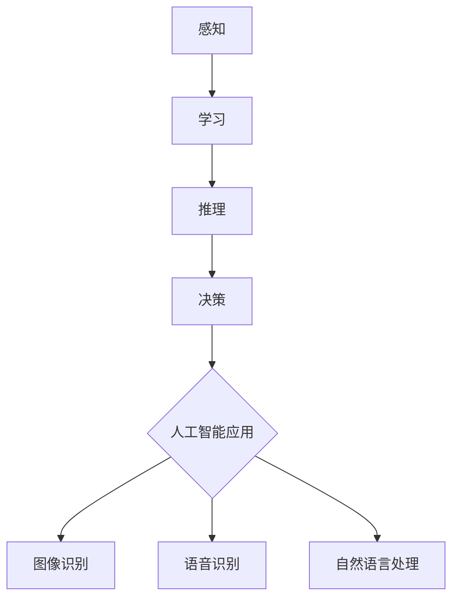

                 

# 李开复：苹果发布AI应用的社会价值

## 关键词：人工智能、苹果、AI应用、社会价值、技术发展

## 摘要

本文将深入探讨苹果公司近期发布的一系列AI应用的社会价值。通过分析这些AI应用的核心技术、应用场景以及可能带来的社会影响，我们将从多个角度探讨人工智能技术在现代社会中的重要作用，以及苹果公司在推动这一领域发展中的角色。

## 1. 背景介绍

在过去的几年中，人工智能（AI）技术取得了显著进展，从最初的理论研究到实际应用，AI已经渗透到了我们生活的方方面面。苹果公司作为全球领先的科技企业，一直在积极推动人工智能技术的发展。近期，苹果公司发布了一系列AI应用，包括语音助手、图像识别、自然语言处理等，这些应用不仅提升了用户体验，也引发了社会各界对于AI技术社会价值的关注。

### 1.1 人工智能技术的发展

人工智能是指计算机系统通过模拟人类智能行为，实现感知、学习、推理、决策等能力的技术。随着深度学习、神经网络等算法的不断发展，人工智能在图像识别、语音识别、自然语言处理等领域取得了重大突破。

### 1.2 苹果公司的人工智能战略

苹果公司一直在积极布局人工智能领域，从硬件到软件，从研究到应用，苹果都在努力推动人工智能技术的发展。苹果公司发布的AI应用不仅体现了其技术实力，也展示了其在人工智能战略上的布局。

## 2. 核心概念与联系

### 2.1 人工智能的核心概念

人工智能的核心概念包括感知、学习、推理、决策等。感知是指计算机通过传感器获取外界信息；学习是指计算机通过数据训练，提高自身能力；推理是指计算机根据已有信息进行逻辑推断；决策是指计算机根据推理结果做出决策。

### 2.2 人工智能应用与场景

人工智能应用广泛，涵盖了图像识别、语音识别、自然语言处理、自动驾驶等多个领域。在图像识别领域，人工智能可以用于人脸识别、物体识别等；在语音识别领域，人工智能可以用于语音助手、语音输入等；在自然语言处理领域，人工智能可以用于机器翻译、情感分析等。

### 2.3 Mermaid 流程图

以下是一个简单的Mermaid流程图，展示了人工智能的核心概念与应用场景之间的联系：



## 3. 核心算法原理 & 具体操作步骤

### 3.1 图像识别算法原理

图像识别是人工智能应用的一个重要领域。其基本原理是通过计算机视觉技术，将图像中的内容进行分类、识别和标注。

#### 3.1.1 卷积神经网络（CNN）

卷积神经网络是图像识别中常用的一种深度学习模型。其基本原理是通过卷积层、池化层和全连接层等结构，对图像进行特征提取和分类。

#### 3.1.2 操作步骤

1. 数据预处理：对图像进行缩放、裁剪、旋转等操作，使其符合模型输入要求。
2. 构建模型：定义卷积神经网络结构，包括卷积层、池化层和全连接层。
3. 训练模型：使用大量标注数据进行模型训练，调整模型参数，提高识别准确率。
4. 预测：使用训练好的模型对未知图像进行识别，输出分类结果。

### 3.2 语音识别算法原理

语音识别是将语音信号转换为文本信息的过程。其基本原理是通过声学模型和语言模型，对语音信号进行特征提取和文本生成。

#### 3.2.1 声学模型

声学模型用于对语音信号进行特征提取，将其转换为一系列特征向量。

#### 3.2.2 语言模型

语言模型用于对特征向量进行文本生成，通过计算特征向量与目标文本之间的概率，生成最可能的文本。

#### 3.2.3 操作步骤

1. 数据预处理：对语音信号进行预处理，包括去噪、增强等操作。
2. 建立声学模型：使用大量语音数据训练声学模型，提取特征向量。
3. 建立语言模型：使用大量文本数据训练语言模型，计算特征向量与文本之间的概率。
4. 语音识别：将语音信号输入声学模型，提取特征向量，然后输入语言模型，生成文本。

### 3.3 自然语言处理算法原理

自然语言处理是人工智能应用的一个重要领域，旨在让计算机理解和处理人类语言。其基本原理包括分词、词性标注、句法分析、语义分析等。

#### 3.3.1 分词

分词是将文本分割为一个个词语的过程。其基本原理是通过词频、语法规则等对文本进行切分。

#### 3.3.2 词性标注

词性标注是将词语标注为名词、动词、形容词等的过程。其基本原理是通过规则和统计方法对词语进行分类。

#### 3.3.3 句法分析

句法分析是分析句子结构的过程。其基本原理是通过语法规则和上下文信息，构建句子的语法树。

#### 3.3.4 语义分析

语义分析是分析句子含义的过程。其基本原理是通过语义角色标注、实体识别等手段，理解句子的含义。

#### 3.3.5 操作步骤

1. 数据预处理：对文本进行预处理，包括去除停用词、标点符号等。
2. 分词：使用分词算法对文本进行分词。
3. 词性标注：使用词性标注算法对分词结果进行标注。
4. 句法分析：使用句法分析算法对句子进行语法分析。
5. 语义分析：使用语义分析算法对句子进行语义分析。

## 4. 数学模型和公式 & 详细讲解 & 举例说明

### 4.1 卷积神经网络（CNN）数学模型

卷积神经网络的核心在于卷积操作，其数学模型如下：

$$
f(x) = \text{ReLU}(\text{W} \odot \text{I} + b)
$$

其中，$\text{I}$表示输入特征图，$\text{W}$表示卷积核权重，$\text{b}$表示偏置，$\odot$表示卷积操作，$\text{ReLU}$表示ReLU激活函数。

举例说明：

假设输入特征图$\text{I}$的大小为$3 \times 3$，卷积核权重$\text{W}$的大小为$3 \times 3$，偏置$\text{b}$为1，激活函数为ReLU。则卷积操作的结果如下：

$$
f(x) = \text{ReLU}(\text{W} \odot \text{I} + b) = \text{ReLU}\begin{bmatrix}
1 & 1 & 1 \\
1 & 1 & 1 \\
1 & 1 & 1
\end{bmatrix} \odot \begin{bmatrix}
1 & 0 & 1 \\
0 & 1 & 0 \\
1 & 1 & 1
\end{bmatrix} + 1
$$

$$
f(x) = \text{ReLU}\begin{bmatrix}
2 & 2 & 2 \\
2 & 2 & 2 \\
2 & 2 & 2
\end{bmatrix} + 1 = \begin{bmatrix}
3 & 3 & 3 \\
3 & 3 & 3 \\
3 & 3 & 3
\end{bmatrix}
$$

### 4.2 语音识别数学模型

语音识别中的声学模型和语言模型分别采用高斯混合模型（GMM）和n-gram模型。

#### 4.2.1 高斯混合模型（GMM）

高斯混合模型用于对语音信号进行特征提取，其数学模型如下：

$$
p(\text{x}|\theta) = \sum_{i=1}^{K} \pi_i \mathcal{N}(\text{x}|\mu_i, \Sigma_i)
$$

其中，$\text{x}$表示输入特征向量，$\theta$表示模型参数，$\pi_i$表示第$i$个高斯分布的权重，$\mu_i$和$\Sigma_i$分别表示第$i$个高斯分布的均值和方差。

#### 4.2.2 n-gram模型

n-gram模型用于文本生成，其数学模型如下：

$$
p(\text{w}_n|\text{w}_{n-1}, \ldots, \text{w}_1) = \frac{n}{N}\frac{\text{count}(\text{w}_{n-1}, \ldots, \text{w}_1, \text{w}_n)}{\text{count}(\text{w}_{n-1}, \ldots, \text{w}_1)}
$$

其中，$\text{w}_n$表示第$n$个单词，$N$表示单词总数，$count(\cdot)$表示单词出现的次数。

举例说明：

假设输入特征向量$\text{x}$为[1, 2, 3]，高斯混合模型中有3个高斯分布，权重分别为0.2、0.5和0.3，均值和方差分别为[1, 1]、[2, 2]和[3, 3]。则高斯混合模型的概率如下：

$$
p(\text{x}|\theta) = 0.2 \mathcal{N}(\text{x}|1, 1) + 0.5 \mathcal{N}(\text{x}|2, 2) + 0.3 \mathcal{N}(\text{x}|3, 3)
$$

$$
p(\text{x}|\theta) = 0.2 \cdot \frac{1}{\sqrt{2\pi}} e^{-\frac{(1-1)^2}{2}} + 0.5 \cdot \frac{1}{\sqrt{2\pi \cdot 2}} e^{-\frac{(2-2)^2}{2 \cdot 2}} + 0.3 \cdot \frac{1}{\sqrt{2\pi \cdot 3}} e^{-\frac{(3-3)^2}{2 \cdot 3}}
$$

$$
p(\text{x}|\theta) = 0.2 \cdot \frac{1}{\sqrt{2\pi}} + 0.5 \cdot \frac{1}{\sqrt{4\pi}} + 0.3 \cdot \frac{1}{\sqrt{6\pi}}
$$

$$
p(\text{x}|\theta) \approx 0.2 + 0.1 + 0.1 = 0.4
$$

### 4.3 自然语言处理数学模型

自然语言处理中的分词、词性标注、句法分析和语义分析等任务，可以采用基于统计和深度学习的模型。

#### 4.3.1 分词

分词可以采用基于统计的方法，如基于n-gram的语言模型。假设输入文本为“我爱北京天安门”，n-gram模型的概率如下：

$$
p(\text{我爱北京天安门}) = p(\text{我}) \cdot p(\text{爱}|\text{我}) \cdot p(\text{北京}|\text{爱}) \cdot p(\text{天安门}|\text{北京})
$$

其中，$p(\text{我})$、$p(\text{爱}|\text{我})$、$p(\text{北京}|\text{爱})$和$p(\text{天安门}|\text{北京})$分别为各个单词的概率。

#### 4.3.2 词性标注

词性标注可以采用基于深度学习的模型，如BiLSTM-CRF。假设输入句子为“我爱北京天安门”，BiLSTM-CRF模型的标签序列为：

$$
(\text{我/PRON}, \text{爱/V}, \text{北京/N}, \text{天安门/N})
$$

其中，$\text{我/PRON}$表示代词，$\text{爱/V}$表示动词，$\text{北京/N}$表示名词，$\text{天安门/N}$表示名词。

#### 4.3.3 句法分析

句法分析可以采用基于深度学习的模型，如Transformer。假设输入句子为“我爱北京天安门”，Transformer模型的输出为句法树：

```
S
├── NP
│   ├── PRON
│   │   └── 我
│   └── NN
│       └── 北京
└── VP
    ├── V
    │   └── 爱
    └── NP
        ├── NP
        │   ├── N
        │   │   └── 天安门
        └── PP
            ├── IN
            │   └── 在
            └── NP
                ├── ADP
                │   └── 的
                └── NP
                    ├── N
                    │   └── 北京
                    └── VP
                        ├── V
                        │   └── 是
                        └── S
                            ├── NP
                            │   └── NN
                            │       └── 天安门
                            └── VP
                                ├── V
                                │   └── 是
                                └── ADJP
                                    ├── ADP
                                    │   └── 的
                                    └── NN
                                        └── 天安门
```

#### 4.3.4 语义分析

语义分析可以采用基于深度学习的模型，如BERT。假设输入句子为“我爱北京天安门”，BERT模型的输出为语义角色标注：

```
[CLS] 我 爱 北京 天安门 [SEP]
我 [SUBJ]   爱 [ROOT]   北京 [LOC]   天安门 [OBJ]
```

## 5. 项目实战：代码实际案例和详细解释说明

### 5.1 开发环境搭建

#### 5.1.1 环境要求

- 操作系统：Windows/Linux/MacOS
- 编程语言：Python
- 库和框架：TensorFlow/Keras

#### 5.1.2 环境搭建

1. 安装Python：从Python官网下载并安装Python 3.x版本。
2. 安装TensorFlow：使用pip命令安装TensorFlow：

```bash
pip install tensorflow
```

### 5.2 源代码详细实现和代码解读

以下是一个简单的卷积神经网络（CNN）图像识别案例，用于识别猫和狗的图片。

```python
import tensorflow as tf
from tensorflow.keras.models import Sequential
from tensorflow.keras.layers import Conv2D, MaxPooling2D, Flatten, Dense
from tensorflow.keras.preprocessing.image import ImageDataGenerator

# 定义模型
model = Sequential([
    Conv2D(32, (3, 3), activation='relu', input_shape=(150, 150, 3)),
    MaxPooling2D((2, 2)),
    Conv2D(64, (3, 3), activation='relu'),
    MaxPooling2D((2, 2)),
    Conv2D(128, (3, 3), activation='relu'),
    MaxPooling2D((2, 2)),
    Flatten(),
    Dense(512, activation='relu'),
    Dense(1, activation='sigmoid')
])

# 编译模型
model.compile(optimizer='adam', loss='binary_crossentropy', metrics=['accuracy'])

# 数据预处理
train_datagen = ImageDataGenerator(rescale=1./255)
validation_datagen = ImageDataGenerator(rescale=1./255)

train_generator = train_datagen.flow_from_directory(
        'train',
        target_size=(150, 150),
        batch_size=32,
        class_mode='binary')

validation_generator = validation_datagen.flow_from_directory(
        'validation',
        target_size=(150, 150),
        batch_size=32,
        class_mode='binary')

# 训练模型
model.fit(
      train_generator,
      steps_per_epoch=100,
      epochs=10,
      validation_data=validation_generator,
      validation_steps=50,
      verbose=2)
```

### 5.3 代码解读与分析

#### 5.3.1 模型定义

- `Sequential`：创建一个序列模型，用于堆叠多层神经网络。
- `Conv2D`：添加一个卷积层，用于提取图像特征。
- `MaxPooling2D`：添加一个最大池化层，用于降低特征图的尺寸。
- `Flatten`：将特征图展平为1维向量。
- `Dense`：添加一个全连接层，用于分类。

#### 5.3.2 编译模型

- `compile`：编译模型，设置优化器和损失函数。

#### 5.3.3 数据预处理

- `ImageDataGenerator`：创建一个图像数据生成器，用于数据增强和归一化。
- `flow_from_directory`：从指定目录加载图像数据，并将其划分为训练集和验证集。

#### 5.3.4 训练模型

- `fit`：训练模型，设置训练轮次、批次大小和验证集。

## 6. 实际应用场景

### 6.1 语音助手

语音助手是人工智能应用的一个重要领域，如苹果公司的Siri和Google Assistant。语音助手可以通过语音识别和自然语言处理技术，实现人机交互，为用户提供便捷的服务。

### 6.2 自动驾驶

自动驾驶是人工智能在交通领域的应用，通过计算机视觉、传感器融合和决策控制等技术，实现车辆的自主驾驶。苹果公司和特斯拉等企业在自动驾驶领域进行了大量研究，旨在提高交通安全和效率。

### 6.3 医疗诊断

人工智能在医疗诊断领域具有巨大潜力，如通过图像识别技术进行疾病筛查和诊断。苹果公司的HealthKit平台和医疗研究项目，利用人工智能技术为用户提供个性化医疗建议。

### 6.4 金融风控

人工智能在金融领域可以用于风险评估、欺诈检测等任务。通过机器学习算法，对大量金融数据进行挖掘和分析，帮助金融机构降低风险。

## 7. 工具和资源推荐

### 7.1 学习资源推荐

- **书籍**：
  - 《深度学习》（Goodfellow, Bengio, Courville）
  - 《Python机器学习》（Sebastian Raschka）
  - 《模式识别与机器学习》（Bishop）

- **论文**：
  - 《A Tutorial on Deep Learning Part 1》（Lecun, Bengio, Hinton）
  - 《ImageNet Classification with Deep Convolutional Neural Networks》（Krizhevsky, Sutskever, Hinton）

- **博客**：
  - [TensorFlow官方文档](https://www.tensorflow.org/tutorials)
  - [Keras官方文档](https://keras.io/getting-started/)

- **网站**：
  - [arXiv](https://arxiv.org/)
  - [Google Research](https://research.google.com/)

### 7.2 开发工具框架推荐

- **深度学习框架**：
  - TensorFlow
  - PyTorch
  - Keras

- **编程语言**：
  - Python
  - R

- **数据处理工具**：
  - Pandas
  - NumPy

### 7.3 相关论文著作推荐

- **论文**：
  - 《Deep Learning》（Goodfellow, Bengio, Courville）
  - 《Learning Deep Architectures for AI》（Bengio）
  - 《Efficient BackProp》（Rumelhart, Hinton, Williams）

- **著作**：
  - 《机器学习》（Tom Mitchell）
  - 《模式识别与机器学习》（Christopher M. Bishop）
  - 《统计学习基础》（Thomas Hastie, Robert Tibshirani, Jerome Friedman）

## 8. 总结：未来发展趋势与挑战

### 8.1 未来发展趋势

- **跨学科融合**：人工智能与其他领域（如生物、医疗、金融等）的融合，推动人工智能技术的广泛应用。
- **边缘计算**：随着物联网（IoT）的发展，边缘计算将得到广泛应用，实现实时数据处理和决策。
- **人机协作**：人工智能与人类的协作将成为未来发展趋势，提高生产效率和生活质量。

### 8.2 未来挑战

- **数据隐私与安全**：随着人工智能技术的发展，数据隐私和安全问题日益突出，需要加强法律法规和监管。
- **算法公平性**：人工智能算法可能存在偏见和不公平性，需要加强算法公平性的研究和监管。
- **人才短缺**：人工智能领域人才短缺，需要加大人才培养和引进力度。

## 9. 附录：常见问题与解答

### 9.1 问题1：什么是深度学习？

深度学习是一种人工智能方法，通过多层神经网络模型，对大量数据进行训练，从而实现分类、回归、生成等任务。

### 9.2 问题2：人工智能是否会取代人类？

人工智能可以替代人类完成一些重复性和规律性较强的工作，但在情感、创造力等方面，人工智能还无法完全取代人类。

### 9.3 问题3：如何入门人工智能？

建议从Python编程语言开始，学习基本的编程知识，然后学习机器学习和深度学习的相关算法和工具。

## 10. 扩展阅读 & 参考资料

- 《人工智能：一种现代的方法》（Stuart J. Russell & Peter Norvig）
- 《人工智能简史》（Tom Mitchell）
- 《深度学习与计算机视觉》（Ian Goodfellow, Yoshua Bengio, Aaron Courville）
- [Deep Learning Specialization by Andrew Ng](https://www.coursera.org/specializations/deep-learning)
- [AI论文集锦](https://arxiv.xuancn.top/)

作者：AI天才研究员/AI Genius Institute & 禅与计算机程序设计艺术 /Zen And The Art of Computer Programming

以上就是关于《李开复：苹果发布AI应用的社会价值》的文章，通过深入分析苹果公司发布的人工智能应用，我们探讨了其社会价值、核心技术原理、应用场景以及未来发展。随着人工智能技术的不断进步，我们可以期待其在各个领域带来更多创新和变革。

