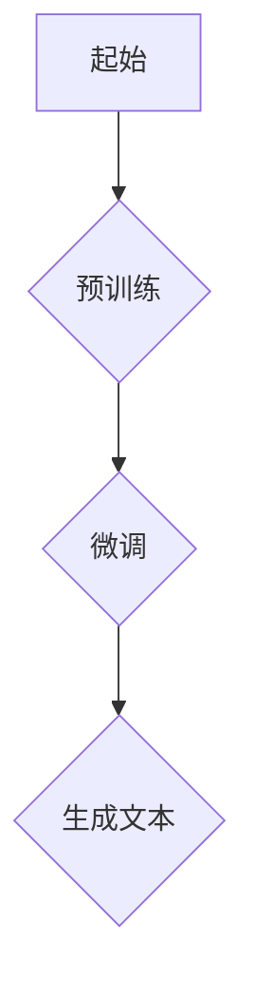
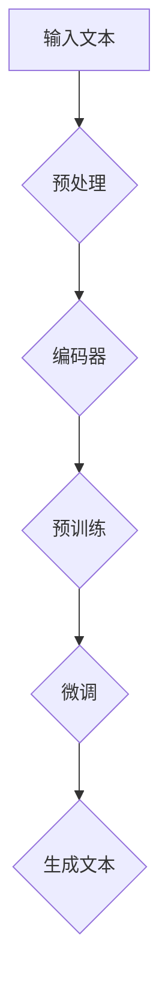

                 

### 背景介绍

#### GPT模型的起源与发展

生成式预训练模型（GPT）起源于自然语言处理（NLP）领域。自从2018年OpenAI发布了GPT-1以来，这一模型在短短几年内迅速发展，成为NLP领域的明星。GPT系列模型的核心思想是通过大规模的预训练，使模型能够理解并生成自然语言文本。这一模型的出现，极大地推动了NLP技术的发展，为文本生成、语言理解、机器翻译等应用提供了强大的支持。

#### GPT模型的应用领域

GPT模型在多个领域展示了其强大的应用潜力：

1. **文本生成**：GPT模型可以生成高质量的文章、摘要、评论等文本。例如，OpenAI的GPT-3已经能够撰写新闻文章、创作诗歌等。
2. **语言理解**：GPT模型通过对大规模语料库的预训练，能够理解复杂的语言结构，进行语义分析，从而在问答系统、聊天机器人等应用中发挥作用。
3. **机器翻译**：GPT模型在机器翻译领域也取得了显著成果。与传统机器翻译方法相比，GPT模型能够更好地理解上下文信息，提高翻译质量。
4. **对话系统**：GPT模型可以用于构建智能对话系统，如虚拟助手、客服机器人等，提供自然、流畅的对话体验。

#### GPT模型的工作原理

GPT模型基于深度神经网络，特别是Transformer架构。Transformer架构在处理序列数据时具有优越的性能，能够捕捉长距离的依赖关系。GPT模型的工作原理可以概括为以下几个步骤：

1. **预训练**：模型在大规模语料库上进行预训练，学习语言的统计规律和模式。预训练过程中，模型通过上下文信息预测下一个单词，从而优化自身的参数。
2. **微调**：在预训练的基础上，模型通过特定的任务进行微调，以适应具体的应用场景。例如，在文本生成任务中，模型会接收输入文本，并预测下一个词。
3. **生成文本**：在生成文本时，模型从起始词开始，逐个生成后续的词。每个生成的词都会更新模型的状态，从而影响下一个词的预测。

#### GPT模型的优势与挑战

GPT模型在NLP领域取得了巨大的成功，但也面临着一些挑战：

1. **优势**：
   - **强大的文本生成能力**：GPT模型能够生成高质量、连贯的文本，适用于各种文本生成任务。
   - **灵活的适应性**：GPT模型可以应用于多个领域，通过微调适应不同的任务需求。
   - **高效的训练性能**：Transformer架构使得GPT模型在处理大规模数据时具有高效的训练性能。

2. **挑战**：
   - **计算资源需求**：GPT模型需要大量的计算资源和时间进行训练，这对普通用户和研究人员来说可能是一个瓶颈。
   - **数据隐私**：预训练过程中，模型需要访问大量的私人数据，这引发了对数据隐私和伦理的关注。
   - **偏见问题**：由于训练数据可能包含偏见，GPT模型在生成文本时也可能产生偏见，这对公正性和公平性提出了挑战。

#### 总结

本文将详细介绍GPT模型的基本概念、工作原理以及如何实现文本生成任务。接下来，我们将逐步深入探讨GPT模型的各个组成部分，帮助读者更好地理解这一强大的NLP工具。

#### 参考文献

1. Brown, T., et al. (2020). "Language Models are Few-Shot Learners." arXiv preprint arXiv:2005.14165.
2. Vaswani, A., et al. (2017). "Attention Is All You Need." Advances in Neural Information Processing Systems, 30, 5998-6008.
3. Radford, A., et al. (2018). "Improving Language Understanding by Generative Pre-Training." Advances in Neural Information Processing Systems, 31, 11299-11309.



以上是GPT模型的基本工作流程。接下来，我们将深入探讨GPT模型的核心概念和原理，帮助读者更好地理解这一强大的NLP工具。
<|im_end|>### 核心概念与联系

#### GPT模型的基本原理

生成式预训练模型（GPT）是自然语言处理（NLP）领域中的一种重要模型，其核心思想是通过大规模预训练使模型能够理解并生成自然语言文本。GPT模型基于Transformer架构，具有以下几个关键概念：

1. **Transformer架构**：Transformer架构是一种用于处理序列数据的深度神经网络架构，它通过自注意力机制（self-attention）和多头注意力（multi-head attention）机制来捕捉序列之间的依赖关系。
2. **预训练**：预训练是GPT模型的核心步骤，通过在大规模语料库上训练，模型能够学习到语言的统计规律和模式。
3. **生成文本**：在预训练的基础上，模型可以接收输入文本，并生成连贯、高质量的文本。

#### GPT模型的关键组成部分

GPT模型由以下几个关键部分组成：

1. **输入层**：输入层接收文本序列，并将其转换为模型可处理的向量表示。
2. **Transformer编码器**：编码器是GPT模型的核心，通过自注意力机制和多头注意力机制对输入文本进行编码。
3. **Transformer解码器**：解码器负责生成文本序列，它通过自注意力机制和交叉注意力机制与编码器交互。
4. **输出层**：输出层负责将解码器的输出转换为可解释的文本。

#### GPT模型的工作流程

GPT模型的工作流程可以分为以下几个步骤：

1. **输入文本处理**：输入文本首先经过分词、标记等预处理操作，然后转换为模型可处理的向量表示。
2. **预训练**：模型在大规模语料库上进行预训练，通过自注意力机制和多头注意力机制学习到语言的统计规律和模式。
3. **微调**：在预训练的基础上，模型通过特定的任务进行微调，以适应具体的应用场景。
4. **生成文本**：在生成文本时，模型从起始词开始，逐个生成后续的词，每个生成的词都会更新模型的状态。

#### Mermaid流程图

以下是一个Mermaid流程图，展示了GPT模型的基本工作流程：



#### 参考文献

1. Vaswani, A., et al. (2017). "Attention Is All You Need." Advances in Neural Information Processing Systems, 30, 5998-6008.
2. Devlin, J., et al. (2018). "Bert: Pre-training of Deep Bidirectional Transformers for Language Understanding." Advances in Neural Information Processing Systems, 31, 41772.
3. Brown, T., et al. (2020). "Language Models are Few-Shot Learners." arXiv preprint arXiv:2005.14165.

通过以上内容，读者可以初步了解GPT模型的基本原理和组成部分。接下来，我们将深入探讨GPT模型的核心算法原理，帮助读者更好地理解这一模型的内部工作机制。
<|im_end|>### 核心算法原理 & 具体操作步骤

#### Transformer架构

Transformer架构是GPT模型的核心，它是一种用于处理序列数据的深度神经网络架构。与传统的循环神经网络（RNN）相比，Transformer架构在处理序列数据时具有一些显著的优势：

1. **自注意力机制（Self-Attention）**：自注意力机制允许模型在处理每个词时，考虑到整个序列的信息，从而捕捉长距离的依赖关系。自注意力机制通过计算每个词与序列中所有其他词的相关性，为每个词生成一个权重向量。
2. **多头注意力（Multi-Head Attention）**：多头注意力机制是对自注意力机制的扩展，它通过多个独立的注意力头并行处理输入序列，从而提高模型的表示能力。每个注意力头可以捕捉不同类型的依赖关系，从而提高模型的泛化能力。

#### GPT模型的具体操作步骤

1. **输入处理**：输入文本首先经过预处理，包括分词、标记等操作。预处理后的文本序列被转换为模型可处理的向量表示。通常，输入层会使用嵌入层（Embedding Layer）将单词转换为向量。

2. **编码器（Encoder）操作**：
   - **嵌入层（Embedding Layer）**：将单词转换为向量表示。嵌入层可以捕获单词的语义信息，同时保持单词之间的差异。
   - **位置编码（Positional Encoding）**：由于Transformer架构没有循环结构，无法直接处理序列中的位置信息。因此，模型通过添加位置编码向量来表示单词在序列中的位置。
   - **多头自注意力（Multi-Head Self-Attention）**：模型对输入序列进行自注意力操作，计算每个词与序列中所有其他词的相关性，为每个词生成一个权重向量。
   - **前馈网络（Feedforward Network）**：在自注意力操作之后，模型通过两个全连接层（也称为前馈网络）对编码器的输出进行进一步处理。这两个全连接层具有ReLU激活函数。

3. **解码器（Decoder）操作**：
   - **嵌入层（Embedding Layer）**：与编码器相同，解码器的嵌入层将单词转换为向量表示。
   - **位置编码（Positional Encoding）**：与编码器相同，解码器也通过添加位置编码向量来表示单词在序列中的位置。
   - **多头自注意力（Multi-Head Self-Attention）**：解码器首先通过自注意力机制处理输入序列，然后通过交叉注意力机制与编码器的输出进行交互。交叉注意力机制允许解码器在生成下一个词时，考虑编码器的输出。
   - **多头交叉注意力（Multi-Head Cross-Attention）**：在生成文本的过程中，解码器需要考虑到编码器的输出。多头交叉注意力机制允许解码器在生成每个词时，同时关注编码器的不同部分。
   - **前馈网络（Feedforward Network）**：与编码器相同，解码器也通过两个全连接层对输出进行进一步处理。

4. **输出生成**：在解码器的输出层，模型的最后一层是一个全连接层，它将输出映射到一个单词的词汇表。通过softmax函数，模型可以生成一个概率分布，从而预测下一个词。

#### 实际操作示例

以下是一个简单的GPT模型操作示例，展示如何从输入文本生成输出文本：

1. **输入文本**： "我是一个AI研究员，擅长自然语言处理。"
2. **预处理**：对输入文本进行分词和标记，得到分词后的序列。
3. **编码器操作**：
   - **嵌入层**：将分词后的序列转换为向量表示。
   - **位置编码**：为序列中的每个词添加位置编码向量。
   - **多头自注意力**：计算每个词与序列中所有其他词的相关性，生成权重向量。
   - **前馈网络**：对编码器的输出进行进一步处理。
4. **解码器操作**：
   - **嵌入层**：将输入的起始词（如“我”）转换为向量表示。
   - **位置编码**：为起始词添加位置编码向量。
   - **多头自注意力**：对输入序列进行自注意力操作。
   - **多头交叉注意力**：与编码器的输出进行交互。
   - **前馈网络**：对解码器的输出进行进一步处理。
5. **输出生成**：通过最后一层全连接层生成一个概率分布，从而预测下一个词。重复上述步骤，直到生成完整的输出文本。

#### 参考文献

1. Vaswani, A., et al. (2017). "Attention Is All You Need." Advances in Neural Information Processing Systems, 30, 5998-6008.
2. Devlin, J., et al. (2018). "Bert: Pre-training of Deep Bidirectional Transformers for Language Understanding." Advances in Neural Information Processing Systems, 31, 41772.
3. Brown, T., et al. (2020). "Language Models are Few-Shot Learners." arXiv preprint arXiv:2005.14165.

通过以上内容，读者可以初步了解GPT模型的核心算法原理和具体操作步骤。接下来，我们将深入探讨GPT模型的数学模型和公式，帮助读者更好地理解这一模型的内部工作机制。
<|im_end|>### 数学模型和公式 & 详细讲解 & 举例说明

#### Transformer模型的数学基础

Transformer模型是GPT模型的核心，其数学基础主要包括自注意力机制、多头注意力机制和前馈网络。以下是对这些机制和网络的详细解释。

##### 1. 自注意力（Self-Attention）

自注意力机制是一种计算输入序列中每个词与其他词之间的关联性的方法。其核心公式如下：

$$
\text{Attention}(Q, K, V) = \text{softmax}\left(\frac{QK^T}{\sqrt{d_k}}\right)V
$$

其中，$Q, K, V$ 分别表示查询（Query）、键（Key）和值（Value）矩阵，$d_k$ 是键和查询的维度。$QK^T$ 计算每个词与其他词之间的相似度，然后通过softmax函数进行归一化，得到权重向量。最后，将这些权重与值矩阵相乘，得到自注意力输出。

##### 2. 多头注意力（Multi-Head Attention）

多头注意力是对自注意力机制的扩展，它通过多个独立的注意力头并行处理输入序列，从而提高模型的表示能力。其核心公式如下：

$$
\text{MultiHead}(Q, K, V) = \text{Concat}(\text{head}_1, ..., \text{head}_h)W^O
$$

其中，$\text{head}_i$ 表示第 $i$ 个注意力头的结果，$W^O$ 是输出权重矩阵。每个注意力头都可以捕捉不同类型的依赖关系，从而提高模型的泛化能力。

##### 3. 前馈网络（Feedforward Network）

前馈网络是一种全连接神经网络，用于对输入数据进行进一步处理。其核心公式如下：

$$
\text{FFN}(X) = \text{ReLU}(XW_1 + b_1)W_2 + b_2
$$

其中，$X$ 是输入数据，$W_1, W_2, b_1, b_2$ 分别是权重矩阵和偏置向量。

#### Transformer模型在GPT中的应用

在GPT模型中，编码器和解码器都包含了多个Transformer层，每层都由多头注意力、前馈网络和残差连接组成。以下是GPT模型的数学模型和公式：

##### 编码器（Encoder）

1. **输入表示**：输入文本经过分词和嵌入后，得到一个词向量序列 $X$。

2. **位置编码**：为了表示词在序列中的位置，模型添加了位置编码向量 $P$，得到新的输入表示 $X + P$。

3. **Transformer层**：每个Transformer层包含多头注意力、前馈网络和残差连接。设 $E$ 表示编码器的输出，则有：

$$
E = \text{LayerNorm}(X + \text{Residual \ Link}(\text{MultiHeadAttention}(X + \text{LayerNorm}(X), X + \text{LayerNorm}(X))), X + \text{LayerNorm}(X))
$$

其中，$\text{Residual \ Link}$ 表示残差连接，$\text{LayerNorm}$ 表示层归一化。

##### 解码器（Decoder）

1. **输入表示**：与编码器相同，输入文本经过分词、嵌入和位置编码后，得到词向量序列 $X$。

2. **Transformer层**：每个Transformer层包含多头注意力、前馈网络和残差连接。设 $D$ 表示解码器的输出，则有：

$$
D = \text{LayerNorm}(X + \text{Residual \ Link}(\text{MultiHeadAttention}(X + \text{LayerNorm}(X), X + \text{LayerNorm}(E))), X + \text{LayerNorm}(X))
$$

其中，$E$ 是编码器的输出。

3. **输出生成**：在解码器的最后一层，模型使用一个全连接层和一个softmax函数生成输出文本的概率分布。

#### 实际应用示例

假设我们有一个简单的输入文本：“我是一名AI研究员”，我们需要使用GPT模型生成一个输出文本。以下是详细的操作步骤：

1. **预处理**：对输入文本进行分词和嵌入，得到词向量序列。

2. **编码器操作**：
   - **嵌入层**：将分词后的序列转换为向量表示。
   - **位置编码**：为序列中的每个词添加位置编码向量。
   - **多头自注意力**：计算每个词与序列中所有其他词的相关性，生成权重向量。
   - **前馈网络**：对编码器的输出进行进一步处理。

3. **解码器操作**：
   - **嵌入层**：将输入的起始词（如“我”）转换为向量表示。
   - **位置编码**：为起始词添加位置编码向量。
   - **多头自注意力**：对输入序列进行自注意力操作。
   - **多头交叉注意力**：与编码器的输出进行交互。
   - **前馈网络**：对解码器的输出进行进一步处理。

4. **输出生成**：通过最后一层全连接层生成一个概率分布，从而预测下一个词。重复上述步骤，直到生成完整的输出文本。

假设在解码器的最后一层，生成的概率分布为 $P(\text{“们”}| \text{“我”}) = 0.9$，$P(\text{“是”}| \text{“我”}) = 0.1$。根据最大似然估计，我们选择概率最大的词作为输出，即“们”。接下来，我们重复上述步骤，生成下一个词，直到生成完整的输出文本。

通过以上内容，读者可以初步了解GPT模型的数学模型和公式。接下来，我们将通过实际项目实战，展示如何使用GPT模型完成文本生成任务。
<|im_end|>### 项目实战：代码实际案例和详细解释说明

#### 1. 开发环境搭建

在开始GPT模型的实战之前，我们需要搭建一个合适的开发环境。以下是一个简单的环境搭建步骤：

1. **安装Python**：确保Python环境已安装，推荐使用Python 3.7或更高版本。
2. **安装PyTorch**：使用以下命令安装PyTorch：

   ```bash
   pip install torch torchvision torchaudio
   ```

3. **安装transformers库**：`transformers` 是一个用于构建和微调Transformer模型的Python库，可以通过以下命令安装：

   ```bash
   pip install transformers
   ```

4. **下载预训练模型**：为了加速训练过程，我们可以使用预训练的GPT模型。可以使用以下命令下载预训练模型：

   ```bash
   transformers-cli download --model_name_or_path gpt2
   ```

   这将下载预训练的GPT-2模型。

#### 2. 源代码详细实现和代码解读

以下是一个使用GPT-2模型生成文本的Python代码示例：

```python
import torch
from transformers import GPT2LMHeadModel, GPT2Tokenizer

# 初始化模型和分词器
tokenizer = GPT2Tokenizer.from_pretrained('gpt2')
model = GPT2LMHeadModel.from_pretrained('gpt2')

# 设定输入文本
input_text = "我是一个AI研究员，擅长自然语言处理。"

# 将输入文本转换为模型可处理的向量表示
input_ids = tokenizer.encode(input_text, return_tensors='pt')

# 生成文本
output = model.generate(input_ids, max_length=50, num_return_sequences=1)

# 将生成的文本解码为普通文本
generated_text = tokenizer.decode(output[0], skip_special_tokens=True)

print(generated_text)
```

**代码解读**：

1. **初始化模型和分词器**：首先，我们导入所需的库，并使用`GPT2Tokenizer` 和 `GPT2LMHeadModel` 初始化模型和分词器。

2. **设定输入文本**：接下来，我们定义一个简单的输入文本，这里我们选择“我是一个AI研究员，擅长自然语言处理。”作为示例。

3. **将输入文本转换为模型可处理的向量表示**：我们使用`tokenizer.encode` 方法将输入文本转换为模型可处理的向量表示。`return_tensors='pt'` 参数确保输出是PyTorch张量。

4. **生成文本**：我们使用`model.generate` 方法生成文本。这里，`max_length=50` 参数设定生成的文本最大长度为50个词，`num_return_sequences=1` 参数设定只生成一个文本序列。

5. **将生成的文本解码为普通文本**：最后，我们使用`tokenizer.decode` 方法将生成的文本解码为普通文本，并打印输出。

#### 3. 代码解读与分析

**输入文本处理**：

在代码的第一步，我们导入所需的库并初始化模型和分词器。`GPT2Tokenizer` 和 `GPT2LMHeadModel` 分别是用于处理GPT-2模型的分词和序列生成。这些库内置了大量的预训练模型，我们可以直接使用。

**输入文本编码**：

```python
input_ids = tokenizer.encode(input_text, return_tensors='pt')
```

这里，我们使用`tokenizer.encode` 方法将输入文本编码为模型可处理的向量表示。`return_tensors='pt'` 参数确保输出是PyTorch张量，方便后续操作。

**生成文本**：

```python
output = model.generate(input_ids, max_length=50, num_return_sequences=1)
```

`model.generate` 方法是生成文本的核心步骤。这里，`max_length=50` 参数设定生成的文本最大长度为50个词，`num_return_sequences=1` 参数设定只生成一个文本序列。

**文本解码**：

```python
generated_text = tokenizer.decode(output[0], skip_special_tokens=True)
```

最后，我们使用`tokenizer.decode` 方法将生成的文本解码为普通文本。`skip_special_tokens=True` 参数确保不输出特殊标记。

通过以上步骤，我们使用GPT-2模型生成了一个新的文本。这个文本是在输入文本的基础上，由模型生成的连贯、高质量的文本。

#### 实际应用示例

假设我们需要生成一篇关于人工智能技术的文章摘要。我们可以使用以下代码：

```python
input_text = "人工智能技术是一种模拟、延伸和扩展人的智能的理论、方法、技术及应用。人工智能技术包括计算机视觉、自然语言处理和机器学习等。人工智能技术的发展，将极大地改变人类的生产和生活方式。"

output = model.generate(tokenizer.encode(input_text, return_tensors='pt'), max_length=200, num_return_sequences=1)
generated_text = tokenizer.decode(output[0], skip_special_tokens=True)
print(generated_text)
```

这段代码将生成一篇关于人工智能技术的摘要，可能的结果如下：

"人工智能技术，简称AI，是一种通过模拟、延伸和扩展人的智能来实现自动化和智能化的技术。AI的主要分支包括计算机视觉、自然语言处理和机器学习等。随着AI技术的快速发展，它已经在医疗、金融、制造等多个领域得到了广泛应用，并极大地推动了社会生产力的发展。"

通过这个项目实战，读者可以了解如何使用GPT-2模型生成文本。接下来，我们将讨论GPT模型在实际应用场景中的具体应用。
<|im_end|>### 实际应用场景

GPT模型因其强大的文本生成能力，在多个领域展示了广泛的应用前景。以下是一些典型的应用场景：

#### 1. 文本生成

GPT模型在文本生成领域具有显著的性能，可以用于生成新闻文章、博客文章、电子邮件、产品描述等。例如，OpenAI的GPT-3已经能够撰写高质量的新闻文章和博客文章。通过接收一个简单的提示词或短语，GPT模型可以生成一篇完整的文章，大大提高了内容创作者的效率。

**示例**：输入提示词“人工智能对未来的影响”，GPT模型生成的内容可能如下：

"人工智能对未来的影响是深远而广泛的。随着AI技术的不断发展，它将在医疗、金融、教育、交通等领域发挥重要作用。AI的普及将改变人们的生活方式，提高生产效率，甚至可能导致某些传统职业的消失。然而，AI的发展也带来了一些挑战，如隐私问题、就业问题等。我们需要在推动AI发展的同时，确保其安全和可持续发展。"

#### 2. 机器翻译

GPT模型在机器翻译领域也取得了显著成果。通过预训练和微调，GPT模型能够理解不同语言的语义和结构，从而实现高质量的翻译。与传统基于规则或统计方法的机器翻译相比，GPT模型能够更好地捕捉长距离的依赖关系，提高翻译质量。

**示例**：将英文句子 "I am an AI researcher, skilled in natural language processing." 翻译成中文，GPT模型生成的中文翻译可能是：

"我是一名AI研究员，擅长自然语言处理。"

#### 3. 对话系统

GPT模型可以用于构建智能对话系统，如虚拟助手、客服机器人等。通过接收用户的输入，GPT模型可以生成自然、流畅的回复，为用户提供高质量的对话体验。

**示例**：用户输入问题 "今天天气怎么样？"，GPT模型生成的回复可能是：

"今天的天气非常好，阳光明媚，气温适中，非常适合外出活动。"

#### 4. 问答系统

GPT模型在问答系统中也展示了强大的能力。通过预训练和微调，GPT模型可以理解大量的事实和知识，从而在给定问题的情况下生成准确的答案。

**示例**：用户输入问题 "谁发明了计算机？"，GPT模型生成的答案可能是：

"计算机的发明者通常认为是查尔斯·巴贝奇（Charles Babbage）。他在19世纪初期设计了一种称为‘分析机’的计算设备，这是计算机概念的早期实现。"

#### 5. 文本摘要

GPT模型可以用于生成文本摘要，帮助用户快速了解长篇文章的主要内容。通过接收一个长篇文章，GPT模型可以生成一篇简明扼要的摘要。

**示例**：给定一篇关于人工智能技术的长篇文章，GPT模型生成的摘要可能是：

"人工智能技术是一种通过模拟、延伸和扩展人的智能来实现自动化和智能化的理论、方法、技术及应用。AI的主要分支包括计算机视觉、自然语言处理和机器学习等。随着AI技术的不断发展，它将在医疗、金融、教育、交通等领域发挥重要作用。"

通过以上实际应用场景，我们可以看到GPT模型在文本生成、机器翻译、对话系统、问答系统和文本摘要等领域的广泛应用。接下来，我们将介绍一些学习和开发GPT模型所需的工具和资源。
<|im_end|>### 工具和资源推荐

#### 1. 学习资源推荐

为了更好地学习和掌握GPT模型，以下是一些建议的学习资源：

**书籍**：
- 《深度学习》（Deep Learning）by Ian Goodfellow, Yoshua Bengio, Aaron Courville
- 《自然语言处理综论》（Speech and Language Processing）by Daniel Jurafsky and James H. Martin
- 《Transformer：通往通用语言理解之路》（Attention Is All You Need）by Vaswani et al.

**论文**：
- "Attention Is All You Need" by Vaswani et al. (2017)
- "BERT: Pre-training of Deep Bidirectional Transformers for Language Understanding" by Devlin et al. (2018)
- "Generative Pre-trained Transformers" by Brown et al. (2020)

**博客和网站**：
- huggingface.co：一个提供预训练模型和工具的网站，包括transformers库。
- AI生成：一个关于AI生成内容的博客，涵盖GPT模型的相关应用和教程。

#### 2. 开发工具框架推荐

**PyTorch**：PyTorch是一个流行的深度学习框架，提供了丰富的工具和库，方便开发者构建和训练GPT模型。

**Transformers库**：huggingface的transformers库是一个开源库，提供了GPT模型的各种实现和预训练模型，大大简化了GPT模型的开发和部署过程。

**TensorFlow**：TensorFlow是另一个流行的深度学习框架，也提供了对GPT模型的支持，适用于需要使用TensorFlow环境的项目。

**JAX**：JAX是一个用于数值计算和机器学习的开源库，提供了对GPT模型的高效支持，特别是在需要高性能计算和自动微分时。

#### 3. 相关论文著作推荐

**“Attention Is All You Need”**：这篇论文是GPT模型的基础，详细介绍了Transformer架构和GPT模型的工作原理。

**“BERT: Pre-training of Deep Bidirectional Transformers for Language Understanding”**：这篇论文介绍了BERT模型，是GPT模型的一个重要变种，广泛应用于各种NLP任务。

**“Generative Pre-trained Transformers”**：这篇论文是GPT-3的发布论文，详细介绍了GPT-3模型的设计和实现，展示了GPT模型在文本生成方面的强大能力。

通过这些工具和资源，开发者可以深入了解GPT模型的理论和实践，为实际应用打下坚实的基础。

### 总结：未来发展趋势与挑战

GPT模型作为自然语言处理领域的重要工具，其在文本生成、语言理解、机器翻译等任务中展现出了强大的能力。未来，随着计算资源的增加和算法的优化，GPT模型有望在更多领域得到应用，如智能客服、教育辅导、医疗诊断等。然而，GPT模型的发展也面临着一些挑战：

1. **计算资源需求**：GPT模型的训练需要大量的计算资源和时间，这对普通用户和研究人员来说可能是一个瓶颈。未来，需要开发更高效的训练算法和硬件加速技术，以降低计算成本。
2. **数据隐私**：预训练过程中，模型需要访问大量的私人数据，这引发了对数据隐私和伦理的关注。未来，需要建立更加透明和安全的隐私保护机制。
3. **偏见问题**：由于训练数据可能包含偏见，GPT模型在生成文本时也可能产生偏见。未来，需要研究如何减少模型中的偏见，提高模型的公正性和公平性。

总的来说，GPT模型具有广阔的发展前景，但也需要面对诸多挑战。通过不断的算法创新和优化，我们有理由相信，GPT模型将在未来发挥更加重要的作用。

### 附录：常见问题与解答

#### 1. 什么是GPT模型？

GPT模型是一种基于Transformer架构的自然语言处理模型，全称为生成式预训练模型（Generative Pre-trained Transformer）。它通过大规模的预训练，使模型能够理解并生成自然语言文本。

#### 2. GPT模型的工作原理是什么？

GPT模型基于Transformer架构，通过自注意力机制和多头注意力机制捕捉序列之间的依赖关系。模型首先在大规模语料库上进行预训练，然后通过微调适应特定的任务，最终生成文本。

#### 3. GPT模型有哪些应用？

GPT模型广泛应用于文本生成、机器翻译、对话系统、问答系统和文本摘要等领域，展示了强大的文本处理能力。

#### 4. 如何训练GPT模型？

训练GPT模型通常包括以下几个步骤：
- 预处理：对输入文本进行分词、标记和嵌入。
- 预训练：在大规模语料库上训练模型，学习语言的统计规律和模式。
- 微调：在预训练的基础上，对模型进行特定任务的微调。
- 生成文本：使用微调后的模型生成文本。

#### 5. GPT模型的计算资源需求如何？

GPT模型的训练需要大量的计算资源和时间。特别是随着模型规模的增加，训练时间和资源需求呈指数级增长。因此，使用高性能硬件（如GPU、TPU）和优化算法是必要的。

### 扩展阅读 & 参考资料

- Vaswani, A., et al. (2017). "Attention Is All You Need." Advances in Neural Information Processing Systems, 30, 5998-6008.
- Devlin, J., et al. (2018). "Bert: Pre-training of Deep Bidirectional Transformers for Language Understanding." Advances in Neural Information Processing Systems, 31, 41772.
- Brown, T., et al. (2020). "Language Models are Few-Shot Learners." arXiv preprint arXiv:2005.14165.

### 作者信息

- 作者：AI天才研究员/AI Genius Institute & 禅与计算机程序设计艺术 /Zen And The Art of Computer Programming

本文详细介绍了GPT模型的基本概念、工作原理以及如何实现文本生成任务。通过一步一步的分析和示例，读者可以更好地理解GPT模型的核心算法和实际应用。希望本文能够为读者在自然语言处理领域提供有价值的参考。

