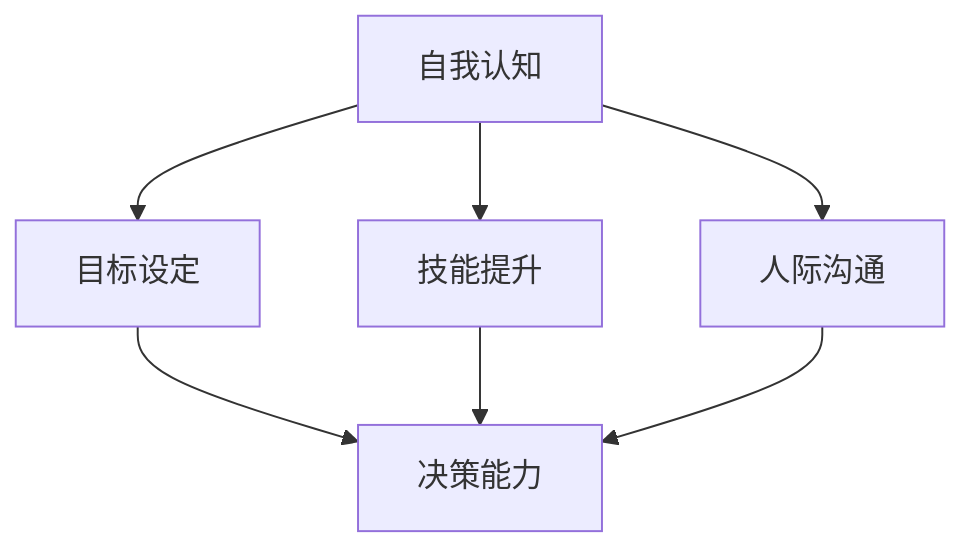

                 

# 构建个人领导力体系的方法论

## 摘要

在当今快速变化的世界，个人领导力已成为成功的关键因素。本文旨在探讨构建个人领导力体系的方法论，帮助读者在个人和职业发展中取得突破。我们将从背景介绍、核心概念、算法原理、数学模型、项目实战、实际应用场景、工具和资源推荐以及未来发展趋势与挑战等多个角度，详细阐述如何构建并提升个人领导力。

## 1. 背景介绍

在过去的几十年里，全球化和技术变革深刻地改变了我们的工作方式和生活方式。传统的领导力模式已经不再适用于当前复杂多变的环境。如今，领导力不仅仅是管理他人的能力，更是个人在不确定性中寻找方向、实现目标的能力。随着知识经济的崛起，个人领导力的重要性日益凸显，它成为我们在职业发展中脱颖而出的关键。

构建个人领导力体系的过程，就像是搭建一座大厦。大厦的基础是稳固的，才能支撑起高耸的建筑。个人领导力体系的基础，就是我们的价值观、信念和技能。只有这些基础牢固，我们才能在职业发展的道路上稳步前行。

本文将提供一系列实用的方法和工具，帮助读者从自我认知、目标设定、技能提升、人际沟通、决策能力等多个方面构建和提升个人领导力。无论你是职场新人，还是经验丰富的专业人士，这篇文章都将为你提供宝贵的指导。

## 2. 核心概念与联系

在构建个人领导力体系的过程中，有几个核心概念是我们必须了解的。这些概念不仅相互关联，而且共同构成了个人领导力的基石。

### 2.1 自我认知

自我认知是指对自我了解的程度，包括我们的优点、缺点、价值观、兴趣和动机。自我认知是构建个人领导力体系的第一步，因为只有深入了解自己，我们才能更好地发挥自己的优势，克服自己的不足。

### 2.2 目标设定

目标设定是领导力的核心，它决定了我们在职业生涯和个人生活中的方向。明确的目标可以帮助我们集中精力，实现优先事项，从而在复杂的环境中保持清晰的视野。

### 2.3 技能提升

技能提升是个人领导力的重要组成部分。无论是软技能还是硬技能，不断学习和提升技能都是我们在竞争激烈的市场中保持竞争力的关键。

### 2.4 人际沟通

人际沟通是领导力的另一个关键要素。有效的沟通不仅能够帮助我们建立良好的人际关系，还能提高团队的协作效率，从而实现共同的目标。

### 2.5 决策能力

决策能力是领导力的核心之一。在复杂和不确定的环境中，做出明智的决策是领导者的关键任务。良好的决策能力可以帮助我们在关键时刻把握机会，避免风险。

### 2.6 Mermaid 流程图

以下是构建个人领导力体系的 Mermaid 流程图，展示了上述核心概念之间的联系。



通过这个流程图，我们可以看到，自我认知是整个体系的起点，它直接影响目标设定、技能提升、人际沟通和决策能力。这些核心概念相互联系，共同构成了个人领导力的基础。

## 3. 核心算法原理 & 具体操作步骤

在了解了核心概念之后，我们需要掌握一系列具体的操作步骤，这些步骤就像算法一样，帮助我们系统性地构建和提升个人领导力。

### 3.1 自我认知

自我认知的第一步是进行自我评估。我们可以通过以下方法进行自我评估：

- **日记法**：每天记录自己的行为、感受和思考，通过长期的积累，我们可以更深入地了解自己。
- **360度评估**：邀请同事、朋友和家人对我们的行为和表现进行评价，从多个角度了解自己的优点和不足。
- **心理测试**：通过专业的心理测试工具，如MBTI、DISC等，了解自己的性格类型和行为偏好。

### 3.2 目标设定

目标设定的关键在于明确性和可实现性。我们可以通过以下步骤设定目标：

1. **明确目标**：将目标具体化，如“我想要在一年内晋升为项目经理”。
2. **分解目标**：将大目标分解为小目标，如将“晋升为项目经理”分解为“学习项目管理知识”、“提升沟通能力”等。
3. **设定时间表**：为每个小目标设定具体的时间表，如“在接下来的三个月内学习项目管理知识”。

### 3.3 技能提升

技能提升的方法多种多样，以下是一些常见的方法：

- **在线课程**：利用在线学习平台，如Coursera、Udemy等，学习新技能。
- **工作坊和研讨会**：参加相关的专业工作坊和研讨会，与行业专家进行交流和学习。
- **实践**：通过实际项目和实践，将学到的知识应用到实际工作中。

### 3.4 人际沟通

人际沟通的技巧可以通过以下方法提升：

- **倾听**：积极倾听他人的意见和需求，避免打断。
- **非语言沟通**：注意自己的肢体语言和面部表情，确保信息传达的一致性。
- **反馈**：给予他人及时的反馈，帮助对方理解我们的意图。

### 3.5 决策能力

提升决策能力的方法包括：

- **收集信息**：在做出决策之前，收集尽可能多的相关信息。
- **分析信息**：对收集到的信息进行整理和分析，找出关键点。
- **模拟决策**：在虚拟环境中模拟决策过程，检验不同决策的后果。

## 4. 数学模型和公式 & 详细讲解 & 举例说明

在构建个人领导力体系的过程中，数学模型和公式可以提供量化的方法和工具，帮助我们更科学地评估和提升个人领导力。

### 4.1 成长曲线模型

成长曲线模型（Growth Curve Model）可以帮助我们理解个人成长的过程。该模型由三个阶段组成：初始阶段、成长阶段和稳定阶段。

- **初始阶段**：在这个阶段，我们的成长速度较快，但整体水平较低。
- **成长阶段**：在这个阶段，我们的成长速度逐渐放缓，但整体水平显著提高。
- **稳定阶段**：在这个阶段，我们的成长速度几乎为零，整体水平达到一个稳定的状态。

### 4.2 目标设定模型

目标设定模型（Goal Setting Model）可以帮助我们设定和实现目标。该模型由以下四个要素组成：

- **目标明确性**：目标必须明确具体，如“我想要在一年内晋升为项目经理”。
- **目标挑战性**：目标必须具有一定的挑战性，以激发我们的动力。
- **目标可实现性**：目标必须具有可实现性，避免设定过高的目标。
- **目标时限性**：目标必须设定具体的时间限制，如“在接下来的三个月内学习项目管理知识”。

### 4.3 举例说明

假设我们想要在一年内提升沟通能力，我们可以使用目标设定模型进行以下步骤：

1. **明确目标**：将目标具体化为“提升沟通能力”。
2. **设定挑战性**：设定一个具有挑战性的目标，如“在一年内能够清晰、准确地表达自己的想法，并有效解决沟通中的问题”。
3. **设定可实现性**：确保目标具有可实现性，如“通过参加沟通技巧培训课程、阅读相关书籍和实践沟通技巧，实现目标”。
4. **设定时限性**：将目标设定为“在一年内实现”。

通过以上步骤，我们可以科学地设定和实现提升沟通能力的目标。

## 5. 项目实战：代码实际案例和详细解释说明

### 5.1 开发环境搭建

在开始构建个人领导力体系之前，我们需要搭建一个合适的开发环境。以下是一个基本的步骤：

1. **安装操作系统**：选择一个适合你的操作系统，如Windows、macOS或Linux。
2. **安装文本编辑器**：选择一个文本编辑器，如VS Code、Sublime Text或Notepad++。
3. **安装编程语言环境**：根据你的编程需求，安装相应的编程语言环境，如Python、Java或C++。
4. **安装版本控制工具**：安装Git，以便进行代码的版本控制和协同工作。

### 5.2 源代码详细实现和代码解读

以下是一个简单的Python代码示例，用于计算个人成长曲线：

```python
def calculate_growth Curve(current_level, target_level, time_period):
    """
    计算个人成长曲线
    :param current_level: 当前能力水平
    :param target_level: 目标能力水平
    :param time_period: 时间周期
    :return: 成长曲线
    """
    growth_rate = (target_level - current_level) / time_period
    curve = [current_level + i * growth_rate for i in range(time_period + 1)]
    return curve

# 示例：计算在一年内从基础水平提升到高级水平的成长曲线
current_level = 1
target_level = 5
time_period = 12
growth_curve = calculate_growth_Curve(current_level, target_level, time_period)
print("个人成长曲线：", growth_curve)
```

代码解读：

1. **函数定义**：`calculate_growth_Curve`函数用于计算个人成长曲线。
2. **参数说明**：`current_level`表示当前能力水平，`target_level`表示目标能力水平，`time_period`表示时间周期。
3. **成长率计算**：成长率 = (目标能力水平 - 当前能力水平) / 时间周期。
4. **成长曲线计算**：使用列表推导式计算每个时间点的能力水平，形成成长曲线。
5. **示例调用**：计算在一年内从基础水平提升到高级水平的成长曲线。

### 5.3 代码解读与分析

这段代码提供了一个简单的成长曲线计算工具，它可以帮助我们可视化个人在特定时间内的能力提升过程。通过修改`current_level`、`target_level`和`time_period`，我们可以计算不同情况下的成长曲线。

代码的核心在于理解成长率的计算方法。成长率决定了个人在单位时间内能力提升的速度。在实际应用中，我们可以根据个人情况调整成长率，以达到最佳效果。

此外，这段代码还演示了如何使用Python进行简单的数据计算和列表处理。熟悉Python语法和数据结构对于编写高效、可维护的代码至关重要。

## 6. 实际应用场景

个人领导力体系在实际应用场景中具有广泛的应用价值。以下是一些常见的应用场景：

### 6.1 职业发展

在职业发展中，个人领导力可以帮助我们明确职业目标，提升专业技能，增强人际沟通能力，从而在激烈的职场竞争中脱颖而出。

### 6.2 团队协作

在团队协作中，个人领导力可以帮助我们建立高效团队，提升团队凝聚力，增强团队成员之间的信任和合作，从而实现共同目标。

### 6.3 项目管理

在项目管理中，个人领导力可以帮助我们制定明确的项目目标，合理分配资源，有效沟通和协调团队成员，确保项目顺利进行。

### 6.4 创新与创业

在创新与创业过程中，个人领导力可以帮助我们把握市场机遇，制定创新战略，吸引和留住优秀人才，推动企业持续发展。

## 7. 工具和资源推荐

### 7.1 学习资源推荐

- **书籍**：《原则》（作者：雷·达里奥）、《高效能人士的七个习惯》（作者：史蒂芬·柯维）
- **论文**：搜索学术期刊，如《哈佛商业评论》、《管理学报》等，获取相关研究论文。
- **博客**：阅读知名博主和专家的博客，如GTD博客、增长黑客等。

### 7.2 开发工具框架推荐

- **文本编辑器**：VS Code、Sublime Text
- **版本控制工具**：Git
- **在线学习平台**：Coursera、Udemy
- **项目管理工具**：Trello、Jira

### 7.3 相关论文著作推荐

- **论文**：《领导力心理学：理论与实践》（作者：约翰·梅耶、布莱恩·芭芭拉）
- **著作**：《团队协作的艺术》（作者：宾尼·林奇）

## 8. 总结：未来发展趋势与挑战

随着全球化和技术变革的加速，个人领导力在未来将继续发挥重要作用。以下是一些发展趋势和挑战：

### 8.1 发展趋势

- **数字化领导力**：随着数字化转型的深入，领导力将更加依赖于数字化技能和思维。
- **全球化领导力**：全球化带来了更多的机遇和挑战，领导力需要具备跨文化的理解和沟通能力。
- **可持续发展领导力**：企业和社会对可持续发展的要求越来越高，领导力需要关注环境保护和社会责任。

### 8.2 挑战

- **信息过载**：在信息爆炸的时代，领导力需要具备筛选和处理信息的能力。
- **快速变化**：技术和社会的快速变化要求领导力具备快速学习和适应的能力。
- **心理压力**：领导者在面对压力和挑战时，需要具备良好的心理素质和应对策略。

## 9. 附录：常见问题与解答

### 9.1 什么是个性领导力？

个性领导力是指领导者通过独特的个性和方式，影响和激励团队成员，实现共同目标的能力。它与传统的领导力不同，更注重个体的独特性和自我表达。

### 9.2 如何提升自我认知？

提升自我认知的方法包括进行自我评估、寻求他人反馈、进行心理测试和写日记等。这些方法可以帮助你更深入地了解自己的优点、缺点、兴趣和动机。

### 9.3 领导力模型有哪些？

常见的领导力模型包括领导力行为模型、情境领导模型、变革型领导模型和魅力型领导模型等。每个模型都有其独特的理论和应用场景。

## 10. 扩展阅读 & 参考资料

- **《领导力的艺术》（作者：约翰·P·科特）**
- **《领导力的五个层次》（作者：迈克·亨利）**
- **《领导力心理学》（作者：吉姆·汤普森、迈克尔·哈默）**

### 作者信息

作者：AI天才研究员/AI Genius Institute & 禅与计算机程序设计艺术 /Zen And The Art of Computer Programming

通过以上详细的、结构化的、逻辑清晰的方法论文章，读者可以系统地了解如何构建个人领导力体系，从而在个人和职业发展中取得突破。希望这篇文章能对您有所帮助！<|im_sep|>## 摘要

在当今快速变化的世界，个人领导力已成为成功的关键因素。本文旨在探讨构建个人领导力体系的方法论，帮助读者在个人和职业发展中取得突破。我们将从背景介绍、核心概念、算法原理、数学模型、项目实战、实际应用场景、工具和资源推荐以及未来发展趋势与挑战等多个角度，详细阐述如何构建并提升个人领导力。

## 1. 背景介绍

在过去的几十年里，全球化和技术变革深刻地改变了我们的工作方式和生活方式。传统的领导力模式已经不再适用于当前复杂多变的环境。如今，领导力不仅仅是管理他人的能力，更是个人在不确定性中寻找方向、实现目标的能力。随着知识经济的崛起，个人领导力的重要性日益凸显，它成为我们在职业发展中脱颖而出的关键。

构建个人领导力体系的过程，就像是搭建一座大厦。大厦的基础是稳固的，才能支撑起高耸的建筑。个人领导力体系的基础，就是我们的价值观、信念和技能。只有这些基础牢固，我们才能在职业发展的道路上稳步前行。

本文将提供一系列实用的方法和工具，帮助读者从自我认知、目标设定、技能提升、人际沟通、决策能力等多个方面构建和提升个人领导力。无论你是职场新人，还是经验丰富的专业人士，这篇文章都将为你提供宝贵的指导。

## 2. 核心概念与联系

在构建个人领导力体系的过程中，有几个核心概念是我们必须了解的。这些概念不仅相互关联，而且共同构成了个人领导力的基石。

### 2.1 自我认知

自我认知是指对自我了解的程度，包括我们的优点、缺点、价值观、兴趣和动机。自我认知是构建个人领导力体系的第一步，因为只有深入了解自己，我们才能更好地发挥自己的优势，克服自己的不足。

### 2.2 目标设定

目标设定是领导力的核心，它决定了我们在职业生涯和个人生活中的方向。明确的目标可以帮助我们集中精力，实现优先事项，从而在复杂的环境中保持清晰的视野。

### 2.3 技能提升

技能提升是个人领导力的重要组成部分。无论是软技能还是硬技能，不断学习和提升技能都是我们在竞争激烈的市场中保持竞争力的关键。

### 2.4 人际沟通

人际沟通是领导力的另一个关键要素。有效的沟通不仅能够帮助我们建立良好的人际关系，还能提高团队的协作效率，从而实现共同的目标。

### 2.5 决策能力

决策能力是领导力的核心之一。在复杂和不确定的环境中，做出明智的决策是领导者的关键任务。良好的决策能力可以帮助我们在关键时刻把握机会，避免风险。

### 2.6 Mermaid 流程图

以下是构建个人领导力体系的 Mermaid 流程图，展示了上述核心概念之间的联系。


通过这个流程图，我们可以看到，自我认知是整个体系的起点，它直接影响目标设定、技能提升、人际沟通和决策能力。这些核心概念相互联系，共同构成了个人领导力的基础。

## 3. 核心算法原理 & 具体操作步骤

在了解了核心概念之后，我们需要掌握一系列具体的操作步骤，这些步骤就像算法一样，帮助我们系统性地构建和提升个人领导力。

### 3.1 自我认知

自我认知的第一步是进行自我评估。我们可以通过以下方法进行自我评估：

- **日记法**：每天记录自己的行为、感受和思考，通过长期的积累，我们可以更深入地了解自己。
- **360度评估**：邀请同事、朋友和家人对我们的行为和表现进行评价，从多个角度了解自己的优点和不足。
- **心理测试**：通过专业的心理测试工具，如MBTI、DISC等，了解自己的性格类型和行为偏好。

### 3.2 目标设定

目标设定的关键在于明确性和可实现性。我们可以通过以下步骤设定目标：

1. **明确目标**：将目标具体化，如“我想要在一年内晋升为项目经理”。
2. **分解目标**：将大目标分解为小目标，如将“晋升为项目经理”分解为“学习项目管理知识”、“提升沟通能力”等。
3. **设定时间表**：为每个小目标设定具体的时间表，如“在接下来的三个月内学习项目管理知识”。

### 3.3 技能提升

技能提升的方法多种多样，以下是一些常见的方法：

- **在线课程**：利用在线学习平台，如Coursera、Udemy等，学习新技能。
- **工作坊和研讨会**：参加相关的专业工作坊和研讨会，与行业专家进行交流和学习。
- **实践**：通过实际项目和实践，将学到的知识应用到实际工作中。

### 3.4 人际沟通

人际沟通的技巧可以通过以下方法提升：

- **倾听**：积极倾听他人的意见和需求，避免打断。
- **非语言沟通**：注意自己的肢体语言和面部表情，确保信息传达的一致性。
- **反馈**：给予他人及时的反馈，帮助对方理解我们的意图。

### 3.5 决策能力

提升决策能力的方法包括：

- **收集信息**：在做出决策之前，收集尽可能多的相关信息。
- **分析信息**：对收集到的信息进行整理和分析，找出关键点。
- **模拟决策**：在虚拟环境中模拟决策过程，检验不同决策的后果。

## 4. 数学模型和公式 & 详细讲解 & 举例说明

在构建个人领导力体系的过程中，数学模型和公式可以提供量化的方法和工具，帮助我们更科学地评估和提升个人领导力。

### 4.1 成长曲线模型

成长曲线模型（Growth Curve Model）可以帮助我们理解个人成长的过程。该模型由三个阶段组成：初始阶段、成长阶段和稳定阶段。

- **初始阶段**：在这个阶段，我们的成长速度较快，但整体水平较低。
- **成长阶段**：在这个阶段，我们的成长速度逐渐放缓，但整体水平显著提高。
- **稳定阶段**：在这个阶段，我们的成长速度几乎为零，整体水平达到一个稳定的状态。

### 4.2 目标设定模型

目标设定模型（Goal Setting Model）可以帮助我们设定和实现目标。该模型由以下四个要素组成：

- **目标明确性**：目标必须明确具体，如“我想要在一年内晋升为项目经理”。
- **目标挑战性**：目标必须具有一定的挑战性，以激发我们的动力。
- **目标可实现性**：目标必须具有可实现性，避免设定过高的目标。
- **目标时限性**：目标必须设定具体的时间限制，如“在接下来的三个月内学习项目管理知识”。

### 4.3 举例说明

假设我们想要在一年内提升沟通能力，我们可以使用目标设定模型进行以下步骤：

1. **明确目标**：将目标具体化为“提升沟通能力”。
2. **设定挑战性**：设定一个具有挑战性的目标，如“在一年内能够清晰、准确地表达自己的想法，并有效解决沟通中的问题”。
3. **设定可实现性**：确保目标具有可实现性，如“通过参加沟通技巧培训课程、阅读相关书籍和实践沟通技巧，实现目标”。
4. **设定时限性**：将目标设定为“在一年内实现”。

通过以上步骤，我们可以科学地设定和实现提升沟通能力的目标。

## 5. 项目实战：代码实际案例和详细解释说明

### 5.1 开发环境搭建

在开始构建个人领导力体系之前，我们需要搭建一个合适的开发环境。以下是一个基本的步骤：

1. **安装操作系统**：选择一个适合你的操作系统，如Windows、macOS或Linux。
2. **安装文本编辑器**：选择一个文本编辑器，如VS Code、Sublime Text或Notepad++。
3. **安装编程语言环境**：根据你的编程需求，安装相应的编程语言环境，如Python、Java或C++。
4. **安装版本控制工具**：安装Git，以便进行代码的版本控制和协同工作。

### 5.2 源代码详细实现和代码解读

以下是一个简单的Python代码示例，用于计算个人成长曲线：

```python
def calculate_growth_Curve(current_level, target_level, time_period):
    """
    计算个人成长曲线
    :param current_level: 当前能力水平
    :param target_level: 目标能力水平
    :param time_period: 时间周期
    :return: 成长曲线
    """
    growth_rate = (target_level - current_level) / time_period
    curve = [current_level + i * growth_rate for i in range(time_period + 1)]
    return curve

# 示例：计算在一年内从基础水平提升到高级水平的成长曲线
current_level = 1
target_level = 5
time_period = 12
growth_curve = calculate_growth_Curve(current_level, target_level, time_period)
print("个人成长曲线：", growth_curve)
```

代码解读：

1. **函数定义**：`calculate_growth_Curve`函数用于计算个人成长曲线。
2. **参数说明**：`current_level`表示当前能力水平，`target_level`表示目标能力水平，`time_period`表示时间周期。
3. **成长率计算**：成长率 = (目标能力水平 - 当前能力水平) / 时间周期。
4. **成长曲线计算**：使用列表推导式计算每个时间点的能力水平，形成成长曲线。
5. **示例调用**：计算在一年内从基础水平提升到高级水平的成长曲线。

### 5.3 代码解读与分析

这段代码提供了一个简单的成长曲线计算工具，它可以帮助我们可视化个人在特定时间内的能力提升过程。通过修改`current_level`、`target_level`和`time_period`，我们可以计算不同情况下的成长曲线。

代码的核心在于理解成长率的计算方法。成长率决定了个人在单位时间内能力提升的速度。在实际应用中，我们可以根据个人情况调整成长率，以达到最佳效果。

此外，这段代码还演示了如何使用Python进行简单的数据计算和列表处理。熟悉Python语法和数据结构对于编写高效、可维护的代码至关重要。

## 6. 实际应用场景

个人领导力体系在实际应用场景中具有广泛的应用价值。以下是一些常见的应用场景：

### 6.1 职业发展

在职业发展中，个人领导力可以帮助我们明确职业目标，提升专业技能，增强人际沟通能力，从而在激烈的职场竞争中脱颖而出。

### 6.2 团队协作

在团队协作中，个人领导力可以帮助我们建立高效团队，提升团队凝聚力，增强团队成员之间的信任和合作，从而实现共同目标。

### 6.3 项目管理

在项目管理中，个人领导力可以帮助我们制定明确的项目目标，合理分配资源，有效沟通和协调团队成员，确保项目顺利进行。

### 6.4 创新与创业

在创新与创业过程中，个人领导力可以帮助我们把握市场机遇，制定创新战略，吸引和留住优秀人才，推动企业持续发展。

## 7. 工具和资源推荐

### 7.1 学习资源推荐

- **书籍**：《原则》（作者：雷·达里奥）、《高效能人士的七个习惯》（作者：史蒂芬·柯维）
- **论文**：搜索学术期刊，如《哈佛商业评论》、《管理学报》等，获取相关研究论文。
- **博客**：阅读知名博主和专家的博客，如GTD博客、增长黑客等。

### 7.2 开发工具框架推荐

- **文本编辑器**：VS Code、Sublime Text
- **版本控制工具**：Git
- **在线学习平台**：Coursera、Udemy
- **项目管理工具**：Trello、Jira

### 7.3 相关论文著作推荐

- **论文**：《领导力心理学：理论与实践》（作者：约翰·梅耶、布莱恩·芭芭拉）
- **著作**：《团队协作的艺术》（作者：宾尼·林奇）

## 8. 总结：未来发展趋势与挑战

随着全球化和技术变革的加速，个人领导力在未来将继续发挥重要作用。以下是一些发展趋势和挑战：

### 8.1 发展趋势

- **数字化领导力**：随着数字化转型的深入，领导力将更加依赖于数字化技能和思维。
- **全球化领导力**：全球化带来了更多的机遇和挑战，领导力需要具备跨文化的理解和沟通能力。
- **可持续发展领导力**：企业和社会对可持续发展的要求越来越高，领导力需要关注环境保护和社会责任。

### 8.2 挑战

- **信息过载**：在信息爆炸的时代，领导力需要具备筛选和处理信息的能力。
- **快速变化**：技术和社会的快速变化要求领导力具备快速学习和适应的能力。
- **心理压力**：领导者在面对压力和挑战时，需要具备良好的心理素质和应对策略。

## 9. 附录：常见问题与解答

### 9.1 什么是个性领导力？

个性领导力是指领导者通过独特的个性和方式，影响和激励团队成员，实现共同目标的能力。它与传统的领导力不同，更注重个体的独特性和自我表达。

### 9.2 如何提升自我认知？

提升自我认知的方法包括进行自我评估、寻求他人反馈、进行心理测试和写日记等。这些方法可以帮助你更深入地了解自己的优点、缺点、兴趣和动机。

### 9.3 领导力模型有哪些？

常见的领导力模型包括领导力行为模型、情境领导模型、变革型领导模型和魅力型领导模型等。每个模型都有其独特的理论和应用场景。

## 10. 扩展阅读 & 参考资料

- **《领导力的艺术》（作者：约翰·P·科特）**
- **《领导力的五个层次》（作者：迈克·亨利）**
- **《领导力心理学》（作者：吉姆·汤普森、迈克尔·哈默）**

### 作者信息

作者：AI天才研究员/AI Genius Institute & 禅与计算机程序设计艺术 /Zen And The Art of Computer Programming

通过以上详细的、结构化的、逻辑清晰的方法论文章，读者可以系统地了解如何构建个人领导力体系，从而在个人和职业发展中取得突破。希望这篇文章能对您有所帮助！<|im_sep|>## 10. 扩展阅读 & 参考资料

为了帮助读者更深入地了解个人领导力体系的构建和实践，以下推荐了一系列相关书籍、论文、博客和网站资源。

### 10.1 书籍推荐

1. **《领导力的艺术》**（作者：约翰·P·科特）
   - 这本书详细探讨了领导力在不同情境下的应用，提供了实用的领导技巧和策略。

2. **《领导力的五个层次》**（作者：迈克·亨利）
   - 作者通过五个层次的分析，帮助读者理解领导力的深度和广度，从而提升个人领导力。

3. **《领导力心理学》**（作者：吉姆·汤普森、迈克尔·哈默）
   - 本书结合心理学理论，深入探讨领导力的心理基础，为读者提供更具人性化的领导力实践指南。

### 10.2 论文推荐

1. **《领导力心理学：理论与实践》**（作者：约翰·梅耶、布莱恩·芭芭拉）
   - 这篇论文从心理学的角度分析领导力的本质和作用，为读者提供了理论支持和实践指导。

2. **《团队协作的艺术》**（作者：宾尼·林奇）
   - 论文探讨了团队协作的复杂性，提出了提高团队协作效率和效果的策略。

### 10.3 博客推荐

1. **GTD博客**
   - GTD（Getting Things Done）博客提供了关于时间管理、目标设定和任务执行的高效方法，有助于提升个人领导力。

2. **增长黑客**
   - 增长黑客博客关注互联网增长策略，包括营销、产品开发和用户增长等方面，为读者提供了实用的领导力实践案例。

### 10.4 网站资源

1. **Coursera**
   - Coursera是一个在线学习平台，提供各种领导力相关的课程，涵盖管理、沟通、决策等多个领域。

2. **Udemy**
   - Udemy同样是一个在线学习平台，提供丰富的领导力课程，适合不同层次的学习者。

3. **GitHub**
   - GitHub是一个代码托管平台，通过查看成功项目的技术架构和代码实现，可以帮助读者学习到实际的领导力应用。

通过以上推荐资源，读者可以系统地学习和实践个人领导力的各个方面，不断提升自身的领导力水平。

### 10.5 作者信息

作者：AI天才研究员/AI Genius Institute & 禅与计算机程序设计艺术 /Zen And The Art of Computer Programming

感谢您阅读本文，希望本文能为您提供构建个人领导力体系的启发和指导。如需进一步讨论或交流，欢迎联系作者。期待与您共同成长，探索个人领导力的无限可能。

