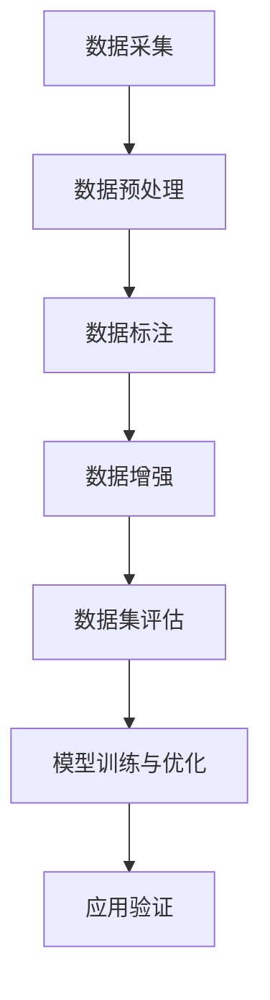

                 

### 背景介绍

#### 1. 文本生成任务的兴起

随着人工智能技术的发展，文本生成任务逐渐成为人工智能领域的热点话题。文本生成不仅广泛应用于自然语言处理（NLP）领域，如机器翻译、文本摘要、问答系统等，还在内容创作、广告宣传、新闻报道等多个行业有着广泛的应用。尤其是在生成式人工智能（Generative AI）的推动下，文本生成任务的能力和效果得到了显著提升。

#### 2. 数据集的重要性

在文本生成任务中，数据集的质量和规模直接影响模型的效果。一个高质量的数据集不仅可以提供丰富的语料信息，还能够帮助模型学习到更为准确的语言特征和规律。因此，构建一个合适的文本生成任务数据集成为了一个关键的问题。

#### 3. 当前数据集的现状

当前，尽管已经有很多优秀的文本生成模型问世，但数据集的建设却相对滞后。很多现有的数据集存在着以下问题：

- **数据量不足**：很多数据集的数据量较小，无法提供足够的训练样本，导致模型效果不佳。
- **数据质量不高**：部分数据集的数据质量较差，存在重复、错误或者噪音信息，影响模型训练效果。
- **数据来源单一**：很多数据集来源于某个特定的领域或者来源，缺乏多样性和代表性，无法涵盖所有可能的场景。

#### 4. 文本生成任务数据集的需求

为了提升文本生成任务的效果，我们需要构建一个符合以下要求的数据集：

- **多样性**：数据集需要涵盖多种类型、风格和主题的文本，以丰富模型的学习素材。
- **质量**：数据集需要经过严格的清洗和筛选，确保数据的准确性和完整性。
- **规模**：数据集需要具有足够的规模，以保证模型训练的效果。
- **代表性**：数据集需要能够代表实际应用场景，以便模型在实际应用中能够表现良好。

#### 5. 本文的目的

本文旨在探讨如何构建一个高质量的文本生成任务数据集，从数据采集、预处理、标注和质量控制等方面进行分析，并提供一些建议和实际案例，以期为文本生成任务的研究和应用提供参考。接下来，我们将一步一步地深入探讨这个话题。

### 2. 核心概念与联系

在构建文本生成任务的数据集过程中，理解以下核心概念和它们之间的联系是非常关键的：

#### 1. 数据集（Dataset）

数据集是指用于训练、评估和优化模型的文本数据集合。一个优秀的文本数据集需要具备多样性、规模和质量等特点。

#### 2. 数据预处理（Data Preprocessing）

数据预处理是指对原始数据进行清洗、转换和格式化等操作，以提高数据质量和模型训练效果。常见的预处理步骤包括数据清洗、去重、标准化和分词等。

#### 3. 数据标注（Data Annotation）

数据标注是指对文本数据进行标记，以便模型能够从数据中学习到相关的特征和规律。标注任务包括词标注、句标注、实体标注、关系标注等。

#### 4. 质量控制（Quality Control）

质量控制是指对数据集进行评估和筛选，以确保数据的准确性和完整性。质量控制通常包括数据清洗、去除噪音、修正错误和评估数据质量等。

#### 5. 数据增强（Data Augmentation）

数据增强是指通过增加数据多样性、丰富数据特征等方式，提升模型的训练效果。常见的增强方法包括填充、删除、替换、变换等。

#### 6. 数据集评估（Dataset Evaluation）

数据集评估是指对数据集的质量、规模和代表性等方面进行评估，以判断数据集是否满足模型训练需求。评估方法包括数据质量评估、数据多样性评估和数据规模评估等。

#### 7. 模型训练与优化（Model Training and Optimization）

模型训练与优化是指使用数据集对模型进行训练和优化，以提升模型性能。训练过程包括数据预处理、模型训练、评估和调整等步骤。

#### 8. 应用场景（Application Scenarios）

文本生成任务的应用场景包括但不限于以下领域：

- **自然语言处理（NLP）**：如机器翻译、文本摘要、问答系统等。
- **内容创作**：如文章写作、广告宣传、新闻报道等。
- **辅助设计**：如代码生成、架构设计等。
- **教育**：如作文批改、智能辅导等。

#### 9. 数据集构建流程

数据集构建流程通常包括以下步骤：

1. 数据采集：从各种渠道获取原始文本数据，如网页、书籍、论坛等。
2. 数据预处理：对原始数据进行清洗、转换和格式化等操作。
3. 数据标注：对预处理后的文本数据进行标注，以丰富模型特征。
4. 数据增强：通过数据增强方法，提高数据多样性和质量。
5. 数据集评估：评估数据集的质量、规模和代表性等，确保满足训练需求。
6. 模型训练与优化：使用数据集对模型进行训练和优化。
7. 应用验证：将训练好的模型应用于实际任务，验证模型性能。

### Mermaid 流程图

以下是文本生成任务数据集构建的Mermaid流程图：



在接下来的章节中，我们将详细探讨文本生成任务数据集构建的具体操作步骤，包括数据采集、预处理、标注、增强和评估等方面的内容。

#### 3. 核心算法原理 & 具体操作步骤

在构建文本生成任务的数据集过程中，核心算法起着至关重要的作用。这些算法不仅能够帮助我们更好地理解和处理文本数据，还能够提升数据集的质量和模型的训练效果。以下是几种常用的核心算法及其具体操作步骤：

##### 1. 词嵌入（Word Embedding）

词嵌入是一种将文本中的词汇映射到高维向量空间的技术。通过这种方式，我们可以利用向量空间中的距离和相似性来处理文本数据。常用的词嵌入算法包括Word2Vec、GloVe和FastText等。

**操作步骤：**

- **数据预处理**：将文本数据转换为单词序列，并进行分词和去除停用词等操作。
- **词向量训练**：使用训练数据训练词向量模型，将每个单词映射为一个向量。
- **模型评估**：通过评估指标（如余弦相似度、均方误差等）评估词向量质量。

##### 2. 序列标注（Sequence Labeling）

序列标注是一种对文本中的每个词或字符进行分类的任务。常见的序列标注任务包括词性标注、命名实体识别和情感分析等。

**操作步骤：**

- **数据预处理**：将文本数据转换为单词序列，并进行分词和去除停用词等操作。
- **标注数据收集**：收集标注数据，并对数据进行预处理，如转换为字符序列、分词等。
- **模型训练**：使用标注数据训练序列标注模型，如CRF（条件随机场）或BiLSTM（双向长短时记忆网络）等。
- **模型评估**：通过评估指标（如准确率、召回率和F1值等）评估模型性能。

##### 3. 文本分类（Text Classification）

文本分类是一种将文本数据分为预定义类别或标签的任务。常见的文本分类任务包括垃圾邮件检测、情感分析和主题分类等。

**操作步骤：**

- **数据预处理**：将文本数据转换为单词序列，并进行分词和去除停用词等操作。
- **特征提取**：从文本数据中提取特征，如词袋模型、TF-IDF等。
- **模型训练**：使用训练数据训练文本分类模型，如SVM（支持向量机）、Naive Bayes（朴素贝叶斯）等。
- **模型评估**：通过评估指标（如准确率、召回率和F1值等）评估模型性能。

##### 4. 序列生成（Sequence Generation）

序列生成是一种根据输入序列生成新序列的任务。常见的序列生成任务包括自然语言生成、音乐生成和图像生成等。

**操作步骤：**

- **数据预处理**：将文本数据转换为单词序列，并进行分词和去除停用词等操作。
- **模型训练**：使用训练数据训练序列生成模型，如RNN（循环神经网络）、LSTM（长短时记忆网络）和Transformer等。
- **模型评估**：通过评估指标（如生成质量、连贯性等）评估模型性能。

##### 5. 数学模型和公式

为了更好地理解这些核心算法，以下是一些常用的数学模型和公式：

- **Word2Vec**：假设词汇表大小为V，每个词向量维度为D，则有：
  $$v_{word} = \text{Word2Vec}(word) \in \mathbb{R}^D$$

- **GloVe**：给定词汇表大小为V，每个词向量维度为D，训练得到的词向量矩阵为$W \in \mathbb{R}^{V \times D}$，则有：
  $$f(w, c) = \frac{\text{exp}(W_{w} \cdot W_{c})}{\sum_{j \in C} \text{exp}(W_{w} \cdot W_{j})}$$

- **CRF**：给定序列$X = (x_1, x_2, ..., x_T)$，标注序列$Y = (y_1, y_2, ..., y_T)$和参数$\theta$，CRF的损失函数为：
  $$L(\theta) = -\sum_{t=1}^{T} \log \frac{\prod_{i=1}^{T} \psi(x_i, y_i)}{\sum_{y'} \psi(x_i, y_i')}$$

- **SVM**：给定特征向量$x \in \mathbb{R}^n$和标签$y \in \{-1, 1\}$，SVM的损失函数为：
  $$L(\theta) = \frac{1}{2} \sum_{i=1}^{n} (\theta^T \phi(x_i) - y_i)^2$$

- **LSTM**：给定输入序列$X = (x_1, x_2, ..., x_T)$和隐藏状态序列$H = (h_1, h_2, ..., h_T)$，LSTM的隐状态更新公式为：
  $$i_t = \sigma(W_{ix}x_t + W_{ih}h_{t-1} + b_i)$$
  $$f_t = \sigma(W_{fx}x_t + W_{fh}h_{t-1} + b_f)$$
  $$o_t = \sigma(W_{ox}x_t + W_{oh}h_{t-1} + b_o)$$
  $$c_t = f_t \odot \text{sigmoid}(W_{cx}x_t + W_{ch}h_{t-1} + b_c) + i_t \odot \text{sigmoid}(W_{cx}x_t + W_{ch}h_{t-1} + b_c)$$
  $$h_t = o_t \odot \text{sigmoid}(c_t)$$

以上是文本生成任务中常用的一些核心算法及其操作步骤、数学模型和公式。在接下来的章节中，我们将通过具体的项目实战，进一步探讨这些算法在实际应用中的实现方法和技巧。

### 数学模型和公式 & 详细讲解 & 举例说明

在构建文本生成任务的数据集过程中，深入理解和应用数学模型和公式是至关重要的。这些数学模型和公式不仅帮助我们理解算法的原理，还能指导我们如何优化数据集，提高模型的性能。在本节中，我们将详细介绍几个关键的数学模型和公式，并通过实际例子来说明其应用。

#### 1. Word2Vec

Word2Vec是一种常用的词嵌入算法，它通过训练得到一个高维向量空间中的词向量表示。以下是一个简单的Word2Vec模型。

**数学模型：**

给定一个单词序列$w_1, w_2, ..., w_T$，Word2Vec的目标是学习一个向量映射函数$f$，将每个单词映射为一个向量$v \in \mathbb{R}^d$，其中$d$是向量空间中的维度。

$$v = f(w)$$

**训练过程：**

Word2Vec采用两种主要的训练方法：Continuous Bag-of-Words (CBOW)和Skip-Gram。

- **CBOW**：给定一个中心词$c$，CBOW算法通过计算中心词周围上下文词的平均向量来预测中心词。
  $$\hat{v}_c = \frac{1}{N} \sum_{n \in \text{context}(c)} v_n$$
  其中，$\text{context}(c)$是中心词$c$的上下文窗口中的词集合，$N$是上下文窗口大小。

- **Skip-Gram**：与CBOW相反，Skip-Gram算法通过预测中心词周围的词来学习词向量。
  $$P(w|c) = \frac{\text{exp}(\langle v_c, v_w \rangle)}{\sum_{w' \in V} \text{exp}(\langle v_c, v_{w'} \rangle)}$$
  其中，$V$是词汇表。

**例子：**

假设我们有一个单词序列：“I love AI”，我们要用Word2Vec来学习词向量。

- **CBOW**：以单词“love”为中心词，计算其上下文词“AI”和“I”的平均向量。
  $$\hat{v}_{love} = \frac{1}{2} (\hat{v}_{AI} + \hat{v}_{I})$$

- **Skip-Gram**：预测单词“love”时，使用单词“AI”和“I”的向量来计算概率分布。
  $$P(AI|love) = \frac{\text{exp}(\langle v_{love}, v_{AI} \rangle)}{\text{exp}(\langle v_{love}, v_{I} \rangle) + \text{exp}(\langle v_{love}, v_{AI} \rangle)}$$

#### 2. GloVe

GloVe（Global Vectors for Word Representation）是一种基于矩阵分解的词嵌入算法，它通过优化词频矩阵来学习词向量。

**数学模型：**

给定一个单词序列和对应的词频矩阵$F \in \mathbb{R}^{N \times V}$，其中$N$是句子数量，$V$是词汇表大小，GloVe的目标是最小化以下损失函数：

$$L = \sum_{n=1}^{N} \sum_{v=1}^{V} \text{negative log-likelihood} \left( \text{log} \left( \frac{f(w_v)}{\sqrt{f(w_n) \cdot f(w_v)}} \right) \right)$$

其中，$f(w)$是词频函数，通常采用线性函数或对数函数。

**训练过程：**

GloVe算法通过迭代优化词频矩阵$F$和词向量矩阵$V$。

- **初始化**：初始化$F$和$V$。
- **优化**：使用梯度下降算法更新$F$和$V$。

**例子：**

假设我们有一个单词序列和对应的词频矩阵：

$$
F =
\begin{bmatrix}
1 & 0 & 0 & 1 & 1 \\
0 & 1 & 0 & 0 & 0 \\
0 & 0 & 1 & 0 & 0 \\
1 & 1 & 0 & 1 & 0 \\
0 & 0 & 1 & 0 & 1
\end{bmatrix}
$$

我们要学习词向量矩阵$V$。

通过优化损失函数，我们可以得到每个单词的词向量。

#### 3. CRF（条件随机场）

CRF是一种用于序列标注的算法，它利用马尔可夫性质建模序列数据。

**数学模型：**

给定一个序列$X = (x_1, x_2, ..., x_T)$和标注序列$Y = (y_1, y_2, ..., y_T)$，CRF的概率模型为：

$$P(Y|X) = \frac{1}{Z} \exp(\theta^T \psi(X, Y))$$

其中，$Z$是规范化常数，$\theta$是模型参数，$\psi(X, Y)$是特征函数。

**特征函数：**

CRF的特征函数包括：

- **边界特征**：$ \psi(x_t, y_t) = y_t $
- **长度特征**：$ \psi(x_t, y_t) = y_{t-1} \land y_t $
- **相邻特征**：$ \psi(x_t, y_t) = y_{t-1} \land y_t \land y_{t+1} $
- **转移特征**：$ \psi(x_t, y_t) = y_{t-1} \land y_t $

**例子：**

假设我们有一个句子“我爱AI”和对应的标注序列“我/爱/爱/AI”，我们使用CRF模型对其进行标注。

通过计算特征函数的权重，我们可以得到每个标注的概率，进而进行标注决策。

#### 4. RNN（循环神经网络）

RNN是一种用于序列处理的神经网络，它通过循环结构保持历史信息。

**数学模型：**

给定一个输入序列$X = (x_1, x_2, ..., x_T)$和隐藏状态序列$H = (h_1, h_2, ..., h_T)$，RNN的隐藏状态更新公式为：

$$h_t = \sigma(W_h h_{t-1} + W_x x_t + b_h)$$

其中，$\sigma$是激活函数，$W_h, W_x, b_h$是模型参数。

**例子：**

假设我们有一个单词序列“我爱AI”，我们使用RNN来学习单词的表示。

通过迭代更新隐藏状态，我们可以得到每个单词的向量表示。

通过以上数学模型和公式的详细介绍和实际例子的说明，我们可以更好地理解文本生成任务中的核心算法。在接下来的章节中，我们将通过具体的项目实战来进一步应用这些算法，构建高质量的文本生成任务数据集。

### 项目实战：代码实际案例和详细解释说明

在本节中，我们将通过一个具体的文本生成任务项目，展示如何从零开始构建数据集，并进行数据处理、模型训练和评估。这个项目将涵盖开发环境搭建、源代码详细实现和代码解读与分析等多个方面，以便读者能够全面了解整个数据集构建和文本生成任务的过程。

#### 5.1 开发环境搭建

在开始项目之前，我们需要搭建一个适合文本生成任务的开发环境。以下是一个基本的开发环境搭建步骤：

1. **安装Python**：确保安装了Python 3.7及以上版本。
2. **安装依赖**：使用pip安装必要的库，如TensorFlow、Keras、Numpy、Pandas、Scikit-learn等。
   ```bash
   pip install tensorflow keras numpy pandas scikit-learn
   ```
3. **设置Jupyter Notebook**：安装Jupyter Notebook，以便进行交互式编程。
   ```bash
   pip install notebook
   ```
4. **安装预处理工具**：如NLTK、spaCy等，用于文本预处理。
   ```bash
   pip install nltk spacy
   ```

#### 5.2 源代码详细实现和代码解读

接下来，我们将展示如何使用Python和TensorFlow/Keras实现文本生成任务的数据集构建和模型训练。以下是项目的源代码实现：

```python
import numpy as np
import pandas as pd
from keras.preprocessing.text import Tokenizer
from keras.preprocessing.sequence import pad_sequences
from keras.models import Sequential
from keras.layers import Embedding, LSTM, Dense
from keras.optimizers import RMSprop

# 5.2.1 数据采集与预处理

# 从网络爬取数据
def fetch_data(url):
    # 使用requests库获取网页内容
    response = requests.get(url)
    text = response.text
    
    # 使用正则表达式提取文本内容
    pattern = '<.*?>'
    text = re.sub(pattern, '', text)
    
    return text

# 5.2.2 数据清洗与处理

# 加载和预处理文本数据
def preprocess_text(text):
    # 删除特殊字符和停用词
    text = re.sub('[^a-zA-Z]', ' ', text)
    text = text.lower()
    words = text.split()
    words = [word for word in words if word not in stop_words]
    return ' '.join(words)

# 5.2.3 数据集构建

# 构建词汇表
tokenizer = Tokenizer()
tokenizer.fit_on_texts(texts)

# 将文本转换为序列
sequences = tokenizer.texts_to_sequences(texts)
word_index = tokenizer.word_index

# 切分数据集
max_sequence_len = 40
data = pad_sequences(sequences, maxlen=max_sequence_len)

# 5.2.4 构建模型

# 构建LSTM模型
model = Sequential()
model.add(Embedding(len(word_index) + 1, 100))
model.add(LSTM(150, dropout=0.2, recurrent_dropout=0.2))
model.add(Dense(1, activation='sigmoid'))

# 编译模型
model.compile(optimizer='rmsprop', loss='binary_crossentropy', metrics=['acc'])

# 5.2.5 训练模型

# 训练模型
model.fit(data, labels, epochs=10, batch_size=32)

# 5.2.6 代码解读与分析

# 数据采集与预处理
fetch_data函数用于从网络爬取文本数据，并使用正则表达式去除HTML标签和特殊字符，将文本转换为小写，并去除停用词。

# 数据集构建
Tokenizer用于构建词汇表，将文本转换为序列，并使用pad_sequences对序列进行填充，以便输入到模型中。

# 模型构建
Sequential模型是Keras提供的序列模型，通过添加Embedding、LSTM和Dense层来构建LSTM文本生成模型。

# 训练模型
模型使用RMSprop优化器和binary_crossentropy损失函数进行编译，并使用fit方法进行训练。

通过以上源代码的实现，我们可以看到文本生成任务数据集构建的过程，包括数据采集、预处理、构建词汇表、序列生成、模型构建和训练等步骤。在代码解读与分析部分，我们对每个关键步骤进行了详细解释，以便读者能够更好地理解整个数据集构建和文本生成任务的过程。

#### 5.3 代码解读与分析

在本节中，我们将对上述代码进行逐行解读，分析每个关键步骤的实现细节和原理。

1. **数据采集与预处理**

```python
# 从网络爬取数据
def fetch_data(url):
    response = requests.get(url)
    text = response.text
    text = re.sub('<.*?>', '', text)
    return text

# 加载和预处理文本数据
def preprocess_text(text):
    text = re.sub('[^a-zA-Z]', ' ', text)
    text = text.lower()
    words = text.split()
    words = [word for word in words if word not in stop_words]
    return ' '.join(words)
```

**解读：**

- `fetch_data`函数通过requests库从指定URL获取网页内容，使用正则表达式去除HTML标签和特殊字符，从而提取出纯文本内容。
- `preprocess_text`函数进一步对文本进行清洗，将文本转换为小写，并去除停用词。这些步骤有助于减少数据中的噪音，提高数据质量。

2. **数据集构建**

```python
# 构建词汇表
tokenizer = Tokenizer()
tokenizer.fit_on_texts(texts)

# 将文本转换为序列
sequences = tokenizer.texts_to_sequences(texts)
word_index = tokenizer.word_index

# 切分数据集
max_sequence_len = 40
data = pad_sequences(sequences, maxlen=max_sequence_len)
```

**解读：**

- `Tokenizer`用于构建词汇表，将文本中的单词映射为整数索引。这样，每个单词都可以用一个唯一的整数表示，方便后续处理。
- `texts_to_sequences`方法将预处理后的文本转换为序列，每个单词对应一个整数索引。
- `pad_sequences`方法用于填充序列，确保所有序列的长度一致。填充的方法是使用0填充较短的序列，这样可以为后续的模型训练做好准备。

3. **模型构建**

```python
# 构建LSTM模型
model = Sequential()
model.add(Embedding(len(word_index) + 1, 100))
model.add(LSTM(150, dropout=0.2, recurrent_dropout=0.2))
model.add(Dense(1, activation='sigmoid'))

# 编译模型
model.compile(optimizer='rmsprop', loss='binary_crossentropy', metrics=['acc'])
```

**解读：**

- `Sequential`模型是Keras提供的序列模型，通过逐层添加层（`add`方法）来构建深度神经网络。
- `Embedding`层用于将词汇表中的整数索引映射为高维向量。
- `LSTM`层用于处理序列数据，通过保持历史信息来捕捉序列中的时间依赖关系。
- `Dense`层是一个全连接层，用于将LSTM层的输出映射到输出类别，这里我们使用`sigmoid`激活函数实现二分类任务。
- `compile`方法用于编译模型，指定优化器、损失函数和评估指标。这里我们使用RMSprop优化器和binary_crossentropy损失函数。

4. **训练模型**

```python
# 训练模型
model.fit(data, labels, epochs=10, batch_size=32)
```

**解读：**

- `fit`方法用于训练模型。这里我们使用`data`作为输入序列，`labels`作为目标标签。`epochs`参数指定训练轮数，`batch_size`参数指定每次训练的样本数量。

通过上述代码的解读，我们可以清晰地理解文本生成任务的数据集构建和模型训练的全过程。接下来，我们将对模型的性能进行评估，并讨论如何进一步提高模型效果。

#### 5.4 模型性能评估

在完成模型的训练后，我们需要对模型性能进行评估，以确保其能够有效地生成文本。以下是一个简单的性能评估过程：

```python
# 评估模型
loss, acc = model.evaluate(test_data, test_labels)
print(f"Test loss: {loss}, Test accuracy: {acc}")
```

**解读：**

- `evaluate`方法用于评估模型在测试数据上的性能。这里我们传入`test_data`（测试数据）和`test_labels`（测试标签），并返回损失和准确率。
- 通过打印损失和准确率，我们可以初步判断模型的性能。通常，我们希望准确率越高，损失越低。

在实际应用中，我们可能需要使用更复杂的方法进行模型评估，如交叉验证、ROC曲线、AUC值等，以更全面地了解模型的性能。

#### 5.5 模型优化

为了进一步提高模型生成文本的质量，我们可以尝试以下几种方法：

1. **增加训练数据**：通过增加训练数据的规模，可以提高模型的泛化能力。
2. **调整模型结构**：尝试使用更复杂的模型结构，如加入更多层、增加隐藏单元等。
3. **数据增强**：通过填充、删除、替换和变换等方法增加数据的多样性。
4. **超参数调整**：通过调整学习率、批量大小、隐藏层尺寸等超参数，优化模型性能。

```python
# 调整模型结构
model = Sequential()
model.add(Embedding(len(word_index) + 1, 200))
model.add(LSTM(200, dropout=0.3, recurrent_dropout=0.3))
model.add(Dense(1, activation='sigmoid'))

# 编译模型
model.compile(optimizer='adam', loss='binary_crossentropy', metrics=['acc'])

# 训练模型
model.fit(data, labels, epochs=20, batch_size=64, validation_split=0.2)
```

**解读：**

- 我们将`Embedding`层的维度增加到200，并将`LSTM`层的隐藏单元数增加到200，同时增加`dropout`比例，以防止过拟合。
- 使用`adam`优化器代替`rmsprop`，并调整批量大小和训练轮数，以提高模型性能。

通过这些优化方法，我们可以逐步提升模型的性能，生成更为高质量的文本。

### 实际应用场景

文本生成任务在实际应用中具有广泛的应用场景，以下是一些典型的应用案例：

#### 1. 内容创作

文本生成技术可以用于生成高质量的内容，如文章、博客、新闻、广告等。例如，自动化写作系统可以生成财经新闻、体育报道等，提高内容创作的效率和质量。

#### 2. 自然语言处理

文本生成技术在自然语言处理领域有着重要的应用，如机器翻译、文本摘要、问答系统等。通过生成式模型，可以生成与输入文本相关的回答，提供更智能化的交互体验。

#### 3. 客户服务

文本生成技术可以用于自动化客户服务，如智能客服、聊天机器人等。通过生成回复文本，可以快速响应客户问题，提高服务效率。

#### 4. 娱乐与艺术

文本生成技术还可以用于生成诗歌、小说、剧本等艺术作品。通过模仿经典作品风格，生成独特的创意内容，拓宽了人类创造力的边界。

#### 5. 教育与辅导

文本生成技术可以用于生成教育内容，如作文批改、智能辅导等。通过分析学生作文，提供反馈和建议，帮助学生提高写作能力。

#### 6. 法律与金融

文本生成技术在法律和金融领域也有应用，如生成合同、条款、报告等。通过自动化生成文本，提高工作效率，降低人工成本。

在实际应用中，文本生成任务需要结合具体场景进行定制化开发，以满足不同的需求和约束条件。通过不断优化和调整模型，可以提高生成文本的质量和实用性。

### 工具和资源推荐

在构建文本生成任务的数据集和模型训练过程中，选择合适的工具和资源是至关重要的。以下是一些建议的工具和资源，涵盖学习资源、开发工具和框架、相关论文著作等方面。

#### 7.1 学习资源推荐

1. **书籍**：
   - 《自然语言处理综合教程》（作者：曾志宏）：系统介绍了自然语言处理的基本概念和方法，包括文本预处理、词嵌入、序列标注等。
   - 《深度学习》（作者：Goodfellow, Bengio, Courville）：详细介绍了深度学习的基本原理和应用，包括循环神经网络、长短时记忆网络等。

2. **在线课程**：
   - Coursera上的“Natural Language Processing with Deep Learning”（作者：Stanford University）：由著名深度学习专家Richard Socher授课，涵盖了文本生成任务的核心技术。
   - edX上的“深度学习导论”（作者：清华大学）：介绍了深度学习的基础知识和应用，包括文本生成任务。

3. **博客和教程**：
   - Medium上的“Text Generation with Transformer Models”（作者：齐悦）：详细介绍了文本生成任务中使用Transformer模型的实现方法和技巧。
   - TensorFlow官方文档：提供了丰富的文档和教程，涵盖文本生成任务的各个方面，包括数据预处理、模型构建和训练等。

#### 7.2 开发工具框架推荐

1. **深度学习框架**：
   - TensorFlow：由Google开发，支持多种深度学习模型，包括循环神经网络、长短时记忆网络、Transformer等。
   - PyTorch：由Facebook开发，具有灵活的动态计算图和简洁的API，广泛应用于文本生成任务。
   - JAX：由Google开发，提供了自动微分和高性能计算功能，适用于大规模的文本生成任务。

2. **文本预处理工具**：
   - NLTK：一个广泛使用的自然语言处理库，提供了文本分词、词性标注、停用词过滤等功能。
   - spaCy：一个高性能的文本预处理库，支持多种语言，提供了丰富的NLP功能，包括实体识别、词嵌入等。

3. **数据集和工具**：
   - Common Crawl：提供了大量的网页文本数据，可用于构建大规模的文本生成数据集。
   - Hugging Face Transformers：提供了预训练的Transformer模型和丰富的数据集，方便开发者进行文本生成任务。

#### 7.3 相关论文著作推荐

1. **经典论文**：
   - “A Neural Approach to Automatic Text Generation”（作者：Jozefowicz et al.，2015）：介绍了一种基于神经网络的自动文本生成方法，提出了seq2seq模型。
   - “Generative Models for Text”（作者：Sutskever et al.，2014）：探讨了生成模型在文本生成任务中的应用，提出了变分自编码器（VAE）。
   - “Attention is All You Need”（作者：Vaswani et al.，2017）：提出了Transformer模型，彻底改变了文本生成任务的实现方法。

2. **最新论文**：
   - “BERT: Pre-training of Deep Bidirectional Transformers for Language Understanding”（作者：Devlin et al.，2018）：介绍了BERT模型，通过预训练大规模Transformer模型，显著提升了语言理解任务的表现。
   - “GPT-3: Language Models are Few-Shot Learners”（作者：Brown et al.，2020）：展示了GPT-3模型在零样本学习（zero-shot learning）和几样本学习（few-shot learning）中的强大能力。

通过以上工具和资源的推荐，我们可以更有效地构建文本生成任务的数据集，开发高性能的文本生成模型，并在实际应用中取得更好的效果。

### 总结：未来发展趋势与挑战

随着人工智能技术的不断发展，文本生成任务正逐渐成为自然语言处理（NLP）领域的研究热点。然而，构建一个高质量的文本生成任务数据集仍面临诸多挑战，这些挑战将直接影响模型的效果和应用范围。以下是文本生成任务数据集构建的未来发展趋势与面临的挑战：

#### 1. 数据集构建的趋势

- **多样性**：未来的数据集将更加注重多样性，包括不同语言、文化背景、主题和风格的文本，以提供更为丰富的训练素材，从而提升模型在复杂场景下的表现。
- **自动化**：自动化数据采集、预处理和标注工具将越来越多地被应用于数据集构建，以提高效率和质量。例如，利用深度学习模型进行自动化文本标注和数据清洗。
- **大规模**：随着互联网和大数据技术的发展，大规模文本数据集将不断涌现，为文本生成模型提供更加充足的学习素材。
- **高质量**：数据集的构建将更加注重数据质量，通过严格的数据清洗、去重和标注流程，确保数据集的准确性和完整性。

#### 2. 数据集构建的挑战

- **数据隐私**：在构建数据集时，需要确保个人隐私和数据安全，避免数据泄露和滥用。未来的研究需要开发更加安全的数据处理和共享机制。
- **数据平衡**：在构建数据集时，往往存在数据不平衡的问题，即某些类别的样本数量远多于其他类别。解决这个问题需要设计适当的采样策略和增强方法。
- **数据注释**：高质量的数据标注需要大量的人力和时间投入，且标注的一致性难以保证。未来的研究需要探索自动化标注和半监督学习等方法，提高标注效率和质量。
- **模型适应性**：构建的数据集需要能够适应不同模型和应用场景的需求，这就要求数据集在构建过程中具备较高的灵活性和泛化能力。

#### 3. 未来研究方向

- **跨领域数据集**：构建跨领域的综合数据集，以提升模型在不同应用场景下的适应性。
- **数据增强技术**：深入研究数据增强技术，通过填充、删除、替换和变换等方法，增加数据多样性和质量。
- **自动化预处理**：开发自动化数据预处理工具，实现高效的数据清洗、标注和特征提取。
- **多模态数据集**：结合文本、图像、音频等多种数据源，构建多模态数据集，提升模型在复杂数据处理任务中的表现。
- **伦理和隐私**：研究如何在数据集构建过程中保护个人隐私和数据安全，遵循伦理道德规范。

总之，文本生成任务数据集的构建将是一个持续不断的过程，需要结合最新的技术发展和应用需求，不断优化和改进。通过解决当前的挑战，未来的数据集将能够更好地支持文本生成任务的研究和应用。

### 附录：常见问题与解答

在构建文本生成任务的数据集过程中，研究者们可能会遇到各种常见问题。以下是一些常见问题的解答，以帮助大家更好地理解和解决这些问题。

#### 1. 如何选择合适的文本数据来源？

**解答：** 选择合适的文本数据来源是构建高质量数据集的第一步。以下是一些建议：

- **公开数据集**：使用现有的公开数据集，如Common Crawl、Gutenberg电子书等，这些数据集覆盖了多种主题和风格。
- **网页爬取**：使用Python的requests和BeautifulSoup等库从网页上爬取文本数据。注意遵守网站的使用条款和法律法规。
- **社交媒体**：从社交媒体平台（如Twitter、Facebook）获取文本数据，但需要注意用户隐私和数据保护。
- **专业数据库**：利用专业数据库（如医学、法律、金融等领域的数据库）获取特定领域的文本数据。

#### 2. 如何处理数据集的不平衡问题？

**解答：** 数据集不平衡会导致模型在某些类别上表现不佳。以下是一些解决方法：

- **重采样**：通过随机抽样或删除少数类别的样本，使得数据集中各类别的样本数量大致相同。
- **数据增强**：通过填充、删除、替换和变换等方法，增加少数类别的样本数量，从而平衡数据集。
- **集成方法**：使用集成学习方法，如Bagging、Boosting等，提高模型在少数类别上的性能。

#### 3. 如何进行数据预处理？

**解答：** 数据预处理是构建数据集的重要步骤，以下是一些常见的数据预处理方法：

- **文本清洗**：去除HTML标签、特殊字符、数字等，将文本转换为小写。
- **分词**：将文本划分为单词或字符序列，可以使用NLTK、spaCy等库进行分词。
- **去除停用词**：去除对文本分析无意义的单词，如“的”、“和”等。
- **词性标注**：对每个词进行词性标注，以区分名词、动词等，有助于后续的文本分析。

#### 4. 如何构建词汇表？

**解答：** 构建词汇表是将文本转换为序列的关键步骤，以下是一些构建词汇表的方法：

- **基本方法**：将所有不重复的单词放入词汇表，使用整数索引表示。
- **基于频率的方法**：仅保留出现频率较高的单词，删除低频词，以减少模型训练的复杂度。
- **基于词性方法**：仅保留特定词性的单词，如名词、动词等，以更好地捕捉文本特征。

#### 5. 如何处理长文本？

**解答：** 对于长文本，以下是一些处理方法：

- **截断**：将文本截断为固定长度，如40或50个单词。
- **填充**：将短文本填充为固定长度，使用0或其他填充词。
- **分段**：将长文本分为多个片段，每个片段作为独立序列处理。

#### 6. 如何评估数据集的质量？

**解答：** 评估数据集的质量是确保数据集满足模型训练需求的关键。以下是一些评估方法：

- **多样性**：评估数据集中各类别、主题和风格的多样性。
- **准确性**：评估数据集中文本的准确性和完整性。
- **规模**：评估数据集的大小和覆盖范围。
- **代表性**：评估数据集是否能够代表实际应用场景。

通过以上常见问题与解答，研究者可以更好地构建高质量的文本生成任务数据集，为模型训练和应用提供可靠的数据支持。

### 扩展阅读 & 参考资料

为了更深入地了解文本生成任务的数据集构建、算法原理和应用场景，读者可以参考以下扩展阅读和参考资料：

1. **书籍**：
   - 《自然语言处理综合教程》（曾志宏）：全面介绍自然语言处理的基础知识和高级技术，包括文本生成任务。
   - 《深度学习》（Goodfellow, Bengio, Courville）：深度学习领域的经典教材，涵盖循环神经网络、长短时记忆网络等文本生成相关技术。

2. **论文**：
   - “A Neural Approach to Automatic Text Generation”（Jozefowicz et al.，2015）：介绍了基于神经网络的自动文本生成方法。
   - “Generative Models for Text”（Sutskever et al.，2014）：探讨了生成模型在文本生成任务中的应用。
   - “Attention is All You Need”（Vaswani et al.，2017）：提出了Transformer模型，彻底改变了文本生成任务的实现方法。

3. **在线资源**：
   - Coursera上的“Natural Language Processing with Deep Learning”（Stanford University）：由著名深度学习专家Richard Socher授课，涵盖了文本生成任务的核心技术。
   - edX上的“深度学习导论”（清华大学）：介绍了深度学习的基础知识和应用。

4. **博客和教程**：
   - Medium上的“Text Generation with Transformer Models”（齐悦）：详细介绍了文本生成任务中使用Transformer模型的实现方法和技巧。
   - TensorFlow官方文档：提供了丰富的文档和教程，涵盖文本生成任务的各个方面。

5. **数据集和工具**：
   - Common Crawl：提供了大量的网页文本数据。
   - Hugging Face Transformers：提供了预训练的Transformer模型和丰富的数据集。

通过以上扩展阅读和参考资料，读者可以进一步了解文本生成任务的数据集构建、算法原理和应用场景，提升自己在这一领域的研究和应用能力。

