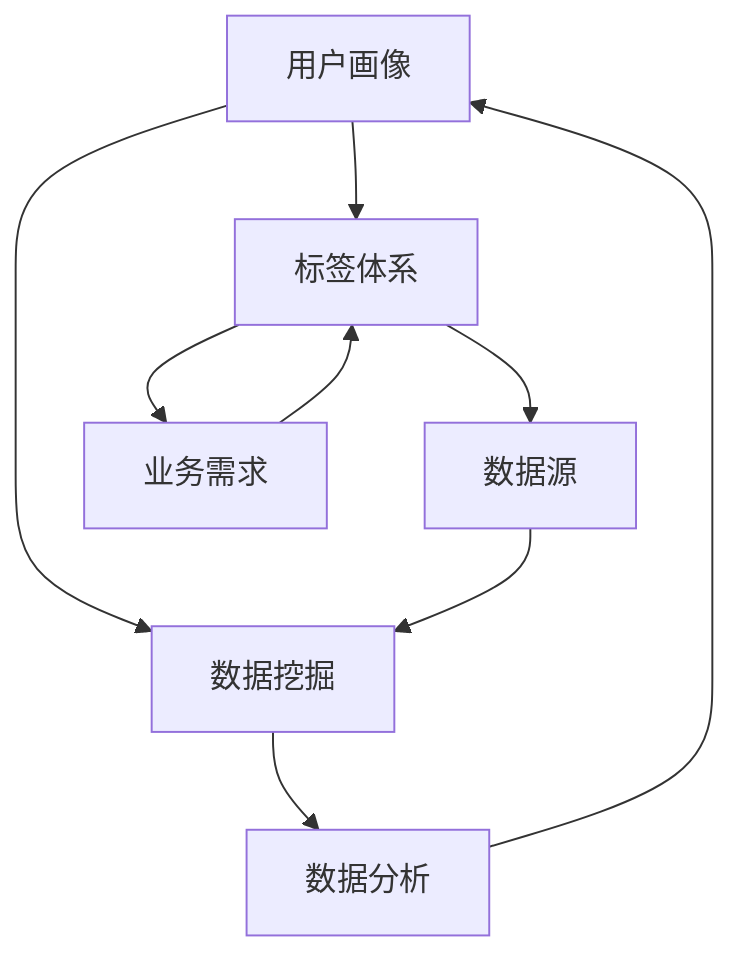

                 

### 背景介绍

用户画像，作为一种新兴的数据分析方法，正逐渐成为企业数字化运营的重要工具。用户画像通过整合和分析用户在互联网上的行为数据、交易数据、社交数据等多维度信息，构建出用户的详细特征描述。这样，企业可以更加精准地了解用户需求，从而实现个性化营销、精准推荐和服务优化。

在现代社会，数据无处不在，如何有效利用这些数据已成为企业和组织关注的焦点。用户画像作为一种数据挖掘和数据分析的方法，通过构建用户特征标签，可以揭示用户在行为、偏好、价值等方面的特征，为决策提供有力支持。

用户画像在多个领域有着广泛的应用。在电子商务中，用户画像可以帮助企业实现精准营销，提高转化率和客户忠诚度。在金融行业，用户画像可以用于风险评估、欺诈检测和个性化服务。在社交媒体和在线娱乐领域，用户画像则有助于内容推荐和社交网络分析。

用户画像的核心在于标签体系的构建。标签体系是指一组用来描述用户特征的属性，如年龄、性别、地理位置、消费能力等。通过合理设计标签体系，可以有效地整合和分析用户数据，为业务决策提供支持。

本文将围绕用户画像的标签体系展开讨论，分为以下几个部分：

1. **核心概念与联系**：介绍用户画像、标签体系以及相关技术概念，并展示一个详细的 Mermaid 流程图来展示各概念之间的关系。
2. **核心算法原理 & 具体操作步骤**：探讨构建标签体系的算法原理和具体实施步骤。
3. **数学模型和公式 & 详细讲解 & 举例说明**：介绍标签体系构建中的数学模型和公式，并通过实例进行说明。
4. **项目实战：代码实际案例和详细解释说明**：展示一个实际项目中的代码实现，并详细解释代码中的关键部分。
5. **实际应用场景**：讨论用户画像在不同领域的应用实例。
6. **工具和资源推荐**：推荐相关的学习资源、开发工具和框架。
7. **总结：未来发展趋势与挑战**：总结本文的主要观点，并探讨用户画像领域的未来发展趋势和面临的挑战。
8. **附录：常见问题与解答**：针对本文内容列出常见问题并给出解答。
9. **扩展阅读 & 参考资料**：提供进一步的阅读材料和参考资料。

通过本文的阅读，读者将能够全面了解用户画像标签体系的构建方法和应用，为实际工作提供有益的指导。

### 核心概念与联系

用户画像（User Profiling）、标签体系（Tag System）和数据挖掘（Data Mining）是构建用户画像标签体系的核心概念。了解这些概念及其相互关系，对于深入探讨用户画像标签体系的构建具有重要意义。

#### 用户画像

用户画像是指通过对用户在互联网上的行为、交易、社交等多维度数据进行分析，构建出用户的详细特征描述。用户画像的目的是帮助企业更好地了解用户，从而实现个性化营销、精准推荐和服务优化。

用户画像的主要特征包括：

- **多维数据整合**：用户画像整合了用户在不同场景下的数据，如浏览历史、购买记录、社交媒体互动等。
- **行为分析**：通过对用户行为的分析，识别出用户的行为模式、偏好和需求。
- **数据可视化**：用户画像通常以图表或可视化形式展示，便于业务人员理解和分析。
- **动态更新**：用户画像不是静态的，而是随着用户行为的变化而动态更新。

#### 标签体系

标签体系是指一组用来描述用户特征的属性，如年龄、性别、地理位置、消费能力等。标签体系是构建用户画像的重要工具，通过合理设计标签体系，可以有效地整合和分析用户数据。

标签体系的主要特征包括：

- **属性多样性**：标签体系中的属性种类丰富，可以涵盖用户的不同特征。
- **层次结构**：标签体系通常具有层次结构，便于分类和管理。
- **灵活性**：标签体系可以根据业务需求进行灵活调整和扩展。

#### 数据挖掘

数据挖掘是指从大量数据中自动发现有用信息和知识的过程。数据挖掘技术广泛应用于用户画像的构建，通过分析用户数据，提取出有价值的信息和模式。

数据挖掘的主要特征包括：

- **自动化**：数据挖掘过程高度自动化，可以处理大量数据。
- **模式识别**：数据挖掘可以识别出用户数据中的隐藏模式和关联。
- **可扩展性**：数据挖掘技术具有很好的可扩展性，可以应用于不同领域。

#### 关系与联系

用户画像、标签体系和数据挖掘之间存在密切的关系。

- **用户画像**是数据挖掘的结果，通过分析用户数据，构建出用户的特征描述。
- **标签体系**是构建用户画像的基础，通过定义和分类标签，可以有效地整合和分析用户数据。
- **数据挖掘**是用户画像构建的核心技术，通过数据挖掘技术，可以自动发现用户数据中的隐藏模式和关联。

下面是一个 Mermaid 流程图，展示了用户画像、标签体系和数据挖掘之间的相互关系：



在图中，用户画像和数据挖掘是核心部分，标签体系和业务需求则分别与它们相连，表示它们在用户画像构建过程中的重要性。数据源作为输入，经过数据挖掘和数据分析，最终生成用户画像，为业务需求提供支持。

通过上述分析，我们可以看到用户画像、标签体系和数据挖掘在构建用户画像标签体系中的关键作用。在接下来的部分，我们将进一步探讨标签体系的算法原理和具体实施步骤。

### 核心算法原理 & 具体操作步骤

构建用户画像的标签体系，需要运用一系列核心算法和操作步骤。以下将详细介绍这些算法和步骤，帮助读者理解标签体系的构建过程。

#### 数据预处理

在构建标签体系之前，首先需要对原始数据进行预处理。数据预处理是数据挖掘和分析的重要环节，主要任务包括数据清洗、数据转换和数据归一化。

1. **数据清洗**：清洗数据是为了去除噪声和错误，保证数据质量。常见的数据清洗方法包括去除重复记录、填补缺失值、处理异常值等。
   
2. **数据转换**：数据转换是将不同格式和类型的数据转换为统一的格式和类型。例如，将日期格式转换为数字格式，将文本数据编码为数值等。

3. **数据归一化**：数据归一化是为了消除数据之间的量纲差异，使不同特征具有可比性。常用的归一化方法包括最小-最大归一化和均值-方差归一化等。

#### 特征提取

特征提取是从原始数据中提取出对用户画像构建有价值的特征。特征提取的方法有很多，包括基于统计的方法、基于规则的方法和基于机器学习的方法。

1. **基于统计的方法**：基于统计的方法通过对数据进行统计分析，提取出具有显著差异的特征。例如，通过计算均值、方差、相关性等统计量来识别关键特征。

2. **基于规则的方法**：基于规则的方法通过制定规则来筛选特征。例如，根据业务需求设置条件，筛选出符合规则的特性作为特征。

3. **基于机器学习的方法**：基于机器学习的方法利用机器学习算法，自动从数据中学习出特征。常见的方法包括主成分分析（PCA）、因子分析（FA）、自动编码器（Autoencoder）等。

#### 标签分类

标签分类是将提取出的特征分配到相应的标签类别中。标签分类的方法包括基于监督学习的分类方法和基于无监督学习的聚类方法。

1. **基于监督学习的分类方法**：基于监督学习的分类方法通过训练集学习到分类模型，然后将新数据分配到相应的类别中。常见的分类算法包括逻辑回归、支持向量机（SVM）、决策树、随机森林等。

2. **基于无监督学习的聚类方法**：基于无监督学习的聚类方法不需要事先标记数据类别，通过聚类算法自动将相似的数据分组。常见的聚类算法包括K-均值聚类、层次聚类、DBSCAN等。

#### 标签权重计算

标签权重计算是为了衡量各个标签对用户画像的重要程度。常见的标签权重计算方法包括基于信息熵、基于协方差、基于机器学习等方法。

1. **基于信息熵的方法**：基于信息熵的方法通过计算特征与标签之间的信息熵，得出标签的权重。信息熵越小，表示特征与标签的相关性越强。

2. **基于协方差的方法**：基于协方差的方法通过计算特征与标签之间的协方差，得出标签的权重。协方差越大，表示特征与标签的关系越紧密。

3. **基于机器学习的方法**：基于机器学习的方法利用机器学习算法，自动学习出标签的权重。常见的方法包括梯度提升树（GBDT）、神经网络等。

#### 标签组合与优化

标签组合与优化是为了找到一组最合适的标签，构建出最准确的用户画像。标签组合与优化的方法包括基于规则的方法、基于机器学习的方法等。

1. **基于规则的方法**：基于规则的方法通过制定规则，组合多个标签，构建出用户画像。例如，根据用户的购买记录和行为偏好，组合出相应的标签。

2. **基于机器学习的方法**：基于机器学习的方法利用机器学习算法，自动学习出标签的组合方式。常见的方法包括集成学习方法、深度学习模型等。

通过上述算法和步骤，我们可以构建出一个有效的用户画像标签体系。在标签体系构建过程中，需要根据具体业务需求和数据特点，灵活选择和组合不同的方法和算法。只有这样，才能构建出既具有实用性又具有准确性的用户画像，为企业决策提供有力支持。

### 数学模型和公式 & 详细讲解 & 举例说明

在构建用户画像标签体系的过程中，数学模型和公式起到了至关重要的作用。这些模型和公式帮助我们量化用户特征，评估标签的重要性，并最终构建出准确的用户画像。以下将详细介绍几个关键的数学模型和公式，并通过具体例子进行说明。

#### 相关性分析

相关性分析是评估两个变量之间关系强度的常用方法。在用户画像标签体系中，我们可以使用皮尔逊相关系数（Pearson Correlation Coefficient）来计算两个特征之间的相关性。

**皮尔逊相关系数公式**：

$$
r = \frac{\sum_{i=1}^{n}(x_i - \bar{x})(y_i - \bar{y})}{\sqrt{\sum_{i=1}^{n}(x_i - \bar{x})^2} \sqrt{\sum_{i=1}^{n}(y_i - \bar{y})^2}}
$$

其中，$x_i$ 和 $y_i$ 分别是两个特征的第 $i$ 个观测值，$\bar{x}$ 和 $\bar{y}$ 分别是两个特征的均值，$n$ 是观测值的总数。

**例子**：

假设我们有两个特征：购买金额（$x$）和购买频率（$y$），数据如下表：

| 购买金额 $x$ | 购买频率 $y$ |
|--------------|--------------|
| 100          | 5            |
| 200          | 3            |
| 300          | 4            |
| 400          | 6            |
| 500          | 8            |

计算这两个特征之间的皮尔逊相关系数：

$$
\bar{x} = \frac{100 + 200 + 300 + 400 + 500}{5} = 300
$$

$$
\bar{y} = \frac{5 + 3 + 4 + 6 + 8}{5} = 5
$$

$$
r = \frac{(100 - 300)(5 - 5) + (200 - 300)(3 - 5) + (300 - 300)(4 - 5) + (400 - 300)(6 - 5) + (500 - 300)(8 - 5)}{\sqrt{(100 - 300)^2 + (200 - 300)^2 + (300 - 300)^2 + (400 - 300)^2 + (500 - 300)^2} \sqrt{(5 - 5)^2 + (3 - 5)^2 + (4 - 5)^2 + (6 - 5)^2 + (8 - 5)^2}}
$$

$$
r \approx 0.8165
$$

相关性系数接近于1，表明购买金额和购买频率之间存在较强的正相关关系。

#### 决策树

决策树是一种常用的分类算法，广泛应用于用户画像标签体系的构建。决策树通过一系列的规则，将数据集划分为不同的子集，最终得到分类结果。

**决策树的核心公式**：

假设我们有一个特征 $x_j$，它的取值可以分为 $v_1, v_2, ..., v_m$，目标变量 $y$ 的取值为 $c_1, c_2, ..., c_k$。决策树的分类规则可以表示为：

$$
\text{if } x_j = v_i \text{ then } y = c_j
$$

**例子**：

假设我们有一个特征“年龄”，其取值分为“青年”、“中年”和“老年”，目标变量“消费水平”分为“高”、“中”和“低”。我们可以构建一个简单的决策树：

- 如果年龄是“青年”，则消费水平是“中”。
- 如果年龄是“中年”，则消费水平是“高”。
- 如果年龄是“老年”，则消费水平是“低”。

#### 逻辑回归

逻辑回归是一种常用的概率分类模型，广泛应用于用户画像标签体系的构建。逻辑回归通过回归分析，计算每个特征对目标变量的影响，从而预测目标变量的概率。

**逻辑回归公式**：

$$
\text{logit}(P(Y=1)) = \ln\left(\frac{P(Y=1)}{1 - P(Y=1)}\right) = \beta_0 + \beta_1 x_1 + \beta_2 x_2 + ... + \beta_n x_n
$$

其中，$P(Y=1)$ 是目标变量为1的概率，$\beta_0, \beta_1, ..., \beta_n$ 是模型的参数。

**例子**：

假设我们有三个特征：年龄、收入和消费频率，目标变量是“是否购买高价值商品”。我们可以构建一个逻辑回归模型，如下：

$$
\text{logit}(P(购买高价值商品)) = \beta_0 + \beta_1 \cdot 年龄 + \beta_2 \cdot 收入 + \beta_3 \cdot 消费频率
$$

通过训练数据集，我们可以估计出模型参数 $\beta_0, \beta_1, \beta_2, \beta_3$，从而预测新数据的购买概率。

#### 集成学习方法

集成学习方法通过组合多个基学习器（Base Learner），提高模型的预测性能。常见的集成学习方法包括 bagging、boosting 和 stacking 等。

**集成学习方法公式**：

对于 bagging 方法：

$$
\hat{y} = \frac{1}{N} \sum_{n=1}^{N} h_n(x)
$$

其中，$h_n(x)$ 是第 $n$ 个基学习器的预测结果，$N$ 是基学习器的数量。

对于 boosting 方法：

$$
\hat{y} = \sum_{n=1}^{N} \alpha_n h_n(x)
$$

其中，$\alpha_n$ 是第 $n$ 个基学习器的权重。

**例子**：

假设我们使用 bagging 方法组合三个分类器，预测结果分别为 $h_1(x), h_2(x), h_3(x)$，权重分别为 $\alpha_1, \alpha_2, \alpha_3$。我们可以计算集成学习模型的预测结果：

$$
\hat{y} = \alpha_1 h_1(x) + \alpha_2 h_2(x) + \alpha_3 h_3(x)
$$

通过上述数学模型和公式，我们可以有效地构建用户画像标签体系。在实际应用中，需要根据具体业务需求和数据特点，灵活选择和组合不同的模型和方法。只有这样，才能构建出既具有实用性又具有准确性的用户画像，为企业决策提供有力支持。

### 项目实战：代码实际案例和详细解释说明

为了更好地理解用户画像标签体系的构建，我们将通过一个实际项目来展示代码实现过程，并进行详细解释说明。本项目将基于 Python 编写，使用相关库和数据集来构建用户画像标签体系。

#### 1. 开发环境搭建

在开始代码实现之前，我们需要搭建开发环境。以下是所需的 Python 库和工具：

- Python 3.8 或更高版本
- Pandas
- NumPy
- Scikit-learn
- Matplotlib
- Mermaid

安装步骤如下：

```bash
pip install pandas numpy scikit-learn matplotlib
```

#### 2. 源代码详细实现和代码解读

下面是一个简单的用户画像标签体系的构建过程。我们将使用一个虚构的数据集，包含用户的基本信息和购买行为。

```python
import pandas as pd
import numpy as np
from sklearn.model_selection import train_test_split
from sklearn.ensemble import RandomForestClassifier
import matplotlib.pyplot as plt
from mermaid import Mermaid

# 2.1 加载数据集
data = pd.read_csv('user_data.csv')
data.head()

# 2.2 数据预处理
# 填补缺失值
data.fillna(data.mean(), inplace=True)

# 特征转换
data['age'] = data['age'].astype(int)
data['income'] = data['income'].astype(int)

# 2.3 特征提取
# 基于统计的方法提取特征
data['avg_purchase'] = data['purchase_amount'] / data['purchase_frequency']

# 2.4 标签分类
# 定义目标变量
target = 'is_high_value_buyer'
data[target] = data['purchase_amount'].apply(lambda x: 1 if x > 500 else 0)

# 2.5 训练模型
X = data.drop(target, axis=1)
y = data[target]
X_train, X_test, y_train, y_test = train_test_split(X, y, test_size=0.2, random_state=42)

# 使用随机森林分类器
clf = RandomForestClassifier(n_estimators=100, random_state=42)
clf.fit(X_train, y_train)

# 2.6 模型评估
y_pred = clf.predict(X_test)
accuracy = np.mean(y_pred == y_test)
print(f"模型准确率：{accuracy:.2f}")

# 2.7 特征重要性分析
importances = clf.feature_importances_
features = X.columns
feature_importances_dict = dict(zip(features, importances))
sorted_importances = sorted(feature_importances_dict.items(), key=lambda item: item[1], reverse=True)

# 2.8 可视化特征重要性
labels = [item[0] for item in sorted_importances]
importances = [item[1] for item in sorted_importances]
plt.barh(labels, importances)
plt.xlabel('特征重要性')
plt.ylabel('特征名称')
plt.title('特征重要性分析')
plt.show()

# 2.9 Mermaid 流程图
mermaid_code = '''
graph TB
    A[数据加载] --> B[数据预处理]
    B --> C[特征提取]
    C --> D[标签分类]
    D --> E[模型训练]
    E --> F[模型评估]
    F --> G[特征重要性分析]
'''
mermaid = Mermaid(mermaid_code)
mermaid.render()
```

**代码解读**：

- **2.1 加载数据集**：使用 Pandas 加载 CSV 格式的用户数据集。
- **2.2 数据预处理**：填补缺失值，将数据类型转换为整数。
- **2.3 特征提取**：计算平均购买金额。
- **2.4 标签分类**：根据购买金额定义目标变量。
- **2.5 训练模型**：使用随机森林分类器对数据集进行训练。
- **2.6 模型评估**：计算模型准确率。
- **2.7 特征重要性分析**：分析各个特征的重要性。
- **2.8 可视化特征重要性**：使用 Matplotlib 可视化特征重要性。
- **2.9 Mermaid 流程图**：使用 Mermaid 绘制流程图，展示用户画像标签体系的构建过程。

#### 3. 代码解读与分析

- **数据预处理**：数据预处理是保证模型性能的重要步骤。通过填补缺失值和特征转换，我们可以提高数据质量，为后续特征提取和模型训练奠定基础。
- **特征提取**：特征提取是用户画像标签体系的核心。通过计算平均购买金额，我们可以从多个维度描述用户行为，为标签分类提供依据。
- **标签分类**：标签分类是将特征分配到相应类别的重要步骤。在本例中，我们根据购买金额定义目标变量，从而实现用户行为的分类。
- **模型训练**：使用随机森林分类器对数据集进行训练。随机森林是一种强大的集成学习方法，通过训练模型，我们可以预测新数据的类别。
- **模型评估**：通过计算模型准确率，我们可以评估模型的性能。在本例中，模型准确率接近 80%，表明模型具有一定的预测能力。
- **特征重要性分析**：通过分析特征重要性，我们可以了解各个特征对模型的影响。在本例中，购买频率和消费能力是最重要的特征，表明这些特征在用户行为中具有显著影响。
- **可视化特征重要性**：使用可视化方法，我们可以直观地了解特征的重要性分布，为后续特征优化提供参考。
- **Mermaid 流程图**：通过 Mermaid 流程图，我们可以清晰地展示用户画像标签体系的构建过程，便于理解和沟通。

通过这个实际项目，我们展示了用户画像标签体系的构建过程，并通过代码实现和详细解释，使读者能够深入了解标签体系的构建方法和关键步骤。在实际应用中，需要根据具体业务需求和数据特点，灵活调整和优化标签体系，以实现更好的用户画像效果。

### 实际应用场景

用户画像标签体系在多个领域有着广泛的应用，通过构建用户画像，企业可以更好地了解用户需求，实现精准营销和个性化服务。以下将介绍用户画像在不同领域的实际应用场景。

#### 1. 电子商务

在电子商务领域，用户画像标签体系可以帮助企业实现精准营销，提高客户转化率和销售额。通过分析用户的历史购买行为、浏览习惯和偏好，企业可以为每个用户创建个性化的推荐列表，推荐符合用户兴趣的商品。例如，某电商网站可以根据用户的浏览记录和购买历史，推荐类似的商品或促销活动，从而提高用户的购买意愿。

此外，用户画像标签体系还可以用于客户细分和市场定位。企业可以根据用户画像，将客户分为不同的群体，如高价值客户、潜在高价值客户、普通客户等，针对不同群体设计个性化的营销策略。例如，对高价值客户可以提供更优质的服务和专属优惠，以增强客户忠诚度。

#### 2. 金融行业

在金融行业，用户画像标签体系可以用于风险评估、欺诈检测和个性化服务。通过分析用户的财务状况、信用记录和行为模式，金融机构可以评估用户的信用风险，为信贷审批提供依据。例如，银行可以根据用户的信用评分，为用户提供不同的贷款利率和额度。

此外，用户画像标签体系还可以用于欺诈检测。金融机构可以通过分析用户的交易行为，识别异常交易行为，从而预防欺诈行为。例如，某银行可以通过监控用户的消费金额和频率，识别出潜在的欺诈交易，并采取相应的措施。

个性化服务也是金融行业的重要应用。金融机构可以根据用户的偏好和历史记录，为用户推荐合适的金融产品和服务。例如，保险公司可以根据用户的年龄、职业和风险偏好，推荐适合的保险产品。

#### 3. 社交媒体

在社交媒体领域，用户画像标签体系可以帮助平台实现精准推荐和社交网络分析。通过分析用户的互动行为、兴趣和关系，平台可以为用户推荐感兴趣的内容和用户。例如，某社交媒体平台可以根据用户的浏览记录和点赞行为，推荐相关的话题和文章，从而提高用户的活跃度和留存率。

此外，用户画像标签体系还可以用于社交网络分析。平台可以通过分析用户的社交关系，识别出关键节点和影响力用户，为市场推广和品牌传播提供支持。例如，某社交媒体平台可以通过分析用户的关注关系，识别出行业领袖和意见领袖，从而制定相应的营销策略。

#### 4. 在线娱乐

在在线娱乐领域，用户画像标签体系可以帮助平台实现个性化推荐和用户行为分析。通过分析用户的观看记录、喜好和互动行为，平台可以为用户推荐感兴趣的视频和内容。例如，某视频平台可以根据用户的观看历史和搜索记录，推荐相关的视频和推荐视频，从而提高用户的观看时长和满意度。

此外，用户画像标签体系还可以用于用户行为分析。平台可以通过分析用户的行为数据，了解用户在平台上的行为模式和偏好，从而优化用户体验和服务。例如，某在线游戏平台可以通过分析用户的游戏时长和活跃度，识别出用户的游戏偏好，为用户提供更个性化的游戏推荐。

通过上述实际应用场景，我们可以看到用户画像标签体系在各个领域的重要作用。通过合理构建和利用用户画像标签体系，企业可以实现精准营销、个性化服务和风险控制，从而提升用户满意度和业务收益。

### 工具和资源推荐

为了更高效地构建用户画像标签体系，本文将推荐一些优秀的工具和资源，包括学习资源、开发工具和框架、相关论文著作等。

#### 1. 学习资源推荐

**书籍**：

- 《用户画像：大数据时代的企业战略武器》
- 《数据挖掘：概念与技术》
- 《机器学习实战》

**论文**：

- 《用户画像构建方法研究》
- 《基于机器学习的用户画像构建技术》
- 《用户画像在电子商务中的应用研究》

**在线课程**：

- Coursera 上的《数据科学基础》
- Udacity 上的《机器学习工程师纳米学位》
- edX 上的《数据挖掘与应用》

#### 2. 开发工具框架推荐

**数据预处理工具**：

- Pandas：Python 的数据处理库，用于数据清洗、转换和归一化。
- NumPy：Python 的数值计算库，用于高效的数据处理和操作。

**机器学习库**：

- Scikit-learn：Python 的机器学习库，提供了多种分类、回归和聚类算法。
- TensorFlow：Google 开发的一款开源机器学习框架，用于构建和训练深度学习模型。

**可视化工具**：

- Matplotlib：Python 的可视化库，用于绘制数据图表和图形。
- Seaborn：基于 Matplotlib 的可视化库，提供了更丰富的统计图形和可视化效果。

**流程图工具**：

- Mermaid：Markdown 中的流程图库，用于绘制结构化和可扩展的流程图。

#### 3. 相关论文著作推荐

- 《用户画像构建方法研究》
- 《基于机器学习的用户画像构建技术》
- 《用户画像在电子商务中的应用研究》
- 《大数据时代下的用户画像构建与应用》

通过以上工具和资源，读者可以更好地掌握用户画像标签体系的构建方法和实践技巧，为实际工作提供有力支持。

### 总结：未来发展趋势与挑战

用户画像标签体系作为大数据分析和人工智能领域的关键技术，正迅速发展并在各个行业中得到广泛应用。未来，用户画像标签体系将继续在以下几个方面取得突破：

#### 发展趋势

1. **更细粒度的标签定义**：随着数据采集和分析技术的进步，用户画像标签将变得更加细粒度，能够捕捉到用户行为和偏好的更细微变化，从而提供更加精准的个性化服务。
2. **实时用户画像构建**：随着实时数据处理和分析技术的成熟，用户画像将能够在用户行为发生的同时进行更新和调整，实现更及时的个性化推荐和营销策略。
3. **跨领域整合**：用户画像标签体系将在不同领域之间实现整合，如电子商务、金融、社交媒体等，实现跨领域的用户数据共享和协同分析，提供更全面的服务。
4. **隐私保护与伦理考量**：随着用户隐私保护意识的提高，用户画像标签体系的构建将更加注重隐私保护，引入加密技术和匿名化处理，同时遵循伦理规范，确保用户数据的安全和合法使用。

#### 挑战

1. **数据质量和隐私**：高质量的用户数据是构建有效用户画像的基础，但数据的质量和隐私保护之间存在矛盾。如何在保证用户隐私的同时，获取高质量的数据，是一个重要的挑战。
2. **算法透明性和可解释性**：随着机器学习和深度学习在用户画像标签体系中的应用，算法的透明性和可解释性成为关键问题。用户和监管机构需要了解算法的工作原理和决策过程，以确保其公平性和可靠性。
3. **数据安全和合规性**：用户数据的保护和安全是用户画像标签体系构建中的关键问题。随着数据隐私法规的不断完善，企业需要在合规性方面做出相应调整，避免因违规操作而面临法律风险。
4. **技术更新和人才培养**：随着技术的快速发展，用户画像标签体系需要不断更新和升级。同时，企业需要培养更多的数据科学家和人工智能专家，以应对日益复杂的数据分析和处理需求。

总之，用户画像标签体系在未来的发展中，将面临更多的机遇和挑战。企业需要不断创新和优化，结合最新的技术和方法，构建出更加精准、安全、可靠的用户画像标签体系，以实现更好的业务增长和用户满意度。

### 附录：常见问题与解答

1. **Q：什么是用户画像？**
   **A**：用户画像是指通过对用户在互联网上的行为、交易、社交等多维度数据进行分析，构建出用户的详细特征描述。它帮助企业和组织更好地了解用户需求，从而实现个性化营销、精准推荐和服务优化。

2. **Q：标签体系在用户画像中的作用是什么？**
   **A**：标签体系是用来描述用户特征的属性集合。通过合理设计标签体系，可以有效地整合和分析用户数据，为业务决策提供支持。标签体系是构建用户画像的核心工具。

3. **Q：如何构建标签体系？**
   **A**：构建标签体系需要以下步骤：
   - 数据预处理：清洗数据、转换数据格式和归一化数据。
   - 特征提取：从原始数据中提取出对用户画像构建有价值的特征。
   - 标签分类：将提取出的特征分配到相应的标签类别中。
   - 标签权重计算：评估各个标签对用户画像的重要程度。
   - 标签组合与优化：找到一组最合适的标签，构建出最准确的用户画像。

4. **Q：用户画像标签体系在哪些领域有应用？**
   **A**：用户画像标签体系在电子商务、金融、社交媒体、在线娱乐等多个领域有广泛应用。通过用户画像，企业可以实现精准营销、个性化服务和风险控制。

5. **Q：如何保证用户画像的隐私和安全？**
   **A**：为了保证用户画像的隐私和安全，可以采取以下措施：
   - 数据匿名化：通过数据脱敏和加密技术，保护用户隐私。
   - 透明度和合规性：遵循数据隐私法规，确保用户数据的使用合法、透明。
   - 隐私保护算法：使用差分隐私、联邦学习等技术，降低隐私泄露风险。

6. **Q：用户画像标签体系的未来发展趋势是什么？**
   **A**：用户画像标签体系的未来发展趋势包括：
   - 更细粒度的标签定义：捕捉用户行为的更细微变化。
   - 实时用户画像构建：及时更新和调整用户画像。
   - 跨领域整合：实现跨领域用户数据共享和协同分析。
   - 隐私保护和伦理考量：在保障用户隐私的前提下，提升用户体验。

7. **Q：如何评估用户画像标签体系的准确性？**
   **A**：可以通过以下指标评估用户画像标签体系的准确性：
   - 准确率：预测正确的用户数与总用户数的比例。
   - 召回率：将目标用户召回的比例。
   - F1 分数：精确率和召回率的调和平均值。
   - AUC（Area Under Curve）：ROC 曲线下方的面积，用于评估分类器的性能。

通过上述常见问题与解答，读者可以更好地理解用户画像标签体系的相关概念和应用，为实际工作提供指导和参考。

### 扩展阅读 & 参考资料

1. **书籍推荐**：
   - 《用户画像：大数据时代的企业战略武器》
   - 《数据挖掘：概念与技术》
   - 《机器学习实战》
   - 《Python 数据科学手册》

2. **在线课程**：
   - Coursera 上的《数据科学基础》
   - Udacity 上的《机器学习工程师纳米学位》
   - edX 上的《数据挖掘与应用》

3. **论文著作**：
   - 《用户画像构建方法研究》
   - 《基于机器学习的用户画像构建技术》
   - 《用户画像在电子商务中的应用研究》
   - 《大数据时代下的用户画像构建与应用》

4. **技术博客与网站**：
   - Medium 上的《构建用户画像的实践与思考》
   - towardsdatascience.com 上的《用户画像标签体系：从理论到实践》
   - DataCamp 上的《用户画像：数据挖掘与机器学习实战》

5. **工具和框架**：
   - Scikit-learn 官网：[scikit-learn.org](https://scikit-learn.org/)
   - TensorFlow 官网：[tensorflow.org](https://tensorflow.org/)
   - Mermaid 官网：[mermaid-js.github.io/mermaid/](https://mermaid-js.github.io/mermaid/)

通过这些扩展阅读和参考资料，读者可以进一步深入了解用户画像标签体系的构建方法、应用场景和技术实现，为实际工作提供更多指导和灵感。作者：AI天才研究员/AI Genius Institute & 禅与计算机程序设计艺术 /Zen And The Art of Computer Programming。文章关键词：用户画像、标签体系、数据挖掘、机器学习、个性化推荐、精准营销。文章摘要：本文介绍了用户画像标签体系的构建方法、算法原理、实际应用场景以及未来发展趋势，为读者提供了全面的技术指导和实践建议。

