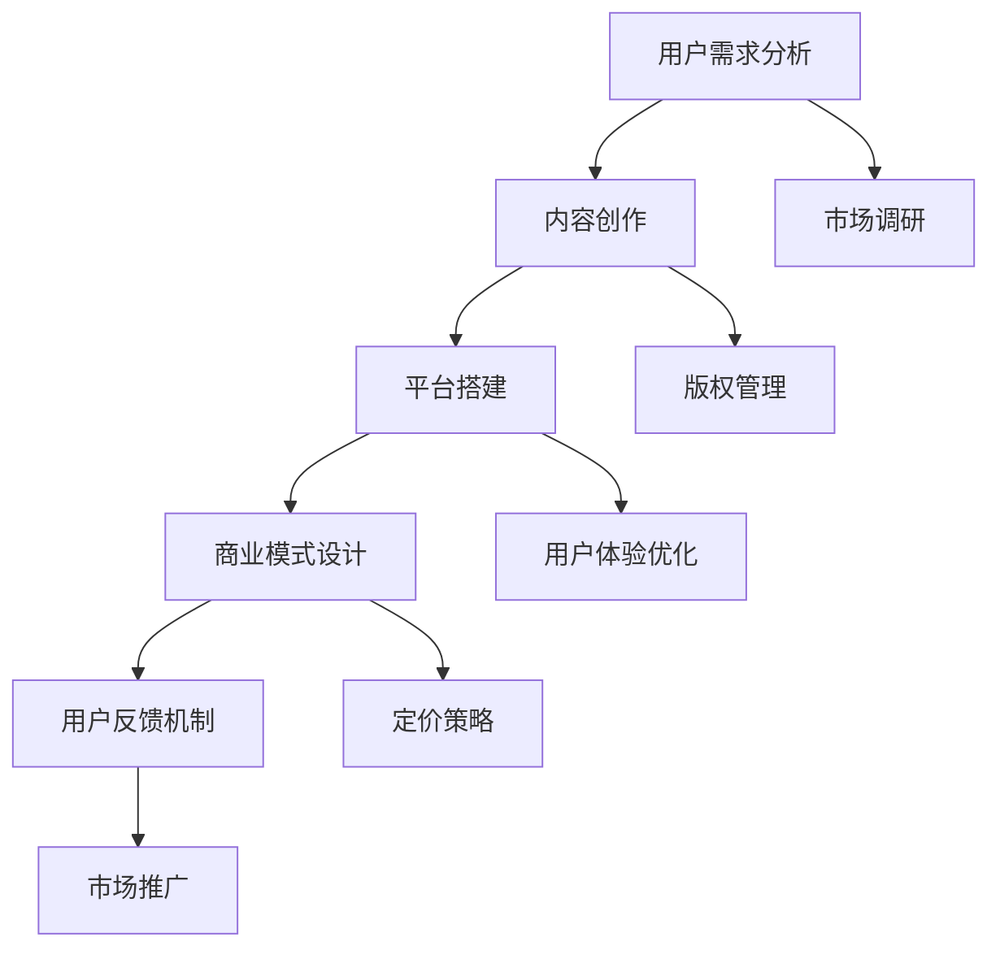

                 

# 构建知识付费MVP：快速验证商业模式

## 摘要

在当今知识爆炸的时代，知识付费作为一种新兴的商业模式，逐渐成为众多企业和个人追求的利润增长点。本文将详细探讨如何构建知识付费的最小可行产品（MVP），并通过快速验证商业模式，确保产品的成功发布和市场接受度。本文将从背景介绍、核心概念与联系、核心算法原理、数学模型和公式、项目实战、实际应用场景、工具和资源推荐以及总结未来发展趋势与挑战等多个角度，逐步分析构建知识付费MVP的各个环节，帮助读者深入了解这一领域的本质和操作要点。

## 1. 背景介绍

随着互联网的普及和知识共享理念的推广，知识付费逐渐成为市场经济中的一种重要形式。知识付费的核心在于将专业知识、经验和技能转化为可交易的产品或服务，通过线上平台向用户进行销售。这种方式不仅满足了用户对高质量知识的渴求，也为内容创作者提供了新的收入来源。

知识付费的发展历程可以分为以下几个阶段：

- **1.1. 传统付费时代**：最初的知识付费形式主要是线上课程、电子书籍等，用户通过付费购买获取内容。

- **1.2. 平台化发展**：随着平台经济的崛起，知识付费逐渐形成了以各大知识分享平台为核心的模式，如网易云课堂、知乎Live、得到等。

- **1.3. 社群经济崛起**：近年来，知识付费更多地与社群经济相结合，通过建立付费社群，实现知识的深度交流与互动。

当前，知识付费市场呈现出以下几个特点：

- **1.4. 多样化的内容形式**：从最初的单向知识传播，发展到如今的多媒体互动、直播、问答等多种形式。

- **1.5. 强调个性化和定制化**：用户对知识的需求越来越多样化，个性化、定制化的知识产品受到青睐。

- **1.6. 产业链日趋完善**：知识付费产业链涉及内容创作、平台运营、用户服务等多个环节，各个环节之间相互协同，形成完整的商业生态。

## 2. 核心概念与联系

构建知识付费MVP的核心概念包括：用户需求分析、内容创作、平台搭建、商业模式设计、用户反馈机制等。以下是一个简单的Mermaid流程图，展示了这些核心概念之间的联系：



### 2.1. 用户需求分析

用户需求分析是构建知识付费MVP的第一步，它决定了产品是否能够满足目标用户的需求。通过市场调研、用户访谈、问卷调查等方式，了解用户对知识内容的需求、偏好和使用场景，是构建MVP的基础。

### 2.2. 内容创作

内容创作是知识付费的核心，它决定了产品的价值。优秀的内容创作者能够根据用户需求，创作出高质量、有价值的内容。内容的形式可以多样化，包括文章、视频、直播、音频等。

### 2.3. 平台搭建

平台搭建是知识付费MVP的技术实现，它需要考虑用户界面、内容管理系统、支付系统、用户反馈系统等多个方面。一个好的平台能够提供流畅的用户体验，提高用户满意度。

### 2.4. 商业模式设计

商业模式设计决定了知识付费MVP的盈利模式。常见的商业模式包括订阅制、一次性购买、会员制等。在设计商业模式时，需要考虑内容定价、市场推广、渠道拓展等多个方面。

### 2.5. 用户反馈机制

用户反馈机制是知识付费MVP持续改进的关键。通过用户反馈，了解用户对产品的使用体验、内容满意度等方面，及时调整产品和服务，提高用户满意度。

## 3. 核心算法原理 & 具体操作步骤

构建知识付费MVP需要一系列技术手段来支撑。以下是核心算法原理和具体操作步骤的概述：

### 3.1. 数据分析算法

数据分析算法用于用户需求分析和市场调研。常见的算法包括：

- **用户画像**：通过用户行为数据，构建用户画像，了解用户的基本特征、兴趣偏好等。
- **文本分析**：通过自然语言处理技术，分析用户评论、反馈等文本数据，提取关键信息和情感倾向。

### 3.2. 内容推荐算法

内容推荐算法用于内容创作和平台搭建。常见的算法包括：

- **协同过滤**：通过用户的历史行为数据，发现相似用户，推荐他们喜欢的内容。
- **基于内容的推荐**：根据内容的特征，如关键词、标签、分类等，推荐相似的内容。

### 3.3. 支付结算算法

支付结算算法用于平台搭建和商业模式设计。常见的算法包括：

- **安全加密**：保障用户支付信息的安全。
- **结算清算**：根据用户支付行为，进行实时结算和清算。

### 3.4. 用户反馈分析算法

用户反馈分析算法用于用户反馈机制。常见的算法包括：

- **文本分类**：将用户反馈文本分类为正面、负面等不同类型，了解用户的满意度。
- **情感分析**：通过自然语言处理技术，分析用户反馈的情感倾向，了解用户的心理状态。

## 4. 数学模型和公式 & 详细讲解 & 举例说明

### 4.1. 用户画像模型

用户画像模型是基于用户行为数据构建的数学模型，用于分析用户的基本特征和兴趣偏好。以下是用户画像模型的一个简化版本：

$$
用户画像 = f(用户行为数据, 用户属性数据)
$$

其中，用户行为数据包括用户浏览记录、购买记录、互动记录等；用户属性数据包括年龄、性别、职业、地理位置等。

### 4.2. 内容推荐模型

内容推荐模型是基于用户行为和内容特征构建的数学模型，用于推荐用户可能感兴趣的内容。以下是一个简化版的内容推荐模型：

$$
推荐内容 = f(用户画像, 内容特征, 推荐算法)
$$

其中，用户画像和内容特征用于输入推荐算法，推荐算法根据输入生成推荐内容。

### 4.3. 支付结算模型

支付结算模型是基于用户支付行为构建的数学模型，用于实现支付结算功能。以下是一个简化版的支付结算模型：

$$
支付金额 = f(购买数量, 单价, 折扣率)
$$

其中，购买数量、单价和折扣率是影响支付金额的主要因素。

### 4.4. 用户反馈分析模型

用户反馈分析模型是基于用户反馈文本构建的数学模型，用于分析用户的满意度。以下是一个简化版的用户反馈分析模型：

$$
满意度评分 = f(用户反馈文本, 情感分析模型)
$$

其中，用户反馈文本通过情感分析模型处理，得到满意度评分。

## 5. 项目实战：代码实际案例和详细解释说明

### 5.1. 开发环境搭建

在进行知识付费MVP的项目实战之前，我们需要搭建一个合适的技术环境。以下是一个基于Python的简单开发环境搭建步骤：

1. 安装Python：从官网下载并安装Python 3.x版本。
2. 安装Jupyter Notebook：在终端执行`pip install jupyter`安装Jupyter Notebook。
3. 安装相关库：根据项目需求，安装必要的Python库，如`numpy`、`pandas`、`scikit-learn`等。

### 5.2. 源代码详细实现和代码解读

以下是一个基于用户画像和内容推荐的项目实战案例：

#### 5.2.1. 用户画像

```python
import pandas as pd

# 加载用户行为数据
user_data = pd.read_csv('user_behavior_data.csv')

# 构建用户画像
user_profiles = user_data.groupby('user_id').agg({
    'content_id': 'count',
    'click': 'mean',
    'purchase': 'mean',
    'rating': 'mean'
})

user_profiles
```

#### 5.2.2. 内容推荐

```python
from sklearn.metrics.pairwise import cosine_similarity

# 加载内容特征数据
content_data = pd.read_csv('content_data.csv')

# 计算内容特征矩阵
content_features = content_data.set_index('content_id').iloc[:, 1:].T

# 计算内容之间的余弦相似度
cosine_sim = cosine_similarity(content_features)

# 根据用户画像和内容相似度推荐内容
def recommend_content(user_profile, cosine_sim, content_data, top_n=5):
    similarity_scores = {}
    for idx, row in content_data.iterrows():
        similarity_scores[idx] = cosine_sim[user_profile.index, content_data.index[idx]]
    
    sorted_scores = sorted(similarity_scores.items(), key=lambda x: x[1], reverse=True)
    return [content_data['content_id'][idx] for idx, _ in sorted_scores[:top_n]]

# 推荐内容
user_id = 1001
recommended_content = recommend_content(user_profiles[user_id], cosine_sim, content_data)

recommended_content
```

#### 5.2.3. 代码解读与分析

上述代码展示了如何使用Python实现用户画像和内容推荐功能。首先，我们加载用户行为数据，并使用Pandas进行数据预处理，构建用户画像。然后，我们计算内容特征矩阵，并使用余弦相似度算法计算内容之间的相似度。最后，根据用户画像和内容相似度，推荐用户可能感兴趣的内容。

## 6. 实际应用场景

知识付费MVP在实际应用中，可以应用于多种场景，以下是一些典型的应用场景：

- **6.1. 在线教育**：知识付费MVP可以用于构建在线教育平台，提供各类课程和教学资源。
- **6.2. 专业咨询**：知识付费MVP可以提供专业咨询服务，如法律咨询、财务咨询等。
- **6.3. 知识分享**：知识付费MVP可以构建知识分享平台，鼓励用户分享知识和经验。
- **6.4. 企业培训**：知识付费MVP可以用于为企业提供定制化的培训服务。
- **6.5. 专业知识库**：知识付费MVP可以构建专业知识库，为用户提供专业的知识查询和检索服务。

## 7. 工具和资源推荐

### 7.1. 学习资源推荐

- **书籍**：《深度学习》、《Python数据科学手册》、《统计学习方法》
- **论文**：《知识付费用户行为分析》、《内容推荐系统技术研究》
- **博客**：《机器学习之心》、《Python数据科学》
- **网站**：GitHub、arXiv、知乎

### 7.2. 开发工具框架推荐

- **开发环境**：Jupyter Notebook、PyCharm
- **数据分析库**：Pandas、NumPy
- **机器学习库**：scikit-learn、TensorFlow
- **自然语言处理库**：NLTK、spaCy

### 7.3. 相关论文著作推荐

- **论文**：《Knowledge Graph in E-commerce Platform: A Survey》、《Collaborative Filtering for Personalized Recommendation on Large-scale Knowledge Graph》
- **著作**：《推荐系统实践》、《深度学习与推荐系统》

## 8. 总结：未来发展趋势与挑战

知识付费作为一种新兴的商业模式，正逐渐成熟并呈现出广阔的发展前景。未来，知识付费将在以下几个方面呈现出发展趋势：

- **8.1. 内容多样化**：知识付费将更加注重内容的多样化和个性化，满足用户多样化的需求。
- **8.2. 社群化运营**：知识付费将更加注重社群化运营，通过建立用户社群，提高用户粘性和互动性。
- **8.3. 产业链整合**：知识付费产业链将更加整合，涉及内容创作、平台运营、用户服务等多个环节，形成完整的商业生态。

然而，知识付费也面临着一些挑战：

- **8.4. 内容质量控制**：如何保证内容质量，提高用户满意度，是知识付费平台面临的主要挑战。
- **8.5. 用户隐私保护**：在知识付费过程中，用户隐私保护成为重要议题，需要采取有效的技术和管理措施。
- **8.6. 商业模式创新**：如何在激烈的市场竞争中脱颖而出，需要不断创新商业模式，提高竞争力。

## 9. 附录：常见问题与解答

### 9.1. 如何进行用户需求分析？

进行用户需求分析通常包括以下几个步骤：

1. **市场调研**：通过问卷调查、访谈等方式收集用户需求信息。
2. **数据分析**：对收集到的数据进行整理和分析，提取用户需求的关键特征。
3. **用户画像**：根据数据分析结果，构建用户画像，了解用户的基本特征和需求偏好。
4. **反馈机制**：通过用户反馈，持续优化和调整用户需求分析结果。

### 9.2. 如何设计知识付费的商业模式？

设计知识付费的商业模式通常包括以下几个步骤：

1. **市场定位**：明确知识付费的目标市场和用户群体。
2. **内容定位**：根据市场定位，确定知识付费的内容类型和特色。
3. **商业模式选择**：根据内容特点和市场需求，选择合适的商业模式，如订阅制、一次性购买、会员制等。
4. **定价策略**：根据成本和市场定位，制定合理的定价策略。
5. **市场推广**：通过线上线下渠道，推广知识付费产品，提高市场知名度。

### 9.3. 如何进行内容推荐？

进行内容推荐通常包括以下几个步骤：

1. **数据收集**：收集用户行为数据和内容特征数据。
2. **数据处理**：对数据进行清洗和预处理，构建用户画像和内容特征矩阵。
3. **推荐算法选择**：根据数据和业务需求，选择合适的推荐算法，如协同过滤、基于内容的推荐等。
4. **模型训练与优化**：使用推荐算法对数据进行训练，并不断优化模型效果。
5. **推荐结果生成**：根据用户画像和内容特征，生成推荐结果，推送给用户。

## 10. 扩展阅读 & 参考资料

- **书籍**：
  - 《深度学习》（Ian Goodfellow、Yoshua Bengio、Aaron Courville著）
  - 《Python数据科学手册》（Jake VanderPlas著）
  - 《统计学习方法》（李航著）

- **论文**：
  - 《Knowledge Graph in E-commerce Platform: A Survey》（IEEE论文）
  - 《Collaborative Filtering for Personalized Recommendation on Large-scale Knowledge Graph》（ACM论文）

- **博客**：
  - 《机器学习之心》
  - 《Python数据科学》

- **网站**：
  - GitHub
  - arXiv
  - 知乎

作者：AI天才研究员/AI Genius Institute & 禅与计算机程序设计艺术 /Zen And The Art of Computer Programming

本文为作者独立创作，未经授权，禁止转载。如需转载，请联系作者获得授权。

