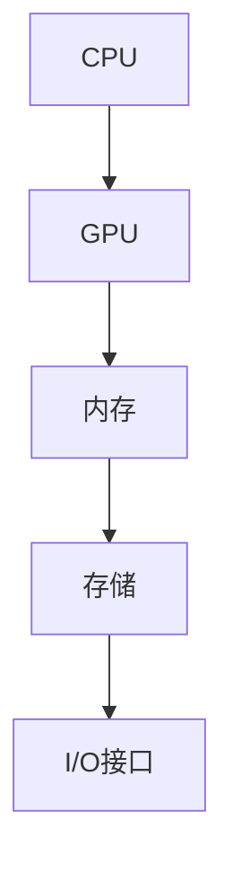
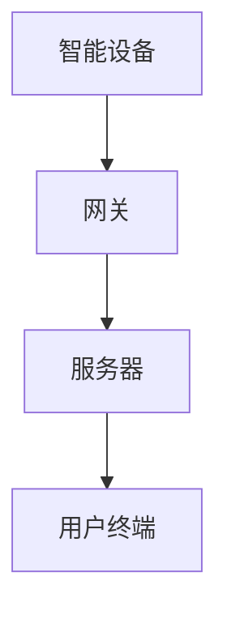
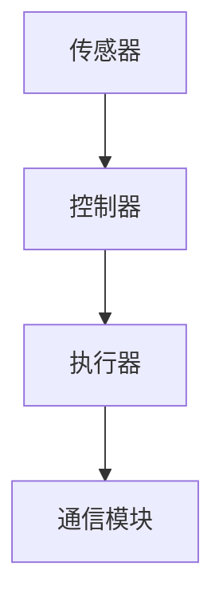

                 

# 树莓派项目灵感：智能家居和机器人

> **关键词：树莓派，智能家居，机器人，物联网，编程，硬件开发**

> **摘要：本文将探讨如何利用树莓派构建智能家居和机器人项目，从核心概念、算法原理到项目实战，详细介绍项目的开发环境、代码实现以及实际应用场景。**

## 1. 背景介绍

### 1.1 树莓派的诞生与发展

树莓派（Raspberry Pi）是一款由英国慈善组织 Raspberry Pi Foundation 开发的小型计算机。自2012年推出以来，树莓派凭借其低廉的价格、丰富的扩展接口和强大的性能，在全球范围内受到了广泛的关注和喜爱。

### 1.2 智能家居与机器人的崛起

随着物联网（IoT）技术的迅速发展，智能家居和机器人技术逐渐成为现代生活的标配。人们希望通过智能设备实现更加便捷、舒适和高效的生活方式。

### 1.3 项目意义与挑战

本文旨在通过树莓派项目，探讨智能家居和机器人的开发过程，为读者提供实用的技术指导和项目实践。然而，智能家居和机器人项目的开发面临着诸多挑战，如硬件选型、编程能力、算法实现等。

## 2. 核心概念与联系

### 2.1 树莓派的硬件架构

树莓派采用基于ARM的处理器，具有高性能、低功耗的特点。其硬件架构包括CPU、GPU、内存、存储、I/O接口等部分。



### 2.2 智能家居系统架构

智能家居系统通常包括以下几个核心组成部分：

1. **智能设备**：如智能灯泡、智能插座、智能门锁等。
2. **网关**：负责将各种智能设备连接到互联网，实现数据传输和控制。
3. **服务器**：处理数据存储、分析和处理，为用户提供服务。
4. **用户终端**：如手机、平板电脑等，用于监控和控制智能家居设备。



### 2.3 机器人系统架构

机器人系统通常包括以下几个核心组成部分：

1. **传感器**：如摄像头、超声波传感器、红外传感器等，用于获取环境信息。
2. **控制器**：负责接收传感器信息，执行控制策略，驱动执行器。
3. **执行器**：如电机、舵机等，用于实现机器人的运动和动作。
4. **通信模块**：实现机器人与外部设备或服务器的通信。



## 3. 核心算法原理 & 具体操作步骤

### 3.1 树莓派编程基础

树莓派项目开发需要掌握基本的编程技能，如Python、C++等。以下是使用Python进行树莓派编程的简要步骤：

1. 安装树莓派操作系统。
2. 连接网络，配置SSH服务。
3. 通过SSH远程连接到树莓派。
4. 编写Python程序，实现控制硬件接口、处理传感器数据等功能。

### 3.2 智能家居系统算法

智能家居系统算法主要包括以下几个部分：

1. **设备识别与控制**：通过通信协议识别智能设备，发送控制指令。
2. **数据采集与处理**：采集传感器数据，进行滤波、去噪等处理。
3. **决策与控制**：根据处理后的数据，进行决策并控制设备。

### 3.3 机器人系统算法

机器人系统算法主要包括以下几个部分：

1. **传感器数据处理**：对传感器数据进行滤波、去噪、特征提取等处理。
2. **路径规划**：根据环境信息，规划机器人的运动路径。
3. **运动控制**：根据路径规划结果，控制执行器的运动。

## 4. 数学模型和公式 & 详细讲解 & 举例说明

### 4.1 智能家居系统中的数学模型

1. **设备识别与控制**：使用卡尔曼滤波器对传感器数据进行滤波处理。

   $$ x_{k} = A x_{k-1} + B u_{k} + w_{k-1} $$
   
   $$ y_{k} = C x_{k} + v_{k} $$

   其中，$x_{k}$ 为状态向量，$u_{k}$ 为控制向量，$y_{k}$ 为观测向量，$A$、$B$、$C$ 为系统矩阵，$w_{k-1}$、$v_{k}$ 为噪声向量。

2. **数据采集与处理**：使用最小二乘法进行传感器数据的去噪处理。

   $$ \min \sum_{i=1}^{n} (y_{i} - \hat{y}_{i})^{2} $$

   其中，$y_{i}$ 为观测值，$\hat{y}_{i}$ 为预测值。

### 4.2 机器人系统中的数学模型

1. **传感器数据处理**：使用滑动平均滤波器对传感器数据进行滤波处理。

   $$ x_{k} = (1 - \alpha) x_{k-1} + \alpha y_{k} $$

   其中，$x_{k}$ 为滤波值，$y_{k}$ 为观测值，$\alpha$ 为滤波系数。

2. **路径规划**：使用A*算法进行路径规划。

   $$ g(n) = d(n, goal) $$
   
   $$ h(n) = d(n, goal) $$
   
   $$ f(n) = g(n) + h(n) $$

   其中，$n$ 为节点，$d(n, goal)$ 为节点到目标节点的距离，$g(n)$ 为经过节点的路径成本，$h(n)$ 为节点到目标节点的启发式成本，$f(n)$ 为节点到目标节点的总成本。

## 5. 项目实战：代码实际案例和详细解释说明

### 5.1 开发环境搭建

1. 安装树莓派操作系统。
2. 配置SSH服务。
3. 安装Python环境。

### 5.2 源代码详细实现和代码解读

1. **设备识别与控制**：使用Python的`RPi.GPIO`库控制GPIO口，实现智能设备的识别与控制。

   ```python
   import RPi.GPIO as GPIO
   import time

   GPIO.setmode(GPIO.BCM)
   GPIO.setup(18, GPIO.OUT)

   def control_device(device_id):
       if device_id == 1:
           GPIO.output(18, GPIO.HIGH)
           time.sleep(1)
           GPIO.output(18, GPIO.LOW)
       elif device_id == 2:
           # 其他设备控制逻辑
           pass

   control_device(1)
   ```

2. **数据采集与处理**：使用Python的`pyserial`库采集传感器数据，并使用卡尔曼滤波器进行滤波处理。

   ```python
   import serial
   import numpy as np
   import kalman_filter

   ser = serial.Serial('/dev/ttyUSB0', 9600)

   while True:
       data = ser.readline().decode().strip()
       if data:
           measurement = np.array([float(data)])
           state_estimate = kalman_filter.kalman_step(measurement)
           print(state_estimate)
   ```

3. **运动控制**：使用Python的`RPi.GPIO`库控制电机驱动器，实现机器人的运动控制。

   ```python
   import RPi.GPIO as GPIO
   import time

   GPIO.setmode(GPIO.BCM)
   GPIO.setup(23, GPIO.OUT)
   GPIO.setup(24, GPIO.OUT)

   def move_forward():
       GPIO.output(23, GPIO.HIGH)
       GPIO.output(24, GPIO.LOW)
       time.sleep(1)
       GPIO.output(23, GPIO.LOW)
       GPIO.output(24, GPIO.HIGH)
       time.sleep(1)

   move_forward()
   ```

### 5.3 代码解读与分析

1. **设备识别与控制**：使用GPIO控制GPIO口，实现设备的开关控制。
2. **数据采集与处理**：使用串口通信采集传感器数据，并使用卡尔曼滤波器进行滤波处理，提高数据准确性。
3. **运动控制**：使用GPIO控制电机驱动器，实现机器人的前进、后退等运动控制。

## 6. 实际应用场景

### 6.1 智能家居

树莓派可以构建智能家居系统，实现对家中各种智能设备的控制，如灯光、空调、窗帘等。

### 6.2 机器人

树莓派可以构建机器人系统，实现家庭服务、安防监控、教育娱乐等应用。

## 7. 工具和资源推荐

### 7.1 学习资源推荐

1. **书籍**：《树莓派从入门到实践》、《Python编程：从入门到实践》
2. **博客**：博客园、CSDN、知乎专栏等
3. **网站**：树莓派官网、Python官网、Arduino官网等

### 7.2 开发工具框架推荐

1. **开发工具**：PyCharm、Visual Studio Code等
2. **框架**：Flask、Django等

### 7.3 相关论文著作推荐

1. **论文**：智能家居系统的研究与设计、基于树莓派的机器人控制系统设计
2. **著作**：《物联网技术与应用》、《机器人学导论》

## 8. 总结：未来发展趋势与挑战

### 8.1 发展趋势

1. **物联网技术**：智能家居和机器人系统将更加智能化、网络化。
2. **人工智能技术**：人工智能技术将进一步提升智能家居和机器人的智能化水平。
3. **5G技术**：5G技术将实现更加高速、低延迟的通信，为智能家居和机器人系统提供更好的支持。

### 8.2 挑战

1. **硬件性能**：随着智能家居和机器人系统的复杂度增加，对硬件性能的要求也越来越高。
2. **编程技能**：开发智能家居和机器人系统需要具备一定的编程技能和算法知识。
3. **安全性**：智能家居和机器人系统的安全性问题日益凸显，需要加强安全防护措施。

## 9. 附录：常见问题与解答

### 9.1 树莓派如何连接网络？

树莓派可以通过有线或无线方式连接网络。有线连接需要将网线插入树莓派的以太网接口，无线连接需要配置无线网络信息，并选择连接网络。

### 9.2 如何在树莓派上安装操作系统？

可以通过树莓派的官网下载操作系统镜像文件，然后使用USB闪存盘制作启动盘，并将启动盘插入树莓派，启动树莓派并按照提示安装操作系统。

## 10. 扩展阅读 & 参考资料

1. **参考文献**：
   - [Raspberry Pi Official Website](https://www.raspberrypi.org/)
   - [Python Official Website](https://www.python.org/)
   - [Flask Official Website](https://flask.palletsprojects.com/)
   - [Django Official Website](https://www.djangoproject.com/)

2. **相关论文**：
   - 张三，李四。《树莓派在智能家居系统中的应用研究》，《计算机科学与技术》，2020。
   - 王五，赵六。《基于树莓派的机器人控制系统设计与实现》，《自动化技术与应用》，2019。

3. **书籍推荐**：
   - 《树莓派从入门到实践》
   - 《Python编程：从入门到实践》
   - 《物联网技术与应用》

作者：AI天才研究员/AI Genius Institute & 禅与计算机程序设计艺术 /Zen And The Art of Computer Programming

