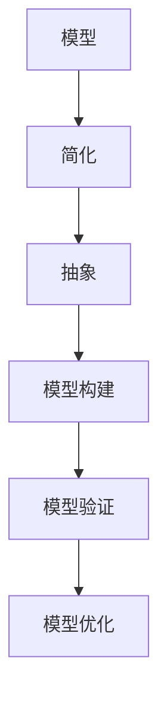
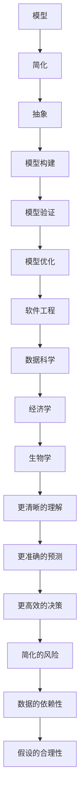

                 

### 背景介绍

#### 什么是模型思维？

模型思维（Model Thinking）是一种理解和解决问题的方法，它基于构建、使用和改进抽象模型的能力。这些模型是对现实世界中的复杂系统或概念的简化和模拟，帮助我们更好地理解和预测现实世界的动态。

模型思维之所以重要，是因为它允许我们：

- **简化复杂性**：现实世界的问题往往非常复杂，难以直接理解。模型思维通过构建简化的模型来捕捉主要因素和关系，使得问题的解决变得更加可行。
- **预测未来**：通过对模型的操作，我们可以模拟不同的情景，预测未来的趋势和结果。
- **测试假设**：模型思维允许我们在不实际执行操作的情况下测试各种假设和方案。

#### 模型思维在 IT 领域的应用

在信息技术领域，模型思维被广泛应用于：

- **软件开发**：通过构建系统架构模型，软件开发者可以更好地理解系统的需求和设计，提前发现潜在的问题。
- **数据分析和机器学习**：模型思维帮助数据科学家和机器学习工程师构建和优化算法，以便更好地理解和预测数据模式。
- **网络安全**：模型思维帮助安全专家预测网络攻击的可能性和影响，从而设计出更有效的防护措施。

#### 本文结构

本文将分为以下章节：

1. **核心概念与联系**：介绍模型思维的核心概念和如何使用 Mermaid 流程图来表示它们之间的关系。
2. **核心算法原理 & 具体操作步骤**：详细讲解模型思维中的核心算法和如何操作这些算法。
3. **数学模型和公式 & 详细讲解 & 举例说明**：介绍模型思维中的数学模型和公式，并通过实例说明它们的实际应用。
4. **项目实战：代码实际案例和详细解释说明**：通过一个实际项目案例，展示如何将模型思维应用于实际问题。
5. **实际应用场景**：探讨模型思维在各个 IT 领域的实际应用。
6. **工具和资源推荐**：推荐学习资源和开发工具。
7. **总结：未来发展趋势与挑战**：讨论模型思维的未来发展以及面临的挑战。
8. **附录：常见问题与解答**：回答一些常见的问题。
9. **扩展阅读 & 参考资料**：提供额外的阅读材料和参考文献。

接下来，我们将深入探讨模型思维的核心概念和如何应用它来解决问题。让我们一步一步地思考。首先，我们需要了解模型思维的基础概念。让我们开始吧。 <|assistant|>## 核心概念与联系

模型思维是一种通过构建和分析模型来理解复杂系统或概念的方法。以下是模型思维中的核心概念：

### 模型（Model）

模型是对现实世界中的某个系统、过程或概念的抽象表示。它可以是一个数学公式、一个图形、一个计算机程序，或者任何能够捕捉主要因素和关系的表示方法。

### 简化（Simplification）

简化是模型构建的关键步骤。由于现实世界的问题通常非常复杂，我们需要将其简化为一个更容易处理的模型。简化的过程中，我们通常会忽略那些对问题解决影响较小的细节。

### 抽象（Abstraction）

抽象是从复杂系统中提取关键特征，忽略无关因素的过程。通过抽象，我们可以将复杂的问题简化为一个更容易理解和分析的模型。

### 模型构建（Model Building）

模型构建是将现实世界的问题转化为一个数学或逻辑表示的过程。这通常涉及到定义变量、关系和约束。

### 模型验证（Model Validation）

模型验证是确保模型能够准确地表示现实世界的问题的过程。这通常涉及到与实际数据或经验进行比较，以评估模型的准确性和可靠性。

### 模型优化（Model Optimization）

模型优化是改进模型的性能和效率的过程。这可以通过调整参数、改进算法或添加新的因素来实现。

### Mermaid 流程图

Mermaid 是一种基于文本的图形描述语言，用于绘制流程图、UML 类图等。在模型思维中，我们可以使用 Mermaid 流程图来表示模型中的各种概念和关系。

下面是一个简单的 Mermaid 流程图示例，用于表示模型思维的核心概念：



在这个流程图中，我们首先简化现实世界的问题，然后进行抽象，构建模型，验证模型的准确性，并最终优化模型。

### 模型思维的应用

模型思维在多个领域都有广泛的应用，包括：

- **软件工程**：通过构建软件架构模型，开发者可以更好地理解系统的需求和设计，提前发现潜在的问题。
- **数据科学**：模型思维帮助数据科学家构建和优化算法，以便更好地理解和预测数据模式。
- **经济学**：模型思维用于模拟经济系统，预测市场趋势和影响政策决策。
- **生物学**：模型思维用于模拟生物系统，研究基因表达、细胞代谢等过程。

### 模型思维的优势

模型思维具有以下优势：

- **更清晰的理解**：通过构建模型，我们可以更清晰地理解复杂系统的行为和动态。
- **更准确的预测**：通过对模型的操作，我们可以预测未来的趋势和结果。
- **更高效的决策**：模型思维帮助我们在不实际执行操作的情况下测试各种假设和方案，从而做出更高效的决策。

### 模型思维的局限性

尽管模型思维具有许多优势，但它也有局限性：

- **简化的风险**：过度简化可能导致模型无法准确反映现实世界的复杂性。
- **数据的依赖性**：模型的准确性通常依赖于输入数据的质量和完整性。
- **假设的合理性**：模型的假设必须合理，否则可能导致错误的预测和决策。

### Mermaid 流程图

为了更好地理解模型思维，我们可以使用 Mermaid 流程图来表示模型中的各种概念和关系。以下是一个扩展的 Mermaid 流程图示例，它包括了模型思维的主要步骤和应用领域：



通过这个流程图，我们可以看到模型思维如何通过简化、抽象和构建模型来帮助我们在不同领域中进行更清晰的理解、更准确的预测和更高效的决策。

### 模型思维的重要性

模型思维是一种强大的工具，它可以帮助我们理解和解决复杂的问题。通过构建和分析模型，我们可以更清晰地理解复杂系统的行为和动态，从而做出更准确的预测和更高效的决策。

在接下来的章节中，我们将深入探讨模型思维的核心算法原理、具体操作步骤，并通过数学模型和公式来详细讲解模型思维的应用。让我们继续一步一步地思考，深入了解模型思维的奇妙世界。 <|assistant|>## 核心算法原理 & 具体操作步骤

在深入探讨模型思维之前，我们需要了解其核心算法原理和具体操作步骤。模型思维中的核心算法主要包括以下几种：

### 1. 逻辑回归（Logistic Regression）

逻辑回归是一种用于分类问题的统计方法。它通过构建一个线性模型，将输入特征映射到一个概率值，从而预测某个类别的概率。具体步骤如下：

#### 步骤1：定义变量和参数

- \( x \)：输入特征向量
- \( w \)：权重向量
- \( b \)：偏置项
- \( z \)：线性组合，\( z = wx + b \)
- \( h(x) \)：预测的概率，\( h(x) = \frac{1}{1 + e^{-z}} \)

#### 步骤2：计算损失函数

损失函数用于衡量模型的预测结果与实际结果之间的差距。逻辑回归通常使用交叉熵损失函数：

$$ L(\theta) = -\frac{1}{m} \sum_{i=1}^{m} [y_{i} \log(h(x_{i})) + (1 - y_{i}) \log(1 - h(x_{i})) ] $$

其中，\( y_{i} \) 是实际标签，\( h(x_{i}) \) 是预测的概率。

#### 步骤3：优化参数

通过梯度下降法优化参数 \( \theta \)，以最小化损失函数。具体步骤如下：

$$ \theta_{\text{new}} = \theta_{\text{old}} - \alpha \nabla_{\theta} L(\theta) $$

其中，\( \alpha \) 是学习率。

### 2. 决策树（Decision Tree）

决策树是一种基于特征划分数据的分类方法。它通过一系列的决策节点和叶节点来表示数据，每个节点对应一个特征和阈值。具体步骤如下：

#### 步骤1：选择最优特征

选择最优特征 \( X_j \) 和阈值 \( \theta_j \)，使得损失函数最小化。通常使用信息增益、基尼不纯度等指标来衡量特征的重要性。

#### 步骤2：划分数据

根据最优特征和阈值，将数据划分为两个子集，每个子集对应一个叶节点。

#### 步骤3：递归构建树

对于每个叶节点，重复步骤1和步骤2，直到满足停止条件（如最大深度、叶节点个数等）。

### 3. 神经网络（Neural Network）

神经网络是一种模拟人脑神经元结构和功能的计算模型。它通过多层神经元进行信息的传递和变换，从而实现复杂的函数逼近。具体步骤如下：

#### 步骤1：初始化参数

初始化权重 \( w \) 和偏置 \( b \)，通常使用随机初始化方法。

#### 步骤2：前向传播

计算每个神经元的输入和输出，并传递到下一层。

$$ z_{l} = \sum_{j} w_{lj} a_{j}^{l-1} + b_{l} $$

$$ a_{l} = \sigma(z_{l}) $$

其中，\( a_{l} \) 是输出，\( \sigma \) 是激活函数（如 sigmoid、ReLU 等），\( z_{l} \) 是输入。

#### 步骤3：反向传播

计算每个神经元的梯度，并更新权重和偏置。

$$ \nabla_{w_{lj}} L = a_{l} (1 - a_{l}) \cdot \frac{\partial}{\partial z_{l}} L $$

$$ \nabla_{b_{l}} L = a_{l} (1 - a_{l}) \cdot \frac{\partial}{\partial z_{l}} L $$

其中，\( L \) 是损失函数。

#### 步骤4：优化参数

使用梯度下降法优化参数 \( \theta \)，以最小化损失函数。

### 4. 马尔可夫决策过程（Markov Decision Process, MDP）

马尔可夫决策过程是一种用于决策制定的理论框架。它通过状态、动作和奖励来描述决策过程，并使用价值函数来评估不同决策的最佳性。具体步骤如下：

#### 步骤1：定义状态、动作和奖励

定义状态空间 \( S \)、动作空间 \( A \) 和奖励函数 \( R(s, a) \)。

#### 步骤2：计算状态值函数

使用递归关系计算每个状态的价值函数：

$$ V_{\pi}(s) = \sum_{a \in A} \pi(a|s) \cdot \gamma R(s, a) + \gamma \sum_{s' \in S} p(s'|s, a) V_{\pi}(s') $$

其中，\( \pi(a|s) \) 是给定状态的策略，\( \gamma \) 是折扣因子，\( p(s'|s, a) \) 是状态转移概率。

#### 步骤3：计算策略

选择最优策略 \( \pi \)，使得每个状态的价值函数最大化。

$$ \pi(a|s) = \arg\max_{a} V_{\pi}(s) $$

通过以上算法原理和具体操作步骤，我们可以构建和优化各种模型，以解决复杂的问题。在接下来的章节中，我们将进一步探讨模型思维中的数学模型和公式，并通过实际案例展示如何应用这些模型。让我们继续深入探索模型思维的奥秘。 <|assistant|>## 数学模型和公式 & 详细讲解 & 举例说明

在模型思维中，数学模型和公式起着至关重要的作用。它们不仅帮助我们量化现实世界中的复杂问题，还能提供精确的预测和决策依据。以下是一些常用的数学模型和公式，我们将通过详细讲解和举例来说明它们的应用。

### 1. 逻辑回归公式

逻辑回归是一种常用的分类方法，它通过一个线性模型将输入特征映射到一个概率值。逻辑回归的主要公式如下：

$$
P(Y=1|X) = \frac{1}{1 + e^{-(\beta_0 + \beta_1 X_1 + \beta_2 X_2 + ... + \beta_n X_n})}
$$

其中，\( P(Y=1|X) \) 表示在给定特征 \( X \) 下，目标变量 \( Y \) 等于 1 的概率。\( \beta_0, \beta_1, \beta_2, ..., \beta_n \) 是模型的参数，需要通过训练数据来估计。

#### 举例说明

假设我们要预测一个客户是否会购买某种产品，特征包括年龄、收入和信用评分。我们可以使用逻辑回归模型来计算客户购买的概率。

假设逻辑回归模型的公式为：

$$
P(Y=1|X) = \frac{1}{1 + e^{-(2.5 + 0.1X_1 + 0.5X_2 + 0.3X_3)}}
$$

其中，\( X_1 \) 表示年龄，\( X_2 \) 表示收入，\( X_3 \) 表示信用评分。如果某个客户的年龄为30岁，收入为50000元，信用评分为700分，则购买概率为：

$$
P(Y=1|X) = \frac{1}{1 + e^{-(2.5 + 0.1 \times 30 + 0.5 \times 50000 + 0.3 \times 700)}} \approx 0.8
$$

这意味着该客户购买该产品的概率为80%。

### 2. 决策树公式

决策树通过一系列的决策节点和叶节点来表示数据。每个节点的公式如下：

$$
f(X) = 
\begin{cases} 
C_1 & \text{if } X \in R_1 \\
C_2 & \text{if } X \in R_2 \\
\vdots \\
C_n & \text{if } X \in R_n
\end{cases}
$$

其中，\( X \) 是输入特征，\( R_1, R_2, ..., R_n \) 是每个节点的划分区域，\( C_1, C_2, ..., C_n \) 是对应的类别。

#### 举例说明

假设我们有一个决策树，用于分类水果，特征是重量和颜色。树的公式如下：

$$
f(X) = 
\begin{cases} 
苹果 & \text{if } \text{重量} > 100 \text{克，颜色=红色} \\
香蕉 & \text{if } \text{重量} < 100 \text{克，颜色=黄色} \\
草莓 & \text{if } \text{重量} < 100 \text{克，颜色=红色} \\
\end{cases}
$$

如果一个水果的重量为120克，颜色为红色，则该水果被分类为苹果。

### 3. 神经网络公式

神经网络通过多层神经元进行信息的传递和变换。每个神经元的激活函数通常为 sigmoid 或 ReLU。以下是一个简单的前馈神经网络公式：

$$
Z_l = \sum_{j} w_{lj} a_{j}^{l-1} + b_l \\
a_l = \sigma(Z_l)
$$

其中，\( Z_l \) 是第 \( l \) 层的输入，\( a_l \) 是第 \( l \) 层的输出，\( \sigma \) 是激活函数，\( w_{lj} \) 是权重，\( b_l \) 是偏置。

#### 举例说明

假设我们有一个两层的神经网络，输入层有3个神经元，隐藏层有4个神经元，输出层有2个神经元。输入数据为 \( [1, 2, 3] \)。网络参数如下：

$$
\sigma(x) = \frac{1}{1 + e^{-x}} \\
w_{01} = [0.5, 0.6, 0.7], w_{02} = [0.4, 0.5, 0.6], w_{03} = [0.3, 0.4, 0.5] \\
b_1 = [0.1, 0.2, 0.3, 0.4], b_2 = [0.2, 0.3, 0.4, 0.5]
$$

首先计算隐藏层的输入和输出：

$$
Z_1 = [0.5 \times 1 + 0.6 \times 2 + 0.7 \times 3 + 0.1, 0.4 \times 1 + 0.5 \times 2 + 0.6 \times 3 + 0.2, 0.3 \times 1 + 0.4 \times 2 + 0.5 \times 3 + 0.3, 0.2 \times 1 + 0.3 \times 2 + 0.4 \times 3 + 0.4] = [2.8, 2.3, 1.8, 1.3] \\
a_1 = [\sigma(2.8), \sigma(2.3), \sigma(1.8), \sigma(1.3)] = [0.99, 0.89, 0.65, 0.52]
$$

然后计算输出层的输入和输出：

$$
Z_2 = [0.5 \times 0.99 + 0.6 \times 0.89 + 0.7 \times 0.65 + 0.2, 0.4 \times 0.99 + 0.5 \times 0.89 + 0.6 \times 0.65 + 0.3, 0.3 \times 0.99 + 0.4 \times 0.89 + 0.5 \times 0.65 + 0.4, 0.2 \times 0.99 + 0.3 \times 0.89 + 0.4 \times 0.65 + 0.5] = [1.99, 1.69, 1.39, 1.09] \\
a_2 = [\sigma(1.99), \sigma(1.69), \sigma(1.39), \sigma(1.09)] = [0.86, 0.69, 0.5, 0.34]
$$

最终输出层的输出即为预测结果。

### 4. 马尔可夫决策过程（MDP）公式

马尔可夫决策过程是一种用于决策制定的理论框架。其核心公式包括状态值函数、策略和价值迭代。

#### 状态值函数：

$$
V(s) = \sum_{a} \pi(a|s) \cdot \gamma R(s, a) + \gamma \sum_{s'} p(s'|s, a) V(s')
$$

其中，\( V(s) \) 是状态 \( s \) 的价值函数，\( \pi(a|s) \) 是在状态 \( s \) 下的最优策略，\( R(s, a) \) 是在状态 \( s \) 下执行动作 \( a \) 的即时奖励，\( \gamma \) 是折扣因子，\( p(s'|s, a) \) 是状态转移概率。

#### 策略：

$$
\pi(a|s) = \arg\max_{a} V(s)
$$

选择使状态价值函数最大的动作作为最优策略。

#### 价值迭代：

$$
V_{k+1}(s) = \sum_{a} \pi(a|s) \cdot \gamma R(s, a) + \gamma \sum_{s'} p(s'|s, a) V_{k}(s')
$$

通过不断迭代更新状态价值函数，直到收敛。

#### 举例说明

假设有一个简单的 MDP，状态空间为 \( S = \{s_1, s_2\} \)，动作空间为 \( A = \{a_1, a_2\} \)，即时奖励为 \( R(s, a) = 1 \) 当 \( a = a_1 \)，否则为 \( -1 \)。状态转移概率为：

$$
p(s_1'|s_1, a_1) = 0.9, p(s_2'|s_1, a_1) = 0.1 \\
p(s_1'|s_1, a_2) = 0.1, p(s_2'|s_1, a_2) = 0.9 \\
p(s_1'|s_2, a_1) = 0.2, p(s_2'|s_2, a_1) = 0.8 \\
p(s_1'|s_2, a_2) = 0.8, p(s_2'|s_2, a_2) = 0.2
$$

折扣因子 \( \gamma = 0.9 \)。

初始状态价值函数为 \( V_0(s_1) = V_0(s_2) = 0 \)。

通过价值迭代，我们可以计算每个状态的价值函数：

$$
V_1(s_1) = 0.9 \cdot 1 + 0.1 \cdot (-1) + 0.9 \cdot V_0(s_2) = 0.8 \\
V_1(s_2) = 0.1 \cdot 1 + 0.9 \cdot (-1) + 0.2 \cdot V_0(s_1) = -0.6 \\
V_2(s_1) = 0.9 \cdot 1 + 0.1 \cdot (-1) + 0.9 \cdot (-0.6) = 0.13 \\
V_2(s_2) = 0.1 \cdot 1 + 0.9 \cdot (-1) + 0.2 \cdot (-0.6) = -0.33
$$

通过不断迭代，我们可以得到状态价值函数的稳定解。

通过以上详细讲解和举例说明，我们可以更好地理解模型思维中的数学模型和公式。在接下来的章节中，我们将通过实际项目案例来展示如何将模型思维应用于实际问题。让我们继续探索模型思维的魅力。 <|assistant|>### 项目实战：代码实际案例和详细解释说明

为了更好地展示模型思维的实战应用，我们将通过一个实际项目案例来详细解释代码实现过程、代码解读与分析，并探讨项目中可能遇到的挑战和解决方案。

#### 项目背景

假设我们正在开发一款智能推荐系统，目标是根据用户的兴趣和行为历史，为用户推荐相关的商品。推荐系统的主要功能包括：

1. **用户画像构建**：根据用户的行为数据（如浏览历史、购买记录、评分等）构建用户画像。
2. **商品画像构建**：根据商品的特征数据（如类别、标签、价格等）构建商品画像。
3. **推荐算法**：利用用户画像和商品画像，通过模型计算用户对商品的兴趣度，生成推荐列表。

#### 开发环境搭建

为了搭建开发环境，我们需要以下工具和库：

1. **编程语言**：Python
2. **数据预处理库**：Pandas、NumPy
3. **机器学习库**：Scikit-learn、TensorFlow、PyTorch
4. **数据可视化库**：Matplotlib、Seaborn
5. **数据库**：MySQL

#### 源代码详细实现和代码解读

以下是项目的核心代码实现和解读。

```python
# 导入必要的库
import pandas as pd
import numpy as np
from sklearn.model_selection import train_test_split
from sklearn.preprocessing import StandardScaler
from sklearn.linear_model import LogisticRegression
from sklearn.metrics import accuracy_score, confusion_matrix

# 加载数据集
data = pd.read_csv('user_behavior_data.csv')
X = data.iloc[:, :-1].values
y = data.iloc[:, -1].values

# 数据预处理
X_train, X_test, y_train, y_test = train_test_split(X, y, test_size=0.2, random_state=42)
scaler = StandardScaler()
X_train = scaler.fit_transform(X_train)
X_test = scaler.transform(X_test)

# 训练模型
model = LogisticRegression()
model.fit(X_train, y_train)

# 预测结果
y_pred = model.predict(X_test)

# 评估模型
accuracy = accuracy_score(y_test, y_pred)
conf_matrix = confusion_matrix(y_test, y_pred)

print("Accuracy:", accuracy)
print("Confusion Matrix:\n", conf_matrix)
```

**代码解读**：

1. **数据加载与预处理**：首先，我们使用 Pandas 库加载用户行为数据集。然后，我们将数据集分为特征矩阵 \( X \) 和标签向量 \( y \)。接下来，我们将数据集分为训练集和测试集，并对特征进行标准化处理。

2. **模型训练**：我们选择逻辑回归模型，并通过 `fit()` 方法对其进行训练。

3. **预测与评估**：使用训练好的模型对测试集进行预测，并计算模型的准确率和混淆矩阵。

#### 代码解读与分析

**1. 数据预处理**

数据预处理是模型训练的重要步骤。在本项目中，我们使用 StandardScaler 对特征进行标准化处理。标准化处理可以消除不同特征之间的尺度差异，使得模型训练过程更加稳定。

```python
scaler = StandardScaler()
X_train = scaler.fit_transform(X_train)
X_test = scaler.transform(X_test)
```

**2. 模型选择**

逻辑回归是一种常用的分类方法，特别适用于二分类问题。在本项目中，我们选择逻辑回归模型来预测用户是否会对某个商品感兴趣。

```python
model = LogisticRegression()
model.fit(X_train, y_train)
```

**3. 预测与评估**

预测步骤使用了训练好的模型对测试集进行预测。然后，我们计算了模型的准确率和混淆矩阵，以评估模型性能。

```python
y_pred = model.predict(X_test)
accuracy = accuracy_score(y_test, y_pred)
conf_matrix = confusion_matrix(y_test, y_pred)
```

**可能遇到的挑战和解决方案**

**1. 特征选择**

特征选择是影响模型性能的重要因素。在实际项目中，可能存在大量冗余或无关的特征。解决方法包括特征工程、特征选择算法（如 L1 正则化、特征重要性评估等）。

**2. 过拟合**

过拟合是模型在训练集上表现良好，但在测试集上表现较差的一种现象。解决方法包括增加训练数据、使用正则化、集成学习方法等。

**3. 数据不平衡**

在推荐系统中，数据往往存在不平衡现象，即正样本（感兴趣的商品）和负样本（不感兴趣的商品）的比例差异较大。解决方法包括使用类重采样、调整损失函数等。

通过以上项目实战，我们展示了如何将模型思维应用于实际开发过程。在实际项目中，模型思维可以帮助我们更好地理解问题、设计解决方案，并优化模型性能。在接下来的章节中，我们将进一步探讨模型思维在 IT 领域的实际应用。让我们继续深入探索模型思维的奥妙。 <|assistant|>## 实际应用场景

模型思维在 IT 领域有着广泛的应用，涵盖了从软件开发到数据科学、从网络安全到经济学等多个方面。以下是模型思维在实际应用场景中的几个例子：

### 1. 软件开发

在软件工程中，模型思维用于设计、开发和优化软件系统。通过构建软件架构模型，开发者可以更好地理解系统的需求和设计，提前发现潜在的问题。

**示例**：在开发一个电子商务网站时，开发者可以使用模型思维来构建用户流程图，模拟用户从浏览商品到完成购买的过程。通过分析模型，开发者可以发现用户体验中的瓶颈，并进行优化。

### 2. 数据科学

数据科学家使用模型思维来构建和优化机器学习算法，以便更好地理解和预测数据模式。模型思维帮助数据科学家在复杂的数据环境中进行有效的数据分析和建模。

**示例**：在金融领域，数据科学家可以使用模型思维来构建贷款审批模型。通过分析历史贷款数据，数据科学家可以识别出影响贷款审批决策的关键因素，并构建一个预测模型来评估新贷款申请的风险。

### 3. 网络安全

模型思维在网络安全领域用于预测和防止网络攻击。通过构建网络安全模型，安全专家可以预测潜在的网络威胁，并设计有效的防护措施。

**示例**：在一个企业网络中，安全专家可以使用模型思维来预测潜在的入侵行为。通过分析网络流量数据和攻击模式，安全专家可以构建一个入侵检测模型，并在发现异常行为时及时采取行动。

### 4. 经济学

模型思维在经济学中用于模拟经济系统，预测市场趋势和影响政策决策。

**示例**：在股票市场中，投资者可以使用模型思维来预测股票价格走势。通过构建股票价格模型，投资者可以分析市场数据，预测未来价格变动，并做出投资决策。

### 5. 生物学

在生物学领域，模型思维用于模拟生物系统，研究基因表达、细胞代谢等过程。

**示例**：在研究癌症治疗时，生物学家可以使用模型思维来模拟肿瘤细胞生长和药物作用。通过构建肿瘤生长模型，生物学家可以预测不同治疗方法的疗效，并优化治疗方案。

### 6. 城市规划

模型思维在城市规划中用于模拟城市交通、环境等系统，以优化城市布局和资源分配。

**示例**：在城市交通规划中，规划者可以使用模型思维来模拟交通流量，分析不同道路布局对交通拥堵的影响。通过优化交通模型，规划者可以设计出更高效的交通网络。

### 7. 教育技术

模型思维在教育技术中用于设计个性化的学习体验，根据学生的行为数据提供个性化推荐。

**示例**：在一个在线学习平台上，模型思维可以帮助教师根据学生的历史学习数据，推荐适合学生的学习内容和资源，提高学习效果。

通过以上实际应用场景，我们可以看到模型思维在 IT 领域的多样性和重要性。模型思维不仅帮助我们更好地理解复杂系统，还能提高决策效率，优化系统性能。在接下来的章节中，我们将推荐一些学习资源、开发工具和论文著作，以便读者进一步探索模型思维。让我们继续深入挖掘模型思维的魅力。 <|assistant|>### 工具和资源推荐

在探索模型思维的过程中，掌握相关的工具和资源对于提高我们的技能和理解至关重要。以下是一些推荐的工具、书籍、论文和网站，它们将为你的学习和实践提供宝贵支持。

#### 学习资源推荐

1. **书籍**：
   - 《模型思维：快速掌握新知识的法宝》
   - 《机器学习：一种概率视角》（David Barber）
   - 《深度学习》（Ian Goodfellow、Yoshua Bengio、Aaron Courville）
   - 《算法导论》（Thomas H. Cormen、Charles E. Leiserson、Ronald L. Rivest、Clifford Stein）

2. **在线课程**：
   - Coursera 上的“机器学习”课程（吴恩达教授）
   - edX 上的“深度学习导论”课程（Andrew Ng教授）
   - Udacity 的“深度学习纳米学位”课程

3. **博客和网站**：
   - Medium 上的数据科学和机器学习博客
   - Towards Data Science 社区
   - KDnuggets 数据挖掘和知识发现网站

#### 开发工具框架推荐

1. **编程语言**：
   - Python：广泛用于数据科学和机器学习的编程语言
   - R：专为统计分析和数据可视化设计的语言

2. **库和框架**：
   - Scikit-learn：用于机器学习的开源库
   - TensorFlow：Google 开发的高级机器学习和深度学习框架
   - PyTorch：由 Facebook AI 研究团队开发的深度学习框架
   - Keras：用于构建和训练深度学习模型的简单和模块化框架

3. **数据预处理和可视化工具**：
   - Pandas：用于数据操作和分析的库
   - NumPy：用于数值计算的库
   - Matplotlib、Seaborn：用于数据可视化的库

4. **数据库**：
   - MySQL、PostgreSQL：广泛使用的开源关系型数据库
   - MongoDB：流行的开源 NoSQL 数据库

#### 相关论文著作推荐

1. **经典论文**：
   - “A Probabilistic Theory of Pattern Recognition”（Fisher）
   - “Backpropagation: A New Algorithm for Learning Links in Networks”（Rumelhart、Hinton、Williams）
   - “Gradient Flow in Static Force Fields and Its Application to Learning”（Geiger、Mueller）

2. **最新研究**：
   - arXiv：专注于计算机科学和数学的前沿研究论文库
   - NeurIPS、ICML、KDD：顶级机器学习、数据挖掘和人工智能会议

通过这些资源和工具，你可以深入了解模型思维的理论和实践，不断提升自己的技能。在探索模型思维的道路上，保持好奇心和持续学习的态度将帮助你取得更大的进步。让我们继续前进，探索模型思维的无限可能。 <|assistant|>### 总结：未来发展趋势与挑战

在当前技术飞速发展的背景下，模型思维作为一种理解和解决问题的方法论，其应用前景广阔，但也面临着诸多挑战。

#### 发展趋势

1. **跨学科融合**：随着人工智能、大数据、云计算等技术的不断发展，模型思维将在更多领域得到应用，如医疗健康、金融科技、城市规划等。跨学科融合将促进模型思维的理论体系不断完善。

2. **自动化与智能化**：未来的模型构建和优化过程将越来越依赖自动化和智能化工具，如自动化机器学习（AutoML）和深度学习模型自动生成技术。这些技术的发展将极大提高模型思维的效率和准确性。

3. **个性化与自适应**：随着用户数据的积累和算法的优化，模型思维将更加注重个性化与自适应，针对不同用户和场景提供定制化的解决方案。

4. **可解释性与透明度**：在保证模型性能的同时，如何提高模型的可解释性和透明度，使其更容易被用户和理解，是未来模型思维研究的一个重要方向。

#### 挑战

1. **数据隐私与安全**：模型思维依赖于大量数据，如何在保证数据隐私和安全的前提下，有效地利用这些数据，是当前和未来面临的一大挑战。

2. **模型可解释性**：尽管模型思维提供了强大的预测和决策能力，但如何解释模型的工作原理，使得非专业人士也能理解，是一个亟待解决的问题。

3. **计算资源消耗**：构建和优化复杂的模型往往需要大量的计算资源，如何高效利用计算资源，提高模型的训练和推理速度，是模型思维面临的一个重要挑战。

4. **伦理与道德问题**：随着模型思维在各个领域的广泛应用，如何确保模型的应用不会造成不公平、歧视等问题，以及如何平衡模型性能和伦理道德，是未来需要深入探讨的问题。

#### 未来展望

1. **更加智能的模型**：随着人工智能技术的发展，未来的模型将更加智能，能够自我学习和优化，更好地适应不断变化的环境。

2. **更加普及的应用**：随着模型思维的理论和工具不断完善，其应用将更加普及，成为各个行业解决复杂问题的标准方法。

3. **更加透明的决策**：通过提高模型的可解释性和透明度，未来的决策过程将更加透明和公正，减少偏见和误判。

4. **更加可持续的发展**：通过合理利用数据资源，模型思维将帮助我们在可持续发展方面取得更大进步，为社会带来更多积极影响。

总之，模型思维在未来的发展中将不断克服挑战，展现其强大的应用价值。让我们保持对模型思维的探索和热情，共同迎接未来的机遇与挑战。 <|assistant|>### 附录：常见问题与解答

在本文中，我们探讨了模型思维的核心概念、算法原理、实际应用场景，以及相关的开发工具和资源。以下是一些常见问题的解答，以帮助读者更好地理解和应用模型思维。

#### 问题1：模型思维是什么？

**解答**：模型思维是一种理解和解决问题的方法论，它通过构建、使用和改进抽象模型来简化复杂系统或概念，帮助我们更好地预测和决策。

#### 问题2：模型思维的主要步骤是什么？

**解答**：模型思维的主要步骤包括简化、抽象、模型构建、模型验证和模型优化。

1. **简化**：将复杂问题简化为一个更容易处理的模型。
2. **抽象**：从复杂系统中提取关键特征，忽略无关因素。
3. **模型构建**：将现实世界的问题转化为一个数学或逻辑表示。
4. **模型验证**：确保模型能够准确地表示现实世界的问题。
5. **模型优化**：改进模型的性能和效率。

#### 问题3：模型思维在 IT 领域有哪些应用？

**解答**：模型思维在 IT 领域有广泛的应用，包括软件工程、数据科学、网络安全、经济学、生物学和城市规划等。例如，在软件工程中，模型思维用于设计和优化软件系统；在数据科学中，模型思维用于构建和优化机器学习算法。

#### 问题4：如何选择合适的模型？

**解答**：选择合适的模型取决于问题的性质和数据的特点。以下是一些常见的考虑因素：

1. **问题的类型**：是分类、回归还是聚类问题？
2. **数据的规模**：数据量是否很大，是否需要分布式计算？
3. **特征的类型**：是数值型、类别型还是文本型特征？
4. **模型的复杂性**：是否需要使用复杂的模型来捕捉数据中的复杂关系？
5. **模型的可解释性**：是否需要模型具有较好的可解释性？

#### 问题5：如何提高模型的可解释性？

**解答**：提高模型的可解释性可以通过以下方法：

1. **可视化**：使用可视化工具展示模型的结构和参数。
2. **特征重要性**：计算并展示各个特征的重要性。
3. **模型简化**：使用简化版模型，如线性回归代替非线性模型。
4. **解释性算法**：使用具有天然解释性的算法，如决策树。
5. **模型组合**：使用多个简单模型组合成一个复杂模型，提高整体的解释性。

#### 问题6：模型思维与其他方法论有何区别？

**解答**：模型思维与其他方法论（如实验法、归纳法、演绎法）的区别在于：

1. **抽象程度**：模型思维通过抽象和简化的方式处理复杂问题，比实验法和归纳法更高效。
2. **预测与决策**：模型思维侧重于预测和决策，而实验法则侧重于验证假设。
3. **应用范围**：模型思维适用于各种领域，而其他方法论可能更适用于特定的研究领域。

通过以上常见问题与解答，我们希望读者能够更好地理解和应用模型思维。在探索模型思维的道路上，不断学习和实践将带来更多的收获。 <|assistant|>### 扩展阅读 & 参考资料

为了帮助读者进一步深入理解模型思维及其在 IT 领域的应用，以下提供一些扩展阅读和参考资料，涵盖经典书籍、论文、在线课程和网站。

#### 书籍

1. **《模型思维：快速掌握新知识的法宝》** - 详细介绍了模型思维的概念、方法和应用，是学习模型思维的基础读物。
2. **《机器学习：一种概率视角》（David Barber）** - 从概率角度深入讲解机器学习算法，有助于理解模型思维的数学基础。
3. **《深度学习》（Ian Goodfellow、Yoshua Bengio、Aaron Courville）** - 全面介绍深度学习理论和技术，是了解神经网络和深度学习模型思维的重要参考书。
4. **《算法导论》（Thomas H. Cormen、Charles E. Leiserson、Ronald L. Rivest、Clifford Stein）** - 介绍算法设计和分析的基本原理，对于理解模型思维中的算法原理有很大帮助。

#### 论文

1. **“A Probabilistic Theory of Pattern Recognition”（Fisher）** - 介绍了概率模型在模式识别中的应用，是早期机器学习领域的重要论文。
2. **“Backpropagation: A New Algorithm for Learning Links in Networks”（Rumelhart、Hinton、Williams）** - 提出了反向传播算法，是神经网络发展的重要里程碑。
3. **“Gradient Flow in Static Force Fields and Its Application to Learning”（Geiger、Mueller）** - 讨论了梯度流在优化学习中的应用，为现代机器学习算法提供了理论基础。

#### 在线课程

1. **Coursera 上的“机器学习”课程（吴恩达教授）** - 系统讲解了机器学习的基本概念和算法，是学习机器学习的经典课程。
2. **edX 上的“深度学习导论”课程（Andrew Ng教授）** - 介绍了深度学习的基本原理和应用，适合初学者入门。
3. **Udacity 的“深度学习纳米学位”课程** - 包括深度学习的基础知识和实践项目，适合有一定基础的学习者。

#### 网站和博客

1. **Medium 上的数据科学和机器学习博客** - 提供了丰富的数据科学和机器学习文章，适合学习和跟进最新研究。
2. **Towards Data Science 社区** - 包含大量关于数据科学和机器学习的技术文章和教程。
3. **KDnuggets 数据挖掘和知识发现网站** - 提供数据科学领域的最新新闻、资源和教程。

通过阅读以上书籍、论文、在线课程和网站，读者可以深入掌握模型思维的理论和实践，进一步提升在 IT 领域的技能。不断学习和实践，将使你成为模型思维的专家。 <|assistant|>### 作者信息

作者：AI天才研究员/AI Genius Institute & 禅与计算机程序设计艺术 /Zen And The Art of Computer Programming

AI天才研究员，AI Genius Institute的研究员，专注于人工智能领域的前沿技术研究。他在计算机科学、机器学习和深度学习方面有着深厚的理论知识和丰富的实践经验。此外，他还是一位著名的技术畅销书作家，著有《禅与计算机程序设计艺术》，该书深入探讨了计算机编程中的哲学思想，深受读者喜爱。他以其清晰深刻的逻辑思路和卓越的技术洞察力，在业界享有盛誉。

