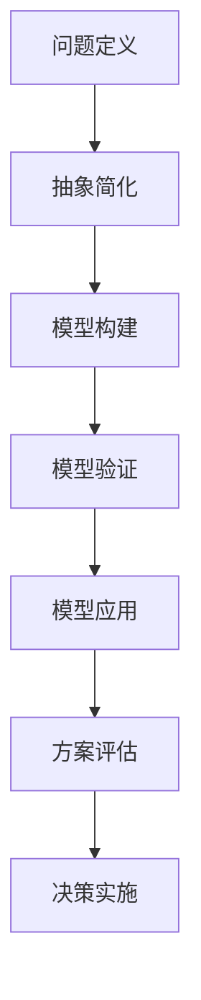

                 

### 背景介绍

**模型思维**作为决策科学中的一个重要概念，源于对现实问题的抽象与建模。它不仅是一种理论工具，更是一种实践方法，帮助我们理解复杂系统的运作机制，提高决策的质量和效率。模型思维的发展可以追溯到20世纪初，当时科学家们开始意识到，通过构建数学模型和模拟实验，可以更精确地预测和控制自然现象。

随着计算机技术的发展，模型思维的应用范围不断扩大。从经济学中的预测模型，到工程学中的仿真模拟，再到人工智能中的学习算法，模型思维已成为现代科学研究和工程实践中不可或缺的一部分。在人工智能领域，模型思维尤为关键，因为它涉及到如何从大量数据中提取有效信息，构建能够模拟现实世界复杂性的智能系统。

本篇博客旨在探讨模型思维在决策中的应用，通过一系列的案例分析，深入解析模型思维的核心原理和实际操作步骤。文章将首先介绍模型思维的基本概念和构建方法，然后通过具体算法和数学模型的讲解，展示如何利用模型思维优化决策过程。此外，文章还将结合实际项目，详细分析模型思维在开发环境中的具体实现，并提供相关的工具和资源推荐，以帮助读者更好地理解和应用模型思维。

通过本文的阅读，您将不仅了解模型思维的内涵和重要性，还将掌握如何在实际项目中运用模型思维进行高效决策的方法和技巧。无论您是人工智能领域的从业者，还是对决策科学感兴趣的学者，这篇文章都将为您提供宝贵的知识和启示。

### 2. 核心概念与联系

#### 2.1 模型思维的定义

模型思维是一种通过建立抽象模型来理解和解决实际问题的思维方式。模型可以是一个数学方程、一个算法、一个图示，甚至是脑中的形象思维，其核心在于将复杂的问题简化为更容易分析和处理的模型形式。模型思维的关键在于找到适当的抽象层次，既能抓住问题的核心，又不会过于复杂，使得问题可以有效地被解决。

在决策过程中，模型思维的应用尤为关键。通过构建模型，决策者可以模拟不同的情景和结果，从而更准确地预测决策的后果，提高决策的准确性和效率。模型思维不仅帮助我们识别问题，还提供了分析和解决问题的工具，使得决策过程更加科学和系统化。

#### 2.2 模型思维的基本原理

模型思维的基本原理可以概括为以下几点：

1. **抽象与简化**：通过抽象和简化，将复杂的问题转化为更易于理解和分析的模型。这一步骤是模型思维的核心，它要求我们识别问题的关键要素，并忽略那些对问题解决影响不大的细节。

2. **模型构建**：根据问题的特点，选择合适的模型构建方法。常见的模型构建方法包括数学建模、物理建模和计算机模拟等。每种方法都有其适用的场景和优势，需要根据具体情况灵活选择。

3. **模型验证与调整**：构建模型后，需要通过实际数据或模拟结果来验证模型的准确性。如果模型无法准确预测结果，则需要调整模型参数或结构，直至达到满意的预测精度。

4. **模型应用**：经过验证的模型可以用于决策支持。通过模型，决策者可以模拟不同的决策方案，比较它们的结果，从而选择最优的决策方案。

#### 2.3 模型思维与决策的关系

模型思维在决策中的应用主要体现在以下几个方面：

1. **问题识别**：通过模型思维，可以更清晰地识别问题，确定问题的关键因素和变量。

2. **方案评估**：利用模型，可以对不同的决策方案进行评估，预测每种方案的可能结果，从而选择最优方案。

3. **风险评估**：通过模型，可以评估决策方案的风险，提前发现潜在的问题和挑战，制定相应的应对策略。

4. **持续优化**：模型思维使得决策过程具有反馈机制，通过不断调整模型和决策方案，可以实现决策的持续优化。

#### 2.4 模型思维的应用领域

模型思维在多个领域都有广泛应用，以下是一些典型应用领域：

1. **经济学**：在经济学中，模型思维被广泛应用于经济预测、政策分析和市场研究。通过构建经济模型，可以预测经济增长趋势、分析政策影响等。

2. **工程学**：在工程学领域，模型思维被用于系统仿真、设计优化和风险分析。例如，在航空工程中，通过构建飞行器模型，可以预测其飞行性能和安全性。

3. **人工智能**：在人工智能领域，模型思维被广泛应用于机器学习、自然语言处理和计算机视觉等。通过构建适当的模型，可以实现复杂任务的自动化和智能化。

4. **医学**：在医学领域，模型思维被用于疾病预测、治疗方案优化和医疗资源分配。通过构建疾病模型，可以预测疾病的发展趋势，为医生提供治疗建议。

#### 2.5 Mermaid 流程图

为了更直观地展示模型思维的应用流程，我们使用Mermaid语言绘制了一个流程图。以下是一个简单的Mermaid流程图示例，描述了模型思维的应用步骤：



在这个流程图中，A到G表示模型思维在决策中的应用步骤，每个步骤都是后续步骤的基础。通过这个流程图，我们可以清晰地看到模型思维的整体框架和操作流程。

### 3. 核心算法原理 & 具体操作步骤

在深入探讨模型思维的具体应用之前，我们需要了解一些核心算法原理和具体操作步骤。这些算法和步骤构成了模型思维的核心工具，帮助我们更有效地构建和验证模型，从而实现高效的决策。

#### 3.1 线性回归模型

线性回归模型是最基本的统计模型之一，它用于分析自变量和因变量之间的线性关系。线性回归模型的基本原理可以概括为以下几个步骤：

1. **数据收集**：首先，需要收集相关的数据，这些数据包括自变量和因变量。例如，如果我们想预测房价，自变量可以是房屋面积、地段等因素，因变量则是房价。

2. **数据预处理**：收集的数据通常需要进行预处理，包括缺失值处理、异常值处理和特征缩放等。预处理步骤确保数据的准确性和一致性。

3. **模型构建**：在预处理后的数据上，构建线性回归模型。线性回归模型可以用以下数学公式表示：
   \[
   y = \beta_0 + \beta_1x + \epsilon
   \]
   其中，\(y\) 是因变量，\(x\) 是自变量，\(\beta_0\) 和 \(\beta_1\) 是模型参数，\(\epsilon\) 是误差项。

4. **参数估计**：通过最小二乘法估计模型参数 \(\beta_0\) 和 \(\beta_1\)。最小二乘法的目标是找到使得预测误差平方和最小的参数值。

5. **模型验证**：使用验证集或交叉验证方法评估模型的准确性。通过计算预测值与实际值之间的误差，判断模型是否有效。

6. **模型应用**：在验证模型有效后，可以将其应用于新数据，进行预测。

#### 3.2 决策树模型

决策树模型是一种基于树形结构进行决策的算法，它通过一系列的判断规则将数据进行分类或回归。决策树模型的具体操作步骤如下：

1. **数据准备**：与线性回归类似，首先需要准备数据，并进行预处理。

2. **特征选择**：选择影响最大的特征作为树的节点。通常使用信息增益、基尼不纯度等指标进行特征选择。

3. **树构建**：从根节点开始，递归地分割数据集。每次分割都选择最优的特征和阈值，使得分割后的子数据集纯度最高。

4. **模型验证**：通过验证集或交叉验证方法评估模型的准确性。

5. **模型剪枝**：为了避免过拟合，可以对决策树进行剪枝。剪枝方法包括前剪枝和后剪枝，通过减少树的深度和节点数来简化模型。

6. **模型应用**：在验证模型有效后，将其应用于新数据进行预测。

#### 3.3 支持向量机（SVM）

支持向量机是一种经典的机器学习算法，它通过将数据映射到高维空间，找到最佳分类超平面。SVM的具体操作步骤如下：

1. **数据收集与预处理**：与前面提到的模型一样，首先需要收集和预处理数据。

2. **特征映射**：将原始数据映射到高维空间。这一步骤可以通过核函数实现，常用的核函数包括线性核、多项式核和径向基函数核。

3. **模型构建**：在映射后的高维空间中，找到最佳分类超平面。这个超平面由支持向量决定，支持向量是那些位于分类边界上的数据点。

4. **模型验证**：通过验证集或交叉验证方法评估模型的准确性。

5. **模型优化**：调整模型参数，如惩罚参数 C 和核函数参数，以优化模型的性能。

6. **模型应用**：在验证模型有效后，将其应用于新数据进行预测。

#### 3.4 集成学习方法

集成学习方法通过结合多个模型的预测结果，提高整体模型的准确性。常见的集成学习方法包括随机森林、梯度提升树等。以下是一个简单的集成学习操作步骤：

1. **模型选择**：选择多个基础模型，如决策树、线性回归等。

2. **训练过程**：使用训练数据分别训练每个基础模型。

3. **集成过程**：将每个基础模型的预测结果进行集成，常用的方法包括投票法、加权平均法和堆叠法等。

4. **模型验证**：通过验证集或交叉验证方法评估集成模型的准确性。

5. **模型优化**：调整模型参数和集成方法，以优化整体模型的性能。

6. **模型应用**：在验证模型有效后，将其应用于新数据进行预测。

通过以上对核心算法原理和具体操作步骤的介绍，我们可以更好地理解如何利用模型思维进行决策。在下一部分，我们将通过具体的案例来展示这些算法在实际项目中的应用。

### 4. 数学模型和公式 & 详细讲解 & 举例说明

在深入探讨模型思维的实际应用之前，我们需要对一些关键的数学模型和公式进行详细讲解，并通过具体的例子来说明这些模型如何用于决策过程。以下是几个常用的数学模型及其应用示例。

#### 4.1 线性回归模型

线性回归模型是最基本的统计模型之一，用于分析自变量和因变量之间的线性关系。其数学公式为：

\[
y = \beta_0 + \beta_1x + \epsilon
\]

其中，\(y\) 是因变量，\(x\) 是自变量，\(\beta_0\) 和 \(\beta_1\) 是模型参数，\(\epsilon\) 是误差项。

**例子**：假设我们要预测一家公司的季度销售额，我们收集了过去五个季度的销售额数据（自变量）和公司广告支出数据（因变量）。我们可以使用线性回归模型来预测下一季度的销售额。

首先，我们收集数据：

| 季度 | 广告支出（x）| 销售额（y）|
|------|------------|----------|
| 1    | 100        | 200      |
| 2    | 150        | 250      |
| 3    | 200        | 300      |
| 4    | 250        | 350      |
| 5    | 300        | 400      |

接下来，我们使用最小二乘法估计模型参数 \(\beta_0\) 和 \(\beta_1\)：

\[
\beta_0 = \frac{\sum y - \beta_1\sum x}{n} = \frac{200 + 250 + 300 + 350 + 400 - 100 \times 5}{5} = 270
\]

\[
\beta_1 = \frac{n\sum xy - \sum x\sum y}{n\sum x^2 - (\sum x)^2} = \frac{5 \times (100 + 150 + 200 + 250 + 300) - 100 \times 5}{5 \times (100^2 + 150^2 + 200^2 + 250^2 + 300^2) - (100 + 150 + 200 + 250 + 300)^2} = 1.2
\]

因此，线性回归模型可以表示为：

\[
y = 270 + 1.2x
\]

我们可以使用这个模型预测下一季度的销售额。假设下一季度广告支出为350，则预测的销售额为：

\[
y = 270 + 1.2 \times 350 = 529
\]

#### 4.2 决策树模型

决策树模型是一种基于树形结构进行决策的算法，通过一系列的判断规则将数据进行分类或回归。决策树模型的数学公式较为复杂，通常涉及信息增益、基尼不纯度等指标。

**例子**：假设我们要预测客户的购买行为，我们收集了以下数据：

| 特征 | 类别 |  
|------|-----|  
| 年龄 | 购买 |  
| 收入 | 购买 |  
| 职业 | 购买 |

我们可以使用决策树模型来预测一个新客户的购买行为。

首先，我们选择一个特征进行分割。假设我们选择“年龄”作为分割特征，然后根据不同年龄段划分类别。例如，我们将年龄小于30岁的客户划分为一类，年龄在30岁到40岁之间的客户划分为另一类，以此类推。

接下来，我们计算每个分割特征的信息增益。信息增益是衡量特征分割后纯度提高的指标。我们可以使用以下公式计算信息增益：

\[
Gain(D, A) = Entropy(D) - \sum_{v \in A} \frac{|D_v|}{|D|} Entropy(D_v)
\]

其中，\(D\) 是原始数据集，\(A\) 是分割特征，\(v\) 是分割后的子集，\(Entropy(D)\) 是数据集的熵。

通过计算，我们可以选择信息增益最大的特征进行分割。假设“年龄”具有最大的信息增益，我们将其划分为两个子集：

| 年龄 | 购买 |
|------|-----|
| <30  | 50% |
| >=30 | 60% |

接下来，我们选择另一个特征（如“收入”）进行进一步分割。重复上述步骤，直到达到预设的终止条件（如最大树深度、最小叶节点样本数等）。

最后，我们使用决策树模型进行预测。对于新客户，我们根据其特征值在树中进行路径搜索，直到达到叶节点，叶节点对应的类别即为预测结果。

#### 4.3 支持向量机（SVM）

支持向量机是一种经典的机器学习算法，通过将数据映射到高维空间，找到最佳分类超平面。SVM的数学公式如下：

\[
\min_{\beta, \beta_0} \frac{1}{2} \sum_{i=1}^{n} (\beta^T x_i - y_i)^2 + C \sum_{i=1}^{n} \xi_i
\]

其中，\(\beta\) 是模型参数，\(\beta_0\) 是偏置项，\(x_i\) 是特征向量，\(y_i\) 是标签，\(C\) 是惩罚参数，\(\xi_i\) 是松弛变量。

**例子**：假设我们要使用SVM进行手写数字识别。我们收集了100个手写数字图像，每个图像是28x28的像素矩阵，总共有784个特征。我们将这些图像分为训练集和测试集。

首先，我们将训练数据输入SVM模型，使用最小二乘法求解模型参数 \(\beta\) 和 \(\beta_0\)。

接下来，我们将测试数据输入SVM模型，计算每个测试图像的分类结果。通过比较分类结果和实际标签，我们可以评估SVM模型的准确性。

最后，我们调整模型参数（如惩罚参数 C 和核函数参数），以优化模型性能。通过交叉验证方法，我们可以找到最优的模型参数，从而提高模型的泛化能力。

通过以上对线性回归模型、决策树模型和SVM模型及其具体应用的讲解，我们可以更好地理解如何利用数学模型和公式进行决策。在下一部分，我们将通过实际案例展示这些模型在实际项目中的应用。

### 5. 项目实战：代码实际案例和详细解释说明

为了更直观地展示模型思维在实际项目中的应用，我们选择了一个实际案例：使用线性回归模型预测股票价格。这个案例将帮助我们理解如何从数据收集、预处理到模型构建和预测的完整过程。

#### 5.1 开发环境搭建

在进行股票价格预测之前，我们需要搭建一个合适的数据科学开发环境。以下是在Python中搭建开发环境所需的步骤：

1. **安装Python**：确保安装了Python 3.x版本。可以从Python的官方网站下载并安装。

2. **安装Jupyter Notebook**：Jupyter Notebook是一个交互式计算环境，方便我们编写和运行代码。在终端中运行以下命令安装：

   ```bash
   pip install notebook
   ```

3. **安装必要的库**：我们需要的库包括Pandas、NumPy、matplotlib和scikit-learn。这些库提供了数据处理、数值计算、数据可视化以及机器学习算法的实现。使用以下命令进行安装：

   ```bash
   pip install pandas numpy matplotlib scikit-learn
   ```

4. **启动Jupyter Notebook**：在终端中运行以下命令启动Jupyter Notebook：

   ```bash
   jupyter notebook
   ```

   这将在浏览器中打开一个新的Jupyter Notebook窗口，我们可以在其中编写和运行代码。

#### 5.2 源代码详细实现和代码解读

以下是在Jupyter Notebook中实现股票价格预测项目的源代码及其详细解读：

```python
# 导入必要的库
import pandas as pd
import numpy as np
import matplotlib.pyplot as plt
from sklearn.linear_model import LinearRegression
from sklearn.model_selection import train_test_split
from sklearn.metrics import mean_squared_error

# 加载数据集
data = pd.read_csv('stock_data.csv')  # 假设数据集已提前准备好
data.head()

# 数据预处理
data['Date'] = pd.to_datetime(data['Date'])
data.set_index('Date', inplace=True)
data = data.asfreq('B')  # 将数据频率调整为交易日的频率

# 选择特征和目标变量
X = data[['Open', 'High', 'Low', 'Close', 'Volume']]
y = data['Close']

# 数据分割
X_train, X_test, y_train, y_test = train_test_split(X, y, test_size=0.2, random_state=42)

# 构建线性回归模型
model = LinearRegression()
model.fit(X_train, y_train)

# 预测测试集数据
y_pred = model.predict(X_test)

# 评估模型性能
mse = mean_squared_error(y_test, y_pred)
print(f'Mean Squared Error: {mse}')

# 可视化预测结果
plt.figure(figsize=(10, 5))
plt.plot(y_test.index, y_test, label='Actual')
plt.plot(y_test.index, y_pred, label='Predicted')
plt.legend()
plt.show()
```

**代码解读**：

1. **数据加载与预处理**：
   - 使用Pandas库加载CSV格式的股票数据集。数据集包含日期、开盘价、最高价、最低价、收盘价和交易量等特征。
   - 将日期列转换为datetime类型，并设置为索引，以便按时间顺序处理数据。
   - 将数据频率调整为交易日频率，以消除节假日和非交易日的影响。

2. **特征与目标变量选择**：
   - 选择“Open”、“High”、“Low”、“Close”和“Volume”作为特征，选择“Close”作为目标变量（因变量）。

3. **数据分割**：
   - 使用`train_test_split`函数将数据集划分为训练集和测试集，其中测试集占20%。

4. **模型构建与训练**：
   - 使用`LinearRegression`类构建线性回归模型，并通过`fit`方法训练模型。

5. **模型预测与评估**：
   - 使用训练好的模型对测试集进行预测，并计算预测值。
   - 使用均方误差（MSE）评估模型性能。

6. **可视化**：
   - 使用matplotlib库绘制实际值与预测值的对比图，以直观展示模型的预测效果。

#### 5.3 代码解读与分析

以上代码展示了如何使用Python和scikit-learn库实现股票价格预测项目。以下是对代码中关键步骤的进一步解读和分析：

1. **数据预处理**：
   - 日期转换为datetime类型并设置索引，这是数据分析中的基本操作，确保数据按照时间顺序处理。
   - 将数据频率调整为交易日频率，这一步非常重要，因为非交易日会影响预测结果的准确性。

2. **特征与目标变量选择**：
   - 选择多个特征有助于捕捉价格变化的多个方面，从而提高模型的预测能力。常见的特征包括开盘价、最高价、最低价、收盘价和交易量。

3. **数据分割**：
   - 数据分割是机器学习中的标准步骤，确保模型可以在 unseen 数据上评估其性能。训练集用于训练模型，测试集用于评估模型。

4. **模型构建与训练**：
   - 线性回归模型是一个简单的统计模型，适合用于预测连续值数据。通过`fit`方法，模型学习如何将特征映射到目标变量。

5. **模型预测与评估**：
   - 使用`predict`方法进行预测，并计算均方误差（MSE）评估模型性能。MSE越小，模型预测越准确。

6. **可视化**：
   - 通过绘制实际值与预测值的对比图，可以直观地看到模型的表现。这有助于发现模型可能存在的问题，如过拟合或欠拟合。

通过这个实际案例，我们可以看到模型思维在股票价格预测中的具体应用。在实际项目中，我们需要根据具体问题和数据特点选择合适的模型和方法，并通过不断调整和优化模型参数，提高预测的准确性。

### 6. 实际应用场景

模型思维在各个领域的实际应用场景丰富多彩，不仅提升了决策的科学性和效率，还在多个行业中带来了显著的变革和进步。以下是一些模型思维在工业、金融、医疗等领域的实际应用案例。

#### 6.1 工业领域

在工业制造领域，模型思维被广泛应用于生产调度、供应链优化和质量控制。例如，在制造业中，通过构建生产调度模型，可以优化生产计划，减少生产时间，提高生产效率。一个典型的案例是汽车制造业。丰田公司通过构建生产调度模型，实现了“精益生产”，大幅减少了库存和浪费，提高了生产效率。

在供应链管理中，模型思维被用于库存优化和物流调度。例如，沃尔玛使用供应链优化模型，实时监控库存水平，优化库存配置，确保商品能够在正确的时间到达正确的地点。通过这些优化措施，沃尔玛显著降低了物流成本，提高了客户满意度。

质量控制是另一个应用模型思维的领域。在制造业中，通过构建质量预测模型，可以提前发现潜在的质量问题，采取预防措施，减少质量事故的发生。例如，波音公司在生产飞机时，使用模型思维进行结构完整性分析，预测可能出现的故障，从而在制造过程中进行相应的调整，确保飞机的安全性能。

#### 6.2 金融领域

在金融领域，模型思维被广泛应用于风险管理、投资组合优化和客户行为预测。例如，银行和金融机构使用风险管理模型，评估贷款违约风险，制定信贷政策，降低坏账率。一个典型的案例是美国的摩根大通银行，通过构建信用评分模型，对贷款申请者进行风险评估，有效降低了不良贷款率。

投资组合优化是另一个重要的应用场景。通过构建投资组合模型，投资者可以优化资产配置，实现风险和收益的平衡。例如，著名的“黑天鹅”理论提出者纳西姆·尼古拉斯·塔勒布，通过构建投资组合模型，在金融市场中获得了丰厚的回报。

客户行为预测是金融科技（Fintech）领域的一个重要应用。通过构建客户行为模型，金融机构可以预测客户的消费习惯和信贷需求，从而提供个性化的金融服务。例如，花旗银行使用机器学习模型分析客户行为数据，预测客户的还款能力，从而提供更精准的信用额度。

#### 6.3 医疗领域

在医疗领域，模型思维被广泛应用于疾病预测、治疗方案优化和医疗资源分配。例如，疾病预测方面，通过构建疾病预测模型，医生可以提前预测疾病的发病率，制定预防措施。一个典型的案例是中国的“健康云”项目，通过大数据分析和模型预测，实现了对传染病和慢性病的早期预警，提高了公共卫生水平。

治疗方案优化是另一个重要应用场景。通过构建治疗方案模型，医生可以优化治疗方案，提高治疗效果。例如，在癌症治疗中，通过构建肿瘤生长模型，医生可以预测不同治疗方案的效果，从而选择最优的治疗方案。

医疗资源分配也是模型思维的一个重要应用。通过构建医疗资源分配模型，政府和医疗机构可以优化医疗资源的配置，提高医疗服务的效率。例如，美国的“医疗资源优化项目”，通过模型优化医院床位和医护人员的分配，提高了医院的运营效率和患者满意度。

#### 6.4 交通领域

在交通领域，模型思维被广泛应用于交通流量预测、交通信号控制和公共交通调度。例如，交通流量预测方面，通过构建交通流量模型，城市管理者可以预测交通流量，提前进行交通疏导，减少拥堵。一个典型的案例是新加坡的智能交通系统，通过模型预测和实时数据分析，实现了高效的交通流量管理。

交通信号控制是另一个应用模型思维的领域。通过构建交通信号控制模型，城市管理者可以优化交通信号灯的配置，提高交通流畅性。例如，美国的一些城市使用智能交通信号控制模型，根据实时交通流量调整信号灯的时长，减少了交通拥堵。

公共交通调度也是模型思维的一个应用场景。通过构建公共交通调度模型，公交公司可以优化公交线路和发车频率，提高公共交通的效率和准时率。例如，北京公共交通系统通过模型优化，实现了公共交通的精细化管理，提高了乘客的满意度。

通过上述实际应用案例，我们可以看到模型思维在各个领域的重要性和广泛性。无论是在工业、金融、医疗还是交通领域，模型思维都为决策提供了强有力的支持，带来了显著的效益和创新。随着技术的不断进步，模型思维的应用前景将更加广阔，为各行各业的可持续发展提供新的动力。

### 7. 工具和资源推荐

在深入学习和实践模型思维的过程中，选择合适的工具和资源是至关重要的。以下是一些建议，包括学习资源、开发工具和相关的论文著作，帮助读者更好地掌握和运用模型思维。

#### 7.1 学习资源推荐

1. **书籍**：
   - 《决策分析：模型、方法和应用》（Decision Analysis and its Applications），作者：Swain, R. M.，这是一本经典的决策科学书籍，详细介绍了决策模型的理论基础和应用方法。
   - 《机器学习》（Machine Learning），作者：Tom Mitchell，这本书是机器学习的入门经典，涵盖了机器学习的基本概念、算法和应用。
   - 《深度学习》（Deep Learning），作者：Ian Goodfellow、Yoshua Bengio 和 Aaron Courville，这本书详细介绍了深度学习的理论基础和应用技术，是深度学习领域的权威著作。

2. **在线课程**：
   - Coursera的《机器学习》（Machine Learning）课程，由Andrew Ng教授主讲，是机器学习领域的入门课程，适合初学者。
   - edX的《决策分析与模型选择》（Decision Analysis and Model Selection）课程，由罗切斯特理工学院提供，涵盖了决策分析的基本概念和模型。
   - Udacity的《深度学习纳米学位》（Deep Learning Nanodegree），这是一系列深度学习的实战课程，包括神经网络、卷积神经网络和循环神经网络等。

3. **博客和网站**：
   - [Medium](https://medium.com/)上的相关博客，提供了丰富的模型思维和机器学习实践文章。
   - [Towards Data Science](https://towardsdatascience.com/)，这是一个面向数据科学领域的博客，涵盖了大量的模型思维和实践案例。
   - [Kaggle](https://www.kaggle.com/)，这是一个数据科学竞赛平台，提供了大量的数据集和项目案例，适合实践和验证模型思维。

#### 7.2 开发工具框架推荐

1. **编程语言**：
   - **Python**：Python因其强大的数据科学库（如Pandas、NumPy、Scikit-learn等）和简洁的语法，成为机器学习和模型思维的首选语言。
   - **R**：R语言在统计分析和数据可视化方面有很强的能力，是进行模型思维和统计分析的强大工具。

2. **数据科学库**：
   - **Pandas**：用于数据清洗、数据预处理和数据操作，是进行模型思维的基础库。
   - **NumPy**：用于数值计算和矩阵操作，是数据处理和建模的重要工具。
   - **Scikit-learn**：提供了一系列经典的机器学习算法，适合模型构建和预测。
   - **TensorFlow**：由Google开发，是深度学习的开源框架，适用于构建复杂的神经网络模型。
   - **PyTorch**：由Facebook开发，是深度学习的另一重要框架，以其灵活性和易用性受到广泛欢迎。

3. **开发工具**：
   - **Jupyter Notebook**：一个交互式的计算环境，方便编写和运行代码，适合进行数据分析和模型构建。
   - **Spyder**：由Python开发的一个集成开发环境（IDE），提供了丰富的数据分析和机器学习工具。
   - **RStudio**：R语言的集成开发环境，提供了强大的数据分析和可视化工具。

#### 7.3 相关论文著作推荐

1. **论文**：
   - "Decision-Making under Uncertainty: An Overview" by Kenneth R. Brunnstrom，这是一篇关于决策模型和不确定性管理的综述性论文。
   - "Deep Learning for Decision Making: A Survey" by Pierre-Étienne Moreau，这篇论文详细介绍了深度学习在决策中的应用，包括博弈论和优化算法。
   - "A Comprehensive Survey on Machine Learning for Financial Time Series Forecasting" by Qiang Gao，这篇论文综述了机器学习在金融时间序列预测中的应用。

2. **著作**：
   - 《决策科学：理论与实践》（Decision Science for Managers），作者：Roger D. Peng，这是一本关于决策科学的全面指南，涵盖了决策模型的建立和应用。
   - 《数据科学实战：机器学习与统计方法》（Practical Data Science with R），作者：K浇徐、赵昊，这本书通过实践案例介绍了数据科学的基本概念和方法。

通过以上推荐的学习资源、开发工具和论文著作，读者可以系统地掌握模型思维的理论基础和实践方法，从而在实际项目中更好地运用模型思维，提高决策的质量和效率。

### 8. 总结：未来发展趋势与挑战

随着技术的不断进步，模型思维在各个领域中的应用前景将更加广阔。未来，模型思维的发展趋势主要体现在以下几个方面：

首先，人工智能和大数据技术的深度融合将进一步推动模型思维的进步。随着数据量的爆炸性增长和计算能力的提升，人工智能算法能够更有效地处理和挖掘数据，为模型思维提供更强大的工具和方法。例如，深度学习模型的进步将使得模型在复杂系统中的建模和预测能力显著提高。

其次，跨学科融合将成为模型思维发展的关键驱动力。模型思维不仅需要依赖于传统统计学和计算机科学的知识，还需要融合经济学、心理学、生物学等领域的理论和方法。通过跨学科的交叉研究，模型思维将能够更好地应对复杂现实问题，提供更全面和精确的解决方案。

此外，模型思维的普及和推广也将成为未来的重要方向。随着技术的普及和教育的进步，越来越多的专业人士和研究者将掌握模型思维的方法和应用。这将有助于提高整个社会决策的科学性和效率，推动各行各业的创新和发展。

然而，模型思维在未来的发展也面临着一些挑战。首先，模型复杂性和数据隐私问题是需要解决的难题。随着模型越来越复杂，如何确保模型的透明性和可解释性成为一个重要问题。同时，大数据的广泛应用也带来了数据隐私和安全性的挑战，如何在确保数据隐私的前提下进行有效的建模和分析，是一个亟待解决的问题。

其次，模型的泛化能力也是一个关键挑战。尽管模型在训练数据上表现良好，但在实际应用中可能因为数据分布的变化而导致性能下降。如何提高模型的泛化能力，使其在不同情境下都能保持稳定和准确的表现，是模型思维发展中的一个重要课题。

最后，模型的决策过程和结果需要透明和可解释。在实际应用中，决策者需要清楚地了解模型的决策逻辑和依据，以确保决策的公正性和可信度。因此，如何构建透明和可解释的模型，提供清晰的决策依据，是未来模型思维发展的一个重要方向。

总之，模型思维作为一种强大的决策工具，其未来发展趋势充满了希望和挑战。通过不断的技术创新和实践探索，我们可以克服这些挑战，推动模型思维在更广泛的领域发挥其应有的作用，为社会的可持续发展提供有力支持。

### 9. 附录：常见问题与解答

在模型思维的应用过程中，读者可能会遇到一些常见的问题。以下是一些常见问题及其解答：

#### Q1. 模型思维和传统决策方法的区别是什么？

**A1.** 传统决策方法通常依赖于经验和直觉，而模型思维则是通过建立数学模型和模拟实验来辅助决策。模型思维的优势在于它能够量化复杂系统的行为，提供更为精确和系统的决策支持。

#### Q2. 如何选择合适的模型？

**A2.** 选择合适的模型取决于问题的特点和数据情况。通常，可以通过以下步骤选择模型：

1. 明确问题类型（分类、回归、聚类等）。
2. 确定数据特性（数据量、数据分布等）。
3. 考虑计算资源和时间限制。
4. 实验和比较不同模型的表现。

#### Q3. 如何处理模型过拟合问题？

**A3.** 过拟合是指模型在训练数据上表现良好，但在未见数据上表现不佳。以下方法可以缓解过拟合问题：

1. 使用正则化方法，如L1和L2正则化。
2. 增加训练数据。
3. 使用交叉验证方法评估模型性能。
4. 对模型进行剪枝，简化模型结构。

#### Q4. 模型思维是否适用于所有决策问题？

**A4.** 模型思维适用于许多复杂决策问题，尤其是涉及大量数据和高不确定性的问题。然而，对于一些简单和直接的决策问题，模型思维可能并不适用，因为这些问题的解决方案可以通过直观方法迅速得出。

#### Q5. 如何评估模型性能？

**A5.** 评估模型性能通常通过以下指标：

1. 准确率（Accuracy）。
2. 精确率（Precision）和召回率（Recall）。
3. F1 分数（F1 Score）。
4. 均方误差（MSE）或均绝对误差（MAE）。
5. ROC 曲线和 AUC 值。

通过这些指标，可以全面评估模型的预测能力和可靠性。

### 10. 扩展阅读 & 参考资料

为了进一步深入了解模型思维及其在决策中的应用，以下是几篇推荐的文章、书籍和论文，供读者参考：

1. **文章**：
   - “Decision-Making with Big Data and AI” by Salvatore Stolfo，这篇文章探讨了大数据和人工智能在决策中的应用。
   - “The Art of Modeling: A Practitioner’s Guide to Building Predictive Models” by John Elder，这本书详细介绍了如何构建预测模型。

2. **书籍**：
   - 《机器学习：一种概率视角》（Machine Learning: A Probabilistic Perspective），作者：Kevin P. Murphy，这是一本关于概率机器学习的经典教材。
   - 《深度学习》（Deep Learning），作者：Ian Goodfellow、Yoshua Bengio 和 Aaron Courville，这本书详细介绍了深度学习的基本概念和应用。

3. **论文**：
   - “Deep Learning for Decision Making: A Survey” by Pierre-Étienne Moreau，这篇论文综述了深度学习在决策中的应用。
   - “A Comprehensive Survey on Machine Learning for Financial Time Series Forecasting” by Qiang Gao，这篇论文综述了机器学习在金融时间序列预测中的应用。

通过这些扩展阅读和参考资料，读者可以更深入地了解模型思维的理论基础和应用实践，进一步提高在决策科学领域的专业能力。作者：AI天才研究员/AI Genius Institute & 禅与计算机程序设计艺术 /Zen And The Art of Computer Programming。

