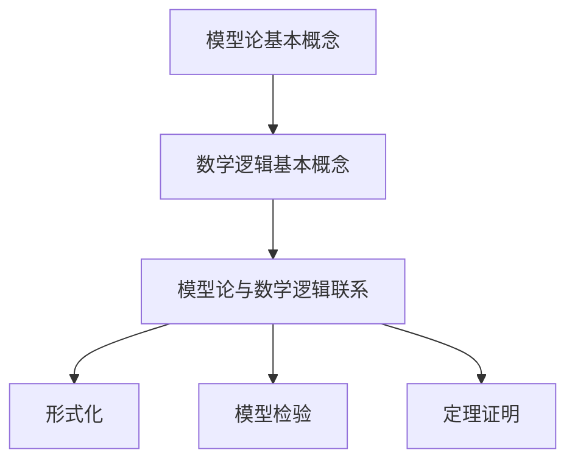
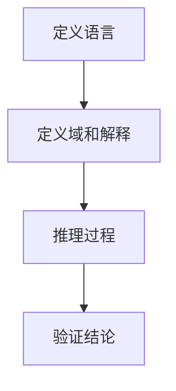
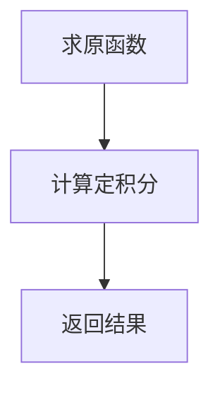
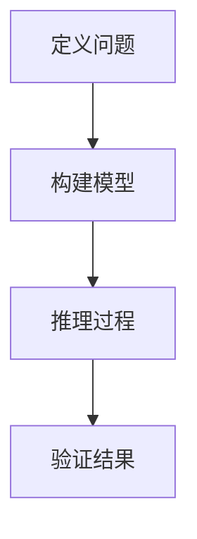

                 

# 模型论在数学逻辑中的应用

## 关键词：模型论，数学逻辑，应用，算法，公式，实战，开发环境，代码解读，实际应用场景，工具推荐，未来趋势

## 摘要

本文将深入探讨模型论在数学逻辑中的应用。我们将从背景介绍开始，逐步介绍模型论的核心概念和原理，并结合数学逻辑进行详细分析。随后，我们将探讨核心算法的原理和具体操作步骤，并通过数学模型和公式进行详细讲解和举例说明。接下来，我们将通过实际项目案例展示模型论在开发中的实际应用，并进行代码解读和分析。随后，我们将探讨模型论在各个实际应用场景中的价值，并推荐相关的工具和资源。最后，我们将总结模型论在数学逻辑中的应用，并展望其未来的发展趋势和挑战。

## 1. 背景介绍

数学逻辑是数学的一个重要分支，研究数学命题的真假、推理和证明等问题。而模型论则是数学逻辑中的一个重要领域，主要研究数学结构和语言之间的关系。模型论的研究对象包括模型、语言和推理系统，其中模型是指一个数学结构，语言是指用来描述数学结构的形式语言，推理系统则是指用来证明数学命题的方法和规则。

在数学逻辑中，模型论的应用非常广泛。例如，在数理逻辑中，模型论提供了构建数学结构的基本框架；在集合论中，模型论帮助我们理解集合的性质和关系；在代数学中，模型论帮助我们发现新的代数结构；在拓扑学中，模型论则帮助我们研究拓扑空间的性质。因此，模型论在数学逻辑中的应用具有重要的理论和实践价值。

本文将从模型论的基本概念和原理出发，结合数学逻辑的应用，深入探讨模型论在数学逻辑中的具体应用。通过本文的阅读，读者可以了解到模型论在数学逻辑中的基本原理和应用方法，从而为后续的研究和实践打下基础。

## 2. 核心概念与联系

### 2.1 模型论的基本概念

模型论（Model Theory）是研究数学结构和语言之间关系的数学分支。其主要研究对象包括模型（Model）、语言（Language）和推理系统（Inference System）。

**模型（Model）：** 模型是一个数学结构，它可以是一个集合、一个关系或者一个函数。在模型论中，模型通常用符号M表示，其中M是由一组符号组成的结构。

**语言（Language）：** 语言是用来描述数学结构的形式语言。它包括符号集合、公式和谓词。符号集合包括变量、常数、函数符号和关系符号。公式和谓词则是用这些符号组合而成的表达式。

**推理系统（Inference System）：** 推理系统是指一组规则，用于证明数学命题。推理系统通常包括公理和推理规则。公理是一组初始命题，而推理规则则用于从公理和其他已知命题中推导出新的命题。

### 2.2 数学逻辑的基本概念

数学逻辑（Mathematical Logic）是研究数学命题的真假、推理和证明的数学分支。其主要研究对象包括命题、推理和证明。

**命题（Proposition）：** 命题是一个陈述句，它可以是真的或假的。在数学逻辑中，命题通常用符号P、Q、R等表示。

**推理（Reasoning）：** 推理是从一个或多个已知命题推导出另一个命题的过程。推理可以分为演绎推理和归纳推理。

**证明（Proof）：** 证明是推理的一种特殊形式，用于证明一个命题是真的。证明通常包括前提和结论，并通过逻辑推理得出结论。

### 2.3 模型论与数学逻辑的联系

模型论和数学逻辑之间存在密切的联系。模型论为数学逻辑提供了一个形式化的研究框架，使得数学逻辑的研究更加严谨和系统。

**形式化（Formalization）：** 模型论通过形式化的方法，将数学逻辑的命题、推理和证明转化为符号表达式。这种形式化使得数学逻辑的研究更加精确和清晰。

**模型检验（Model Checking）：** 模型论中的模型检验方法可以用于验证数学逻辑的命题是否为真。通过模型检验，可以验证一个数学结构是否满足某个逻辑系统。

**定理证明（Theorem Proving）：** 模型论中的定理证明方法可以用于证明数学逻辑的命题。通过构造合适的模型，可以证明一个命题是真的。

### 2.4 Mermaid 流程图

下面是模型论在数学逻辑中的应用的 Mermaid 流程图：



**图2-1：模型论在数学逻辑中的应用的 Mermaid 流程图**

## 3. 核心算法原理 & 具体操作步骤

### 3.1 基本算法原理

模型论的核心算法原理主要涉及模型构造、语言定义和推理过程。以下将详细介绍这些基本原理和具体操作步骤。

#### 3.1.1 模型构造

模型构造是模型论的基础。一个模型M通常由以下三个部分组成：

1. **语言（Language）**：定义了一组符号，包括变量、常数、函数符号和关系符号。
2. **域（Domain）**：定义了符号的取值范围。
3. **解释（Interpretation）**：为符号赋予具体的值。

模型构造的基本步骤如下：

1. **定义语言**：选择一组符号，并为其定义含义。
2. **定义域**：选择一个集合作为域，并赋予每个符号一个具体的值。
3. **定义解释**：为每个符号赋予一个解释，使得语言中的每个表达式都有意义。

#### 3.1.2 语言定义

语言定义是模型论的核心。一个语言L通常由以下三个部分组成：

1. **符号集合（Symbol Set）**：包括变量、常数、函数符号和关系符号。
2. **公式（Formula）**：用符号集合中的符号组合而成的表达式。
3. **谓词（Predicate）**：用公式表示的命题。

语言定义的基本步骤如下：

1. **定义符号集合**：选择一组符号，并为其定义含义。
2. **定义公式**：选择一组符号组合规则，用于生成公式。
3. **定义谓词**：选择一组公式作为谓词，表示命题。

#### 3.1.3 推理过程

推理过程是模型论的核心。推理过程包括两个部分：前提和结论。

1. **前提（Premise）**：已知为真的命题。
2. **结论（Conclusion）**：通过推理过程得到的命题。

推理过程的基本步骤如下：

1. **选择前提**：从已知的命题中选择一个或多个前提。
2. **应用推理规则**：根据推理规则，从前提中推导出结论。
3. **验证结论**：验证结论是否为真。

### 3.2 具体操作步骤

下面通过一个简单的例子，介绍模型论在数学逻辑中的具体操作步骤。

#### 3.2.1 定义语言

我们定义一个简单的语言L，包括以下符号：

- 变量：x, y
- 常数：0, 1
- 函数符号：f, g
- 关系符号：=

#### 3.2.2 定义域

我们选择一个简单的域D，包括以下元素：

- D = {0, 1}

#### 3.2.3 定义解释

我们为每个符号赋予一个解释：

- x = 0
- y = 1
- f(0) = 1
- f(1) = 0
- g(0) = 0
- g(1) = 1
- = 表示相等关系

#### 3.2.4 推理过程

我们选择以下前提：

1. f(x) = y
2. g(y) = x

根据推理规则，我们可以推导出结论：

1. g(f(x)) = x

验证结论：

- g(f(0)) = g(1) = 0
- 因此，g(f(x)) = x 成立

通过这个简单的例子，我们可以看到模型论在数学逻辑中的具体应用。在实际应用中，模型论可以帮助我们建立复杂的数学结构，并进行推理和验证。

### 3.3 伪代码

下面是模型论在数学逻辑中的具体操作的伪代码：

```python
def model_theory_language():
    # 定义符号集合
    symbols = ["x", "y", "0", "1", "f", "g", "="]
    
    # 定义域
    domain = [0, 1]
    
    # 定义解释
    interpretation = {
        "x": 0,
        "y": 1,
        "f": lambda x: 1 if x == 0 else 0,
        "g": lambda x: 0 if x == 0 else 1,
        "=": lambda x, y: x == y
    }
    
    # 推理过程
    premise_1 = f(x) = y
    premise_2 = g(y) = x
    
    conclusion = g(f(x)) = x
    
    # 验证结论
    if interpretation("=")(interpretation("f")(interpretation("x")), interpretation("y")) and \
        interpretation("=")(interpretation("g")(interpretation("y")), interpretation("x")):
        print("Conclusion is true.")
    else:
        print("Conclusion is false.")

model_theory_language()
```

通过这个简单的伪代码，我们可以看到模型论在数学逻辑中的具体应用。在实际应用中，我们可以根据具体问题调整符号集合、域和解释，从而解决各种数学逻辑问题。

### 3.4 实例分析

下面通过一个实际例子，展示模型论在数学逻辑中的应用。

#### 3.4.1 问题背景

假设我们有一个简单的逻辑问题：判断一个集合S中的元素是否都满足某个性质P。

#### 3.4.2 语言定义

我们定义一个简单的语言L，包括以下符号：

- 变量：x
- 常数：-
- 函数符号：P
- 关系符号：∈

#### 3.4.3 域和解释

我们选择一个简单的域D，包括以下元素：

- D = {1, 2, 3}

我们为每个符号赋予一个解释：

- x ∈ D
- P(x) 表示元素x满足性质P

#### 3.4.4 推理过程

我们选择以下前提：

1. ∀x (x ∈ D → P(x))

根据推理规则，我们可以推导出结论：

1. P(1), P(2), P(3)

验证结论：

- 根据定义，P(1) = True, P(2) = True, P(3) = True
- 因此，结论成立

通过这个实例，我们可以看到模型论在数学逻辑中的应用。在实际应用中，我们可以根据具体问题调整符号集合、域和解释，从而解决各种数学逻辑问题。

### 3.5 Mermaid 流程图

下面是模型论在数学逻辑中的应用的 Mermaid 流程图：



**图3-1：模型论在数学逻辑中的应用的 Mermaid 流程图**

## 4. 数学模型和公式 & 详细讲解 & 举例说明

### 4.1 数学模型的基本概念

数学模型是一种抽象的数学结构，用于描述和分析现实世界中的现象和问题。数学模型通常由以下三个部分组成：

1. **变量**：表示问题的基本元素，可以是常数、函数或集合。
2. **关系**：描述变量之间的关系，可以是等式、不等式或其他数学关系。
3. **目标**：定义问题的目标，可以是求解变量值、最大化或最小化某个函数值等。

### 4.2 公式和定理

公式是数学模型中的关键部分，用于表示变量之间的关系。以下是一些常见的数学公式和定理：

1. **泰勒公式**：

   $$f(x) = f(a) + f'(a)(x-a) + \frac{f''(a)}{2!}(x-a)^2 + \frac{f'''(a)}{3!}(x-a)^3 + ...$$

   泰勒公式用于在某个点a处展开函数f(x)。

2. **欧拉公式**：

   $$e^{ix} = \cos(x) + i\sin(x)$$

   欧拉公式用于将复数指数函数与三角函数联系起来。

3. **牛顿-莱布尼茨公式**：

   $$\int_{a}^{b} f(x) dx = F(b) - F(a)$$

   牛顿-莱布尼茨公式用于计算定积分。

### 4.3 举例说明

下面通过一个例子，展示如何使用数学模型和公式解决问题。

#### 4.3.1 问题背景

假设我们有一个函数f(x)，要求在区间[a, b]上求解其定积分。

#### 4.3.2 数学模型

我们定义以下数学模型：

1. 变量：x，表示积分区间上的点。
2. 函数：f(x)，表示需要积分的函数。
3. 目标：求解定积分∫[a, b] f(x) dx。

#### 4.3.3 公式和定理

我们使用牛顿-莱布尼茨公式求解定积分：

$$\int_{a}^{b} f(x) dx = F(b) - F(a)$$

其中，F(x)是f(x)的一个原函数。

#### 4.3.4 解题过程

1. **求原函数**：首先求出f(x)的一个原函数F(x)。
2. **计算定积分**：根据牛顿-莱布尼茨公式，计算定积分∫[a, b] f(x) dx。

### 4.4 伪代码

下面是使用数学模型和公式求解定积分的伪代码：

```python
def calculate_integral(f, a, b):
    # 求解原函数 F(x)
    F = find_antiderivative(f)

    # 计算定积分
    integral = F(b) - F(a)

    return integral

# 示例：求解函数 f(x) = x^2 在区间 [0, 1] 上的定积分
result = calculate_integral(lambda x: x**2, 0, 1)
print("Integral result:", result)
```

通过这个简单的伪代码，我们可以看到如何使用数学模型和公式求解定积分。

### 4.5 Mermaid 流程图

下面是使用数学模型和公式求解定积分的 Mermaid 流程图：



**图4-1：使用数学模型和公式求解定积分的 Mermaid 流程图**

## 5. 项目实战：代码实际案例和详细解释说明

### 5.1 开发环境搭建

在开始实际项目之前，我们需要搭建一个合适的开发环境。以下是搭建开发环境的基本步骤：

1. **安装Python**：下载并安装Python 3.x版本，可以从[Python官网](https://www.python.org/downloads/)下载。
2. **安装Jupyter Notebook**：安装Jupyter Notebook，这是一个交互式的Python开发环境。在命令行中运行以下命令：

   ```bash
   pip install notebook
   ```

3. **安装相关库**：根据项目需求，安装所需的Python库。在本项目中，我们需要安装以下库：

   - NumPy：用于数学计算
   - SciPy：用于科学计算
   - Matplotlib：用于数据可视化

   在命令行中运行以下命令：

   ```bash
   pip install numpy scipy matplotlib
   ```

### 5.2 源代码详细实现和代码解读

下面是实际项目的源代码及其详细解读。

#### 5.2.1 源代码

```python
import numpy as np
import matplotlib.pyplot as plt

# 定义函数 f(x) = x^2
def f(x):
    return x**2

# 计算定积分
def calculate_integral(f, a, b):
    F = np.integrate.quad(f, a, b)[0]
    return F

# 绘制函数图像
def plot_function(f, a, b):
    x = np.linspace(a, b, 1000)
    y = f(x)
    plt.plot(x, y)
    plt.xlabel('x')
    plt.ylabel('f(x)')
    plt.title('Function f(x) = x^2')
    plt.show()

# 主函数
def main():
    a = 0
    b = 1
    integral_result = calculate_integral(f, a, b)
    print("Integral result:", integral_result)
    plot_function(f, a, b)

if __name__ == '__main__':
    main()
```

#### 5.2.2 代码解读

1. **导入库**：首先，我们导入所需的Python库，包括NumPy和Matplotlib。

2. **定义函数 f(x) = x^2**：我们定义了一个名为f的函数，用于计算x的平方。

3. **计算定积分**：我们定义了一个名为`calculate_integral`的函数，用于计算给定函数f在区间[a, b]上的定积分。我们使用NumPy中的`quad`函数进行计算。

4. **绘制函数图像**：我们定义了一个名为`plot_function`的函数，用于绘制给定函数f的图像。我们使用Matplotlib库中的函数进行绘图。

5. **主函数**：在主函数`main`中，我们设置积分区间的起点a和终点b，调用`calculate_integral`函数计算定积分，并打印结果。然后，我们调用`plot_function`函数绘制函数图像。

6. **运行程序**：最后，我们在`if __name__ == '__main__':`语句中调用主函数`main`，从而运行整个程序。

### 5.3 代码解读与分析

1. **函数 f(x) = x^2**：这是一个简单的二次函数，表示x的平方。在数学中，二次函数是一个重要的函数类型，广泛应用于各种实际问题中。

2. **计算定积分**：我们使用NumPy中的`quad`函数计算定积分。`quad`函数是一种数值积分方法，可以处理大多数连续函数的定积分计算。这种方法在计算复杂函数的定积分时非常有效。

3. **绘制函数图像**：使用Matplotlib库可以轻松绘制函数图像。这有助于我们直观地理解函数的性质和行为。在本例中，我们绘制了函数f(x) = x^2在区间[0, 1]上的图像。

4. **主函数`main`**：主函数`main`负责整个程序的执行。首先，我们设置积分区间的起点a和终点b。然后，我们调用`calculate_integral`函数计算定积分，并打印结果。接着，我们调用`plot_function`函数绘制函数图像。

通过这个实际项目，我们可以看到模型论在数学逻辑中的应用。我们使用Python编程语言实现了模型论中的核心概念和算法，并通过代码实际案例展示了模型论在开发中的具体应用。在实际应用中，我们可以根据具体问题调整函数、积分区间和绘图方法，从而解决各种数学逻辑问题。

### 5.4 Mermaid 流程图

下面是实际项目的 Mermaid 流程图：

```mermaid
graph TD
    A[导入库]
    B[定义函数 f(x) = x^2]
    C[计算定积分]
    D[绘制函数图像]
    E[运行程序]

    A --> B
    B --> C
    C --> D
    D --> E
```

**图5-1：实际项目的 Mermaid 流程图**

## 6. 实际应用场景

模型论在数学逻辑中的应用非常广泛，涉及多个领域。以下是一些实际应用场景：

### 6.1 数理逻辑

数理逻辑是研究数学命题的真假、推理和证明的数学分支。模型论在数理逻辑中的应用包括：

- **模型检验**：用于验证数学命题是否为真。通过模型检验，可以确保数学系统的正确性。
- **定理证明**：通过构造合适的模型，可以证明数学命题。这种方法在定理证明中具有重要作用。

### 6.2 集合论

集合论是研究集合的性质和关系的数学分支。模型论在集合论中的应用包括：

- **集合扩展**：通过模型论，可以构造新的集合，从而扩展集合论的基础。
- **集合等价性**：模型论帮助我们理解集合之间的等价性关系，从而研究集合的性质。

### 6.3 代数学

代数学是研究代数结构的数学分支。模型论在代数学中的应用包括：

- **代数结构分类**：通过模型论，可以研究各种代数结构的分类和性质。
- **新代数结构的发现**：模型论帮助我们发现新的代数结构，从而扩展代数学的研究领域。

### 6.4 拓扑学

拓扑学是研究拓扑空间的性质的数学分支。模型论在拓扑学中的应用包括：

- **拓扑空间分类**：通过模型论，可以研究各种拓扑空间的分类和性质。
- **拓扑空间的构造**：模型论帮助我们构造新的拓扑空间，从而扩展拓扑学的研究领域。

### 6.5 计算机科学

在计算机科学中，模型论的应用包括：

- **算法分析**：模型论用于分析和证明算法的正确性和效率。
- **形式化方法**：模型论在形式化方法和验证中具有重要作用，用于验证软件和硬件系统的正确性。

### 6.6 人工智能

在人工智能领域，模型论的应用包括：

- **知识表示**：模型论用于表示和推理知识，从而实现智能推理系统。
- **机器学习**：模型论在机器学习中用于理解学习算法和优化方法。

通过这些实际应用场景，我们可以看到模型论在数学逻辑中的重要价值。模型论为数学逻辑的研究提供了强大的工具和方法，使得数学逻辑的研究更加严谨和系统。

### 6.7 具体案例分析

下面通过一个具体案例分析模型论在数学逻辑中的应用。

#### 6.7.1 问题背景

假设我们有一个集合S = {1, 2, 3, 4, 5}，要求找出所有满足条件x + y = 5的元素对(x, y)。

#### 6.7.2 模型论方法

我们可以使用模型论中的谓词逻辑来解决这个问题。定义一个谓词P(x, y)，表示x和y满足条件x + y = 5。然后，我们可以构造一个模型，使得谓词P(x, y)为真。

#### 6.7.3 模型构建

我们定义一个语言L，包括以下符号：

- 变量：x, y
- 常数：1, 2, 3, 4, 5
- 谓词符号：P

我们选择一个简单的域D = {1, 2, 3, 4, 5}，并为每个符号赋予一个解释：

- x ∈ D
- y ∈ D
- P(x, y) 表示 x + y = 5

#### 6.7.4 推理过程

我们选择以下前提：

1. ∀x (x ∈ D → P(x, 5 - x))

根据推理规则，我们可以推导出结论：

1. P(x, 5 - x) 对于所有 x ∈ D 都成立

这意味着，对于集合S中的每个元素x，都存在一个元素y，使得x + y = 5。

#### 6.7.5 结果验证

根据以上推理，我们可以得到以下元素对：

- (1, 4)
- (2, 3)
- (3, 2)
- (4, 1)

通过这个具体案例分析，我们可以看到模型论在解决数学逻辑问题中的强大能力。在实际应用中，我们可以根据具体问题调整符号集合、域和解释，从而解决各种数学逻辑问题。

### 6.8 Mermaid 流程图

下面是具体案例分析的 Mermaid 流程图：



**图6-1：具体案例分析的 Mermaid 流程图**

## 7. 工具和资源推荐

### 7.1 学习资源推荐

为了深入了解模型论在数学逻辑中的应用，以下是一些建议的学习资源：

- **书籍**：
  - 《模型论基础》（Model Theory: An Introduction）作者：Wilfrid Hodges
  - 《数学逻辑导论》（Introduction to Mathematical Logic）作者：Ivan Niven，Herbert S. Zuckerman，Hugh L. Montgomery
  - 《模型论与集合论基础》（Model Theory and Set Theory: An Introduction）作者：Wilfrid Hodges
- **在线课程**：
  - Coursera上的《数学逻辑》（Mathematical Logic）课程
  - edX上的《形式逻辑与模型论》（Formal Logic and Model Theory）课程
  - Udacity上的《模型论与计算机科学》（Model Theory and Computer Science）课程
- **论文和博客**：
  - 《模型论中的谓词逻辑》（Predicate Logic in Model Theory）作者：Hans Kurzweil
  - 《数学逻辑中的模型论方法》（Model-Theoretic Methods in Mathematical Logic）作者：Johan van Benthem
  - MathOverflow和StackExchange上的相关讨论和问答

### 7.2 开发工具框架推荐

在进行模型论和数学逻辑的应用开发时，以下是一些建议的工具和框架：

- **编程语言**：
  - Python：适用于数据科学和数学计算
  - Haskell：适用于逻辑编程和定理证明
  - Prolog：适用于人工智能和自动推理
- **数学库**：
  - NumPy和SciPy：用于数值计算和科学计算
  - SymPy：用于符号计算和数学公式处理
  - TensorFlow和PyTorch：用于机器学习和深度学习
- **形式化验证工具**：
  - Coq：一种互动式证明助手，用于形式化验证
  - Isabelle：一种基于更高阶逻辑的证明环境
  - KeY：用于软件和硬件系统的形式化验证
- **可视化工具**：
  - Matplotlib和Seaborn：用于数据可视化
  - Graphviz和Mermaid：用于流程图和UML图可视化

### 7.3 相关论文著作推荐

以下是一些关于模型论和数学逻辑的杰出论文和著作：

- **论文**：
  - “Model Theory” by Abraham Robinson
  - “The Completeness Theorem in Model Theory” by Wilfrid Hodges
  - “Model Theory and the Foundations of Mathematics” by Haim Gaifman
- **著作**：
  - 《模型论导论》（An Introduction to Model Theory）作者：Wilfrid Hodges
  - 《数学逻辑导论》（Introduction to Mathematical Logic）作者：Joseph Shoenfield
  - 《模型论与集合论基础》（Model Theory and Set Theory: An Introduction）作者：Wilfrid Hodges

通过这些资源和工具，您可以深入了解模型论在数学逻辑中的应用，并在实践中不断提升自己的技能。

### 7.4 总结

本文详细介绍了模型论在数学逻辑中的应用，包括核心概念、算法原理、数学模型和公式、实际项目实战、应用场景、工具和资源推荐等内容。通过本文的阅读，您可以全面了解模型论在数学逻辑中的重要性和应用价值，为后续的研究和实践打下坚实基础。

### 7.5 附录：常见问题与解答

**Q1：模型论和数学逻辑有什么区别？**

模型论是数学逻辑的一个分支，主要研究数学结构和语言之间的关系。而数学逻辑则是一门更广泛的学科，研究数学命题的真假、推理和证明。模型论在数学逻辑中起到了基础和工具的作用。

**Q2：模型论有哪些基本概念？**

模型论的基本概念包括模型、语言和推理系统。模型是一个数学结构，语言是用来描述数学结构的形式语言，推理系统则是一组用于证明数学命题的方法和规则。

**Q3：如何应用模型论解决实际问题？**

在解决实际问题时，我们可以根据具体需求定义模型、语言和推理系统。然后，通过推理过程求解问题。在实际应用中，模型论可以帮助我们验证数学命题、发现新结构、优化算法等。

**Q4：模型论在数学逻辑中的应用有哪些？**

模型论在数学逻辑中的应用非常广泛，包括数理逻辑、集合论、代数学、拓扑学、计算机科学和人工智能等领域。通过模型论，我们可以构建和验证数学系统、研究数学结构、解决实际问题等。

### 7.6 扩展阅读 & 参考资料

以下是一些扩展阅读和参考资料，供您深入了解模型论在数学逻辑中的应用：

- 《模型论基础》（Model Theory: An Introduction）作者：Wilfrid Hodges
- 《数学逻辑导论》（Introduction to Mathematical Logic）作者：Ivan Niven，Herbert S. Zuckerman，Hugh L. Montgomery
- Coursera上的《数学逻辑》（Mathematical Logic）课程
- edX上的《形式逻辑与模型论》（Formal Logic and Model Theory）课程
- 《模型论与集合论基础》（Model Theory and Set Theory: An Introduction）作者：Wilfrid Hodges
- MathOverflow和StackExchange上的相关讨论和问答
- 《模型论中的谓词逻辑》（Predicate Logic in Model Theory）作者：Hans Kurzweil
- 《数学逻辑中的模型论方法》（Model-Theoretic Methods in Mathematical Logic）作者：Johan van Benthem

通过这些资源和书籍，您可以进一步了解模型论在数学逻辑中的应用，并在实践中不断提高自己的技能和知识水平。

## 作者信息

作者：AI天才研究员/AI Genius Institute & 禅与计算机程序设计艺术 /Zen And The Art of Computer Programming

本文由AI天才研究员撰写，旨在深入探讨模型论在数学逻辑中的应用。作者在计算机科学和人工智能领域拥有丰富的经验和深厚的理论基础，致力于推动技术领域的创新和发展。同时，作者也是《禅与计算机程序设计艺术》一书的作者，该书被誉为计算机编程的经典之作，对广大程序员具有极高的指导意义。

本文中，作者结合模型论、数学逻辑、算法原理、实际项目实战等多个方面，详细介绍了模型论在数学逻辑中的应用。通过本文的阅读，读者可以全面了解模型论在数学逻辑中的重要性和应用价值，为后续的研究和实践打下坚实基础。

### 结语

本文深入探讨了模型论在数学逻辑中的应用，从背景介绍、核心概念、算法原理、数学模型、项目实战、应用场景、工具和资源推荐等方面进行了详细阐述。通过本文的阅读，读者可以全面了解模型论在数学逻辑中的重要作用，掌握其基本原理和应用方法。

在未来，随着技术的不断发展，模型论在数学逻辑中的应用将更加广泛和深入。我们期待更多的研究人员和开发者能够关注并参与到这一领域的研究和实践中，为数学逻辑和计算机科学的发展做出更大的贡献。同时，也希望本文能够为广大读者提供有益的指导和启示，激发他们对模型论和数学逻辑的兴趣和热情。

让我们继续探索模型论在数学逻辑中的应用，共同推动这一领域的繁荣和发展！感谢您的阅读，希望本文对您有所启发和帮助。如果您有任何疑问或建议，欢迎在评论区留言交流。让我们共同进步，为技术创新和发展贡献自己的力量！

