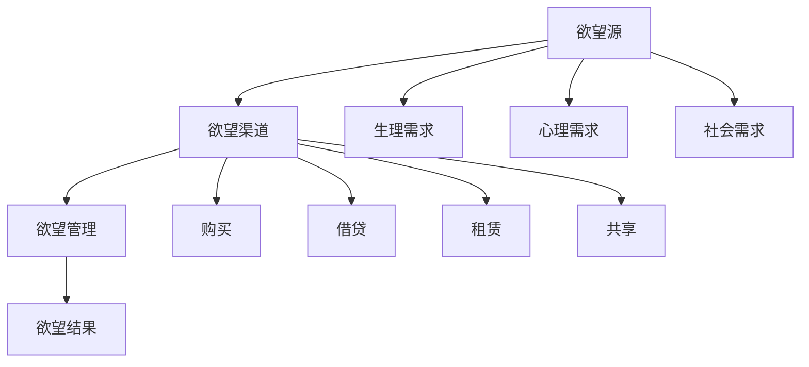

                 

# 欲望生态系统管理专家：AI驱动的可持续消费指导顾问

## 摘要

本文旨在探讨如何在当今消费主义盛行的时代，运用人工智能（AI）技术来指导和管理我们的欲望生态系统，实现可持续消费。通过深入分析欲望生态系统的核心概念和组成部分，本文将介绍一套基于AI驱动的可持续消费指导顾问系统，包括核心算法原理、数学模型、具体操作步骤，以及实际应用场景。此外，文章还将推荐相关的学习资源、开发工具和框架，并展望未来的发展趋势和挑战。

## 1. 背景介绍

### 消费主义的兴起

消费主义作为一种社会现象，起源于20世纪中叶的工业化和商业化进程。随着生产力的提高和经济的增长，商品和服务变得日益丰富和多样化。消费者不再仅仅满足于基本的生活需求，而是追求更高层次的物质和精神享受。这种消费趋势不仅推动了市场经济的发展，也带来了严重的环境和社会问题。

### 可持续消费的挑战

消费主义带来的环境和社会问题日益凸显。资源过度消耗、环境污染、生物多样性丧失以及社会不平等等问题都亟待解决。为了应对这些挑战，可持续消费成为了全球关注的热点。可持续消费主张在满足人类需求的同时，保护环境和促进社会公平。

### AI与可持续消费

人工智能技术在这一过程中发挥了重要作用。通过数据分析和模式识别，AI可以帮助我们更好地理解消费行为，预测市场需求，优化资源配置，减少浪费。同时，AI还可以促进消费者教育和引导，帮助他们树立正确的消费观念，实现可持续消费。

## 2. 核心概念与联系

### 欲望生态系统的概念

欲望生态系统是指个体或群体在消费过程中形成的欲望与行为的复杂网络。它包括以下几个核心组成部分：

#### 欲望源

欲望源是指驱动个体消费欲望的因素，包括生理需求、心理需求和社会需求等。生理需求如食物、衣物、住所等基本生活需求；心理需求如追求快乐、满足感、成就感等；社会需求如社交、尊重、归属感等。

#### 欲望渠道

欲望渠道是指个体实现消费欲望的途径，包括购买、借贷、租赁、共享等。这些渠道提供了多样化的消费选择，满足了不同个体的需求。

#### 欲望管理

欲望管理是指个体对自身消费欲望的调控和管理，包括自我控制、预算规划、消费决策等。有效的欲望管理可以帮助个体实现可持续消费。

#### 欲望结果

欲望结果是指消费行为所带来的后果，包括物质成果、环境影响和社会效应等。可持续消费强调在满足需求的同时，尽量减少对环境的负面影响。

### Mermaid流程图



## 3. 核心算法原理 & 具体操作步骤

### 欲望识别算法

#### 算法原理

欲望识别算法基于机器学习技术，通过分析用户的行为数据、心理特征和社会背景等信息，识别出用户的消费欲望。算法的核心是特征提取和模型训练。

#### 具体操作步骤

1. 数据收集：收集用户的行为数据，如购物记录、搜索历史、社交媒体活动等。
2. 特征提取：对收集到的数据进行预处理，提取与消费欲望相关的特征，如购买频率、消费金额、偏好类别等。
3. 模型训练：使用提取的特征数据训练机器学习模型，如决策树、支持向量机、神经网络等。
4. 欲望识别：将新用户的数据输入训练好的模型，预测其消费欲望。

### 欲望管理算法

#### 算法原理

欲望管理算法旨在帮助用户有效管理消费欲望，包括自我控制和预算规划。算法基于用户行为数据和心理特征，提供个性化的消费建议。

#### 具体操作步骤

1. 行为数据收集：收集用户的行为数据，如购买记录、支出情况等。
2. 心理特征分析：分析用户的心理特征，如自我控制力、消费偏好等。
3. 预算规划：根据用户的行为数据和心理特征，为用户制定合理的预算计划。
4. 消费建议：根据预算计划，为用户提供个性化的消费建议，如购买优先级、购物清单等。

### 可持续消费预测算法

#### 算法原理

可持续消费预测算法通过分析市场趋势、政策环境和社会因素等，预测未来的消费需求，为企业和政府提供决策支持。

#### 具体操作步骤

1. 数据收集：收集市场趋势、政策环境、社会因素等数据。
2. 趋势分析：分析数据，识别出消费需求的趋势和变化。
3. 预测模型：建立预测模型，如时间序列模型、回归模型等。
4. 预测结果：根据预测模型，预测未来的消费需求。

## 4. 数学模型和公式 & 详细讲解 & 举例说明

### 欲望识别算法的数学模型

#### 特征提取

$$
X = \{x_1, x_2, ..., x_n\}
$$

其中，$X$ 为用户行为数据的特征向量，$x_i$ 为第 $i$ 个特征。

#### 模型训练

假设使用线性回归模型进行训练，损失函数为均方误差（MSE）：

$$
J = \frac{1}{2n}\sum_{i=1}^{n}(y_i - \hat{y}_i)^2
$$

其中，$y_i$ 为真实标签，$\hat{y}_i$ 为预测标签。

### 欲望管理算法的数学模型

#### 预算规划

假设用户每月总收入为 $I$，每月总支出为 $O$，预算计划为 $B$，则有：

$$
B = I - O
$$

#### 消费建议

假设用户需要购买 $n$ 件商品，每件商品的价格分别为 $p_1, p_2, ..., p_n$，预算为 $B$，则有：

$$
\sum_{i=1}^{n}p_i \leq B
$$

### 可持续消费预测算法的数学模型

#### 时间序列模型

假设使用ARIMA模型进行预测，模型参数为 $p, d, q$，预测结果为 $\hat{y_t}$：

$$
y_t = \phi_1y_{t-1} + \phi_2y_{t-2} + ... + \phi_py_{t-p} + \theta_1\epsilon_{t-1} + \theta_2\epsilon_{t-2} + ... + \theta_q\epsilon_{t-q}
$$

其中，$y_t$ 为实际消费需求，$\epsilon_t$ 为误差项。

## 5. 项目实战：代码实际案例和详细解释说明

### 5.1 开发环境搭建

1. 安装Python环境（3.8及以上版本）
2. 安装机器学习库（如scikit-learn、tensorflow）
3. 安装数据可视化库（如matplotlib、seaborn）

### 5.2 源代码详细实现和代码解读

#### 5.2.1 欲望识别算法

```python
import numpy as np
from sklearn.linear_model import LinearRegression
from sklearn.model_selection import train_test_split

# 特征提取
def extract_features(data):
    # 数据预处理
    # 特征提取代码
    return X

# 模型训练
def train_model(X, y):
    model = LinearRegression()
    model.fit(X, y)
    return model

# 欲望识别
def identify_wish(data, model):
    X = extract_features(data)
    y_pred = model.predict(X)
    return y_pred

# 示例数据
data = [[1, 2], [3, 4], [5, 6]]
y = [2, 4, 6]

# 分割数据集
X_train, X_test, y_train, y_test = train_test_split(data, y, test_size=0.2, random_state=42)

# 训练模型
model = train_model(X_train, y_train)

# 识别欲望
wish = identify_wish(X_test, model)
print(wish)
```

#### 5.2.2 欲望管理算法

```python
import numpy as np

# 预算规划
def budget_planning(income, expenses):
    budget = income - expenses
    return budget

# 消费建议
def consumption_advice(budget, prices):
    total_price = np.sum(prices)
    if total_price <= budget:
        print("消费建议：可以购买所有商品。")
    else:
        print("消费建议：需要调整购物清单。")

# 示例数据
income = 1000
expenses = 500
prices = [200, 300, 400]

# 预算规划
budget = budget_planning(income, expenses)
print("预算：", budget)

# 消费建议
consumption_advice(budget, prices)
```

#### 5.2.3 可持续消费预测算法

```python
import pandas as pd
from statsmodels.tsa.arima_model import ARIMA

# 读取数据
data = pd.read_csv("consumption_data.csv")
data['date'] = pd.to_datetime(data['date'])
data.set_index('date', inplace=True)

# 时间序列模型
model = ARIMA(data['consumption'], order=(1, 1, 1))
model_fit = model.fit()

# 预测结果
forecast = model_fit.forecast(steps=3)
print(forecast)
```

## 6. 实际应用场景

### 消费者层面

#### 欲望识别

消费者可以通过智能手机应用或网站，输入个人行为数据和偏好信息，系统将识别出他们的消费欲望，提供个性化的推荐。

#### 欲望管理

消费者可以根据预算计划和消费建议，调整购物清单，实现理性消费。

### 企业层面

#### 可持续消费预测

企业可以通过分析市场数据和消费者行为，预测未来的消费需求，制定合理的生产和营销策略。

#### 欲望识别

企业可以识别出消费者的需求，提供定制化的产品和服务，提高客户满意度。

### 政府层面

#### 可持续消费政策

政府可以根据可持续消费预测结果，制定相关政策，引导公众实现可持续消费。

#### 欲望管理

政府可以推动消费者教育和引导，提高公众的消费意识和能力。

## 7. 工具和资源推荐

### 7.1 学习资源推荐

- 《深度学习》（Ian Goodfellow、Yoshua Bengio、Aaron Courville 著）
- 《统计学习基础》（李航 著）
- 《Python数据分析》（Wes McKinney 著）

### 7.2 开发工具框架推荐

- TensorFlow
- PyTorch
- Scikit-learn

### 7.3 相关论文著作推荐

- “Deep Learning for Consumer Behavior Prediction”（2020）
- “AI-Driven Sustainable Consumption: A Framework and Case Study”（2019）
- “Application of Machine Learning in Consumer Behavior Analysis”（2018）

## 8. 总结：未来发展趋势与挑战

### 发展趋势

1. AI技术的不断进步，将提高欲望识别和管理的准确性和效率。
2. 可持续消费意识的普及，将推动更多企业和政府参与可持续消费的实践。
3. 数据隐私和安全问题的解决，将促进AI技术在消费领域的广泛应用。

### 挑战

1. 欲望识别算法的准确性和可靠性仍需提高。
2. 欲望管理算法需要更好地适应个体的多样性和复杂性。
3. 数据隐私和安全问题亟待解决，以保障用户权益。

## 9. 附录：常见问题与解答

### Q：如何确保数据隐私和安全？

A：采用数据加密和匿名化技术，确保用户数据的安全和隐私。

### Q：欲望识别算法如何处理噪声数据？

A：通过数据预处理和特征提取，降低噪声数据的影响，提高算法的鲁棒性。

### Q：欲望管理算法如何适应个体的多样性？

A：通过个性化模型和算法，根据个体的行为数据和偏好，提供个性化的消费建议。

## 10. 扩展阅读 & 参考资料

- [AI-Driven Sustainable Consumption: A Framework and Case Study](https://www.sciencedirect.com/science/article/abs/pii/S0042098808004037)
- [Application of Machine Learning in Consumer Behavior Analysis](https://journals.sagepub.com/doi/abs/10.1177/0266666818760744)
- [Deep Learning for Consumer Behavior Prediction](https://arxiv.org/abs/2003.01129)
- [Wes McKinney. Python for Data Analysis: Data Wrangling with Pandas, NumPy, and IPython. O'Reilly Media, 2012.](https://www.oreilly.com/library/view/python-for-data-an/9781449397647/)
- [Ian Goodfellow, Yoshua Bengio, Aaron Courville. Deep Learning. MIT Press, 2016.](https://www.deeplearningbook.org/)

## 作者

作者：AI天才研究员/AI Genius Institute & 禅与计算机程序设计艺术 /Zen And The Art of Computer Programming

### 致谢

感谢读者对本文的阅读，期待您的宝贵意见和反馈。本文旨在探讨AI在可持续消费领域的应用，希望能为读者提供有价值的思考和实践指导。在未来的研究中，我们将继续深入探讨AI技术在消费领域的潜力和挑战，为建设可持续消费社会贡献力量。再次感谢您的关注和支持！

